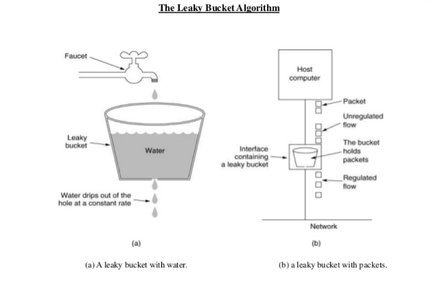
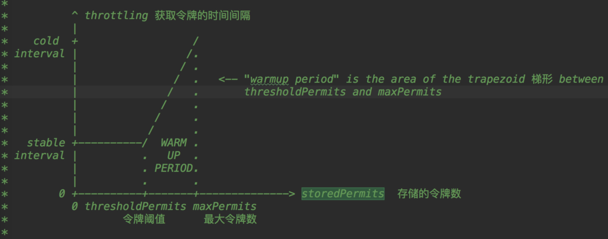

## 1. 开头
Guava RateLimiter 是如何解决高并发场景下的限流问题的

## 2. 限流算法

### 2.1. 标准令牌桶算法  
其核心思想是要想通过限流器，必须拿到令牌。它有个容量和速率，因此它有两个核心点：
* 限流器允许的最大突发流量
* 超过容量后，后续的流量只能按照速率令牌桶的速率通过限流器


### 2.2. 漏桶算法 
  
从上图中，我们可以看到，就像一个漏斗一样，进来的水量就好像访问流量一样，而出去的水量就像是我们的系统处理请求一样。当访问流量过大时，这个漏斗中就会积水，如果水太多了就会溢出。漏桶算法的实现往往依赖于队列，请求到达如果队列未满则直接放入队列，然后有一个处理器按照固定频率从队列头取出请求进行处理。如果请求量大，则会导致队列满，那么新来的请求就会被抛弃

## 3. guava令牌桶原理
### 3.1. 流速为1的实现
只需要记录一个下一令牌产生的时间，并动态更新它，就能够轻松完成限流功能。其核心机制为：
* reserve() 方法，这个方法会为请求令牌的线程预分配令牌，同时返回该线程能够获取令牌的时间。
* 如果线程请求令牌的时间在下一令牌产生时间之后，那么该线程立刻就能够获取令牌；
* 反之，如果请求时间在下一令牌产生时间之前，那么该线程是在下一令牌产生的时间获取令牌。
* 由于此时下一令牌已经被该线程预占，所以下一令牌产生的时间需要加上 1 秒
```
class SimpleLimiter {
  // 下一令牌产生时间
  long next = System.nanoTime();
  // 发放令牌间隔：纳秒
  long interval = 1000_000_000;
  // 预占令牌，返回能够获取令牌的时间
  synchronized long reserve(long now){
    // 请求时间在下一令牌产生时间之后
    // 重新计算下一令牌产生时间
    if (now > next){
      // 将下一令牌产生时间重置为当前时间
      next = now;
    }
    // 能够获取令牌的时间
    long at=next;
    // 设置下一令牌产生时间
    next += interval;
    // 返回线程需要等待的时间
    return Math.max(at, 0L);
  }
  // 申请令牌
  void acquire() {
    // 申请令牌时的时间
    long now = System.nanoTime();
    // 预占令牌
    long at=reserve(now);
    long waitTime=max(at-now, 0);
    // 按照条件等待
    if(waitTime > 0) {
      try {
        TimeUnit.NANOSECONDS
          .sleep(waitTime);
      }catch(InterruptedException e){
        e.printStackTrace();
      }
    }
  }
}
```
### 3.2. 流速为n的实现  
* 我们增加了一个resync() 方法，如果线程请求令牌的时间在下一令牌产生时间之后，会重新计算令牌桶中的令牌数
* 新产生的令牌的计算公式是：(now-next)/interval，你可对照上面的示意图来理解。
* reserve() 方法中，则增加了先从令牌桶中出令牌的逻辑，不过需要注意的是，如果令牌是从令牌桶中出的，那么 next 就无需增加一个 interval 了。
```
class SimpleLimiter {
  // 当前令牌桶中的令牌数量
  long storedPermits = 0;
  // 令牌桶的容量
  long maxPermits = 3;
  // 下一令牌产生时间
  long next = System.nanoTime();
  // 发放令牌间隔：纳秒
  long interval = 1000_000_000;
  
  // 请求时间在下一令牌产生时间之后, 则
  // 1. 重新计算令牌桶中的令牌数
  // 2. 将下一个令牌发放时间重置为当前时间
  void resync(long now) {
    if (now > next) {
      // 新产生的令牌数
      long newPermits=(now-next)/interval;
      // 新令牌增加到令牌桶
      storedPermits=min(maxPermits, 
        storedPermits + newPermits);
      // 将下一个令牌发放时间重置为当前时间
      next = now;
    }
  }
  // 预占令牌，返回能够获取令牌的时间
  synchronized long reserve(long now){
    resync(now);
    // 能够获取令牌的时间
    long at = next;
    // 令牌桶中能提供的令牌
    long fb=min(1, storedPermits);
    // 令牌净需求：首先减掉令牌桶中的令牌
    long nr = 1 - fb;
    // 重新计算下一令牌产生时间
    next = next + nr*interval;
    // 重新计算令牌桶中的令牌
    this.storedPermits -= fb;
    return at;
  }
  // 申请令牌
  void acquire() {
    // 申请令牌时的时间
    long now = System.nanoTime();
    // 预占令牌
    long at=reserve(now);
    long waitTime=max(at-now, 0);
    // 按照条件等待
    if(waitTime > 0) {
      try {
        TimeUnit.NANOSECONDS
          .sleep(waitTime);
      }catch(InterruptedException e){
        e.printStackTrace();
      }
    }
  }
}
```


## 4. guava限流预热
Guava RateLimiter 扩展了标准的令牌桶算法，比如还能支持预热功能。对于按需加载的缓存来说，预热后缓存能支持 5 万 TPS 的并发，但是在预热前 5 万 TPS 的并发直接就把缓存击垮了，所以如果需要给该缓存限流，限流器也需要支持预热功能，在初始阶段，限制的流速 r 很小，但是动态增长的。预热功能的实现非常复杂，Guava 构建了一个积分函数来解决这个问题 .系统冷启动后慢慢的趋于平均固定速率（即刚开始速率慢一些，然后慢慢趋于我们设置的固定速率
  

* x轴	表示令牌桶中的令牌数量
* y轴	生产一个令牌需要的时间（秒）
* stableInterval	稳定生产一个令牌需要的时间
* coldInterval	生产一个令牌需要的最大时长，与冷启动因子coldFactor有关，可以通过-Dcsp.
* sentinel.flow.cold.factor设置，默认为3。
* warmUpPeriodInSec	预热时长，默认为10秒。对应到坐标图中为（2）梯形面积
* thresholdPermits(warningToken)	令牌桶中的一个阈值，超过该值时开启预热
* maxPermits(maxToken)	令牌桶中最大令牌数  

当令牌桶中的令牌数小于thresholdPermits(warningToken)时，令牌按照固定速率生产，请求流量稳定。当令牌数大于thresholdPermits(warningToken)时，开启预热。此段时期，生产的令牌的速率小于令牌滑落的速度，一段时间后，令牌小于等于thresholdPermits(warningToken)，请求回归到稳定状态，预热结束

横坐标是令牌桶的当前容量，纵坐标是令牌发放速率，我们先从横坐标来分析

横坐标
下面两种场景会导致横坐标的变化：

闲时流量 流量较小或者压根没流量的时候，横坐标会逐渐向右移动，表示令牌桶中令牌数量增多
忙时流量 当访问流量增大的时候，横坐标向左移动，令牌桶中令牌数量变少
横轴有两个重要的坐标，一个是最右侧的“令牌桶最大容量”，这个不难理解。还有一个是Half容量，它是一个关键节点，会影响令牌发放速率。
纵坐标
纵坐标表示令牌的发放速率，这里有3个标线，分别是稳定时间间隔，2倍间隔，3倍间隔。
这里间隔的意思就是隔多长时间发放一个令牌，而所谓稳定间隔就是一个基准时间间隔。假如我们设置了每秒10个令牌的限流规则，那么稳定间隔也就是1s/10=0.1秒，也就是说每隔0.1秒发一个令牌。相应的，3倍间隔的数值是用稳定间隔乘以系数3，比如上面这个例子中3倍间隔就是0.3秒。

运作模式
了解了横坐标和纵坐标的含义之后，让我们来试着理解预热模型的用例。继续沿用上面10r/s的限流设置，稳定间隔=0.1s，3x间隔是0.3s。
我们先考虑闲时到忙时的流量转变，假定当前我们处于闲时流量阶段，没几个访问请求，这时令牌桶是满的。接着在下一秒突然涌入了10个请求，这些请求开始消耗令牌桶中的令牌。在初始阶段，令牌的放行速度比较慢，在第一个令牌被消耗以后，后面的请求要经过3x时间间隔也就是0.3s才会获取第二块令牌。随着令牌桶中令牌数量被逐渐消耗，当令牌存量下降到最大容量一半的时候（Half位置），令牌放行的速率也会提升，以稳定间隔0.1s发放令牌。
反过来也一样，在流量从忙时转变为闲时的过程中，令牌发放速率是由快到慢逐渐变化。起始阶段的令牌放行间隔是0.1s，随着令牌桶内令牌逐渐增多，当令牌的存量积累到最大容量的一半后，放行令牌的时间间隔进一步增大为0.3s。
RateLimiter正是通过这种方式来控制令牌发放的时间间隔，从而使流量的变化更加平滑

## 5. 总结  
* 令牌桶算法  
  令牌桶算法是定时向令牌桶发送令牌，请求能够从令牌桶中拿到令牌，然后才能通过限流器.允许突发请求，只要有令牌就可以处理，支持一次拿3个令牌，4个令牌
* 漏桶算法  
  请求就像水一样注入漏桶，漏桶会按照一定的速率自动将水漏掉，只有漏桶里还能注入水的时候，请求才能通过限流器.按照常量固定速率流出请求，流入请求速率任意，当流入的请求数累积到漏桶容量时，则新流入的请求被拒绝；


参考文章:https://www.cnblogs.com/kexianting/p/13094783.html
https://blog.csdn.net/gaoliang1719/article/details/109475738