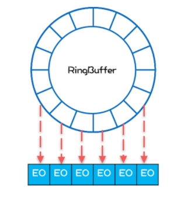
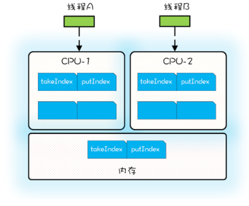

## 1. 开头  
&emsp;&emsp;ArrayBlockingQueue 和 LinkedBlockingQueue基于ReentrantLock 实现，在高并发场景下，锁的效率并不高。Disruptor 是一款高性能的有界内存队列是一款适用于高并发场景的队列替代品

## 2. 简单上手
&emsp;&emsp;相较而言，Disruptor 的使用比 Java SDK 提供 BlockingQueue 要复杂一些，但是总体思路还是一致的。使用特点如下：  
* 在 Disruptor 中，生产者生产的对象（也就是消费者消费的对象）称为 Event，使用 Disruptor 必须自定义 Event，例如示例代码的自定义 Event 是 LongEvent
* 构建 Disruptor 对象除了要指定队列大小外，还需要传入一个 EventFactory，示例代码中传入的是LongEvent::new
* 消费 Disruptor 中的 Event 需要通过 handleEventsWith() 方法注册一个事件处理器，发布 Event 则需要通过 publishEvent() 方法  

```
// 自定义 Event
class LongEvent {
  private long value;
  public void set(long value) {
    this.value = value;
  }
}
// 指定 RingBuffer 大小,
// 必须是 2 的 N 次方
int bufferSize = 1024;
 
// 构建 Disruptor
Disruptor<LongEvent> disruptor = new Disruptor<>(LongEvent::new, bufferSize, DaemonThreadFactory.INSTANCE);
 
// 注册事件处理器
disruptor.handleEventsWith((event, sequence, endOfBatch) -> {
    System.out.println("E: "+event));
}

// 启动 Disruptor
disruptor.start();
 
// 获取 RingBuffer
RingBuffer<LongEvent> ringBuffer = disruptor.getRingBuffer();
// 生产 Event
ByteBuffer bb = ByteBuffer.allocate(8);

for (long l = 0; true; l++){
  bb.putLong(0, l);
  // 生产者生产消息
  ringBuffer.publishEvent((event, sequence, buffer) -> {
    event.set(buffer.getLong(0)), bb);
  }
  Thread.sleep(1000);
}
```


## 3. 机制  

Disruptor为什么性能比普通的队列要高呢？主要是有这么几点。   
* 内存分配更加合理，使用 RingBuffer 数据结构，数组元素在初始化时一次性全部创建，提升缓存命中率；对象循环利用，避免频繁 GC。
* 能够避免伪共享，提升缓存利用率。
* 采用无锁算法，避免频繁加锁、解锁的性能消耗。
* 支持批量消费，消费者可以无锁方式消费多个消息。  


### 3.1. RingBuffer数据结构

RingBuffer 本质上也是数组。为什么也能提升性能，主要是这个数组做了些优化。  
在计算机有两个理论：  
* 某条指令一旦被执行，不久之后这条指令很可能再次被执行；如果某条数据被访问，不久之后这条数据很可能再次被访问  
* 某块内存一旦被访问，不久之后这块内存附近的内存也很可能被访问  


CPU 的缓存就利用了程序的局部性原理，CPU 从内存中加载数据 X 时，会将数据 X 缓存在高速缓存 Cache 中，实际上 CPU 缓存 X 的同时，还缓存了 X 周围的数据。RingBuffer也是借助这个原理来实现高性能的。它是如何做的呢？  
&emsp;&emsp;ArrayBlockingQueue生产元素创建对象的时候分配的内存是不连续的，因为创建这些元素的时间基本上是离散的，所以这些元素的内存地址大概率也不是连续的，这样操作系统无法加载更准确的对象到缓存中。  
&emsp;&emsp;Disruptor初始化时是一次性全部创建数组中的所有元素，这些元素的内存地址大概率是连续的。  
```
for (int i=0; i<bufferSize; i++){
  //entries[] 就是 RingBuffer 内部的数组
  //eventFactory 就是前面示例代码中传入的 LongEvent::new
  entries[BUFFER_PAD + i] 
    = eventFactory.newInstance();
}
```
&emsp;&emsp;在消费的时候，是遵循空间局部性原理的，消费完第 1 个元素，很快就会消费第 2 个元素；当消费第 1 个元素 E1 的时候，CPU 会把内存中 E1 后面的数据也加载进 Cache，如果 E1 和 E2 在内存中的地址是连续的，那么 E2 也就会被加载进 Cache 中，然后当消费第 2 个元素的时候，由于 E2 已经在 Cache 中了，所以就不需要从内存中加载了，这样就能大大提升性能  
  

&emsp;&emsp;生产者线程通过 publishEvent() 发布 Event 的时候，并不是创建一个新的 Event，而是通过 event.set() 方法修改 Event， 也就是说 RingBuffer 创建的 Event 是可以循环利用的，这样还能避免频繁创建、删除 Event 导致的频繁 GC 问题  


### 3.2. 避免伪共享    
参考：http://ifeve.com/disruptor-cacheline-padding/  
我们知道cpu很快，即使从主存中拿数据相对而言也会比较慢，所以cpu自己也有一个自己的缓存，来提升速度，而这层缓存都是以64字节为单位从主存中读取的（早期的是32字节）。而我们的java的ArrayBlockingQueue有出队索引 takeIndex、入队索引 putIndex 、count的变量。当 CPU 从内存中加载 takeIndex 的时候，会同时将 putIndex 以及 和count 都加载进 Cache。如图所示：  
    
存在伪共享问题，具体产生原因：  
* 线程 A 运行在 CPU-1 上，执行入队操作，入队操作会修改 putIndex，而修改 putIndex 会导致其所在的**所有核**上的缓存行均失效；
* 运行在 CPU-2 上的线程执行出队操作，出队操作需要读取 takeIndex，由于 takeIndex 所在的缓存行已经失效，所以 CPU-2 必须从内存中重新读取，速度拖慢了。
* 入队操作本不会修改 takeIndex，但是由于 takeIndex 和 putIndex 共享的是一个缓存行，就导致出队操作不能很好地利用 Cache，这其实就是伪共享  


&emsp;&emsp;总结下来，伪共享指的是由于共享缓存行导致缓存无效的场景。  
如何解决这个伪共享问题呢？  
ArrayBlockingQueue 的入队和出队操作是用锁来保证互斥的，所以入队和出队不会同时发生。即使允许入队和出队同时发生，也会导致线程 A 和线程 B 争用同一个缓存行，也会有性能问题。 那么如何操作呢？  
**解决方案：每个变量独占一个缓存行、不共享缓存行就可以了，具体技术是缓存行填充**就是不要影响别人的缓存即可。  
Disruptor的做法是：如，takeIndex 的前后各填充 56 个字节，这样就一定能保证 takeIndex 独占一个缓存行。  
又如，Sequence对象的value属性前后都填充了 56 个字节，RingBuffer 内部的数组都用到了这种填充技术来避免伪共享. 
```
// 前：填充 56 字节
class LhsPadding{
    long p1, p2, p3, p4, p5, p6, p7;
}
class Value extends LhsPadding{
    volatile long value;
}
// 后：填充 56 字节
class RhsPadding extends Value{
    long p9, p10, p11, p12, p13, p14, p15;
}
class Sequence extends RhsPadding{
  // 省略实现
}
```  


### 3.3. 无锁算法  
Disruptor入队和出队采用的是无锁算法。  
入队的无锁算法较为复杂，但是逻辑比较简单：如果没有足够的空余位置，就出让 CPU 使用权，然后重新计算；反之则用 CAS 设置入队索引。

**PS:对于入队操作，最关键的要求是不能覆盖没有消费的元素；对于出队操作，最关键的要求是不能读取没有写入的元素，所以 Disruptor 中也一定会维护类似出队索引和入队索引这样两个关键变量。Disruptor 中的 RingBuffer 维护了入队索引，但是并没有维护出队索引，这是因为在 Disruptor 中多个消费者可以同时消费，每个消费者都会有一个出队索引，所以 RingBuffer 的出队索引是所有消费者里面最小的那一个**
```
// 生产者获取 n 个写入位置
do {

  //cursor 类似于入队索引，指的是上次生产到这里
  current = cursor.get();

  // 目标是在生产 n 个
  next = current + n;

  // 减掉一个循环
  long wrapPoint = next - bufferSize;

  // 获取上一次的最小消费位置
  long cachedGatingSequence = gatingSequenceCache.get();

  // 没有足够的空余位置
  if (wrapPoint>cachedGatingSequence || cachedGatingSequence>current){

    // 重新计算所有消费者里面的最小值位置
    long gatingSequence = Util.getMinimumSequence(gatingSequences, current);

    // 仍然没有足够的空余位置，出让 CPU 使用权，重新执行下一循环
    if (wrapPoint > gatingSequence){

      LockSupport.parkNanos(1);

      continue;
    }

    // 从新设置上一次的最小消费位置
    gatingSequenceCache.set(gatingSequence);

  } else if (cursor.compareAndSet(current, next)){

    // 获取写入位置成功，跳出循环
    break;

  }
} while (true);
```


## 4. 总结  

Disruptor 在优化并发性能方面可谓是做到了极致。 主要通过：  
* 一个是利用无锁算法避免锁的争用
* 是将硬件（CPU）的性能发挥到极致  


 **PS：Java 8 中，提供了避免伪共享的注解：@sun.misc.Contended，通过这个注解就能轻松避免伪共享（需要设置 JVM 参数 -XX:-RestrictContended）。不过避免伪共享是以牺牲内存为代价的**