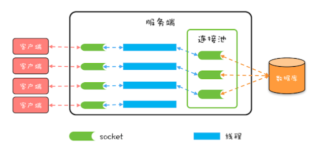
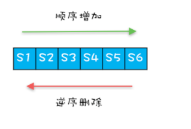

## 1. 开头 
&emsp;&emsp;为了避免重量级对象频繁创建或销毁，产生了池化技术，和数据库打交道，就免不了使用数据库连接池，连接池就是一种池化技术。知名的数据库连接池有不少，例如 c3p0、DBCP、Tomcat JDBC Connection Pool、Druid 等，不过最近最火的是 HiKariCP等。而Springboot 2.0 将其作为默认数据库连接池。HiKariCP为什么性能这么优秀呢？
## 2. 连接池技术
  
* 服务端会在运行期持有一定数量的数据库连接，当需要执行 SQL 时，并不是直接创建一个数据库连接，而是从连接池中获取一个；
* 当 SQL 执行完，也并不是将数据库连接真的关掉，而是将其归还到连接池中  


我们实际工程中会使用持久化框架来进数据库操作。而持久化框架封装了对连接池的操作。我们访问数据库的标准步骤如下：  
* 通过数据源获取一个数据库连接；
* 创建 Statement；
* 执行 SQL；
* 通过 ResultSet 获取 SQL 执行结果；
* 释放 ResultSet；
* 释放 Statement；
* 释放数据库连接。  

其中：
* ds.getConnection() 获取一个数据库连接时，其实是向数据库连接池申请一个数据库连接，而不是创建一个新的数据库连接
* 同样，通过 conn.close() 释放一个数据库连接时，也不是直接将连接关闭，而是将连接归还给数据库连接池

## 3. HiKariCP特别之处  
* 微观上 HiKariCP 程序编译出的字节码执行效率更高，站在字节码的角度去优化 Java 代码，但是如何优化的没有太多资料可以参考
* 宏观上主要是和两个数据结构有关，一个是 FastList，另一个是 ConcurrentBag，我们主要分析下这两个结构  

### 3.1. FastList    
&emsp;&emsp;HiKariCP为了自动实现关闭Statement，将创建的 Statement 保存在数组 ArrayList 里，这样当关闭 Connection 的时候，就可以依次将数组中的所有 Statement 关闭，但是直接用用 ArrayList 还是太慢，因为调用 ArrayList 的 remove() 方法来将其从 ArrayList 中删除不太好,一位删除都是逆序的，remove是顺序查找的，从头找一遍要慢点。于是HiKariCP 创造了FastList其优化点为：  
* 将 remove(Object element) 方法的查找顺序变成了逆序查找
* 是 get(int index) 方法没有对 index 参数进行越界检查，HiKariCP 能保证不会越界，所以不用每次都进行越界检查  


### 3.2. ConcurrentBag  
&emsp;&emsp;如果我们自己实现连接池，我们可以采用两个阻塞队列来实现，一个空闲队列，一个忙碌队列： 
* 获取连接时将空闲的数据库连接从 idle 队列移动到 busy 队列
* 闭连接时将数据库连接从 busy 移动到 idle  

存在问题：Java SDK 中的阻塞队列是用锁实现的，而高并发场景下锁的争用对性能影响很大  
  
HiKariCP 并没有使用 Java SDK 中的阻塞队列，自己实现了一个并发容器，concurrentbag，其核心思想为ThreadLocal 避免部分并发问题  
#### 3.2.1. 关键属性 
ConcurrentBag有四个关键的属性：  
* 存储所有的数据库连接的共享队列 sharedList
* 线程本地存储 threadList
* 等待数据库连接的线程数 waiters
* 分配数据库连接的工具 handoffQueue， 用的是 Java SDK 提供的 SynchronousQueue，SynchronousQueue 主要用于线程之间传递数据  

#### 3.2.2. 核心机制  
* 线程池创建数据库连接逻辑  
  ConcurrentBag 的 add() 方法加入到 ConcurrentBag 中,将这个连接加入到共享队列 sharedList 中，如果此时有线程在等待数据库连接，那么就通过 handoffQueue 将这个连接分配给等待的线程
  ```
    // 将空闲连接添加到队列
    void add(final T bagEntry){
    // 加入共享队列
    sharedList.add(bagEntry);
    // 如果有等待连接的线程，
    // 则通过 handoffQueue 直接分配给等待的线程
    while (waiters.get() > 0 
        && bagEntry.getState() == STATE_NOT_IN_USE 
        && !handoffQueue.offer(bagEntry)) {
        yield();
    }
    }
  ```  

* 获取一个空闲的数据库连接，通过 ConcurrentBag 提供的 borrow() 方法，其逻辑为：
  * 首先查看线程本地存储是否有空闲连接  
    如果有，则返回一个空闲的连接，这里注意，线程本地存储中的连接是可以被其他线程窃取的，所以需要用 CAS 方法防止重复分配。在共享队列中获取空闲连接，也采用了 CAS 方法防止重复分配
  * 如果线程本地存储中无空闲连接，则从共享队列中获取
  * 如果共享队列中也没有空闲的连接，则请求线程需要等待    
  ```
      T borrow(long timeout, final TimeUnit timeUnit){

          // 先查看线程本地存储是否有空闲连接
          final List<Object> list = threadList.get();
          for (int i = list.size() - 1; i >= 0; i--) {

              final Object entry = list.remove(i);
              final T bagEntry = weakThreadLocals ? ((WeakReference<T>) entry).get() : (T) entry;

              // 线程本地存储中的连接也可以被窃取，
              // 所以需要用 CAS 方法防止重复分配

              if (bagEntry != null && bagEntry.compareAndSet(STATE_NOT_IN_USE, STATE_IN_USE)) {
                  return bagEntry;
              }
          }
          
          
          // 线程本地存储中无空闲连接，则从共享队列中获取
          final int waiting = waiters.incrementAndGet();

          try {

              for (T bagEntry : sharedList) {
                  // 如果共享队列中有空闲连接，则返回
                  if (bagEntry.compareAndSet(STATE_NOT_IN_USE, STATE_IN_USE)) {
                      return bagEntry;
                  }
              }

              // 共享队列中没有连接，则需要等待
              timeout = timeUnit.toNanos(timeout);
              do {
                  final long start = currentTime();
                  final T bagEntry = handoffQueue.poll(timeout, NANOSECONDS);
                  if (bagEntry == null || bagEntry.compareAndSet(STATE_NOT_IN_USE, STATE_IN_USE)) {
                      return bagEntry;
                  }
                  // 重新计算等待时间
                  timeout -= elapsedNanos(start);
              } while (timeout > 10_000);

              // 超时没有获取到连接，返回 null
              return null;

          } finally {
              waiters.decrementAndGet();
          }
      }
  ```  

**PS：如果 Tl里面没有空闲的 会去 sharedList查找处于 Not_In_Use的连接 这个连接可能已经在其他TL里面存在了 所以就会出现线程T2从sharedList获取到了 T1存在TL里面存放的没有使用的连接这种情况**


* 释放连接  
  需要调用 ConcurrentBag 提供的 requite() 方法，该方法的逻辑很简单，首先将数据库连接状态更改为 STATE_NOT_IN_USE，之后查看是否存在等待线程，如果有，则分配给等待线程；如果没有，则将该数据库连接保存到线程本地存储里  
  ```
    // 释放连接
    void requite(final T bagEntry){

        // 更新连接状态
        bagEntry.setState(STATE_NOT_IN_USE);
        
        // 如果有等待的线程，则直接分配给线程，无需进入任何队列
        for (int i = 0; waiters.get() > 0; i++) {
            if (bagEntry.getState() != STATE_NOT_IN_USE || handoffQueue.offer(bagEntry)) {
                return;
            } else if ((i & 0xff) == 0xff) {
                parkNanos(MICROSECONDS.toNanos(10));
            } else {
                yield();
            }
        }

        // 如果没有等待的线程，则进入线程本地存储
        final List<Object> threadLocalList = threadList.get();

        if (threadLocalList.size() < 50) {
            threadLocalList.add(weakThreadLocals ? new WeakReference<>(bagEntry) : bagEntry);
        }
    }
  ```  


  ## 4. 总结  
  HiKariCP高性能在于他的特殊数据结构FastList、ConcurrentBag   
  * FastList  
    适用于逆序删除场景
  * ConcurrentBag  
    通过 ThreadLocal 做一次预分配，避免直接竞争共享资源，非常适合池化资源的分配