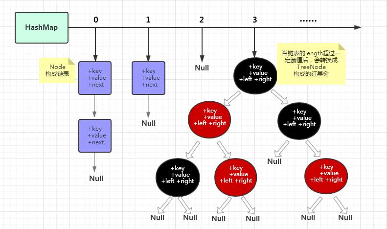
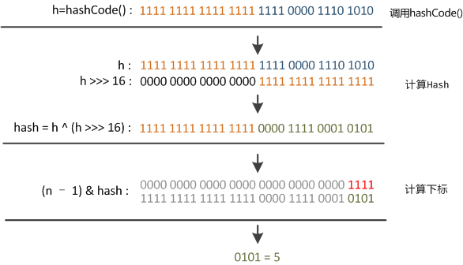
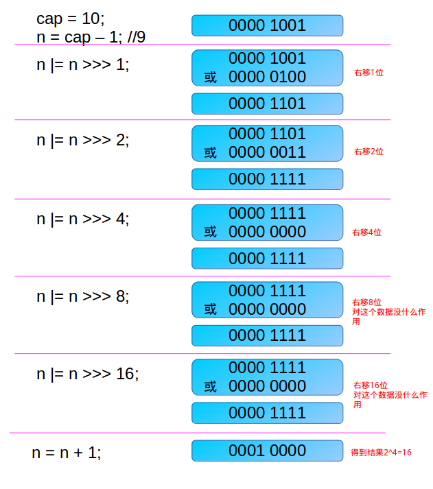
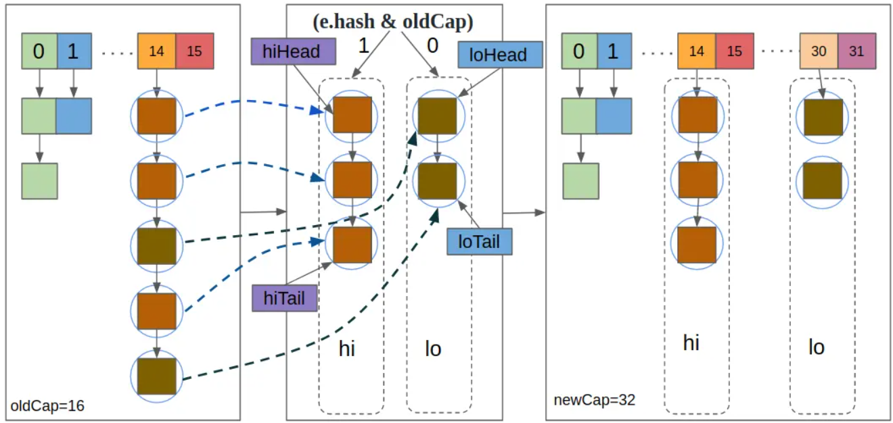
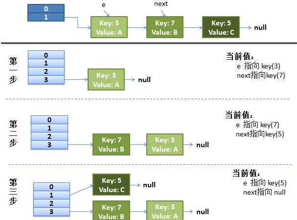
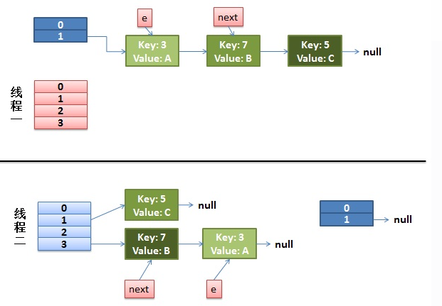
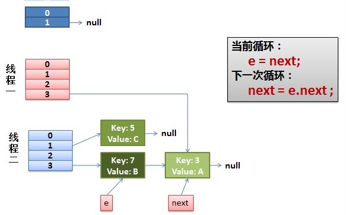
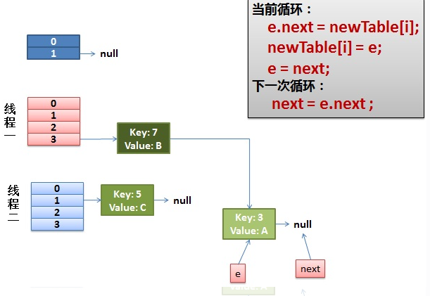
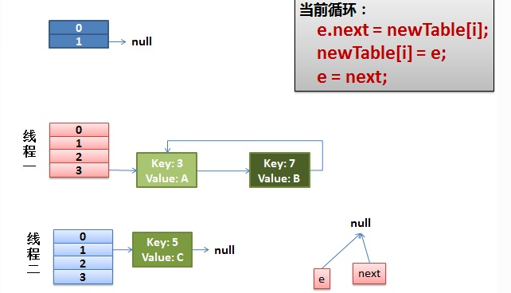
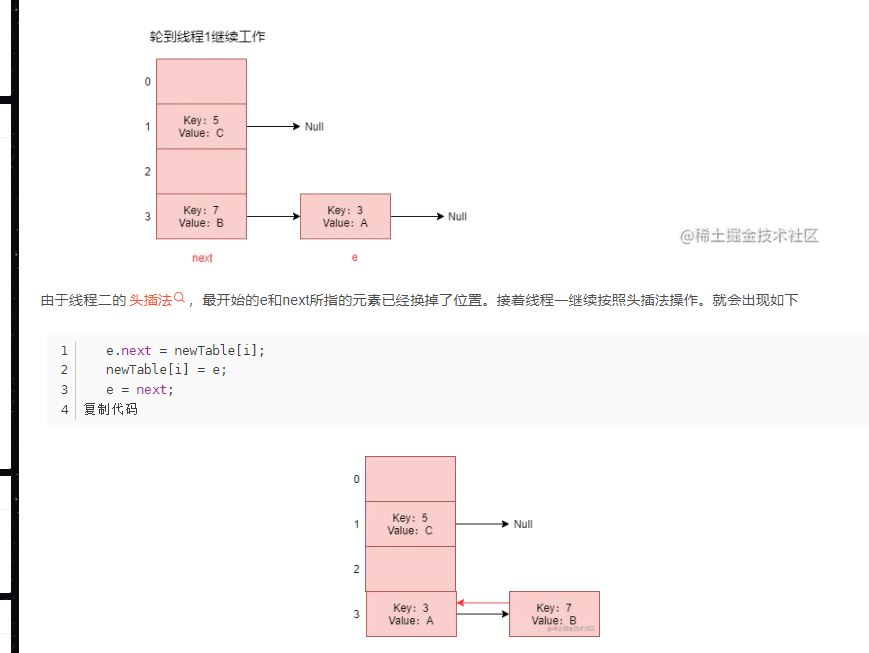

## 1. 总览

​	`key-value`键值对是最常使用的数据形式，如何有效地存取他们是众多语言都需要关注的问题。

java的map接口就是定义这种数据结构的形式，它有个内部接口也定义了Entry内部接口表示key-value的结构

```
 interface Entry<K,V> {
     K getKey();
     V getValue()
     ......
 }
```

​	其具体实现由各种实现类来实现，本文探讨的hashmap就是实现之一

```
class Node<K,V> implements Map.Entry<K,V>{
    K key;
    V value;
}
```

​	在java中, 存储一个对象的集合无外乎两种方式:

* 数组

* 链表

​	在使用键值对时, 查找和插入,删除等操作都会用到, 但是在实际的应用场景中, 对于键值对的查找操作居多, 所以我们选择数组形式

```
Node<K,V>[] table;
```

### 1.1. 查找数组下标

​	为了利用索引来查找, 我们需要建立一个 `key -> index` 的映射关系, 这样每次我们要查找一个 key时, 首先根据映射关系, 计算出对应的数组下标, 然后根据数组下标, 直接找到对应的key-value对象, 这样基本能以o(1)的时间复杂度得到结果

​	将key映射成index的方法称为hash算法, 我们希望它能将 key均匀的分布到数组中。使用hash算法后, 数组不再按顺序存储, 插入删除操作只需要关注一个存储桶即可, 而不需要额外的操作

### 1.2.  hash冲突

​	虽然我们要求hash算法能将key均匀的分布到数组中, 但是它只能`尽量`做到, 并不是绝对的, 更何况我们的数组大小是有限的, 保不齐我们的hash算法将就两个不同的key映射成了同一个index值, 这就产生了hash冲突, 也就是两个Node要存储在数组的同一个位置该怎么办? 解决hash冲突的方法有很多, 在HashMap中我们选择链地址法

链地址法使我们的数组转变成了链表的数组：

 

Node变成一个单链表

```
static class Node<K,V> implements Map.Entry<K,V> {
    final int hash;
    final K key;
    V value;
    Node<K,V> next;
```

​	链表查找只能通过顺序查找来实现, 因此, 时间复杂度为o(n), 如果很不巧, 我们的key值被Hash算法映射到一个存储桶上, 将会导致存储桶上的链表长度越来越长, 此时, 数组查找退化成链表查找, 则时间复杂度由原来的o(1) 退化成 o(n)

​	即如果hash冲突过多，即链表太长了会怎么办么？

​	在java8中, 当链表长度超过 8 之后, 将会自动将链表转换成红黑树, 以实现 o(log n) 的时间复杂度, 从而提升查找性能

 

### 1.3.  数组扩容

​	数组的大小大小是固定的，HashMap 初始容量大小默认是16，如果加入的节点已经到了数组容量的上限, 已经没有位置能够存储`key-value`键值对了, 此时就需要扩容，这里也是为了避免过多产生链表，影响性能。在实际的应用中, 数组空间已使用3/4(0.75)之后, 我们就会括容。

**为什么负载因子为0.75：**

* 加载因子越大,填满的元素越多，空间利用率越高，但冲突的机会加大了。
* 反之,加载因子越小,填满的元素越少，冲突的机会减小,，但空间浪费多了
* 冲突的机会越大,则查找的成本越高。反之,查找的成本越小。因此,必须在 "冲突的机会"与"空间利用率"之间寻找一种平衡与折衷，这个结果是通过**泊松分布**统计学方程的来的

​	我们知道, 数组的扩容是一个很耗费CPU资源的动作, 需要将原数组的内容复制到新数组中去, 因此频繁的扩容必然会导致性能降低, 所以不可能数组满了之后, 每多加一个node, 我们就扩容一次.
​	但是, 一次扩容太大, 导致大量的存储空间用不完, 势必又造成很大的浪费, 因此, 必须根据实际情况设定一个合理的扩容大小.

​	**在HashMap的实现中, 每次扩容我们都会将新数组的大小设为原数组大小的两倍**

### 1.4.  小结

* map的目的为存储一组键值对的集合, 并实现快速的查找
* hashmap为了实现快速查找, 我们选择了数组而不是链表. 以利用数组的索引实现o(1)复杂度的查找效率
* 引入Hash算法, 将 `key` 映射成数组下标: `key -> Index`
* 为了解决Hash冲突, 我们采用链地址法, 在冲突位置转为使用链表存储
* 链表存储过多的节点又导致了在链表上节点的查找性能的恶化，在链表长度超过8之后转而将链表转变成红黑树, 以将 o(n)复杂度的查找效率提升至o(log n)

## 2. hash函数

hashmap的hash函数源码为：

```
static final int hash(Object key) {
    int h;
    return (key == null) ? 0 : (h = key.hashCode()) ^ (h >>> 16);
}
```

​	key.hashCode()函数调用的是key键值类型自带的哈希函数，返回int型散列值。

​	int类型是32位的, `h ^ h >>> 16` 其实就是将hashCode的高16位和低16位进行异或, 这充分利用了高半位和低半位的信息, 对低位进行了`扰动`, 目的是为了使该hashCode映射成数组下标时可以更均匀

​	这里采用了(h = key.hashCode()) ^ (h >>> 16)；来作为hash的扰动函数防止取低位的时候出现太多的碰撞

 

​	右位移16位，正好是32bit的一半，自己的高半区和低半区做异或，就是为了混合原始哈希码的高位和低位，以此来加大低位的随机性。而且混合后的低位掺杂了高位的部分特征，这样高位的信息也被变相保留下来。

​	而且设计者主要是考虑到直接取模的性能较差，于是用&运算来代替，这时候tab.length就必须是2的N次幂才能达到和取模同等的效果了。至于扰动函数起到了防止key.hashCode()不够均匀导致低位存在重复性规律而设计。

**注意HashMap中key值可以为null, 且null值一定存储在数组的第一个位置**

定位到数组索引是采用tab[(n - 1) & hash来的，n为数组的长度，长度为2的幂，n-1与hash取与，能够快速取到低的长度的低数位，这样性能更好。

为此, HashMap中, table的大小都是2的n次方, 即使你在构造函数中指定了table的大小, HashMap也会将该值扩大为距离它最近的2的整数次幂的值

## 3. hashmap的初始化

HashMap 共有四个构造函数

```
public class HashMap<K,V> extends AbstractMap<K,V> implements Map<K,V>, Cloneable, Serializable {

    // 默认初始大小 16
    static final int DEFAULT_INITIAL_CAPACITY = 1 << 4; // aka 16

    // 默认负载因子 0.75
    static final float DEFAULT_LOAD_FACTOR = 0.75f;
     
    final float loadFactor;
    
    /**
     * The next size value at which to resize (capacity * load factor).
     *
     * @serial
     */
    // (The javadoc description is true upon serialization.
    // Additionally, if the table array has not been allocated, this
    // field holds the initial array capacity, or zero signifying
    // DEFAULT_INITIAL_CAPACITY.)
    int threshold;
    
    transient Node<K,V>[] table;
     
    // 没有指定时, 使用默认值
    // 即默认初始大小16, 默认负载因子 0.75
    public HashMap() {
        this.loadFactor = DEFAULT_LOAD_FACTOR; // all other fields defaulted
    }
    
    // 指定初始大小, 但使用默认负载因子
    // 注意这里其实是调用了另一个构造函数
    public HashMap(int initialCapacity) {
        this(initialCapacity, DEFAULT_LOAD_FACTOR);
    }
    
    // 指定初始大小和负载因子
    public HashMap(int initialCapacity, float loadFactor) {
        if (initialCapacity < 0)
            throw new IllegalArgumentException("Illegal initial capacity: " +
                                               initialCapacity);
        if (initialCapacity > MAXIMUM_CAPACITY)
            initialCapacity = MAXIMUM_CAPACITY;
        if (loadFactor <= 0 || Float.isNaN(loadFactor))
            throw new IllegalArgumentException("Illegal load factor: " +
                                               loadFactor);
        this.loadFactor = loadFactor;
        this.threshold = tableSizeFor(initialCapacity);
    }
    
    // 利用已经存在的map创建HashMap
    public HashMap(Map<? extends K, ? extends V> m) {
        this.loadFactor = DEFAULT_LOAD_FACTOR;
        putMapEntries(m, false);
    }
        
}
```

### 3.1. 初始化数组容量

注意，即使我们在构造函数中指定了`initialCapacity`, 这个值也只被用来计算 `threshold`，而 `threshold` 这个值在初始化table时, 就代表了数组的初始大小.

tableSizeFor如下，用于找到大于等于initialCapacity的最小的2的幂：

```
static final int tableSizeFor(int cap) {
    int n = cap - 1;
    n |= n >>> 1;
    n |= n >>> 2;
    n |= n >>> 4;
    n |= n >>> 8;
    n |= n >>> 16;
    return (n < 0) ? 1 : (n >= MAXIMUM_CAPACITY) ? MAXIMUM_CAPACITY : n + 1;
}
```

* int n = cap - 1;为了防止，cap已经是2的幂。如果cap已经是2的幂， 又没有执行这个减1操作，则执行完后面的几条无符号右移操作之后，返回的capacity将是这个cap的2倍
* n |= n >>> 1;第一次右移，由于n不等于0，则n的二进制表示中总会有一bit为1，这时考虑最高位的1。通过无符号右移1位，则将最高位的1右移了1位，再做或操作，使得n的二进制表示中与最高位的1紧邻的右边一位也为1，如000011xxxxxx
* n |= n >>> 2;第二次右移，这个n已经经过了`n |= n >>> 1;` 操作。假设此时n为000011xxxxxx ，则n无符号右移两位，会将最高位两个连续的1右移两位，然后再与原来的n做或操作，这样n的二进制表示的高位中会有4个连续的1。如00001111xxxxxx
* n |= n >>> 4;第三次右移，这次把已经有的高位中的连续的4个1，右移4位，再做或操作，这样n的二进制表示的高位中会有8个连续的1。如00001111 1111xxxxxx

* 容量最大也就是32bit的正数，因此最后n |= n >>> 16; ，最多也就32个1（但是这已经是负数了。在执行tableSizeFor之前，对initialCapacity做了判断，如果大于MAXIMUM_CAPACITY(2 ^ 30)，则取MAXIMUM_CAPACITY。如果等于MAXIMUM_CAPACITY(2 ^ 30)，会执行移位操作。所以这里面的移位操作之后，最大30个1，不会大于等于MAXIMUM_CAPACITY。30个1，加1之后得2 ^ 30）
* 得到的这个capacity却被赋值给了threshold

示例：

 

### 3.2. putMapEntries

利用已有map初始化，构造函数最调用`putMapEntries` 方法

```
final void putMapEntries(Map<? extends K, ? extends V> m, boolean evict) {
    int s = m.size();
    if (s > 0) {
        if (table == null) { // pre-size
            float ft = ((float)s / loadFactor) + 1.0F;
            int t = ((ft < (float)MAXIMUM_CAPACITY) ?
                     (int)ft : MAXIMUM_CAPACITY);
            if (t > threshold)
                threshold = tableSizeFor(t);
        }
        else if (s > threshold)
            resize();
        for (Map.Entry<? extends K, ? extends V> e : m.entrySet()) {
            K key = e.getKey();
            V value = e.getValue();
            putVal(hash(key), key, value, false, evict);
        }
    }
}
```

* 当使用构造函数`HashMap(Map<? extends K, ? extends V> m)` 时, 我们并没有为 `table` 赋值, 所以, `table`值一定为`null`
* 先根据传入Map的大小计算 `threshold` 值
* resize、putval不属于初始化的，后面会分析，它判断需不需要扩容, 最后调用 `putVal`方法将传入的Map插入table中

**PS：table的初始化或者使用不是在构造函数中进行的, 而是在实际用到的时候, 事实上, 它是在HashMap扩容的时候实现的, 即resize函数**

## 4. hashmap扩容

源码如下：

```
final Node<K,V>[] resize() {
    Node<K,V>[] oldTab = table;
    int oldCap = (oldTab == null) ? 0 : oldTab.length;
    int oldThr = threshold;
    int newCap, newThr = 0;
    
    // 原table中已经有值
    if (oldCap > 0) {
    
        // 已经超过最大限制, 不再扩容, 直接返回
        if (oldCap >= MAXIMUM_CAPACITY) {
            threshold = Integer.MAX_VALUE;
            return oldTab;
        }
        
        // 注意, 这里扩容是变成原来的两倍
        // 但是有一个条件: `oldCap >= DEFAULT_INITIAL_CAPACITY`
        else if ((newCap = oldCap << 1) < MAXIMUM_CAPACITY &&
                 oldCap >= DEFAULT_INITIAL_CAPACITY)
            newThr = oldThr << 1; // double threshold
    }
    
    // 在构造函数一节中我们知道
    // 如果没有指定initialCapacity, 则不会给threshold赋值, 该值被初始化为0
    // 如果指定了initialCapacity, 该值被初始化成大于initialCapacity的最小的2的次幂
    
    // 这里是指, 如果构造时指定了initialCapacity, 则用threshold作为table的实际大小
    else if (oldThr > 0) // initial capacity was placed in threshold
        newCap = oldThr;
    
    // 如果构造时没有指定initialCapacity, 则用默认值
    else {               // zero initial threshold signifies using defaults
        newCap = DEFAULT_INITIAL_CAPACITY;
        newThr = (int)(DEFAULT_LOAD_FACTOR * DEFAULT_INITIAL_CAPACITY);
    }
    
    // 计算指定了initialCapacity情况下的新的 threshold
    if (newThr == 0) {
        float ft = (float)newCap * loadFactor;
        newThr = (newCap < MAXIMUM_CAPACITY && ft < (float)MAXIMUM_CAPACITY ?
                  (int)ft : Integer.MAX_VALUE);
    }
    threshold = newThr;
    
    
    //从以上操作我们知道, 初始化HashMap时, 
    //如果构造函数没有指定initialCapacity, 则table大小为16
    //如果构造函数指定了initialCapacity, 则table大小为threshold, 即大于指定initialCapacity的最小的2的整数次幂
    
    
    // 从下面开始, 初始化table或者扩容, 实际上都是通过新建一个table来完成的
    @SuppressWarnings({"rawtypes","unchecked"})
        Node<K,V>[] newTab = (Node<K,V>[])new Node[newCap];
    table = newTab;
    
    // 下面这段就是把原来table里面的值全部搬到新的table里面
    if (oldTab != null) {
        for (int j = 0; j < oldCap; ++j) {
            Node<K,V> e;
            if ((e = oldTab[j]) != null) {
                // 这里注意, table中存放的只是Node的引用, 这里将oldTab[j]=null只是清除旧表的引用, 但是真正的node节点还在, 只是现在由e指向它
                oldTab[j] = null;
                
                // 如果该存储桶里面只有一个bin, 就直接将它放到新表的目标位置
                if (e.next == null)
                    newTab[e.hash & (newCap - 1)] = e;
                
                // 如果该存储桶里面存的是红黑树, 则拆分树
                else if (e instanceof TreeNode)
                    //红黑树的部分以后有机会再讲吧
                    ((TreeNode<K,V>)e).split(this, newTab, j, oldCap);
                
                // 下面这段代码很精妙
                else { // preserve order
                    Node<K,V> loHead = null, loTail = null;
                    Node<K,V> hiHead = null, hiTail = null;
                    Node<K,V> next;
                    do {
                        next = e.next;
                        if ((e.hash & oldCap) == 0) {
                            if (loTail == null)
                                loHead = e;
                            else
                                loTail.next = e;
                            loTail = e;
                        }
                        else {
                            if (hiTail == null)
                                hiHead = e;
                            else
                                hiTail.next = e;
                            hiTail = e;
                        }
                    } while ((e = next) != null);
                    if (loTail != null) {
                        loTail.next = null;
                        newTab[j] = loHead;
                    }
                    if (hiTail != null) {
                        hiTail.next = null;
                        newTab[j + oldCap] = hiHead;
                    }
                }
            }
        }
    }
    return newTab;
}
```

### 4.1. 链表扩容过程

​	当创建新的数组后，会将老数组的数据复制到新的数值中，如何复制呢，如果遇到了数组位长链表的话，如何复制呢？hashmap非常的巧妙

​	它将原来的链表拆分成两个链表, 并将这两个链表分别放到新的table的 `j` 位置和 `j+oldCap` 上, `j`位置就是原链表在原table中的位置。

具体步骤：

* 第一步

  定义了四个Node的引用, 两个链表, 我们把它称为 `lo链表` 和 `hi链表`, `loHead` 和 `loTail` 分别指向 `lo链表`的头节点和尾节点, `hiHead` 和 `hiTail`以此类推

  ```
  Node<K,V> loHead = null, loTail = null;
  Node<K,V> hiHead = null, hiTail = null;
  ```

* 第二步

  拆分链表。顺序遍历该存储桶上的链表的每个节点, 如果 `(e.hash & oldCap) == 0`, 我们就将节点放入`lo`链表, 否则, 放入`hi`链表。

  ```
  do {
      next = e.next;
      if ((e.hash & oldCap) == 0) {
          if (loTail == null)
              loHead = e;
          else
              loTail.next = e;
          loTail = e;
      }
      else {
          if (hiTail == null)
              hiHead = e;
          else
              hiTail.next = e;
          hiTail = e;
      }
  } while ((e = next) != null);
  ```

* 第三步

  ​	如果lo链表非空, 我们就把整个lo链表放到新table的`j`位置上

  ​	如果hi链表非空, 我们就把整个hi链表放到新table的`j+oldCap`位置上

  ```
  if (loTail != null) {
      loTail.next = null;
      newTab[j] = loHead;
  }
  if (hiTail != null) {
      hiTail.next = null;
      newTab[j + oldCap] = hiHead;
  }
  ```

整体流程图：

 


### 4.2. 链表拆分原理

因为有三个基础设定

* oldCap一定是2的整数次幂, 这里假设是2^m

* newCap是oldCap的两倍, 则会是2^(m+1)

* hash对数组大小取模`(n - 1) & hash` 其实就是取hash的低`m`位

因此我们举例如下：

我们假设 oldCap = 16, 即 2^4,
16 - 1 = 15, 二进制表示为 `0000 0000 0000 0000 0000 0000 0000 1111`
可见除了低4位, 其他位置都是0（简洁起见，高位的0后面就不写了）, 则 `(16-1) & hash` 自然就是取hash值的低4位,我们假设它为 `abcd`.

以此类推, 当我们将oldCap扩大两倍后, 新的index的位置就变成了 `(32-1) & hash`, 其实就是取 hash值的低5位. 那么对于同一个Node, 低5位的值无外乎下面两种情况:

```undefined
0abcd
1abcd
```

其中, `0abcd`与原来的index值一致, 而`1abcd` = `0abcd + 10000` = `0abcd + oldCap`

故虽然数组大小扩大了一倍，但是同一个`key`在新旧table中对应的index却存在一定联系： 要么一致，要么相差一个 `oldCap`。

而新旧index是否一致就体现在hash值的第4位(我们把最低为称作第0位), 怎么拿到这一位的值呢, 只要:

```apache
hash & 0000 0000 0000 0000 0000 0000 0001 0000
```

上式就等效于

```1c
hash & oldCap
```

故得出结论:

> 如果 `(e.hash & oldCap) == 0` 则该节点在新表的下标位置与旧表一致都为 `j`
> 如果 `(e.hash & oldCap) == 1` 则该节点在新表的下标位置 `j + oldCap`

根据这个条件, 我们将原位置的链表拆分成两个链表, 然后一次性将整个链表放到新的Table对应的位置上

## 5. hashmap的put操作

扩容操作发生在table的初始化或者table大小超过threshold后，而这两个条件的触发基本上就发生在`put`操作中。其中put方法由几大关键点：

* hash

* key,value

* onlyIfAbsent

  参数用于决定待存储的key已经存在的情况下,要不要用新值覆盖原有的`value`, 如果为`true`, 则保留原有值, `false` 则覆盖原有值, 从上面的调用看, 该值为`false`, 说明当`key`值已经存在时, 会直接覆盖原有值

* evict

  该参数用来区分当前是否是构造模式, 我们在讲解构造函数的时候曾经提到，HashMap的第四个构造函数可以通过已经存在的Map初始化一个HashMap, 如果为 `false`, 说明在构造模式下。这里我们是用在`put`函数而不是构造函数里面, 所以为`true`

```
final V putVal(int hash, K key, V value, boolean onlyIfAbsent, boolean evict) {
    Node<K,V>[] tab; Node<K,V> p; int n, i;
    
    // 首先判断table是否是空的
    // 我们知道, HashMap的三个构造函数中, 都不会初始Table, 因此第一次put值时, table一定是空的, 需要初始化
    // table的初始化用到了resize函数, 这个我们上一篇文章已经讲过了
    // 由此可见table的初始化是延迟到put操作中的
    if ((tab = table) == null || (n = tab.length) == 0)
        n = (tab = resize()).length;
        
    // 这里利用 `(n-1) & hash` 方法计算 key 所对应的下标
    // 如果key所对应的桶里面没有值, 我们就新建一个Node放入桶里面
    if ((p = tab[i = (n - 1) & hash]) == null)
        tab[i] = newNode(hash, key, value, null);
    
    // 到这里说明目标位置桶里已经有东西了
    else {
        Node<K,V> e; K k;
        // 这里先判断当前待存储的key值和已经存在的key值是否相等
        // key值相等必须满足两个条件
        //    1. hash值相同
        //    2. 两者 `==` 或者 `equals` 等
        if (p.hash == hash && ((k = p.key) == key || (key != null && key.equals(k))))
            e = p; // key已经存在的情况下, e保存原有的键值对
        
        // 到这里说明要保存的桶已经被占用, 且被占用的位置存放的key与待存储的key值不一致
        
        // 前面已经说过, 当链表长度超过8时, 会用红黑树存储, 这里就是判断存储桶中放的是链表还是红黑树
        else if (p instanceof TreeNode)
            // 红黑树的部分以后有机会再说吧
            e = ((TreeNode<K,V>)p).putTreeVal(this, tab, hash, key, value);
        
        //到这里说明是链表存储, 我们需要顺序遍历链表
        else {
            for (int binCount = 0; ; ++binCount) {
                // 如果已经找到了链表的尾节点了,还没有找到目标key, 则说明目标key不存在，那我们就新建一个节点, 把它接在尾节点的后面
                if ((e = p.next) == null) {
                    p.next = newNode(hash, key, value, null);
                    // 如果链表的长度达到了8个, 就将链表转换成红黑数以提升查找性能
                    if (binCount >= TREEIFY_THRESHOLD - 1) // -1 for 1st
                        treeifyBin(tab, hash);
                    break;
                }
                // 如果在链表中找到了目标key则直接退出
                // 退出时e保存的是目标key的键值对
                if (e.hash == hash &&
                    ((k = e.key) == key || (key != null && key.equals(k))))
                    break;
                p = e;
            }
        }
        
        // 到这里说明要么待存储的key存在, e保存已经存在的值
        // 要么待存储的key不存在, 则已经新建了Node将key值插入, e的值为Null
        
        // 如果待存储的key值已经存在
        if (e != null) { // existing mapping for key
            V oldValue = e.value;
            
            // 前面已经解释过, onlyIfAbsent的意思
            // 这里是说旧值存在或者旧值为null的情况下, 用新值覆盖旧值
            if (!onlyIfAbsent || oldValue == null)
                e.value = value;
            afterNodeAccess(e); //这个函数只在LinkedHashMap中用到, 这里是空函数
            // 返回旧值
            return oldValue;
        }
    }
    
    // 到这里说明table中不存在待存储的key, 并且我们已经将新的key插入进数组了
    
    ++modCount; // 这个暂时用不到
    
    // 因为又插入了新值, 所以我们得把数组大小加1, 并判断是否需要重新扩容
    if (++size > threshold)
        resize();
    afterNodeInsertion(evict); //这个函数只在LinkedHashMap中用到, 这里是空函数
    return null;
}
```

* 在put之前会检查table是否为空，说明table真正的初始化并不是发生在构造函数中， 而是发生在第一次put的时候。

* 查找当前key是否存在的条件是`p.hash == hash && ((k = p.key) == key || (key != null && key.equals(k)))`

* 如果插入的key值不存在，则值会插入到链表的末尾。

* 每次插入操作结束后，都会检查当前table节点数是否大于`threshold`, 若超过，则扩容。

* 当链表长度超过`TREEIFY_THRESHOLD`（默认是8）个时，会将链表转换成红黑树以提升查找性能

## 6. 线程安全性

hashmap不是线程安全的，不同版本的线程安全问题不一样：

- 在jdk1.7中，在多线程环境下，扩容时会造成环形链或数据丢失。
- 在jdk1.8中，在多线程环境下，会发生数据覆盖的情况

### 6.1. 死循环问题

​	在HashMap自动扩容时,当2个线程同时检测到元素个数超过 数组大小 ×负载因子。此时2个线程会在put()方法中调用了resize(),两个线程同时修改一个链表结构会产生一个循环链表(JDK1.7中,会出现resize前后元素顺序倒置的情况)。接下来再想通过get()获取某一个元素,就会出现死循环。

* 正常扩容：

 

* 多线程扩容

  ```
  do {
      Entry<K,V> next = e.next; // <--假设线程一执行到这里就被调度挂起了
      int i = indexFor(e.hash, newCapacity);
      e.next = newTable[i];
      newTable[i] = e;
      e = next;
  } while (e != null);
  ```

   

  

  

  - **先是执行 newTalbe[i] = e;**
  - **然后是e = next，导致了e指向了key(7)，**
  - **而下一次循环的next = e.next导致了next指向了key(3)**

   

   

  **把key(7)摘下来，放到newTable[i]的第一个，然后把e和next往下移**。

   

  e.next = newTable[i] 导致 key(3).next 指向了 key(7)
  
  

### 6.2. 脏写

* 有两个线程A和B,首先A希望插入一个key-value对到HashMap中
* 首先计算记录所要落到的 hash桶的索引坐标,然后获取到该桶里面的链表头结点, 此时线程A的时间片用完了
* 而此时线程B被调度得以执行,和线程A一样执行,只不过线程B成功将记录插到了桶里面
* 假设线程A插入的记录计算出来的 hash桶索引和线程B要插入的记录计算出来的 hash桶索引, 是一样的
* 那么当线程B成功插入之后,线程A再次被调度运行时,它依然持有过期的链表头但是它对此一无所知,以至于它认为它应该这样做
* 如此一来就覆盖了线程B插入的记录,这样线程B插入的记录就凭空消失了,造成了数据不一致的行为

## 7. 总结

1.8中做优化：

- 数组+链表改成了数组+链表或红黑树
- 链表的插入方式从头插法改成了尾插法
- 扩容的时候1.7需要对原数组中的元素进行重新hash定位在新数组的位置，1.8采用更简单的判断逻辑，位置不变或索引+旧容量大小；
- 在插入时，1.7先判断是否需要扩容，再插入，1.8先进行插入，插入完成再判断是否需要扩容；

- 在jdk1.7中，在多线程环境下，扩容时会造成环形链或数据丢失。
- 在jdk1.8中，在多线程环境下，会发生数据覆盖的情况
- jdk1.8.链表变为红黑树

