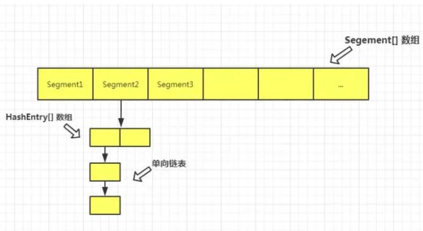

## 1. 开头

我们已经知道hashmap有并发问题，java其实也提供了并发安全的key-val实现，即ConcurrentHashMap。1.7和1.8的版本略有差异。

本文主要从如下几个关键点解析（参考文章https://mp.weixin.qq.com/s/My4P_BBXDnAGX1gh630ZKw）：

（https://mp.weixin.qq.com/s/AixdbEiXf3KfE724kg2YIw）

* 多线程下的 HashMap 有什么问题？

* 怎样保证线程安全，为什么选用 ConcurrentHashMap？

* ConcurrentHashMap 1.7 源码解析

  - 底层存储结构

  - 常用变量

  - 构造函数

  - put() 方法

  - ensureSegment() 方法

  - scanAndLockForPut() 方法

  - rehash() 扩容机制

  - get() 获取元素方法

  - remove() 方法

  - size() 方法是怎么统计元素个数的

* ConcurrentHashMap 1.8 源码解析

  - put()方法详解

  - initTable()初始化表

  - addCount()方法

  - fullAddCount()方法

  - transfer()是怎样扩容和迁移元素的

  - helpTransfer()方法帮助迁移元素

## 2.  多线程下的 HashMap 安全问题

```
 final V putVal(int hash, K key, V value, boolean onlyIfAbsent,
                   boolean evict) {
        Node<K,V>[] tab; Node<K,V> p; int n, i;
        if ((tab = table) == null || (n = tab.length) == 0)
            n = (tab = resize()).length;
        if ((p = tab[i = (n - 1) & hash]) == null)
            tab[i] = newNode(hash, key, value, null);
```

两个线程都执行到了p = tab[i = (n - 1) & hash]) == null，线程一判断为空之后，CPU 时间片到了，被挂起。线程二也执行到此处判断为空，继续执行下一句，创建了一个新节点，插入到此下标位置。然后，线程一解挂，同样认为此下标的元素为空，因此也创建了一个新节点放在此下标处，因此造成了元素的覆盖

## 3. 解决方案

* SynchronizedMap
* hashtable
* concurrenthashmap

## 4. concurrenthashmap

 

实现的关键点：

* ConcurrentHashMap 采用了**分段锁**技术，其中 Segment 继承于 ReentrantLock。

* 不会像 HashTable 那样不管是 put 还是 get 操作都需要做同步处理，理论上 ConcurrentHashMap 支持 CurrencyLevel (Segment 数组数量)的线程并发。

* 每当一个线程占用锁访问一个 Segment 时，不会影响到其他的 Segment。

* 就是说如果容量大小是16他的并发度就是16，可以同时允许16个线程操作16个Segment而且还是线程安全的