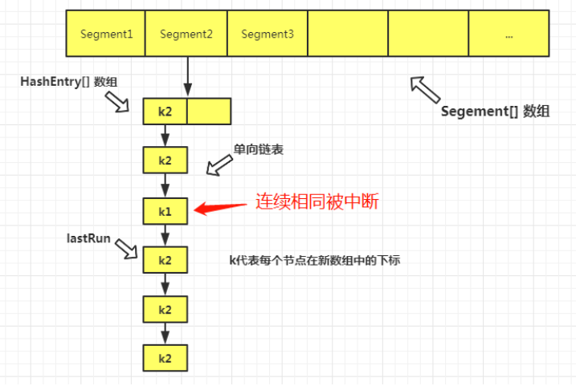

## 1. 开头

我们已经知道hashmap有并发问题，java其实也提供了并发安全的key-val实现，即ConcurrentHashMap。1.7和1.8的版本略有差异。

本文主要从如下几个关键点解析（参考文章https://mp.weixin.qq.com/s/My4P_BBXDnAGX1gh630ZKw）：

（https://mp.weixin.qq.com/s/AixdbEiXf3KfE724kg2YIw）

* 多线程下的 HashMap 有什么问题？

* 怎样保证线程安全，为什么选用 ConcurrentHashMap？

* ConcurrentHashMap 1.7 源码解析

  - 底层存储结构

  - 常用变量

  - 构造函数

  - put() 方法

  - ensureSegment() 方法

  - scanAndLockForPut() 方法

  - rehash() 扩容机制

  - get() 获取元素方法

  - remove() 方法

  - size() 方法是怎么统计元素个数的

* ConcurrentHashMap 1.8 源码解析

  - put()方法详解

  - initTable()初始化表

  - addCount()方法

  - fullAddCount()方法

  - transfer()是怎样扩容和迁移元素的

  - helpTransfer()方法帮助迁移元素

## 2.  多线程下的 HashMap 安全问题

```
 final V putVal(int hash, K key, V value, boolean onlyIfAbsent,
                   boolean evict) {
        Node<K,V>[] tab; Node<K,V> p; int n, i;
        if ((tab = table) == null || (n = tab.length) == 0)
            n = (tab = resize()).length;
        if ((p = tab[i = (n - 1) & hash]) == null)
            tab[i] = newNode(hash, key, value, null);
```

两个线程都执行到了p = tab[i = (n - 1) & hash]) == null，线程一判断为空之后，CPU 时间片到了，被挂起。线程二也执行到此处判断为空，继续执行下一句，创建了一个新节点，插入到此下标位置。然后，线程一解挂，同样认为此下标的元素为空，因此也创建了一个新节点放在此下标处，因此造成了元素的覆盖

## 3. 解决方案

* SynchronizedMap

  * SynchronizedMap内部维护了一个普通对象Map，还有排斥锁mutex
  * 有两个构造器，如果你传入了mutex参数，则将对象排斥锁赋值为传入的对象
  * 如果没有，则将对象排斥锁赋值为this，即调用synchronizedMap的对象

* hashtable

  * 对数据操作的时候都会上锁，所以效率比较低下

  * Hashtable 是不允许键或值为 null 的，HashMap 的键值则都可以为 null，Hashtable在我们put 空值的时候会直接抛空指针异常，但是HashMap却做了特殊处理

    因为Hashtable使用的是**安全失败机制（fail-safe）**，如果使用null值，就会使得其无法判断对应的key是不存在还是为空，因为你无法再调用一次contain(key）来对key是否存在进行判断，ConcurrentHashMap同理

  * Hashtable 继承了 Dictionary类，而 HashMap 继承的是 AbstractMap 类

  * HashMap 的初始容量为：16，Hashtable 初始容量为：11，两者的负载因子默认都是：0.75

  * 当现有容量大于总容量 * 负载因子时，HashMap 扩容规则为当前容量翻倍，Hashtable 扩容规则为当前容量翻倍 + 1

  * HashMap 中的 Iterator 迭代器是 fail-fast 的，而 Hashtable 的 Enumerator 不是 fail-fast 的

* concurrenthashmap

  如本文探讨的

**PS**：**快速失败（fail—fast）**

​	java集合中的一种机制， 在用迭代器遍历一个集合对象时，如果遍历过程中对集合对象的内容进行了修改（增加、删除、修改），则会抛出Concurrent Modification Exception，其原理为：

* 迭代器在遍历时直接访问集合中的内容，并且在遍历过程中使用一个 modCount 变量
* 集合在被遍历期间如果内容发生变化，就会改变modCount的值
* 每当迭代器使用hashNext()/next()遍历下一个元素之前，都会检测modCount变量是否为expectedmodCount值，是的话就返回遍历；否则抛出异常，终止遍历
* 这里异常的抛出条件是检测到 modCount！=expectedmodCount 这个条件。如果集合发生变化时修改modCount值刚好又设置为了expectedmodCount值，则异常不会抛出
* 应用场景有：比如java.util包下的集合类都是快速失败的，不能在多线程下发生并发修改，即java.util.concurrent包下的容器都是安全失败，可以在多线程下并发使用，并发修改


## 4. jdk1.7的concurrenthashmap

 

实现的关键点：

* ConcurrentHashMap 采用了**分段锁**技术，其中 Segment 继承于 ReentrantLock。

* 不会像 HashTable 那样不管是 put 还是 get 操作都需要做同步处理，理论上 ConcurrentHashMap 支持 CurrencyLevel (Segment 数组数量)的线程并发。

* 每当一个线程占用锁访问一个 Segment 时，不会影响到其他的 Segment。

* 就是说如果容量大小是16他的并发度就是16，可以同时允许16个线程操作16个Segment而且还是线程安全的

### 4.1. 数据结构

如上图所示，是由 Segment 数组、HashEntry 组成，和 HashMap 一样，仍然是数组加链表，Segment 是 ConcurrentHashMap 的一个内部类。HashEntry跟HashMap差不多的，但是不同点是，他使用volatile去修饰了他的数据

```
static final class Segment<K,V> extends ReentrantLock implements Serializable {

    private static final long serialVersionUID = 2249069246763182397L;

    // 和 HashMap 中的 HashEntry 作用一样，真正存放数据的桶
    transient volatile HashEntry<K,V>[] table;

    transient int count;
        // 记得快速失败（fail—fast）么？
    transient int modCount;
        // 大小
    transient int threshold;
        // 负载因子
    final float loadFactor;

}
```

ConcurrentHashMap高并发的原因：

* ConcurrentHashMap 采用了分段锁技术，其中 Segment 继承于 ReentrantLock。
* 不会像 HashTable 那样不管是 put 还是 get 操作都需要做同步处理，理论上 ConcurrentHashMap 支持 CurrencyLevel (Segment 数组数量)的线程并发。
* 每当一个线程占用锁访问一个 Segment 时，不会影响到其他的 Segment。
* 就是说如果容量大小是16他的并发度就是16，可以同时允许16个线程操作16个Segment而且还是线程安全的

### 4.2. 构造方法

* 确定 segmentShift ，这个用于后边计算hash值的偏移量，此处即为 32-4=28，
* 确定 ssize，必须是一个大于等于 concurrencyLevel 的一个2的n次幂值
* 确定 cap，必须是一个大于等于2的一个2的n次幂值

### 4.3. put() 方法

* 调用hashmap的put方法

    ```
    public V put(K key, V value) {
        Segment<K,V> s;
        if (value == null)
            throw new NullPointerException();//不可以put null
        int hash = hash(key);
        int j = (hash >>> segmentShift) & segmentMask;
        if ((s = (Segment<K,V>)UNSAFE.getObject          
             (segments, (j << SSHIFT) + SBASE)) == null) 
            s = ensureSegment(j);
        return s.put(key, hash, value, false);
    }
    ```

    赏析：

    * 定位到Segment
    *  UNSAFE.getObject (segments, (j << SSHIFT) + SBASE。它是为了通过Unsafe这个类，找到 j 最新的实际值
      *  它代表的是 j 的一个偏移量，通过偏移量，就可以得到 j 的实际值。可以类比，AQS 中的 CAS 操作。Unsafe中的操作，都需要一个偏移量
    * ensureSegment(j)获取一个s，即初始化j下标的Segment

* 最终调用Segment的put方法

  * 将当前 Segment 中的 table 通过 key 的 hashcode 定位到 HashEntry
  * 遍历该 HashEntry，如果不为空则判断传入的 key 和当前遍历的 key 是否相等，相等则覆盖旧的 value。
  * 为空则需要新建一个 HashEntry 并加入到 Segment 中，同时会先判断是否需要扩容
  * 释放锁
  
  ```
     final V put(K key, int hash, V value, boolean onlyIfAbsent) {
            // 将当前 Segment 中的 table 通过 key 的 hashcode 定位到 HashEntry
              HashEntry<K,V> node = tryLock() ? null :
                  scanAndLockForPut(key, hash, value);
              V oldValue;
              try {
                  HashEntry<K,V>[] tab = table;
                  int index = (tab.length - 1) & hash;
                  HashEntry<K,V> first = entryAt(tab, index);
                  for (HashEntry<K,V> e = first;;) {
                      if (e != null) {
                          K k;
   // 遍历该 HashEntry，如果不为空则判断传入的 key 和当前遍历的 key 是否相等，相等则覆盖旧的 value。
                          if ((k = e.key) == key ||
                              (e.hash == hash && key.equals(k))) {
                              oldValue = e.value;
                              if (!onlyIfAbsent) {
                                  e.value = value;
                                  ++modCount;
                              }
                              break;
                          }
                          e = e.next;
                      }
                      else {
                   // 不为空则需要新建一个 HashEntry 并加入到 Segment 中，同时会先判断是否需要扩容。
                          if (node != null)
                              node.setNext(first);
                          else
                              node = new HashEntry<K,V>(hash, key, value, first);
                          int c = count + 1;
                          if (c > threshold && tab.length < MAXIMUM_CAPACITY)
                              rehash(node);
                          else
                              setEntryAt(tab, index, node);
                          ++modCount;
                          count = c;
                          oldValue = null;
                          break;
                      }
                  }
              } finally {
                 //释放锁
                  unlock();
              }
              return oldValue;
          }
  ```
  
  赏析：
  
  * 利用scanAndLockForPut()自旋获取锁
  * 如果重试的次数达到了 MAX_SCAN_RETRIES 则改为阻塞锁获取，保证能获取成功

### 4.4. ensureSegment() 方法

在定位segement后，有个判断 j 下标的 Segment为空后，则需要调用此方法，初始化一个 Segment 对象，以确保拿到的对象一定是不为空的，否则无法执行s.put了。

```
//k为 (hash >>> segmentShift) & segmentMask 算法计算出来的值
private Segment<K,V> ensureSegment(int k) {
    final Segment<K,V>[] ss = this.segments;
    //u代表 k 的偏移量，用于通过 UNSAFE 获取主内存最新的实际 K 值
    long u = (k << SSHIFT) + SBASE; // raw offset
    Segment<K,V> seg;
    //从内存中取到最新的下标位置的 Segment 对象，判断是否为空，(1)
    if ((seg = (Segment<K,V>)UNSAFE.getObjectVolatile(ss, u)) == null) {
        //之前构造函数说了，s0是作为一个原型对象，用于创建新的 Segment 对象
        Segment<K,V> proto = ss[0]; // use segment 0 as prototype
        //容量
        int cap = proto.table.length;
        //加载因子
        float lf = proto.loadFactor;
        //扩容阈值
        int threshold = (int)(cap * lf);
        //把 Segment 对应的 HashEntry 数组先创建出来
        HashEntry<K,V>[] tab = (HashEntry<K,V>[])new HashEntry[cap];
        //再次检查 K 下标位置的 Segment 是否为空， (2)
        if ((seg = (Segment<K,V>)UNSAFE.getObjectVolatile(ss, u)) == null) { // recheck
        //此处把 Segment 对象创建出来，并赋值给 s，
        Segment<K,V> s = new Segment<K,V>(lf, threshold, tab);
        //循环检查 K 下标位置的 Segment 是否为空， (3)
        //若不为空，则说明有其它线程抢先创建成功，并且已经成功同步到主内存中了，
        //则把它取出来，并返回
        while ((seg = (Segment<K,V>)UNSAFE.getObjectVolatile(ss, u)) == null) {
            //CAS，若当前下标的Segment对象为空，就把它替换为最新创建出来的 s 对象。
            //若成功，就跳出循环，否则，就一直自旋直到成功，或者 seg 不为空（其他线程成功导致）。
            if (UNSAFE.compareAndSwapObject(ss, u, null, seg = s))
                break;
            }
        }
    }
 return seg;
}
```

在多线程环境下，因为不确定是什么时候会有其它线程 CAS 成功，有可能发生在以上的任意时刻。所以，只要发现一旦内存中的对象已经存在了，则说明已经有其它线程把Segment对象创建好，并CAS成功同步到主内存了。此时，就可以直接返回，而不需要往下执行了。所以这么多次判断

### 4.5. scanAndLockForPut() 方法

```
private HashEntry<K,V> scanAndLockForPut(K key, int hash, V value) {
     //根据hash值定位到它对应的HashEntry数组的下标位置，并找到链表的第一个节点
     //注意，这个操作会从主内存中获取到最新的状态，以确保获取到的first是最新值
     HashEntry<K,V> first = entryForHash(this, hash);
     HashEntry<K,V> e = first;
     HashEntry<K,V> node = null;
     //重试次数，初始化为 -1
     int retries = -1; // negative while locating node
     //若抢锁失败，就一直循环，直到成功获取到锁。有三种情况
     while (!tryLock()) {
      HashEntry<K,V> f; // to recheck first below
      //1.若 retries 小于0，
      if (retries < 0) {
       if (e == null) {
        //若 e 节点和 node 都为空，则创建一个 node 节点。这里只是预测性的创建一个node节点
        if (node == null) // speculatively create node
         node = new HashEntry<K,V>(hash, key, value, null);
        retries = 0;
       }
       //如当前遍历到的 e 节点不为空，则判断它的key是否等于传进来的key，若是则把 retries 设为0
       else if (key.equals(e.key))
        retries = 0;
       //否则，继续向后遍历节点
       else
        e = e.next;
      }
      //2.若是重试次数超过了最大尝试次数，则调用lock方法加锁。表明不再重试，我下定决心了一定要获取到锁。
      //要么当前线程可以获取到锁，要么获取不到就去排队等待获取锁。获取成功后，再 break。
      else if (++retries > MAX_SCAN_RETRIES) {
       lock();
       break;
      }
      //3.若 retries 的值为偶数，并且从内存中再次获取到最新的头节点，判断若不等于first
      //则说明有其他线程修改了当前下标位置的头结点，于是需要更新头结点信息。
      else if ((retries & 1) == 0 &&
         (f = entryForHash(this, hash)) != first) {
       //更新头结点信息，并把重试次数重置为 -1，继续下一次循环，从最新的头结点遍历当前链表。
       e = first = f; // re-traverse if entry changed
       retries = -1;
      }
     }
     return node;
}
```

* 当segment进行put的时候，put 方法第一步抢锁失败之后，就会执行此方法，会一直循环尝试获取锁，若获取成功，则返回。否则的话，每次循环时，都会同时遍历当前链表。若遍历完了一次，还没找到和key相等的节点，就会预先创建一个节点。注意，这里只是预测性的创建一个新节点，也有可能在这之前，就已经获取锁成功了。

* 同时，当重试次每偶数次时，就会检查一次当前最新的头结点是否被改变。因为若有变化的话，还需要从最新的头结点开始遍历链表。
* 还有一种情况，就是循环次数达到了最大限制，则停止循环，用阻塞的方式去获取锁。这时，也就停止了遍历链表的动作，当前线程也不会再做其他预热(warm up)的事情
* 因为遍历速度无所谓，所以，我们可以预先(**warm up**)做一些相关联代码的准备工作。这里相关联代码，指的就是循环中，在获取锁成功或者调用 lock 方法之前做的这些事情，当然也包括创建新节点
* 在put 方法中可以看到，有一句是判断 node 是否为空，若创建了，就直接头插。否则的话，它也会自己创建这个新节点

### 4.6. rehash() 扩容机制

put 方法时，发现元素个数超过了阈值，则会扩容。需要注意的是，每个Segment只管它自己的扩容，互相之间并不影响。换句话说，可以出现这个 Segment的长度为2，另一个Segment的长度为4的情况（只要是2的n次幂）

```
//node为创建的新节点
private void rehash(HashEntry<K,V> node) {
     //当前Segment中的旧表
     HashEntry<K,V>[] oldTable = table;
     //旧的容量
     int oldCapacity = oldTable.length;
     //新容量为旧容量的2倍
     int newCapacity = oldCapacity << 1;
     //更新新的阈值
     threshold = (int)(newCapacity * loadFactor);
     //用新的容量创建一个新的 HashEntry 数组
     HashEntry<K,V>[] newTable =
      (HashEntry<K,V>[]) new HashEntry[newCapacity];
     //当前的掩码，用于计算节点在新数组中的下标
     int sizeMask = newCapacity - 1;
     //遍历旧表
     for (int i = 0; i < oldCapacity ; i++) {
      HashEntry<K,V> e = oldTable[i];
      //如果e不为空，说明当前链表不为空
      if (e != null) {
       HashEntry<K,V> next = e.next;
       //计算hash值再新数组中的下标位置
       int idx = e.hash & sizeMask;
       //如果e不为空，且它的下一个节点为空，则说明这条链表只有一个节点，
       //直接把这个节点放到新数组的对应下标位置即可
       if (next == null)   //  Single node on list
        newTable[idx] = e;
       //否则，处理当前链表的节点迁移操作
       else { // Reuse consecutive sequence at same slot
        //记录上一次遍历到的节点
        HashEntry<K,V> lastRun = e;
        //对应上一次遍历到的节点在新数组中的新下标
        int lastIdx = idx;
        for (HashEntry<K,V> last = next;
          last != null;
          last = last.next) {
         //计算当前遍历到的节点的新下标
         int k = last.hash & sizeMask;
         //若 k 不等于 lastIdx，则说明此次遍历到的节点和上次遍历到的节点不在同一个下标位置
         //需要把 lastRun 和 lastIdx 更新为当前遍历到的节点和下标值。
         //若相同，则不处理，继续下一次 for 循环。
         if (k != lastIdx) {
          lastIdx = k;
          lastRun = last;
         }
        }
        //把和 lastRun 节点的下标位置相同的链表最末尾的几个连续的节点放到新数组的对应下标位置
        newTable[lastIdx] = lastRun;
        //再把剩余的节点，复制到新数组
        //从旧数组的头结点开始遍历，直到 lastRun 节点，因为 lastRun节点后边的节点都已经迁移完成了。
        for (HashEntry<K,V> p = e; p != lastRun; p = p.next) {
         V v = p.value;
         int h = p.hash;
         int k = h & sizeMask;
         HashEntry<K,V> n = newTable[k];
         //用的是复制节点信息的方式，并不是把原来的节点直接迁移，区别于lastRun处理方式
         newTable[k] = new HashEntry<K,V>(h, p.key, v, n);
        }
       }
      }
     }
     //所有节点都迁移完成之后，再处理传进来的新的node节点，把它头插到对应的下标位置
     int nodeIndex = node.hash & sizeMask; // add the new node
     //头插node节点
     node.setNext(newTable[nodeIndex]);
     newTable[nodeIndex] = node;
     //更新当前Segment的table信息
     table = newTable;
}
```

 

从头结点开始向后遍历，找到当前链表的最后几个下标相同的连续的节点。如上图，虽然开头出现了有两个节点的下标都是 k2, 但是中间出现一个不同的下标 k1，打断了下标连续相同，因此从下一个k2，又重新开始算。好在后边三个连续的节点下标都是相同的，因此倒数第三个节点被标记为 lastRun，且变量无变化。

从lastRun节点到尾结点的这部分就可以整体迁移到新数组的对应下标位置了，因为它们的下标都是相同的，可以这样统一处理。

另外从头结点到 lastRun 之前的节点，无法统一处理，只能一个一个去复制了。且注意，这里不是直接迁移，而是复制节点到新的数组，旧的节点会在不久的将来，因为没有引用指向，被 JVM 垃圾回收处理掉。

### 4.7. get() 获取元素方法

```
public V get(Object key) {
 Segment<K,V> s; // manually integrate access methods to reduce overhead
 HashEntry<K,V>[] tab;
 //计算hash值
 int h = hash(key);
 //同样的先定位到 key 所在的Segment ，然后从主内存中取出最新的节点
 long u = (((h >>> segmentShift) & segmentMask) << SSHIFT) + SBASE;
 if ((s = (Segment<K,V>)UNSAFE.getObjectVolatile(segments, u)) != null &&
  (tab = s.table) != null) {
  //若Segment不为空，且链表也不为空，则遍历查找节点
  for (HashEntry<K,V> e = (HashEntry<K,V>) UNSAFE.getObjectVolatile
     (tab, ((long)(((tab.length - 1) & h)) << TSHIFT) + TBASE);
    e != null; e = e.next) {
   K k;
   //找到则返回它的 value 值，否则返回 null
   if ((k = e.key) == key || (e.hash == h && key.equals(k)))
    return e.value;
  }
 }
 return null;
}
```

* get 逻辑比较简单，只需要将 Key 通过 Hash 之后定位到具体的 Segment ，再通过一次 Hash 定位到具体的元素上。

* 由于 HashEntry 中的 value 属性是用 volatile 关键词修饰的，保证了内存可见性，所以每次获取时都是最新值。

* ConcurrentHashMap 的 get 方法是非常高效的，因为整个过程都不需要加锁

### 4.8. remove() 方法

remove 方法和 put 方法类似

```
public V remove(Object key) {
 int hash = hash(key);
 //定位到Segment
 Segment<K,V> s = segmentForHash(hash);
 //若 s为空，则返回 null，否则执行 remove
 return s == null ? null : s.remove(key, hash, null);
}

public boolean remove(Object key, Object value) {
 int hash = hash(key);
 Segment<K,V> s;
 return value != null && (s = segmentForHash(hash)) != null &&
  s.remove(key, hash, value) != null;
}

final V remove(Object key, int hash, Object value) {
 //尝试加锁，若失败，则执行 scanAndLock ，此方法和 scanAndLockForPut 方法类似
 if (!tryLock())
  scanAndLock(key, hash);
 V oldValue = null;
 try {
  HashEntry<K,V>[] tab = table;
  int index = (tab.length - 1) & hash;
  //从主内存中获取对应 table 的最新的头结点
  HashEntry<K,V> e = entryAt(tab, index);
  HashEntry<K,V> pred = null;
  while (e != null) {
   K k;
   HashEntry<K,V> next = e.next;
   //匹配到 key
   if ((k = e.key) == key ||
    (e.hash == hash && key.equals(k))) {
    V v = e.value;
    // value 为空，或者 value 也匹配成功
    if (value == null || value == v || value.equals(v)) {
     if (pred == null)
      setEntryAt(tab, index, next);
     else
      pred.setNext(next);
     ++modCount;
     --count;
     oldValue = v;
    }
    break;
   }
   pred = e;
   e = next;
  }
 } finally {
  unlock();
 }
 return oldValue;
}
```


### 4.9. size() 方法是怎么统计元素个数的

size 方法需要重点说明一下。爱思考的小伙伴可能就会想到，并发情况下，有可能在统计期间，数组元素个数不停的变化，而且，整个表还被分成了 N个 Segment，怎样统计才能保证结果的准确性呢

```
public int size() {
 // Try a few times to get accurate count. On failure due to
 // continuous async changes in table, resort to locking.
 //segment数组
 final Segment<K,V>[] segments = this.segments;
 //统计所有Segment中元素的总个数
 int size;
 //如果size大小超过32位，则标记为溢出为true
 boolean overflow; 
 //统计每个Segment中的 modcount 之和
 long sum;         
 //上次记录的 sum 值
 long last = 0L;   
 //重试次数，初始化为 -1
 int retries = -1; 
 try {
  for (;;) {
   //如果超过重试次数，则不再重试，而是把所有Segment都加锁，再统计 size
   if (retries++ == RETRIES_BEFORE_LOCK) {
    for (int j = 0; j < segments.length; ++j)
     //强制加锁
     ensureSegment(j).lock(); // force creation
   }
   sum = 0L;
   size = 0;
   overflow = false;
   //遍历所有Segment
   for (int j = 0; j < segments.length; ++j) {
    Segment<K,V> seg = segmentAt(segments, j);
    //若当前遍历到的Segment不为空，则统计它的 modCount 和 count 元素个数
    if (seg != null) {
     //累加当前Segment的结构修改次数，如put，remove等操作都会影响modCount
     sum += seg.modCount;
     int c = seg.count;
     //若当前Segment的元素个数 c 小于0 或者 size 加上 c 的结果小于0，则认为溢出
     //因为若超过了 int 最大值，就会返回负数
     if (c < 0 || (size += c) < 0)
      overflow = true;
    }
   }
   //当此次尝试，统计的 sum 值和上次统计的值相同，则说明这段时间内，
   //并没有任何一个 Segment 的结构发生改变，就可以返回最后的统计结果
   if (sum == last)
    break;
   //不相等，则说明有 Segment 结构发生了改变，则记录最新的结构变化次数之和 sum，
   //并赋值给 last，用于下次重试的比较。
   last = sum;
  }
 } finally {
  //如果超过了指定重试次数，则说明表中的所有Segment都被加锁了，因此需要把它们都解锁
  if (retries > RETRIES_BEFORE_LOCK) {
   for (int j = 0; j < segments.length; ++j)
    segmentAt(segments, j).unlock();
  }
 }
 //若结果溢出，则返回 int 最大值，否则正常返回 size 值 
 return overflow ? Integer.MAX_VALUE : size;
}
```

赏析：

* 我们先采用乐观的方式，认为在统计 size 的过程中，并没有发生 put， remove 等会改变 Segment 结构的操作。
* 但是，如果发生了，就需要重试。如果重试2次都不成功(执行三次，第一次不能叫做重试)
* 强制把所有 Segment 都加锁之后，再统计了，以此来得到准确的结果


## 5. jdk1.8的concurrenthashmap

​	因为1.7基本上还是数组加链表的方式，我们去查询的时候，还得遍历链表，会导致效率很低，这个跟jdk1.7的HashMap是存在的一样问题，所以他在jdk1.8完全优化了。

​	抛弃了原有的 Segment 分段锁，而采用了 `CAS + synchronized` 来保证并发安全性。

​	跟HashMap很像，也把之前的HashEntry改成了Node，但是作用不变，把值和next采用了volatile去修饰，保证了可见性，并且也引入了红黑树，在链表大于一定值的时候会转换（默认是8）  

### 5.1. put()方法详解

ConcurrentHashMap在进行put操作的还是比较复杂的，大致可以分为以下步骤：

* 根据 key 计算出 hashcode 。

* 判断是否需要进行初始化。

* 即为当前 key 定位出的 Node，如果为空表示当前位置可以写入数据，利用 CAS 尝试写入，失败则自旋保证成功。

* 如果当前位置的 `hashcode == MOVED == -1`,则需要进行扩容。

* 如果都不满足，则利用 synchronized 锁写入数据。

* 如果数量大于 `TREEIFY_THRESHOLD` 则要转换为红黑树

### 5.2. initTable()初始化表

### 5.3. addCount()方法

### 5.4. fullAddCount()方法

### 5.5. transfer()是怎样扩容和迁移元素的

### 5.6. helpTransfer()方法帮助迁移元素

 