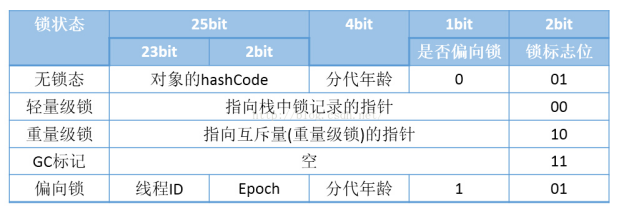

## 1. 概述

参考文章：https://www.zhihu.com/topic/20035779/hot

当我们使用synchronized关键字的时候，则对象的头部会有一个锁信息

   

​	对象的header中的一共有这个四种状态：

* 无锁状态

* 偏向锁

  &emsp;对象头记录了线程id,如果当前线程和当前线程相等，通过cas进行更新，就直接执行了，如果有其它线程，就会锁升级

* 轻量级锁

  ​	cas失败了，说明就是两个线程了，就会升级为轻量级锁，轻量级锁会自旋，即等到持有的线程执行完，这会减少cpu切换，然后如果能执行的话再去执行，如果不能执行将升级重量级锁

* 重量级锁

  &emsp;未抢到锁的线程都会进入 Monitor，之后会被阻塞在WaitSet集合中，也就变成了优化之前的Synchronized锁，Monitor 是依靠底层操作系统的 Mutex Lock 来实现互斥，线程顺利执行完方法，也将释放 Mutex，这种系统级别的锁会增大系统性能开销

  ​	重量级锁对应一个monitor对象，这个对象有两个队列_WaitSet和EntryList，处于wait状态的线程，会被加入到_WaitSet，处于等待锁block状态的线程。  

​	Java1.6之前是全是重量级锁，之后优化为这个多阶段的锁，锁会根据线程的实际情况进行不可逆升级:

* 偏向锁（减少获取锁的代价，只有一个线程时使用
* 轻量级锁（如果有两个以上的线程来申请锁，不一定是同时，将会转化为轻量级锁）
* 重量级锁（如果有多个线程同时竞争这个锁)

**注意：**

* 锁的清除：java编译会清除没有必要的锁  
* 锁粗化：java编译会根据实际情况来放大锁  

使用sychronized的作用：

* 原子性：确保线程互斥的访问同步代码；

* 可见性：保证共享变量的修改能够及时可见，其实是通过Java内存模型中的 “**对一个变量unlock操作之前，必须要同步到主内存中；如果对一个变量进行lock操作，则将会清空工作内存中此变量的值，在执行引擎使用此变量前，需要重新从主内存中load操作或assign操作初始化变量值**” 来保证的；

* 有序性：有效解决重排序问题，即 “一个unlock操作先行发生(happen-before)于后面对同一个锁的lock操作”；

synchronized 内置锁 是一种 对象锁（锁的是对象而非引用变量），**作用粒度是对象 ，可以用来实现对 临界资源的同步互斥访问 ，是 可重入 的。其可重入最大的作用是避免死锁**，如：子类同步方法调用了父类同步方法，如没有可重入的特性，则会发生死锁

## 2. monitor对象

我们可以知道：

* 当用 synchronized 修饰代码块时，编译后的字节码会有 monitorenter 和 monitorexit 指令，分别对应的是获得锁和解锁
* 当用 synchronized 修饰方法时，会给方法加上标记 ACC_SYNCHRONIZED

​	我们知道对象内存的布局中有对象头，对象头中有markdown信息，这也是为了节约内存常用的设计。当锁状态为重量级锁（锁标识位=10）时，Mark word中会记录指向**Monitor对象**的指针，这个Monitor对象也称为**管程**或**监视器锁**。这个信息如开头的图所示。

​	每个对象都存在着一个 Monitor对象与之关联。执行 monitorenter 指令就是线程试图去获取 Monitor 的所有权，抢到了就是成功获取锁了；执行 monitorexit 指令则是释放了Monitor的所有权。

### 2.1. ObjectMonitor类定义

ObjectMonitor类实现的，其主要成员包括：

- _owner

  初始时为NULL表示当前没有任何线程拥有该monitorrecord，当线程成功拥有该锁后保存线程唯一标识，当锁被释放时又设置为NULL

- _WaitSet：存放处于wait状态的线程队列，即调用wait()方法的线程

- _EntryList：存放处于等待锁block状态的线程队列

- _count：约为_WaitSet 和 _EntryList 的节点数之和

- _cxq: 多个线程争抢锁，会先存入这个单向链表

- _recursions: 记录重入次数