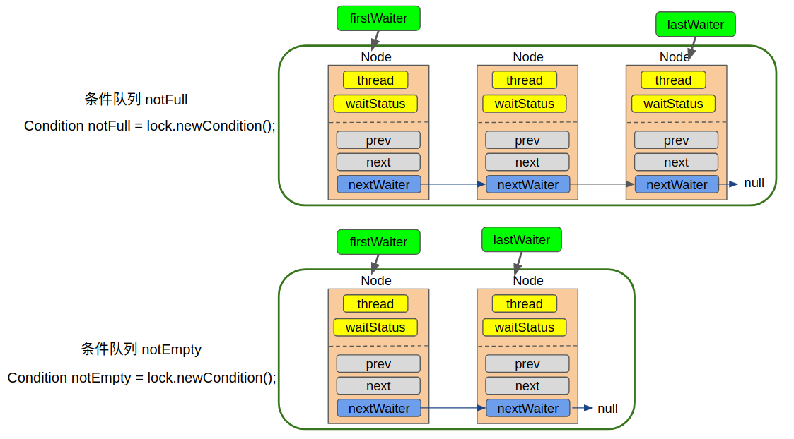

## 1. 概述

​	AQS（AbstractQueuedSynchronizer）位于java.util.concurrent.locks.AbstractQueuedSynchronizer，是JAVA中众多锁以及并发工具的基础，其底层采用乐观锁，大量使用了CAS操作， 并且在冲突时，采用自旋方式重试，以实现轻量级和高效地获取锁。

​	注意，AQS中没有抽象类，AQS将一些需要子类覆写的方法都设计成protect方法，将其默认实现为抛出UnsupportedOperationException异常。如果子类使用到这些方法，但是没有覆写，则会抛出异常；如果子类没有使用到这些方法，则不需要做任何操作。AQS中实现了锁的获取框架，锁的实际获取逻辑交由子类去实现，就锁的获取操作而言，子类必须重写 tryAcquire方法


## 2. java并发工具设计思路

- **状态**

  一般是一个state属性，它基本是整个工具的核心，通常整个工具都是在设置和修改状态，很多方法的操作都依赖于当前状态是什么。由于状态是全局共享的，一般会被设置成volatile类型，以保证其修改的可见性；

- **队列**

  队列通常是一个等待的集合，大多数以链表的形式实现。队列采用的是悲观锁的思想，表示当前所等待的资源，状态或者条件短时间内可能无法满足。因此，它会将当前线程包装成某种类型的数据结构，扔到一个等待队列中，当一定条件满足后，再从等待队列中取出。

- **CAS**

  CAS操作是最轻量的并发处理，通常我们对于状态的修改都会用到CAS操作，因为状态可能被多个线程同时修改，CAS操作保证了同一个时刻，只有一个线程能修改成功，从而保证了线程安全，CAS操作基本是由Unsafe工具类的`compareAndSwapXXX`来实现的；CAS采用的是乐观锁的思想，因此常常伴随着自旋，如果发现当前无法成功地执行CAS，则不断重试，直到成功为止，自旋的的表现形式通常是一个死循环`for(;;)`
  
  

## 3. AQS的核心原理

### 3.1. 状态

在AQS中，状态是由state属性来表示的，不出所料，它是volatile类型的：

```

/**
* The synchronization state.
*/
private volatile int state;
```

* state为0表示锁没有被占用
* state大于0表示当前已经有线程持有该锁，这里之所以说大于0而不说等于1是因为可能存在可重入的情况。
* state变量当做是当前持有该锁的线程数量

AbstractQueuedSynchronizer继承了AbstractOwnableSynchronizer的exclusiveOwnerThread属性

```
/**
* The current owner of exclusive mode synchronization.
*/
private transient Thread exclusiveOwnerThread;
```

exclusiveOwnerThread属性的值即为当前持有锁的线程。

**PS：在监视器锁中，我们用ObjectMonitor对象的_owner属性记录了当前拥有监视器锁的线程，而在AQS中，我们将通过exclusiveOwnerThread属性**


### 3.2. 队列

​	AQS中，队列的实现是一个双向链表，被称为`sync queue`，它表示所有等待锁的线程的集合，有点类似于synchronized原理的时候说的wait set。

​	在并发编程中使用队列通常是**将当前线程包装成某种类型的数据结构扔到等待队列中**

#### 3.2.1. node结构

```
    static final class Node {
        /** Marker to indicate a node is waiting in shared mode */
        static final Node SHARED = new Node();
        /** Marker to indicate a node is waiting in exclusive mode */
        static final Node EXCLUSIVE = null;

        /** waitStatus value to indicate thread has cancelled */
        static final int CANCELLED =  1;
        /** waitStatus value to indicate successor's thread needs unparking */
        static final int SIGNAL    = -1;
        /** waitStatus value to indicate thread is waiting on condition */
        static final int CONDITION = -2;
        /**
         * waitStatus value to indicate the next acquireShared should
         * unconditionally propagate
         */
        static final int PROPAGATE = -3;

        volatile int waitStatus;

        volatile Node prev;

        volatile Node next;

        volatile Thread thread;

        Node nextWaiter;

        final boolean isShared() {
            return nextWaiter == SHARED;
        }

        final Node predecessor() throws NullPointerException {
            Node p = prev;
            if (p == null)
                throw new NullPointerException();
            else
                return p;
        }

        Node() { 
        }

        Node(Thread thread, Node mode) {     // Used by addWaiter
            this.nextWaiter = mode;
            this.thread = thread;
        }

        Node(Thread thread, int waitStatus) { // Used by Condition
            this.waitStatus = waitStatus;
            this.thread = thread;
        }
    }
```

其核心属性有：

* thread

  节点所代表的线程

* prev、next

  双向链表，每个节点需要保存自己的前驱节点和后继节点的引用

* waitStatus

  线程所处的等待锁的状态，初始化时，该值为0。它表示了当前Node所代表的线程的等待锁的状态，在独占锁模式下，我们只需要关注`CANCELLED` `SIGNAL`两种状态即可。

  ```
  static final int CANCELLED =  1;
  static final int SIGNAL    = -1;
  static final int CONDITION = -2;
  static final int PROPAGATE = -3;
  ```

* nextWaiter

  该属性用于条件队列或者共享锁。这里还有一个`nextWaiter`属性，它在独占锁模式下永远为`null`，仅仅起到一个标记作用，没有实际意义

#### 3.2.2. 队列首尾节点

在AQS属性中有首尾节点.

```
// 头结点，不代表任何线程，是一个哑结点
private transient volatile Node head;

// 尾节点，每一个请求锁的线程会加到队尾
private transient volatile Node tail;
```

​	在AQS中的队列是一个CLH队列，它的head节点永远是一个哑结点（dummy node), 它不代表任何线程（某些情况下可以看做是代表了当前持有锁的线程），**因此head所指向的Node的thread属性永远是null**。

​	只有从次头节点往后的所有节点才代表了所有等待锁的线程。也就是说，在当前线程没有抢到锁被包装成Node扔到队列中时，**即使队列是空的，它也会排在第二个**，为了便于描述，我们把除去head节点的队列称作是等待队列，在这个队列中的节点才代表了所有等待锁的线程

 

- `thread`：表示当前Node所代表的线程
- `waitStatus`：表示节点所处的等待状态，共享锁模式下只需关注三种状态：`SIGNAL` `CANCELLED` `初始态(0)`
- `prev` `next`：节点的前驱和后继
- `nextWaiter`：进作为标记，值永远为null，表示当前处于独占锁模式

### 3.3. CAS操作

​	CAS操作大对数是用来改变状态的，一般在静态代码块中初始化需要CAS操作的属性的偏移量。如下为和CAS相关的变量：

```
  private static final Unsafe unsafe = Unsafe.getUnsafe();
    private static final long stateOffset;
    private static final long headOffset;
    private static final long tailOffset;
    private static final long waitStatusOffset;
    private static final long nextOffset;

    static {
        try {
            stateOffset = unsafe.objectFieldOffset
                (AbstractQueuedSynchronizer.class.getDeclaredField("state"));
            headOffset = unsafe.objectFieldOffset
                (AbstractQueuedSynchronizer.class.getDeclaredField("head"));
            tailOffset = unsafe.objectFieldOffset
                (AbstractQueuedSynchronizer.class.getDeclaredField("tail"));
            waitStatusOffset = unsafe.objectFieldOffset
                (Node.class.getDeclaredField("waitStatus"));
            nextOffset = unsafe.objectFieldOffset
                (Node.class.getDeclaredField("next"));

        } catch (Exception ex) { throw new Error(ex); }
    }
```

CAS操作主要针对5个属性，包括AQS的3个属性`state`,`head`和`tail`, 以及Node对象的两个属性`waitStatus`,`next`。

初始好了变量后，如下为cas操作这些变量的核心方法：

```
protected final boolean compareAndSetState(int expect, int update) {
    return unsafe.compareAndSwapInt(this, stateOffset, expect, update);
}
private final boolean compareAndSetHead(Node update) {
    return unsafe.compareAndSwapObject(this, headOffset, null, update);
}
private final boolean compareAndSetTail(Node expect, Node update) {
    return unsafe.compareAndSwapObject(this, tailOffset, expect, update);
}
private static final boolean compareAndSetWaitStatus(Node node, int expect,int update) {
    return unsafe.compareAndSwapInt(node, waitStatusOffset, expect, update);
}
private static final boolean compareAndSetNext(Node node, Node expect, Node update) {
    return unsafe.compareAndSwapObject(node, nextOffset, expect, update);
}
```

CAS操作调用的还是Unsafe类的compareAndSwapXXX

### 3.4. 小结

这里总结下AQS的核心属性

* 锁相关的属性有两个

  ```java
  //锁的状态
  private volatile int state; 
  // 当前持有锁的线程，注意这个属性是从AbstractOwnableSynchronizer继承而来
  private transient Thread exclusiveOwnerThread; 
  ```

* `sync queue`相关的属性有两个：

  ```java
  // 队头，为dummy node
  private transient volatile Node head; 
  // 队尾，新入队的节点
  private transient volatile Node tail; 
  ```

* 队列中的Node中需要关注的属性有三组

  ```java
  // 节点所代表的线程
  volatile Thread thread;
  
  // 双向链表，每个节点需要保存自己的前驱节点和后继节点的引用
  volatile Node prev;
  volatile Node next;
  
  // 线程所处的等待锁的状态，初始化时，该值为0
  volatile int waitStatus;
  static final int CANCELLED =  1;
  static final int SIGNAL    = -1;
  ```

## 4.  独占锁获取

​	AQS大多数情况下都是通过继承来使用的, 子类通过覆写 `tryAcquire` 来实现自己的获取锁的逻辑，我们这里以ReentrantLock为例来说明锁的获取流程。

​	 ReentrantLock有 `公平锁` 和 `非公平锁` 两种实现, 默认实现为非公平锁, 这体现在它的构造函数中

```
public class ReentrantLock implements Lock, java.io.Serializable {
    /** Synchronizer providing all implementation mechanics */
    private final Sync sync;
    
    /**
     * Base of synchronization control for this lock. Subclassed
     * into fair and nonfair versions below. Uses AQS state to
     * represent the number of holds on the lock.
     */
    abstract static class Sync extends AbstractQueuedSynchronizer {
        ...
    }
    
    /**
     * Sync object for non-fair locks
     */
    static final class NonfairSync extends Sync{
        ...
    }
    
    /**
     * Sync object for fair locks
     */
    static final class FairSync extends Sync {
        ...
    }
    
    /**
     * Creates an instance of {@code ReentrantLock}.
     * This is equivalent to using {@code ReentrantLock(false)}.
     */
    public ReentrantLock() {
        sync = new NonfairSync();
    }

    /**
     * Creates an instance of {@code ReentrantLock} with the
     * given fairness policy.
     *
     * @param fair {@code true} if this lock should use a fair ordering policy
     */
    public ReentrantLock(boolean fair) {
        sync = fair ? new FairSync() : new NonfairSync();
    }
    
    // 获取锁
    public void lock() {
        sync.lock();
    }
    
    ...
}
```

* FairSync继承自 Sync, 而Sync继承自 AQS,
* ReentrantLock获取锁的逻辑是直接调用了 FairSync 或者 NonfairSync的逻辑

不过本文我们以FairLock 为例, 来逐行分析锁的获取。

### 4.1.  整体流程

```
static final class FairSync extends Sync {
    private static final long serialVersionUID = -3000897897090466540L;
    //获取锁
    final void lock() {
        acquire(1);
    }
    ...
}
```

lock 方法调用的 `acquire`方法来自父类AQS。

 

### 4.2.  acquire

acquire 定义在AQS类中，描述了获取锁的流程

```java
public final void acquire(int arg) {
    if (!tryAcquire(arg) && acquireQueued(addWaiter(Node.EXCLUSIVE), arg))
        selfInterrupt();
}
```

* tryAcquire(arg)

  该方法由继承AQS的子类实现, 为获取锁的具体逻辑。

* addWaiter(Node mode)

  该方法由AQS实现, 负责在获取锁失败后调用, 将当前请求锁的线程包装成Node扔到sync queue中去，并返回这个Node

* acquireQueued(final Node node, int arg)

  该方法由AQS实现,这个方法比较复杂, 主要对上面刚加入队列的Node不断尝试以下两种操作之一:

  - 在前驱节点就是head节点的时候,继续尝试获取锁

  - 将当前线程挂起,使CPU不再调度它

* selfInterrupt

  该方法由AQS实现, 用于中断当前线程。由于在整个抢锁过程中，我们都是不响应中断的。那如果在抢锁的过程中发生了中断怎么办呢，总不能假装没看见呀。AQS的做法简单的记录有没有有发生过中断，如果返回的时候发现曾经发生过中断，则在退出`acquire`方法之前，就调用`selfInterrupt`自我中断一下，就好像将这个发生在抢锁过程中的中断“推迟”到抢锁结束以后再发生一样。

  从上面的简单介绍中可以看出，除了获取锁的逻辑 `tryAcquire(arg)`由子类实现外, 其余方法均由AQS实现。

接下来我们重点来看 `FairSync` 所实现的获取锁的逻辑

### 4.3.  tryAcquire

`tryAcquire` 获取锁的逻辑其实很简单——判断当前锁有没有被占用：

* 如果锁没有被占用, 尝试以公平的方式获取锁

* 如果锁已经被占用, 检查是不是锁重入

```
protected final boolean tryAcquire(int acquires) {
    final Thread current = Thread.currentThread();
    // 首先获取当前锁的状态
    int c = getState(); 
    
    // c=0 说明当前锁是avaiable的, 没有被任何线程占用, 可以尝试获取
    // 因为是实现公平锁, 所以在抢占之前首先看看队列中有没有排在自己前面的Node
    // 如果没有人在排队, 则通过CAS方式获取锁, 就可以直接退出了
    if (c == 0) {
        if (!hasQueuedPredecessors() 
        /* 为了阅读方便, hasQueuedPredecessors源码就直接贴在这里了, 这个方法的本质实际上是检测自己是不是head节点的后继节点，即处在阻塞队列第一位的节点
            public final boolean hasQueuedPredecessors() {
                Node t = tail; 
                Node h = head;
                Node s;
                return h != t && ((s = h.next) == null || s.thread != Thread.currentThread());
            }
        */
        && compareAndSetState(0, acquires)) {
            setExclusiveOwnerThread(current); // 将当前线程设置为占用锁的线程
            return true;
        }
    }
    
    // 如果 c>0 说明锁已经被占用了
    // 对于可重入锁, 这个时候检查占用锁的线程是不是就是当前线程,是的话,说明已经拿到了锁, 直接重入就行
    else if (current == getExclusiveOwnerThread()) {
        int nextc = c + acquires;
        if (nextc < 0)
            throw new Error("Maximum lock count exceeded");
        setState(nextc);
        /* setState方法如下：
        protected final void setState(int newState) {
            state = newState;
        }
        */
        return true;
    }
    
    // 到这里说明有人占用了锁, 并且占用锁的不是当前线程, 则获取锁失败
    return false;
}
```

从这里可以看出：

* 获取锁其实主要就是干一件事，将state的状态通过CAS操作由0改写成1
* 由于是CAS操作，必然是只有一个线程能执行成功。则执行成功的线程即获取了锁，在这之后，才有权利将`exclusiveOwnerThread`的值设成自己
* 对于可重入锁，如果当前线程已经是获取了锁的线程了，它还要注意增加锁的重入次数。
* 这里修改state状态的操作，一个用了CAS方法`compareAndSetState`，一个用了普通的`setState`方法。这是因为用CAS操作时，当前线程还没有获得锁，所以可能存在多线程同时在竞争锁的情况；而调用setState方法时，是在当前线程已经是持有锁的情况下，因此对state的修改是安全的，只需要普通的方法就可以了。

### 4.4.  addWaiter

如果执行到此方法, 说明前面尝试获取锁的tryAcquire已经失败了, 既然获取锁已经失败了, 就要将当前线程包装成Node，加到等待锁的队列中去, 因为是FIFO队列, 所以自然是直接加在队尾

```java
private Node addWaiter(Node mode) {
     //将当前线程包装成Node
    Node node = new Node(Thread.currentThread(), mode);
    // 这里我们用注释的形式把Node的构造函数贴出来
    // 因为传入的mode值为Node.EXCLUSIVE，所以节点的nextWaiter属性被设为null
    /*
        static final Node EXCLUSIVE = null;
        
        Node(Thread thread, Node mode) {     // Used by addWaiter
            this.nextWaiter = mode;
            this.thread = thread;
        }
    */
    Node pred = tail;
    // 如果队列不为空, 则用CAS方式将当前节点设为尾节点
    if (pred != null) {
        node.prev = pred;
        if (compareAndSetTail(pred, node)) {
            pred.next = node;
            return node;
        }
    }
    
    // 代码会执行到这里, 只有两种情况:
    //    1. 队列为空
    //    2. CAS失败
    // 注意, 这里是并发条件下, 所以什么都有可能发生, 尤其注意CAS失败后也会来到这里
    enq(node); //将节点插入队列
    return node;
}
```

* 每一个处于独占锁模式下的节点，它的`nextWaiter`一定是null。

* 在这个方法中，我们首先会尝试直接入队，但是因为目前是在并发条件下，所以有可能同一时刻，有多个线程都在尝试入队，导致`compareAndSetTail(pred, node)`操作失败

  因为有可能其他线程已经成为了新的尾节点，导致尾节点不再是我们之前看到的那个`pred`了。

* 如果入队失败了，接下来我们就需要调用enq(node)方法，在该方法中我们将通过`自旋+CAS`的方式，确保当前节点入队

### 4.5. enq自旋入队

​	能执行到这个方法，说明当前线程获取锁已经失败了，我们已经把它包装成一个Node,准备把它扔到等待队列中去，但是在这一步又失败了。这个失败的原因可能是以下两种之一:

* 等待队列现在是空的，没有线程在等待
* 其他线程在当前线程入队的过程中率先完成了入队，导致尾节点的值已经改变了，CAS操作失败

```
private Node enq(final Node node) {
    for (;;) {
        Node t = tail;
        // 如果是空队列, 首先进行初始化
        // 这里也可以看出, 队列不是在构造的时候初始化的, 而是延迟到需要用的时候再初始化, 以提升性能
        if (t == null) { 
            // 注意，初始化时使用new Node()方法新建了一个dummy节点
            if (compareAndSetHead(new Node()))
                tail = head; // 这里仅仅是将尾节点指向dummy节点，并没有返回
        } else {
        // 到这里说明队列已经不是空的了, 这个时候再继续尝试将节点加到队尾
            node.prev = t;
            if (compareAndSetTail(t, node)) {
                t.next = node;
                return t;
            }
        }
    }
}
```

* 使用了死循环, 即以自旋方式将节点插入队列，如果失败则不停的尝试, 直到成功为止

*  另外, 该方法也负责在队列为空时, 初始化队列，这也说明，队列是延时初始化的(lazily initialized)

* 当队列为空时，我们初始化队列并没有使用当前传进来的节点，而是**新建了一个空节点**

  在新建完空的头节点之后，我们**并没有立即返回**，而是将尾节点指向当前的头节点，然后进入下一轮循环

* 在下一轮循环中，尾节点已经不为null了，此时再将我们包装了当前线程的Node加到这个空节点后面

* 这就意味着，在这个等待队列中，头结点是一个“哑节点”，它不代表任何等待的线程

* **head节点不代表任何线程，它就是一个空节点**

### 4.6. 尾分叉

在enq的时候有一个有趣的现象，叫做尾分叉

```
} else {
// 到这里说明队列已经不是空的了, 这个时候再继续尝试将节点加到队尾
    node.prev = t;
    if (compareAndSetTail(t, node)) {
        t.next = node;
        return t;
    }
}
```

即将一个节点node添加到`sync queue`的末尾也需要三步：

* 设置node的前驱节点为当前的尾节点：`node.prev = t`

* 修改`tail`属性，使它指向当前节点

* 修改原来的尾节点，使它的next指向当前节点

#### 4.6.1.  尾分叉成因

 

* 这里的三步并不是一个原子操作，第一步很容易成功；

* 第二步由于是一个CAS操作，在并发条件下有可能失败

* 第三步只有在第二步成功的条件下才执行。

  这里的CAS保证了同一时刻只有一个节点能成为尾节点，其他节点将失败，失败后将回到for循环中继续重试。

  所以，当有大量的线程在同时入队的时候，同一时刻，只有一个线程能完整地完成这三步，**而其他线程只能完成第一步**，于是就出现了尾分叉

 

* 这里第三步是在第二步执行成功后才执行的，这就意味着，有可能即使我们已经完成了第二步，将新的节点设置成了尾节点，**此时原来旧的尾节点的next值可能还是`null`**(因为还没有来的及执行第三步)，所以如果此时有线程恰巧从头节点开始向后遍历整个链表，则它是遍历不到新加进来的尾节点的，但是这显然是不合理的，因为现在的tail已经指向了新的尾节点。
* 另一方面，当我们完成了第二步之后，第一步一定是完成了的，所以如果我们从尾节点开始向前遍历，已经可以遍历到所有的节点。这也就是为什么我们在AQS相关的源码中，有时候常常会出现从尾节点开始逆向遍历链表——因为一个节点要能入队，则它的prev属性一定是有值的，但是它的next属性可能暂时还没有值
* “分叉”的入队失败的其他节点，在下一轮的循环中，它们的prev属性会重新指向新的尾节点，继续尝试新的CAS操作，最终，所有节点都会通过自旋不断的尝试入队，直到成功为止

**总结下来是一个最终一致性的问题了。队列的中间状态可能对外暴露的不一致。**

#### 4.6.2. 小结

* addWaiter(Node.EXCLUSIVE)方法的完整的分析，该方法并不设计到任何关于锁的操作，它就是解决了并发条件下的节点入队问题。具体来说就是该方法保证了将当前线程包装成Node节点加入到等待队列的队尾，如果队列为空，则会新建一个哑节点作为头节点，再将当前节点接在头节点的后面。
* addWaiter(Node.EXCLUSIVE)方法最终返回了代表了当前线程的Node节点，在返回的那一刻，这个节点必然是当时的`sync queue`的尾节点。
* enq方法也是有返回值（虽然这里我们并没有使用它的返回值），但是它返回的是node节点的前驱节点，这个返回值虽然在addWaiter方法中并没有使用，但是在其他地方会被用到。

### 4.7. acquireQueued

当addWaiter(Node.EXCLUSIVE)执行完毕后，节点现在已经被成功添加到`sync queue`中了，接下来将执行acquireQueued方法

```
public final void acquire(int arg) {
    if (!tryAcquire(arg) && acquireQueued(addWaiter(Node.EXCLUSIVE), arg))
        selfInterrupt();
}
```

* 能执行到该方法, 说明`addWaiter` 方法已经成功将包装了当前Thread的节点添加到了等待队列的队尾

* 该方法中将再次尝试去获取锁

* 在再次尝试获取锁失败后, 判断是否需要把当前线程挂起

  这里再次尝试获取锁是**基于一定的条件**: 当前节点的前驱节点就是HEAD节点

  因为head节点就是个哑节点，它不代表任何线程，或者代表了持有锁的线程，如果当前节点的前驱节点就是head节点，那就说明当前节点已经是排在整个等待队列最前面的了

#### 4.7.1. 整体执行过程

```
final boolean acquireQueued(final Node node, int arg) {
    boolean failed = true;
    try {
        boolean interrupted = false;
        for (;;) {
            final Node p = node.predecessor();
            // 在当前节点的前驱就是HEAD节点时, 再次尝试获取锁
            if (p == head && tryAcquire(arg)) {
                setHead(node);
                p.next = null; // help GC
                failed = false;
                return interrupted;
            }
            //在获取锁失败后, 判断是否需要把当前线程挂起
            if (shouldParkAfterFailedAcquire(p, node) && parkAndCheckInterrupt())
                interrupted = true;
        }
    } finally {
        if (failed)
            cancelAcquire(node);
    }
}
private void setHead(Node node) {
    head = node;
    node.thread = null;
    node.prev = null;
}
```

* 首先我们获取尾节点的前驱节点（因为上一步中返回的就是尾节点，并且这个节点就是代表了当前线程的Node）。

* 如果前驱节点就是head节点，那说明当前线程已经排在了队列的最前面，所以这里我们再试着去获取锁。

* 如果这一次获取成功了，即tryAcquire方法返回了true, 则我们将进入if代码块，调用`setHead`方法

  这个方法将head指向传进来的node,并且将node的thread和prev属性置为null

#### 4.7.2. setHead

 


* setHead本质是丢弃原来的head，将head指向已经获得了锁的node。但是接着又将该node的thread属性置为null了

  这某种意义上导致了这个新的head节点又成为了一个哑节点，它不代表任何线程。因为在tryAcquire调用成功后，exclusiveOwnerThread属性就已经记录了当前获取锁的线程了，此处没有必要再记录。这某种程度上就是将当前线程从等待队列里面拿出来了，是一个变相的出队操作。

* 这个setHead方法只是个普通方法，并没有像之前enq方法中那样采用compareAndSetHead方法

  因为这里不会产生竞争！在enq方法中，当我们设置头节点的时候，是新建一个哑节点并将它作为头节点，这个时候，可能多个线程都在执行这一步，因此我们需要通过CAS操作保证只有一个线程能成功。在acquireQueued方法里，由于我们在调用到setHead的时，已经通过tryAcquire方法获得了锁，这意味着：

  * 此时没有其他线程在创建新的头节点——因为很明显此时队列并不是空的，不会执行到创建头节点的代码
  * 此时能执行setHead的只有一个线程——因为要执行到setHead, 必然是tryAcquire已经返回了true, 而同一时刻，只有一个线程能获取到锁

  在整个if语句内的代码即使不加锁，也是线程安全的，不需要采用CAS操作。接下来我们再来看看另一种情况，即`p == head && tryAcquire(arg)`返回了false，此时我们需要判断是否需要将当前线程挂起。

#### 4.7.3. shouldParkAfterFailedAcquire

#### 4.7.3.1.  waitStatus定义

该方法用于决定在获取锁失败后, 是否将线程挂起。决定的依据就是**前驱节点的**`waitStatus`值。当然前面我们在创建节点的时候并没有给waitStatus赋值，因此每一个节点最开始的时候waitStatus的值都被初始化为0，即不属于上面任何一种状态

```
static final int CANCELLED =  1;
static final int SIGNAL    = -1;
static final int CONDITION = -2;
static final int PROPAGATE = -3;
```

在独占锁锁的获取操作中，我们只用到了其中的两个:

* `CANCELLED`

  表示Node所代表的当前线程已经取消了排队，即放弃获取锁了

* ``SIGNAL`

  ​	它不是表征当前节点的状态，而是当前节点的下一个节点的状态。当一个节点的waitStatus被置为`SIGNAL`，就说明它的下一个节点（即它的后继节点）已经被挂起了（或者马上就要被挂起了），因此在当前节点释放了锁或者放弃获取锁时，如果它的waitStatus属性为`SIGNAL`，它还要完成一个额外的操作——唤醒它的后继节点

  ​	比如说出去吃饭，在人多的时候经常要排队取号，你取到了8号，前面还有7个人在等着进去，你就和排在你前面的7号讲“哥们，我现在排在你后面，队伍这么长，估计一时半会儿也轮不到我，我去那边打个盹，一会轮到你进去了(release)或者你不想等了(cancel), 麻烦你都叫醒我”，说完，你就把他的waitStatus值设成了`SIGNAL`

  ​	当我们决定要将一个线程挂起之前，首先要确保自己的前驱节点的waitStatus为`SIGNAL`，这就相当于给自己设一个闹钟再去睡，这个闹钟会在恰当的时候叫醒自己，否则，如果一直没有人来叫醒自己，自己可能就一直睡到天荒地老了

#### 4.7.3.2. shouldParkAfterFailedAcquire机制

```
private static boolean shouldParkAfterFailedAcquire(Node pred, Node node) {
    int ws = pred.waitStatus; // 获得前驱节点的ws
    if (ws == Node.SIGNAL)
        // 前驱节点的状态已经是SIGNAL了，说明闹钟已经设了，可以直接睡了
        return true;
    if (ws > 0) {
        // 当前节点的 ws > 0, 则为 Node.CANCELLED 说明前驱节点已经取消了等待锁(由于超时或者中断等原因)
        // 既然前驱节点不等了, 那就继续往前找, 直到找到一个还在等待锁的节点
        // 然后我们跨过这些不等待锁的节点, 直接排在等待锁的节点的后面 (是不是很开心!!!)
        do {
            node.prev = pred = pred.prev;
        } while (pred.waitStatus > 0);
        pred.next = node;
    } else {
        // 前驱节点的状态既不是SIGNAL，也不是CANCELLED
        // 用CAS设置前驱节点的ws为 Node.SIGNAL，给自己定一个闹钟
        compareAndSetWaitStatus(pred, ws, Node.SIGNAL);
    }
    return false;
}
```

- 如果为前驱节点的`waitStatus`值为 `Node.SIGNAL` 则直接返回 `true`

- 如果为前驱节点的`waitStatus`值为 `Node.CANCELLED` (ws > 0), 则跳过那些节点, 重新寻找正常等待中的前驱节点，然后排在它后面，返回false

- 其他情况, 将前驱节点的状态改为 `Node.SIGNAL`, 返回false

  这个函数只有在当前节点的前驱节点的waitStatus状态本身就是SIGNAL的时候才会返回true, 其他时候都会返回false

​	当shouldParkAfterFailedAcquire返回false后，会继续回到循环中再次尝试获取锁——这是因为此时我们的前驱节点可能已经变了有可能前驱节点就变成head节点了。当shouldParkAfterFailedAcquire返回true，即当前节点的前驱节点的waitStatus状态已经设为SIGNAL后，我们就可以安心的将当前线程挂起了，此时我们将调用parkAndCheckInterrupt。代码如下：

```java
final boolean acquireQueued(final Node node, int arg) {
    boolean failed = true;
    try {
        boolean interrupted = false;
        for (;;) {
            final Node p = node.predecessor();
            if (p == head && tryAcquire(arg)) {
                setHead(node);
                p.next = null; // help GC
                failed = false;
                return interrupted;
            }
            // shouldParkAfterFailedAcquire
            if (shouldParkAfterFailedAcquire(p, node) && parkAndCheckInterrupt())
                interrupted = true;
        }
    } finally {
        if (failed)
            cancelAcquire(node);
    }
}
```

#### 4.7.4. parkAndCheckInterrupt

这个函数已经是最后一步了, 就是将线程挂起, 等待被唤醒

```java
private final boolean parkAndCheckInterrupt() {
    LockSupport.park(this); // 线程被挂起，停在这里不再往下执行了
    return Thread.interrupted();
}
```

* `LockSupport.park(this)`执行完成后线程就被挂起了
* 除非其他线程`unpark`了当前线程，或者当前线程被中断了，否则代码是不会再往下执行的
* 后面的`Thread.interrupted()`也不会被执行，那后面这个`Thread.interrupted()`是干什么用的呢

### 4.8. 小结

* AQS中用state属性表示锁，如果能成功将state属性通过CAS操作从0设置成1即获取了锁
* 获取了锁的线程才能将exclusiveOwnerThread设置成自己
* addWaiter负责将当前等待锁的线程包装成Node,并成功地添加到队列的末尾，这一点是由它调用的enq方法保证的，enq方法同时还负责在队列为空时初始化队列。
* acquireQueued方法用于在Node成功入队后，继续尝试获取锁（取决于Node的前驱节点是不是head），或者将线程挂起
* shouldParkAfterFailedAcquire方法用于保证当前线程的前驱节点的waitStatus属性值为SIGNAL,从而保证了自己挂起后，前驱节点会负责在合适的时候唤醒自己。
* parkAndCheckInterrupt方法用于挂起当前线程，并检查中断状态。
* 如果最终成功获取了锁，线程会从lock()方法返回，继续往下执行；否则，线程会阻塞等待
* 在低并发场景下，AQS队列元素很少，甚至没有，哨兵节点的后继节点在这种场景下很容易通过CAS自旋成功抢到锁，但是在超高并发下，AQS队列元素很多，并且外部还有很多线程在争抢锁，大量的线程进行自旋，白白浪费处理器资源，在这种场景下应该直接阻塞挂起。acquireQueued方法确实也是这么写的，这个作用可以补充

## 5. 独占锁释放锁

​	前面分析了独占锁的获取操作, 本篇文章我们来看看独占锁的释放。JAVA的内置锁在退出临界区之后是会自动释放锁的, 但是ReentrantLock这样的显式锁是需要自己显式的释放的, 所以在加锁之后一定不要忘记在finally块中进行显式的锁释放

```java
Lock lock = new ReentrantLock();
...
lock.lock();
try {
    // 更新对象
    //捕获异常
} finally {
    lock.unlock();
}
```

锁的释放操作对于公平锁和非公平锁都是一样的，所以直接定义在`ReentrantLock`类之中：

```csharp
public void unlock() {
    sync.release(1);
}
```

### 5.1.  release

```java
public final boolean release(int arg) {
    if (tryRelease(arg)) {
        Node h = head;
        if (h != null && h.waitStatus != 0)
            unparkSuccessor(h);
        return true;
    }
    return false;
}
```

- tryRelease(arg)

  该方法由继承AQS的子类实现, 为释放锁的具体逻辑

- unparkSuccessor(h)

  唤醒后继线程

### 5.2. tryRelease

* `tryRelease`方法由ReentrantLock的静态类`Sync`实现，能执行到释放锁的线程, 一定是已经获取了锁的线程
* 相比获取锁的操作, 这里并没有使用任何CAS操作, 也是因为当前线程已经持有了锁, 所以可以直接安全的操作, 不会产生竞争

源码如下：

```java
protected final boolean tryRelease(int releases) {
    
    // 首先将当前持有锁的线程个数减1(回溯到调用源头sync.release(1)可知, releases的值为1)
    // 这里的操作主要是针对可重入锁的情况下, c可能大于1
    int c = getState() - releases; 
    
    // 释放锁的线程当前必须是持有锁的线程
    if (Thread.currentThread() != getExclusiveOwnerThread())
        throw new IllegalMonitorStateException();
    
    // 如果c为0了, 说明锁已经完全释放了
    boolean free = false;
    if (c == 0) {
        free = true;
        setExclusiveOwnerThread(null);
    }
    setState(c);
    return free;
}
```

### 5.3. unparkSuccessor

```java
public final boolean release(int arg) {
    if (tryRelease(arg)) {
        Node h = head;
        if (h != null && h.waitStatus != 0)
            unparkSuccessor(h);
        return true;
    }
    return false;
}
```

* 锁成功释放之后, 接下来就是唤醒后继节点了

*  在成功释放锁之后(`tryRelease` 返回 `true`之后), 唤醒后继节点只是一个 "附加操作", 无论该操作结果怎样, 最后 `release`操作都会返回 `true`， unparkSuccessor 函数也不会返回任何值

* 传入该函数的参数node就是头节点head, 并且条件是h != null && h.waitStatus != 0

  什么时候waitStatus会什么时候设置呢？

  * shouldParkAfterFailedAcquire 函数中将前驱节点的 `waitStatus`设为`Node.SIGNAL`
  * 新建一个节点的时候, 在`addWaiter` 函数中, 当我们将一个新的节点添加进队列或者初始化空队列的时候, 都会新建节点 而新建的节点的`waitStatus`在没有赋值的情况下都会初始化为0

  这个就说明这个head节点后面没有在挂起等待中的后继节点了(如果有的话, head的ws就会被后继节点设为`Node.SIGNAL`了), 自然也就不要执行 `unparkSuccessor` 操作了

如唤醒后继节点呢?

```java
private void unparkSuccessor(Node node) {
    int ws = node.waitStatus;
    
    // 如果head节点的ws比0小, 则直接将它设为0
    if (ws < 0)
        compareAndSetWaitStatus(node, ws, 0);

    // 通常情况下, 要唤醒的节点就是自己的后继节点
    // 如果后继节点存在且也在等待锁, 那就直接唤醒它
    // 但是有可能存在 后继节点取消等待锁 的情况
    // 此时从尾节点开始向前找起, 直到找到距离head节点最近的ws<=0的节点
    Node s = node.next;
    if (s == null || s.waitStatus > 0) {
        s = null;
        for (Node t = tail; t != null && t != node; t = t.prev)
            if (t.waitStatus <= 0)
                s = t; // 注意! 这里找到了之并有return, 而是继续向前找
    }
    // 如果找到了还在等待锁的节点,则唤醒它
    if (s != null)
        LockSupport.unpark(s.thread);
}
```

*  `shouldParkAfterFailedAcquire` 方法的时候, 我们重点提到了当前节点的前驱节点的 `waitStatus` 属性, 该属性决定了我们是否要挂起当前线程, 并且我们知道, 如果一个线程被挂起了, 它的前驱节点的 `waitStatus`值必然是`Node.SIGNAL`

* 在唤醒后继节点的操作中, 我们也需要依赖于节点的`waitStatus`值

* 从尾节点开始逆向查找

  * 从后往前找是基于一定条件if (s == null || s.waitStatus > 0)

    即后继节点不存在，或者后继节点取消了排队，这一条件大多数条件下是不满足的。因为虽然后继节点取消排队很正常，但是通过上一篇我们介绍的shouldParkAfterFailedAcquire方法可知，节点在挂起前，都会给自己找一个waitStatus状态为SIGNAL的前驱节点，而跳过那些已经cancel掉的节点

  * 从后往前找的目的其实是为了照顾刚刚加入到队列中的节点

    ​	即之前分析的可能会发生尾分叉现象。节点入队不是一个原子操作, 虽然用了`compareAndSetTail`操作保证了当前节点被设置成尾节点，但是只能保证，此时step1和step2是执行完成的，有可能在step3还没有来的及执行到的时候，我们的unparkSuccessor方法就开始执行了，此时pred.next的值还没有被设置成node，所以从前往后遍历的话是遍历不到尾节点的，但是因为尾节点此时已经设置完成，`node.prev = pred`操作也被执行过了，也就是说，如果从后往前遍历的话，新加的尾节点就可以遍历到了，并且可以通过它一直往前找

  总结下来，之所以从后往前遍历是因为，我们是处于多线程并发的条件下的，如果一个节点的next属性为null, 并不能保证它就是尾节点（可能是因为新加的尾节点还没来得及执行`pred.next = node`）, 但是一个节点如果能入队, 则它的prev属性一定是有值的,所以反向查找一定是最精确的

### 5.4. LockSupport.unpark

unparkSuccessor最后会调用LockSupport.unpark。这个和之前获取锁的时候，parkAndCheckInterrupt的LockSupport.park(this);一一对应起来了.

```java
private final boolean parkAndCheckInterrupt() {
    LockSupport.park(this); // 喏, 就是在这里被挂起了, 唤醒之后就能继续往下执行了
    return Thread.interrupted();
}
```

这里有个特别注意的地方:

* 这里有两个线程,一个是我们这篇讲的线程，它正在释放锁，并调用了`LockSupport.unpark(s.thread)` 唤醒了另外一个线程;

* 而这个`另外一个线程`，就是我们上一节讲的因为抢锁失败而被阻塞在`LockSupport.park(this)`处的线程。

* 看看这个被阻塞的线程被唤醒后，会发生什么。从上面的代码可以看出，他将调用 `Thread.interrupted()`并返回

  `thread.interrupted()`这个函数将返回当前正在执行的线程的中断状态，并清除它

**这里我们回到之前来分析被唤醒后发生了啥**

`parkAndCheckInterrupt`调用LockSupport.park(this)的地方

```java
final boolean acquireQueued(final Node node, int arg) {
    boolean failed = true;
    try {
        boolean interrupted = false;
        for (;;) {
            final Node p = node.predecessor();
            if (p == head && tryAcquire(arg)) {
                setHead(node);
                p.next = null; // help GC
                failed = false;
                return interrupted;
            }
          	//调用park的地方
            if (shouldParkAfterFailedAcquire(p, node) && parkAndCheckInterrupt())
                interrupted = true;
        }
    } finally {
        if (failed)
            cancelAcquire(node);
    }
}
```

```java
if (shouldParkAfterFailedAcquire(p, node) && parkAndCheckInterrupt())
    interrupted = true;
```

* `Thread.interrupted()`返回`true`，则 `parkAndCheckInterrupt()`就返回true, if条件成立，`interrupted`状态将设为`true`;

* 如果`Thread.interrupted()`返回`false`, 则 `interrupted` 仍为`false`

* 再接下来我们又回到了`for (;;) `死循环的开头，进行新一轮的抢锁

* 假设这次我们抢到了，我们将从 `return interrupted`处返回

* 当最终返回到`acquireQueued`的调用处

  ```java
  public final void acquire(int arg) {
      if (!tryAcquire(arg) && acquireQueued(addWaiter(Node.EXCLUSIVE), arg))
          selfInterrupt();
  }
  ```

  如果`acquireQueued`的返回值为`true`, 我们将执行 `selfInterrupt()`中断当前线程

  ```
  static void selfInterrupt() {
      Thread.currentThread().interrupt();
  }
  ```

所以饶了一大圈绕了这么一大圈，到最后还是中断了当前线程.这么做的原因是什么呢?

**我们并不知道线程被唤醒的原因**

* 当我们从`LockSupport.park(this)`处被唤醒，我们并不知道是因为什么原因被唤醒

* 可能是因为别的线程释放了锁，调用了` LockSupport.unpark(s.thread)`

* 也有可能是因为当前线程在等待中被中断了，因此我们通过`Thread.interrupted()`方法检查了当前线程的中断标志并将它记录下来

* 在我们最后返回`acquire`方法后，**如果发现当前线程曾经被中断过，那我们就把当前线程再中断一次**

  这个是因为

* 即使线程在等待资源的过程中被中断唤醒，它还是会不依不饶的再抢锁，直到它抢到锁为止。也就是说，**它是不响应这个中断的**，仅仅是记录下自己被人中断过

* 最后，当它抢到锁返回了，如果它发现自己曾经被中断过，它就再中断自己一次，将这个中断补上

  中断对线程来说只是一个建议，一个线程被中断只是其中断状态被设为`true`, 线程可以选择忽略这个中断，中断一个线程并不会影响线程的执行

事实上在我们从`return interrupted;`处返回时并不是直接返回的，因为还有一个finally代码块

```scss
finally {
    if (failed)
        cancelAcquire(node);
}
```

它做了一些善后工作，但是条件是failed为true，而从前面的分析中我们知道，要从for(;;)中跳出来，个人认为是会在重新获取锁tryAcquire的过程出现异常，因为这个方法是由子类实现的

## 6. 共享锁

AQS对于共享锁与独占锁的实现框架比较类似

### 6.1. 共享锁特点

* 共享锁与独占锁最大的区别在于，独占锁是**独占的，排他的**

  * 独占锁中有一个`exclusiveOwnerThread`属性，用来记录当前持有锁的线程。

  * 当独占锁已经被某个线程持有时，其他线程只能等待它被释放后，才能去争锁，并且同一时刻只有一个线程能争锁成功。

* 对于共享锁而言，由于锁是可以被共享的，因此它可以被多个线程同时持有

  如果一个线程成功获取了共享锁，那么其他等待在这个共享锁上的线程就也可以尝试去获取锁，并且极有可能获取成功。

* 除了最后一个属于共享锁的`doReleaseShared()`方法没有对应外，其他的方法，独占锁和共享锁都是一一对应的。

* 与`doReleaseShared()`对应的独占锁的方法应当是`unparkSuccessor(h)``

  `doReleaseShared()`逻辑不仅仅包含了`unparkSuccessor(h)`，还包含了其他操作。

* 在独占锁模式中，我们只有在获取了独占锁的节点释放锁时，才会唤醒后继节点

  因为独占锁只能被一个线程持有，如果它还没有被释放，就没有必要去唤醒它的后继节点

* 在共享锁模式下，当一个节点获取到了共享锁，我们在获取成功后就可以唤醒后继节点了，而不需要等到该节点释放锁的时候

  这是因为共享锁可以被多个线程同时持有，一个锁获取到了，则后继的节点都可以直接来获取。因此，**在共享锁模式下，在获取锁和释放锁结束时，都会唤醒后继节点。** 这一点也是`doReleaseShared()`方法与`unparkSuccessor(h)`方法无法直接对应的根本原因所在

共享锁的实现和独占锁是对应的，具体如下：

| 独占锁                                      | 共享锁                                            |
| ------------------------------------------- | ------------------------------------------------- |
| tryAcquire(int arg)                         | tryAcquireShared(int arg)                         |
| tryAcquireNanos(int arg, long nanosTimeout) | tryAcquireSharedNanos(int arg, long nanosTimeout) |
| acquire(int arg)                            | acquireShared(int arg)                            |
| acquireQueued(final Node node, int arg)     | doAcquireShared(int arg)                          |
| acquireInterruptibly(int arg)               | acquireSharedInterruptibly(int arg)               |
| doAcquireInterruptibly(int arg)             | doAcquireSharedInterruptibly(int arg)             |
| doAcquireNanos(int arg, long nanosTimeout)  | doAcquireSharedNanos(int arg, long nanosTimeout)  |
| release(int arg)                            | releaseShared(int arg)                            |
| tryRelease(int arg)                         | tryReleaseShared(int arg)                         |
| -                                           | doReleaseShared()                                 |

### 6.2. 共享锁获取

如下为共享锁的获取代码:

```java
//共享锁的获取
public final void acquireShared(int arg) {
    if (tryAcquireShared(arg) < 0)
        doAcquireShared(arg);
}

//独享锁的获取
public final void acquire(int arg) {
    if (!tryAcquire(arg) &&
        acquireQueued(addWaiter(Node.EXCLUSIVE), arg))
        selfInterrupt();
}
```

* 在共享锁模式下，将与`addWaiter(Node.EXCLUSIVE)`对应的`addWaiter(Node.SHARED)`，以及`selfInterrupt()`操作全部移到了`doAcquireShared`方法内部

* 独占的锁的`tryAcquire(int arg)`返回boolean类型的值，共享锁的`tryAcquireShared(int acquires)`返回的是一个整型值

  - 如果该值小于0，则代表当前线程获取共享锁失败
  - 如果该值大于0，则代表当前线程获取共享锁成功，并且接下来其他线程尝试获取共享锁的行为很可能成功
  - 如果该值等于0，则代表当前线程获取共享锁成功，但是接下来其他线程尝试获取共享锁的行为会失败

  只要该返回值大于等于0，就表示获取共享锁成功

#### 6.2.1. doAcquireShared

`doAcquireShared`方法，它对应于独占锁的`acquireQueued`，两者其实很类似，相同的部分注释掉了：

```java
private void doAcquireShared(int arg) {
    final Node node = addWaiter(Node.SHARED);
    /*boolean failed = true;
    try {
        boolean interrupted = false;
        for (;;) {
            final Node p = node.predecessor();*/
            if (p == head) {
                int r = tryAcquireShared(arg);
                if (r >= 0) {
                    setHeadAndPropagate(node, r);
                    p.next = null; // help GC
                    if (interrupted)
                        selfInterrupt();
                    failed = false;
                    return;
                }
            }
            /*if (shouldParkAfterFailedAcquire(p, node) &&
                parkAndCheckInterrupt())
                interrupted = true;
        }
    } finally {
        if (failed)
            cancelAcquire(node);
    }*/
}

//独占锁对应的acquireQueued方法
if (p == head && tryAcquire(arg)) {
    setHead(node);
    p.next = null; // help GC
    failed = false;
    return interrupted;
}
```

对于共享锁，相对于独占锁只有两点不同：

* `addWaiter(Node.EXCLUSIVE)` 共享锁变成了 `addWaiter(Node.SHARED)``

  即，独占锁的`acquireQueued`调用的是`addWaiter(Node.EXCLUSIVE)`，而共享锁调用的是`addWaiter(Node.SHARED)`，表明了该节点处于共享模。

  ```
  /** Marker to indicate a node is waiting in shared mode */
  static final Node SHARED = new Node();
  /** Marker to indicate a node is waiting in exclusive mode */
  static final Node EXCLUSIVE = null;
  ```

* ``setHead(node)` 共享锁变成了 `setHeadAndPropagate(node, r)`

#### 6.2.2.  addWaiter

共享锁模式赋予了nextwiter了shared节点

```java
Node(Thread thread, Node mode) {     // Used by addWaiter
    this.nextWaiter = mode;
    this.thread = thread;
}
```

* 在条件队列中，`nextWaiter`是指向条件队列中的下一个节点的，它将条件队列中的节点串起来，构成了单链表。

* 但是在`sync queue`队列中，我们只用`prev`,`next`属性来串联节点，形成双向链表

* `nextWaiter`属性在这里只起到一个标记作用，不会串联节点，这里不要被`Node SHARED = new Node()`所指向的空节点迷惑，这个空节点并不属于`sync queue`，不代表任何线程，它只起到标记作用，仅仅用作判断节点是否处于共享模式的依据

  ```
  // Node#isShard()
  final boolean isShared() {
      return nextWaiter == SHARED;
  }
  ```

#### 6.2.3.  setHeadAndPropagate

第二点不同就在于获取锁成功后的行为，对于独占锁而言，是直接调用了`setHead(node)`方法，而共享锁调用的是`setHeadAndPropagate(node, r)`

```java
private void setHeadAndPropagate(Node node, int propagate) {
    Node h = head; // Record old head for check below
    setHead(node);

    if (propagate > 0 || h == null || h.waitStatus < 0 ||
        (h = head) == null || h.waitStatus < 0) {
        Node s = node.next;
        if (s == null || s.isShared())
            doReleaseShared();
    }
}
```

* 在该方法内部我们不仅调用了`setHead(node)`，还在一定条件下调用了`doReleaseShared()`来唤醒后继的节点。
* 在共享锁模式下，锁可以被多个线程所共同持有，既然当前线程已经拿到共享锁了，那么就可以直接通知后继节点来拿锁，而不必等待锁被释放的时候再通知

### 6.3. 共享锁释放

```reasonml
//共享锁的锁释放
public final boolean releaseShared(int arg) {
    if (tryReleaseShared(arg)) {
        doReleaseShared();
        return true;
    }
    return false;
}
//方法对应于独占锁的release(int arg)方法
public final boolean release(int arg) {
    if (tryRelease(arg)) {
        Node h = head;
        if (h != null && h.waitStatus != 0)
            unparkSuccessor(h);
        return true;
    }
    return false;
}
```

* 在独占锁模式下，由于头节点就是持有独占锁的节点，在它释放独占锁后，如果发现自己的waitStatus不为0，则它将负责唤醒它的后继节点。

* 在共享锁模式下，头节点就是持有共享锁的节点，在它释放共享锁后，它也应该唤醒它的后继节点，但是需要注意的是它可能被调用两次

  * 我们在之前的`setHeadAndPropagate`方法中可能已经调用过该方法了

  * 也有可能在我们从`releaseShared`方法中调用它时，当前的头节点已经易主了

#### 6.3.1. doReleaseShared概述

doReleaseShared方法是共享锁释放的和新方法。

```
private void doReleaseShared() {
    for (;;) {
        Node h = head;
        if (h != null && h != tail) {
            int ws = h.waitStatus;
            if (ws == Node.SIGNAL) {
                if (!compareAndSetWaitStatus(h, Node.SIGNAL, 0))
                    continue;            // loop to recheck cases
                unparkSuccessor(h);
            }
            else if (ws == 0 &&
                     !compareAndSetWaitStatus(h, 0, Node.PROPAGATE))
                continue;                // loop on failed CAS
        }
        if (h == head)                   // loop if head changed
            break;
    }
}
```

这个方法有这么几大核心关键点：

* 调用场景

  有两处调用，一处在`acquireShared`方法的末尾，当线程成功获取到共享锁后，在一定条件下调用该方法；一处在`releaseShared`方法中，当线程释放共享锁的时候调用

* 调用者

  ​	在独占锁中，只有获取了锁的线程才能调用release释放锁，因此调用unparkSuccessor(h)唤醒后继节点的必然是持有锁的线程，该线程可看做是当前的头节点(虽然在setHead方法中已经将头节点的thread属性设为了null，但是这个头节点曾经代表的就是这个线程)

  ​	在共享锁中，持有共享锁的线程可以有多个，这些线程都可以调用`releaseShared`方法释放锁；而这些线程想要获得共享锁，则它们必然**曾经成为过头节点，或者就是现在的头节点**。因此如果是在`releaseShared`方法中调用的`doReleaseShared`，可能此时调用方法的线程已经不是头节点所代表的线程了，头节点可能已经被易主好几次了

* 方法作用

  **其目的就是唤醒head节点的下一个节点**

  无论是在`acquireShared`中调用，还是在`releaseShared`方法中调用，该方法的目的都是在当前共享锁是可获取的状态时，唤醒head节点的下一个节点。这一点看上去和独占锁似乎一样，但是它们的一个重要的差别是

  * 在共享锁中，当头节点发生变化时，是会回到循环中再**立即**唤醒head节点的下一个节点的。即在当前节点完成唤醒后继节点的任务之后将要退出时，如果发现被唤醒后继节点已经成为了新的头节点，则会立即触发**唤醒head节点的下一个节点**的操作，如此周而复始

* 退出条件

  退出该方法的唯一办法是走最后的break语句。即只有在当前head没有易主时，才会退出，否则继续循环。例如：

  * 这里我们假设目前sync queue队列中依次排列有

    dummy node -> A -> B -> C -> D

  * 假设A已经拿到了共享锁，则它将成为新的dummy node

    dummy node (A) -> B -> C -> D

  * 此时，A线程会调用doReleaseShared，我们写做`doReleaseShared[A]`，在该方法中将唤醒后继的节点B，它很快获得了共享锁，成为了新的头节点

    dummy node (B) -> C -> D

  * B线程也会调用doReleaseShared，我们写做`doReleaseShared[B]`，在该方法中将唤醒后继的节点C，但是别忘了，在`doReleaseShared[B]`调用的时候，`doReleaseShared[A]`还没运行结束呢，当它运行到`if(h == head)`时，发现头节点现在已经变了，所以它将继续回到for循环中，与此同时，`doReleaseShared[B]`也没闲着，它在执行过程中也进入到了for循环中

  * 我们这里形成了一个doReleaseShared的“**调用风暴**”，大量的线程在同时执行doReleaseShared，这极大地加速了唤醒后继节点的速度，提升了效率，同时该方法内部的CAS操作又保证了多个线程同时唤醒一个节点时，只有一个线程能操作成功。

    ​	如果这里`doReleaseShared[A]`执行结束时，节点B还没有成为新的头节点时，`doReleaseShared[A]`方法不就退出了吗？是的，但即使这样也没有关系，因为它已经成功唤醒了线程B，即使`doReleaseShared[A]`退出了，当B线程成为新的头节点时，`doReleaseShared[B]`就开始执行了，它也会负责唤醒后继节点的，这样即使变成这种每个节点只唤醒自己后继节点的模式，从功能上讲，最终也可以实现唤醒所有等待共享锁的节点的目的，只是效率上没有之前的“调用风暴”快

    ​	这里的“调用风暴”事实上是一个优化操作，因为在我们执行到该方法的末尾的时候，`unparkSuccessor`基本上已经被调用过了，而由于现在是共享锁模式，所以**被唤醒的后继节点**极有可能已经获取到了共享锁，成为了新的head节点，当它成为新的head节点后，它可能还是要在`setHeadAndPropagate`方法中调用`doReleaseShared`唤醒它的后继节点

#### 6.3.2. doReleaseShared核心逻辑

doReleaseShared核心逻辑的最重要的部分就是下面这两个if语句

```java
if (ws == Node.SIGNAL) {
    if (!compareAndSetWaitStatus(h, Node.SIGNAL, 0))
        continue;            // loop to recheck cases
    unparkSuccessor(h);
}
else if (ws == 0 &&
         !compareAndSetWaitStatus(h, 0, Node.PROPAGATE))
    continue;                // loop on failed CAS
```

核心要点：

* 第一个if很好理解，如果当前ws值为Node.SIGNAL，则说明后继节点需要唤醒

  这里采用CAS操作先将Node.SIGNAL状态改为0，这是因为前面讲过，可能有大量的doReleaseShared方法在同时执行，我们只需要其中一个执行`unparkSuccessor(h)`操作就行了，这里通过CAS操作保证了`unparkSuccessor(h)`只被执行一次。

* 第二个else if

  ws为0的场景主要有两个：

  * 一种是上面的`compareAndSetWaitStatus(h, Node.SIGNAL, 0)`会导致ws为0，如果是因为这个原因，则它是不会进入到else if语句块的。

  * **当前队列的最后一个节点成为了头节点**变成0

    因为每次新的节点加进来，在挂起前一定会将自己的前驱节点的waitStatus修改成Node.SIGNAL

* `compareAndSetWaitStatus(h, 0, Node.PROPAGATE)`操作失败

  这个操作失败，说明就在执行这个操作的瞬间，ws此时已经不为0了，说明有新的节点入队了，ws的值被改为了Node.SIGNAL，此时我们将调用`continue`，在下次循环中直接将这个刚刚新入队但准备挂起的线程唤醒

因此这些if else的逻辑判断结合外围的if (h != null && h != tail)条件判断就能理解针对的场景了

```java
private void doReleaseShared() {
    for (;;) {
        Node h = head;
        if (h != null && h != tail) { // 注意这里说明了队列至少有两个节点
            int ws = h.waitStatus;
            if (ws == Node.SIGNAL) {
                if (!compareAndSetWaitStatus(h, Node.SIGNAL, 0))
                    continue;            
                unparkSuccessor(h);
            }
            else if (ws == 0 &&
                     !compareAndSetWaitStatus(h, 0, Node.PROPAGATE))
                continue;               
        }
        if (h == head)
            break;
    }
}
```

描述了一个极其严苛且短暂的状态:

* 首先，大前提是队列里至少有两个节点
* 其次，要执行到`else if`语句，说明我们跳过了前面的if条件，说明头节点是刚刚成为头节点的，它的waitStatus值还为0，尾节点是在这之后刚刚加进来的，它需要执行`shouldParkAfterFailedAcquire`，将它的前驱节点（即头节点）的waitStatus值修改为`Node.SIGNAL`，**但是目前这个修改操作还没有来的及执行**。这种情况使我们得以进入else if的前半部分`else if (ws == 0 &&`
* 紧接着，要满足`!compareAndSetWaitStatus(h, 0, Node.PROPAGATE)`这一条件，说明此时头节点的`waitStatus`已经不是0了，这说明之前那个没有来得及执行的 **在`shouldParkAfterFailedAcquire`将前驱节点的的waitStatus值修改为`Node.SIGNAL`的操作**现在执行完了

因此可以总结下：`else if` 的 `&&` 连接了两个不一致的状态，分别对应了`shouldParkAfterFailedAcquire`的`compareAndSetWaitStatus(pred, ws, Node.SIGNAL)`执行成功前和执行成功后，因为`doReleaseShared`和
`shouldParkAfterFailedAcquire`是可以并发执行的，所以这一条件是有可能满足的，只是满足的条件非常严苛，可能只是一瞬间的事。

#### 6.3.3. shouldParkAfterFailedAcquire

​	新节点入队的过程，前面说过，在发现新节点的前驱不是head节点的时候，它将调用`shouldParkAfterFailedAcquire`

```java
private static boolean shouldParkAfterFailedAcquire(Node pred, Node node) {
    int ws = pred.waitStatus;
    if (ws == Node.SIGNAL)
        /*
         * This node has already set status asking a release
         * to signal it, so it can safely park.
         */
        return true;
    if (ws > 0) {
        /*
         * Predecessor was cancelled. Skip over predecessors and
         * indicate retry.
         */
        do {
            node.prev = pred = pred.prev;
        } while (pred.waitStatus > 0);
        pred.next = node;
    } else {
        /*
         * waitStatus must be 0 or PROPAGATE.  Indicate that we
         * need a signal, but don't park yet.  Caller will need to
         * retry to make sure it cannot acquire before parking.
         */
        compareAndSetWaitStatus(pred, ws, Node.SIGNAL);
    }
    return false;
}
```

由于前驱节点的ws值现在还为0，新节点将会把它改为Node.SIGNAL，但修改后，该方法返回的是false，也就是说线程不会立即挂起，而是回到上层再尝试一次抢锁：

```java
private void doAcquireShared(int arg) {
    final Node node = addWaiter(Node.SHARED);
    boolean failed = true;
    try {
        boolean interrupted = false;
        for (;;) {
            final Node p = node.predecessor();
            if (p == head) {
                int r = tryAcquireShared(arg);
                if (r >= 0) {
                    setHeadAndPropagate(node, r);
                    p.next = null; // help GC
                    if (interrupted)
                        selfInterrupt();
                    failed = false;
                    return;
                }
            }
            // shouldParkAfterFailedAcquire的返回处
            if (shouldParkAfterFailedAcquire(p, node) &&
                parkAndCheckInterrupt())
                interrupted = true;
        }
    } finally {
        if (failed)
            cancelAcquire(node);
    }
}
```

当我们再次回到`for(;;)`循环中，由于此时当前节点的前驱节点已经成为了新的head，所以它可以参与抢锁，由于它抢的是共享锁，所以大概率它是抢的到的，所以极有可能它不会被挂起。这有可能导致在上面的`doReleaseShared`调用`unparkSuccessor`方法`unpark`了一个并没有被`park`的线程。然而，这一操作是被允许的，当我们`unpark`一个并没有被`park`的线程时，该线程在下一次调用`park`方法时就不会被挂起，而这一行为是符合我们的场景的——因为当前的共享锁处于可获取的状态，后继的线程应该直接来获取锁，不应该被挂起。

```java
else if (ws == 0 && !compareAndSetWaitStatus(h, 0, Node.PROPAGATE))
    continue;  // loop on failed CAS
```

这一段其实也可以省略，当然有了这一段肯定会加速唤醒后继节点的过程，作者针对上面那种极其短暂的情况进行了优化可以说是和它之前“调用风暴”的设计一脉相承，可能也正是由于作者对于性能的极致追求才使得AQS如此之优秀吧。

### 6.4. 小结

- 共享锁的调用框架和独占锁很相似，它们最大的不同在于获取锁的逻辑——共享锁可以被多个线程同时持有，而独占锁同一时刻只能被一个线程持有。
- 由于共享锁同一时刻可以被多个线程持有，因此当头节点获取到共享锁时，可以立即唤醒后继节点来争锁，而不必等到释放锁的时候。因此，共享锁触发唤醒后继节点的行为可能有两处，一处在当前节点成功获得共享锁后，一处在当前节点释放共享锁后
- 参考链接https://www.cnblogs.com/micrari/p/6937995.html

## 7. condition和lock

Condition接口的await/signal机制是用来代替监视器锁的wait/notify机制的，因此我们可以来对比一下这两种线程同步的方法：

| Object 方法                        | Condition 方法                          | 区别                       |
| ---------------------------------- | --------------------------------------- | -------------------------- |
| void wait()                        | void await()                            |                            |
| void wait(long timeout)            | long awaitNanos(long nanosTimeout)      | 时间单位，返回值           |
| void wait(long timeout, int nanos) | boolean await(long time, TimeUnit unit) | 时间单位，参数类型，返回值 |
| void notify()                      | void signal()                           |                            |
| void notifyAll()                   | void signalAll()                        |                            |
| -                                  | void awaitUninterruptibly()             | Condition独有              |
| -                                  | boolean awaitUntil(Date deadline)       | Condition独有              |

这两种同步机制的关键点为：

* 调用wait方法的线程首先必须是已经进入了同步代码块，即已经获取了监视器锁；与之类似，调用await方法的线程首先必须获得lock锁
* 调用wait方法的线程会释放已经获得的监视器锁，进入当前监视器锁的等待队列（`wait set`）中；与之类似，调用await方法的线程会释放已经获得的lock锁，进入到当前Condtion对应的条件队列中。
* 调用监视器锁的notify方法会唤醒等待在该监视器锁上的线程，这些线程将开始参与锁竞争，并在获得锁后，从wait方法处恢复执行；与之类似，调用Condtion的signal方法会唤醒**对应的**条件队列中的线程，这些线程将开始参与锁竞争，并在获得锁后，从await方法处开始恢复执行

### 7.1.  使用案例

例子来源于官方，即一个简单的生产者消费模型

```
class BoundedBuffer {
    final Lock lock = new ReentrantLock();
    final Condition notFull = lock.newCondition();
    final Condition notEmpty = lock.newCondition();

    final Object[] items = new Object[100];
    int putptr, takeptr, count;

    // 生产者方法，往数组里面写数据
    public void put(Object x) throws InterruptedException {
        lock.lock();
        try {
            while (count == items.length)
                notFull.await(); //数组已满，没有空间时，挂起等待，直到数组“非满”（notFull）
            items[putptr] = x;
            if (++putptr == items.length) putptr = 0;
            ++count;
            // 因为放入了一个数据，数组肯定不是空的了
            // 此时唤醒等待这notEmpty条件上的线程
            notEmpty.signal(); 
        } finally {
            lock.unlock();
        }
    }

    // 消费者方法，从数组里面拿数据
    public Object take() throws InterruptedException {
        lock.lock();
        try {
            while (count == 0)
                notEmpty.await(); // 数组是空的，没有数据可拿时，挂起等待，直到数组非空（notEmpty）
            Object x = items[takeptr];
            if (++takeptr == items.length) takeptr = 0;
            --count;
            // 因为拿出了一个数据，数组肯定不是满的了
            // 此时唤醒等待这notFull条件上的线程
            notFull.signal();
            return x;
        } finally {
            lock.unlock();
        }
    }
}
```

* 这里在同一个lock锁上，创建了两个条件队列`notFull`, `notEmpty`。
* 当数组已满，没有存储空间时，put方法在`notFull`条件上等待
* 直到数组“not full”;当数组空了，没有数据可读时，take方法在`notEmpty`条件上等待
* 直到数组“not empty”，而`notEmpty.signal()`和`notFull.signal()`则用来唤醒等待在这个条件上的线程。

​	上面所说的，在`notFull` `notEmpty`条件上等待事实上是指线程在条件队列（condition queue）上等待，当该线程被相应的signal方法唤醒后，`sync queue`中去争锁，争到锁后才能能await方法处返回。这里接牵涉到两种队列了——`condition queue`和`sync queue`，它们都定义在AQS中


### 7.2.  等待队列

#### 7.2.1.  同步队列

​	在前面已经分析过所有等待锁的线程都会被包装成Node扔到一个同步队列中。这个队列sync queue是一个双向链表，我们使用prev、next属性来串联节点。但是在这个同步队列中，我们一直没有用到**nextWaiter**属性，即使是在共享锁模式下，这一属性也只作为一个标记，指向了一个空节点，因此，在sync queue中，我们不会用它来串联节点。

#### 7.2.2.  条件队列

 


* 每一个Condition对象对应一个Conditon队列，每个Condtion队列都是独立的，互相不影响的。在上图中，如果我们对当前线程调用了`notFull.await()`, 则当前线程就会被包装成Node加到`notFull`队列的末尾

* `condition queue`是一个单向链表，在该链表中我们使用`nextWaiter`属性来串联链表。但是，就像在`sync queue`中不会使用`nextWaiter`属性来串联链表一样，在`condition queue`中，也并不会用到`prev`, `next`属性，它们的值都为null。也就是说，在条件队列中，Node节点真正用到的属性只有三个:

  * `thread`：代表当前正在等待某个条件的线程

  * `waitStatus`：条件的等待状态

    ```
    volatile int waitStatus;
    static final int CANCELLED =  1;
    static final int SIGNAL    = -1;
    static final int CONDITION = -2;
    static final int PROPAGATE = -3;
    ```

    在条件队列中，我们只需要关注一个值即可——`CONDITION`。它表示线程处于正常的等待状态，而只要`waitStatus`不是`CONDITION`,我们就认为线程不再等待了，此时就要从条件队列中出队

  * `nextWaiter`：指向条件队列中的下一个节点

#### 	7.2.3.  条件队列转移

​	一般情况下，等待锁的`sync queue`和条件队列`condition queue`是相互独立的，彼此之间并没有任何关系。

​	但是，当我们调用某个条件队列的signal方法时，会将某个或所有等待在这个条件队列中的线程唤醒，被唤醒的线程和普通线程一样需要去争锁。

​	如果没有抢到，则同样要被加到等待锁的`sync queue`中去，此时节点就从`condition queue`中被转移到`sync queue`中：

 


* node是被**一个一个**转移过去的，即使调用的是`signalAll()`方法也是**一个一个**转移过去的，而不是将整个条件队列接在`sync queue`的末尾。
* 我们在`sync queue`中只使用`prev`、`next`来串联链表，而不使用`nextWaiter`;
* 我们在`condition queue`中只使用`nextWaiter`来串联链表，而不使用`prev`、`next`.

​	它们就是两个使用了同样的Node数据结构的完全独立的两种链表。因此，将节点从`condition queue`中转移到`sync queue`中时，我们需要断开原来的链接（`nextWaiter`）,建立新的链接（`prev`, `next`），这某种程度上也是需要将节点一个一个地转移过去的原因之一


#### 7.2.4.  锁状态

​	`sync queue`是等待锁的队列，当一个线程被包装成Node加到该队列中时，必然是没有获取到锁；

​	当处于该队列中的节点获取到了锁，它将从该队列中移除(事实上移除操作是将获取到锁的节点设为新的dummy head,并将thread属性置为null)。

​	condition队列是等待在特定条件下的队列，因为调用await方法时，必然是已经获得了lock锁，所以在进入condtion队列前线程必然是已经获取了锁；

​	在被包装成Node扔进条件队列中后，线程将释放锁，然后挂起；当处于该队列中的线程被signal方法唤醒后，由于队列中的节点在之前挂起的时候已经释放了锁，所以必须先去再次的竞争锁，因此，该节点会被添加到`sync queue`中。因此，条件队列在出队时，线程并不持有锁。

所以总结下来，这两个队列的锁状态正好相反：

- `condition queue`：入队时已经持有了锁 -> 在队列中释放锁 -> 离开队列时没有锁 -> 转移到sync queue
- `sync queue`：入队时没有锁 -> 在队列中争锁 -> 离开队列时获得了锁

### 7.3.  CondtionObject源码

​	AQS对Condition这个接口的实现主要是通过ConditionObject，上面已经说个，它的核心实现就是是一个条件队列，每一个在某个condition上等待的线程都会被封装成Node对象扔进这个条件队列。

它的核心属性：

```java
/** First node of condition queue. */
private transient Node firstWaiter;
/** Last node of condition queue. */
private transient Node lastWaiter;
```

每当我们新建一个conditionObject对象，都会对应一个条件队列。CondtionObject的构造函数啥也没干，可见，条件队列是延时初始化的，在真正用到的时候才会初始化

#### 7.3.1. await() 进入

```java
public final void await() throws InterruptedException {
    // 如果当前线程在调动await()方法前已经被中断了，则直接抛出InterruptedException
    if (Thread.interrupted())
        throw new InterruptedException();
    // 将当前线程封装成Node添加到条件队列
    Node node = addConditionWaiter();
    // 释放当前线程所占用的锁，保存当前的锁状态
    int savedState = fullyRelease(node);
    int interruptMode = 0;
    // 如果当前队列不在同步队列中，说明刚刚被await, 还没有人调用signal方法，则直接将当前线程挂起
    while (!isOnSyncQueue(node)) {
        LockSupport.park(this); // 线程将在这里被挂起，停止运行
        // 能执行到这里说明要么是signal方法被调用了，要么是线程被中断了
        // 所以检查下线程被唤醒的原因，如果是因为中断被唤醒，则跳出while循环
        if ((interruptMode = checkInterruptWhileWaiting(node)) != 0)
            break;
    }
    // 第一部分就分析到这里，下面的部分我们到第二部分再看, 先把它注释起来
    /*
    if (acquireQueued(node, savedState) && interruptMode != THROW_IE)
        interruptMode = REINTERRUPT;
    if (node.nextWaiter != null) // clean up if cancelled
        unlinkCancelledWaiters();
    if (interruptMode != 0)
        reportInterruptAfterWait(interruptMode);
    */
}
```

##### 7.3.1.1.  addConditionWaiter

如下为首先是将当前线程封装成Node扔进条件队列中的`addConditionWaiter`:

```java
/**
 * Adds a new waiter to wait queue.
 * @return its new wait node
 */
private Node addConditionWaiter() {
    Node t = lastWaiter;
    // 如果尾节点被cancel了，则先遍历整个链表，清除所有被cancel的节点
    if (t != null && t.waitStatus != Node.CONDITION) {
        unlinkCancelledWaiters();
        t = lastWaiter;
    }
    // 将当前线程包装成Node扔进条件队列
    Node node = new Node(Thread.currentThread(), Node.CONDITION);
    /*
    Node(Thread thread, int waitStatus) { // Used by Condition
        this.waitStatus = waitStatus;
        this.thread = thread;
    }
    */
    if (t == null)
        firstWaiter = node;
    else
        t.nextWaiter = node;
    lastWaiter = node;
    return node;
}
```

这里有几个关键点需要注意：

* 不存在两个不同的线程同时入队的情况

  因为前面说过了，能调用await方法的线程必然是已经获得了锁，而获得了锁的线程只有一个，所以这里不存在并发，因此不需要CAS操作

* 这个方法中，我们就是简单的将当前线程封装成Node加到条件队列的末尾

  但是和将一个线程封装成Node加入等待队列略有不同：

  * 节点加入`sync queue`时`waitStatus`的值为0，但节点加入`condition queue`时`waitStatus`的值为`Node.CONDTION`。
  * `sync queue`的头节点为dummy节点，如果队列为空，则会先创建一个dummy节点，再创建一个代表当前节点的Node添加在dummy节点的后面；而`condtion queue` 没有dummy节点，初始化时，直接将`firstWaiter`和`lastWaiter`直接指向新建的节点就行了。
  * `sync queue`是一个双向队列，在节点入队后，要同时修改**当前节点的前驱**和**前驱节点的后继**；而在`condtion queue`中，我们只修改了前驱节点的`nextWaiter`,也就是说，`condtion queue`是作为**单向队列**来使用的。

* 如果入队时发现尾节点已经取消等待了，那么我们就不应该接在它的后面，此时需要调用`unlinkCancelledWaiters`来剔除那些已经取消等待的线程

  将从头节点开始遍历整个队列，剔除其中`waitStatus`不为Node.CONDTION的节点，这里使用了两个指针`firstWaiter`和`trail`来分别记录第一个和最后一个`waitStatus`不为Node.CONDTION的节点

  ```nix
  private void unlinkCancelledWaiters() {
      Node t = firstWaiter;
      Node trail = null;
      while (t != null) {
          Node next = t.nextWaiter;
          if (t.waitStatus != Node.CONDITION) {
              t.nextWaiter = null;
              if (trail == null)
                  firstWaiter = next;
              else
                  trail.nextWaiter = next;
              if (next == null)
                  lastWaiter = trail;
          }
          else
              trail = t;
          t = next;
      }
  }
  ```

##### 7.3.1.2.  fullyRelease

在节点被成功添加到队列的末尾后，我们将调用fullyRelease来释放当前线程所占用的锁：

```aspectj
/**
 * Invokes release with current state value; returns saved state.
 * Cancels node and throws exception on failure.
 * @param node the condition node for this wait
 * @return previous sync state
 */
final int fullyRelease(Node node) {
    boolean failed = true;
    try {
        int savedState = getState();
        if (release(savedState)) {
            failed = false;
            return savedState;
        } else {
            throw new IllegalMonitorStateException();
        }
    } finally {
        if (failed)
            node.waitStatus = Node.CANCELLED;
    }
}
```

* 当我们调用这个方法时，说明当前线程已经被封装成Node扔进条件队列了。在该方法中，我们通过release方法释放锁。

  这个release方法就是之前独占锁释放的方法

* 这是一次性释放了所有的锁，即对于可重入锁而言，无论重入了几次，这里是一次性释放完的

  这也就是为什么该方法的名字叫fullyRelease。但这里尤其要注意的是release(savedState)方法是有可能抛出IllegalMonitorStateException的，这是因为当前线程可能并不是持有锁的线程。

在这里为什么可能当前线程可能并不是持有锁的线程呢？

​	这是因为在调用await方法时，我们其实并没有检测`Thread.currentThread() == getExclusiveOwnerThread()`，也就是执行到`fullyRelease`这一步，我们才会检测这一点，而这一点检测是由AQS子类实现tryRelease方法来保证的。

​	例如，ReentrantLock对tryRelease方法的实现如下：

```reasonml
protected final boolean tryRelease(int releases) {
    int c = getState() - releases;
    if (Thread.currentThread() != getExclusiveOwnerThread())
        throw new IllegalMonitorStateException();
    boolean free = false;
    if (c == 0) {
        free = true;
        setExclusiveOwnerThread(null);
    }
    setState(c);
    return free;
}
```

​	当发现当前线程不是持有锁的线程时，我们就会进入finally块，将当前Node的状态设为Node.CANCELLED，这也就是为什么上面的`addConditionWaiter`在添加新节点前每次都会检查尾节点是否已经被取消了。

​	在当前线程的锁被完全释放了之后，我们就可以调用`LockSupport.park(this)`把当前线程挂起，等待被signal了。但是，在挂起当前线程之前我们先用`isOnSyncQueue`确保了它不在`sync queue`中，这是为什么呢？当前线程不是在一个条件队列中吗？怎么可能会出现在`sync queue`中的情况？

```java
/**
 * Returns true if a node, always one that was initially placed on
 * a condition queue, is now waiting to reacquire on sync queue.
 * @param node the node
 * @return true if is reacquiring
 */
final boolean isOnSyncQueue(Node node) {
    if (node.waitStatus == Node.CONDITION || node.prev == null)
        return false;
    if (node.next != null) // If has successor, it must be on queue
        return true;
    /*
     * node.prev can be non-null, but not yet on queue because
     * the CAS to place it on queue can fail. So we have to
     * traverse from tail to make sure it actually made it.  It
     * will always be near the tail in calls to this method, and
     * unless the CAS failed (which is unlikely), it will be
     * there, so we hardly ever traverse much.
     */
    return findNodeFromTail(node);
}
/**
 * Returns true if node is on sync queue by searching backwards from tail.
 * Called only when needed by isOnSyncQueue.
 * @return true if present
 */
private boolean findNodeFromTail(Node node) {
    Node t = tail;
    for (;;) {
        if (t == node)
            return true;
        if (t == null)
            return false;
        t = t.prev;
    }
}
```

为了解释为什么要校验是否在同步队列之中，我们需要分析一下signal方法

#### 7.3.2.  signal方法

signal方法和signalAll略有不同，我们先分析下signalAll。

首先我们要区分调用signalAll方法的线程与signalAll方法要唤醒的线程（等待在对应的条件队列里的线程）。

- 调用signalAll方法的线程本身是已经持有了锁，现在准备释放锁了；
- 在条件队列里的线程是已经在对应的条件上挂起了，等待着被signal唤醒，然后去争锁
- 与调用notify时线程必须是已经持有了监视器锁类似，在调用condition的signal方法时，线程也必须是已经持有了lock锁

```java
public final void signalAll() {
    if (!isHeldExclusively())
        throw new IllegalMonitorStateException();
    Node first = firstWaiter;
    if (first != null)
        doSignalAll(first);
}
```

上面的代码就是singalAll的方法

##### 7.3.2.1. isHeldExclusively

singalAll的第一步会调用isHeldExclusively，该方法由继承AQS的子类来实现

ReentrantLock对该方法的实现为：

```java
protected final boolean isHeldExclusively() {
    return getExclusiveOwnerThread() == Thread.currentThread();
}
```

该方法的目的：

* 方法首先检查当前调用signal方法的线程是不是持有锁的线程

* `exclusiveOwnerThread`保存了当前持有锁的线程，这里只要检测它是不是等于当前线程就行了。  


##### 7.3.2.2. doSignalAll

接下来先通过`firstWaiter`是否为空判断条件队列是否为空，如果条件队列不为空，则调用`doSignalAll`方法

```java
private void doSignalAll(Node first) {
    lastWaiter = firstWaiter = null;
    do {
        Node next = first.nextWaiter;
        first.nextWaiter = null;
        transferForSignal(first);
        first = next;
    } while (first != null);
}
```

​	首先我们通过`lastWaiter = firstWaiter = null;`将整个条件队列清空，然后通过一个`do-while`循环，将原先的条件队列里面的节点一个一个拿出来(令nextWaiter = null)，再通过`transferForSignal`方法一个一个添加到`sync queue`的末尾：

```java
/**
 * Transfers a node from a condition queue onto sync queue.
 * Returns true if successful.
 * @param node the node
 * @return true if successfully transferred (else the node was
 * cancelled before signal)
 */
final boolean transferForSignal(Node node) {
    // 如果该节点在调用signal方法前已经被取消了，则直接跳过这个节点
    if (!compareAndSetWaitStatus(node, Node.CONDITION, 0))
        return false;
    // 如果该节点在条件队列中正常等待，则利用enq方法将该节点添加至sync queue队列的尾部
    Node p = enq(node);
    int ws = p.waitStatus;
    if (ws > 0 || !compareAndSetWaitStatus(p, ws, Node.SIGNAL))
        LockSupport.unpark(node.thread); 
    return true;
}
```

在`transferForSignal`方法中，我们先使用CAS操作将当前节点的`waitStatus`状态由CONDTION设为0，如果修改不成功，则说明该节点已经被CANCEL了，则我们直接返回，操作下一个节点；如果修改成功，则说明我们已经将该节点从等待的条件队列中成功“唤醒”了，但此时该节点对应的线程并没有真正被唤醒，它还要和其他普通线程一样去争锁，因此它将被添加到`sync queue`的末尾等待获取锁。

我们这里通过`enq`方法将该节点添加进`sync queue`的末尾。关于该方法，我们在前面获取锁的流程中已经详细讲过了，不过这里尤其注意的是，enq方法将node节点添加进队列时，返回的是node的前驱节点。

在将节点成功添加进`sync queue`中后，我们得到了该节点在`sync queue`中的前驱节点。我们前面说过，在`sync queque`中的节点都要靠前驱节点去唤醒，所以，这里我们要做的就是将前驱节点的waitStatus设为Node.SIGNAL, 这一点和`shouldParkAfterFailedAcquire`所做的工作类似：

```maxima
private static boolean shouldParkAfterFailedAcquire(Node pred, Node node) {
    int ws = pred.waitStatus;
    if (ws == Node.SIGNAL)
        return true;
    if (ws > 0) {
        do {
            node.prev = pred = pred.prev;
        } while (pred.waitStatus > 0);
        pred.next = node;
    } else {
        compareAndSetWaitStatus(pred, ws, Node.SIGNAL);
    }
    return false;
}
```

`shouldParkAfterFailedAcquire`将会向前查找，跳过那些被cancel的节点，然后将找到的第一个没有被cancel的节点的waitStatus设成SIGNAL，最后再挂起。

而在`transferForSignal`中，当前Node所代表的线程本身就已经被挂起了，所以这里做的更像是一个复合操作——**只要前驱节点处于被取消的状态或者无法将前驱节点的状态修成Node.SIGNAL，那我们就将Node所代表的线程唤醒**，但这个条件并不意味着当前lock处于可获取的状态，有可能线程被唤醒了，但是锁还是被占有的状态，不过这样做至少是无害的，因为我们在线程被唤醒后还要去争锁，如果抢不到锁，则大不了再次被挂起。

值得注意的是，transferForSignal是有返回值的，但是我们在这个方法中并没有用到，它将在`signal()`方法中被使用而不是signalAll()之中使用。

这里我们再总结一下`signalAll()`方法：

* 将条件队列清空（只是令`lastWaiter = firstWaiter = null`，队列中的节点和连接关系仍然还存在）

* 将条件队列中的头节点取出，使之成为孤立节点(`nextWaiter`,`prev`,`next`属性都为null)

* 如果该节点处于被Cancelled了的状态，则直接跳过该节点（由于是孤立节点，则会被GC回收）

* 如果该节点处于正常状态，则通过enq方法将它添加到`sync queue`的末尾

* 判断是否需要将该节点唤醒(包括设置该节点的前驱节点的状态为SIGNAL)，如有必要，直接唤醒该节点

* 重复2-5，直到整个条件队列中的节点都被处理完

##### 7.3.2.3. signal()

与`signalAll()`方法不同，`signal()`方法只会唤醒一个节点，对于AQS的实现来说

**就是唤醒条件队列中第一个没有被Cancel的节点**

弄懂了`signalAll()`方法，`signal()`方法就很容易理解了，因为它们大同小异：

```java
public final void signal() {
    if (!isHeldExclusively())
        throw new IllegalMonitorStateException();
    Node first = firstWaiter;
    if (first != null)
        doSignal(first);
}
```

首先依然是检查调用该方法的线程(即当前线程)是不是已经持有了锁，这一点和上面的`signalAll()`方法一样，所不一样的是，接下来调用的是`doSignal`方法：

```java
private void doSignal(Node first) {
    do {
        // 将firstWaiter指向条件队列队头的下一个节点
        if ( (firstWaiter = first.nextWaiter) == null)
            lastWaiter = null;
        // 将条件队列原来的队头从条件队列中断开，则此时该节点成为一个孤立的节点
        first.nextWaiter = null;
    } while (!transferForSignal(first) && (first = firstWaiter) != null);
}
```

这个方法也是一个`do-while`循环，目的是遍历整个条件队列，找到第一个没有被cancelled的节点，并将它添加到条件队列的末尾。如果条件队列里面已经没有节点了，则将条件队列清空（`firstWaiter=lasterWaiter=null`）。

在这里，我们用的依然用的是`transferForSignal`方法，但是用到了它的返回值，只要节点被成功添加到`sync queue`中，`transferForSignal`就返回true, 此时while循环的条件就不满足了，整个方法就结束了，即调用`signal()`方法，只会唤醒一个线程

**总结下来就是调用`signal()`方法会从当前条件队列中取出第一个没有被cancel的节点添加到sync队列的末尾**

#### 7.3.3. await() 唤醒

​	前面我们已经分析了signal方法，它会将节点添加进`sync queue`队列中，并要么立即唤醒线程，要么等待前驱节点释放锁后将自己唤醒。

​	那么被唤醒的线程要从哪里恢复执行呢？

##### 7.3.3.1. await() 的恢复执行

​	当然是被挂起的地方，即调用了await方法的地方，这里以`await()`方法为例：

```java
public final void await() throws InterruptedException {
    if (Thread.interrupted())
        throw new InterruptedException();
    Node node = addConditionWaiter();
    int savedState = fullyRelease(node);
    int interruptMode = 0;
    while (!isOnSyncQueue(node)) {
        LockSupport.park(this); // 我们在这里被挂起了，被唤醒后，将从这里继续往下运行
        if ((interruptMode = checkInterruptWhileWaiting(node)) != 0)
            break;
    }
    if (acquireQueued(node, savedState) && interruptMode != THROW_IE)
        interruptMode = REINTERRUPT;
    if (node.nextWaiter != null) 
        unlinkCancelledWaiters();
    if (interruptMode != 0)
        reportInterruptAfterWait(interruptMode);
}
```

* 当我们被唤醒时，其实并不知道是因为什么原因被唤醒，有可能是因为其他线程调用了signal方法，也有可能是因为当前线程被中断了。

* 但是，无论是被中断唤醒还是被signal唤醒，被唤醒的线程最后都将离开`condition queue`，进入到`sync queue`中
* 随后，线程将在`sync queue`中利用进行`acquireQueued`方法进行“**阻塞式**”争锁，抢到锁就返回，抢不到锁就继续被挂起。
* 因此，当`await()`方法返回时，必然是保证了当前线程已经持有了lock锁。

##### 7.3.3.2. 中断处理机制

如果从线程被唤醒，到线程获取到锁这段过程中发生过中断，该怎么处理？

我们前面分析中断的时候说过，中断对于当前线程只是个建议，由当前线程决定怎么对其做出处理。在acquireQueued方法中，我们对中断是不响应的，只是简单的记录抢锁过程中的中断状态，并在抢到锁后将这个中断状态返回，交于上层调用的函数处理，而这里“上层调用的函数”就是我们的await()方法。那么`await()`方法是怎么对待这个中断的呢？这取决于**中断发生时，线程是否已经被signal过？*

主要有两种：

* 如果中断发生时，当前线程并没有被signal

  说明当前线程还处于条件队列中，属于正常在等待中的状态，此时中断将导致当前线程的正常等待行为被打断，进入到`sync queue`中抢锁，因此，在我们从await方法返回后，需要抛出`InterruptedException`，表示当前线程因为中断而被唤醒。

* 如果中断发生时，当前线程已经被signal过了

  说明**这个中断来的太晚了**，既然当前线程已经被signal过了，那么就说明在中断发生前，它就已经正常地被从`condition queue`中唤醒了，所以随后即使发生了中断（注意，这个中断可以发生在抢锁之前，也可以发生在抢锁的过程中），我们都将忽略它，仅仅是在`await()`方法返回后，再自我中断一下，补一下这个中断。

  就好像这个中断是在`await()`方法调用结束之后才发生的一样。这里之所以要“补一下”这个中断，是因为我们在用`Thread.interrupted()`方法检测是否发生中断的同时，会将中断状态清除，因此如果选择了忽略中断，则应该在`await()`方法退出后将它设成原来的样子。

  关于“这个中断来的太晚了”这一点如果大家不太容易理解的话，这里打个比方：

  **这就好比我们去饭店吃饭，都快吃完了，有一个菜到现在还没有上，于是我们常常会把服务员叫来问：这个菜有没有在做？要是还没做我们就不要了。然后服务员会跑到厨房去问，之后跑回来说：对不起，这个菜已经下锅在炒了，请再耐心等待一下。这里，这个“这个菜我们不要了”(发起的中断)就来的太晚了，因为菜已经下锅了(已经被signal过了)。**

理清了上面的概念，我们再来看看`await()`方法是怎么做的，它用中断模式`interruptMode`这个变量记录中断事件，该变量有三个值：

```
/** Mode meaning to reinterrupt on exit from wait */
private static final int REINTERRUPT =  1;
/** Mode meaning to throw InterruptedException on exit from wait */
private static final int THROW_IE    = -1;
```

* `0` 

   代表整个过程中一直没有中断发生。

* `THROW_IE` 

  表示退出`await()`方法时需要抛出`InterruptedException`，这种模式对应于**中断发生在signal之前**

* `REINTERRUPT` 

   表示退出`await()`方法时只需要再自我中断以下，这种模式对应于**中断发生在signal之后**，即中断来的太晚了。

##### 7.3.3.3. 中断时没有singal

线程被唤醒后，我们将首先使用`checkInterruptWhileWaiting`

```java
/**
 * Checks for interrupt, returning THROW_IE if interrupted
 * before signalled, REINTERRUPT if after signalled, or
 * 0 if not interrupted.
 */
private int checkInterruptWhileWaiting(Node node) {
    return Thread.interrupted() ?
        (transferAfterCancelledWait(node) ? THROW_IE : REINTERRUPT) :
        0;
}
```

上面的代码表示：

* 假设已经发生过中断，则`Thread.interrupted()`方法必然返回`true`

* 接下来就是用`transferAfterCancelledWait`进一步判断是否发生了signal

  ```
  final boolean transferAfterCancelledWait(Node node) {
      if (compareAndSetWaitStatus(node, Node.CONDITION, 0)) {
          enq(node);
          return true;
      }
      while (!isOnSyncQueue(node))
          Thread.yield();
      return false;
  }
  ```

  判断一个node是否被signal过，一个简单有效的方法就是判断它是否离开了`condition queue`, 进入到`sync queue`中。

  **只要一个节点的waitStatus还是Node.CONDITION，那就说明它还没有被signal过。**

  当前节点的`waitStatus`必然是	Node.CONDITION，则会成功执行`compareAndSetWaitStatus(node, Node.CONDITION, 0)`，将该节点的状态设置成0，然后调用`enq(node)`方法将当前节点添加进`sync queue`中，然后返回`true`。

  这里值得注意的是，我们**此时并没有断开node的nextWaiter**，所以最后一定不要忘记将这个链接断开。

  再回到`transferAfterCancelledWait`调用处，可知，由于`transferAfterCancelledWait`将返回true，现在`checkInterruptWhileWaiting`将返回`THROW_IE`，这表示我们在离开await方法时应当要抛出`THROW_IE`异常。

* 再回到`checkInterruptWhileWaiting`的调用处.

  interruptMode现在为`THROW_IE`，则我们将执行break，跳出while循环

  ```
  public final void await() throws InterruptedException {
      /*
      if (Thread.interrupted())
          throw new InterruptedException();
      Node node = addConditionWaiter();
      int savedState = fullyRelease(node);
      int interruptMode = 0;
      */
      while (!isOnSyncQueue(node)) {
          LockSupport.park(this); 
          if ((interruptMode = checkInterruptWhileWaiting(node)) != 0) // 我们现在在这里！！！
              break;
      }
      if (acquireQueued(node, savedState) && interruptMode != THROW_IE)
          interruptMode = REINTERRUPT;
      if (node.nextWaiter != null) 
          unlinkCancelledWaiters();
      if (interruptMode != 0)
          reportInterruptAfterWait(interruptMode);
  }
  ```

* 接下来我们将执行`acquireQueued(node, savedState)`进行争锁

  这里传入的需要获取锁的重入数量是`savedState`，即之前释放了多少，这里就需要再次获取多少

  ```
  final boolean acquireQueued(final Node node, int arg) {
      boolean failed = true;
      try {
          boolean interrupted = false;
          for (;;) {
              final Node p = node.predecessor();
              if (p == head && tryAcquire(arg)) {
                  setHead(node);
                  p.next = null; // help GC
                  failed = false;
                  return interrupted;
              }
              if (shouldParkAfterFailedAcquire(p, node) &&
                  parkAndCheckInterrupt()) // 如果线程获取不到锁，则将在这里被阻塞住
                  interrupted = true;
          }
      } finally {
          if (failed)
              cancelAcquire(node);
      }
  }
  ```

  * acquireQueued我们在前面的文章中已经详细分析过了，它是一个阻塞式的方法，获取到锁则退出，获取不到锁则会被挂起。

  * 该方法只有在最终获取到了锁后，才会退出，并且退出时会返回当前线程的中断状态，如果我们在获取锁的过程中又被中断了，则会返回true，否则会返回false。

    但是其实这里返回true还是false已经不重要了，因为前面已经发生过中断了，我们就是因为中断而被唤醒的不是吗？所以无论如何，我们在退出await()方法时，必然会抛出InterruptedException。

* 我们这里假设它获取到了锁了，则它将回到上面的调用处，由于我们这时的interruptMode = THROW_IE，则会跳过if语句。
  接下来我们将执行：

  ```
  if (node.nextWaiter != null) 
      unlinkCancelledWaiters();
  ```

  * 上面我们说过，当前节点的nextWaiter是有值的，它并没有和原来的condition队列断开

  * 这里我们已经获取到锁了，根据之前的独占锁的获取中的分析，我们通过setHead方法已经将它的thread属性置为null，从而将当前线程从sync queue"移除"了，接下来应当将它从condition队列里面移除。

  * 由于condition队列是一个单向队列，我们无法获取到它的前驱节点，所以只能从头开始遍历整个条件队列，然后找到这个节点，再移除它。

    然而，事实上并没有这么做。因为既然已经必须从头开始遍历链表了，我们就干脆一次性把链表中所有没有在等待的节点都拿出去，所以这里调用了`unlinkCancelledWaiters`方法，该方法我们在前面`await()`第一部分的分析的时候已经讲过了，它就是简单的遍历链表，找到所有`waitStatus`不为CONDITION的节点，并把它们从队列中移除。

* 节点被移除后，接下来就是最后一步了——汇报中断状态：

  ```
  if (interruptMode != 0)
      reportInterruptAfterWait(interruptMode);
  ```

  这里我们的interruptMode=THROW_IE，说明发生了中断，则将调用`reportInterruptAfterWait`：

  ```
  /**
   * Throws InterruptedException, reinterrupts current thread, or
   * does nothing, depending on mode.
   */
  private void reportInterruptAfterWait(int interruptMode) throws InterruptedException {
      if (interruptMode == THROW_IE)
          throw new InterruptedException();
      else if (interruptMode == REINTERRUPT)
          selfInterrupt();
  }
  ```

  可以看出，在interruptMode=THROW_IE时，我们就是简单的抛出了一个`InterruptedException`。

**所以对于发生中断了没有被singal的情况。总结如下：**

* 线程因为中断，从挂起的地方被唤醒

* 随后，我们通过`transferAfterCancelledWait`确认了线程的`waitStatus`值为Node.CONDITION，说明并没有signal发生过

* 然后我们修改线程的`waitStatus`为0，并通过`enq(node)`方法将其添加到`sync queue`中

* 接下来线程将在`sync queue`中以阻塞的方式获取，如果获取不到锁，将会被再次挂起

* 线程在`sync queue`中获取到锁后，将调用`unlinkCancelledWaiters`方法将自己从条件队列中移除，该方法还会顺便移除其他取消等待的锁

* 最后我们通过`reportInterruptAfterWait`抛出了`InterruptedException`

由此可以看出，一个调用了await方法挂起的线程在被中断后不会立即抛出`InterruptedException`，而是会被添加到`sync queue`中去争锁，如果争不到，还是会被挂起；只有争到了锁之后，该线程才得以从`sync queue`和`condition queue`中移除，最后抛出`InterruptedException`。

​	所以说：**一个调用了await方法的线程，即使被中断了，它依旧还是会被阻塞住，直到它获取到锁之后才能返回，并在返回时抛出InterruptedException。中断对它意义更多的是体现在将它从condition queue中移除，加入到sync queue中去争锁，从这个层面上看，中断和signal的效果其实很像，所不同的是，在await()方法返回后，如果是因为中断被唤醒，则await()方法需要抛出InterruptedException异常，表示是它是被非正常唤醒的（正常唤醒是指被signal唤醒）**

##### 7.3.3.4. 中断时已经singal了

这种情况对应于“中断来的太晚了”，即`REINTERRUPT`模式，我们在拿到锁退出`await()`方法后，只需要再自我中断一下，不需要抛出InterruptedException。

值得注意的是这种情况其实包含了两个子情况：

* 被唤醒时，已经发生了中断，但此时线程已经被signal过了

* 被唤醒时，并没有发生中断，但是在抢锁的过程中发生了中断

**第一种情况，被唤醒时，已经发生了中断，但此时线程已经被signal过了：**

与前面中断发生于signal之前的主要差别在于`transferAfterCancelledWait`方法

```java
final boolean transferAfterCancelledWait(Node node) {
    if (compareAndSetWaitStatus(node, Node.CONDITION, 0)) { //线程A执行到这里，CAS操作将会失败
        enq(node);
        return true;
    }
    // 由于中断发生前，线程已经被signal了，则这里只需要等待线程成功进入sync queue即可
    while (!isOnSyncQueue(node))
        Thread.yield();
    return false;
}
```

由于signal已经发生过了，则由我们之前分析的signal方法可知，此时当前节点的`waitStatus`必定不为Node.CONDITION，他将跳过if语句。此时当前线程可能已经在`sync queue`中，或者正在进入到sync queue的路上。

假设当前线程为线程A, 它被唤醒之后检测到发生了中断，来到了`transferAfterCancelledWait`这里，而另一个线程B在这之前已经调用了signal方法，该方法会调用`transferForSignal`将当前线程添加到`sync queue`的末尾。

```java
final boolean transferForSignal(Node node) {
    if (!compareAndSetWaitStatus(node, Node.CONDITION, 0)) // 线程B执行到这里，CAS操作将会成功
        return false; 
    Node p = enq(node);
    int ws = p.waitStatus;
    if (ws > 0 || !compareAndSetWaitStatus(p, ws, Node.SIGNAL))
        LockSupport.unpark(node.thread);
    return true;
}
```

因为线程A和线程B是并发执行的，而这里我们分析的是“中断发生在signal之后”，则此时，线程B的`compareAndSetWaitStatus`先于线程A执行。这时可能出现线程B已经成功修改了node的`waitStatus`状态，但是还没来得及调用`enq(node)`方法，线程A就执行到了`transferAfterCancelledWait`方法，此时它发现`waitStatus`已经不是Condition，但是其实当前节点还没有被添加到`sync node`队列中，因此，它接下来将通过自旋，等待线程B执行完`transferForSignal`方法。

线程A在自旋过程中会不断地判断节点有没有被成功添加进`sync queue`，判断的方法就是`isOnSyncQueue`：

```java
/**
 * Returns true if a node, always one that was initially placed on
 * a condition queue, is now waiting to reacquire on sync queue.
 * @param node the node
 * @return true if is reacquiring
 */
final boolean isOnSyncQueue(Node node) {
    if (node.waitStatus == Node.CONDITION || node.prev == null)
        return false;
    if (node.next != null) // If has successor, it must be on queue
        return true;
    return findNodeFromTail(node);
}
```

这里需要解释下if条件的意思：

* 只要`waitStatus`的值还为Node.CONDITION，则它一定还在condtion队列中，自然不可能在`sync`里面；

* node.prev == null也说明不在sy

  对于而每一个调用了enq方法入队的线程：

  ```
  private Node enq(final Node node) {
      for (;;) {
          Node t = tail;
          if (t == null) { // Must initialize
              if (compareAndSetHead(new Node()))
                  tail = head;
          } else {
              node.prev = t;
              if (compareAndSetTail(t, node)) { //即使这一步失败了next.prev一定是有值的
                  t.next = node; // 如果t.next有值，说明上面的compareAndSetTail方法一定成功了，则当前节点成为了新的尾节点
                  return t; // 返回了当前节点的前驱节点
              }
          }
      }
  }
  ```

  这里需要注意，`compareAndSetTail`这一步失败了，它的`prev`必然也是有值的，因此这两个条件只要有一个满足，就说明节点必然不在`sync queue`队列中

* 如果node.next有值，则说明它不仅在sync queue中，并且在它后面还有别的节点，则只要它有值，该节点必然在sync queue中。

* 如果以上都不满足，说明这里出现了尾部分叉(关于尾部分叉，参见这里)的情况，我们就从尾节点向前寻找这个节点

  ```
  /**
   * Returns true if node is on sync queue by searching backwards from tail.
   * Called only when needed by isOnSyncQueue.
   * @return true if present
   */
  private boolean findNodeFromTail(Node node) {
      Node t = tail;
      for (;;) {
          if (t == node)
              return true;
          if (t == null)
              return false;
          t = t.prev;
      }
  }
  ```

  这里当然还是有可能出现从尾部反向遍历找不到的情况，但是不用担心，我们还在while循环中，无论如何，节点最后总会入队成功的。最终，`transferAfterCancelledWait`将返回false

  

我们回到`transferAfterCancelledWait`调用处：

```java
private int checkInterruptWhileWaiting(Node node) {
    return Thread.interrupted() ?
        (transferAfterCancelledWait(node) ? THROW_IE : REINTERRUPT) :
        0;
}
```

则这里，由于`transferAfterCancelledWait`返回了false（因为已经发生了进入sync了），则`checkInterruptWhileWaiting`方法将返回`REINTERRUPT`，这说明我们在退出该方法时只需要再次中断。

再回到`checkInterruptWhileWaiting`方法的调用处：

```java
public final void await() throws InterruptedException {
    if (Thread.interrupted())
        throw new InterruptedException();
    Node node = addConditionWaiter();
    int savedState = fullyRelease(node);
    int interruptMode = 0;
    while (!isOnSyncQueue(node)) {
        LockSupport.park(this);
        if ((interruptMode = checkInterruptWhileWaiting(node)) != 0) //我们在这里！！！
            break;
    }
    //当前interruptMode=REINTERRUPT，无论这里是否进入if体，该值不变
    if (acquireQueued(node, savedState) && interruptMode != THROW_IE) 
        interruptMode = REINTERRUPT;
    if (node.nextWaiter != null) // clean up if cancelled
        unlinkCancelledWaiters();
    if (interruptMode != 0)
        reportInterruptAfterWait(interruptMode);
}
```

此时，`interruptMode`的值为`REINTERRUPT`，我们将直接跳出while循环。

接下来就h而之前的一样，我们依然还是去争锁，这一步依然是阻塞式的，获取到锁则退出，获取不到锁则会被挂起。

另外由于现在`interruptMode`的值已经为`REINTERRUPT`，因此无论在争锁的过程中是否发生过中断`interruptMode`的值都还是`REINTERRUPT`。

接着就是将节点从`condition queue`中剔除，与前面不同的是，在signal方法成功将node加入到sync queue时，该节点的nextWaiter已经是null了，所以这里这一步不需要执行。

再接下来就是报告中断状态了：

```java
private void reportInterruptAfterWait(int interruptMode)
    throws InterruptedException {
    if (interruptMode == THROW_IE)
        throw new InterruptedException();
    else if (interruptMode == REINTERRUPT)
        selfInterrupt();
}

static void selfInterrupt() {
    Thread.currentThread().interrupt();
}
```

注意，这里并没有抛出中断异常，而只是将当前线程再中断一次

**被唤醒时，已经发生了中断，但此时线程已经被signal过了的总结如下：**

* 线程从挂起的地方被唤醒，此时既发生过中断，又发生过signal

* 随后，我们通过`transferAfterCancelledWait`确认了线程的`waitStatus`值已经不为Node.CONDITION，说明signal发生于中断之前

* 然后，我们通过自旋的方式，等待signal方法执行完成，确保当前节点已经被成功添加到`sync queue`中

* 接下来线程将在`sync queue`中以阻塞的方式获取锁，如果获取不到，将会被再次挂起

* 最后我们通过`reportInterruptAfterWait`将当前线程再次中断，但是不会抛出`InterruptedException`

**PS: 虚假唤醒（spurious wakeup）是一个表象，即在多处理器的系统下发出wait的程序有可能在没有notify唤醒的情形下苏醒继续执行。以运行在linux的hotspot虚拟机上的java程序为例，wait方法在jvm执行时实质是调用了底层pthread_cond_wait/pthread_cond_timedwait函数，挂起等待条件变量来达到线程间同步通信的效果，而底层wait函数在设计之初为了不减慢条件变量操作的效率并没有去保证每次唤醒都是由notify触发，而是把这个任务交由上层应用去实现，即使用者需要定义一个循环去判断是否条件真能满足程序继续运行的需求，当然这样的实现也可以避免因为设计缺陷导致程序异常唤醒的问题**

**第二种情况，被唤醒时，并没有发生中断，但是在抢锁的过程中发生了中断：**

既然被唤醒时没有发生中断，那基本可以确信线程是被signal唤醒的，但是不要忘记还存在“假唤醒”这种情况，因此我们依然还是要检测被唤醒的原因。

怎么区分到底是假唤醒还是因为是被signal唤醒了呢？

如果线程是因为signal而被唤醒，则由前面分析的signal方法可知，线程最终都会离开`condition queue` 进入`sync queue`中，所以我们只需要判断被唤醒时，线程是否已经在`sync queue`中即可：

```java
public final void await() throws InterruptedException {
    if (Thread.interrupted())
        throw new InterruptedException();
    Node node = addConditionWaiter();
    int savedState = fullyRelease(node);
    int interruptMode = 0;
    while (!isOnSyncQueue(node)) {
        LockSupport.park(this);  // 我们在这里，线程将在这里被唤醒
        // 由于现在没有发生中断，所以interruptMode目前为0
        if ((interruptMode = checkInterruptWhileWaiting(node)) != 0)
            break;
    }
    if (acquireQueued(node, savedState) && interruptMode != THROW_IE)
        interruptMode = REINTERRUPT;
    if (node.nextWaiter != null) // clean up if cancelled
        unlinkCancelledWaiters();
    if (interruptMode != 0)
        reportInterruptAfterWait(interruptMode);
}
```

线程被唤醒时，暂时还没有发生中断，所以这里interruptMode = 0, 表示没有中断发生，所以我们将继续while循环，这时我们将通过`isOnSyncQueue`方法判断当前线程是否已经在`sync queue`中了。由于已经发生过signal了，则此时node必然已经在`sync queue`中了，所以`isOnSyncQueue`将返回true,我们将退出while循环。

不过如果`isOnSyncQueue`检测到当前节点不在`sync queue`中，则说明既没有发生中断，也没有发生过signal，则当前线程是被“假唤醒”的，那么我们将再次进入循环体，将线程挂起。

退出while循环后接下来还是利用`acquireQueued`争锁，因为前面没有发生中断，则interruptMode=0，这时，如果在争锁的过程中发生了中断，则acquireQueued将返回true，则此时interruptMode将变为`REINTERRUPT`。

接下是判断`node.nextWaiter != null`，由于在调用signal方法时已经将节点移出了队列，所有这个条件也不成立。

最后就是汇报中断状态了，此时`interruptMode`的值为`REINTERRUPT`，说明线程在被signal后又发生了中断，这个中断发生在抢锁的过程中，这个中断来的太晚了，因此我们只是再次自我中断一下。

**被唤醒时，并没有发生中断，但是在抢锁的过程中发生了中断总结下：**

* 线程被signal方法唤醒，此时并没有发生过中断

* 因为没有发生过中断，我们将从`checkInterruptWhileWaiting`处返回，此时interruptMode=0

* 接下来我们回到while循环中，因为signal方法保证了将节点添加到`sync queue`中，此时while循环条件不成立，循环退出

* 接下来线程将`在sync queue`中以阻塞的方式获取，如果获取不到锁，将会被再次挂起

* 线程获取到锁返回后，我们检测到在获取锁的过程中发生过中断，并且此时interruptMode=0，这时，我们将interruptMode修改为REINTERRUPT

* 最后我们通过`reportInterruptAfterWait`将当前线程再次中断，但是不会抛出`InterruptedException`

以上的两种情况，区别就是一个是在唤醒后就被发现已经发生了中断，一个个唤醒后没有发生中断，但是在抢锁的过成中发生了中断，**但无论如何，这两种情况都会被归结为“中断来的太晚了”**

对应于中断发生signal之后，我们**不管这个中断是在抢锁之前就已经发生了还是抢锁的过程中发生了，只要它是在signal之后发生的，我们就认为它来的太晚了，我们将忽略这个中断。因此，从await()方法返回的时候，我们只会将当前线程重新中断一下，而不会抛出中断异常**

##### 7.3.3.5. 没有中断的singal

这种情况简单，只是在抢锁的过程中也没有发生异常，则interruptMode为0，没有发生过中断，因此不需要汇报中断。则线程就从`await()`方法处正常返回。

#### 7.3.4. await总结

* 进入`await()`时必须是已经持有了锁

* 离开`await()`时同样必须是已经持有了锁

* 调用`await()`会使得当前线程被封装成Node扔进条件队列，然后释放所持有的锁

* 释放锁后，当前线程将在`condition queue`中被挂起，等待signal或者中断

* 线程被唤醒后会将会离开`condition queue`进入`sync queue`中进行抢锁

* 若在线程抢到锁之前发生过中断，则根据中断发生在signal之前还是之后记录中断模式

* 线程在抢到锁后进行善后工作（离开condition queue, 处理中断异常）

* 线程已经持有了锁，从`await()`方法返回

 

在这一过程中我们尤其要关注中断，如前面所说，

* **中断和signal所起到的作用都是将线程从`condition queue`中移除，加入到`sync queue`中去争锁，所不同的是，signal方法被认为是正常唤醒线程，中断方法被认为是非正常唤醒线程**
* **如果中断发生在signal之前，则我们在最终返回时，应当抛出`InterruptedException`；**
* **如果中断发生在signal之后，我们就认为线程本身已经被正常唤醒了，这个中断来的太晚了，我们直接忽略它，并在`await()`返回时再自我中断一下，这种做法相当于将中断推迟至`await()`返回时再发生**

#### 7.3.5. 其它await方法

##### 7.3.5.1. awaitUninterruptibly()

前面我们分析的`await()`方法中，中断起到了和signal同样的效果，但是中断属于将一个等待中的线程非正常唤醒，可能即使线程被唤醒后，也抢到了锁，但是却发现当前的等待条件并没有满足，则还是得把线程挂起。因此我们有时候并不希望await方法被中断，`awaitUninterruptibly()`方法即实现了这个功能。

```java
public final void awaitUninterruptibly() {
    Node node = addConditionWaiter();
    int savedState = fullyRelease(node);
    boolean interrupted = false;
    while (!isOnSyncQueue(node)) {
        LockSupport.park(this);
        if (Thread.interrupted())
            interrupted = true; // 发生了中断后线程依旧留在了condition queue中，将会再次被挂起
    }
    if (acquireQueued(node, savedState) || interrupted)
        selfInterrupt();
}
```

从方法签名上就可以看出，这个方法不会抛出中断异常，我们拿它和`await()`方法对比一下

```java
public final void await() throws InterruptedException {
    if (Thread.interrupted())  // 不同之处
        throw new InterruptedException(); // 不同之处
    Node node = addConditionWaiter();
    int savedState = fullyRelease(node);
    int interruptMode = 0;  // 不同之处
    while (!isOnSyncQueue(node)) {
        LockSupport.park(this);
        if ((interruptMode = checkInterruptWhileWaiting(node)) != 0)  // 不同之处
            break;
    }
    if (acquireQueued(node, savedState) && interruptMode != THROW_IE)  // 不同之处
        interruptMode = REINTERRUPT;  // 不同之处
    if (node.nextWaiter != null)  // 不同之处
        unlinkCancelledWaiters(); // 不同之处
    if (interruptMode != 0) // 不同之处
        reportInterruptAfterWait(interruptMode); // 不同之处
}
```

* `awaitUninterruptibly()`全程忽略中断，即使是当前线程因为中断被唤醒，该方法也只是简单的记录中断状态，然后再次被挂起（因为并没有并没有任何操作将它添加到`sync queue`中）

* 要使当前线程离开`condition queue`去争锁，则**必须是**发生了signal事件。

* 最后，当线程在获取锁的过程中发生了中断，该方法也是不响应，只是在最终获取到锁返回时，再自我中断一下。可以看出，该方法和“中断发生于signal之后的”`REINTERRUPT`模式的`await()`方法很像。

`awaitUninterruptibly()`的核心思想是：

* 中断虽然会唤醒线程，但是不会导致线程离开`condition queue`，如果线程只是因为中断而被唤醒，则他将再次被挂起

* 只有signal方法会使得线程离开`condition queue`

* 调用该方法时或者调用过程中如果发生了中断，仅仅会在该方法结束时再自我中断以下，不会抛出`InterruptedException`

##### 7.3.5.2. awaitNanos(long nanosTimeout)

无论是`await()`还是`awaitUninterruptibly()`，它们在抢锁的过程中都是阻塞式的，即一直到抢到了锁才能返回，否则线程还是会被挂起，这样带来一个问题就是线程如果长时间抢不到锁，就会一直被阻塞，因此我们有时候更需要带超时机制的抢锁，这一点和带超时机制的`wait(long timeout)`是很像的

```java
public final long awaitNanos(long nanosTimeout) throws InterruptedException {
    /*if (Thread.interrupted())
        throw new InterruptedException();
    Node node = addConditionWaiter();
    int savedState = fullyRelease(node);*/
    final long deadline = System.nanoTime() + nanosTimeout;
    /*int interruptMode = 0;
    while (!isOnSyncQueue(node)) */{
        if (nanosTimeout <= 0L) {
            transferAfterCancelledWait(node);
            break;
        }
        if (nanosTimeout >= spinForTimeoutThreshold)
            LockSupport.parkNanos(this, nanosTimeout);
        /*if ((interruptMode = checkInterruptWhileWaiting(node)) != 0)
            break;*/
        nanosTimeout = deadline - System.nanoTime();
    }
    /*if (acquireQueued(node, savedState) && interruptMode != THROW_IE)
        interruptMode = REINTERRUPT;
    if (node.nextWaiter != null)
        unlinkCancelledWaiters();
    if (interruptMode != 0)
        reportInterruptAfterWait(interruptMode);*/
    return deadline - System.nanoTime();
}
```

该方法几乎和`await()`方法一样，只是多了超时时间的处理，我们上面已经把和`await()`方法相同的部分注释起来了，只留下了不同的部分，这样它们的区别就变得更明显了。

该方法的主要设计思想是：

* 如果设定的超时时间还没到，我们就将线程挂起；

* 超过等待的时间了，我们就将线程从`condtion queue`转移到`sync queue`中。

  注意这里对于超时时间有一个小小的优化——当设定的超时时间很短时（小于`spinForTimeoutThreshold`的值），我们就是简单的自旋，而不是将线程挂起，以减少挂起线程和唤醒线程所带来的时间消耗。

* 不过这里还有一处值得注意，就是awaitNanos(0)的意义，wait(0)的含义是无限期等待，而我们在awaitNanos(long nanosTimeout)方法中是怎么处理awaitNanos(0)的呢？

  ```
  if (nanosTimeout <= 0L) {
      transferAfterCancelledWait(node);
      break;
  }
  ```

  从这里可以看出，如果设置的等待时间本身就小于等于0，当前线程是会直接从`condition queue`中转移到`sync queue`中的，并不会被挂起，也不需要等待signal，这一点确实是更符合逻辑。如果需要线程只有在signal发生的条件下才会被唤醒，则应该用上面的`awaitUninterruptibly()`方法

##### 7.3.5.3. await(long time, TimeUnit unit)

这个方法就是在`awaitNanos(long nanosTimeout)`的基础上多了对于超时时间的时间单位的设置，但是在内部实现上还是会把时间转成纳秒去执行，这里我们直接拿它和上面的`awaitNanos(long nanosTimeout)`方法进行对比，只给出不同的部分：

```java
public final boolean await(long time, TimeUnit unit) throws InterruptedException {
    long nanosTimeout = unit.toNanos(time);
    /*if (Thread.interrupted())
        throw new InterruptedException();
    Node node = addConditionWaiter();
    int savedState = fullyRelease(node);
    final long deadline = System.nanoTime() + nanosTimeout;*/
    /*boolean timedout = false;
    int interruptMode = 0;
    while (!isOnSyncQueue(node)) {
        if (nanosTimeout <= 0L) {*/
            timedout = transferAfterCancelledWait(node);
            /*break;
        }
        if (nanosTimeout >= spinForTimeoutThreshold)
            LockSupport.parkNanos(this, nanosTimeout);
        if ((interruptMode = checkInterruptWhileWaiting(node)) != 0)
            break;
        nanosTimeout = deadline - System.nanoTime();
    }
    if (acquireQueued(node, savedState) && interruptMode != THROW_IE)
        interruptMode = REINTERRUPT;
    if (node.nextWaiter != null)
        unlinkCancelledWaiters();
    if (interruptMode != 0)
        reportInterruptAfterWait(interruptMode);*/
    return !timedout;
}
```

可以看出，这两个方法主要的差别就体现在返回值上面，

* `awaitNanos(long nanosTimeout)`的返回值是剩余的超时时间

  如果该值大于0，说明超时时间还没到，则说明该返回是由signal行为导致的

* `await(long time, TimeUnit unit)`的返回值就是`transferAfterCancelledWait(node)`的值

  如果调用该方法时，node还没有被signal过则返回true，node已经被signal过了，则返回false。

  因此当`await(long time, TimeUnit unit)`方法返回true，则说明在超时时间到之前就已经发生过signal了，该方法的返回是由signal方法导致的而不是超时时间。

综上，调用await(long time, TimeUnit unit)其实就等价于调用awaitNanos(unit.toNanos(time)) > 0方法

##### 7.3.5.4. awaitUntil(Date deadline)

`awaitUntil(Date deadline)`方法与上面的几种带超时的方法也基本类似，所不同的是它的超时时间是一个绝对的时间，我们直接拿它来和上面的`await(long time, TimeUnit unit)`方法对比：

```java
public final boolean awaitUntil(Date deadline) throws InterruptedException {
    long abstime = deadline.getTime();
    /*if (Thread.interrupted())
        throw new InterruptedException();
    Node node = addConditionWaiter();
    int savedState = fullyRelease(node);
    boolean timedout = false;
    int interruptMode = 0;
    while (!isOnSyncQueue(node)) */{
        if (System.currentTimeMillis() > abstime) {
            /*timedout = transferAfterCancelledWait(node);
            break;
        }*/
        LockSupport.parkUntil(this, abstime);
        /*if ((interruptMode = checkInterruptWhileWaiting(node)) != 0)
            break;*/
    }
    /*
    if (acquireQueued(node, savedState) && interruptMode != THROW_IE)
        interruptMode = REINTERRUPT;
    if (node.nextWaiter != null)
        unlinkCancelledWaiters();
    if (interruptMode != 0)
        reportInterruptAfterWait(interruptMode);
    return !timedout;*/
}
```

可见，这里大段的代码都是重复的

区别就是在超时时间的判断上使用了绝对时间

其实这里的deadline就和`awaitNanos(long nanosTimeout)`以及`await(long time, TimeUnit unit)`内部的`deadline`变量是等价的

就是在这个方法中，没有使用`spinForTimeoutThreshold`进行自旋优化，因为一般调用这个方法，目的就是设定一个较长的等待时间，否则使用上面的相对时间会更方便一点

### 7.4. 小结

## 参考

参考文章：

https://segmentfault.com/a/1190000016058789

