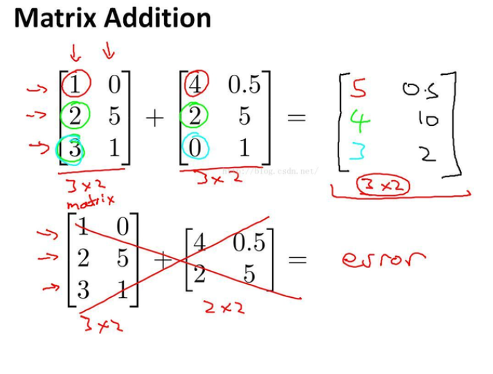
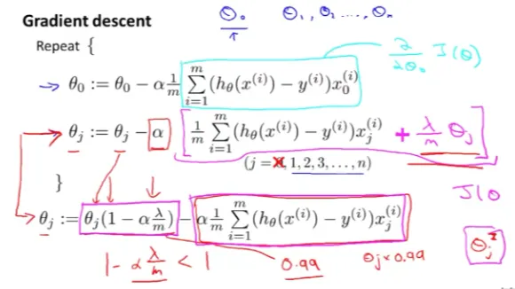
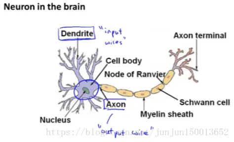
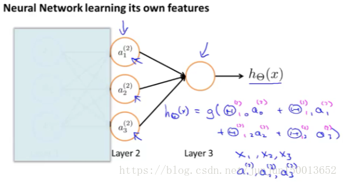
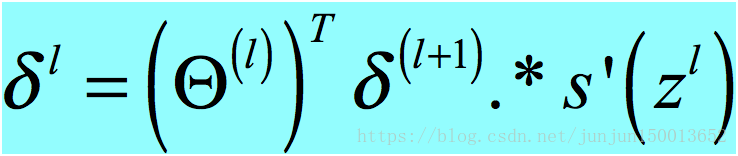
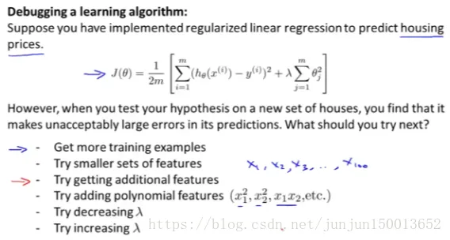

## 矩阵基础

### 矩阵定义

#### 矩阵的维度

左边的矩阵是4×2的，右边的矩阵是2×3的。

 

#### 矩阵元素表示方法

**注意：**这里的下标是**从1开始的**，而不是0。而且我们**不能访问不存在的元素**。

 

#### 列向量索引方法

通常用**大写字母**（像A,B,C,X）来表示**矩阵和向量**，用**小写字母**（像a,b,x,y）来表示**数字或者原始的数字**。

右边部分介绍了两种向量的表示方式：**1-索引法和0-索引法**。

这里我们**默认使用的是1-索引法**。

 

### 矩阵基本运算

#### 矩阵加法

注意：**只有维度完全相同**的矩阵才可以相加。

 

#### 乘除加减运算

 

 

### 矩阵乘法

两个矩阵在做乘法的时候一定要注意第一个矩阵的**列数 等于** 第二个矩阵的**行数**，相乘所得的矩阵的**行数**等于**第一个矩阵的行数**，**列数**等于**第二个矩阵的列数**。

 

 

  

#### 应用高效地计算函数值

利用**矩阵**来进行**高效地计算函数值**。

我们有一个假设函数h(x)=-40+0.25x。

①x刚好有四个实数值，分别是2104,1416，1534,852。这里先把x的四个值写成列向量[2104 1416 1534 852]T，然后在前面多加一列1，变成了一个4x2的矩阵。

②这时再把假设函数里的-40和0.25也写成列向量[-40 0.25]T。

③4x2的矩阵和2x1的矩阵相乘可以看到结果是一个4x1的列向量，里面的元素刚好是每个x对应的值

 


 

 

 

#### 应用多个假设函数计算

矩阵和矩阵的相乘看成矩阵和**多个列向量相乘。**

下图就是利用上面的知识**快速地计算多个假设函数的值**。

 

#### 交换律

两个矩阵相乘是**不符合乘法交换律**的，即AxB和BxA是**不相等**。

例如：A是mxn的矩阵，B是nxm的矩阵，

AxB得到的结果是mxm的矩阵；而BxA得到的结果是nxn的矩阵。

 

#### 结合律

**矩阵相乘符合结合律，**即Ax(BxC)=(AxB)xC。

 

### 单位矩阵

单位矩阵的一些性质。单位矩阵的**行数和列数**是**一致**的。

单位矩阵的**正对角线元素都是1**。

任意一个矩阵和相应的单位矩阵**相乘都等于其本身**。

  

### 可逆矩阵

**并不是所有的矩阵都是可逆矩阵。**

如果一个A是一个**m x m的矩阵**，那么A**存在可逆矩阵**。

如果一个**矩阵不可逆**，我们称其为**奇异矩阵或者退化矩阵**。

 

PS：矩阵的逆矩阵可以通过手算来算出来，但是**实际上大多数情况不需要用手进行手算**，直接**通过电脑、语句等手法**可以很**快速便捷的得出矩阵的逆矩阵**。

### 矩阵的转置

**行变列**，**列变行**。

根据**对角线镜像转置**。

 

## 单变量线性回归

## 多变量线性回归

之前说的房价问题，只有**一个输入**x为房屋面积，是个**标量**，**对应一个输出y**。

对于**有多个特征值**的**多元线性回归**问题，假设函数应该是


那么容易推出我们的假设函数就是  ，这里的θ和X**都是n+1维的向量**，**不是标量**

### 多变量的梯度下降算法

### 特征和多项式回归

选择了合适的**特征**后(Xi表示)**，**得到的学习算法往往是非常有效的：

例如预测房价的例子，我们有两个特征值，x1是房子的邻街**宽度**，x2时房子的**深度**，那么我们在线性回归时，我们就可以自己创造**新的特征x**=邻街宽度x房子的深度，也就是房子的**占地面积作为特征值**，而不直接使用之前的两个特征值。

**多项式**回归

它使得你们能够使用线性回归的方法来**拟合非常复杂的函数**，甚至是**非线性函数**

 

以上是住房价格的数据集，**为了拟合它**，可以**用一个二次模型**(蓝色线条)**，**但是一个二次函数**最终会降回来**，而我们并不认为 房子的价格在高到一定程度后会下降回来，因此也许我们会选择一个**不同的多项式模型，**并**转而选择使用一个三次函数**(绿色线条)，我们用它进行拟合 对这个数据集拟合得更好 因为它**不会在最后下降回来。**

如何将这些多元模型与我们的数据集进行拟合？ 使用多元线性回归的方法 我们可以通过将我们的算法做一个非常简单的修改来实现它

线性回归 ħθ(x) = θ0 +θ1×x1 + θ2×x2 + θ3×x3

三次模型ħθ(x) = θ0 +θ1×x + θ2×x^2 + θ3×x^3

通过比较我们发现我们值需要做一个非常**简单的修改**就能实现，也就是**x1=x=房子的面积(将原有的x1、x2、x3转换为了x)**，即ħθ(x) = θ0 +θ1×(size) + θ2×(size)^2 + θ3×(size)^3 然后**再应用线性回归的方法。**我**就可以拟合这个三次模型**，并**最终将一个三次函数拟合到我的数据上。**

最后要注意：**特征的归一化**

### 正规方程

正规方程 (Normal Equation) 对于**某些线性回归问题，求解参数 θ 的最优值比梯度下降更好。**

### 不可逆

## 逻辑回归

逻辑回归是一种将**数据分类**为**离散结果**的方法。

例如，我们可以使用逻辑回归将电子邮件分类为**垃圾邮件**或**非垃圾邮件**。

在这个模块中，我们介绍：

- ①**分类**的**概念**
- ②**逻辑回归**的**代价函数**
- ③逻辑回归在**多类分类中的应用**。
- ④正则化，这有助于**防止模型过度拟合训练数据**

### 分类与表示

我们**先讨论二元分类问题**，对于分类问题，我们使用最广泛的一种**学习算法**是**逻辑回归算法。**

在所有的这些问题中，我们想要**预测的变量 y** 我们可以认为 它能够取两个值 **0 或 1**。

标记为0的类：叫做负类 (negative class)

标记为1的类：也叫做正类 (positive class)

为什么**不能用线性回归**手段**解决逻辑回归问题**？

线性回归是给定**连续型自变量**，预测出连续型输出，**本质**就是一个**简单的多项式函数（或其他）**，用于**直接拟合**训练集的点。

而逻辑回归，首先，其**输出是离散的，有限的**，这是一个分类问题，最常见的是二元分类，是或否。为了限制输出，**必须进行映射**，逻辑上，我们**将是的点映射到一边**，**将否的点映射到另一边**。

 

图中数据，若用线性回归模型来拟合分类问题，**很明显不好。**

我们需要一个算法，我们发现这个算法具有以下的一些性质

- 它的**输出值永远在0到1之间，**并不会大于1也不会小于0**（后面会讲为什么）**。
- 特征值**大于某个临界值的时候**，y的值为1，**小于这个临界值**时，y为0。

后面我们会**根据这些性质来拟合学习算法**

**逻辑回归算法**，**是分类算法，**并且我们将它作为分类算法使用

### 假设函数表达式

分类问题的假设函数如何构造？

定义函数g如下： 当**z**是**一个实数**时 g(z)=1/(1+e^(-z)) 这称为 **S 型函数** (sigmoid function) 或**逻辑函数。**

S 型函数的特点是，当输入大于0向正无穷大靠近时，**收敛于1**，输入小于0向负无穷大靠近时，**收敛于0**；

 

S型函数**满足**逻辑回归问题的**两个特点**，因此我们**结合S型函数来构造我们的假设函数**如上所示，这个假设函数**实际上是个复合函数**。

有了这个假设函数 我们需要做的是 和之前一样 **用参数θ拟合我们的数据**，对于新输入样本 x 的 y 等于1的**概率的估计值**，由于我们的**y只有1和0两个取值**，我的假设函数等于 P(y=1|x;θ)表示在**给定 x 的条件下** y=1 的概率，那么就有P(y=1|x;θ)+P(y=0|x;θ) = 1

通过这个图，我们可以得到一些信息，那就是只要该假设函数输出y=1的**概率大于或等于0.5，** 那么这表示 y更**有可能等于1而不是0**，如果预测y=1的**概率小于0.5**，那么我们应该**预测y=0**，也就是只要**θ转置乘以x小于0**我们就**预测y等于0**，通过转换，我们

**最终考虑**的问题就是**θTx与0的大小关系**。

### 判定边界

明确了假设函数的公式，也已经知道了其输出结果的意义。

这里我们想知道，什么时候假设函数会预测1（或0）？

根据逻辑函数性质，当内层大于0，逻辑函数就会大于0.5，就会预测1；

**内层就是θTx**，就是我们下面要说的**决策边界**；最后决策**边界**θTx**上面的点**都会被**预测得到1**。

现在看我们**如何用参数θ拟合我们的数据**？

 

前面已经分析出我们要拟合数据集最终考虑的问题就是**θTx与0**的大小关系，对于图中的训练集，我们很容易**得到一条直线**如图，然后**计算出θ值**。

**这条直线**就是**x1+x2-3=0(横轴为x1、纵轴为x2)**；这条线被称为 **决策边界**（decision boundary）

**决策边界右边**也就是**x1+x2-3>0**的部分，就是y=1的部分。

**决策边界左边**也就是**x1+x2-3<0**的部分，就是y=0的部分。

这样我们就**找到了**拟合我们数据集的**θ值**。

本例子是一个线性的决策边界，下面是一个**非线性的决策边界**问题，我们可以添加额外的**高阶多项式**来拟合我们的数据集

 

### 逻辑回归模型

对于逻辑回归问题，将假设函数(非线性的S型)**带入**代价函数(平方误差函数)**以后**，我们发现它会变成参数θ的**非凸函数(有很多个极小值点)**，如下图，那么我们**很难用梯度下降**来**拟合出θ**。

 

那么我们将**重新构造**我们的**代价函数**，**使它成为凸函数**，以便于我们最优化。

之前线性回归问题的代价函数我们使用的是**平方误差函数，**那么很明显对于**逻辑回归问题 它不再适用了**。新的代价函数如下（这里只针对一个数据）

 

现在讲述为什么用这个作为逻辑回归的代价函数，首先我们要理解代价函数的意义：

代价函数就是假设算法要付的代价或者惩罚，比如说预测值为h(x) 而实际值是y，那么**h(x)与y偏离得越大**就会**受到很大的惩罚或者代价**。

我们继续看图：

①当y=1时，代价函数的曲线图如上，当预测值h(x) = 1时，代价函数是0，表示预测正确，不会受到惩罚。

②当预测值h(x) 越偏离1，代价函数就会越来越大。

③当y=0时的情况也是如此。

之前说到假设函数 **h 的值永远在 0 到 1 之间**，这里解释为什么，因为**超过这个范围**，**Cost(h(x), y) 就会小于0**了，这样，**J(θ) 的最小化意义**就**不大**了。

### 简化的代价函数和梯度下降模型

我们可以将Cost(h(x), y) **整合起来**，最后写成 -y log(h(x))- (1-y) log(1-h(x))。

逻辑回归的代价函数如下，他有一个最大的优点，就是它是个**凸函数**：

 

根据这个代价函数**为了拟合出参数θ** 我们怎么办呢？通过求导，得出我们的梯度下降算法如下：

 

**它和线性回归的算法是一样的**。也就是**更新参数**的，**规则**看起来**基本相同**。

但由于假设的定义**发生了变化**，所以逻辑函数的**梯度下降**，跟线性回归的梯度下降实际上是**两个完全不同的东西**。

之前谈论**线性回归的梯度下降法时**，我们谈到了如何**监控**，梯度下降法以**确保其收敛**，我通常也把同样的方法**用在逻辑回归中**，**来监测梯度下降**，以**确保它正常收敛**。

我们可以使用 **for 循环来更新**这些参数，所以 for i=1 to n 或者 for i=1 to n+1 用一个 for 循环来**更新这些参数值，**我们更提倡**使用向量化来实现。**

**特征缩放的方法也适用于逻辑回归**，如果你的特征范围差距很大的话，那么应用特征缩放的方法同样也可以让**逻辑回归中梯度下降收敛更快**。

### 高级优化算法

**Conjugate gradient(共轭梯度法)、BFGS (变尺度法)** **和 L-BFGS (限制变尺度法)** 是一些**更高级的优化算法。**

它们需要：**一种方法来计算 J(θ)** ，**一种方法计算导数项**，然后使用**比梯度下降更复杂的算法**来**最小化代价函数**。

这三种算法有许多优点：

①一个是使用这其中任何一个算法你通常**不需要手动选择学习率 α。**

②对于这些算法的一种思路是**给出计算导数项和代价函数的方法**。

③你可以认为算法有一个智能的内部循环，而且事实上他们确实有一个**智能的内部循环**称为线性搜索(line search)算法。它可以**自动尝试不同的学习速率α，**并**自动选择一个好的学习速率 α，**因此它甚至**可以为每次迭代选择不同的学习速率**那么你就不需要自己选择。

④这些算法实际上在**做更复杂的事情**，而**不仅仅是选择一个好的学习速率**，所以它们往往**最终 收敛得远远快于梯度下降。**

  

举例如上：

①右上角的代码是我们要完成的，它的**任务**是能**返回代价函数值**以及**梯值**。

②fminunc 表示 Octave 里**无约束最小化函数，**调用它的方式如下：你要设置几个 options 这个 options 变量 作为一个数据结构可以**存储你想要的 options** 。

所以 GradObj 和 On 这里**设置梯度目标参数**为**打开(on)** 这意味着你现在确实要给这个算法**提供一个梯度，**然后**设置最大，**迭代次数比方说100。

③我们给出一个 θ 的**猜测初始值**，**它是一个2×1的向量**。

④fminunc函数里 @符号表示**指向**我们刚刚定义的costFunction**函数的指针，**如果你调用它，它就会使用众多高级优化算法中的一个。当然你**也可以把它当成梯度下降，**只不过它能**自动选择学习速率α，** 你不需要自己来做，然后它会**尝试，**使用这些高级的优化算法就像**加强版的梯度下降法 为你找到最佳的 θ 值。**

⑤它在 Octave 里的样子：

costFunction 函数以文件的形式存在本地 ：

  

切换到Octave窗口如上，输入完算法敲回车。这个就会**运行优化算法**，它**很快返回值。**

它们找到 **theta 的最优值是 theta(1) 为5 theta(2) 也为5，**这正**是我们希望的**。 functionVal 的值**实际上是10的-30次幂**，所以这**基本上就是0** 这也**是我们所希望的**。 exitFlag为1，这说明它的状态，是**已经收敛了**的。

这里我得指出：用 Octave 运行的时候，向量θ的值**θ的参数向量**必须是**大于等于2维** 。

因此当我有一个**很大的机器学习问题时**，我会选择这些高级算法而**不是梯度下降，**有了**这些概念**，你就应该能将逻辑回归和线性回归**应用于更大的问题中**，这就是高级优化的概念

### 多类别分类：一对多

之前通过逻辑回归算法**解决二元分类问题。**

本节内容是使用逻辑回归 (logistic regression) 来**解决多类别分类问题。**

 

 

现在我们有一个训练集，如图所示，将其**分成三个二元分类问题**：

我们先从用**三角形**代表的**类别1**开始，拟合出一个合适的分类器：

①我们称其为h下标θ，上标(1) (x)

②这里的三角形是正样本， 而圆形代表负样本。

③可以这样想，设置三角形的值为1，圆形的值为0。

④通过训练一个标准的逻辑回归分类器，这样我们就**得到一个正边界**，这里**上标(1)表示类别1**，我们用同样的方法分析出第2，3个分类器。

⑤所以 h(i) 实际上是在计算**给定x**，**以θ为参数时**，**y的值为i的概率是多少 。**

总之，我们已经把要做的做完了，现在要做的就是**训练这个逻辑回归分类器 h(i)，**其中 i 对应每一个可能的 y=i。

最后需要做出预测时，给出一个输入值 x，将x带入到h(1)，h(2)，h(3)中，

我们要做的就是：在我们三个分类器里面输入 x 然后， 我们选择h(i)，由于h(i)代表着P（y=i | x；θ），也就是y=1或y=2或y=3最大，因此可以根据那个h(i)最大得到该对应的y等于哪个i。

你现在知道了基本的挑选分类器的方法，选择出哪一个分类器是**可信度最高效果最好的，**那么就可认为得到一个正确的分类，无论i值是多少，我们**都有最高的概率值**，我们预测 y 就是那个值。

这就是多类别分类问题，以及一对多的方法，通过这个小方法，你现在也可以将逻辑回归分类器用在**多类分类的问题上。**

## 正则化

### 防止过度拟合

 

过度拟合问题：

例如：那个用线性回归来预测房价的例子，我们通过建立以住房面积为自变量的函数来预测房价，我们可以对该数据做线性回归，以下为三组数据做线性拟合的结果：

①第一个图我们用**直线去拟合**，这不是一个很好的模型。

我们看看这些数据，很明显，随着房子面积增大，住房价格的变化**应趋于稳定**，或者**越往右越平缓。**

因此该算法没有很好拟合训练数据，我们把这个问题称为**欠拟合(underfitting)**，这个问题的另一个术语叫做**高偏差(bias) 。**

②第二个图我们用**二次函数来拟合它**，这个**拟合效果很好** 。

③第三个图我们拟合一个**四次多项式，**因此在这里我们有五个参数 θ0到θ4 这样我们可以拟合一条曲线，通过我们的五个训练样本，你可以得到看上去如此的一条曲线。

这条回归直线**似乎**对训练数据做了一个**很好的拟合**，因为这条曲线通过了所有的训练实例。但是这仍然是一条**扭曲的曲线**。事实上，我们并**不认为它是一个预测房价的好模型。**

所以 这个问题我们把他叫做**过度拟合或过拟合(overfitting)，**另一个描述该问题的术语是**高方差(variance)**。 高方差是另一个**历史上的叫法**，但是从第一印象上来说，如果我们拟合一个**高阶多项式，**那么这个函数能**很好的拟合训练集，**能拟合**几乎所有的训练数据**。这就面临可能**函数太过庞大的问题、变量太多。**

**如果**我们**没有足够的数据去约束这个变量过多的模型** 那么这就是**过度拟合**。

概括地说：过度拟合的问题，将会在变量过多的时候，发生这种时候训练出的方程总能很好的拟合训练数据。所以你的代价函数实际上**可能非常接近于0或者就是0**。 但是这样的曲线，它千方百计的拟合于训练数据，这样导致它**无法泛化到新的数据样本中**，以至于无法预测新样本价格。

在这里术语"泛化" 指的是一个假设模型能够应用到新样本的能力，新样本数据是没有出现在训练集中的房子。

在上图中，我们看到了**线性回归**情况下的**过拟合**。

**过拟合**同样可能出现到**逻辑回归中**，如下图所示：

 

接下来，我们会学到调试和诊断：

**诊断**出**导致学习算法故障的东西，**以及如何用专门的工具来**识别 过拟合**和可能发生的**欠拟合**

解决过度拟合有两个办法

①第一个办法是：**尽量减少选取变量的数量** 。

**例如 模型选择算法：**

这种算法的优点：自动选择采用哪些特征变量、自动舍弃不需要的变量。这种**减少特征变量**的做法是非常有效的。并且可以**减少过拟合的发生**。

这种算法的缺点：舍弃一部分特征变量 你也**舍弃了**问题中的**一些信息**

②第二个办法是：**正则化**。正则化中我们**将保留所有的特征变量。**

### 代价函数

 

我们看到了，如果说我们要用一个二次函数来拟合这些数据。它给了我们一个对数据**很好的拟合**。然而，如果我们用一个更高次的多项式去拟合。我们最终可能得到一个曲线能非常好地拟合训练集。但是这真的**不是一个好的结果**，它过度拟合了数据因此**一般性并不是很好**。

现在我们来综合两个曲线的优势，二次曲线拟合得不错，但是**均方误差比高次曲线的要大**，那么我们可以找到这样一个函数，**接近二次曲线**的**高次曲线**，要实现这个函数，我们只需要将**θ3 和 θ4设置得足够小**，**接近0**就可以了。

这里给出了正规化背后的思路：如果我们的参数值对应一个较小值的话，就是说参数值比较小 那么往往我们会得到一个形式更简单的假设。

 

对于房屋价格预测，我们可能有上百种特征，我们谈到了一些可能的特征，比如说 x1 是房屋的尺寸 x2 是卧室的数目 x3 是房屋的层数等等。那么我们可能就有一百个特征。但是我们并不知道要将**哪几个θ设置得足够小**，也不知道要去**缩小几个θ**，因此我们可以通过**添加一个额外的正则化项**，来**缩小我们前面的所有θ。**

注意：正则化项是从**θ1开始**的，并且 **λ** 在这里我们称做**正规化参数**。

λ 要做的就是：

1. 使假设**更好地拟合训练数据**
2. 我们想要**保持参数值θi较小**

 

在正规化线性回归中：

如果**正规化参数值被设定为非常大**，那么我们会使所有这些参数接近于零：

θ1将接近零，θ2 将接近零，θ3 和 θ4 最终也会接近于零。

（因为 这一额外的正则化项小**，接近于0。）

（因为θ0 = 1，所以从θ1开始正则化）

如果我们这么做，那么就是我们的假设中，**相当于去掉了这些项**。

并且使我们**只留下了一个简单的假设**，这个假设表明：房屋价格就等于 θ0 的值，那就是类似于拟合了 一条水平直线。

对于数据来说，这就是一个**欠拟合 (underfitting)** ，这种情况下，这一假设它是条失败的直线，对于训练集来说，这只是一条**平滑直线**，它**没有任何趋势**，它**不会去趋向大部分训练样本的任何值**。

这句话的另一种方式来表达就是：这种假设有**过于强烈的"偏见" 或者过高的偏差(bais)， 认为**预测的价格**只是等于 θ0**。

**为了**使**正则化运作良好**，我们应当注意一些方面，应该去**选择一个不错的正则化参数 λ** 。

并且当我们以后讲到**多重选择时**，在后面的课程中，我们将讨论一种方法：一系列的方法来**自动选择正则化参数 λ** ，这就是高度正则化的思路

### 正则化具体模型分类

#### 线性回归正则化

 

这是**正则化以后**的**代价函数的梯度下降迭代算法**

具体来说 **(1-αλ/m )** 通常是一个**具体的实数，**而且小于1。由于αλ/m很小，所以(1-αλ/m )将是一个比1**小一点点的值。**所以我们可以把它想成一个像0.99一样的数字。

所以对 θj 更新的结果，我们可以看作是被替换为 **θj 的0.99倍。**另外 θj 后边的第二项，这实际上与我们原来的梯度下降更新完全一样。

跟我们加入了正则项之前**规则大致是一样的**，不同的是：

当我们使用正则化线性回归时，我们需要做的就是在每一个被**正规化的参数 θj 上**乘以了一个**比1小一点点的数字**，也就是把**参数压缩**了一点。然后，我们**执行跟以前一样的更新**。

 

这是正则化以后的**代价函数的正规方程**

 

正规化方程推导步骤：

[正规方程（含推导过程） from 吴恩达的机器学习blog.csdn.net/melon__/article/details/80589759](https://link.zhihu.com/?target=https%3A//blog.csdn.net/melon__/article/details/80589759)

关于不可逆性的问题，如果你的**样本数量m 比特征数量n小的话**，那么这个矩阵 **X 转置**乘以 **X** 将是 **不可逆或奇异的(singluar) 。**或者用另一种说法是这个矩阵是**退化(degenerate)的。**

如果你在 Octave 里运行它，无论如何，你用函数 pinv 取伪逆矩阵。这样计算**理论上方法是正确的**，但实际上，你**不会得到一个很好的假设。**

正规化也为我们解决了这个问题，具体地说**只要正则参数是严格大于0的**，这个矩阵将**不是奇异的**，即该矩阵将**是可逆的**。因此，使用正则化还**可以照顾一些 X 转置乘以 X 不可逆的问题。**

#### 逻辑回归正则化

对于逻辑回归，我们之前已经看到，如果您使用这种非常高阶的多项式拟合逻辑回归，也**可能容易出现过度拟合**。

 

以上我们通过惩罚参数θ1、θ2等等直到θn。

如果你这样做，那么它会产生这样的效果，即使你正在拟合一个具有很多参数的非常高阶的多项式。

只要你**应用正则化并保持参数小**，你就**更有可能获得决策边界**。(玫红色曲线) 分离正面和负面的例子**看起来更合理**。

 

这是**逻辑回归的梯度下降更新算法**，它和线性回归是**一样的**，但是实际上不一样，因为**假设函数是不一样的**。

## 神经网络

### 背景

#### 传统困境

 

考虑这个**监督学习分类的问题**，我们**已经有了对应的训练集**，如果利用逻辑回归算法来解决这个问题。**首先需要构造一个包含很多非线性项的逻辑回归函数。**

事实上，当多项式项数**足够多时**，那么可能你能够得到一个，分开正样本和负样本的**分界线，** 当**只有两项时**，比如 x1、x2 这种方法确实**能得到不错的结果，**因为你可以把x1和x2的所有组合都包含到多项式中，但是对于许多复杂的机器学习问题，涉及的项**往往多于两项。**

房价预测的问题：假设现在要处理的是房子在未来半年内，能被卖出去的概率，**这是一个分类问题**。对于不同的房子有可能就有上百个特征，对于这类问题，如果要包含所有的二次项，在n=100的情况下，最终也有5000个二次项，随着**特征个数n的增加**。二次项的个数**大约以n^2的量级增长，**因此要包含所有的 二次项是很困难的，所以这可能不是一个好的做法。

而且由于**项数过多**，最后的结果很有可能是**过拟合的。**此外，在处理这么多项时，也存在**运算量过大的问题**。当然，你也可以试试**只包含上边这些二次项的子集**，但是由于**忽略了太多相关项，**在处理类似左上角的数据时，**不可能得到理想的结果**。**5000个二次项**看起来已经很多了，而现在假设包括三次项或者三阶项，大概**17000个三次项**，这**并不是一个好做法**。

 

举个例子：关于计算机视觉中的一个问题。假设你想要使用**机器学习算法**来训练一个**分类器**，使它**检测一个图像，**来判断图像是否为一辆汽车，我们取出这幅图片中的一小部分，将其放大。比如图中这个红色方框内的部分，当人眼看到一辆汽车时，计算机实际上看到的却是这个 一个数据矩阵，它们表示了像素强度值，告诉我们图像中每个像素的亮度值。因此，对于计算机视觉来说问题就变成了：根据这个像素点亮度矩阵来告诉我们这些数值代表一个汽车门把手。

 

具体而言，当用机器学习算法**构造一个汽车识别器**时，我们要想出**一个带标签的样本集。**其中一些样本是各类汽车，**另一部分样本是其他任何东西**，将这个样本集输入给学习算法，以训练出一个分类器。训练完毕后，我们输入一幅新的图片，让分类器判定“这是什么东西？” 理想情况下，分类器能识别出这是一辆汽车：

 

为了理解引入非线性分类器的必要性，我们从学习算法的训练样本中**挑出一些汽车图片和一些非汽车图片**，我们从其中**每幅图片中挑出一组像素点 pixel1和pixel2**。

在坐标系中画上更多的新样本，用**''+"表示汽车图片**用“-”表示非汽车图片，我们现在需要一个**非线性分类器来尽量分开这两类样本。**

这个分类问题中**特征空间的维数是多少？** 假设我们用**50\*50像素**的图片，一共**2500个像素点。**因此，我们的**特征向量的元素数量 n=2500，**特征向量X 包含了所有像素点的**亮度值。**如果我们用的是**RGB彩色图像，**每个像素点包含红、绿、蓝三个子像素，那么我们的**特征向量的元素数量就变为**n=7500。因此，如果我们非要通过**包含所有的二次项**来**解决这个非线性问题，**那么，这就是式子中的所有条件。 xi*xj 连同开始的2500像素，**总共大约有300万个**。这计算成本太高了并不是一个解决复杂非线性问题的好办法 。

#### 神经元和大脑

神经网络产生的原因是人们想尝试设计出**模仿大脑 的算法**。从某种意义上说，如果我们想要建立学习系统，那为什么不去模仿我们所认识的最神奇的学习机器——人类的大脑呢？

神经网络逐渐兴起于二十世纪八九十年代，应用得非常广泛。但由于各种原因，在90年代的后期应用减少了。但是最近，神经网络又东山再起了。其中一个原因是：神经网络是**计算量有些偏大的算法**。然而，大概由于近些年，**计算机的运行速度变快**，才足以真正运行起大规模的神经网络。正是由于这个原因，和其他一些我们后面会讨论到的**技术因素**。如今的神经网络对于许多应用来说是最先进的技术。

当你想模拟大脑时，是指想制造出与人类大脑作用效果相同的机器，对吧？

**大脑**可以学会去 以看而不是听的方式处理图像，学会处理我们的触觉。

**我们**能学习数学，学着做微积分。

**大脑**能处理各种不同的令人惊奇的事情。

**似乎**如果你想要模仿它，你得写**很多不同**的软件来模拟所有，大脑告诉我们的这些五花八门的奇妙的事情。不过能不能假设大脑做所有这些不同事情的方法。不需要用上千个不同的程序去实现。相反的，大脑处理的方法，**只需要一个单一的学习算法就可以了？** 尽管这只是一个假设。

 

不过让我和你分享一些这方面的证据：大脑的这一部分，这一小片**红色区域**是你的**听觉皮层。**你现在正在**理解我的话**，这**靠的是耳朵**。耳朵接收到声音信号，并把**声音信号传递**给你的，**听觉皮层**正因如此你才能明白我的话。

神经系统科学家做了下面这个有趣的实验：

①把耳朵到听觉皮层的神经切断，在这种情况下，将其**重新接到一个动物的大脑上**，这样**从眼睛到视神经的信号最终将传到听觉皮层**。如果这样做了，那么结果表明**听觉皮层**将会**学会“看”** 。这里“看”代表了 我们所知道的每层含义，所以，如果你对动物这样做，那么动物就可以完成视觉辨别任务，它们**可以看图像**，并根据图像做出适当的决定，它们正是通过脑组织中的这个部分完成的。

②右边另一个例子：这块红色的脑组织是你的**躯体感觉皮层**，这是你用来处理触觉的，如果你做一个和刚才类似的重接实验。那么躯体感觉皮层也能学会”看“ 这个实验和其它一些类似的实验，被称为**神经重接实验**。

从这个意义上说，如果人体有同一块脑组织可以处理光、 声或触觉信号，那么也许存在**一种学习算法** **可以同时处理视觉、听觉和触觉**，而不是需要运行上千个不同的程序，或者上千个不同的算法来做这些大脑所完成的成千上万的美好事情，也许我们需要做的就是找出一些**近似的或实际的大脑学习算法，**然后实现它。

大脑通过自学掌握如何处理这些不同类型的数据，在很大的程度上，可以猜想如果我们把几乎**任何一种传感器**接入到大脑的几乎**任何一个部位**的话，**大脑就会学会处理它**。

 

第一个例子：左上角的这张图是用**舌头学会“看”**的一个例子。它的原理：这实际上是一个名为BrainPort的系统，它现在正在FDA (美国食品和药物管理局) 的临床试验阶段，它能帮助失明人士看见事物。它的原理是：你在**前额上带一个灰度摄像头**，面朝前，它就能**获取你面前事物的低分辨率的灰度图像**。你连一根线，到舌头上安装的电极阵列上。那么**每个像素都被映射到你舌头的某个位置上**，可能电压值高的点对应一个暗像素，电压值低的点对应于亮像素。即使依靠它现在的功能，使用这种系统就能让你我在几十分钟里就学会用我们的舌头“看”东西。

第二个例子：关于**人体回声定位或者说人体声纳**，你有两种方法可以实现。你可以**弹响指或者咂舌头**，不过现在有失明人士确实在学校里接受这样的培训，并学会解读从环境反弹回来的声波模式—这就是声纳。如果你搜索 YouTube之后，就会发现：有些视频讲述了一个令人称奇的孩子，他因为癌症眼球惨遭移除，虽然失去了眼球，但是**通过打响指**，他可以四处走动而不撞到任何东西。他能滑滑板，他可以将篮球投入篮框中，注意这是一个没有眼球的孩子。

第三个例子：触觉皮带。如果你把它戴在腰上，蜂鸣器会响，而且总是**朝向北时 发出嗡嗡声**。 它可以使人**拥有方向感**，用类似于鸟类感知方向的方式。

还有一些离奇的例子：如果你在青蛙身上插入第三只眼，青蛙**也能学会使用那只眼睛**。

这些例子非常令人惊奇，**如果你能**把几乎**任何传感器接入到大脑中**，大脑的**学习算法就能找出学习数据的方法 并处理这些数据**。从某种意义上来说，如果我们能找出大脑的学习算法，然后在**计算机上执行大脑学习算法或与之相似的算法**。 也许这将是我们向人工智能迈进做出的最好的尝试。人工智能的梦想就是有一天能制造出**真正的智能机器。**

### 神经网络模型(单输出)

运用神经网络时，我们该如何**表示我们的假设或模型**：

 

神经网络是在模仿大脑中的神经元或者神经网络时发明的，因此，要解释如何表示模型假设，我们先来看**单个神经元**在大脑中是什么样的。

我们的大脑中充满了这样的神经元，**神经元**是**大脑中的细胞**，其中有两点值得我们注意：一是神经元有像这样的**细胞主体**，二是神经元有一定数量的**输入神经**。

这些输入神经叫做**树突**，可以把它们想象成**输入电线**。它们**接收来自其他神经元的信息**。神经元的输出神经叫做**轴突**，这些输出神经是用来**给其他神经元 传递信号或者传送信息的**。

简而言之，神经元是**一个计算单元**。它从输入神经**接受**一定数目的信息，并做一些**计算**。然后将结果通过它的轴突**传送**到其他节点，或者大脑中的其他神经元。

这就是所有 人类思考的模型： 我们的神经元把自己的收到的消息进行**计算，**并向其他神经元**传递**消息。

 

输入x1、x2、x3，输出为hθ(x)=1/(1+e(-θTX))，这是一个**非常简单的模型**来模拟神经元的工作。我们将**神经元模拟成一个逻辑单元**，**黄色圆圈类似于神经元**，一个有s型函数或者逻辑函数**作为激励函数的人工神经元**，在神经网络术语中，激励函数只是对类似非线性函数**g(z)的另一个术语称呼。θ**为模型的参数**，**有时候也叫**“权重”**， x0是偏置神经单元，因为x0总是等于1，有时会画出来，**有时不会画出来**，这取决于是否对例子有益。， x1 x2 x3 类似于输入神经， h(x)为输出神经。

 

神经网络其实就是这些**不同的神经元组合在一起**的集合。具体来说，这里是我们的**输入单元**x0 x1 x2和 x3，**神经元**a(2)1 a(2)2 和a(2)3(a(2)0也是额外的偏置单元，它的值也是1)，最后一层输出**假设函数**h(x)计算的结果。

这个例子中，我们有一个输入层—第1层，一个隐藏层— 第2层，一个输出层—第3层。但实际上，**任何非**输入层或非输出层的层就被称为**隐藏层**。

 

a上标(j) 下标i表示：第j层的第i个神经元或激励 ，所谓激励(activation)是指由一个具体神经元**读入，计算并输出**的值。

在这里，我们有三个输入单元和三个隐藏单元。这样一来**参数矩阵**控制了我们来自三个输入单元，三个隐藏单元的**映射**。因此**θ(1)**将变成一个**3乘4维的矩阵。**

**更一般的**，如果一个网络在**第j 层有Sj个单元，**在**j+1层有Sj+1个单元，**那么矩阵**θ(j)** 即控制**第j层到 第j+1层映射**的矩阵的**维度为Sj+1 \* (Sj+1)**

最后，在输出层，我们还有一个单元，它计算 h(x) 这个也可以写成**a(3)1(第三层，第一个元素)**

#### 前向传播向量化法

**前向传播的向量化**实现

 

这些**z值**都是**一个线性组合**，是输入值θ0 θ1 θ2 θ3与 x0 x1 x2 x3的**加权线性组合**，我可以定义**a(1) 等于向量x** 。这个计算h(x)的**过程**也称为**前向传播**(forward propagation) 。这样命名是因为我们**从输入层的激励开始**，然后进行**前向传播给隐藏层**并**计算隐藏层的激励**。然后，我们继续前向传播，并**计算输出层的激励**。这个从输入层到隐藏层再到输出层，**依次计算激励**的过程叫**前向传播**。

 

 

我们将**输入层隐藏掉**，可见特征项a1 a2 a3它们是**作为输入来学习**的。具体来说，就是**从第一层映射到第二层的函数**，这个函数由其他一组参数**θ(1)决定**。

所以在神经网络中，它**没有用输入特征x1 x2 x3** 来训练逻辑回归，而是**自己训练逻辑回归的作为输入**。a1 a2 a3 可以想象如果在**θ(1)中选择不同的参数**， 有时可以学习到一些很有趣和**复杂的特征**。就可以得到一个**更好的假设**，比使用原始输入x1 x2或x3时得到的假设更好，下一节会讲为什么。

你还可以用**其他类型的图**来表示**神经网络**，神经网络中**神经元相连接的方式**称为**神经网络的架构**，所以说**架构**是指不同的神经元是**如何相互连接**的。

这个不是特别理解

### 逻辑运算

神经网络中，单层神经元（无中间层）的计算可用来表示逻辑运算，比如逻辑与(AND)、逻辑或(OR)

#### **实现逻辑”与AND”**

 

#### **实现逻辑"或OR"**

 

#### **与运算**和**先非再与**

 

#### **同或运算**

 

思路，同或就是两个相同的二进制结果为1。相同就是x1,x2(第一层)经过**与运算**(**第二层第一个神经元**)，X运算(**第二层第二个神经元**)，再经过**或运算**(**第三层的神经元**)后得到同或运算(**输出**)。

在输入层中，我们只有**原始输入值**，然后我们建立了一个**隐藏层**用来计算稍微复杂一些的**输入量的函数**，然后通过**添加另一个隐藏层**，我们得到了一个**更复杂一点的函数**，这就是关于神经网络可以计算较复杂函数的某种直观解释。

### 应用场景

#### 多类分类问题

当输出中不止有两种分类时，比如使用神经网络算法来识别路人、汽车、摩托车等。

 

- 输入向量有3个维度，两个中间层
- 输出层有4个神经元表示4种分类，也就是每一个数据在输出层都会出现`[a,b,c,d]T`，且`[a,b,c,d]中仅有一个为1，表示当前类

#### TF手写数字问题

上述多类分类问题和TF中手写数字问题类似，解决办法如下：

 

1. 手写数字图片数据


总类别数是10，即输出节点总数值dout=10dout=10，假设某个样本的类别是i，即图片中的数字是ii，需要一个长度为10的向量yy，索引号为ii的位置设置为1，其余是0。


- 0的one-hot编码是[1,0,0,0,….]
- 1的one-hot编码是[0,1,0,0,….]
- 其余类推

### 神经网络模型（多输出）

 

假设我们有一个**如左边所示**的**神经网络结构**。我用**大写字母 L** 来表示这个神经网络结构的**总层数**。这里 L等于4，用 **sl**表示**第L层的单元的数量**，也就是**神经元的数量**，这其中**不包括L层的偏差单元**。这里s1 = 3 是输入层 s2 =5 输出层s4 = 4。把**K**看作**输出层的单元数目**，我们只有在K**大于或者等于3个类**的时候才会使用这种**一对多**的方法。因为如果只有**两个类别**的时候，我们就**只需要一个**输出单元就可以了。

### 神经网络代价函数

 

上面的是逻辑回归的代价函数，下面的是神经网络的代价函数。

h(x)**带下标i来表示第i个输出**，也就是h(x)是一个**K维向量，**下标 i 表示选择了神经网络输出向量的**第i个元素。**

这里的**第二项**，这就是类似于我们在逻辑回归里所用的**正则化项，**

 是额外的正则化项，从j到n，是因为我们没有把 正则化。

在逻辑回归中，我们只有**一个输出变量**，又称标量，也只有一个**因变量y**,但是在神经网络中，我们可以**有很多输出变量**，我们h(x)是一个维度为**K的向量**，并且我们训练集中的因变量也是**同样维度的一个向量**，因此我们的代价函数会比逻辑回归更加复杂一些，为：


这是一个很复杂的函数，我们添加了一些**嵌套的求和来计算多个输出节点**。在函数的第一部分中括号前面我们额外添加了求出各个节点的代价函数的求和，在正则化部分，需要计算多元的矩阵运算，当前  矩阵中的列数等于我们当前层中的节点数（包括偏差单元） ,在当前的 矩阵中，行数等于下一层的节点数（不包括偏置单元） ，在逻辑回归之前，将每一项都进行平方。

在神经网络的代价函数中：它所做的就是**把这些项全部相加**，也就是对所有i j和l 的θji的值都相加，这里要**除去那些对应于偏差值的项**。

### 反向传播

参考：https://blog.csdn.net/fsfjdtpzus/article/details/106256925

反向传播算法 ：**最小化**神经网络的**代价函数**

 

为了使用**梯度下降法**或者其他某种高级优化算法，我们需要做的就是**写一个函数，传入参数 θ，** 然后**计算 J(θ) 和偏导数项。**

如何计算这些偏导数项？

 

我们假设**只有一个训练样本记为 (x, y)** 首先应用**前向传播方法**来它的输出。

这里的**a(1) ～a(4)都是向量。**

然后用反向传播(Backpropagation)的算法**计算导数项** 反向传播的**式子太多**，参考

[反向传播算法几个重要公式的详细推导_小T是我-CSDN博客blog.csdn.net/junjun150013652/article/details/80748759](https://link.zhihu.com/?target=https%3A//blog.csdn.net/junjun150013652/article/details/80748759) 

有这些重要公式的详细推导过程

 

反向传播算法从直观上说，就是对每一个结点，我们计算这样一项 **δ下标 j 上标(l)** 代表了第 l 层的第 j 个结点的**误差**。**a上标 (l) 下标 j** 表示的是第 l 层第 j 个单元的**激励值**。所以这个 δ 项就表示在这个神经节点的**激励值的误差**。

注意这里红色的δ(4)、a(4) 和 y **都是一个向量**，并且向量维数等于**输出单元的数目**，也就是**4维**。

我们首先计算出网络结构的误差项 δ(4)， 然后**根据 δ(4) 计算 δ(3)**，以此类推，注意这里的点乘，这个例子中我们的 **δ 项就只有第2层和第3层。**

反向传播法这个名字，源于我们从**输出层开始计算δ项，**然后我们返回到上一层，计算第三隐藏层的 δ项，接着我们再往前一步来计算 δ(2)，所以说我们是类似于把**输出层的误差反向传播给了第3层，**然后是**再传到第二层**，这就是反向传播的意思。

 

这里总结了反向传播算法的流程

有 m 个样本的训练集，正如此处所写，首先**初始化Δ = 0 (**这里的**Δ就是δ**) **Δ(l)ij** 会被用来计算 **J(θ) 关于 θ 上标(l) 下标 i j 的 偏导数，**这些 δ 会被作为**累加项**，慢慢地增加，以算出**这些偏导数**。

接下来我们将遍历我们的训练集，首先**设定a(1)，**也就是**输入层的激励函数**，**设定**它**等于 x(i)**。接下来我们运用正向传播，来计算第二层的激励值，然后是第三层、第四层。一直这样**到最后一层 L层**。接下来用样本的**输出值 y(i)** **计算** 这个输出值所对应的**误差项 δ(L)**， 继续运用反向传播算法来**计算 δ(L-1) δ(L-2)**， 一直这样**直到 δ(2)**。

最后用 Δ 来**累积偏导数项，**然后**跳出这个 for 循环**，然后计算下面这些式子，注意在 j=0 的情况下**对应偏差项**，所以**没有额外的正则化项**。

### 前向传播流程

 

前向传播流程，输入层是**第i个训练样本x(i)**，进行前向传播**传播到第一个隐藏层时，**我们的做法是算出 z(2)1和 z(2)2这两个值是输入单元的**加权总和**。接下来，将**S型的逻辑函数应用到z值上**，得到 **a(2)1 和 a(2)2 的值**。然后，再做一次前向传播，最后我们得到 z(4)1 应用逻辑函数，得到 a(4)1 这也是这个网络的输出单元的值。这里**观察z的计算**，后面会和反向传播对比，它们实质是一样的，**只有计算的方向不同**而已。

 

为了更好地理解反向传播算法的原理，我们把目光转向**代价函数**。这个代价函数对应的情况是**只有一个输出单元**，我们用同一个样本同时来**做正向和反向传播**，不考虑正则化(即 � 等于0)，因此第二项就等于0，这个求和运算括号里面**与第i个训练样本对应的代价项**所扮演的角色。可以看作是**平方误差这里的cos(i)** 表征了该神经网络**是否能准确地预测样本i的值**，也就是**输出值**和**实际观测值y(i)的接近程度**。

 

反向传播算法就是在计算**所有这些δ(i)j项，**它的计算**和前面前向传播z的计算过程是一样**的。

δ 项实际上是关于 **z(l)j 的 偏微分，**也就是 cost 函数。因此，它们度量着我们对神经网络的**权值做多少的改变**。对中间的计算量**影响是多少**，进一步地对整个神经网络的输出 h(x) **影响多少**，以及对整个的代价值**影响多少**。

我们**先算出了 δ(4)1等于 y(i) 减去 a(4)1，**接下来我们要对这些值**进行反向传播**，我们计算出 δ(3)1 和 δ(3)2，然后同样的，再进行**下一层的反向传播。**这一次计算出 **δ(2)1 以及 δ(2)2** 反向传播的计算。

注意：我们计算出这些**δ的过程**，和之前**计算z是一样的**，是**后一层的δ乘以权重θ的和**。

### 参数向量化

 

代价函数costFunction，**输入参数是theta，**返回值是代价函数以及导数值，将**返回值 传递给 高级最优化算法**fminunc。这个算法是**假设theta和gradient是向量，**而对于神经网络，我们的参数都是矩阵θ(1) θ(2) θ(3)。

 

如图，上面是**取出这些矩阵**，并且将它们**展开成向量，**下面是从**向量表达**返回到**矩阵表达式**：

 

### 学习算法

- **假设你有**一些**初始参数值 θ(1) θ(2) θ(3)，**我们要做的是**取出这些参数**并且将它们**展开为一个长向量，**我们称之为initialTheta。
- 将initialTheta**作为theta参数的初始设置**，**传入函数fminunc**
- 执行代价函数costFunction **参数thetaVec 也是向量**

函数实现部分：首先使用 thetaVec和重组函数reshape **重组**，**以得到参数矩阵 θ(1) θ(2) θ(3)**。 这样就能以更方便的形式执行**前向传播和反向传播**来计算出导数，以求得代价函数的J(θ)。函数最后**取出这些导数值，展开D1 D2 D3** 来**得到gradientVec，**它是代价函数的**返回值，** 而且**是一个向量**。

### 梯度校验

在实现反向传播时，会遇到**很多细小的错误，**你把它和梯度下降法 、或者其他优化算法一起运行时，可能看起来它运行正常，并且你的代价函数J最后可能**在每次梯度下降法迭代时**都会**减小，**即使在实现反向传播时有一些小错误，**可能也会检查不出来，**所以它看起来是 **J(θ)在减小，**但是可能你最后得到的神经网络误差较高，但是很难找出原因。有一个叫**梯度检验(Gradient Checking) 的方法**可以解决。

 

考虑上面这个例子，假如我有一个函数J(θ)，我想估计**这个函数在实数θ点的导数。**

我们可以用这条**红色线的斜率**来作为我导数的**近似值**。**真正的导数**是这边这条**蓝色线的斜率** 这条红线的斜率等于 J(θ+ε)-J(θ-ε)除以2ε， **给ε取很小的值，**比如可能取 10的-4次方，右边蓝色这个求导方式叫做**单侧拆分，**左边这个公式叫做**双侧拆分，双侧差分更精确**。

 

现在θ是n维向量，是神经网络参数的**展开形式**，我们可以用类似的想法来**估计所有的偏导数项**，如图所示

 

在Octave里的实现如上，最后将gradApprox **与**我们从**反向传播得到的DVec 比较，**如果结果**非常近似**那么你**就可以非常确信**，你实现的**反向传播**是**正确**的

 

**总结梯度检验**

- 1，将计算得到的D(1),D(2),D(3)**展开**为DVec向量。
- 2，实现数值梯度检验，**计算**出gradApprox。
- 3，**确定**DVec和gradApprox给出**接近**的结果。
- 4，**关掉**梯度检验，不再使用，**使用DVec来计算**，因为gradApprox计算量**非常大**。

### 随机初始化

当你运行一个算法，例如**梯度下降算法，**或者**其他高级优化算法时，**我们需要给变量θ一些初始值，是否可以将 θ 的初始值设为**全部是0的向量，**在逻辑回归时，初始化所有变量为0**是可行的，**但在训练神经网络时这样做**是不可行的。**

如果将**所有变量初始化为0** (这里可以考虑从每一个**输入出发**的**θ都是相等的**，即x1到a(2)的θ相等，即x2到a(2)的θ相等...那么对于**第二层的z = θ‘x 就都相等了**) 那么就有每一个隐藏层的**a和δ**都是相等的 同时 如果你更深入地挖掘一下，你不难得出**这些变量对参数的偏导数互为相等，**即使更新一个梯度下降，**最后这些权重也会互为相等，**所以每次更新后，隐藏单元的输入对应的参数将是相同的。因此，第l层的a(l)都是相等的，这也就意味着这个神经网络**的确不能计算更有价值的东西**。想象一下**不止有两个隐藏单元，**而是**有很多很多的隐藏单元，**这就是说**所有的隐藏单元都在计算相同的特征，**所有的隐藏单元都通过**完全相同的输入函数**计算出来 这是**完全多余的表达。**

为了解决这个问题，神经网络变量初始化的方式采用**随机初始化**范围在 -ɛ 到 +ɛ 之间。

Octave实现如下 rand 就是用来得出一个任意的**二维矩阵，**矩阵中的所有值都**介于0到1之间。**

 

总结来说，为了训练神经网络，应该对权重进行**随机初始化初始化为-ε到+ε间，接近于0的小数**，然后进行**反向传播**，执行**梯度检查**，或者使用**高级的优化算法**，试着使代价函数 J 达到最小**从某个随机选取的参数 θ 开始** ，来**打破对称性。**

### 总结

当我们在训练一个神经网络时，我们要做的第一件事就是：搭建网络的**大体框架**，这里我说的框架意思是神经元之间的**连接模式**，这里有如下几种结构：

 

那么我们该如何做出选择呢？ 对于**输入和输出层的单元数**是已经**确定**的。

我们只需要考虑：**隐藏单元的个数**以及**隐藏层的数目**

规则一：只使用单个隐藏层

规则二：如果你使用不止一个隐藏层的话，每一个隐藏层通常都**应有相同的单元数**

规则三：隐藏单元**越多越好 (计算量一般会比较大)**

规则四：隐藏单元的数目应该和输入x 的维度，即特征的**数目匹配** (数量**相同**或者是它的**二倍**或者**三倍、四倍**，取为**稍大于输入特征数目**都是可以接受的)

实现神经网络的训练过程，这里一共**有六个步骤：**


第一步：构建一个神经网络，然后**随机初始化权值**

第二步：**执行前向传播算法**，也就是对于该神经网络的任意一个输入x(i) 计算出对应的h(x)值 也就是一个输出值y的向量

第三步：通过**代码计算出代价函数J(θ)**

第四步：**执行反向传播算法，**来算出这些**偏导数或偏微分项，**也就是 **J(θ)关于参数θ的偏微分**

具体来说，我们要对所有训练集数据使用一个**for循环进行遍历，**一些比较**先进的分解方法**可能不需要像这里一样使用 for循环来对所有 m个训练样本进行遍历。但是，这是你第一次进行反向传播算法，所以我建议你最好还是使用一个for循环来完成程序对每一个训练样本进行迭代**执行前向传播和反向传播算法。**

具体来说就是：我们把x(i) 传到输入层，然后**执行前向传播和反向传播，**这样我们就能得到该神经网络中每一层中每一个单元对应的所有这些**激励值a(l)** 和**delta项，**记得考虑使用**正则化项lambda值**。

第五步：**梯度检查**

第六步：使用一个最优化算法，比如说**梯度下降算法**或者说是**更加高级的优化方法，**比如说BFGS算法、共轭梯度法，或者其他一些已经**内置**到fminunc函数中的**方法**，将所有**这些优化方法和反向传播算法相结合，**这样我们就能计算出**使得J(θ)最小的θ。**

对于神经网络，**代价函数 J(θ)是一个非凸函数，**就是说不是凸函数。因此理论上是**能够停留在 局部最小值的位置。**实际上，梯度下降算法和其他一些高级优化方法，**理论上都能收敛于局部最小值，**但一般来讲，这个问题其实**并不是什么要紧的事，**尽管我们不能保证这些优化算法一定会得到**全局最优值。**但通常来讲**像梯度下降这类的算法，**在最小化代价函数 J(θ)的过程中，还是**表现得很不错的。**通常能够得到**一个很小的局部最小值，**尽管这**可能不一定是全局最优值。**

## 机器学习诊断法

假如你在**开发**一个**机器学习系统**，或者想试着**改进**一个**机器学习系统**的性能，你应如何决定？

使用预测房价的学习例子，假如你已经完成了正则化线性回归，也就是**最小化代价函数J的值**。 假如在你**得到**你的**学习参数以后**，如果你要将你的假设函数放到**一组新的房屋样本上**进行测试，假如说你发现在预测房价时**产生了巨大的误差**。现在你的问题是要想**改进这个算法**，接下来应该怎么办？

 

方法一：使用**更多的训练样本**

方法二：尝试选用**更少的特征集**

方法三：……(看图片上的英文介绍)

我们列出以上的优化单子，每一种尝试都可能会花费你大量的时间和精力，大多数人用来选择这些方法的标准是**凭感觉的**，但是最后的结果却很糟糕，因此我们希望在花费大量时间**完成这些工作之前**，我们就能**知道其效果如何。**

 

幸运的是，有一系列简单的方法，能让你事半功倍排**除掉**单子上的**至少一半的方法**，**留下**那些**确实有前途的方法，**同时也有一种很简单的方法，只要你使用，就能很轻松地排除掉很多选择，从而为你**节省大量不必要花费的时间**。

它们被称为**"机器学习诊断法"，**“诊断法”的意思是这是一种测试法，你通过执行这种测试 能够深入**了解某种算法到底是否有用**。这通常也能够告诉你：要想的改进一种算法**的效果**，什么样的尝试才是**有意义**的，这些诊断法的执行和实现通常也是需要花费**很多时间**，但是它们是**值得的**

### 评估假设函数

面介绍怎样用你**学过的算法来评估**假设函数，并以此为基础来讨论**如何避免**过拟合和欠拟合的问题 。

当我们确定学习算法的参数的时候，我们考虑的是选择参量来使**训练误差最小化，但是**过拟合假设函数**并不是好事**，那么该如何判断一个假设函数是过拟合的呢？

特征变量**只有一个的时候**，我们可以对假设函数 h(x) 进行**画图**，然后**观察图形趋势，**但对于特征变量很多的这种一般情况，想要通过画出假设函数来进行观察，就会变得**很难**甚至是**不可能实现**。因此我们需要另一种方法来评估我们的假设函数，如下给出了一种**评估**假设函数的**标准方法**。

假设我们有一组数据组，为了确保我们可以评估我们的假设函数。我们要做的是将这些数据分成两部分。训练集和测试集，其中一种典型的分割方法是按**比例7:3划分**。**如果**这组数据有某种**规律或顺序**的话，要**随机选择**。

 

 

你通过以下步骤训练和测试你的学习算法，首先对70%的训练集进行学习得到参数θ，也最小化训练误差J(θ)，然后通过30%的测试集来计算出测试误差来评估你的学习算法。

以上左边是线性回归问题，右边是逻辑回归问题，它们有个不同就是，逻辑回归问题在计算出测试误差的时候，**不再是使用代价函数**，而是**使用叫误分类率**，也被称为**0/1错分率**的方式，0/1表示了你预测到的**正确或错误样本的情况**。

### 模型选择和训练/验证/测试集

假如你想要确定对于某组数据，**最合适的**多项式次数**是几次**，怎样选用正确的特征来构造学习算法，或者假如你需要**正确选择**学习算法中的**正则化参数λ，**你应该怎样做呢？这些问题我们称之为**模型选择问题**。

在我们对于这一问题的讨论中，我们还将提到如何将数据分为三组，也就是**训练集**、**验证集**和**测试集**，而**不仅仅**是前面提到的**两组数据**。

 

我们先来考虑**模型选择问题，**假如说你现在要**选择能最好地拟合**你数据的多项式次数，换句话说你应该选择一次函数、二次函数、还是三次函数呢、等等一直到十次函数？这里用 d 来表示你应该选择的**多项式次数**。所以除了你要确定的**参数θ之外，**你还要**考虑确定一个参数d**，第一个选择是 d=1 也就表示线性(一次)方程，我们也可以选择d=2或者3，等等一直到d=10。因此，我们想**确定**这个多出来的**参数d最适当的取值**。

具体地说，比如你想要选择一个模型 。那就从这10个模型中选择一个**最适当的多项式次数**，并且**用这个模型进行估计**，预测你的假设能否很好地推广到新的样本上。那么你可以这样做，你可以先选择第一个模型，然后求**训练误差的最小值**，这样你就会**得到一个参数向量θ**。然后你再选择第n个模型 n次函数模型，进行同样的过程，这样你会**得到另一个参数向量 θ** 。为了区别这些不同的参数向量θ， 我想用**上标(1) 上标(2)来表示**，这里的上标(n)表示的是在**调整第n个模型**，也就是n次函数在和训练数据拟合的过程中**得到的参数**。

接下来我们要做的是对所有这些模型求出**测试集误差**。因此，我可以算出 Jtest(θ(1))、Jtest(θ(2))、Jtest(θ(3)) 以此类推，也就是对于每一个模型对应的假设，都计算出其作用于测试集的**表现如何**。接下来为了确定选择哪一个模型最好，我要做的是看看这些模型中哪一个对应的测试集**误差最小**，那么对于这一个例子，我们假设最终选择了五次多项式模型。

这里有一个问题是：这样做不能公平地说明我的假设**推广到一般时的效果**，**其原因在于**我们刚才是使用的**测试集**跟假设拟合来得到的多项式次数**d 这个参数**，这也就是说，我们选择了一个 能够最好地**拟合测试集**的**参数d的值**。因此，我们的参数向量θ(5) 在拟合测试集时的结果很可能导致一个**比实际泛化误差更完美的预测结果(不是真正的实际误差结果)**。

同样用**训练集**来拟合得出的**参数d**也不能较为公平地预测出假设函数的在遇到新样本时的表现，为了解决这一问题，在模型选择中，如果我们**想要评价某个假设，**我们通常采用以下的方法：

给定某个数据集，将其分为三段：

第一部分：还是叫**训练集**，所以，我们还是称这部分为训练集。

第二部分：我把它叫做交叉验证集（cross validation set），用CV来简写“交叉验证”，有时候也直接叫**验证集**，不叫交叉验证集。

第三部分：依然和以前一样是**测试集**，同时 一种典型的分割比例是 **60%**的训练集 **20%**的交叉验证集，20%的测试集，这个比例可以**稍微调整**，但这种分法是最典型的。

我们还是有这样一些测试集样本，那么我们的模型选择问题是这样的，和之前使用测试集来选择模型**不同**，我们现在要使用**验证集来选择模型，**也就是选择使得**Jcv最小的那个假设，**假设四次函数的模型有**最小的交叉验证误差，**也就是说拟合出最好的系数d等于4，并且我们是通过交叉验证集来完成的。因此，这样一来这个参数d 这个多项式的次数就**没有跟测试集进行拟合，** 这样我们就**回避了测试集的嫌疑，**我们可以光明正大地**使用测试集**来**估计**所选模型的**泛化误差**，这就是**模型选择**。

### 方差和偏差诊断

#### 基本概念

偏差：描述的是预测值（估计值）的期望与真实值之间的差距。偏差越大，越偏离真实数据，如下图第二行所示。

方差：描述的是预测值的变化范围，离散程度，也就是离其期望值的距离。方差越大，数据的分布越分散，如下图右列所示。

 

 

查准率precision：实际和预测同时为正例 / 预测值全部为正例

 

查全率recall：实际和预测同时为正例 / 实际值全部为正例

 

查全率和查准率是一对矛盾的量，一个高的话，另一个必定低，关系图如下：

 

查全率和查准率之间的平衡点，一般是使用F1系数表示

 

#### 诊断过程

如何区分过**拟合(高方差)**和**欠拟合(高偏差)**，从而来指导改进学习算法的**多项式次数。**

当你运行一个学习算法时，如果这个算法的表现不理想，那么多半是出现两种情况：要么是**偏差比较大**，要么是**方差比较大**。换句话说，出现的情况要么是**欠拟合(高偏差)**，要么是**过拟合(高方差)**。那么这两种情况，哪个和偏差有关，哪个和方差有关？或者**是不是和两个都有关**，搞清楚这一点非常重要。因为能判断出现的情况是这两种情况中的**哪一种**，其实是一个很有效的**指示器**，指引着可以改进算法的**最有效的方法和途径**。

 

上面我们来画出如下这个示意图，横坐标上表示的是多项式的次数。我们把训练集误差Jtrain 和交叉验证集误差Jcv画在这个坐标中。

**训练误差是趋于下降的**，因为随着多项式d值得增大，J值减小。

Jcv是一个先降低后上升曲线，当d取得适当值是，它的误差是最低的。如图，**d等于1时**欠拟合Jcv**较大**，**d等于6时**过拟合Jcv也**较大，d等于2时**拟合得较好Jcv**最小**。如果你画出Jtest(θ) 你也将得到一条**类似Jcv(θ)的曲线**。

 

这样一幅图同时也帮助我们更好地理解**偏差和方差的概念，**具体来说，假设你得出了一个学习算法。而这个算法并**没有表现**地如你**期望那么好**。所以你的交叉验证误差或者测试集误差**都很大**，我们应该如何判断此时的学习算法**正处于高偏差的问题还是高方差的问题**。

左边的这一端对应的就是**高偏差的问题**，也就是你使用了一个**过于小的多项式次数**，比如**d等于1**。但**实际上**我们**需要**一个**较高的多项式次数来拟合数据**。

相反地，右边这一端对应的是**高方差问题**，也就是说，**多项式次数d**对于我们的数据来讲**太大了**，这幅图也提示了我们怎样区分这两种情况。

结论总结：

**高偏差 - 欠拟合 - 交叉验证误差和训练误差都会很大 - 多项式次数太低**

**高方差 - 过拟合 - 训练误差会很小 - 交叉验证误差 》训练误差 - 多项式次数太高**

### 正则化和偏差/方差

我们知道我们正则化可以有效地**防止过拟合**，但正则化跟算法的**偏差和方差**又有什么关系呢？ 下面**更深入地探讨一下**偏差和方差的问题，讨论一下两者之间是如何相互影响的，以及**和正则化之间的相互关系**。

假如我们要对这样一个**高阶多项式进行拟合**，为了**防止过拟合现象**，我们要使用一个**正则化项**，因此我们试图通过这样一个正则化项来**让参数的值尽可能小**，正则化项的求和范围照例取**为 j 等于1到 m** 而非 j 等于0到 m，然后我们来分析以下三种情形：

 

第一种情形是**正则化参数 λ** 取一个**比较大的值**。比如 λ 的值取为10000甚至更大，在这种情况下，所有这些参数 **θ1、θ2、θ3** 等等将被**大大惩罚**。其结果是这些参数的值将近似等于0。并且假设模型 h(x) 的值将等于或者近似等于 θ0。因此我们最终得到的假设函数应该是这个样子。近似是一条平滑的直线，因此这个假设处于**高偏差**，对**数据集欠拟合(underfit)** 因此一条**水平直线**，对这个数据集来讲不是一个好的假设。

与之对应的另一种情况是**λ值很小**，比如说 **λ 的值等于0。**在这种情况下。如果我们要拟合一个**高阶多项式**的话，那么我们通常会处于**过拟合(overfitting)的情况**。

只有当我们**取一个中间大小的，既不大也不小的 λ 值时，**我们才会得到一组合理的对数据**刚好拟合的 θ 参数值**，那么我们应该怎样自动地选择出一个**最合适的正则化参数 λ** 呢？

 

这里我们的模型和学习参数以及最优化目标是这样的，注意Jtrain Jcv Jtest的定义和没有正则化的Jθ是一样的(后面我们**做选择参数 λ的比较计算时**，都**不考虑正则化项**，**只有最小化代价函数Jθ时考虑λ**)

下面就是我们**自动选取正则化参数 λ** 的方法，通常做法是：选取一系列我**想要尝试的 λ 值，**因此首先我可能考虑**不使用正则化的情形，**以及一系列我可能会试的值。比如说我可能从0.01、0.02、0.04开始，一直试下去，通常我会将步长设为**2倍速度增长，直到一个比较大的值。**在本例中以两倍步长递增的话，我们最终取值10.24，实际上我们取的是10，但已经**非常接近了**。因为小数点后的24对最终的结果**不会有太大影响**。因此，这样我就得到了12个不同的正则化参数 λ 对应的**12个不同的模型**。

得到这12组模型后，接下来我们要做的事情是**选用第一个模型**，也就是 λ 等于0，然后最小化我们的代价函数 J(θ)，这样我们就得到了某个参数向量 θ。我使用θ上标(1) 来表示第一个参数向量θ，然后我再取第二个模型 **λ 等于0.01**的模型，最小化代价函数得到一个**完全不同的参数向量** θ 用 θ(2)来表示。以此类推，一直到最后一个 **λ 等于10或10.24**的模型**对应 θ(12)**。

接下来我就可以用**交叉验证集**来评价**这些假设和参数θ**了。因此我可以从第一个模型开始，然后是第二个模型，对每一个不同的**正则化参数 λ 进行拟合**，然后用交叉验证集来**评价每一个模型**，也即测出每一个参数 θ 在交叉验证集上的**平均误差平方和**，然后我就选取这12个模型中交叉验证集误差**最小的那个模型**作为最终选择。

对于本例而言，假如说，**最终**我**选择**了 θ(5)也就是五次多项式。因为此时的**交叉验证集误差最小**。做完这些，最后，如果我想看看**该模型在测试集上的表现**。我可以用经过学习得到的模型 θ(5) 来测出它对**测试集**的**预测效果如何**。再次重申，这里我们依然是用**交叉验证集**来拟合模型 这也是为什么我之前**预留了一部分数据 作为测试集**的原因。这样我就可以用这部分测试集比较准确地估计出我的**参数向量 θ** 对于新样本的**泛化能力**，这就是模型选择在**选取正则化参数 λ 时的应用**。

当我们**改变正则化参数 λ 的值时**，交叉验证集误差和训练集误差会随之发生怎样的变化？

 

这里我们把训练误差和交叉验证集误差都定义为**不包括正则化项。**

如果 **λ 的值很小**，那也就是说我们**几乎没有使用正则化，**因此我们**有很大可能处于过拟合 - 高方差 训练误差小 验证误差大。**

而如果 λ 的**值**取的**很大**的时候 处于**高偏差 - 欠拟合 训练误差大 验证误差大。**

对于真实的数据，你得到的曲线可能比这看起来**更凌乱**，会**有很多的噪声**，对某个实际的数据集，你或多或少能看出像这样的**一个趋势**，通过绘出这条曲线，通过交叉验证集误差的**变化趋势**，你可以用自己选择出或者编写程序自动得出能使**交叉验证集误差最小的那个点**，然后选出那个与之**对应的参数 λ 的值**。

### 学习曲线

学习曲线是一种很好的工具，用来判断某一个学习算法**是否处于偏差、方差问题**，**或是**二者**皆有**。

为了绘制一条学习曲线，通常先绘制出Jtrain或者Jcv 将其绘制成一个**关于训练集**样本总数m的函数，但我要自己**取一些m的值，**也就是说我要自行对m的取值，做一点限制，比如说我取10 20或者30、40组训练集，然后**绘出训练集误差**以及**交叉验证集误差。**

 

好的，那么我们来看看这条曲线绘制出来是什么样子。假设我**只有一组训练样本(一个点、样本容量)**，也即m=1，并且**假设使用二次函数来拟合模型**，此时其误差一定为0，当m等于1，m=2 或m=3时 对训练集数据**进行预测**。得到的训练集误差**都将等于0**，这里假设我**不使用正则化**，当然如果使用正则化，那么**误差就稍大于0**，当训练样本容量m很小的时候，训练误差也**会很小**。

当m等于4，m等于5的情况，这时候再**用二次函数**来拟合，好像效果有下降但还是**差强人意**。而当训练集**越来越大的时候**，你不难发现，**要保证**使用**二次函数的拟合效果依然很好**，就显得**越来越困难**了。**平均训练误差**是**逐渐增大**的，因此如果你画出这条曲线，你就会发现训练集误差**随着m的增大而增大**。

那么交叉验证集误差的情况如何呢 ？当训练集很小的时候，**泛化程度不会很好**，意思是**不能很好地适应新样本**，因此Jcv和Jtest比较大。当我使用一个更大的训练集时，我才有可能得到一个能够更好拟合数据的，可能的假设 Jcv和Jtest慢慢变小。因为你使用的数据越多，你越能获得**更好地泛化表现**。

**结论：训练集越大，Jcv越小，越能适应新样本。**

 

 

第一个图是**高偏差时的学习曲线**，结论：

即使你**不断增大m的值**，你基本上还是会得到的一条**差不多的直线，**只要训练集样本容量值**达到**或**超过**了那个特定的数值，交叉验证集误差和测试集误差就**趋于不变。**这样你会得到最能拟合数据的那条直线，高偏差的情形反映出的问题是交叉验证集和训练集**误差最终都很大。**选用更多的训练集数据对于改善算法表现**无益**，这样可以让你避免把时间浪费在想收集**更多的训练样本**，因为再多的数据也是无意义的。

第二个图是**高方差时的学习曲线**

假设我们使用 一个很小的 � 值，可能**不等于0**。但足够小的�，那么很显然，我们会对这组数据拟合得非常非常好。

如果训练集样本容量**很小时**，训练集误差Jtrain 将会很小，随着训练集**样本容量的增加**， Jtrain的值会**随之增大**。但总的来说训练集误差**还是很小**，交叉验证集误差将会**一直都很大**。即便我们选择一个**比较合适恰当的**训练集样本数，在训练集误差和交叉验证集误差之间有一段**很大的差距**。

而这个曲线图也反映出如果我们要考虑**增大训练集的样本数**，这两条学习曲线：蓝色和红色的两条曲线正在相互靠近，训练集误差**很可能会逐渐增大**，而交叉验证集误差则会**持续下降**，当然我们**最关心的还是交叉验证集误差或者测试集误差**。

因此使用更多的训练集数据对改进算法的表现，**事实上是有效果的**，它能告诉你是否有必要花时间来**增加更多的训练集数据。**

结论总结：

**欠拟合**时，增加样本**无意义。**

**过拟合**时，增加样本**可能有帮助。**

### 总结

我们使用**正则化的线性回归拟合模型，**却发现该算法**没有达到预期效果**。我们提到我们有如下这些选择，那么如何判断**哪些方法 更可能是有效的**呢？

第一种方法：使用**更多的训练集数据，**这种方法对于**高方差的情况是有帮助的。**如果处于**高偏差**，则**不会有太明显的帮助。**所以你应该**先画出学习曲线**，然后**看出你的模型**，应该至少**有那么一点方差**问题，也就是说你的**交叉验证集误差**应该比**训练集误差 大一点。**

第二种方法：**少选几种特征**。这同样是对**高方差时有效**，如果你的模型处于**高偏差问题，**那么使用更少的特征**不会有任何帮助。**

第三种方法：选用**更多的特征**，一般可以帮助**解决高偏差问题**。所以如果你需要增加**更多的特征时**，一般是由于你现有的**假设函数太简单，**因此我们才决定**增加一些别的特征**来让假设函数 **更好地拟合**训练集。

第四种方法：增加**更多的多项式特征，**这实际上也是属于**增加特征**，因此也是用于**修正高偏差问题**。

第五种方法：**增大和减小λ，减小λ**可以**修正高偏差，**而**增大λ的值解决高方差。**

如果你要进行**神经网络的拟合，**其中一个选择是**选用一个相对简单的网络结构。**比如说**只有一个隐藏层**或者可能相对来讲**比较少的隐藏单元**。因此像这样的一个简单的**神经网络参数**就**不会很多**，很容易出现**欠拟合**。这种比较小型的神经网络其最大优势在于**计算量较小**，与之相对的另一种情况是**相对较大型的神经网络结构，**要么隐藏层单元**比较多**，比如这一层中的隐藏**单元数**就很**多**，要么**隐藏层比较多，**因此这种**比较复杂的神经网络**，**参数一般较多**，也**更容易出现过拟合**。这种结构的一大劣势，**计算量较大**，最主要的问题还是它**更容易出现过拟合**现象。

事实上，如果你经常应用神经网络，特别是大型神经网络的话，你就会发现**越大型的网络 性能越好**，但如果**发生了过拟合**，你可以使用**正则化**的方法来**修正过拟合**。一般来说，使用一个**大型的神经网络**并**使用正则化来修正过拟合问题**，通常比使用一个小型的神经网络**效果更好**。

## 机器学习系统设计

### 构建垃圾邮件分类器

### 误差分析

### 处理偏斜数

### 临界值

### 使用大型数据集

## 支持向量机 SVM


## 聚类问题

### 无监督学习介绍

#### **简介**

#### **无监督学习应用**

### 聚类算法指标

#### **性能度量**

聚类性能度量也称之为“有效性指标”。希望“物以类聚”。聚类的结果是**“簇内相似度高”和“簇间相似度低”**

聚类性能度量也称之为“有效性指标”。希望“物以类聚”。聚类的结果是“簇内相似度高”和“簇间相似度低”。

常用的外部指标是：

- Jaccard 系数
- FM 系数
- Rand 系数

上述3个系数的值都在[0,1]之间，越小越好

常用的内部指标是：

- DB指数
- Dunn指数

DBI的值越小越好，Dunn的值越大越好

#### 距离计算

#### **余弦相似度**

### K-均值算法

#### **算法思想**

K-均值，也叫做k-means算法，最常见的聚类算法，算法接受一个未标记的数据集，然后将数据聚类成不同的组。假设将数据分成n个组，方法为：

- 随机选择K个点，称之为“聚类中心”
- 对于数据集中的每个数据，按照距离K个中心点的距离，将其和距离最近的中心点关联起来，与同个中心点关联的所有点聚成一类。
- 计算上面步骤中形成的类的平均值，将该组所关联的中心点移动到平均值的位置
- 重复上面两个步骤，直到中心点不再变化

#### **图解K-means**

- 给定需要划分的数据，随机确定两个聚类中心点
- 计算其他数据和这两个中心点的距离，划入距离小的类中，假设两个类是C1,C2
- 确定上述步骤中两个类是C1,C2的均值，这个均值就是新的聚类中心
- 重复：计算数据和这两个中心点的距离，划入距离小的类中，形成新的类；再确定新的聚类中心
- 直至中心点不再变化，结束

 

 

 

伪代码为：

```

repeat {
  for i= to m
  #  计算每个样例属于的类
  c(i) := index (from 1 to K)  of cluster centroid closest to x(i)

 for k = 1 to K
  # 聚类中心的移动，重新计算该类的质心
 u(k) := average (mean) of points assigned to cluster K
}
```

 

#### **优化目标**

K-均值最小化问题，是要最小化所有的数据点与其所关联的聚类中心点之间的距离之和，因此 K-均值的代价函数（畸变函数Distortion function） ：

 

其中μ代表与xi最近的聚类中心点

优化目标就是找出使得代价函数最小的c和μ，即：

### Scikit learn 实现K-means

#### **make_blobs数据集**

#### **主要参数**

```
sklearn.datasets.make_blobs(n_samples=100, n_features=2,centers=3, cluster_std=1.0, center_box=(-10.0, 10.0), shuffle=True, random_state=None)[source]
```

#### 绘图过程

### python实现K-means算法

网上找到的一个基于Python找到的`K-means实验算法，学习使用


## PCA算法

主要涉及以下几个方面：

- 为什么要实施降维

- - 数据压缩
  - 数据可视化

- PCA算法

- - PCA和线性回归算法的区别
  - PCA算法特点
  - Python实现PCA

- sklearn中实现PCA

### 降维作用

在现实高维数据情况下，会有数据样本稀疏、距离计算困难等问题，被称为维数灾难。

> 解决的方法就是降维，也称之为“维数约简”，即通过某种数据方法将原始高维属性空间转成一个低维“子空间”。在这个子空间中，样本密度大大提高，将高维空间中的一个低维“嵌入”

 

数据降维主要是有两个动机：

- 数据压缩Data Compression
- 数据可视化Data Visualization

#### 数据压缩Data Compression

 


#### 数据可视化Data Visualization

降维能够帮助我们进行数据的可视化工作。

 

上面图的解释：

- 假设给定数据，具有多个不同的属性
- 某些属性表示的含义可能相同，在图形中可以放到同一个轴上，进行数据的降维

### PCA- Principal Component Analysis

在PCA中，要做的是找到一个方向向量（Vector direction），当把所有的数据都投射到该向量上时，PCA的关键点就是找到一个投影平面使得投影误差最小化。

方向向量是一个经过原点的向量，而投射误差是从特征向量向该方向向量作垂线的长度；

 

#### **PCA与线性回归的区别**

- 线性回归中的纵轴是预测值，PCA中是特征属性
- 误差不同：PCA是投射误差，线性回归是尝试最小化预测误差。
- 线性回归的目的是预测结果，`PCA·是不做任何分析。

 

#### PCA算法

主成分分析中，首先对给定数据进行规范化，使得数据每一变量的平均值为0，方差为1。

之后对数据进行正交变换，用来由线性相关表示的数据，通过正交变换变成若干个线性无关的新变量表示的数据。

新变量是可能的正交变换中变量的方差和(信息保存)最大的，方差表示在新变量上信息的大小。将新变量一次成为第一主成分，第二主成分等。通过主成分分析，可以利用主成分近似地表示原始数据，便是对数据降维。

PCA算法中从n维到k维的过程是

- 均值归一化。计算所有特征的均值，令xj=xj−μj，如果特征不在一个数量级上，需要除以标准差

- 计算协方差矩阵 covariance matrix

  方差只是表征了数据在平行于特征空间坐标轴方向上的离散度，但没有表征特征间的相关性，因此引入协方差来进行描述这种相关性

   

  PS:  

- 计算协方差矩阵∑的特征向量 eigenvectors

   

   

  

#### **主成分个数确定**

关于PCA算法中主成分个数k的确定，一般是根据公式：

 

不等式右边的0.01可以是0.05，或者0.1等，都是比较常见的。当为0.01的时候，表示保留了99%的方差数据，即大部分的数据特征被保留了

 

当给定了个数k，协方差矩阵S中求解出来的各个特征值满足公式：

 


也就是满足：

 


这个和上面的公式是等价的。

#### **重建的压缩表示**

重建的压缩表示Reconstruction from Compressed Representation指的是将数据从低维还原到高维的过程

 

#### **PCA特点**

- PCA本质上是将方差最大的方向作为主要特征，让这些特征在不同正交方向上没有相关性。
- PCA是一种无参数技术，不需要进行任何参数的调节

### **Python实现PCA**

利用numpy、pandas、matplotlib库实现PCA算法

 

### sklearn中实现PCA

在scikit-learn中，与PCA相关的类都在sklearn.decomposition包中。最常用的PCA类就是sklearn.decomposition.PCA。

> 白化：对降维后的数据的每个特征进行归一化，让方差都为1

```
class sklearn.decomposition.PCA(n_components=None, # 降维后的特征数目，直接指定一个整数
                                copy=True,
                                whiten=False, # 判断是否进行白化，默认是不白化
                                svd_solver='auto', # 指定奇异值分解SVD的方法
                                tol=0.0,
                                iterated_power='auto',
                                random_state=None)
```

在这里讲解一个例子，利用PCA算法来进行IRIS数据的分类

 


## 异常检测

> 异常是相对于其他观测数据而言有明显偏离的，以至于怀疑它与正常点不属于同一个数据分布。

异常检测是一种用于识别不符合预期行为的异常模式的技术，又称之为异常值检测。

在商业中也有许多应用，如网络入侵检测（识别可能发出黑客攻击的网络流量中的特殊模式）、系统健康性监测、信用卡交易欺诈检测、设备故障检测、风险识别等

### 应用场景

#### 飞机检测示例

异常检测主要是运用于非监督学习的算法。问题的引出：通过飞机的检测开始。

检测飞机的引擎制造商生产了一批飞机引擎，测试了其中的一些特征变量，比如引擎运转时产生的热量，或者引擎的振动等。

假设有m个引擎，数据如下

 

我们绘制出如下图表：

 

对于给定的数据集，需要检测xtestxtest是不是异常的，即这个测试数据不属于这组数据的几率是多少。

从上图看出，在蓝色圈内属于该组的概率高，越是偏远的概率，属于该组的可能性就越低

 

#### 应用场景

异常检测算法的使用场景一般是三种：

- 在做特征工程的时候需要对异常的数据做过滤，防止对归一化等处理的结果产生影响
- 对没有标记输出的特征数据做筛选，找出异常的数据
- 对有标记输出的特征数据做二分类时，由于某些类别的训练样本非常少，类别严重不平衡，此时也可以考虑用非监督的异常点检测算法来做

#### 其它场景

另外两个异常检测的应用例子是

- 识别欺骗行为，通过用户多久登陆一次、访问过的页面、发布帖子的数量等建立模型，通过模型来识别那些不符合该模型的用户。
- 检测数据中心的使用情况：内存使用、被访问的磁盘数量、CPU负载等


### 高斯分布

高斯分布也叫正态分布。分布满足：

 

概率密度函数为：

 

均值μ为：

 

方差σ2为 ：

 

高斯分布的样例为

 

当均值μ相同的时候

- 方差的平方越大，图形是矮胖的
- 方差的平方越小，图形是瘦高型的

### 异常检测算法

* 对于给定的数据集：

   

* 计算每个特征的μ;σ2 的估计值

   

* 高斯公式估算

   

   

  两个特征的训练集及特征非部分情况 

* 两特征示例

   

  三维图表示的是密度函数，z轴为根据两个特征的值估计的p(x)的值

  联合概率（两个不相关的事件）

   

  当 p(x)>ε时候，预测是正常数据， 否则为异常

  

### 异常检测系统设计

当我们开发一个异常检测系统时，从带标记（异常或正常）的数据着手

- 从其中选择一部分正常数据用于构建训练集
- 然后用剩下的正常数据和异常数据混合的数据构成交叉检验集和测试集

### 八种无监督异常检测技术

- 基于统计的异常检测技术

- - MA滑动平均法
  - 3—Sigma（拉依达准则）

- 基于密度的异常检测

- 基于聚类的异常检测

- 基于``K-Means`聚类的异常检测

- One Class SVM的异常检测

- Isolation Forest的异常检测

- PCA+MD的异常检测

- AutoEncoder异常检测

### 异常检测和监督学习对比

异常检测中采用的也是带标记的数据，和监督学习类似。二者对比为：

 

当正样本的数量很少，甚至有时候是0，即出现了太多没见过的不同的异常类型，对于这些问题，通常应该使用的算法就是异常检测算法。

### 特征选择

异常检测算法是基于高斯分布的。当然不满足高斯分布也能处理，但是最好转成高斯分布。误差分析是特征选择中很重要的点。

有些异常数据可能出现较高的p(x)的值，被算法当做是正常数据。通过误差分析，增加新的特征得到新的算法，帮助我们更好地进行异常检测

 


新特征获取：通过原有特征进行组合，得到新的特征

## 大规模机器学习

在低方差的模型中，增加数据集的规模可以帮助我们获取更好的结果。但是当数据集增加到100万条的大规模的时候，我们需要考虑：大规模的训练集是否真的有必要。获取1000个训练集也可以获得更好的效果，通过绘制学习曲线来进行判断

 

### **随机梯度下降法Stochastic Gradient Descent**

如果需要对大规模的数据集进行训练，可以尝试使用随机梯度下降法来代替批量梯度下降法。随机梯度下降法的代价函数是

 

具体算法的过程为

- 先对训练集进行随机的洗牌操作，打乱数据的顺序

- 重复如下过程：

   

- 随机梯度下降算法是每次计算之后更新参数θ，不需要现将所有的训练集求和。

### 算法可能存在的问题

不是每一步都是朝着”正确”的方向迈出的。因此算法虽然会逐渐走向全 局最小值的位置，但是可能无法站到那个最小值的那一点，而是在最小值点附近徘徊

 


### 小批量梯度下降 Mini-Batch Gradient Descent

小批量梯度下降算法是介于批量梯度下降算法和梯度下降算法之间的算法。每计算常数b次训练实例，便更新一次参数θ。参数b通常在2-100之间

 

### 随机梯度下降收敛

随机梯度下降算法的调试和学习率α的选取

- 在批量梯度下降算法中，可以令代价函数JJ为迭代次数的函数，绘制图表，根据图表来 判断梯度下降是否收敛；大规模的训练集情况下，此举不现实，计算代价太大
- 在随机梯度下降中，更新θ之前都计算一次代价，然后迭代X后求出X对训练实例的计算代价的平均值，最后绘制次数X和代价平均值之间的图像

 

随着不断地靠近全局最小值，通过减小学习率，迫使算法收敛而非在最小值最近徘徊。

 


### 映射化简和数据并行

​	映射化简和数据并行对于大规模机器学习问题而言是非常重要的概念。如果我们能够将我们的数据集分配给不多台 计算机，让每一台计算机处理数据集的一个子集，然后我们将计所的结果汇总在求和。这样 的方法叫做映射简化。

​	如果任何学习算法能够表达为对训练集的函数求和，那么便能将这个任务分配给多台计算机（或者同台计算机的不同CPU核心），达到加速处理的目的。比如400个训练实例，分配给4台计算机进行处理：

 


## OCR

图像文字识别应用所作的事是从一张给定的图片中识别文字。

基本步骤包含：

- 文字侦测(Text detection)——将图片上的文字与其他环境对象分离开来
- 字符切分(Character segmentation)——将文字分割成一个个单一的字符
- 字符分类(Characterclassification)——确定每一个字符是什么 可以用任务流程图来表

每项任务可以有不同的团队来负责处理。

 

### **滑动窗口Sliding windows**

#### 图片识别

滑动窗口是一项用来从图像中抽取对象的技术。看一个栗子：

 

如果我们需要从上面的图形中提取出来行人：

- 用许多固定尺寸的图片来训练一个能够准确识别行人的模型
- 用上面训练识别行人的模型时所采用的图片尺寸在我们要进行行人识别的图片上进行剪裁
- 剪裁得到的切片交给模型，让模型判断是否为行人
- 重复循环上述的操作步骤，直至将图片全部检测完

#### 文字识别

滑动窗口技术也被用于文字识别。

- 首先训练模型能够区分字符与非字符
- 然后运用滑动窗口技术识别字符
- 完成字符的识别，将识别得出的区域进行扩展
- 将重叠的区域进行合并，以宽高比作为过滤条件，过滤掉高度比宽度更大的区域

 

上述步骤是文字侦察阶段，接下来通过训练出一个模型来讲文字分割成一个个字符，需要的训练集由单个字符的图片和两个相连字符之间的图片来训练模型。

 

训练完成之后，可以通过滑动窗口技术来进行字符识别。该阶段属于字符切分阶段。

 

最后通过利用神经网络、支持向量机、或者逻辑回归等算法训练出一个分类器，属于是字符分类阶段。

### 获取大量数据和人工数据

#### 获取方法

> 如果我们的模型是低方差的，那么获得更多的数据用于训练模型，是能够有更好的效果。

获取大量数据的方法有

- 人工数据合成
- 手动收集、标记数据
- 众包

#### **上限分析Ceiling Analysis**

在机器学习的应用中，我们通常需要通过几个步骤才能进行最终的预测，我们如何能够 知道哪一部分最值得我们花时间和精力去改善呢?这个问题可以通过上限分析来回答。

回到文字识别的应用中，流程图如下：

 

我们发现每个部分的输出都是下个部分的输入。在上限分析中，我们选取其中的某个部分，手工提供100%争取的输出结果，然后看整体的效果提升了多少。

- 如果提升的比例比较明显，可以考虑在这个方向投入更过的时间和经历
- 如果提升的效果微乎其微，意味着某个部分已经做的足够好了

 

## 推荐系统

### 推荐系统概述

常见的推荐系统有三种主要的应用常景：

- 个性化推荐：常以“推荐”、“猜你喜欢”、“发现”等形式出现，一般放在首页位置
- 相关推荐：常以“相关推荐”、“看了还看”等形式出现，一般放在内容详情页
- 热门推荐：基于各种数据进行计算，得到的排行榜，支持全局排行以及分类排行等，位置不限

推荐系统对用户的核心价值，主要表现在：

- 帮助用户便捷、快速地筛选出感兴趣的内容
- 在用户陌生的领域里面提供参考意见
- 满足用户的好奇心

推荐系统的主要工作是：

- 首先它基于用户的兴趣，根据用户的历史行为做兴趣的挖掘，把物品和用户的个性化偏好进行匹配。
- 然后通过推荐算法或者技术把信息进行过滤，解决用户的过载问题。
- 当用户有新的行为发生时，比如点击或者搜索之后，能及时进一步捕捉用户的兴趣。
- 选择合适的场景，个性化或者相关的、热门的，来给用户进行推荐。

> 个性化推荐系统解决的是用户很内容的关联关系，它是二者之间的桥梁。基于用户的兴趣偏好，把用户感兴趣的物品或者视频、资讯等推荐给用户，给用户带来沉浸式的体验。

### 电影推荐案例

#### 问题形式化

推荐系统应用的十分广泛：如果你考虑网站像亚马逊，或网飞公司或易趣，或iTunes Genius，有很多的网站或系统试图推荐新产品给用户。如，亚马逊推荐新书给你，网飞公司试图推荐新电影给你，等等。

这些推荐系统，根据浏览你过去买过什么书，或过去评价过什么电影来判断。这些系统会带来很大一部分收入，比如为亚马逊和像网飞这样的公司。

> 因此对推荐系统性能的改善，将对这些企业的有实质性和直接的影响。

通过一个栗子来了解推荐系统

假使我们是一个电影供应商，我们有 5 部电影和 4 个用户，我们要求用户为电影打分

 

前三部是爱情片，后面两部是动作片。Alice和Bob更倾向于爱情片，Carol和Dave更倾向于动作片。一些标记

- nu用户的数量
- nm电影的数量
- r(i,j)如果用户j给电影i评过份则r(i,j)=1
- y(i,j)代表的是用户j给电影i的评分
- mj表示的是用户j评过分的电影总数

#### 基于内容的推荐系统

Content Based Recommendations

在一个基于内容的推荐系统算法中，我们假设对于我们希望推荐的东西有一些数据，这些数据是有关这些东西的特征。现在假设电影有两个特征：

- x1浪漫程度
- x2动作程度

 

那么每部电影都有一个特征向量，如第一部电影的是[0,9 0]

针对特征来构建一个推荐系统算法。假设使用的是线性回归模型，针对每个用户使用该模型，θ(1)表示的是第一个用户的模型的参数。定义如下：

- θ(j)第j个用户的参数向量
- x(i)电影i的特征向量

针对电影i和用户j，该线性回归模型的代价为预测误差的平方和，加上正则化项：

 

其中 i:r(i,j)表示我们只计算那些用户 j 评过分的电影。在一般的线性回归模型中，误差项和正则项应该都是乘以1/2m，在这里我们将m去掉。并且我们不对方差项θ0进行正则化处理。

针对所有用户的代价函数求和：

 


#### 协同过滤算法

Collaborative Filtering

上面基于内容的过滤算法是通过电影的特征，使用特征来训练出每个用户的参数。相反，如果使用用户的参数，也可以学习得出电影的特征：

 

 


#### 向量化：低秩矩阵分解

Vectorization_ Low Rank Matrix Factorization

协同过滤算法可以做的事情：

1. 给出一件商品，找到与之类似的商品
2. 当一个用户浏览了一件产品，找出类似的商品推荐给他

假设5部电影，4位用户，存放在矩阵中：

 

 

#### 均值归一化

Mean Normalization

 

