## 

## 循环神经网络

### 应用场景

- 语音识别：将输入的语音信号直接输出相应的语音文本信息。无论是语音信号还是文本信息均是序列数据。
- 音乐生成：生成音乐乐谱。只有输出的音乐乐谱是序列数据，输入可以是空或者一个整数。
- 情感分类：将输入的评论句子转换为相应的等级或评分。输入是一个序列，输出则是一个单独的类别。
- DNA序列分析：找到输入的DNA序列的蛋白质表达的子序列。
- 机器翻译：两种不同语言之间的想换转换。输入和输出均为序列数据。
- 视频行为识别：识别输入的视频帧序列中的人物行为。
- 命名实体识别：从输入的句子中识别实体的名字

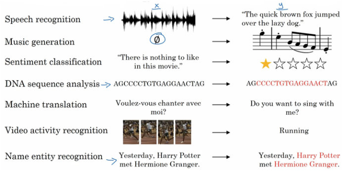 

### 数学符号

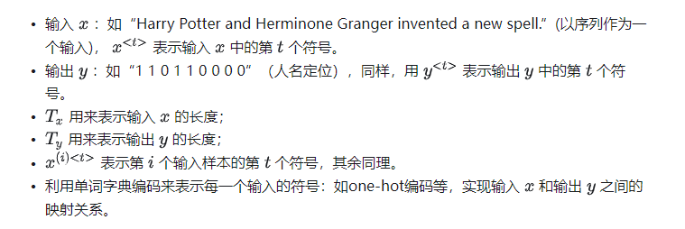 

### 循环神经网络模型结果

#### 传统神经网络

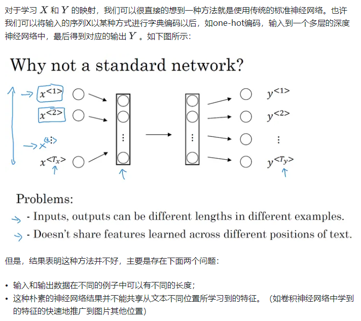 

#### **循环神经网络**定义

循环神经网络作为一种新型的网络结构，在处理序列数据问题上则不存在上面的两个缺点。在每一个时间步中，循环神经网络会传递一个激活值到下一个时间步中，用于下一时间步的计算。如下图所示：

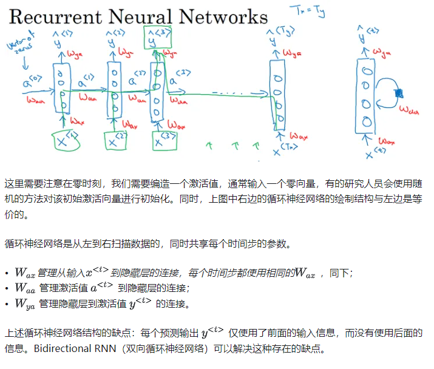 

#### **循环神经网络的前向传播**

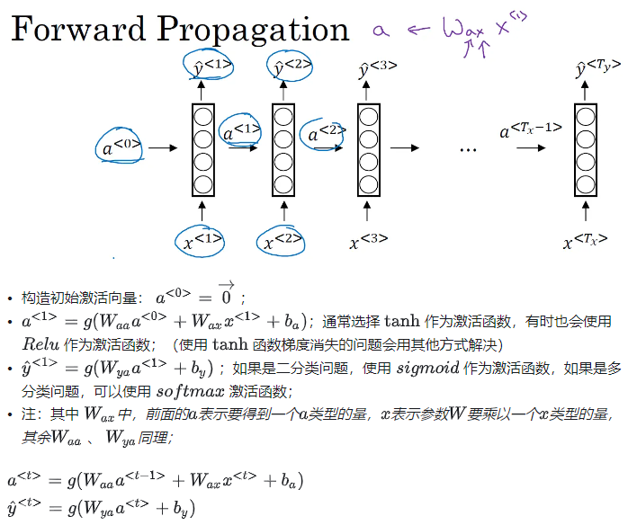 

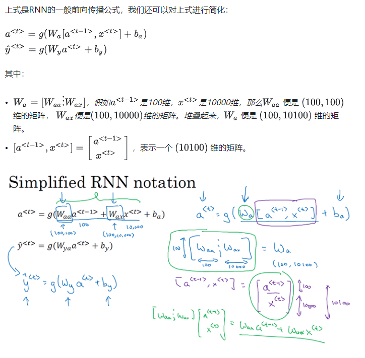 

#### 穿越时间的反向传播

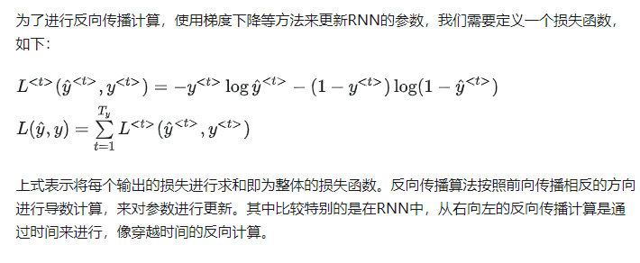 

#### 不同类型的RNN

对于RNN，不同的问题需要不同的输入输出结构。

**many-to-many（** **）：**

这种情况下的输入和输出的长度相同，是上面例子的结构，如下图所示：

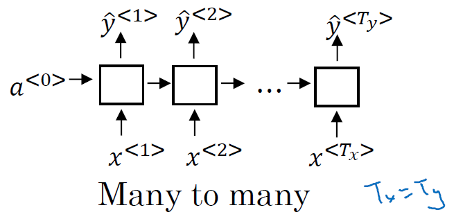 

**many-to-one：**

如在情感分类问题中，我们要对某个序列进行正负判别或者打星操作。在这种情况下，就是输入是一个序列，但输出只有一个值：

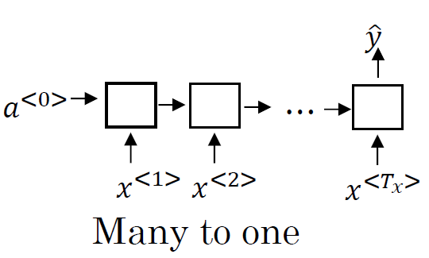 

**one-to-many：**

如在音乐生成的例子中，输入一个音乐的类型或者空值，直接生成一段音乐序列或者音符序列。在这种情况下，就是输入是一个值，但输出是一个序列：

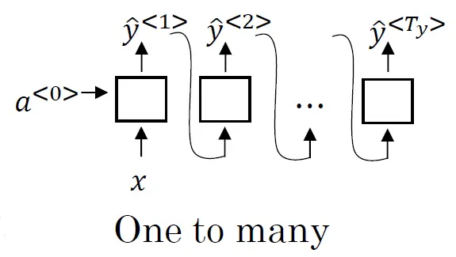 

**many-to-many（** ** ）：**

我们上面介绍的一种RNN的结构是输入和输出序列的长度是相同的，但是像机器翻译这种类似的应用来说，输入和输出都是序列，但长度却不相同，这是另外一种多对多的结构：

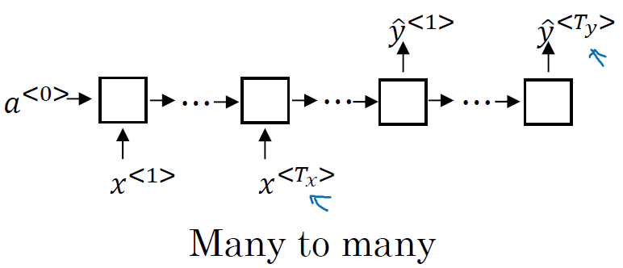 

### 语言模型

在NLP中，构建语言模型是最基础也是最重要的工作之一，我们可以通过RNN来很好的实现。

#### **什么是语言模型？**

对于下面的例子，两句话有相似的发音，但是想表达的意义和正确性却不相同，如何让我们的构建的语音识别系统能够输出正确地给出想要的输出。也就是对于语言模型来说，从输入的句子中，评估各个句子中各个单词出现的可能性，进而给出整个句子出现的可能性。

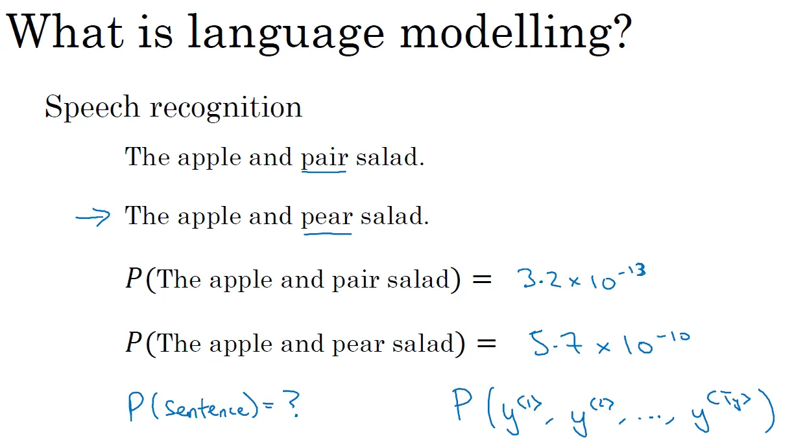 

#### **使用RNN构建语言模型：**

- 训练集：一个很大的语言文本语料库；
- Tokenize：将句子使用字典库标记化；
- 其中，未出现在字典库中的词使用“UNK”来表示；
- 第一步：使用零向量对输出进行预测，即预测第一个单词是某个单词的可能性；
- 第二步：通过前面的输入，逐步预测后面一个单词出现的概率；
- 训练网络：使用softmax损失函数计算损失，对网络进行参数更新，提升语言模型的准确率。

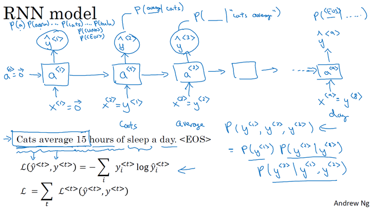 

### 新序列采样

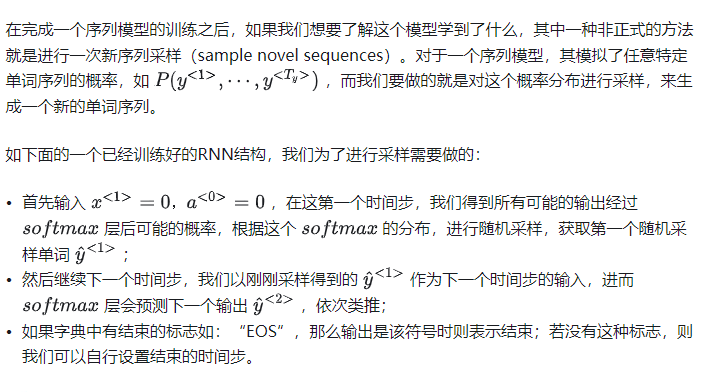 

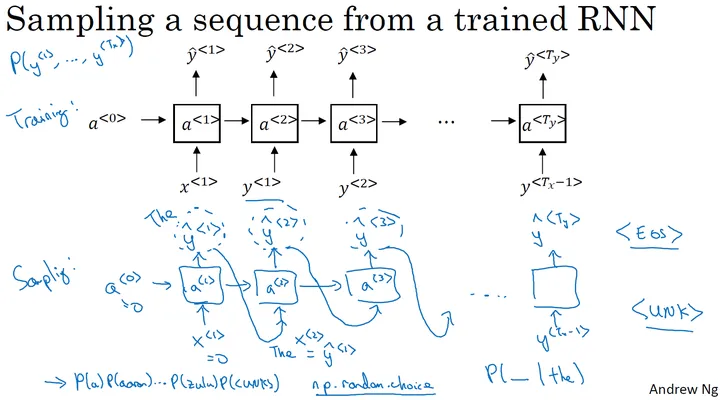 

上面的模型是基于词汇的语言模型，我们还可以构建基于字符的语言模型，其中每个单词和符号则表示一个相应的输入或者输出：

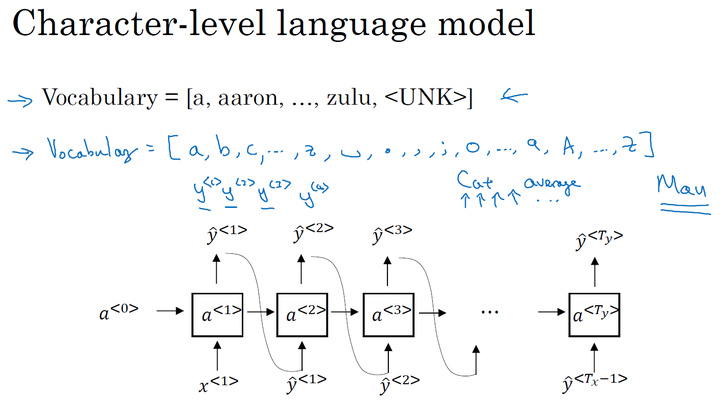 

但是基于字符的语言模型，一个主要的缺点就是我们最后会得到太多太长的输出序列，其对于捕捉句子前后依赖关系，也就是句子前部分如何影响后面部分，不如基于词汇的语言模型那样效果好；同时基于字符的语言模型训练代价比较高。所以目前的趋势和常见的 均是基于词汇的语言模型。但随着计算机运算能力的增强，在一些特定的情况下，也会开始使用基于字符的语言模型。

### 梯度消失

RNN在NLP中具有很大的应用价值，但是其存在一个很大的缺陷，那就是梯度消失的问题。例如下面的例句中：

- The cat, which already ate ...........，was full；
- The cats, which already ate ...........，were full.

在这两个句子中，cat对应着was，cats对应着were，（中间存在很多很长省略的单词），句子中存在长期依赖（long-term dependencies），前面的单词对后面的单词有很重要的影响。但是我们目前所见到的基本的RNN模型，是不擅长捕获这种长期依赖关系的。

如下图所示，和基本的深度神经网络结构类似，输出y得到的梯度很难通过反向传播再传播回去，**也就是很难对前面几层的权重产生影响**，所以RNN也有同样的问题，也就是很难让网络记住前面的单词是单数或者复数，进而对后面的输出产生影响。

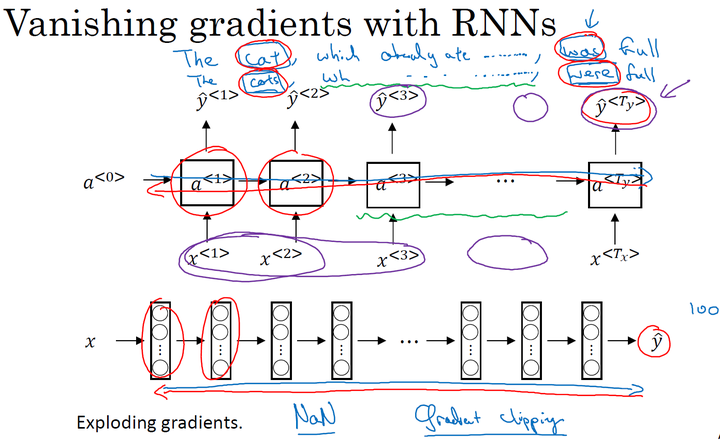 

对于梯度消失问题，在RNN的结构中是我们首要关心的问题，也更难解决；虽然梯度爆炸在RNN中也会出现，但对于梯度爆炸问题，因为参数会指数级的梯度，会让我们的网络参数变得很大，得到很多的Nan或者数值溢出，所以梯度爆炸是很容易发现的，我们的解决方法就是用梯度修剪，也就是观察梯度向量， 如果其大于某个阈值，则对其进行缩放，保证它不会太大。

### GRU单元

 

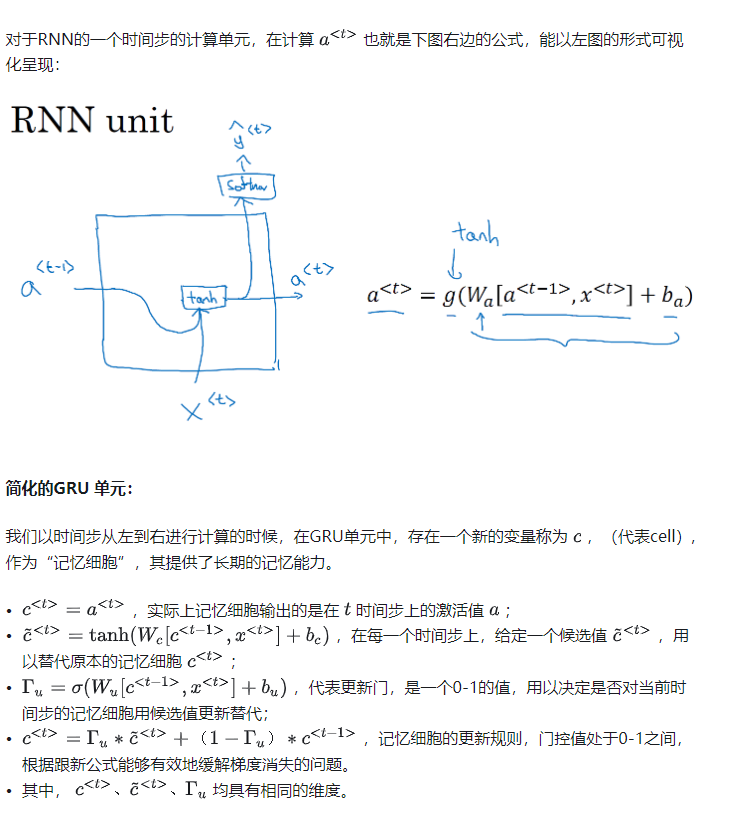 

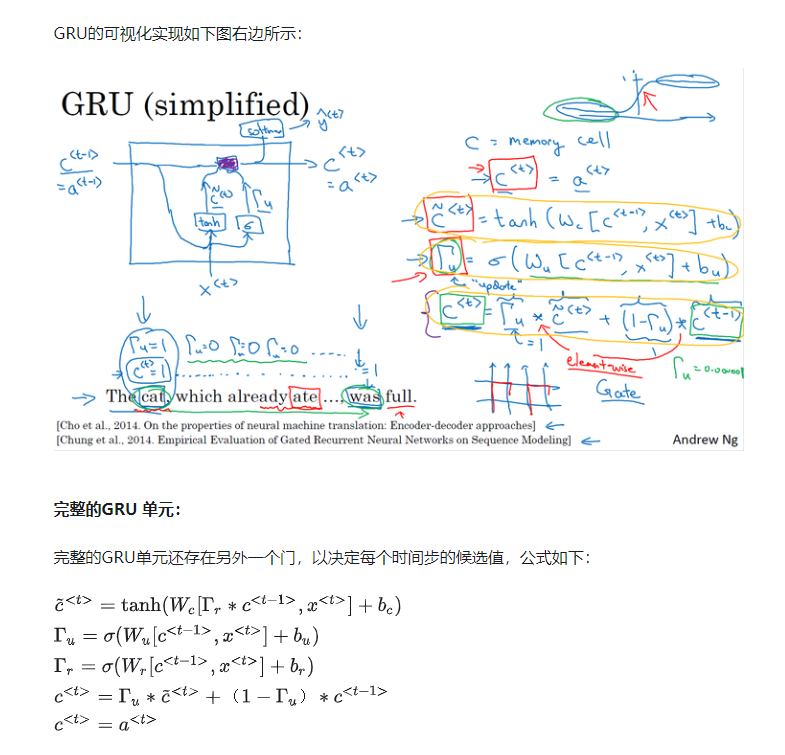 

### LSTM

#### 标准版

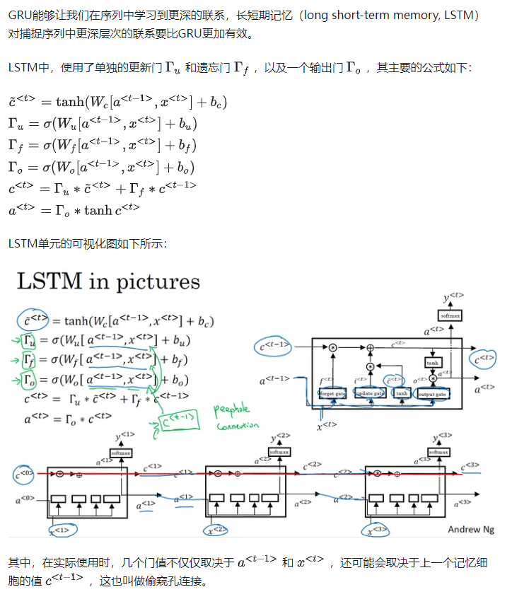 

#### 双向RNN

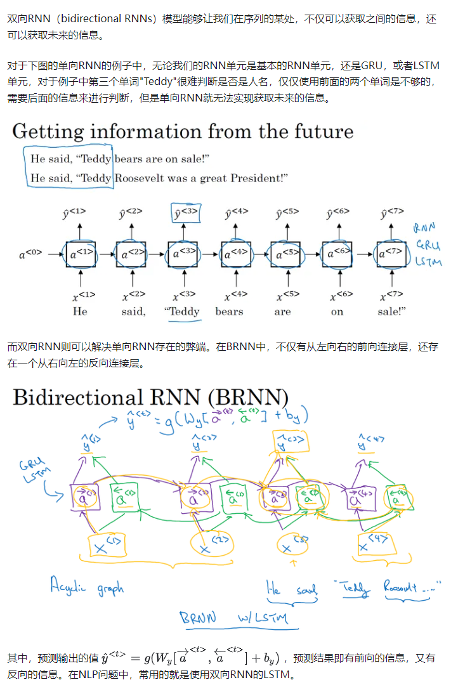 

### 深层RNNs

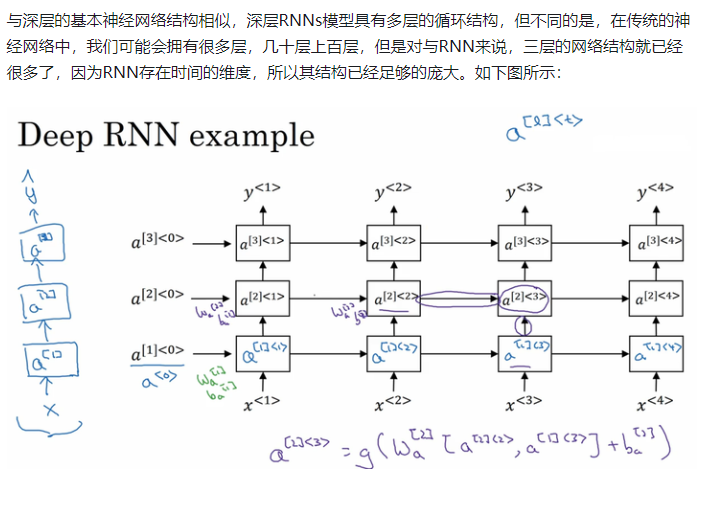 

## 长短时记忆网络(LSTM)

## 递归神经网络