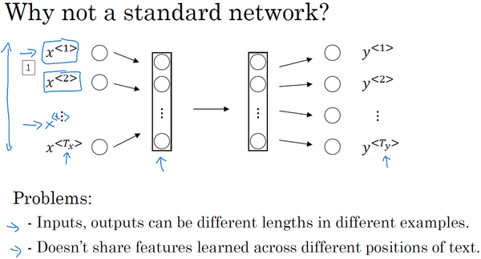
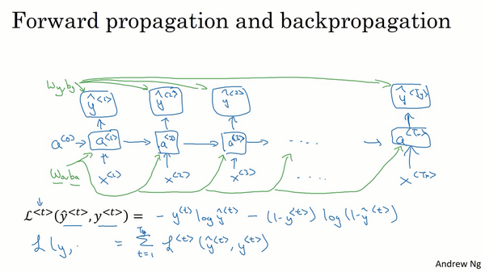
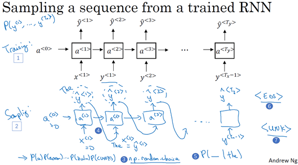
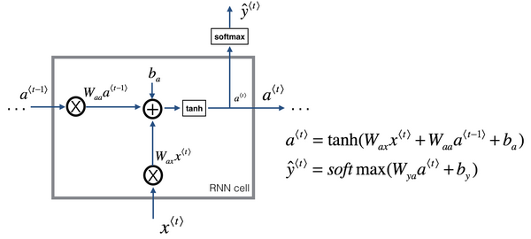
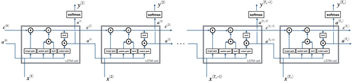
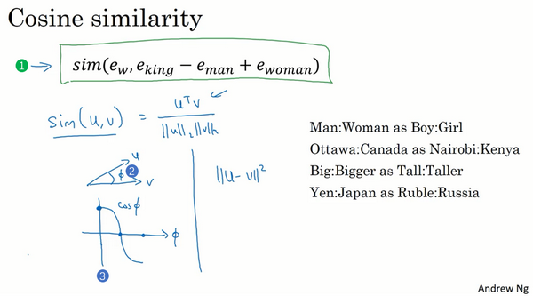
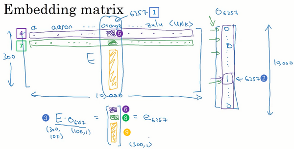
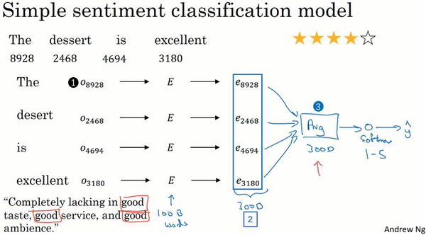

循环序列模型（Recurrent Neural Networks）
--------------------------------------------------------------

### 为什么选择序列模型？（Why Sequence Models?）

在本课程中你将学会序列模型，它是深度学习中最令人激动的内容之一。循环神经网络（**RNN**）之类的模型在语音识别、自然语言处理和其他领域中引起变革。在本节课中，你将学会如何自行创建这些模型。我们先看一些例子，这些例子都有效使用了序列模型。

在进行语音识别时，给定了一个输入音频片段 $X$，并要求输出对应的文字记录 $Y$。这个例子里输入和输出数据都是序列模型，因为 $X$是一个按时播放的音频片段，输出 $Y$是一系列单词。所以之后将要学到的一些序列模型，如循环神经网络等等在语音识别方面是非常有用的。

音乐生成问题是使用序列数据的另一个例子，在这个例子中，只有输出数据 $Y$是序列，而输入数据可以是空集，也可以是个单一的整数，这个数可能指代你想要生成的音乐风格，也可能是你想要生成的那首曲子的头几个音符。输入的 $X$可以是空的，或者就是个数字，然后输出序列 $Y$。

在处理情感分类时，输入数据 $X$是序列，你会得到类似这样的输入：“**There is nothing to like in this movie.**”，你认为这句评论对应几星？

系列模型在**DNA**序列分析中也十分有用，你的**DNA**可以用**A**、**C**、**G**、**T**四个字母来表示。所以给定一段**DNA**序列，你能够标记出哪部分是匹配某种蛋白质的吗？

在机器翻译过程中，你会得到这样的输入句：“**Voulez-vou chante avecmoi?**”（法语：要和我一起唱么？），然后要求你输出另一种语言的翻译结果。

在进行视频行为识别时，你可能会得到一系列视频帧，然后要求你识别其中的行为。

在进行命名实体识别时，可能会给定一个句子要你识别出句中的人名。

所以这些问题都可以被称作使用标签数据 $(X,Y)$作为训练集的监督学习。但从这一系列例子中你可以看出序列问题有很多不同类型。有些问题里，输入数据 $X$和输出数据$Y$都是序列，但就算在那种情况下，$X$和$Y$有时也会不一样长。或者像上图编号1所示和上图编号2的$X$和$Y$有相同的数据长度。在另一些问题里，只有 $X$或者只有$Y$是序列。

所以在本节我们学到适用于不同情况的序列模型。

下节中我们会定义一些定义序列问题要用到的符号。

### 数学符号（Notation）

本节先从定义符号开始一步步构建序列模型。

比如说你想要建立一个序列模型，它的输入语句是这样的：“**Harry Potter and Herminoe Granger invented a new spell.**”，(这些人名都是出自于**J.K.Rowling**笔下的系列小说**Harry Potter**)。假如你想要建立一个能够自动识别句中人名位置的序列模型，那么这就是一个命名实体识别问题，这常用于搜索引擎，比如说索引过去24小时内所有新闻报道提及的人名，用这种方式就能够恰当地进行索引。命名实体识别系统可以用来查找不同类型的文本中的人名、公司名、时间、地点、国家名和货币名等等。

现在给定这样的输入数据$x$，假如你想要一个序列模型输出$y$，使得输入的每个单词都对应一个输出值，同时这个$y$能够表明输入的单词是否是人名的一部分。技术上来说这也许不是最好的输出形式，还有更加复杂的输出形式，它不仅能够表明输入词是否是人名的一部分，它还能够告诉你这个人名在这个句子里从哪里开始到哪里结束。比如**Harry Potter**（上图编号1所示）、**Hermione Granger**（上图标号2所示）。

更简单的那种输出形式:

这个输入数据是9个单词组成的序列，所以最终我们会有9个特征集和来表示这9个单词，并按序列中的位置进行索引，$x^{<1>}$、$x^{<2>}$、$x^{<3>}$等等一直到$x^{<9>}$来索引不同的位置，我将用$x^{<t>}$来索引这个序列的中间位置。$t$意味着它们是时序序列，但不论是否是时序序列，我们都将用$t$来索引序列中的位置。

输出数据也是一样，我们还是用$y^{<1>}$、$y^{<2>}$、$y^{<3>}$等等一直到$y^{<9>}$来表示输出数据。同时我们用$T_{x}$来表示输入序列的长度，这个例子中输入是9个单词，所以$T_{x}= 9$。我们用$T_{y}$来表示输出序列的长度。在这个例子里$T_{x} =T_{y}$，上个视频里你知道$T_{x}$和$T_{y}$可以有不同的值。

你应该记得我们之前用的符号，我们用$x^{(i)}$来表示第$i$个训练样本，所以为了指代第$t$个元素，或者说是训练样本i的序列中第$t$个元素用$x^{\left(i \right) <t>}$这个符号来表示。如果$T_{x}$是序列长度，那么你的训练集里不同的训练样本就会有不同的长度，所以$T_{x}^{(i)}$就代表第$i$个训练样本的输入序列长度。同样$y^{\left( i \right) < t>}$代表第$i$个训练样本中第$t$个元素，$T_{y}^{(i)}$就是第$i$个训练样本的输出序列的长度。

所以在这个例子中，$T_{x}^{(i)}=9$，但如果另一个样本是由15个单词组成的句子，那么对于这个训练样本，$T_{x}^{(i)}=15$。

既然我们这个例子是**NLP**，也就是自然语言处理，这是我们初次涉足自然语言处理，一件我们需要事先决定的事是怎样表示一个序列里单独的单词，你会怎样表示像**Harry**这样的单词，$x^{<1>}$实际应该是什么？

接下来我们讨论一下怎样表示一个句子里单个的词。想要表示一个句子里的单词，第一件事是做一张词表，有时也称为词典，意思是列一列你的表示方法中用到的单词。这个词表（下图所示）中的第一个词是**a**，也就是说词典中的第一个单词是**a**，第二个单词是**Aaron**，然后更下面一些是单词**and**，再后面你会找到**Harry**，然后找到**Potter**，这样一直到最后，词典里最后一个单词可能是**Zulu**。

因此**a**是第一个单词，**Aaron**是第二个单词，在这个词典里，**and**出现在367这个位置上，**Harry**是在4075这个位置，**Potter**在6830，词典里的最后一个单词**Zulu**可能是第10,000个单词。所以在这个例子中我用了10,000个单词大小的词典，这对现代自然语言处理应用来说太小了。对于商业应用来说，或者对于一般规模的商业应用来说30,000到50,000词大小的词典比较常见，但是100,000词的也不是没有，而且有些大型互联网公司会用百万词，甚至更大的词典。许多商业应用用的词典可能是30,000词，也可能是50,000词。不过我将用10,000词大小的词典做说明，因为这是一个很好用的整数。

如果你选定了10,000词的词典，构建这个词典的一个方法是遍历你的训练集，并且找到前10,000个常用词，你也可以去浏览一些网络词典，它能告诉你英语里最常用的10,000个单词，接下来你可以用**one-hot**表示法来表示词典里的每个单词。

举个例子，在这里$x^{<1>}$表示**Harry**这个单词，它就是一个第4075行是1，其余值都是0的向量（上图编号1所示），因为那是**Harry**在这个词典里的位置。

同样$x^{<2>}$是个第6830行是1，其余位置都是0的向量（上图编号2所示）。

**and**在词典里排第367，所以$x^{<3>}$就是第367行是1，其余值都是0的向量（上图编号3所示）。如果你的词典大小是10,000的话，那么这里的每个向量都是10,000维的。

因为**a**是字典第一个单词，$x^{<7>}$对应**a**，那么这个向量的第一个位置为1，其余位置都是0的向量（上图编号4所示）。

所以这种表示方法中，$x^{<t>}$指代句子里的任意词，它就是个**one-hot**向量，因为它只有一个值是1，其余值都是0，所以你会有9个**one-hot**向量来表示这个句中的9个单词，目的是用这样的表示方式表示$X$，用序列模型在$X$和目标输出$Y$之间学习建立一个映射。我会把它当作监督学习的问题，我确信会给定带有$(x，y)$标签的数据。

那么还剩下最后一件事，我们将在之后的视频讨论，如果你遇到了一个不在你词表中的单词，答案就是创建一个新的标记，也就是一个叫做**Unknow Word**的伪造单词，用\<**UNK**\>作为标记，来表示不在词表中的单词，我们之后会讨论更多有关这个的内容。

总结一下本节课的内容，我们描述了一套符号用来表述你的训练集里的序列数据$x$和$y$，在下节课我们开始讲述循环神经网络中如何构建$X$到$Y$的映射。

### 循环神经网络模型（Recurrent Neural Network Model）

上节视频中，你了解了我们用来定义序列学习问题的符号。现在我们讨论一下怎样才能建立一个模型，建立一个神经网络来学习$X$到$Y$的映射。

可以尝试的方法之一是使用标准神经网络，在我们之前的例子中，我们有9个输入单词。想象一下，把这9个输入单词，可能是9个**one-hot**向量，然后将它们输入到一个标准神经网络中，经过一些隐藏层，最终会输出9个值为0或1的项，它表明每个输入单词是否是人名的一部分。

但结果表明这个方法并不好，主要有两个问题，

一、是输入和输出数据在不同例子中可以有不同的长度，不是所有的例子都有着同样输入长度$T_{x}$或是同样输出长度的$T_{y}$。即使每个句子都有最大长度，也许你能够填充（**pad**）或零填充（**zero pad**）使每个输入语句都达到最大长度，但仍然看起来不是一个好的表达方式。

二、一个像这样单纯的神经网络结构，它并不共享从文本的不同位置上学到的特征。具体来说，如果神经网络已经学习到了在位置1出现的**Harry**可能是人名的一部分，那么如果**Harry**出现在其他位置，比如$x^{<t>}$时，它也能够自动识别其为人名的一部分的话，这就很棒了。这可能类似于你在卷积神经网络中看到的，你希望将部分图片里学到的内容快速推广到图片的其他部分，而我们希望对序列数据也有相似的效果。和你在卷积网络中学到的类似，用一个更好的表达方式也能够让你减少模型中参数的数量。

之前我们提到过这些（上图编号1所示的$x^{<1>}$……$x^{<t>}$……$x^{< T_{x}>}$）都是10,000维的**one-hot**向量，因此这会是十分庞大的输入层。如果总的输入大小是最大单词数乘以10,000，那么第一层的权重矩阵就会有着巨量的参数。但循环神经网络就没有上述的两个问题。

那么什么是循环神经网络呢？我们先建立一个（下图编号1所示）。如果你以从左到右的顺序读这个句子，第一个单词就是，假如说是$x^{<1>}$，我们要做的就是将第一个词输入一个神经网络层，我打算这样画，第一个神经网络的隐藏层，我们可以让神经网络尝试预测输出，判断这是否是人名的一部分。循环神经网络做的是，当它读到句中的第二个单词时，假设是$x^{<2>}$，它不是仅用$x^{<2>}$就预测出${\hat{y}}^{<2>}$，他也会输入一些来自时间步1的信息。具体而言，时间步1的激活值就会传递到时间步2。然后，在下一个时间步，循环神经网络输入了单词$x^{<3>}$，然后它尝试预测输出了预测结果${\hat{y}}^{<3>}$，等等，一直到最后一个时间步，输入了$x^{<T_{x}>}$，然后输出了${\hat{y}}^{< T_{y} >}$。至少在这个例子中$T_{x} =T_{y}$，同时如果$T_{x}$和$T_{y}$不相同，这个结构会需要作出一些改变。所以在每一个时间步中，循环神经网络传递一个激活值到下一个时间步中用于计算。

要开始整个流程，在零时刻需要构造一个激活值$a^{<0>}$，这通常是零向量。有些研究人员会随机用其他方法初始化$a^{<0>}$，不过使用零向量作为零时刻的伪激活值是最常见的选择，因此我们把它输入神经网络。

在一些研究论文中或是一些书中你会看到这类神经网络，用这样的图形来表示（上图编号2所示），在每一个时间步中，你输入$x^{<t>}$然后输出$y^{<t>}$。然后为了表示循环连接有时人们会像这样画个圈，表示输回网络层，有时他们会画一个黑色方块，来表示在这个黑色方块处会延迟一个时间步。我个人认为这些循环图很难理解，所以在本次课程中，我画图更倾向于使用左边这种分布画法（上图编号1所示）。不过如果你在教材中或是研究论文中看到了右边这种图表的画法（上图编号2所示），它可以在心中将这图展开成左图那样。

循环神经网络是从左向右扫描数据，同时每个时间步的参数也是共享的，所以下页幻灯片中我们会详细讲述它的一套参数，我们用$W_{\text{ax}}$来表示管理着从$x^{<1>}$到隐藏层的连接的一系列参数，每个时间步使用的都是相同的参数$W_{\text{ax}}$。而激活值也就是水平联系是由参数$W_{aa}$决定的，同时每一个时间步都使用相同的参数$W_{aa}$，同样的输出结果由$W_{\text{ya}}$决定。下图详细讲述这些参数是如何起作用。

在这个循环神经网络中，它的意思是在预测${\hat{y}}^{< 3 >}$时，不仅要使用$x^{<3>}$的信息，还要使用来自$x^{<1>}$和$x^{<2>}$的信息，因为来自$x^{<1>}$的信息可以通过这样的路径（上图编号1所示的路径）来帮助预测${\hat{y}}^{<3>}$。这个循环神经网络的一个缺点就是它只使用了这个序列中之前的信息来做出预测，尤其当预测${\hat{y}}^{<3>}$时，它没有用到$x^{<4>}$，$x^{<5>}$，$x^{<6>}$等等的信息。所以这就有一个问题，因为如果给定了这个句子，“**Teddy Roosevelt was a great President.**”，为了判断**Teddy**是否是人名的一部分，仅仅知道句中前两个词是完全不够的，还需要知道句中后部分的信息，这也是十分有用的，因为句子也可能是这样的，“**Teddy bears are on sale!**”。因此如果只给定前三个单词，是不可能确切地知道**Teddy**是否是人名的一部分，第一个例子是人名，第二个例子就不是，所以你不可能只看前三个单词就能分辨出其中的区别。

所以这样特定的神经网络结构的一个限制是它在某一时刻的预测仅使用了从序列之前的输入信息并没有使用序列中后部分的信息，我们会在之后的双向循环神经网络（**BRNN**）的视频中处理这个问题。但对于现在，这个更简单的单向神经网络结构就够我们来解释关键概念了，之后只要在此基础上作出修改就能同时使用序列中前面和后面的信息来预测${\hat{y}}^{<3>}$，不过我们会在之后的视频讲述这些内容，接下来我们具体地写出这个神经网络计算了些什么。

这里是一张清理后的神经网络示意图，和我之前提及的一样，一般开始先输入$a^{<0>}$，它是一个零向量。接着就是前向传播过程，先计算激活值$a^{<1>}$，然后再计算$y^{<1>}$。

$a^{<1>} = g_{1}(W_{{aa}}a^{< 0 >} + W_{{ax}}x^{< 1 >} + b_{a})$

$\hat y^{< 1 >} = g_{2}(W_{{ya}}a^{< 1 >} + b_{y})$

我将用这样的符号约定来表示这些矩阵下标，举个例子$W_{\text{ax}}$，第二个下标意味着$W_{\text{ax}}$要乘以某个$x$类型的量，然后第一个下标$a$表示它是用来计算某个$a$类型的变量。同样的，可以看出这里的$W_{\text{ya}}$乘上了某个$a$类型的量，用来计算出某个$\hat {y}$类型的量。

循环神经网络用的激活函数经常是**tanh**，不过有时候也会用**ReLU**，但是**tanh**是更通常的选择，我们有其他方法来避免梯度消失问题，我们将在之后进行讲述。选用哪个激活函数是取决于你的输出$y$，如果它是一个二分问题，那么我猜你会用**sigmoid**函数作为激活函数，如果是$k$类别分类问题的话，那么可以选用**softmax**作为激活函数。不过这里激活函数的类型取决于你有什么样类型的输出$y$，对于命名实体识别来说$y$只可能是0或者1，那我猜这里第二个激活函数$g$可以是**sigmoid**激活函数。

更一般的情况下，在$t$时刻，

$a^{< t >} = g_{1}(W_{aa}a^{< t - 1 >} + W_{ax}x^{< t >} + b_{a})$

$\hat y^{< t >} = g_{2}(W_{{ya}}a^{< t >} + b_{y})$

所以这些等式定义了神经网络的前向传播，你可以从零向量$a^{<0>}$开始，然后用$a^{<0>}$和$x^{<1>}$来计算出$a^{<1>}$和$\hat y^{<1>}$，然后用$x^{<2>}$和$a^{<1>}$一起算出$a^{<2>}$和$\hat y^{<2>}$等等，像图中这样，从左到右完成前向传播。

现在为了帮我们建立更复杂的神经网络，我实际要将这个符号简化一下，我在下一张幻灯片里复制了这两个等式（上图编号1所示的两个等式）。

接下来为了简化这些符号，我要将这部分（$W_{\text{aa}}a^{<t -1>} +W_{\text{ax}}x^{<t>}$）（上图编号1所示）以更简单的形式写出来，我把它写做$a^{<t>} =g(W_{a}\left\lbrack a^{< t-1 >},x^{<t>} \right\rbrack +b_{a})$（上图编号2所示），那么左右两边划线部分应该是等价的。所以我们定义$W_{a}$的方式是将矩阵$W_{aa}$和矩阵$W_{{ax}}$水平并列放置，$[ {{W}_{aa}}\vdots {{W}_{ax}}]=W_{a}$（上图编号3所示）。举个例子，如果$a$是100维的，然后延续之前的例子，$x$是10,000维的，那么$W_{aa}$就是个$（100，100）$维的矩阵，$W_{ax}$就是个$（100，10,000）$维的矩阵，因此如果将这两个矩阵堆起来，$W_{a}$就会是个$（100，10,100）$维的矩阵。

用这个符号（$\left\lbrack a^{< t - 1 >},x^{< t >}\right\rbrack$）的意思是将这两个向量堆在一起，我会用这个符号表示，即$\begin{bmatrix}a^{< t-1 >} \\ x^{< t >} \\\end{bmatrix}$（上图编号4所示），最终这就是个10,100维的向量。你可以自己检查一下，用这个矩阵乘以这个向量，刚好能够得到原来的量，因为此时，矩阵$[ {{W}_{aa}}\vdots {{W}_{ax}}]$乘以$\begin{bmatrix} a^{< t - 1 >} \\ x^{< t >} \\ \end{bmatrix}$，刚好等于$W_{{aa}}a^{<t-1>} + W_{{ax}}x^{<t>}$，刚好等于之前的这个结论（上图编号5所示）。这种记法的好处是我们可以不使用两个参数矩阵$W_{{aa}}$和$W_{{ax}}$，而是将其压缩成一个参数矩阵$W_{a}$，所以当我们建立更复杂模型时这就能够简化我们要用到的符号。

同样对于这个例子（$\hat y^{<t>} = g(W_{ya}a^{<t>} +b_{y})$），我会用更简单的方式重写，$\hat y^{< t >} = g(W_{y}a^{< t >} +b_{y})$（上图编号6所示）。现在$W_{y}$和$b_{y}$符号仅有一个下标，它表示在计算时会输出什么类型的量，所以$W_{y}$就表明它是计算$y$类型的量的权重矩阵，而上面的$W_{a}$和$b_{a}$则表示这些参数是用来计算$a$类型或者说是激活值的。

**RNN**前向传播示意图：

好就这么多，你现在知道了基本的循环神经网络，下节课我们会一起来讨论反向传播，以及你如何能够用**RNN**进行学习。

### 通过时间的反向传播（Backpropagation through time）

之前我们已经学过了循环神经网络的基础结构，在本节视频中我们将来了解反向传播是怎样在循环神经网络中运行的。和之前一样，当你在编程框架中实现循环神经网络时，编程框架通常会自动处理反向传播。但我认为，在循环神经网络中，对反向传播的运行有一个粗略的认识还是非常有用的，让我们来一探究竟。

在之前你已经见过对于前向传播（上图蓝色箭头所指方向）怎样在神经网络中从左到右地计算这些激活项，直到输出所有地预测结果。而对于反向传播，我想你已经猜到了，反向传播地计算方向（上图红色箭头所指方向）与前向传播基本上是相反的。

我们来分析一下前向传播的计算，现在你有一个输入序列，$x^{<1>}$，$x^{<2>}$，$x^{<3>}$一直到$x^{< T_{x} >}$，然后用$x^{<1>}$还有$a^{<0>}$计算出时间步1的激活项，再用$x^{<2>}$和$a^{<1>}$计算出$a^{<2>}$，然后计算$a^{<3>}$等等，一直到$a^{< T_{x} >}$。

为了真正计算出$a^{<1>}$，你还需要一些参数，$W_{a}$和$b_{a}$，用它们来计算出$a^{<1>}$。这些参数在之后的每一个时间步都会被用到，于是继续用这些参数计算$a^{<2>}$，$a^{<3>}$等等，所有的这些激活项都要取决于参数$W_{a}$和$b_{a}$。有了$a^{<1>}$，神经网络就可以计算第一个预测值$\hat y^{<1>}$，接着到下一个时间步，继续计算出$\hat y^{<2>}$，$\hat  y^{<3>}$，等等，一直到$\hat y^{<T_{y}>}$。为了计算出${\hat{y}}$，需要参数$W_{y}$和$b_{y}$，它们将被用于所有这些节点。

然后为了计算反向传播，你还需要一个损失函数。我们先定义一个元素损失函数（上图编号1所示）

$L^{<t>}( \hat y^{<t>},y^{<t>}) = - y^{<t>}\log\hat  y^{<t>}-( 1- y^{<t>})log(1-\hat y^{<t>})$

它对应的是序列中一个具体的词，如果它是某个人的名字，那么$y^{<t>}$的值就是1，然后神经网络将输出这个词是名字的概率值，比如0.1。我将它定义为标准逻辑回归损失函数，也叫交叉熵损失函数（**Cross Entropy Loss**），它和之前我们在二分类问题中看到的公式很像。所以这是关于单个位置上或者说某个时间步$t$上某个单词的预测值的损失函数。

现在我们来定义整个序列的损失函数，将$L$定义为（上图编号2所示）

$L(\hat y,y) = \ \sum_{t = 1}^{T_{x}}{L^{< t >}(\hat  y^{< t >},y^{< t >})}$

在这个计算图中，通过$\hat y^{<1>}$可以计算对应的损失函数，于是计算出第一个时间步的损失函数（上图编号3所示），然后计算出第二个时间步的损失函数，然后是第三个时间步，一直到最后一个时间步，最后为了计算出总体损失函数，我们要把它们都加起来，通过下面的等式（上图编号2所示的等式）计算出最后的$L$（上图编号4所示），也就是把每个单独时间步的损失函数都加起来。

这就是完整的计算图，在之前的例子中，你已经见过反向传播，所以你应该能够想得到反向传播算法需要在相反的方向上进行计算和传递信息，最终你做的就是把前向传播的箭头都反过来，在这之后你就可以计算出所有合适的量，然后你就可以通过导数相关的参数，用梯度下降法来更新参数。

在这个反向传播的过程中，最重要的信息传递或者说最重要的递归运算就是这个从右到左的运算，这也就是为什么这个算法有一个很别致的名字，叫做**“通过（穿越）时间反向传播**（**backpropagation through time**）”。取这个名字的原因是对于前向传播，你需要从左到右进行计算，在这个过程中，时刻$t$不断增加。而对于反向传播，你需要从右到左进行计算，就像时间倒流。“通过时间反向传播”，就像穿越时光，这种说法听起来就像是你需要一台时光机来实现这个算法一样。

**RNN**反向传播示意图：

希望你大致了解了前向和反向传播是如何在**RNN**中工作的，到目前为止，你只见到了**RNN**中一个主要的例子，其中输入序列的长度和输出序列的长度是一样的。在下节课将展示更多的**RNN**架构，这将让你能够处理一些更广泛的应用。

### 不同类型的循环神经网络（Different types of **RNN**s）

现在你已经了解了一种**RNN**结构，它的输入量$T_{x}$等于输出数量$T_{y}$。事实上，对于其他一些应用，$T_{x}$和$T_{y}$并不一定相等。在这个视频里，你会看到更多的**RNN**的结构。

你应该还记得这周第一个视频中的那个幻灯片，那里有很多例子输入$x$和输出$y$，有各种类型，并不是所有的情况都满足$T_{x}=T_{y}$。

比如音乐生成这个例子，$T_{x}$可以是长度为1甚至为空集。再比如电影情感分类，输出$y$可以是1到5的整数，而输入是一个序列。在命名实体识别中，这个例子中输入长度和输出长度是一样的。

还有一些情况，输入长度和输出长度不同，他们都是序列但长度不同，比如机器翻译，一个法语句子和一个英语句子不同数量的单词却能表达同一个意思。

所以我们应该修改基本的**RNN**结构来处理这些问题，这个视频的内容参考了**Andrej Karpathy**的博客，一篇叫做《循环神经网络的非理性效果》（“**The Unreasonable Effectiveness of Recurrent Neural Networks**”）的文章，我们看一些例子。

你已经见过$T_{x} = T_{y}$的例子了（下图编号1所示），也就是我们输入序列$x^{<1>}$，$x^{<2>}$，一直到$x^{< T_{x}>}$，我们的循环神经网络这样工作，输入$x^{<1>}$来计算$\hat y^{<1>}$，$\hat y^{<2>}$等等一直到$\hat y^{<T_{y}>}$。在原先的图里，我会画一串圆圈表示神经元，大部分时候为了让符号更加简单，此处就以简单的小圈表示。这个就叫做“多对多”（**many-to-many**）的结构，因为输入序列有很多的输入，而输出序列也有很多输出。

现在我们看另外一个例子，假如说，你想处理情感分类问题（下图编号2所示），这里$x$可能是一段文本，比如一个电影的评论，“**These is nothing to like in this movie.**”（“这部电影没什么还看的。”），所以$x$就是一个序列，而$y$可能是从1到5的一个数字，或者是0或1，这代表正面评价和负面评价，而数字1到5代表电影是1星，2星，3星，4星还是5星。所以在这个例子中，我们可以简化神经网络的结构，输入$x^{<1 >}$，$x^{< 2 >}$，一次输入一个单词，如果输入文本是“**These is nothing to like in this movie**”，那么单词的对应如下图编号2所示。我们不再在每个时间上都有输出了，而是让这个**RNN**网络读入整个句子，然后在最后一个时间上得到输出，这样输入的就是整个句子，所以这个神经网络叫做“多对一”（**many-to-one**）结构，因为它有很多输入，很多的单词，然后输出一个数字。

为了完整性，还要补充一个“**一对一**”（**one-to-one**）的结构（上图编号3所示），这个可能没有那么重要，这就是一个小型的标准的神经网络，输入$x$然后得到输出$y$，我们这个系列课程的前两个课程已经讨论过这种类型的神经网络了。

除了“**多对一**”的结构，也可以有“**一对多**”（**one-to-many**）的结构。对于一个“一对多”神经网络结构的例子就是音乐生成（上图编号1所示），事实上，你会在这个课后编程练习中去实现这样的模型，你的目标是使用一个神经网络输出一些音符。对应于一段音乐，输入$x$可以是一个整数，表示你想要的音乐类型或者是你想要的音乐的第一个音符，并且如果你什么都不想输入，$x$可以是空的输入，可设为0向量。

这样这个神经网络的结构，首先是你的输入$x$，然后得到**RNN**的输出，第一个值，然后就没有输入了，再得到第二个输出，接着输出第三个值等等，一直到合成这个音乐作品的最后一个音符，这里也可以写上输入$a^{<0>}$（上图编号3所示）。有一个后面才会讲到的技术细节，当你生成序列时通常会把第一个合成的输出也喂给下一层（上图编号4所示），所以实际的网络结构最终就像这个样子。

我们已经讨论了“**多对多**”、“**多对一**”、“**一对一**”和“**一对多**”的结构，对于“多对多”的结构还有一个有趣的例子值得详细说一下，就是输入和输出长度不同的情况。你刚才看过的多对多的例子，它的输入长度和输出长度是完全一样的。而对于像机器翻译这样的应用，输入句子的单词的数量，比如说一个法语的句子，和输出句子的单词数量，比如翻译成英语，这两个句子的长度可能不同，所以还需要一个新的网络结构，一个不同的神经网络（上图编号2所示）。首先读入这个句子，读入这个输入，比如你要将法语翻译成英语，读完之后，这个网络就会输出翻译结果。有了这种结构$T_{x}$和$T_{y}$就可以是不同的长度了。同样，你也可以画上这个$a^{<0>}$。这个网络的结构有两个不同的部分，这（上图编号5所示）是一个编码器，获取输入，比如法语句子，这（上图编号6所示）是解码器，它会读取整个句子，然后输出翻译成其他语言的结果。

这就是一个“**多对多**”结构的例子，到这周结束的时候，你就能对这些各种各样结构的基本构件有一个很好的理解。严格来说，还有一种结构，我们会在第四周涉及到，就是“注意力”（**attention based**）结构，但是根据我们现在画的这些图不好理解这个模型。

总结一下这些各种各样的**RNN**结构，这（上图编号1所示）是“**一对一**”的结构，当去掉$a^{<0>}$时它就是一种标准类型的神经网络。还有一种“**一对多**”的结构（上图编号2所示），比如音乐生成或者序列生成。还有“**多对一**”，这（上图编号3所示）是情感分类的例子，首先读取输入，一个电影评论的文本，然后判断他们是否喜欢电影还是不喜欢。还有“**多对多**”的结构（上图编号4所示），命名实体识别就是“**多对多**”的例子，其中$T_{x}=T_{y}$。最后还有一种“**多对多**”结构的其他版本（上图编号5所示），对于像机器翻译这样的应用，$T_{x}$和$T_{y}$就可以不同了。

现在，你已经了解了大部分基本的模块，这些就是差不多所有的神经网络了，除了序列生成，有些细节的问题我们会在下节课讲解。

我希望你从本视频中了解到用这些**RNN**的基本模块，把它们组合在一起就可以构建各种各样的模型。但是正如我前面提到的，序列生成还有一些不一样的地方，在这周的练习里，你也会实现它，你需要构建一个语言模型，结果好的话会得到一些有趣的序列或者有意思的文本。下节课深入探讨序列生成。

### 语言模型和序列生成（Language model and sequence generation）

在自然语言处理中，构建语言模型是最基础的也是最重要的工作之一，并且能用**RNN**很好地实现。在本视频中，你将学习用**RNN**构建一个语言模型，在本周结束的时候，还会有一个很有趣的编程练习，你能在练习中构建一个语言模型，并用它来生成莎士比亚文风的文本或其他类型文本。

所以什么是语言模型呢？比如你在做一个语音识别系统，你听到一个句子，“**the apple and pear（pair） salad was delicious.**”，所以我究竟说了什么？我说的是 “**the apple and pair salad**”，还是“**the apple and pear salad**”？（**pear**和**pair**是近音词）。你可能觉得我说的应该更像第二种，事实上，这就是一个好的语音识别系统要帮助输出的东西，即使这两句话听起来是如此相似。而让语音识别系统去选择第二个句子的方法就是使用一个语言模型，他能计算出这两句话各自的可能性。

举个例子，一个语音识别模型可能算出第一句话的概率是$P( \text{The apple  and  pair  salad}) = 3.2 \times 10^{-13}$，而第二句话的概率是$P\left(\text{The apple  and  pear salad} \right) = 5.7 \times 10^{-10}$，比较这两个概率值，显然我说的话更像是第二种，因为第二句话的概率比第一句高出1000倍以上，这就是为什么语音识别系统能够在这两句话中作出选择。

所以语言模型所做的就是，它会告诉你某个特定的句子它出现的概率是多少，根据我所说的这个概率，假设你随机拿起一张报纸，打开任意邮件，或者任意网页或者听某人说下一句话，并且这个人是你的朋友，这个你即将从世界上的某个地方得到的句子会是某个特定句子的概率是多少，例如“**the apple and pear salad**”。它是两种系统的基本组成部分，一个刚才所说的语音识别系统，还有机器翻译系统，它要能正确输出最接近的句子。而语言模型做的最基本工作就是输入一个句子，准确地说是一个文本序列，$y^{<1>}$，$y^{<2>}$一直到$y^{<T_{y}>}$。对于语言模型来说，用$y$来表示这些序列比用$x$来表示要更好，然后语言模型会估计某个句子序列中各个单词出现的可能性。

那么如何建立一个语言模型呢？为了使用**RNN**建立出这样的模型，你首先需要一个训练集，包含一个很大的英文文本语料库（**corpus**）或者其它的语言，你想用于构建模型的语言的语料库。语料库是自然语言处理的一个专有名词，意思就是很长的或者说数量众多的英文句子组成的文本。

假如说，你在训练集中得到这么一句话，“**Cats average 15 hours of sleep a day.**”(猫一天睡15小时)，你要做的第一件事就是将这个句子标记化，意思就是像之前视频中一样，建立一个字典，然后将每个单词都转换成对应的**one-hot**向量，也就是字典中的索引。可能还有一件事就是你要定义句子的结尾，一般的做法就是增加一个额外的标记，叫做**EOS**（上图编号1所示），它表示句子的结尾，这样能够帮助你搞清楚一个句子什么时候结束，我们之后会详细讨论这个。**EOS**标记可以被附加到训练集中每一个句子的结尾，如果你想要你的模型能够准确识别句子结尾的话。在本周的练习中我们不需要使用这个**EOS**标记，不过在某些应用中你可能会用到它，不过稍后就能见到它的用处。于是在本例中我们，如果你加了**EOS**标记，这句话就会有9个输入，有$y^{<1>}$，$y^{<2>}$一直到$y^{<9>}$。在标记化的过程中，你可以自行决定要不要把标点符号看成标记，在本例中，我们忽略了标点符号，所以我们只把**day**看成标志，不包括后面的句号，如果你想把句号或者其他符号也当作标志，那么你可以将句号也加入你的字典中。

现在还有一个问题如果你的训练集中有一些词并不在你的字典里，比如说你的字典有10,000个词，10,000个最常用的英语单词。现在这个句，“**The Egyptian Mau is a bread of cat.**”其中有一个词**Mau**，它可能并不是预先的那10,000个最常用的单词，在这种情况下，你可以把**Mau**替换成一个叫做**UNK**的代表未知词的标志，我们只针对**UNK**建立概率模型，而不是针对这个具体的词**Mau**。

完成标识化的过程后，这意味着输入的句子都映射到了各个标志上，或者说字典中的各个词上。下一步我们要构建一个**RNN**来构建这些序列的概率模型。在下一张幻灯片中会看到的一件事就是最后你会将$x^{<t>}$设为$y^{<t-1>}$。

现在我们来建立**RNN**模型，我们继续使用“**Cats average 15 hours of sleep a day.**”这个句子来作为我们的运行样例，我将会画出一个**RNN**结构。在第0个时间步，你要计算激活项$a^{<1>}$，它是以$x^{<1 >}$作为输入的函数，而$x^{<1>}$会被设为全为0的集合，也就是0向量。在之前的$a^{<0>}$按照惯例也设为0向量，于是$a^{<1>}$要做的就是它会通过**softmax**进行一些预测来计算出第一个词可能会是什么，其结果就是$\hat y^{<1>}$（上图编号1所示），这一步其实就是通过一个**softmax**层来预测字典中的任意单词会是第一个词的概率，比如说第一个词是$a$的概率有多少，第一个词是**Aaron**的概率有多少，第一个词是**cats**的概率又有多少，就这样一直到**Zulu**是第一个词的概率是多少，还有第一个词是**UNK**（未知词）的概率有多少，还有第一个词是句子结尾标志的概率有多少，表示不必阅读。所以$\hat y^{<1>}$的输出是**softmax**的计算结果，它只是预测第一个词的概率，而不去管结果是什么。在我们的例子中，最终会得到单词**Cats**。所以**softmax**层输出10,000种结果，因为你的字典中有10,000个词，或者会有10,002个结果，因为你可能加上了未知词，还有句子结尾这两个额外的标志。

然后**RNN**进入下个时间步，在下一时间步中，仍然使用激活项$a^{<1>}$，在这步要做的是计算出第二个词会是什么。现在我们依然传给它正确的第一个词，我们会告诉它第一个词就是**Cats**，也就是$\hat y^{<1>}$，告诉它第一个词就是**Cats**，这就是为什么$y^{<1>} = x^{<2>}$（上图编号2所示）。然后在第二个时间步中，输出结果同样经过**softmax**层进行预测，**RNN**的职责就是预测这些词的概率（上图编号3所示），而不会去管结果是什么，可能是b或者**arron**，可能是**Cats**或者**Zulu**或者**UNK**（未知词）或者**EOS**或者其他词，它只会考虑之前得到的词。所以在这种情况下，我猜正确答案会是**average**，因为句子确实就是**Cats average**开头的。

然后再进行**RNN**的下个时间步，现在要计算$a^{<3>}$。为了预测第三个词，也就是15，我们现在给它之前两个词，告诉它**Cats average**是句子的前两个词，所以这是下一个输入，$x^{<3>} = y^{<2>}$，输入**average**以后，现在要计算出序列中下一个词是什么，或者说计算出字典中每一个词的概率（上图编号4所示），通过之前得到的**Cats**和**average**，在这种情况下，正确结果会是15，以此类推。

一直到最后，没猜错的话，你会停在第9个时间步，然后把$x^{<9>}$也就是$y^{<8>}$传给它（上图编号5所示），也就是单词**day**，这里是$a^{<9>}$，它会输出$y^{<9>}$，最后的得到结果会是**EOS**标志，在这一步中，通过前面这些得到的单词，不管它们是什么，我们希望能预测出**EOS**句子结尾标志的概率会很高（上图编号6所示）。

所以**RNN**中的每一步都会考虑前面得到的单词，比如给它前3个单词（上图编号7所示），让它给出下个词的分布，这就是**RNN**如何学习从左往右地每次预测一个词。

接下来为了训练这个网络，我们要定义代价函数。于是，在某个时间步$t$，如果真正的词是$y^{<t>}$，而神经网络的**softmax**层预测结果值是$y^{<t>}$，那么这（上图编号8所示）就是**softmax**损失函数，$L\left( \hat y^{<t>},y^{<t>}>\right) = - \sum_{i}^{}{y_{i}^{<t>}\log\hat y_{i}^{<t>}}$。而总体损失函数（上图编号9所示）$L = \sum_{t}^{}{L^{< t >}\left( \hat y^{<t>},y^{<t>} \right)}$，也就是把所有单个预测的损失函数都相加起来。

如果你用很大的训练集来训练这个**RNN**，你就可以通过开头一系列单词像是**Cars average 15**或者**Cars average 15 hours of**来预测之后单词的概率。现在有一个新句子，它是$y^{<1>}$，$y^{<2>}$，$y^{<3>}$，为了简单起见，它只包含3个词（如上图所示），现在要计算出整个句子中各个单词的概率，方法就是第一个**softmax**层会告诉你$y^{<1>}$的概率（上图编号1所示），这也是第一个输出，然后第二个**softmax**层会告诉你在考虑$y^{<1>}$的情况下$y^{<2>}$的概率（上图编号2所示），然后第三个**softmax**层告诉你在考虑$y^{<1>}$和$y^{<2>}$的情况下$y^{<3>}$的概率（上图编号3所示），把这三个概率相乘，最后得到这个含3个词的整个句子的概率。

这就是用**RNN**训练一个语言模型的基础结构，可能我说的这些东西听起来有些抽象，不过别担心，你可以在编程练习中亲自实现这些东西。下一节课用语言模型做的一件最有趣的事就是从模型中进行采样。

### 对新序列采样（Sampling novel sequences）

在你训练一个序列模型之后，要想了解到这个模型学到了什么，一种非正式的方法就是进行一次新序列采样，来看看到底应该怎么做。

记住一个序列模型模拟了任意特定单词序列的概率，我们要做的就是对这些概率分布进行采样来生成一个新的单词序列。下图编号1所示的网络已经被上方所展示的结构训练训练过了，而为了进行采样（下图编号2所示的网络），你要做一些截然不同的事情。

第一步要做的就是对你想要模型生成的第一个词进行采样，于是你输入$x^{<1>} =0$，$a^{<0>} =0$，现在你的第一个时间步得到的是所有可能的输出是经过**softmax**层后得到的概率，然后根据这个**softmax**的分布进行随机采样。**Softmax**分布给你的信息就是第一个词**a**的概率是多少，第一个词是**aaron**的概率是多少，第一个词是**zulu**的概率是多少，还有第一个词是**UNK**（未知标识）的概率是多少，这个标识可能代表句子的结尾，然后对这个向量使用例如**numpy**命令，`np.random.choice`（上图编号3所示），来根据向量中这些概率的分布进行采样，这样就能对第一个词进行采样了。

然后继续下一个时间步，记住第二个时间步需要$\hat y^{<1>}$作为输入，而现在要做的是把刚刚采样得到的$\hat y^{<1>}$放到$a^{<2>}$（上图编号4所示），作为下一个时间步的输入，所以不管你在第一个时间步得到的是什么词，都要把它传递到下一个位置作为输入，然后**softmax**层就会预测$\hat y^{<2>}$是什么。举个例子，假如说对第一个词进行抽样后，得到的是**The**，**The**作为第一个词的情况很常见，然后把**The**当成$x^{<2>}$，现在$x^{<2>}$就是$\hat y^{<1>}$，现在你要计算出在第一词是**The**的情况下，第二个词应该是什么（上图编号5所示），然后得到的结果就是$\hat y^{<2>}$，然后再次用这个采样函数来对$\hat y^{<2>}$进行采样。

然后再到下一个时间步，无论你得到什么样的用**one-hot**码表示的选择结果，都把它传递到下一个时间步，然后对第三个词进行采样。不管得到什么都把它传递下去，一直这样直到最后一个时间步。

那么你要怎样知道一个句子结束了呢？方法之一就是，如果代表句子结尾的标识在你的字典中，你可以一直进行采样直到得到**EOS**标识（上图编号6所示），这代表着已经抵达结尾，可以停止采样了。另一种情况是，如果你的字典中没有这个词，你可以决定从20个或100个或其他个单词进行采样，然后一直将采样进行下去直到达到所设定的时间步。不过这种过程有时候会产生一些未知标识（上图编号7所示），如果你要确保你的算法不会输出这种标识，你能做的一件事就是拒绝采样过程中产生任何未知的标识，一旦出现就继续在剩下的词中进行重采样，直到得到一个不是未知标识的词。如果你不介意有未知标识产生的话，你也可以完全不管它们。

这就是你如何从你的**RNN**语言模型中生成一个随机选择的句子。直到现在我们所建立的是基于词汇的**RNN**模型，意思就是字典中的词都是英语单词（下图编号1所示）。

根据你实际的应用，你还可以构建一个基于字符的**RNN**结构，在这种情况下，你的字典仅包含从**a**到**z**的字母，可能还会有空格符，如果你需要的话，还可以有数字0到9，如果你想区分字母大小写，你可以再加上大写的字母，你还可以实际地看一看训练集中可能会出现的字符，然后用这些字符组成你的字典（上图编号2所示）。

如果你建立一个基于字符的语言模型，比起基于词汇的语言模型，你的序列$\hat y^{<1>}$，$\hat y^{<2>}$，$\hat y^{<3>}$在你的训练数据中将会是单独的字符，而不是单独的词汇。所以对于前面的例子来说，那个句子（上图编号3所示），“**Cats average 15 hours of sleep a day.**”，在该例中**C**就是$\hat y^{<1>}$，**a**就是$\hat y^{<2>}$，**t**就是$\hat y^{<3>}$，空格符就是$\hat y^{<4>}$等等。

使用基于字符的语言模型有有点也有缺点，优点就是你不必担心会出现未知的标识，例如基于字符的语言模型会将**Mau**这样的序列也视为可能性非零的序列。而对于基于词汇的语言模型，如果**Mau**不在字典中，你只能把它当作未知标识**UNK**。不过基于字符的语言模型一个主要缺点就是你最后会得到太多太长的序列，大多数英语句子只有10到20个的单词，但却可能包含很多很多字符。所以基于字符的语言模型在捕捉句子中的依赖关系也就是句子较前部分如何影响较后部分不如基于词汇的语言模型那样可以捕捉长范围的关系，并且基于字符的语言模型训练起来计算成本比较高昂。所以我见到的自然语言处理的趋势就是，绝大多数都是使用基于词汇的语言模型，但随着计算机性能越来越高，会有更多的应用。在一些特殊情况下，会开始使用基于字符的模型。但是这确实需要更昂贵的计算力来训练，所以现在并没有得到广泛地使用，除了一些比较专门需要处理大量未知的文本或者未知词汇的应用，还有一些要面对很多专有词汇的应用。

在现有的方法下，现在你可以构建一个**RNN**结构，看一看英文文本的语料库，然后建立一个基于词汇的或者基于字符的语言模型，然后从训练的语言模型中进行采样。

这里有一些样本，它们是从一个语言模型中采样得到的，准确来说是基于字符的语言模型，你可以在编程练习中自己实现这样的模型。如果模型是用新闻文章训练的，它就会生成左边这样的文本，这有点像一篇不太合乎语法的新闻文本，不过听起来，这句“**Concussion epidemic**”，**to be examined**，确实有点像新闻报道。用莎士比亚的文章训练后生成了右边这篇东西，听起来很像是莎士比亚写的东西：

“**The mortal moon hath her eclipse in love.**

**And subject of this thou art another this fold.**

**When besser be my love to me see sabl's.**

**For whose are ruse of mine eyes heaves.**”

这些就是基础的**RNN**结构和如何去建立一个语言模型并使用它，对于训练出的语言模型进行采样。在之后的视频中，我想探讨在训练**RNN**时一些更加深入的挑战以及如何适应这些挑战，特别是梯度消失问题来建立更加强大的**RNN**模型。下节课，我们将谈到梯度消失并且会开始谈到**GRU**，也就是门控循环单元和**LSTM**长期记忆网络模型。

### 循环神经网络的梯度消失（Vanishing gradients with **RNN**s）

你已经了解了**RNN**时如何工作的了，并且知道如何应用到具体问题上，比如命名实体识别，比如语言模型，你也看到了怎么把反向传播用于**RNN**。其实，基本的**RNN**算法还有一个很大的问题，就是梯度消失的问题。这节课我们会讨论，在下几节课我们会讨论一些方法用来解决这个问题。

你已经知道了**RNN**的样子，现在我们举个语言模型的例子，假如看到这个句子（上图编号1所示），“**The cat, which already ate ……, was full.**”，前后应该保持一致，因为**cat**是单数，所以应该用**was**。“**The cats, which ate ……, were full.**”（上图编号2所示），**cats**是复数，所以用**were**。这个例子中的句子有长期的依赖，最前面的单词对句子后面的单词有影响。但是我们目前见到的基本的**RNN**模型（上图编号3所示的网络模型），不擅长捕获这种长期依赖效应，解释一下为什么。

你应该还记得之前讨论的训练很深的网络，我们讨论了梯度消失的问题。比如说一个很深很深的网络（上图编号4所示），100层，甚至更深，对这个网络从左到右做前向传播然后再反向传播。我们知道如果这是个很深的神经网络，从输出$\hat y$得到的梯度很难传播回去，很难影响靠前层的权重，很难影响前面层（编号5所示的层）的计算。

对于有同样问题的**RNN**，首先从左到右前向传播，然后反向传播。但是反向传播会很困难，因为同样的梯度消失的问题，后面层的输出误差（上图编号6所示）很难影响前面层（上图编号7所示的层）的计算。这就意味着，实际上很难让一个神经网络能够意识到它要记住看到的是单数名词还是复数名词，然后在序列后面生成依赖单复数形式的**was**或者**were**。而且在英语里面，这中间的内容（上图编号8所示）可以任意长，对吧？所以你需要长时间记住单词是单数还是复数，这样后面的句子才能用到这些信息。也正是这个原因，所以基本的**RNN**模型会有很多局部影响，意味着这个输出$\hat y^{<3>}$（上图编号9所示）主要受$\hat y^{<3>}$附近的值（上图编号10所示）的影响，上图编号11所示的一个数值主要与附近的输入（上图编号12所示）有关，上图编号6所示的输出，基本上很难受到序列靠前的输入（上图编号10所示）的影响，这是因为不管输出是什么，不管是对的，还是错的，这个区域都很难反向传播到序列的前面部分，也因此网络很难调整序列前面的计算。这是基本的**RNN**算法的一个缺点，我们会在下几节视频里处理这个问题。如果不管的话，**RNN**会不擅长处理长期依赖的问题。

尽管我们一直在讨论梯度消失问题，但是，你应该记得我们在讲很深的神经网络时，我们也提到了梯度爆炸，我们在反向传播的时候，随着层数的增多，梯度不仅可能指数型的下降，也可能指数型的上升。事实上梯度消失在训练**RNN**时是首要的问题，尽管梯度爆炸也是会出现，但是梯度爆炸很明显，因为指数级大的梯度会让你的参数变得极其大，以至于你的网络参数崩溃。所以梯度爆炸很容易发现，因为参数会大到崩溃，你会看到很多**NaN**，或者不是数字的情况，这意味着你的网络计算出现了数值溢出。如果你发现了梯度爆炸的问题，一个解决方法就是用梯度修剪。梯度修剪的意思就是观察你的梯度向量，如果它大于某个阈值，缩放梯度向量，保证它不会太大，这就是通过一些最大值来修剪的方法。所以如果你遇到了梯度爆炸，如果导数值很大，或者出现了**NaN**，就用梯度修剪，这是相对比较鲁棒的，这是梯度爆炸的解决方法。然而梯度消失更难解决，这也是我们下几节视频的主题。

总结一下，在前面的课程，我们了解了训练很深的神经网络时，随着层数的增加，导数有可能指数型的下降或者指数型的增加，我们可能会遇到梯度消失或者梯度爆炸的问题。加入一个**RNN**处理1,000个时间序列的数据集或者10,000个时间序列的数据集，这就是一个1,000层或者10,000层的神经网络，这样的网络就会遇到上述类型的问题。梯度爆炸基本上用梯度修剪就可以应对，但梯度消失比较棘手。我们下节会介绍**GRU**，门控循环单元网络，这个网络可以有效地解决梯度消失的问题，并且能够使你的神经网络捕获更长的长期依赖，我们去下个视频一探究竟吧。

### **GRU**单元（Gated Recurrent Unit（**GRU**））

你已经了解了基础的**RNN**模型的运行机制，在本节视频中你将会学习门控循环单元，它改变了**RNN**的隐藏层，使其可以更好地捕捉深层连接，并改善了梯度消失问题，让我们看一看。

你已经见过了这个公式，$a^{< t >} = g(W_{a}\left\lbrack a^{< t - 1 >},x^{< t >}\right\rbrack +b_{a})$，在**RNN**的时间$t$处，计算激活值。我把这个画个图，把**RNN**的单元画个图，画一个方框，输入$a^{<t-1>}$（上图编号1所示），即上一个时间步的激活值，再输入$x^{<t>}$（上图编号2所示），再把这两个并起来，然后乘上权重项，在这个线性计算之后（上图编号3所示），如果$g$是一个**tanh**激活函数，再经过**tanh**计算之后，它会计算出激活值$a^{<t>}$。然后激活值$a^{<t>}$将会传**softmax**单元（上图编号4所示），或者其他用于产生输出$y^{<t>}$的东西。就这张图而言，这就是**RNN**隐藏层的单元的可视化呈现。我向展示这张图，因为我们将使用相似的图来讲解门控循环单元。

许多**GRU**的想法都来分别自于**Yu Young Chang, Kagawa，Gaza Hera, Chang Hung Chu**和
**Jose Banjo**的两篇论文。我再引用上个视频中你已经见过的这个句子，“**The cat, which already ate……, was full.**”，你需要记得猫是单数的，为了确保你已经理解了为什么这里是**was**而不是**were**，“**The cat was full.**”或者是“**The cats were full**”。当我们从左到右读这个句子，**GRU**单元将会有个新的变量称为$c$，代表细胞（**cell**），即记忆细胞（下图编号1所示）。记忆细胞的作用是提供了记忆的能力，比如说一只猫是单数还是复数，所以当它看到之后的句子的时候，它仍能够判断句子的主语是单数还是复数。于是在时间$t$处，有记忆细胞$c^{<t>}$，然后我们看的是，**GRU**实际上输出了激活值$a^{<t>}$，$c^{<t>} = a^{<t>}$（下图编号2所示）。于是我们想要使用不同的符号$c$和$a$来表示记忆细胞的值和输出的激活值，即使它们是一样的。我现在使用这个标记是因为当我们等会说到**LSTMs**的时候，这两个会是不同的值，但是现在对于**GRU**，$c^{<t>}$的值等于$a^{<t>}$的激活值。

所以这些等式表示了**GRU**单元的计算，在每个时间步，我们将用一个候选值重写记忆细胞，即${\tilde{c}}^{<t>}$的值，所以它就是个候选值，替代了$c^{<t>}$的值。然后我们用**tanh**激活函数来计算，${\tilde{c}}^{<t>} =tanh(W_{c}\left\lbrack c^{<t-1>},x^{<t>} \right\rbrack +b_{c})$，所以${\tilde{c}}^{<t>}$的值就是个替代值，代替表示$c^{<t>}$的值（下图编号3所示）。

重点来了，在**GRU**中真正重要的思想是我们有一个门，我先把这个门叫做$\Gamma_{u}$（上图编号4所示），这是个下标为$u$的大写希腊字母$\Gamma$，$u$代表更新门，这是一个0到1之间的值。为了让你直观思考**GRU**的工作机制，先思考$\Gamma_{u}$，这个一直在0到1之间的门值，实际上这个值是把这个式子带入**sigmoid**函数得到的，$\Gamma_{u}= \sigma(W_{u}\left\lbrack c^{<t-1>},x^{<t>} \right\rbrack +b_{u})$。我们还记得**sigmoid**函数是上图编号5所示这样的，它的输出值总是在0到1之间，对于大多数可能的输入，**sigmoid**函数的输出总是非常接近0或者非常接近1。在这样的直觉下，可以想到$\Gamma_{u}$在大多数的情况下非常接近0或1。然后这个字母**u**表示“**update**”，我选了字母$\Gamma$是因为它看起来像门。还有希腊字母**G**，**G**是门的首字母，所以**G**表示门。

然后**GRU**的关键部分就是上图编号3所示的等式，我们刚才写出来的用$\tilde{c}$更新$c$的等式。然后门决定是否要真的更新它。于是我们这么看待它，记忆细胞$c^{<t>}$将被设定为0或者1，这取决于你考虑的单词在句子中是单数还是复数，因为这里是单数情况，所以我们先假定它被设为了1，或者如果是复数的情况我们就把它设为0。然后**GRU**单元将会一直记住$c^{<t>}$的值，直到上图编号7所示的位置，$c^{<t>}$的值还是1，这就告诉它，噢，这是单数，所以我们用**was**。于是门，即$\Gamma_{u}$的作用就是决定什么时候你会更新这个值，特别是当你看到词组**the cat**，即句子的主语猫，这就是一个好时机去更新这个值。然后当你使用完它的时候，“**The cat, which already ate……, was full.**”，然后你就知道，我不需要记住它了，我可以忘记它了。

所以我们接下来要给**GRU**用的式子就是$c^{<t>} = \Gamma_{u}*{\tilde{c}}^{<t>} +\left( 1- \Gamma_{u} \right)*c^{<t-1>}$（上图编号1所示）。你应该注意到了，如果这个更新值$\Gamma_{u} =1$，也就是说把这个新值，即$c^{<t>}$设为候选值（$\Gamma_{u} =1$时简化上式，$c^{<t>} = {\tilde{c}}^{<t>}$）。将门值设为1（上图编号2所示），然后往前再更新这个值。对于所有在这中间的值，你应该把门的值设为0，即$\Gamma_{u}= 0$，意思就是说不更新它，就用旧的值。因为如果$\Gamma_{u} = 0$，则$c^{<t>} =c^{<t-1>}$，$c^{<t>}$等于旧的值。甚至你从左到右扫描这个句子，当门值为0的时候（上图编号3所示，中间$\Gamma_{u}=0$一直为0，表示一直不更新），就是说不更新它的时候，不要更新它，就用旧的值，也不要忘记这个值是什么，这样即使你一直处理句子到上图编号4所示，$c^{<t>}$应该会一直等$c^{<t-1>}$，于是它仍然记得猫是单数的。

让我再画个图来（下图所示）解释一下**GRU**单元，顺便说一下，当你在看网络上的博客或者教科书或者教程之类的，这些图对于解释**GRU**和我们稍后会讲的**LSTM**是相当流行的，我个人感觉式子在图片中比较容易理解，那么即使看不懂图片也没关系，我就画画，万一能帮得上忙就最好了。

**GRU**单元输入$c^{<t-1>}$（下图编号1所示），对于上一个时间步，先假设它正好等于$a^{<t-1>}$，所以把这个作为输入。然后$x^{<t>}$也作为输入（下图编号2所示），然后把这两个用合适权重结合在一起，再用**tanh**计算，算出${\tilde{c}}^{<t>}$，${\tilde{c}}^{<t>} =tanh(W_{c}\left\lbrack c^{<t-1>},x^{<t>} \right\rbrack +b_{c})$，即$c^{<t>}$的替代值。

再用一个不同的参数集，通过**sigmoid**激活函数算出$\Gamma_{u}$，$\Gamma_{u}= \sigma(W_{u}\left\lbrack c^{<t-1>},x^{<t>} \right\rbrack +b_{u})$，即更新门。最后所有的值通过另一个运算符结合，我并不会写出公式，但是我用紫色阴影标注的这个方框（下图编号5所示，其所代表的运算过程即下图编号13所示的等式），代表了这个式子。所以这就是紫色运算符所表示的是，它输入一个门值（下图编号6所示），新的候选值（下图编号7所示），这再有一个门值（下图编号8所示）和$c^{<t>}$的旧值（下图编号9所示），所以它把这个（下图编号1所示）、这个（下图编号3所示）和这个（下图编号4所示）作为输入一起产生记忆细胞的新值$c^{<t>}$，所以$c^{<t>}$等于$a^{<t>}$。如果你想，你也可以也把这个代入**softmax**或者其他预测$y^{<t>}$的东西。

这就是**GRU**单元或者说是一个简化过的**GRU**单元，它的优点就是通过门决定，当你从左（上图编号10所示）到右扫描一个句子的时候，这个时机是要更新某个记忆细胞，还是不更新，不更新（上图编号11所示，中间$\Gamma_{u}=0$一直为0，表示一直不更新）直到你到你真的需要使用记忆细胞的时候（上图编号12所示），这可能在句子之前就决定了。因为sigmoid的值，现在因为门很容易取到0值，只要这个值是一个很大的负数，再由于数值上的四舍五入，上面这些门大体上就是0，或者说非常非常非常接近0。所以在这样的情况下，这个更新式子（上图编号13所示的等式）就会变成$c^{<t>} = c^{<t-1>}$，这非常有利于维持细胞的值。因为$\Gamma_{u}$很接近0，可能是0.000001或者更小，这就不会有梯度消失的问题了。因为$\Gamma_{u}$很接近0，这就是说$c^{<t>}$几乎就等于$c^{<t-1>}$，而且$c^{<t>}$的值也很好地被维持了，即使经过很多很多的时间步（上图编号14所示）。这就是缓解梯度消失问题的关键，因此允许神经网络运行在非常庞大的依赖词上，比如说**cat**和**was**单词即使被中间的很多单词分割开。

现在我想说下一些实现的细节，在这个我写下的式子中$c^{<t>}$可以是一个向量（上图编号1所示），如果你有100维的隐藏的激活值，那么$c^{<t>}$也是100维的，${\tilde{c}}^{<t>}$也是相同的维度（${\tilde{c}}^{<t>} =tanh(W_{c}\left\lbrack c^{<t-1>},x^{<t>} \right\rbrack +b_{c})$），$\Gamma_{u}$也是相同的维度（$\Gamma_{u}= \sigma(W_{u}\left\lbrack c^{<t-1>},x^{<t>} \right\rbrack +b_{u})$），还有画在框中的其他值。这样的话“\*”实际上就是元素对应的乘积（$c^{<t>} = \Gamma_{u}*{\tilde{c}}^{<t>} +\left( 1- \Gamma_{u} \right)*c^{<t-1>}$），所以这里的$\Gamma_{u}$：（$\Gamma_{u}= \sigma(W_{u}\left\lbrack c^{<t-1>},x^{<t>} \right\rbrack +b_{u})$），即如果门是一个100维的向量，$\Gamma_{u}$也就100维的向量，里面的值几乎都是0或者1，就是说这100维的记忆细胞$c^{<t>}$（$c^{<t>}=a^{<t>}$上图编号1所示）就是你要更新的比特。

当然在实际应用中$\Gamma_{u}$不会真的等于0或者1，有时候它是0到1的一个中间值（上图编号5所示），但是这对于直观思考是很方便的，就把它当成确切的0，完全确切的0或者就是确切的1。元素对应的乘积做的就是告诉**GRU**单元哪个记忆细胞的向量维度在每个时间步要做更新，所以你可以选择保存一些比特不变，而去更新其他的比特。比如说你可能需要一个比特来记忆猫是单数还是复数，其他比特来理解你正在谈论食物，因为你在谈论吃饭或者食物，然后你稍后可能就会谈论“**The cat was full.**”，你可以每个时间点只改变一些比特。

你现在已经理解**GRU**最重要的思想了，幻灯片中展示的实际上只是简化过的**GRU**单元，现在来描述一下完整的**GRU**单元。

对于完整的**GRU**单元我要做的一个改变就是在我们计算的第一个式子中给记忆细胞的新候选值加上一个新的项，我要添加一个门$\Gamma_{r}$（下图编号1所示），你可以认为$r$代表相关性（**relevance**）。这个$\Gamma_{r}$门告诉你计算出的下一个$c^{<t>}$的候选值${\tilde{c}}^{<t>}$跟$c^{<t-1>}$有多大的相关性。计算这个门$\Gamma_{r}$需要参数，正如你看到的这个，一个新的参数矩阵$W_{r}$，$\Gamma_{r}= \sigma(W_{r}\left\lbrack c^{<t-1>},x^{<t>} \right\rbrack + b_{r})$。

正如你所见，有很多方法可以来设计这些类型的神经网络，然后我们为什么有$\Gamma_{r}$？为什么不用上一张幻灯片里的简单的版本？这是因为多年来研究者们试验过很多很多不同可能的方法来设计这些单元，去尝试让神经网络有更深层的连接，去尝试产生更大范围的影响，还有解决梯度消失的问题，**GRU**就是其中一个研究者们最常使用的版本，也被发现在很多不同的问题上也是非常健壮和实用的。你可以尝试发明新版本的单元，只要你愿意。但是**GRU**是一个标准版本，也就是最常使用的。你可以想象到研究者们也尝试了很多其他版本，类似这样的但不完全是，比如我这里写的这个。然后另一个常用的版本被称为**LSTM**，表示长短时记忆网络，这个我们会在下节视频中讲到，但是**GRU**和**LSTM**是在神经网络结构中最常用的两个具体实例。

还有在符号上的一点，我尝试去定义固定的符号让这些概念容易理解，如果你看学术文章的话，你有的时候会看到有些人使用另一种符号$\tilde{x}$，$u$，$r$和$h$表示这些量。但我试着在**GRU**和**LSTM**之间用一种更固定的符号，比如使用更固定的符号$\Gamma$来表示门，所以希望这能让这些概念更好理解。

所以这就是**GRU**，即门控循环单元，这是**RNN**的其中之一。这个结构可以更好捕捉非常长范围的依赖，让**RNN**更加有效。然后我简单提一下其他常用的神经网络，比较经典的是这个叫做**LSTM**，即长短时记忆网络，我们在下节视频中讲解。

（**Chung J, Gulcehre C, Cho K H, et al. Empirical Evaluation of Gated Recurrent Neural Networks on Sequence Modeling[J]. Eprint Arxiv, 2014.**

**Cho K, Merrienboer B V, Bahdanau D, et al. On the Properties of Neural Machine Translation: Encoder-Decoder Approaches[J]. Computer Science, 2014.**）

### 长短期记忆（**LSTM**（long short term memory）unit）

在上一个视频中你已经学了**GRU**（门控循环单元）。它能够让你可以在序列中学习非常深的连接。其他类型的单元也可以让你做到这个，比如**LSTM**即长短时记忆网络，甚至比**GRU**更加有效，让我们看看。

这里是上个视频中的式子，对于**GRU**我们有$a^{< t >} = c^{<t>}$。

还有两个门:

更新门$\Gamma_{u}$（**the update gate**）

相关门$\Gamma_{r}$（**the relevance gate**）

${\tilde{c}}^{<t>}$，这是代替记忆细胞的候选值，然后我们使用更新门$\Gamma_{u}$来决定是否要用${\tilde{c}}^{<t>}$ 更新$c^{<t>}$。

**LSTM**是一个比**GRU**更加强大和通用的版本，这多亏了 **Sepp Hochreiter**和 **Jurgen Schmidhuber**，感谢那篇开创性的论文，它在序列模型上有着巨大影响。我感觉这篇论文是挺难读懂的，虽然我认为这篇论文在深度学习社群有着重大的影响，它深入讨论了梯度消失的理论，我感觉大部分的人学到**LSTM**的细节是在其他的地方，而不是这篇论文。

这就是**LSTM**主要的式子（上图编号2所示），我们继续回到记忆细胞**c**上面来，使用${\tilde{c}}^{<t>} = tanh(W_{c}\left\lbrack a^{<t-1>},x^{<t>} \right\rbrack +b_{c}$来更新它的候选值${\tilde{c}}^{<t>}$（上图编号3所示）。注意了，在**LSTM**中我们不再有$a^{<t>} = c^{<t>}$的情况，这是现在我们用的是类似于左边这个式子（上图编号4所示），但是有一些改变，现在我们专门使用$a^{<t>}$或者$a^{<t-1>}$，而不是用$c^{<t-1>}$，我们也不用$\Gamma_{r}$，即相关门。虽然你可以使用**LSTM**的变体，然后把这些东西（左边所示的**GRU**公式）都放回来，但是在更加典型的**LSTM**里面，我们先不那样做。

我们像以前那样有一个更新门$\Gamma_{u}$和表示更新的参数$W_{u}$，$\Gamma_{u}= \sigma(W_{u}\left\lbrack a^{<t-1>},x^{<t>} \right\rbrack +b_{u})$（上图编号5所示）。一个**LSTM**的新特性是不只有一个更新门控制，这里的这两项（上图编号6，7所示），我们将用不同的项来代替它们，要用别的项来取代$\Gamma_{u}$和$1-\Gamma_{u}$，这里（上图编号6所示）我们用$\Gamma_{u}$。

然后这里（上图编号7所示）用遗忘门（**the forget gate**），我们叫它$\Gamma_{f}$，所以这个$\Gamma_{f} =\sigma(W_{f}\left\lbrack a^{<t-1>},x^{<t>} \right\rbrack +b_{f})$（上图编号8所示）；

然后我们有一个新的输出门，$\Gamma_{o} =\sigma(W_{o}\left\lbrack a^{<t-1>},x^{<t>} \right\rbrack +>b_{o})$（上图编号9所示）；

于是记忆细胞的更新值$c^{<t>} =\Gamma_{u}*{\tilde{c}}^{<t>} + \Gamma_{f}*c^{<t-1>}$（上图编号10所示）；

所以这给了记忆细胞选择权去维持旧的值$c^{<t-1>}$或者就加上新的值${\tilde{c}}^{<t>}$，所以这里用了单独的更新门$\Gamma_{u}$和遗忘门$\Gamma_{f}$，

然后这个表示更新门（$\Gamma_{u}= \sigma(W_{u}\left\lbrack a^{<t-1>},x^{<t>} \right\rbrack +b_{u})$上图编号5所示）；

遗忘门（$\Gamma_{f} =\sigma(W_{f}\left\lbrack a^{<t-1>},x^{<t>} \right\rbrack +b_{f})$上图编号8所示）和输出门（上图编号9所示）。

最后$a^{<t>} = c^{<t>}$的式子会变成$a^{<t>} = \Gamma_{o}*c^{<t>}$。这就是**LSTM**主要的式子了，然后这里（上图编号11所示）有三个门而不是两个，这有点复杂，它把门放到了和之前有点不同的地方。

再提一下，这些式子就是控制**LSTM**行为的主要的式子了（上图编号1所示）。像之前一样用图片稍微解释一下，先让我把图画在这里（上图编号2所示）。如果图片过于复杂，别担心，我个人感觉式子比图片好理解，但是我画图只是因为它比较直观。这个右上角的图的灵感来自于**Chris Ola**的一篇博客，标题是《理解**LSTM**网络》（**Understanding LSTM Network**），这里的这张图跟他博客上的图是很相似的，但关键的不同可能是这里的这张图用了$a^{<t-1>}$和$x^{<t>}$来计算所有门值（上图编号3，4所示），在这张图里是用$a^{<t-1>}$， $x^{<t>}$一起来计算遗忘门$\Gamma_{f}$的值，还有更新门$\Gamma_{u}$以及输出门$\Gamma_{o}$（上图编号4所示）。然后它们也经过**tanh**函数来计算${\tilde{c}}^{<t>}$（上图编号5所示），这些值被用复杂的方式组合在一起，比如说元素对应的乘积或者其他的方式来从之前的$c^{<t-1>}$（上图编号6所示）中获得$c^{<t>}$（上图编号7所示）。

这里其中一个元素很有意思，如你在这一堆图（上图编号8所示的一系列图片）中看到的，这是其中一个，再把他们连起来，就是把它们按时间次序连起来，这里（上图编号9所示）输入$x^{<1>}$，然后$x^{<2>}$，$x^{<3>}$，然后你可以把这些单元依次连起来，这里输出了上一个时间的$a$，$a$会作为下一个时间步的输入，$c$同理。在下面这一块，我把图简化了一下（相对上图编号2所示的图有所简化）。然后这有个有意思的事情，你会注意到上面这里有条线（上图编号10所示的线），这条线显示了只要你正确地设置了遗忘门和更新门，**LSTM**是相当容易把$c^{<0>}$的值（上图编号11所示）一直往下传递到右边，比如$c^{<3>} = c^{<0>}$（上图编号12所示）。这就是为什么**LSTM**和**GRU**非常擅长于长时间记忆某个值，对于存在记忆细胞中的某个值，即使经过很长很长的时间步。

这就是**LSTM**，你可能会想到这里和一般使用的版本会有些不同，最常用的版本可能是门值不仅取决于$a^{<t-1>}$和$x^{<t>}$，有时候也可以偷窥一下$c^{<t-1>}$的值（上图编号13所示），这叫做“窥视孔连接”（**peephole connection**）。虽然不是个好听的名字，但是你想，“**偷窥孔连接**”其实意思就是门值不仅取决于$a^{<t-1>}$和$x^{<t>}$，也取决于上一个记忆细胞的值（$c^{<t-1>}$），然后“偷窥孔连接”就可以结合这三个门（$\Gamma_{u}$、$\Gamma_{f}$、$\Gamma_{o}$）来计算了。

如你所见**LSTM**主要的区别在于一个技术上的细节，比如这（上图编号13所示）有一个100维的向量，你有一个100维的隐藏的记忆细胞单元，然后比如第50个$c^{<t-1>}$的元素只会影响第50个元素对应的那个门，所以关系是一对一的，于是并不是任意这100维的$c^{<t-1>}$可以影响所有的门元素。相反的，第一个$c^{<t-1>}$的元素只能影响门的第一个元素，第二个元素影响对应的第二个元素，如此类推。但如果你读过论文，见人讨论“**偷窥孔连接**”，那就是在说$c^{<t-1>}$也能影响门值。

**LSTM**前向传播图：

**LSTM**反向传播计算：

**门求偏导：**

$d \Gamma_o^{\langle t \rangle} = da_{next}*\tanh(c_{next}) * \Gamma_o^{\langle t \rangle}*(1-\Gamma_o^{\langle t \rangle})\tag{1}$

$d\tilde c^{\langle t \rangle} = dc_{next}*\Gamma_i^{\langle t \rangle}+ \Gamma_o^{\langle t \rangle} (1-\tanh(c_{next})^2) * i_t * da_{next} * \tilde c^{\langle t \rangle} * (1-\tanh(\tilde c)^2) \tag{2}$

$d\Gamma_u^{\langle t \rangle} = dc_{next}*\tilde c^{\langle t \rangle} + \Gamma_o^{\langle t \rangle} (1-\tanh(c_{next})^2) * \tilde c^{\langle t \rangle} * da_{next}*\Gamma_u^{\langle t \rangle}*(1-\Gamma_u^{\langle t \rangle})\tag{3}$

$d\Gamma_f^{\langle t \rangle} = dc_{next}*\tilde c_{prev} + \Gamma_o^{\langle t \rangle} (1-\tanh(c_{next})^2) * c_{prev} * da_{next}*\Gamma_f^{\langle t \rangle}*(1-\Gamma_f^{\langle t \rangle})\tag{4}$

**参数求偏导 ：**

$ dW_f = d\Gamma_f^{\langle t \rangle} * \begin{pmatrix} a_{prev} \\ x_t\end{pmatrix}^T \tag{5} $
$ dW_u = d\Gamma_u^{\langle t \rangle} * \begin{pmatrix} a_{prev} \\ x_t\end{pmatrix}^T \tag{6} $
 $ dW_c = d\tilde c^{\langle t \rangle} * \begin{pmatrix} a_{prev} \\ x_t\end{pmatrix}^T \tag{7} $
$ dW_o = d\Gamma_o^{\langle t \rangle} * \begin{pmatrix} a_{prev} \\ x_t\end{pmatrix}^T \tag{8}$

为了计算$db_f, db_u, db_c, db_o$ 需要各自对$d\Gamma_f^{\langle t \rangle}, d\Gamma_u^{\langle t \rangle}, d\tilde c^{\langle t \rangle}, d\Gamma_o^{\langle t \rangle}$ 求和。

最后，计算隐藏状态、记忆状态和输入的偏导数：

$ da_{prev} = W_f^T*d\Gamma_f^{\langle t \rangle} + W_u^T * d\Gamma_u^{\langle t \rangle}+ W_c^T * d\tilde c^{\langle t \rangle} + W_o^T * d\Gamma_o^{\langle t \rangle} \tag{9}$

$ dc_{prev} = dc_{next}\Gamma_f^{\langle t \rangle} + \Gamma_o^{\langle t \rangle} * (1- \tanh(c_{next})^2)*\Gamma_f^{\langle t \rangle}*da_{next} \tag{10}$
$ dx^{\langle t \rangle} = W_f^T*d\Gamma_f^{\langle t \rangle} + W_u^T * d\Gamma_u^{\langle t \rangle}+ W_c^T * d\tilde c_t + W_o^T * d\Gamma_o^{\langle t \rangle}\tag{11} $

这就是**LSTM**，我们什么时候应该用**GRU**？什么时候用**LSTM**？这里没有统一的准则。而且即使我先讲解了**GRU**，在深度学习的历史上，**LSTM**也是更早出现的，而**GRU**是最近才发明出来的，它可能源于**Pavia**在更加复杂的**LSTM**模型中做出的简化。研究者们在很多不同问题上尝试了这两种模型，看看在不同的问题不同的算法中哪个模型更好，所以这不是个学术和高深的算法，我才想要把这两个模型展示给你。

**GRU**的优点是这是个更加简单的模型，所以更容易创建一个更大的网络，而且它只有两个门，在计算性上也运行得更快，然后它可以扩大模型的规模。

但是**LSTM**更加强大和灵活，因为它有三个门而不是两个。如果你想选一个使用，我认为**LSTM**在历史进程上是个更优先的选择，所以如果你必须选一个，我感觉今天大部分的人还是会把**LSTM**作为默认的选择来尝试。虽然我认为最近几年**GRU**获得了很多支持，而且我感觉越来越多的团队也正在使用**GRU**，因为它更加简单，而且还效果还不错，它更容易适应规模更加大的问题。

所以这就是**LSTM**，无论是**GRU**还是**LSTM**，你都可以用它们来构建捕获更加深层连接的神经网络。

（**Hochreiter S, Schmidhuber J. Long Short-Term Memory[J]. Neural Computation, 1997, 9(8):1735-1780.**）

### 双向循环神经网络（Bidirectional **RNN**）

现在，你已经了解了大部分**RNN**模型的关键的构件，还有两个方法可以让你构建更好的模型，其中之一就是双向**RNN**模型，这个模型可以让你在序列的某点处不仅可以获取之前的信息，还可以获取未来的信息，我们会在这个视频里讲解。第二个就是深层的**RNN**，我们会在下个视频里见到，现在先从双向**RNN**开始吧。

为了了解双向**RNN**的动机，我们先看一下之前在命名实体识别中已经见过多次的神经网络。这个网络有一个问题，在判断第三个词**Teddy**（上图编号1所示）是不是人名的一部分时，光看句子前面部分是不够的，为了判断$\hat y^{<3>}$（上图编号2所示）是0还是1，除了前3个单词，你还需要更多的信息，因为根据前3个单词无法判断他们说的是**Teddy熊**，还是前美国总统**Teddy Roosevelt**，所以这是一个非双向的或者说只有前向的**RNN**。我刚才所说的总是成立的，不管这些单元（上图编号3所示）是标准的**RNN**块，还是**GRU**单元或者是**LSTM**单元，只要这些构件都是只有前向的。

那么一个双向的**RNN**是如何解决这个问题的？下面解释双向**RNN**的工作原理。为了简单，我们用四个输入或者说一个只有4个单词的句子，这样输入只有4个，$x^{<1>}$到$x^{<4>}$。从这里开始的这个网络会有一个前向的循环单元叫做${\overrightarrow{a}}^{<1>}$，${\overrightarrow{a}}^{<2>}$，${\overrightarrow{a}}^{<3>}$还有${\overrightarrow{a}}^{<4>}$，我在这上面加个向右的箭头来表示前向的循环单元，并且他们这样连接（下图编号1所示）。这四个循环单元都有一个当前输入$x$输入进去，得到预测的$\hat y^{<1>}$，$\hat y^{<2>}$，$\hat y^{<3>}$和$\hat y^{<4>}$。

到目前为止，我还没做什么，仅仅是把前面幻灯片里的**RNN**画在了这里，只是在这些地方画上了箭头。我之所以在这些地方画上了箭头是因为我们想要增加一个反向循环层，这里有个${\overleftarrow{a}}^{<1>}$，左箭头代表反向连接，${\overleftarrow{a}}^{<2>}$反向连接，${\overleftarrow{a}}^{<3>}$反向连接，${\overleftarrow{a}}^{<4>}$反向连接，所以这里的左箭头代表反向连接。

同样，我们把网络这样向上连接，这个$a$反向连接就依次反向向前连接（上图编号2所示）。这样，这个网络就构成了一个无环图。给定一个输入序列$x^{<1>}$到$x^{<4>}$，这个序列首先计算前向的${\overrightarrow{a}}^{<1>}$，然后计算前向的${\overrightarrow{a}}^{<2>}$，接着${\overrightarrow{a}}^{<3>}$，${\overrightarrow{a}}^{<4>}$。而反向序列从计算${\overleftarrow{a}}^{<4>}$开始，反向进行，计算反向的${\overleftarrow{a}}^{<3>}$。你计算的是网络激活值，这不是反向而是前向的传播，而图中这个前向传播一部分计算是从左到右，一部分计算是从右到左。计算完了反向的${\overleftarrow{a}}^{<3>}$，可以用这些激活值计算反向的${\overleftarrow{a}}^{<2>}$，然后是反向的${\overleftarrow{a}}^{<1>}$，把所有这些激活值都计算完了就可以计算预测结果了。

举个例子，为了预测结果，你的网络会有如$\hat y^{<t>}$，$\hat y^{<t>} =g(W_{g}\left\lbrack {\overrightarrow{a}}^{< t >},{\overleftarrow{a}}^{< t >} \right\rbrack +b_{y})$（上图编号1所示）。比如你要观察时间3这里的预测结果，信息从$x^{<1>}$过来，流经这里，前向的${\overrightarrow{a}}^{<1>}$到前向的${\overrightarrow{a}}^{<2>}$，这些函数里都有表达，到前向的${\overrightarrow{a}}^{<3>}$再到$\hat y^{<3>}$（上图编号2所示的路径），所以从$x^{<1>}$，$x^{<2>}$，$x^{<3>}$来的信息都会考虑在内，而从$x^{<4>}$来的信息会流过反向的${\overleftarrow{a}}^{<4>}$，到反向的${\overleftarrow{a}}^{<3>}$再到$\hat y^{<3>}$（上图编号3所示的路径）。这样使得时间3的预测结果不仅输入了过去的信息，还有现在的信息，这一步涉及了前向和反向的传播信息以及未来的信息。给定一个句子"**He said Teddy Roosevelt...**"来预测**Teddy**是不是人名的一部分，你需要同时考虑过去和未来的信息。

这就是双向循环神经网络，并且这些基本单元不仅仅是标准**RNN**单元，也可以是**GRU**单元或者**LSTM**单元。事实上，很多的**NLP**问题，对于大量有自然语言处理问题的文本，有**LSTM**单元的双向**RNN**模型是用的最多的。所以如果有**NLP**问题，并且文本句子都是完整的，首先需要标定这些句子，一个有**LSTM**单元的双向**RNN**模型，有前向和反向过程是一个不错的首选。

以上就是双向**RNN**的内容，这个改进的方法不仅能用于基本的**RNN**结构，也能用于**GRU**和**LSTM**。通过这些改变，你就可以用一个用**RNN**或**GRU**或**LSTM**构建的模型，并且能够预测任意位置，即使在句子的中间，因为模型能够考虑整个句子的信息。这个双向**RNN**网络模型的缺点就是你需要完整的数据的序列，你才能预测任意位置。比如说你要构建一个语音识别系统，那么双向**RNN**模型需要你考虑整个语音表达，但是如果直接用这个去实现的话，你需要等待这个人说完，然后获取整个语音表达才能处理这段语音，并进一步做语音识别。对于实际的语音识别的应用通常会有更加复杂的模块，而不是仅仅用我们见过的标准的双向**RNN**模型。但是对于很多自然语言处理的应用，如果你总是可以获取整个句子，这个标准的双向**RNN**算法实际上很高效。

好的，这就是双向**RNN**，下一个视频，也是这周的最后一个，我们会讨论如何用这些概念，标准的**RNN**，**LSTM**单元，**GRU**单元，还有双向的版本，构建更深的网络。

### 深层循环神经网络（Deep **RNN**s）

目前你学到的不同**RNN**的版本，每一个都可以独当一面。但是要学习非常复杂的函数，通常我们会把**RNN**的多个层堆叠在一起构建更深的模型。这节视频里我们会学到如何构建这些更深的**RNN**。

一个标准的神经网络，首先是输入$x$，然后堆叠上隐含层，所以这里应该有激活值，比如说第一层是$a^{\left\lbrack 1 \right\rbrack}$，接着堆叠上下一层，激活值$a^{\left\lbrack 2 \right\rbrack}$，可以再加一层$a^{\left\lbrack 3 \right\rbrack}$，然后得到预测值$\hat{y}$。深层的**RNN**网络跟这个有点像，用手画的这个网络（下图编号1所示），然后把它按时间展开就是了，我们看看。

这是我们一直见到的标准的**RNN**（上图编号3所示方框内的**RNN**），只是我把这里的符号稍微改了一下，不再用原来的$a^{<0 >}$表示0时刻的激活值了，而是用$a^{\lbrack 1\rbrack <0>}$来表示第一层（上图编号4所示），所以我们现在用$a^{\lbrack l\rbrack <t>}$来表示第l层的激活值，这个$\<t\>$表示第$t$个时间点，这样就可以表示。第一层第一个时间点的激活值$a^{\lbrack 1\rbrack <1>}$，这（$a^{\lbrack 1\rbrack <2>}$）就是第一层第二个时间点的激活值，$a^{\lbrack 1\rbrack <3>}$和$a^{\lbrack 1\rbrack <4>}$。然后我们把这些（上图编号4方框内所示的部分）堆叠在上面，这就是一个有三个隐层的新的网络。

我们看个具体的例子，看看这个值（$a^{\lbrack 2\rbrack <3>}$，上图编号5所示）是怎么算的。激活值$a^{\lbrack 2\rbrack <3>}$有两个输入，一个是从下面过来的输入（上图编号6所示），还有一个是从左边过来的输入（上图编号7所示），$a^{\lbrack 2\rbrack < 3 >} = g(W_{a}^{\left\lbrack 2 \right\rbrack}\left\lbrack a^{\left\lbrack 2 \right\rbrack < 2 >},a^{\left\lbrack 1 \right\rbrack < 3 >} \right\rbrack + b_{a}^{\left\lbrack 2 \right\rbrack})$，这就是这个激活值的计算方法。参数$W_{a}^{\left\lbrack 2 \right\rbrack}$和$b_{a}^{\left\lbrack 2 \right\rbrack}$在这一层的计算里都一样，相对应地第一层也有自己的参数$W_{a}^{\left\lbrack 1 \right\rbrack}$和$b_{a}^{\left\lbrack 1 \right\rbrack}$。

对于像左边这样标准的神经网络，你可能见过很深的网络，甚至于100层深，而对于**RNN**来说，有三层就已经不少了。由于时间的维度，**RNN**网络会变得相当大，即使只有很少的几层，很少会看到这种网络堆叠到100层。但有一种会容易见到，就是在每一个上面堆叠循环层，把这里的输出去掉（上图编号1所示），然后换成一些深的层，这些层并不水平连接，只是一个深层的网络，然后用来预测$y^{<1>}$。同样这里（上图编号2所示）也加上一个深层网络，然后预测$y^{<2>}$。这种类型的网络结构用的会稍微多一点，这种结构有三个循环单元，在时间上连接，接着一个网络在后面接一个网络，当然$y^{<3>}$和$y^{<4>}$也一样，这是一个深层网络，但没有水平方向上的连接，所以这种类型的结构我们会见得多一点。通常这些单元（上图编号3所示）没必要非是标准的**RNN**，最简单的**RNN**模型，也可以是**GRU**单元或者**LSTM**单元，并且，你也可以构建深层的双向**RNN**网络。由于深层的**RNN**训练需要很多计算资源，需要很长的时间，尽管看起来没有多少循环层，这个也就是在时间上连接了三个深层的循环层，你看不到多少深层的循环层，不像卷积神经网络一样有大量的隐含层。

这就是深层**RNN**的内容，从基本的**RNN**网络，基本的循环单元到**GRU**，**LSTM**，再到双向**RNN**，还有深层版的模型。这节课后，你已经可以构建很不错的学习序列的模型了。

自然语言处理与词嵌入
--------------------------------------------------------------

（Natural Language Processing and Word Embeddings）

### 词汇表征（Word Representation）

上周我们学习了**RNN**、**GRU**单元和**LSTM**单元。本周你会看到我们如何把这些知识用到**NLP**上，用于自然语言处理，深度学习已经给这一领域带来了革命性的变革。其中一个很关键的概念就是词嵌入（**word embeddings**），这是语言表示的一种方式，可以让算法自动的理解一些类似的词，比如男人对女人，比如国王对王后，还有其他很多的例子。通过词嵌入的概念你就可以构建**NLP**应用了，即使你的模型标记的训练集相对较小。这周的最后我们会消除词嵌入的偏差，就是去除不想要的特性，或者学习算法有时会学到的其他类型的偏差。

现在我们先开始讨论词汇表示，目前为止我们一直都是用词汇表来表示词，上周提到的词汇表，可能是10000个单词，我们一直用**one-hot**向量来表示词。比如如果**man**（上图编号1所示）在词典里是第5391个，那么就可以表示成一个向量，只在第5391处为1（上图编号2所示），我们用$O_{5391}$代表这个量，这里的$O$代表**one-hot**。接下来，如果**woman**是编号9853（上图编号3所示），那么就可以用$O_{9853}$来表示，这个向量只在9853处为1（上图编号4所示），其他为0，其他的词**king**、**queen**、**apple**、**orange**都可以这样表示出来这种表示方法的一大缺点就是它把每个词孤立起来，这样使得算法对相关词的泛化能力不强。

举个例子，假如你已经学习到了一个语言模型，当你看到“**I want a glass of orange ___**”，那么下一个词会是什么？很可能是**juice**。即使你的学习算法已经学到了“**I want a glass of orange juice**”这样一个很可能的句子，但如果看到“**I want a glass of apple ___**”，因为算法不知道**apple**和**orange**的关系很接近，就像**man**和**woman**，**king**和**queen**一样。所以算法很难从已经知道的**orange** **juice**是一个常见的东西，而明白**apple** **juice**也是很常见的东西或者说常见的句子。这是因为任何两个**one-hot**向量的内积都是0，如果你取两个向量，比如**king**和**queen**，然后计算它们的内积，结果就是0。如果用**apple**和**orange**来计算它们的内积，结果也是0。很难区分它们之间的差别，因为这些向量内积都是一样的，所以无法知道**apple**和**orange**要比**king**和**orange**，或者**queen**和**orange**相似地多。

换一种表示方式会更好，如果我们不用**one-hot**表示，而是用特征化的表示来表示每个词，**man**，**woman**，**king**，**queen**，**apple**，**orange**或者词典里的任何一个单词，我们学习这些词的特征或者数值。

举个例子，对于这些词，比如我们想知道这些词与**Gender**（**性别**）的关系。假定男性的性别为-1，女性的性别为+1，那么**man**的性别值可能就是-1，而**woman**就是-1。最终根据经验**king**就是-0.95，**queen**是+0.97，**apple**和**orange**没有性别可言。

另一个特征可以是这些词有多**Royal**（**高贵**），所以这些词，**man**，**woman**和高贵没太关系，所以它们的特征值接近0。而**king**和**queen**很高贵，**apple**和**orange**跟高贵也没太大关系。

那么**Age**（**年龄**）呢？**man**和**woman**一般没有年龄的意思，也许**man**和**woman**隐含着成年人的意思，但也可能是介于**young**和**old**之间，所以它们（**man**和**woman**）的值也接近0。而通常**king**和**queen**都是成年人，**apple**和**orange**跟年龄更没什么关系了。

还有一个特征，这个词是否是**Food**（**食物**），**man**不是食物，**woman**不是食物，**king**和**queen**也不是，但**apple**和**orange**是食物。

当然还可以有很多的其他特征，从**Size**（**尺寸大小**），**Cost**（**花费多少**），这个东西是不是**alive**（**活的**），是不是一个**Action**（**动作**），或者是不是**Noun**（**名词**）或者是不是**Verb**（**动词**），还是其他的等等。

所以你可以想很多的特征，为了说明，我们假设有300个不同的特征，这样的话你就有了这一列数字（上图编号1所示），这里我只写了4个，实际上是300个数字，这样就组成了一个300维的向量来表示**man**这个词。接下来，我想用$e_{5391}$这个符号来表示，就像这样（上图编号2所示）。同样这个300维的向量，我用$e_{9853}$代表这个300维的向量用来表示**woman**这个词（上图编号3所示），这些其他的例子也一样。现在，如果用这种表示方法来表示**apple**和**orange**这些词，那么**apple**和**orange**的这种表示肯定会非常相似，可能有些特征不太一样，因为**orange**的颜色口味，**apple**的颜色口味，或者其他的一些特征会不太一样，但总的来说**apple**和**orange**的大部分特征实际上都一样，或者说都有相似的值。这样对于已经知道**orange juice**的算法很大几率上也会明白**apple**
**juice**这个东西，这样对于不同的单词算法会泛化的更好。

后面的几个视频，我们会找到一个学习词嵌入的方式，这里只是希望你能理解这种高维特征的表示能够比**one-hot**更好的表示不同的单词。而我们最终学习的特征不会像这里一样这么好理解，没有像第一个特征是性别，第二个特征是高贵，第三个特征是年龄等等这些，新的特征表示的东西肯定会更难搞清楚。尽管如此，接下来要学的特征表示方法却能使算法高效地发现**apple**和**orange**会比**king**和**orange**，**queen**和**orange**更加相似。

如果我们能够学习到一个300维的特征向量，或者说300维的词嵌入，通常我们可以做一件事，把这300维的数据嵌入到一个二维空间里，这样就可以可视化了。常用的可视化算法是**t-SNE算法**，来自于**Laurens van der Maaten** 和 **Geoff Hinton**的论文。如果观察这种词嵌入的表示方法，你会发现**man**和**woman**这些词聚集在一块（上图编号1所示），**king**和**queen**聚集在一块（上图编号2所示），这些都是人，也都聚集在一起（上图编号3所示）。动物都聚集在一起（上图编号4所示），水果也都聚集在一起（上图编号5所示），像1、2、3、4这些数字也聚集在一起（上图编号6所示）。如果把这些生物看成一个整体，他们也聚集在一起（上图编号7所示）。

在网上你可能会看到像这样的图用来可视化，300维或者更高维度的嵌入。希望你能有个整体的概念，这种词嵌入算法对于相近的概念，学到的特征也比较类似，在对这些概念可视化的时候，这些概念就比较相似，最终把它们映射为相似的特征向量。这种表示方式用的是在300维空间里的特征表示，这叫做嵌入（**embeddings**）。之所以叫嵌入的原因是，你可以想象一个300维的空间，我画不出来300维的空间，这里用个3维的代替（上图编号8所示）。现在取每一个单词比如**orange**，它对应一个3维的特征向量，所以这个词就被嵌在这个300维空间里的一个点上了（上图编号9所示），**apple**这个词就被嵌在这个300维空间的另一个点上了（上图编号10所示）。为了可视化，**t-SNE算法**把这个空间映射到低维空间，你可以画出一个2维图像然后观察，这就是这个术语嵌入的来源。

词嵌入已经是**NLP**领域最重要的概念之一了，在自然语言处理领域。本节视频中你已经知道为什么要学习或者使用词嵌入了，下节视频我们会深入讲解如何用这些算法构建**NLP**算法。

### 使用词嵌入（Using Word Embeddings）

上一个视频中，你已经了解不同单词的特征化表示了。这节你会看到我们如何把这种表示方法应用到**NLP**应用中。

我们从一个例子开始，我们继续用命名实体识别的例子，如果你要找出人名，假如有一个句子：“**Sally Johnson is an orange farmer.**”（**Sally Johnson是一个种橙子的农民**），你会发现**Sally Johnson**就是一个人名，所以这里的输出为1。之所以能确定**Sally Johnson**是一个人名而不是一个公司名，是因为你知道种橙子的农民一定是一个人，前面我们已经讨论过用**one-hot**来表示这些单词，$x^{<1>}$ ，$x^{< 2 >}$等等。

但是如果你用特征化表示方法，嵌入的向量，也就是我们在上个视频中讨论的。那么用词嵌入作为输入训练好的模型，如果你看到一个新的输入：“**Robert Lin is an apple farmer.**”（**Robert Lin是一个种苹果的农民**），因为知道**orange**和**apple**很相近，那么你的算法很容易就知道**Robert Lin**也是一个人，也是一个人的名字。一个有意思的情况是，要是测试集里这句话不是“**Robert Lin is an apple farmer.**”，而是不太常见的词怎么办？要是你看到：“**Robert Lin is a durian cultivator.**”（**Robert Lin是一个榴莲培育家**）怎么办？**榴莲**（**durian**）是一种比较稀罕的水果，这种水果在新加坡和其他一些国家流行。如果对于一个命名实体识别任务，你只有一个很小的标记的训练集，你的训练集里甚至可能没有**durian**（**榴莲**）或者**cultivator**（**培育家**）这两个词。但是如果你有一个已经学好的词嵌入，它会告诉你**durian**（**榴莲**）是水果，就像**orange**（**橙子**）一样，并且**cultivator**（**培育家**），做培育工作的人其实跟**farmer**（**农民**）差不多，那么你就有可能从你的训练集里的“**an orange farmer**”（**种橙子的农民**）归纳出“**a durian cultivator**”（**榴莲培育家**）也是一个人。

词嵌入能够达到这种效果，其中一个原因就是学习词嵌入的算法会考察非常大的文本集，也许是从网上找到的，这样你可以考察很大的数据集可以是1亿个单词，甚至达到100亿也都是合理的，大量的无标签的文本的训练集。通过考察大量的无标签文本，很多都是可以免费下载的，你可以发现**orange**（**橙子**）和**durian**（**榴莲**）相近，**farmer**（**农民**）和**cultivator**（**培育家**）相近。因此学习这种嵌入表达，把它们都聚集在一块，通过读取大量的互联网文本发现了**orange**（**橙子**）和**durian**（**榴莲**）都是水果。接下来你可以把这个词嵌入应用到你的命名实体识别任务当中，尽管你只有一个很小的训练集，也许训练集里有100,000个单词，甚至更小，这就使得你可以使用迁移学习，把你从互联网上免费获得的大量的无标签文本中学习到的知识，能够分辨**orange**（**橙子**）、**apple**（**苹果**）和**durian**（**榴莲**）都是水果的知识，然后把这些知识迁移到一个任务中，比如你只有少量标记的训练数据集的命名实体识别任务中。当然了，这里为了简化我只画了单向的**RNN**，事实上如果你想用在命名实体识别任务上，你应该用一个双向的**RNN**，而不是这样一个简单的。

总结一下，这是如何用词嵌入做迁移学习的步骤。

第一步，先从大量的文本集中学习词嵌入。一个非常大的文本集，或者可以下载网上预训练好的词嵌入模型，网上你可以找到不少，词嵌入模型并且都有许可。

第二步，你可以用这些词嵌入模型把它迁移到你的新的只有少量标注训练集的任务中，比如说用这个300维的词嵌入来表示你的单词。这样做的一个好处就是你可以用更低维度的特征向量代替原来的10000维的**one-hot**向量，现在你可以用一个300维更加紧凑的向量。尽管**one-hot**向量很快计算，而学到的用于词嵌入的300维的向量会更加紧凑。

第三步，当你在你新的任务上训练模型时，在你的命名实体识别任务上，只有少量的标记数据集上，你可以自己选择要不要继续微调，用新的数据调整词嵌入。实际中，只有这个第二步中有很大的数据集你才会这样做，如果你标记的数据集不是很大，通常我不会在微调词嵌入上费力气。

当你的任务的训练集相对较小时，词嵌入的作用最明显，所以它广泛用于**NLP**领域。我只提到一些，不要太担心这些术语（下问列举的一些**NLP**任务），它已经用在命名实体识别，用在文本摘要，用在文本解析、指代消解，这些都是非常标准的**NLP**任务。

词嵌入在语言模型、机器翻译领域用的少一些，尤其是你做语言模型或者机器翻译任务时，这些任务你有大量的数据。在其他的迁移学习情形中也一样，如果你从某一任务**A**迁移到某个任务**B**，只有**A**中有大量数据，而**B**中数据少时，迁移的过程才有用。所以对于很多**NLP**任务这些都是对的，而对于一些语言模型和机器翻译则不然。

最后，词嵌入和人脸编码之间有奇妙的关系，你已经在前面的课程学到了关于人脸编码的知识了，如果你上了卷积神经网络的课程的话。你应该还记得对于人脸识别，我们训练了一个**Siamese**网络结构，这个网络会学习不同人脸的一个128维表示，然后通过比较编码结果来判断两个图片是否是同一个人脸，这个词嵌入的意思和这个差不多。在人脸识别领域大家喜欢用编码这个词来指代这些向量$f(x^{\left(i \right)})$，$f(x^{\left( j\right)})$（上图编号1所示），人脸识别领域和这里的词嵌入有一个不同就是，在人脸识别中我们训练一个网络，任给一个人脸照片，甚至是没有见过的照片，神经网络都会计算出相应的一个编码结果。上完后面几节课，你会更明白，我们学习词嵌入则是有一个固定的词汇表，比如10000个单词，我们学习向量$e_{1}$到$e_{10000}$，学习一个固定的编码，每一个词汇表的单词的固定嵌入，这就是人脸识别与我们接下来几节视频要讨论的算法之间的一个不同之处。这里的术语编码（**encoding**）和嵌入（**embedding**）可以互换，所以刚才讲的差别不是因为术语不一样，这个差别就是，人脸识别中的算法未来可能涉及到海量的人脸照片，而自然语言处理有一个固定的词汇表，而像一些没有出现过的单词我们就记为未知单词。

这节视频里，你看到如何用词嵌入来实现这种类型的迁移学习，并且通过替换原来的**one-hot**表示，而是用之前的嵌入的向量，你的算法会泛化的更好，你也可以从较少的标记数据中进行学习。接下来我会给你展示一些词嵌入的特性，这之后再讨论学习这些词嵌入的算法。下个视频我们会看到词嵌入在做类比推理中发挥的作用。

### 词嵌入的特性（Properties of Word Embeddings）

到现在，你应该明白了词嵌入是如何帮助你构建自然语言处理应用的。词嵌入还有一个迷人的特性就是它还能帮助实现类比推理，尽管类比推理可能不是自然语言处理应用中最重要的，不过它能帮助人们理解词嵌入做了什么，以及词嵌入能够做什么，让我们来一探究竟。

这是一系列你希望词嵌入可以捕捉的单词的特征表示，假如我提出一个问题，**man**如果对应**woman**，那么**king**应该对应什么？你们应该都能猜到**king**应该对应**queen**。能否有一种算法来自动推导出这种关系，下面就是实现的方法。

我们用一个四维向量来表示**man**，我们用$e_{5391}$来表示，不过在这节视频中我们先把它（上图编号1所示）称为$e_{\text{man}}$，而旁边这个（上图编号2所示）表示**woman**的嵌入向量，称它为$e_{\text{woman}}$，对**king**和**queen**也是用一样的表示方法。在该例中，假设你用的是四维的嵌入向量，而不是比较典型的50到1000维的向量。这些向量有一个有趣的特性，就是假如你有向量$e_{\text{man}}$和$e_{\text{woman}}$，将它们进行减法运算，即

$$
e_{\text{man}} - e_{\text{woman}} = \begin{bmatrix}
 - 1 \\
     0.01 \\
       0.03 \\
       0.09 \\
       \end{bmatrix} - \begin{bmatrix}
       1 \\
       0.02 \\
       0.02 \\
       0.01 \\
       \end{bmatrix} = \begin{bmatrix}
 - 2 \\
 - 0.01 \\
     0.01 \\
       0.08 \\
       \end{bmatrix} \approx \begin{bmatrix}
 - 2 \\
     0 \\
       0 \\
       0 \\
       \end{bmatrix}
$$

类似的，假如你用$e_{\text{king}}$减去$e_{\text{queen}}$，最后也会得到一样的结果，即

$$
e_{\text{king}} - e_{\text{queen}} = \begin{bmatrix}
 - 0.95 \\
     0.93 \\
       0.70 \\
       0.02 \\
       \end{bmatrix} - \begin{bmatrix}
       0.97 \\
       0.95 \\
       0.69 \\
       0.01 \\
       \end{bmatrix} = \begin{bmatrix}
 - 1.92 \\
 - 0.02 \\
     0.01 \\
       0.01 \\
       \end{bmatrix} \approx \begin{bmatrix}
 - 2 \\
     0 \\
       0 \\
       0 \\
       \end{bmatrix}
$$

这个结果表示，**man**和**woman**主要的差异是**gender**（**性别**）上的差异，而**king**和**queen**之间的主要差异，根据向量的表示，也是**gender**（**性别**）上的差异，这就是为什么$e_{\text{man}}- e_{\text{woman}}$和$e_{\text{king}} -  e_{\text{queen}}$结果是相同的。所以得出这种类比推理的结论的方法就是，当算法被问及**man**对**woman**相当于**king**对什么时，算法所做的就是计算$e_{\text{man}}-e_{\text{woman}}$，然后找出一个向量也就是找出一个词，使得$e_{\text{man}}-e_{\text{woman}}$≈$\ e_{\text{king}}- e_{?}$，也就是说，当这个新词是**queen**时，式子的左边会近似地等于右边。这种思想首先是被**Tomas  Mikolov** 和 **Wen-tau Yih**还有**Geoffrey  Zweig**提出的，这是词嵌入领域影响力最为惊人和显著的成果之一，这种思想帮助了研究者们对词嵌入领域建立了更深刻的理解。

（**Mikolov T, Yih W T, Zweig G. Linguistic regularities in continuous space word representations[J]. In HLT-NAACL, 2013.**）

让我们来正式地探讨一下应该如何把这种思想写成算法。在图中，词嵌入向量在一个可能有300维的空间里，于是单词**man**代表的就是空间中的一个点，另一个单词**woman**代表空间另一个点，单词**king**也代表一个点，还有单词**queen**也在另一点上（上图编号1方框内所示的点）。事实上，我们在上个幻灯片所展示的就是向量**man**和**woman**的差值非常接近于向量**king**和**queen**之间的差值，我所画的这个箭头（上图编号2所示）代表的就是向量在**gender**（**性别**）这一维的差，不过不要忘了这些点是在300维的空间里。为了得出这样的类比推理，计算当**man**对于**woman**，那么**king**对于什么，你能做的就是找到单词**w**来使得，$e_{\text{man}}-e_{\text{woman}}≈ e_{\text{king}} - e_{w}$这个等式成立，你需要的就是找到单词**w**来最大化$e_{w}$与$e_{\text{king}} -  e_{\text{man}} + e_{\text{woman}}$的相似度，即

$Find\ word\ w:argmax \ Sim(e_{w},e_{\text{king}} - e_{\text{man}} + e_{\text{woman}})$

所以我做的就是我把这个$e_{w}$全部放到等式的一边，于是等式的另一边就会是$e_{\text{king}}- e_{\text{man}} +  e_{\text{woman}}$。我们有一些用于测算$e_{w}$和$e_{\text{king}} -e_{\text{man}} +  e_{\text{woman}}$之间的相似度的函数，然后通过方程找到一个使得相似度最大的单词，如果结果理想的话会得到单词**queen**。值得注意的是这种方法真的有效，如果你学习一些词嵌入，通过算法来找到使得相似度最大化的单词**w**，你确实可以得到完全正确的答案。不过这取决于过程中的细节，如果你查看一些研究论文就不难发现，通过这种方法来做类比推理准确率大概只有30%\~75%，只要算法猜中了单词，就把该次计算视为正确，从而计算出准确率，在该例子中，算法选出了单词**queen**。

在继续下一步之前，我想再说明一下左边的这幅图（上图编号1所示），在之前我们谈到过用**t-SNE**算法来将单词可视化。**t-SNE算法**所做的就是把这些300维的数据用一种非线性的方式映射到2维平面上，可以得知**t-SNE**中这种映射很复杂而且很非线性。在进行**t-SNE**映射之后，你不能总是期望使等式成立的关系，会像左边那样成一个平行四边形，尽管在这个例子最初的300维的空间内你可以依赖这种平行四边形的关系来找到使等式成立的一对类比，通过**t-SNE算法**映射出的图像可能是正确的。但在大多数情况下，由于**t-SNE**的非线性映射，你就没法再指望这种平行四边形了，很多这种平行四边形的类比关系在**t-SNE**映射中都会失去原貌。

现在，再继续之前，我想再快速地列举一个最常用的相似度函数，这个最常用的相似度函数叫做余弦相似度。这是我们上个幻灯片所得到的等式（下图编号1所示），在余弦相似度中，假如在向量$u$和$v$之间定义相似度:$\text{sim}\left( u,v \right) = \frac{u^{T}v}{\left| \left| u \right| \right|_{2}\left| \left| v \right| \right|_{2}}$

现在我们先不看分母，分子其实就是$u$和$v$的内积。如果u和v非常相似，那么它们的内积将会很大，把整个式子叫做余弦相似度，其实就是因为该式是$u$和$v$的夹角的余弦值，所以这个角（下图编号2所示）就是Φ角，这个公式实际就是计算两向量夹角Φ角的余弦。你应该还记得在微积分中，Φ角的余弦图像是这样的（下图编号3所示），所以夹角为0度时，余弦相似度就是1，当夹角是90度角时余弦相似度就是0，当它们是180度时，图像完全跑到了相反的方向，这时相似度等于-1，这就是为什么余弦相似度对于这种类比工作能起到非常好的效果。
距离用平方距离或者欧氏距离来表示:$\left| \left| u - v \right| \right|^{2}$

**参考资料：余弦相似度**
为了测量两个词的相似程度，我们需要一种方法来测量两个词的两个嵌入向量之间的相似程度。 给定两个向量$u$和$v$，余弦相似度定义如下： 
${CosineSimilarity(u, v)} = \frac {u . v} {||u||_2 ||v||_2} = cos(\theta) \tag{1}$
其中 $u.v$ 是两个向量的点积（或内积），$||u||_2$是向量$u$的范数（或长度），并且 $\theta$ 是向量$u$和$v$之间的角度。这种相似性取决于角度在向量$u$和$v$之间。如果向量$u$和$v$非常相似，它们的余弦相似性将接近1; 如果它们不相似，则余弦相似性将取较小的值。

**图1：**两个向量之间角度的余弦是衡量它们有多相似的指标，角度越小，两个向量越相似。

从学术上来说，比起测量相似度，这个函数更容易测量的是相异度，所以我们需要对其取负，这个函数才能正常工作，不过我还是觉得余弦相似度用得更多一点，这两者的主要区别是它们对$u$和$v$之间的距离标准化的方式不同。

词嵌入的一个显著成果就是，可学习的类比关系的一般性。举个例子，它能学会**man**对于**woman**相当于**boy**对于**girl**，因为**man**和**woman**之间和**king**和**queen**之间，还有**boy**和**girl**之间的向量差在**gender**（**性别**）这一维都是一样的。它还能学习**Canada**（**加拿大**）的首都是**Ottawa**（**渥太华**），而渥太华对于加拿大相当于**Nairobi**（**内罗毕**）对于**Kenya**（**肯尼亚**），这些都是国家中首都城市名字。它还能学习**big**对于**bigger**相当于**tall**对于**taller**，还能学习**Yen**（**円**）对于**Janpan**（**日本**），**円**是日本的货币单位，相当于**Ruble**（**卢比**）对于**Russia**（**俄罗斯**）。这些东西都能够学习，只要你在大型的文本语料库上实现一个词嵌入学习算法，只要从足够大的语料库中进行学习，它就能自主地发现这些模式。

在本节视频中，你见到了词嵌入是如何被用于类比推理的，可能你不会自己动手构建一个类比推理系统作为一项应用，不过希望在这些可学习的类特征的表示方式能够给你一些直观的感受。你还看知道了余弦相似度可以作为一种衡量两个词嵌入向量间相似度的办法，我们谈了许多有关这些嵌入的特性，以及如何使用它们。下节视频中，我们来讨论如何真正的学习这些词嵌入。

### 嵌入矩阵（Embedding Matrix）

接下来我们要将学习词嵌入这一问题具体化，当你应用算法来学习词嵌入时，实际上是学习一个嵌入矩阵，我们来看一下这是什么意思。

和之前一样，假设我们的词汇表含有10,000个单词，词汇表里有**a**，**aaron**，**orange**，**zulu**，可能还有一个未知词标记\<**UNK**\>。我们要做的就是学习一个嵌入矩阵$E$，它将是一个300×10,000的矩阵，如果你的词汇表里有10,000个，或者加上未知词就是10,001维。这个矩阵的各列代表的是词汇表中10,000个不同的单词所代表的不同向量。假设**orange**的单词编号是6257（下图编号1所示），代表词汇表中第6257个单词，我们用符号$O_{6527}$
来表示这个**one-hot**向量，这个向量除了第6527个位置上是1（下图编号2所示），其余各处都为0，显然它是一个10,000维的列向量，它只在一个位置上有1，它不像图上画的那么短，它的高度应该和左边的嵌入矩阵的宽度相等。

假设这个嵌入矩阵叫做矩阵$E$，注意如果用$E$去乘以右边的**one-hot**向量（上图编号3所示），也就是$O_{6527}$，那么就会得到一个300维的向量，$E$是300×10,000的，$O_{6527}$是10,000×1的，所以它们的积是300×1的，即300维的向量。要计算这个向量的第一个元素，你需要做的是把$E$的第一行（上图编号4所示）和$O_{6527}$的整列相乘，不过$O_{6527}$的所有元素都是0，只有6257位置上是1，最后你得到的这个向量的第一个元素（上图编号5所示）就是**orange**这一列下的数字（上图编号6所示）。然后我们要计算这个向量的第二个元素，就是把$E$的第二行（上图编号7所示）和这个$O_{6527}$相乘，和之前一样，然后得到第二个元素（上图编号8所示），以此类推，直到你得到这个向量剩下的所有元素（上图编号9所示）。

这就是为什么把矩阵$E$和这个**one-hot**向量相乘，最后得到的其实就是这个300维的列，就是单词**orange**下的这一列，它等于$e_{6257}$，这个符号是我们用来表示这个300×1的嵌入向量的符号，它表示的单词是**orange**。

更广泛来说，假如说有某个单词**w**，那么$e_{w}$就代表单词**w**的嵌入向量。同样，$EO_{j}$，$O_{j}$就是只有第$j$个位置是1的**one-hot**向量，得到的结果就是$e_{j}$，它表示的是字典中单词**j**的嵌入向量。

在这一小节中，要记住的一件事就是我们的目标是学习一个嵌入矩阵$E$。在下节视频中你将会随机地初始化矩阵$E$，然后使用梯度下降法来学习这个300×10,000的矩阵中的各个参数，$E$乘以这个**one-hot**向量（上图编号1所示）会得到嵌入向量。再多说一点，当我们写这个等式（上图编号2所示）的时候，写出这些符号是很方便的，代表用矩阵$E$乘以**one-hot**向量$O_{j}$。但当你动手实现时，用大量的矩阵和向量相乘来计算它，效率是很低下的，因为**one-hot**向量是一个维度非常高的向量，并且几乎所有元素都是0，所以矩阵向量相乘效率太低，因为我们要乘以一大堆的0。所以在实践中你会使用一个专门的函数来单独查找矩阵$E$的某列，而不是用通常的矩阵乘法来做，但是在画示意图时（上图所示，即矩阵$E$乘以**one-hot**向量示意图），这样写比较方便。但是例如在**Keras**中就有一个嵌入层，然后我们用这个嵌入层更有效地从嵌入矩阵中提取出你需要的列，而不是对矩阵进行很慢很复杂的乘法运算。

在本视频中你见到了在学习嵌入向量的过程中用来描述这些算法的符号以及关键术语，矩阵$E$它包含了词汇表中所有单词的嵌入向量。在下节视频中，我们将讨论学习矩阵$E$的具体算法。

### 学习词嵌入（Learning Word Embeddings）

在本节视频中，你将要学习一些具体的算法来学习词嵌入。在深度学习应用于学习词嵌入的历史上，人们一开始使用的算法比较复杂，但随着时间推移，研究者们不断发现他们能用更加简单的算法来达到一样好的效果，特别是在数据集很大的情况下。但有一件事情就是，现在很多最流行的算法都十分简单，如果我一开始就介绍这些简单的算法，你可能会觉得这有点神奇，这么简单的算法究竟是怎么起作用的？稍微复杂一些的算法开始，因为我觉得这样更容易对算法的运作方式有一个更直观的了解，之后我们会对这些算法进行简化，使你能够明白即使一些简单的算法也能得到非常好的结果，我们开始吧。

假如你在构建一个语言模型，并且用神经网络来实现这个模型。于是在训练过程中，你可能想要你的神经网络能够做到比如输入：“**I want a glass of orange ___.**”，然后预测这句话的下一个词。在每个单词下面，我都写上了这些单词对应词汇表中的索引。实践证明，建立一个语言模型是学习词嵌入的好方法，我提出的这些想法是源于**Yoshua Bengio**，**Rejean Ducharme**，**Pascal Vincent**，**Rejean Ducharme**，**Pascal Vincent**还有**Christian Jauvin**。

下面我将介绍如何建立神经网络来预测序列中的下一个单词，让我为这些词列一个表格，“**I want a glass of orange**”，我们从第一个词**I**开始，建立一个**one-hot**向量表示这个单词**I**。这是一个**one-hot**向量（上图编号1所示），在第4343个位置是1，它是一个10,000维的向量。然后要做的就是生成一个参数矩阵$E$，然后用$E$乘以$O_{4343}$，得到嵌入向量$e_{4343}$，这一步意味着$e_{4343}$是由矩阵$E$乘以**one-hot**向量得到的（上图编号2所示）。然后我们对其他的词也做相同的操作，单词**want**在第9665个，我们将$E$与这个**one-hot**向量（$O_{9665}$）相乘得到嵌入向量$e_{9665}$。对其他单词也是一样，**a**是字典中的第一个词，因为**a**是第一个字母，由$O_{1}$得到$e_{1}$。同样地，其他单词也这样操作。

于是现在你有许多300维的嵌入向量。我们能做的就是把它们全部放进神经网络中（上图编号3所示），经过神经网络以后再通过**softmax**层（上图编号4所示），这个**softmax**也有自己的参数，然后这个**softmax**分类器会在10,000个可能的输出中预测结尾这个单词。假如说在训练集中有**juice**这个词，训练过程中**softmax**的目标就是预测出单词**juice**，就是结尾的这个单词。这个隐藏层（上图编号3所示）有自己的参数，我这里用$W^{\left\lbrack1 \right\rbrack}$和$b^{\left\lbrack 1\right\rbrack}$来表示，这个**softmax**层（上图编号4所示）也有自己的参数$W^{\left\lbrack2 \right\rbrack}$和$b^{\left\lbrack 2\right\rbrack}$。如果它们用的是300维大小的嵌入向量，而这里有6个词，所以用6×300，所以这个输入会是一个1800维的向量，这是通过将这6个嵌入向量堆在一起得到的。

实际上更常见的是有一个固定的历史窗口，举个例子，你总是想预测给定四个单词（上图编号1所示）后的下一个单词，注意这里的4是算法的超参数。这就是如何适应很长或者很短的句子，方法就是总是只看前4个单词，所以说我只用这4个单词（上图编号2所示）而不去看这几个词（上图编号3所示）。如果你一直使用一个4个词的历史窗口，这就意味着你的神经网络会输入一个1200维的特征变量到这个层中（上图编号4所示），然后再通过**softmax**来预测输出，选择有很多种，用一个固定的历史窗口就意味着你可以处理任意长度的句子，因为输入的维度总是固定的。所以这个模型的参数就是矩阵$E$，对所有的单词用的都是同一个矩阵$E$，而不是对应不同的位置上的不同单词用不同的矩阵。然后这些权重（上图编号5所示）也都是算法的参数，你可以用反向传播来进行梯度下降来最大化训练集似然，通过序列中给定的4个单词去重复地预测出语料库中下一个单词什么。

事实上通过这个算法能很好地学习词嵌入，原因是，如果你还记得我们的**orange jucie**，**apple juice**的例子，在这个算法的激励下，**apple**和**orange**会学到很相似的嵌入，这样做能够让算法更好地拟合训练集，因为它有时看到的是**orange juice**，有时看到的是**apple juice**。如果你只用一个300维的特征向量来表示所有这些词，算法会发现要想最好地拟合训练集，就要使**apple**（**苹果**）、**orange**（**橘子**）、**grape**（**葡萄**）和**pear**（**梨**）等等，还有像**durian**（**榴莲**）这种很稀有的水果都拥有相似的特征向量。

这就是早期最成功的学习词嵌入，学习这个矩阵$E$的算法之一。现在我们先概括一下这个算法，看看我们该怎样来推导出更加简单的算法。现在我想用一个更复杂的句子作为例子来解释这些算法，假设在你的训练集中有这样一个更长的句子：“**I want a glass of orange juice to go along with my cereal.**”。我们在上个幻灯片看到的是算法预测出了某个单词**juice**，我们把它叫做目标词（下图编号1所示），它是通过一些上下文，在本例中也就是这前4个词（下图编号2所示）推导出来的。如果你的目标是学习一个嵌入向量，研究人员已经尝试过很多不同类型的上下文。如果你要建立一个语言模型，那么一般选取目标词之前的几个词作为上下文。但如果你的目标不是学习语言模型本身的话，那么你可以选择其他的上下文。

比如说，你可以提出这样一个学习问题，它的上下文是左边和右边的四个词，你可以把目标词左右各4个词作为上下文（上图编号3所示）。这就意味着我们提出了一个这样的问题，算法获得左边4个词，也就是**a glass of orange**，还有右边四个词**to go along with**，然后要求预测出中间这个词（上图编号4所示）。提出这样一个问题，这个问题需要将左边的还有右边这4个词的嵌入向量提供给神经网络，就像我们之前做的那样来预测中间的单词是什么，来预测中间的目标词，这也可以用来学习词嵌入。

或者你想用一个更简单的上下文，也许只提供目标词的前一个词，比如只给出**orange**这个词来预测**orange**后面是什么（上图编号5所示），这将会是不同的学习问题。只给出一个词**orange**来预测下一个词是什么（上图编号6所示），你可以构建一个神经网络，只把目标词的前一个词或者说前一个词的嵌入向量输入神经网络来预测该词的下一个词。

还有一个效果非常好的做法就是上下文是附近一个单词，它可能会告诉你单词**glass**（上图编号7所示）是一个邻近的单词。或者说我看见了单词**glass**，然后附近有一个词和**glass**位置相近，那么这个词会是什么（上图编号8所示）？这就是用附近的一个单词作为上下文。我们将在下节视频中把它公式化，这用的是一种**Skip-Gram**模型的思想。这是一个简单算法的例子，因为上下文相当的简单，比起之前4个词，现在只有1个，但是这种算法依然能工作得很好。

研究者发现，如果你真想建立一个语言模型，用目标词的前几个单词作为上下文是常见做法（上图编号9所示）。但如果你的目标是学习词嵌入，那么你就可以用这些其他类型的上下文（上图编号10所示），它们也能得到很好的词嵌入。我会在下节视频详细介绍这些，我们会谈到**Word2Vec**模型。

总结一下，在本节视频中你学习了语言模型问题，模型提出了一个机器学习问题，即输入一些上下文，例如目标词的前4个词然后预测出目标词，学习了提出这些问题是怎样帮助学习词嵌入的。在下节视频，你将看到如何用更简单的上下文和更简单的算法来建立从上下文到目标词的映射，这将让你能够更好地学习词嵌入，一起进入下节视频学习**Word2Vec**模型。

### Word2Vec

在上个视频中你已经见到了如何学习一个神经语言模型来得到更好的词嵌入，在本视频中你会见到 **Word2Vec**算法，这是一种简单而且计算时更加高效的方式来学习这种类型的嵌入，让我们来看看。

本视频中的大多数的想法来源于**Tomas Mikolov**，**Kai Chen**，**Greg Corrado** 和 **Jeff Dean**。

（**Mikolov T, Chen K, Corrado G, et al. Efficient Estimation of Word Representations in Vector Space[J]. Computer Science, 2013.**）

假设在训练集中给定了一个这样的句子：“**I want a glass of orange juice to go along with my cereal.**”，在**Skip-Gram**模型中，我们要做的是抽取上下文和目标词配对，来构造一个监督学习问题。上下文不一定总是目标单词之前离得最近的四个单词，或最近的$n$个单词。我们要的做的是随机选一个词作为上下文词，比如选**orange**这个词，然后我们要做的是随机在一定词距内选另一个词，比如在上下文词前后5个词内或者前后10个词内，我们就在这个范围内选择目标词。可能你正好选到了**juice**作为目标词，正好是下一个词（表示**orange**的下一个词），也有可能你选到了前面第二个词，所以另一种配对目标词可以是**glass**，还可能正好选到了单词**my**作为目标词。

于是我们将构造一个监督学习问题，它给定上下文词，要求你预测在这个词正负10个词距或者正负5个词距内随机选择的某个目标词。显然，这不是个非常简单的学习问题，因为在单词**orange**的正负10个词距之间，可能会有很多不同的单词。但是构造这个监督学习问题的目标并不是想要解决这个监督学习问题本身，而是想要使用这个学习问题来学到一个好的词嵌入模型。

接下来说说模型的细节，我们继续假设使用一个10,000词的词汇表，有时训练使用的词汇表会超过一百万词。但我们要解决的基本的监督学习问题是学习一种映射关系，从上下文**c**，比如单词**orange**，到某个目标词，记为**t**，可能是单词**juice**或者单词**glass**或者单词**my**。延续上一张幻灯片的例子，在我们的词汇表中，**orange**是第6257个单词，**juice**是10,000个单词中的第4834个，这就是你想要的映射到输出$y$的输入$x$。

为了表示输入，比如单词**orange**，你可以先从**one-hot**向量开始，我们将其写作$O_{c}$，这就是上下文词的**one-hot**向量（上图编号1所示）。然后和你在上节视频中看到的类似，你可以拿嵌入矩阵$E$乘以向量$O_{c}$，然后得到了输入的上下文词的嵌入向量，于是这里$e_{c}=EO_{c}$。在这个神经网络中（上图编号2所示），我们将把向量$e_{c}$喂入一个**softmax**单元。我通常把**softmax**单元画成神经网络中的一个节点（上图编号3所示），这不是字母**O**，而是**softmax**单元，**softmax**单元要做的就是输出$\hat y$。然后我们再写出模型的细节，这是**softmax**模型（上图编号4所示），预测不同目标词的概率：

$Softmax:p\left( t \middle| c \right) = \frac{e^{\theta_{t}^{T}e_{c}}}{\sum_{j = 1}^{10,000}e^{\theta_{j}^{T}e_{c}}}$

这里$\theta_{t}$是一个与输出$t$有关的参数，即某个词$t$和标签相符的概率是多少。我省略了**softmax**中的偏差项，想要加上的话也可以加上。

最终**softmax**的损失函数就会像之前一样，我们用$y$表示目标词，我们这里用的$y$和$\hat y$都是用**one-hot**表示的，于是损失函数就会是：

$L\left( \hat y,y \right) = - \sum_{i = 1}^{10,000}{y_{i}\log \hat y_{i}}$

这是常用的**softmax**损失函数，$y$ 就是只有一个1其他都是0的**one-hot**向量，如果目标词是**juice**，那么第4834个元素就是1，其余是0（上图编号5所示）。类似的$\hat y$是一个从**softmax**单元输出的10,000维的向量，这个向量是所有可能目标词的概率。

总结一下，这大体上就是一个可以找到词嵌入的简化模型和神经网络（上图编号2所示），其实就是个**softmax**单元。矩阵$E$将会有很多参数，所以矩阵$E$有对应所有嵌入向量$e_{c}$的参数（上图编号6所示），**softmax**单元也有$\theta_{t}$的参数（上图编号3所示）。如果优化这个关于所有这些参数的损失函数，你就会得到一个较好的嵌入向量集，这个就叫做**Skip-Gram**模型。它把一个像**orange**这样的词作为输入，并预测这个输入词，从左数或从右数的某个词，预测上下文词的前面一些或者后面一些是什么词。

实际上使用这个算法会遇到一些问题，首要的问题就是计算速度。尤其是在**softmax**模型中，每次你想要计算这个概率，你需要对你词汇表中的所有10,000个词做求和计算，可能10,000个词的情况还不算太差。如果你用了一个大小为100,000或1,000,000的词汇表，那么这个分母的求和操作是相当慢的，实际上10,000已经是相当慢的了，所以扩大词汇表就更加困难了。

这里有一些解决方案，如分级（**hierarchical**）的**softmax**分类器和**负采样**（**Negative Sampling**）。

在文献中你会看到的方法是使用一个分级（**hierarchical**）的**softmax**分类器，意思就是说不是一下子就确定到底是属于10,000类中的哪一类。想象如果你有一个分类器（上图编号1所示），它告诉你目标词是在词汇表的前5000个中还是在词汇表的后5000个词中，假如这个二分类器告诉你这个词在前5000个词中（上图编号2所示），然后第二个分类器会告诉你这个词在词汇表的前2500个词中，或者在词汇表的第二组2500个词中，诸如此类，直到最终你找到一个词准确所在的分类器（上图编号3所示），那么就是这棵树的一个叶子节点。像这样有一个树形的分类器，意味着树上内部的每一个节点都可以是一个二分类器，比如逻辑回归分类器，所以你不需要再为单次分类，对词汇表中所有的10,000个词求和了。实际上用这样的分类树，计算成本与词汇表大小的对数成正比（上图编号4所示），而不是词汇表大小的线性函数，这个就叫做分级**softmax**分类器。

我要提一下，在实践中分级**softmax**分类器不会使用一棵完美平衡的分类树或者说一棵左边和右边分支的词数相同的对称树（上图编号1所示的分类树）。实际上，分级的**softmax**分类器会被构造成常用词在顶部，然而不常用的词像**durian**会在树的更深处（上图编号2所示的分类树），因为你想更常见的词会更频繁，所以你可能只需要少量检索就可以获得常用单词像**the**和**of**。然而你更少见到的词比如**durian**就更合适在树的较深处，因为你一般不需要到那样的深处，所以有不同的经验法则可以帮助构造分类树形成分级**softmax**分类器。所以这是你能在文献中见到的一个加速**softmax**分类的方法，但是我不会再花太多时间在这上面了，你可以从我在第一张幻灯片中提到的**Tomas Mikolov**等人的论文中参阅更多的细节，所以我不会再花更多时间讲这个了。因为在下个视频中，我们会讲到另一个方法叫做负采样，我感觉这个会更简单一点，对于加速**softmax**和解决需要在分母中对整个词汇表求和的问题也很有作用，下个视频中你会看到更多的细节。

但是在进入下个视频前，我想要你理解一个东西，那就是怎么对上下文**c**进行采样，一旦你对上下文**c**进行采样，那么目标词**t**就会在上下文**c**的正负10个词距内进行采样。但是你要如何选择上下文**c**？一种选择是你可以就对语料库均匀且随机地采样，如果你那么做，你会发现有一些词，像**the**、**of**、**a**、**and**、**to**诸如此类是出现得相当频繁的，于是你那么做的话，你会发现你的上下文到目标词的映射会相当频繁地得到这些种类的词，但是其他词，像**orange**、**apple**或**durian**就不会那么频繁地出现了。你可能不会想要你的训练集都是这些出现得很频繁的词，因为这会导致你花大部分的力气来更新这些频繁出现的单词的$e_{c}$（上图编号1所示），但你想要的是花时间来更新像**durian**这些更少出现的词的嵌入，即$e_{\text{durian}}$。实际上词$p(c)$的分布并不是单纯的在训练集语料库上均匀且随机的采样得到的，而是采用了不同的分级来平衡更常见的词和不那么常见的词。

这就是**Word2Vec**的**Skip-Gram**模型，如果你读过我之前提到的论文原文，你会发现那篇论文实际上有两个不同版本的**Word2Vec**模型，**Skip-Gram**只是其中的一个，另一个叫做**CBOW**，即连续词袋模型（**Continuous**
**Bag-Of-Words Model**），它获得中间词两边的的上下文，然后用周围的词去预测中间的词，这个模型也很有效，也有一些优点和缺点。

总结下：**CBOW**是从原始语句推测目标字词；而**Skip-Gram**正好相反，是从目标字词推测出原始语句。**CBOW**对小型数据库比较合适，而**Skip-Gram**在大型语料中表现更好。 （下图左边为**CBOW**，右边为**Skip-Gram**）

                                  

而刚才讲的**Skip-Gram**模型，关键问题在于**softmax**这个步骤的计算成本非常昂贵，因为它需要在分母里对词汇表中所有词求和。通常情况下，**Skip-Gram**模型用到更多点。在下个视频中，我会展示给你一个算法，它修改了训练目标使其可以运行得更有效，因此它可以让你应用在一个更大的训练集上面，也可以学到更好的词嵌入。

### 负采样（Negative Sampling）

在上个视频中，你见到了**Skip-Gram**模型如何帮助你构造一个监督学习任务，把上下文映射到了目标词上，它如何让你学到一个实用的词嵌入。但是它的缺点就在于**softmax**计算起来很慢。在本视频中，你会看到一个改善过的学习问题叫做负采样，它能做到与你刚才看到的**Skip-Gram**模型相似的事情，但是用了一个更加有效的学习算法，让我们来看看这是怎么做到的。

在本视频中大多数的想法源于**Tomas Mikolov**，**Ilya Sutskever**，**Kai Chen**，**Greg Corrado** 和 **Jeff Dean**。

（**Mikolov T, Sutskever I, Chen K, et al. Distributed Representations of Words and Phrases and their Compositionality[J]. 2013, 26:3111-3119.**）

我们在这个算法中要做的是构造一个新的监督学习问题，那么问题就是给定一对单词，比如**orange**和**juice**，我们要去预测这是否是一对上下文词-目标词（**context-target**）。

在这个例子中**orange**和**juice**就是个正样本，那么**orange**和**king**就是个负样本，我们把它标为0。我们要做的就是采样得到一个上下文词和一个目标词，在这个例子中就是**orange** 和**juice**，我们用1作为标记，我把中间这列（下图编号1所示）叫做词（**word**）。这样生成一个正样本，正样本跟上个视频中生成的方式一模一样，先抽取一个上下文词，在一定词距内比如说正负10个词距内选一个目标词，这就是生成这个表的第一行，即**orange– juice -1**的过程。然后为了生成一个负样本，你将用相同的上下文词，再在字典中随机选一个词，在这里我随机选了单词**king**，标记为0。然后我们再拿**orange**，再随机从词汇表中选一个词，因为我们设想，如果随机选一个词，它很可能跟**orange**没关联，于是**orange–book–0**。我们再选点别的，**orange**可能正好选到**the**，然后是0。还是**orange**，再可能正好选到**of**这个词，再把这个标记为0，注意**of**被标记为0，即使**of**的确出现在**orange**词的前面。

总结一下，生成这些数据的方式是我们选择一个上下文词（上图编号2所示），再选一个目标词（上图编号3所示），这（上图编号4所示）就是表的第一行，它给了一个正样本，上下文，目标词，并给定标签为1。然后我们要做的是给定几次，比如$K$次（上图编号5所示），我们将用相同的上下文词，再从字典中选取随机的词，**king**、**book**、**the**、**of**等，从词典中任意选取的词，并标记0，这些就会成为负样本（上图编号6所示）。出现以下情况也没关系，就是如果我们从字典中随机选到的词，正好出现在了词距内，比如说在上下文词**orange**正负10个词之内。

接下来我们将构造一个监督学习问题，其中学习算法输入$x$，输入这对词（上图编号7所示），要去预测目标的标签（上图编号8所示），即预测输出$y$。因此问题就是给定一对词，像**orange**和**juice**，你觉得它们会一起出现么？你觉得这两个词是通过对靠近的两个词采样获得的吗？或者你觉得我是分别在文本和字典中随机选取得到的？这个算法就是要分辨这两种不同的采样方式，这就是如何生成训练集的方法。

那么如何选取$K$？**Mikolov**等人推荐小数据集的话，$K$从5到20比较好。如果你的数据集很大，$K$就选的小一点。对于更大的数据集$K$就等于2到5，数据集越小$K$就越大。那么在这个例子中，我们就用$K=4$。

下面我们讲讲学习从$x$映射到$y$的监督学习模型，这（上图编号1所示:$Softmax:p\left( t \middle| c \right) = \frac{e^{\theta_{t}^{T}e_{c}}}{\sum_{j = 1}^{10,000}e^{\theta_{j}^{T}e_{c}}}$）的**softmax**模型。这是我们从上张幻灯片中得到的训练集，这个（上图编号2所示）将是新的输入$x$，这个（上图编号3所示）将是你要预测的值$y$。为了定义模型，我们将使用记号$c$表示上下文词，记号$t$表示可能的目标词，我再用$y$表示0和1，表示是否是一对上下文-目标词。我们要做的就是定义一个逻辑回归模型，给定输入的$c$，$t$对的条件下，$y=1$的概率，即：

$P\left( y = 1 \middle| c,t \right) = \sigma(\theta_{t}^{T}e_{c})$

这个模型基于逻辑回归模型，但不同的是我们将一个**sigmoid**函数作用于$\theta_{t}^{T}e_{c}$，参数和之前一样，你对每一个可能的目标词有一个参数向量$\theta_{t}$和另一个参数向量$e_{c}$，即每一个可能上下文词的的嵌入向量，我们将用这个公式估计$y=1$的概率。如果你有$K$个样本，你可以把这个看作$\frac{1}{K}$的正负样本比例，即每一个正样本你都有$K$个对应的负样本来训练一个类似逻辑回归的模型。

我们把这个画成一个神经网络，如果输入词是**orange**，即词6257，你要做的就是输入**one-hot**向量，再传递给$E$，通过两者相乘获得嵌入向量$e_{6257}$，你就得到了10,000个可能的逻辑回归分类问题，其中一个（上图编号4所示）将会是用来判断目标词是否是**juice**的分类器，还有其他的词，比如说可能下面的某个分类器（上图编号5所示）是用来预测**king**是否是目标词，诸如此类，预测词汇表中这些可能的单词。把这些看作10,000个二分类逻辑回归分类器，但并不是每次迭代都训练全部10,000个，我们只训练其中的5个，我们要训练对应真正目标词那一个分类器，再训练4个随机选取的负样本，这就是$K=4$的情况。所以不使用一个巨大的10,000维度的**softmax**，因为计算成本很高，而是把它转变为10,000个二分类问题，每个都很容易计算，每次迭代我们要做的只是训练它们其中的5个，一般而言就是$K+1$个，其中$K$个负样本和1个正样本。这也是为什么这个算法计算成本更低，因为只需更新$K+1$个逻辑单元，$K+1$个二分类问题，相对而言每次迭代的成本比更新10,000维的**softmax**分类器成本低。

你也会在本周的编程练习中用到这个算法，这个技巧就叫负采样。因为你做的是，你有一个正样本词**orange**和**juice**，然后你会特意生成一系列负样本，这些（上图编号6所示）是负样本，所以叫负采样，即用这4个负样本训练，4个额外的二分类器，在每次迭代中你选择4个不同的随机的负样本词去训练你的算法。

这个算法有一个重要的细节就是如何选取负样本，即在选取了上下文词**orange**之后，你如何对这些词进行采样生成负样本？一个办法是对中间的这些词进行采样，即候选的目标词，你可以根据其在语料中的经验频率进行采样，就是通过词出现的频率对其进行采样。但问题是这会导致你在**like**、**the**、**of**、**and**诸如此类的词上有很高的频率。另一个极端就是用1除以词汇表总词数，即$\frac{1}{\left|v\right|}$，均匀且随机地抽取负样本，这对于英文单词的分布是非常没有代表性的。所以论文的作者**Mikolov**等人根据经验，他们发现这个经验值的效果最好，它位于这两个极端的采样方法之间，既不用经验频率，也就是实际观察到的英文文本的分布，也不用均匀分布，他们采用以下方式：

$P\left( w_{i} \right) = \frac{f\left( w_{i} \right)^{\frac{3}{4}}}{\sum_{j = 1}^{10,000}{f\left( w_{j} \right)^{\frac{3}{4}}}}$

进行采样，所以如果$f(w_{i})$是观测到的在语料库中的某个英文词的词频，通过$\frac{3}{4}$次方的计算，使其处于完全独立的分布和训练集的观测分布两个极端之间。我并不确定这是否有理论证明，但是很多研究者现在使用这个方法，似乎也效果不错。

总结一下，你已经知道了在**softmax**分类器中如何学到词向量，但是计算成本很高。在这个视频中，你见到了如何通过将其转化为一系列二分类问题使你可以非常有效的学习词向量。如果你使用这个算法，你将可以学到相当好的词向量。当然和深度学习的其他领域一样，有很多开源的实现，当然也有预训练过的词向量，就是其他人训练过的然后授权许可发布在网上的，所以如果你想要在**NLP**问题上取得进展，去下载其他人的词向量是很好的方法，在此基础上改进。

**Skip-Gram**模型就介绍到这里，在下个视频中，我会跟你分享另一个版本的词嵌入学习算法**GloVe**，而且这可能比你之前看到的都要简单。

### GloVe 词向量（GloVe Word Vectors）

你已经了解了几个计算词嵌入的算法，另一个在**NLP**社区有着一定势头的算法是**GloVe**算法，这个算法并不如**Word2Vec**或是**Skip-Gram**模型用的多，但是也有人热衷于它，我认为可能是因为它简便吧，我们来看看这个算法。

**Glove**算法是由**Jeffrey Pennington**，**Richard Socher**和**Chris Manning**发明的。

(**Pennington J, Socher R, Manning C. Glove: Global Vectors for Word Representation[C]// Conference on Empirical Methods in Natural Language Processing. 2014:1532-1543.**)

**GloVe**代表用词表示的全局变量（**global vectors for word representation**）。在此之前，我们曾通过挑选语料库中位置相近的两个词，列举出词对，即上下文和目标词，**GloVe**算法做的就是使其关系开始明确化。假定$X_{{ij}}$是单词$i$在单词$j$上下文中出现的次数，那么这里$i$和$j$就和$t$和$c$的功能一样，所以你可以认为$X_{{ij}}$等同于$X_{{tc}}$。你也可以遍历你的训练集，然后数出单词$i$在不同单词$j$上下文中出现的个数，单词$t$在不同单词$c$的上下文中共出现多少次。根据上下文和目标词的定义，你大概会得出$X_{{ij}}$等于$X_{ji}$这个结论。事实上，如果你将上下文和目标词的范围定义为出现于左右各10词以内的话，那么就会有一种对称关系。如果你对上下文的选择是，上下文总是目标词前一个单词的话，那么$X_{{ij}}$和$X_{ji}$就不会像这样对称了。不过对于**GloVe**算法，我们可以定义上下文和目标词为任意两个位置相近的单词，假设是左右各10词的距离，那么$X_{{ij}}$就是一个能够获取单词$i$和单词$j$出现位置相近时或是彼此接近的频率的计数器。

**GloVe**模型做的就是进行优化，我们将他们之间的差距进行最小化处理：

$\text{mini}\text{mize}\sum_{i = 1}^{10,000}{\sum_{j = 1}^{10,000}{f\left( X_{{ij}} \right)\left( \theta_{i}^{T}e_{j} + b_{i} + b_{j}^{'} - logX_{{ij}} \right)^{2}}}$

其中$\theta_{i}^{T}e_{j}$，想一下$i$和$j$与$t$和$c$的功能一样，因此这就和你之前看的有些类似了，即$\theta_{t}^{T}e_{c}$。同时对于这个（$\theta_{t}^{T}e_{c}$，下图编号1所示）来说，你想要知道的是告诉你这两个单词之间有多少联系，$t$和$c$之间有多紧密，$i$和$j$之间联系程度如何，换句话说就是他们同时出现的频率是多少，这是由这个$X_{{ij}}$影响的。然后，我们要做的是解决参数$\theta$和$e$的问题，然后准备用梯度下降来最小化上面的公式，你只想要学习一些向量，这样他们的输出能够对这两个单词同时出现的频率进行良好的预测。

现在一些附加的细节是如果$X_{{ij}}$是等于0的话，那么$log0$就是未定义的，是负无穷大的，所以我们想要对$X_{{ij}}$为0时进行求和，因此要做的就是添加一个额外的加权项$f\left(X_{{ij}}\right)$（上图编号2所示）。如果$X_{{ij}}$等于0的话，同时我们会用一个约定，即$0log0= 0$，这个的意思是如果$X_{{ij}} =0$，先不要进行求和，所以这个$log0$项就是不相关项。上面的求和公式表明，这个和仅是一个上下文和目标词关系里连续出现至少一次的词对的和。$f\left(X_{{ij}}\right)$的另一个作用是，有些词在英语里出现十分频繁，比如说**this**，**is**，**of**，**a**等等，有些情况，这叫做**停止词**，但是在频繁词和不常用词之间也会有一个连续统（**continuum**）。不过也有一些不常用的词，比如**durion**，你还是想将其考虑在内，但又不像那些常用词这样频繁。因此，这个加权因子$f\left(X_{{ij}}\right)$就可以是一个函数，即使是像**durion**这样不常用的词，它也能给予大量有意义的运算，同时也能够给像**this**，**is**，**of**，**a**这样在英语里出现更频繁的词更大但不至于过分的权重。因此有一些对加权函数f的选择有着启发性的原则，就是既不给这些词（**this**，**is**，**of**，**a**）过分的权重，也不给这些不常用词（**durion**）太小的权值。如果你想要知道f是怎么能够启发性地完成这个功能的话，你可以看一下我之前的幻灯片里引用的**GloVe**算法论文。

最后，一件有关这个算法有趣的事是$\theta$和$e$现在是完全对称的，所以那里的$\theta_{i}$和$e_{j}$就是对称的。如果你只看数学式的话，他们（$\theta_{i}$和$e_{j}$）的功能其实很相近，你可以将它们颠倒或者将它们进行排序，实际上他们都输出了最佳结果。因此一种训练算法的方法是一致地初始化$\theta$和$e$，然后使用梯度下降来最小化输出，当每个词都处理完之后取平均值，所以，给定一个词$w$，你就会有$e_{w}^{(final)}= \frac{e_{w} +\theta_{w}}{2}$。因为$\theta$和$e$在这个特定的公式里是对称的，而不像之前视频里我们了解的模型，$\theta$和$e$功能不一样，因此也不能像那样取平均。

这就是**GloVe**算法的内容，我认为这个算法的一个疑惑之处是如果你看着这个等式，它实在是太简单了，对吧？仅仅是最小化，像这样的一个二次代价函数（上图编号3所示）是怎么能够让你学习有意义的词嵌入的呢？但是结果证明它确实有效，发明者们发明这个算法的过程是他们以历史上更为复杂的算法，像是**newer language**模型，以及之后的**Word2Vec**、**Skip-Gram**模型等等为基础，同时希望能够简化所有之前的算法才发明的。

在我们总结词嵌入学习算法之前，有一件更优先的事，我们会简单讨论一下。就是说，我们以这个特制的表格作为例子来开始学习词向量，我们说，第一行的嵌入向量是来表示**Gender**的，第二行是来表示**Royal**的，然后是是**Age**，在之后是**Food**等等。但是当你在使用我们了解过的算法的一种来学习一个词嵌入时，例如我们之前的幻灯片里提到的**GloVe**算法，会发生一件事就是你不能保证嵌入向量的独立组成部分是能够理解的，为什么呢？

假设说有个空间，里面的第一个轴（上图编号1所示）是**Gender**，第二个轴（上图编号2所示）是**Royal**，你能够保证的是第一个嵌入向量对应的轴（上图编号3所示）是和这个轴（上面提到的第一和第二基轴，编号1，2所示）有联系的，它的意思可能是**Gender**、**Royal**、**Age**和**Food**。具体而言，这个学习算法会选择这个（上图编号3所示）作为第一维的轴，所以给定一些上下文词，第一维可能是这个轴（上图编号3所示），第二维也许是这个（上图编号4所示），或者它可能不是正交的，它也可能是第二个非正交轴（上图编号5所示），它可以是你学习到的词嵌入中的第二部分。当我们看到这个（上图编号6所示）的时候，如果有某个可逆矩阵$A$，那么这项（上图编号6所示）就可以简单地替换成$\left(A\theta_{i} \right)^{T}(A^{- T}e_{j})$，因为我们将其展开：

$\left( A\theta_{i} \right)^{T}\left( A^{- T}e_{j} \right) = \theta_{i}^{T}A^{T}A^{- T}e_{j} = \theta_{i}^{T}e_{j}$

不必担心，如果你没有学过线性代数的话会，和这个算法一样有一个简单证明过程。你不能保证这些用来表示特征的轴能够等同于人类可能简单理解的轴，具体而言，第一个特征可能是个**Gender**、**Roya**、**Age**、**Food Cost**和**Size**的组合，它也许是名词或是一个行为动词和其他所有特征的组合，所以很难看出独立组成部分，即这个嵌入矩阵的单行部分，然后解释出它的意思。尽管有这种类型的线性变换，这个平行四边形映射也说明了我们解决了这个问题，当你在类比其他问题时，这个方法也是行得通的。因此尽管存在特征量潜在的任意线性变换，你最终还是能学习出解决类似问题的平行四边形映射。

这就是词嵌入学习的内容，你现在已经了解了一些学习词嵌入的算法了，你可以在本周的编程练习里更多地运用它们。下节课讲解怎样使用这些算法来解决情感分类问题。

### 情感分类（Sentiment Classification）

情感分类任务就是看一段文本，然后分辨这个人是否喜欢他们在讨论的这个东西，这是**NLP**中最重要的模块之一，经常用在许多应用中。情感分类一个最大的挑战就是可能标记的训练集没有那么多，但是有了词嵌入，即使只有中等大小的标记的训练集，你也能构建一个不错的情感分类器，让我们看看是怎么做到的。

这是一个情感分类问题的一个例子（上图所示），输入$x$是一段文本，而输出$y$是你要预测的相应情感。比如说是一个餐馆评价的星级，

比如有人说，"**The dessert is excellent.**"（甜点很棒），并给出了四星的评价；

"**Service was quite slow**"（服务太慢），两星评价；

"**Good for a quick meal but nothing special**"（适合吃快餐但没什么亮点），三星评价；

还有比较刁钻的评论，"**Completely lacking in good taste, good service and good ambiance.**"（完全没有好的味道，好的服务，好的氛围），给出一星评价。

如果你能训练一个从$x$到$y$的映射，基于这样的标记的数据集，那么你就可以用来搜集大家对你运营的餐馆的评价。一些人可能会把你的餐馆信息放到一些社交媒体上，**Twitter**、**Facebook**、**Instagram**或者其他的社交媒体，如果你有一个情感分类器，那么它就可以看一段文本然后分析出这个人对你的餐馆的评论的情感是正面的还是负面的，这样你就可以一直记录是否存在一些什么问题，或者你的餐馆是在蒸蒸日上还是每况愈下。

情感分类一个最大的挑战就是可能标记的训练集没有那么多。对于情感分类任务来说，训练集大小从10,000到100,000个单词都很常见，甚至有时会小于10,000个单词，采用了词嵌入能够带来更好的效果，尤其是只有很小的训练集时。

接下来你可以这样做，这节我们会讲几个不同的算法。这是一个简单的情感分类的模型，假设有一个句子"**dessert is excellent**"，然后在词典里找这些词，我们通常用10,000个词的词汇表。我们要构建一个分类器能够把它映射成输出四个星，给定这四个词（"**dessert is excellent**"），我们取这些词，找到相应的**one-hot**向量，所以这里（上图编号1所示）就是$o_{8928}$，乘以嵌入矩阵$E$，$E$可以从一个很大的文本集里学习到，比如它可以从一亿个词或者一百亿个词里学习嵌入，然后用来提取单词**the**的嵌入向量$e_{8928}$，对**dessert**、**is**、**excellent**做同样的步骤。

如果在很大的训练集上训练$E$，比如一百亿的单词，这样你就会获得很多知识，甚至从有些不常用的词中获取，然后应用到你的问题上，即使你的标记数据集里没有这些词。我们可以这样构建一个分类器，取这些向量（上图编号2所示），比如是300维度的向量。然后把它们求和或者求平均，这里我画一个大点的平均值计算单元（上图编号3所示），你也可以用求和或者平均。这个单元（上图编号3所示）会得到一个300维的特征向量，把这个特征向量送进**softmax**分类器，然后输出$\hat y$。这个**softmax**能够输出5个可能结果的概率值，从一星到五星，这个就是5个可能输出的**softmax**结果用来预测$y$的值。

这里用的平均值运算单元，这个算法适用于任何长短的评论，因为即使你的评论是100个词长，你也可以对这一百个词的特征向量求和或者平均它们，然后得到一个表示一个300维的特征向量表示，然后把它送进你的**softmax**分类器，所以这个平均值运算效果不错。它实际上会把所有单词的意思给平均起来，或者把你的例子中所有单词的意思加起来就可以用了。

这个算法有一个问题就是没考虑词序，尤其是这样一个负面的评价，"**Completely lacking in good taste, good service, and good ambiance.**"，但是**good**这个词出现了很多次，有3个**good**，如果你用的算法跟这个一样，忽略词序，仅仅把所有单词的词嵌入加起来或者平均下来，你最后的特征向量会有很多**good**的表示，你的分类器很可能认为这是一个好的评论，尽管事实上这是一个差评，只有一星的评价。

我们有一个更加复杂的模型，不用简单的把所有的词嵌入都加起来，我们用一个**RNN**来做情感分类。我们这样做，首先取这条评论，"**Completely lacking in good taste, good service, and good ambiance.**"，找出每一个**one-hot**向量，这里我跳过去每一个**one-hot**向量的表示。用每一个**one-hot**向量乘以词嵌入矩阵$E$，得到词嵌入表达$e$，然后把它们送进**RNN**里。**RNN**的工作就是在最后一步（上图编号1所示）计算一个特征表示，用来预测$\hat y$，这是一个多对一的网络结构的例子，我们之前已经见过了。有了这样的算法，考虑词的顺序效果就更好了，它就能意识到"**things are lacking in good taste**"，这是个负面的评价，“**not good**”也是一个负面的评价。而不像原来的算法一样，只是把所有的加在一起得到一个大的向量，根本意识不到“**not good**”和 “**good**”不是一个意思，"**lacking in good taste**"也是如此，等等。

如果你训练一个这样的算法，最后会得到一个很合适的情感分类的算法。由于你的词嵌入是在一个更大的数据集里训练的，这样效果会更好，更好的泛化一些没有见过的新的单词。比如其他人可能会说，"**Completely absent of good taste, good service, and good ambiance.**"，即使**absent**这个词不在标记的训练集里，如果是在一亿或者一百亿单词集里训练词嵌入，它仍然可以正确判断，并且泛化的很好，甚至这些词是在训练集中用于训练词嵌入的，但是可以不在专门用来做情感分类问题的标记的训练集中。

以上就是情感分类的问题，我希望你能大体了解。一旦你学习到或者从网上下载词嵌入，你就可以很快构建一个很有效的**NLP**系统。

### 词嵌入除偏（Debiasing Word Embeddings）

现在机器学习和人工智能算法正渐渐地被信任用以辅助或是制定极其重要的决策，因此我们想尽可能地确保它们不受非预期形式偏见影响，比如说性别歧视、种族歧视等等。本节视频中我会向你展示词嵌入中一些有关减少或是消除这些形式的偏见的办法。

本节视频中当我使用术语**bias**时，我不是指**bias**本身这个词，或是偏见这种感觉，而是指性别、种族、性取向方面的偏见，那是不同的偏见，同时这也通常用于机器学习的学术讨论中。不过我们讨论的大部分内容是词嵌入是怎样学习类比像**Man**：**Woman**，就像**King**：**Queen**，不过如果你这样问，如果**Man**对应**Computer Programmer**，那么**Woman**会对应什么呢？所以这篇论文（上图编号1所示:**Bolukbasi T, Chang K W, Zou J, et al. Man is to Computer Programmer as Woman is to Homemaker? Debiasing Word Embeddings[J]. 2016.**）的作者**Tolga Bolukbasi**、**Kai-Wei Chang**、**James Zou**、**Venkatesh Saligrama**和 **Adam Kalai**发现了一个十分可怕的结果，就是说一个已经完成学习的词嵌入可能会输出**Man**：**Computer Programmer**，同时输出**Woman**：**Homemaker**，那个结果看起来是错的，并且它执行了一个十分不良的性别歧视。如果算法输出的是**Man**：**Computer Programmer**，同时**Woman**：**Computer Programmer**这样子会更合理。同时他们也发现如果**Father**：**Doctor**，那么**Mother**应该对应什么呢？一个十分不幸的结果是，有些完成学习的词嵌入会输出**Mother**：**Nurse**。

因此根据训练模型所使用的文本，词嵌入能够反映出性别、种族、年龄、性取向等其他方面的偏见，一件我尤其热衷的事是，这些偏见都和社会经济状态相关，我认为每个人不论你出身富裕还是贫穷，亦或是二者之间，我认为每个人都应当拥有好的机会，同时因为机器学习算法正用来制定十分重要的决策，它也影响着世间万物，从大学录取到人们找工作的途径，到贷款申请，不论你的的贷款申请是否会被批准，再到刑事司法系统，甚至是判决标准，学习算法都在作出非常重要的决策，所以我认为我们尽量修改学习算法来尽可能减少或是理想化消除这些非预期类型的偏见是十分重要的。

至于词嵌入，它们能够轻易学会用来训练模型的文本中的偏见内容，所以算法获取到的偏见内容就可以反映出人们写作中的偏见。在漫长的世纪里，我认为人类已经在减少这些类型的偏见上取得了进展，幸运的是对于人工智能来说，实际上我认为有更好的办法来实现更快地减少**AI**领域中相比与人类社会中的偏见。虽然我认为我们仍未实现人工智能，仍然有许多研究许多难题需要完成来减少学习算法中这些类型的偏见。

本节视频里我想要做的是与你们分享一个例子，它是一篇论文的一套办法，就是下面引用的这篇由**Bolukbasi**和其他人共同撰写的论文，它是研究减少词嵌入中偏见问题的。就是这些，假设说我们已经完成一个词嵌入的学习，那么**babysitter**就是在这里，**doctor**在这里，**grandmother**在这里，**grandfather**在这里，也许**girl**嵌入在这里，**boy**嵌入在这里，也许**she**嵌在这里，**he**在这里（上图编号1所示的区域内），所以首先我们要做的事就是辨别出我们想要减少或想要消除的特定偏见的趋势。

为了便于说明，我会集中讨论性别歧视，不过这些想法对于所有我在上个幻灯片里提及的其他类型的偏见都是通用的。这个例子中，你会怎样辨别出与这个偏见相似的趋势呢？主要有以下三个步骤：

一、对于性别歧视这种情况来说，我们能做的是$e_{\text{he}}-e_{\text{she}}$，因为它们的性别不同，然后将$e_{\text{male}}-e_{\text{female}}$，然后将这些值取平均（上图编号2所示），将这些差简单地求平均。这个趋势（上图编号3所示）看起来就是性别趋势或说是偏见趋势，然后这个趋势（上图编号4所示）与我们想要尝试处理的特定偏见并不相关，因此这就是个无偏见趋势。在这种情况下，偏见趋势可以将它看做**1D**子空间，所以这个无偏见趋势就会是**299D**的子空间。我已经略微简化了，原文章中的描述这个偏见趋势可以比1维更高，同时相比于取平均值，如同我在这里描述的这样，实际上它会用一个更加复杂的算法叫做**SVU**，也就是奇异值分解，如果你对主成分分析（**Principle  Component Analysis**）很熟悉的话，奇异值分解这个算法的一些方法和主成分分析  (**PCA**)其实很类似。

二、中和步骤，所以对于那些定义不确切的词可以将其处理一下，避免偏见。有些词本质上就和性别有关，像**grandmother**、**grandfather**、**girl**、**boy**、**she**、**he**，他们的定义中本就含有性别的内容，不过也有一些词像**doctor**和**babysitter**我们想使之在性别方面是中立的。同时在更通常的情况下，你可能会希望像**doctor**或**babysitter**这些词成为种族中立的，或是性取向中立的等等，不过这里我们仍然只用性别来举例说明。对于那些定义不明确的词，它的基本意思是不像**grandmother**和**grandfather**这种定义里有着十分合理的性别含义的，因为从定义上来说**grandmothers**是女性，**grandfather**是男性。所以对于像**doctor**和**babysitter**这种单词我们就可以将它们在这个轴（上图编号1所示）上进行处理，来减少或是消除他们的性别歧视趋势的成分，也就是说减少他们在这个水平方向上的距离（上图编号2方框内所示的投影），所以这就是第二个中和步。

三、均衡步，意思是说你可能会有这样的词对，**grandmother**和**grandfather**，或者是**girl**和**boy**，对于这些词嵌入，你只希望性别是其区别。那为什么要那样呢？在这个例子中，**babysitter**和**grandmother**之间的距离或者说是相似度实际上是小于**babysitter**和**grandfather**之间的（上图编号1所示），因此这可能会加重不良状态，或者可能是非预期的偏见，也就是说**grandmothers**相比于**grandfathers**最终更有可能输出**babysitting**。所以在最后的均衡步中，我们想要确保的是像**grandmother**和**grandfather**这样的词都能够有一致的相似度，或者说是相等的距离，和**babysitter**或是**doctor**这样性别中立的词一样。这其中会有一些线性代数的步骤，但它主要做的就是将**grandmother**和**grandfather**移至与中间轴线等距的一对点上（上图编号2所示），现在性别歧视的影响也就是这两个词与**babysitter**的距离就完全相同了（上图编号3所示）。所以总体来说，会有许多对像**grandmother-grandfather**，**boy-girl**，**sorority-fraternity**，**girlhood-boyhood**，**sister-brother**，**niece-nephew**，**daughter-son**这样的词对，你可能想要通过均衡步来解决他们。

最后一个细节是你怎样才能够决定哪个词是中立的呢？对于这个例子来说**doctor**看起来像是一个应该对其中立的单词来使之性别不确定或是种族不确定。相反地，**grandmother**和**grandfather**就不应是性别不确定的词。也会有一些像是**beard**词，一个统计学上的事实是男性相比于比女性更有可能拥有胡子，因此也许**beard**应该比**female**更靠近**male**一些。

因此论文作者做的就是训练一个分类器来尝试解决哪些词是有明确定义的，哪些词是性别确定的，哪些词不是。结果表明英语里大部分词在性别方面上是没有明确定义的，意思就是说性别并是其定义的一部分，只有一小部分词像是**grandmother-grandfather**，**girl-boy**，**sorority-fraternity**等等，不是性别中立的。因此一个线性分类器能够告诉你哪些词能够通过中和步来预测这个偏见趋势，或将其与这个本质是**299D**的子空间进行处理。

最后，你需要平衡的词对的数实际上是很小的，至少对于性别歧视这个例子来说，用手都能够数出来你需要平衡的大部分词对。完整的算法会比我在这里展示的更复杂一些，你可以去看一下这篇论文了解详细内容，你也可以通过编程作业来练习一下这些想法。

**参考资料：针对性别特定词汇的均衡算法**

如何对两个单词除偏，比如："**actress**“（“**女演员**”）和“**actor**”（“**演员**”）。 均衡算法适用于您可能希望仅通过性别属性不同的单词对。 举一个具体的例子，假设"**actress**“（“**女演员**”）比“**actor**”（“**演员**”）更接近“保姆”。 通过将中和应用于"**babysit**"（“**保姆**”），我们可以减少与保姆相关的性别刻板印象。 但是这仍然不能保证"**actress**“（“**女演员**”）和“**actor**”（“**演员**”）与"**babysit**"（“**保姆**”）等距。 均衡算法可以解决这个问题。

均衡背后的关键思想是确保一对特定的单词与49维$g_\perp$距离相等 。均衡步骤还可以确保两个均衡步骤现在与$e_{receptionist}^{debiased}$ 距离相同，或者用其他方法进行均衡。下图演示了均衡算法的工作原理： 

公式的推导有点复杂(参考论文：**Bolukbasi T, Chang K W, Zou J, et al. Man is to Computer Programmer as Woman is to Homemaker? Debiasing Word Embeddings[J]. 2016.**) 

主要步骤如下: 

$ \mu = \frac{e_{w1} + e_{w2}}{2}\tag{1}$ 

$ \mu_{B} = \frac {\mu *  \text{bias_axis}}{||\text{bias_axis}||_2} + ||\text{bias_axis}||_2 *\text{bias_axis}\tag{2}$ 

$\mu_{\perp} = \mu - \mu_{B} \tag{3}$

$e_{w1B} = \sqrt{ |{1 - ||\mu_{\perp} ||^2_2} |} * \frac{(e_{{w1}} - \mu_{\perp}) - \mu_B} {|(e_{w1} - \mu_{\perp}) - \mu_B)|} \tag{4}$

$e_{w2B} = \sqrt{ |{1 - ||\mu_{\perp} ||^2_2} |} * \frac{(e_{\text{w2}} - \mu_{\perp}) - \mu_B} {|(e_{w2} - \mu_{\perp}) - \mu_B)|} \tag{5}$

$e_1 = e_{w1B} + \mu_{\perp} \tag{6}$
$e_2 = e_{w2B} + \mu_{\perp} \tag{7}$

总结一下，减少或者是消除学习算法中的偏见问题是个十分重要的问题，因为这些算法会用来辅助制定越来越多的社会中的重要决策，在本节视频中分享了一套如何尝试处理偏见问题的办法，不过这仍是一个许多学者正在进行主要研究的领域。

**参考文献：**

- The debiasing algorithm is from Bolukbasi et al., 2016, [Man is to Computer Programmer as Woman is to Homemaker? Debiasing Word Embeddings](https://papers.nips.cc/paper/6228-man-is-to-computer-programmer-as-woman-is-to-homemaker-debiasing-word-embeddings.pdf)
- The GloVe word embeddings were due to Jeffrey Pennington, Richard Socher, and Christopher D. Manning. (<https://nlp.stanford.edu/projects/glove/>)