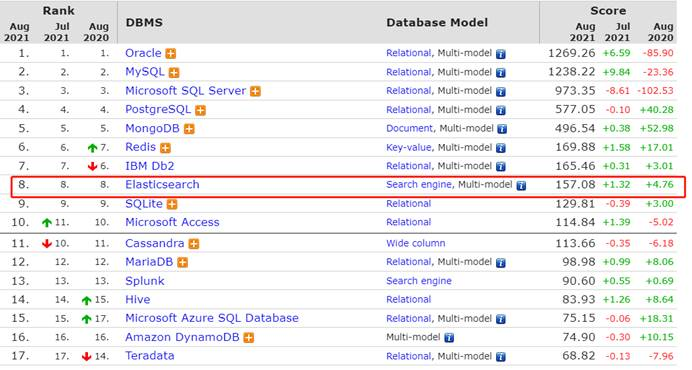
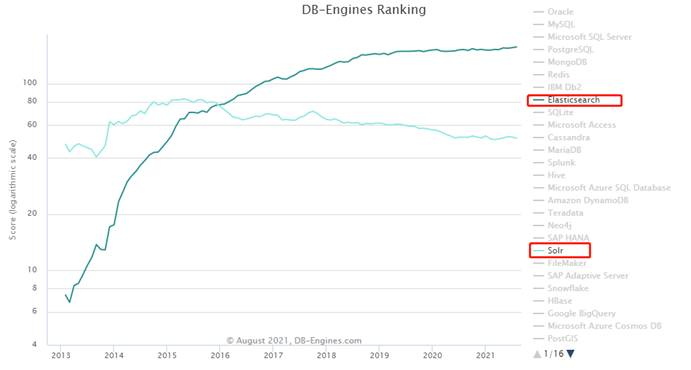
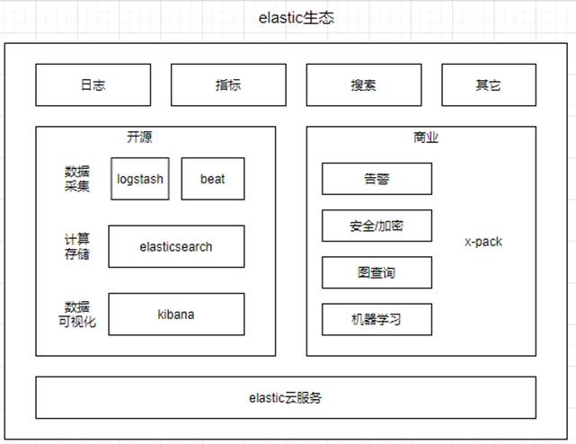
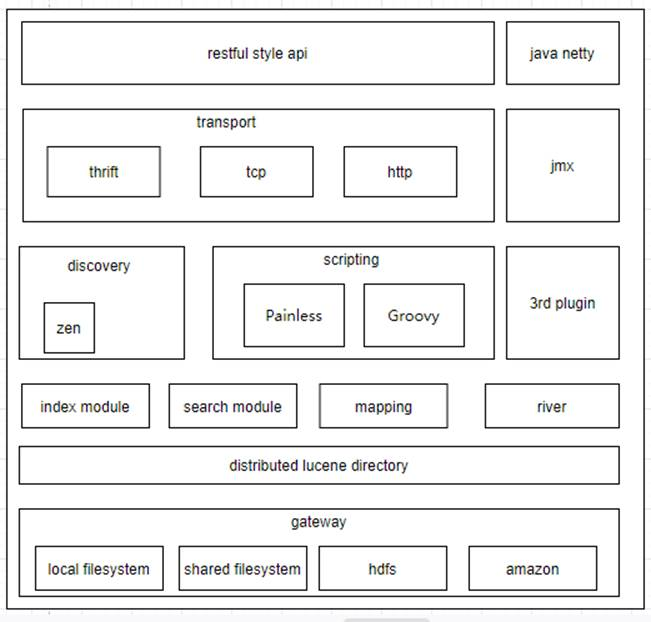
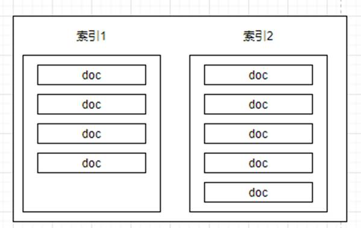
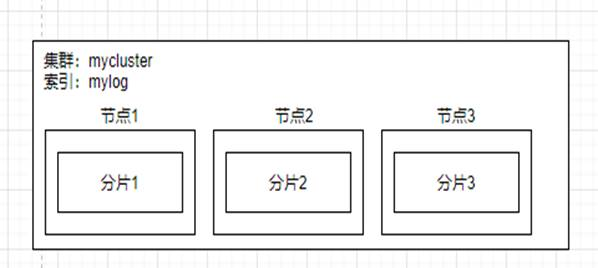
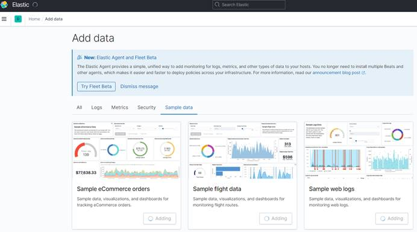
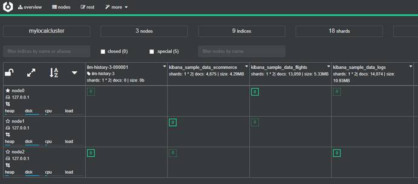

## 1.  Elasticsearch是什么

​	elasticsearch是一款开源的分布式搜索、存储、分析引擎；它目前的时效为近实时性的。Solar也是顶级的开源搜索引擎，也是基于lucene；elasticsearch与Solar相比安装更加简单，对于一些复杂的搜索支持更好，在大数据量下，elasticsearch的性能更好，现在被很多公司大量的使用。

我们可以看到数据库搜索引擎排名已经很高了（https://db-engines.com/en/ranking）

 

 

## 2. Elasticsearch发展

### 2.1.  Elasticsarch发展史

1） 2004年，shay banon基于lucene开发了compass。

2） 2010年，shay banon重构了compass，取名为elasticsearch，使其支持分布式和水平扩展

3） 2012年，Elasticsearch BV公司被创建，围绕Elasticsearch及相关软件提供商业服务和产品

4） 2015年，Elasticsearch公司更名为Elastic

Lucene 是一个高性能的搜索引擎库，它提供索引数据和搜索数据的功能，内部非常复杂，elasticsearch利用了lucene的高性能，封装了它的复杂性，对外可以提供rest接口，不同语言的应用都可以调用。

**轶事：**

2004年，shay banon失业了，准备给他厨师老婆做一个食谱的搜索引擎，如果直接使用Lucene很难，所以他把使用lucene抽象了一下，并开源了，开发者可以直接在程序里使用compass来进行搜索，2010年的时候，它已经重构了compass，取名为elasticsearch，支持分布式和水平扩展。

### 2.2.  Elasticsarch重要版本

Elastic的版本维护政策维护当前主要版本的最新次要版本，以及上一个主要版本的最新次要版本，例如7.10.2，7主版本，10为次要版本，2为修复bug的版本。它的具体的版本政策可以查看（https://www.elastic.co/cn/support/eol），elasticsearch主要版本特性如下：

*  0.4，elasticsearch第一版发布

*  5.X

  * lucene 6.x，性能提升很多，默认打分算法tf-idf改为bm25

  * 新增ingest节点、painless脚本、java rest

  * Type 标记为deprecated了，支持keyword类型

  * 内部做了一些性能优化

* 6.X

  * lucene 7.x

  * 新增了索引生命周期管理

  * sql支持

  * 跨集群复制（增值服务）

  * 升级和数据迁移优化

  * 性能优化，稀疏索引优化，排序优化

* 7.X
  * lucene 8.x
  * 废除了type
  * TransportClient弃用
  * 7.1版本后，x-pack的安全模块免费了
  * High level rest client
  * Script socre query
  * 引入新集群协调子系统，参考官方博客（https://www.elastic.co/cn/blog/a-new-era-for-cluster-coordination-in-elasticsearch）
  * eck（Elastic Cloud on Kubernetes）
  * 性能优化，primary sharding从5改为1，避免over sharding，top n优化

 在实际生产中推荐采用7.x，官方做了很多优化，性能更好，功能更强大。

### 3.   Elasticsearch应用场景

Elastic公司围绕着elasticsearch构建一整套生态系统，适用了很多热门的使用场景

### 3.1.  Elastic生态圈

 

2013年logstash被收购，同年kibana加入elastic公司，后续它陆续收购了beat、prealert(机器学习)等公司，将其纳入到elastic生态圈。

* beats，轻量数据采集器，可收集文件、网络包等数据，它们安装在目标服务器作为代理，转发数据到logstash或elasticsearch上。

* X-Pack，商业套件，提供了一些增值服务，有些组件也开源了。

### 3.2.  使用场景

#### 1）网站搜索

设计了丰富的api来提供搜索服务，github、stackoverflow等网站的搜索都是基于elasticsearch。

#### 2）日志

将分散的日志，集中化存储到elasticsearch上。

日志管理一般分为：日志收集，格式化，检索，风险告警。

#### 3）数据库同步

通过某种同步机制将数据库某个表的数据同步到elasticsearch上，然后提供搜索服务。

#### 4）指标分析

提供了分组查询、top查询、排序、相关度打分，可以进行数据分析

## 4. Elasticsearch整体架构

### 4.1. 整体架构图

 

如上图所示，elasticsearch整体的功能划分：

- 1）restful api，表示提供rest风格的api来实现编程何管理
- 2）Transport, 网络传输模块，支持http，thrift等主流协议，默认tcp
- 3）Scripting，脚本语言，支持使用groovy、painless等脚本语言
- 4）3rd plugin，支持第三方插件
- 5）Index module 索引文档、search module，搜索文档
- 6）River，支持接入其它数据源
- 7）Jmx，监控
- 8）Discovery，服务发现模块
- 9）Lucene directory，底层存储基于lucene实现
- 10）Gateway，可以持久化到本地或者其它文件系统

### 4.2. 基本概念

开发视角：

 

1）文档

可搜索的最小单位，我们向elasticsearch存储的一条数据，就是一个文档。     每个文档都有一个id，可以自己指定，也可以让elasticsearch生成。

2）索引

索引是文档的容器，一类文档的集合。可以对文档元数据进行定义，比如名称、类型等。在物理上，索引的数据分布在分片上。

3）Type

在7.0以前，一个索引可以定义多个type，7.0版本后，type废除了，只有一个type为“_doc”。

系统视角：

 

1）集群

一个elasticsearch集群由多个节点构成，它的分布式架构支持存储水平扩容，并且依靠副本可用性也很高。

2）节点

一个节点就是一个elasticsearch实例，即一个java进程。节点根据功能可以划分多种角色，比如主节点、数据节点、协调节点、ingest节点等。默认一个节点这些角色都承担。

3）分片

为了解决数据水平扩展，通过分片将数据分散到集群的节点上。一个索引分片数的设计需要提前做好评估，太大和太小都不好，具体怎么评估，后续的文章会来探讨。

 

## 5.   Elasticsearch集群搭建

### 5.1.  Elasticsearch安装

* 安装java8环境，7.0后的elasticsearch版本，内置了java环境

* 下载elasticsearch二进制文件（7.10.2）

  https://www.elastic.co/cn/downloads/past-releases/elasticsearch-7-10-2

* 启动elasticsearch集群（3节点）

  启动命令：

  ```
  bin/elasticsearch -E node.name=node0 -E cluster.name=mylocalcluster -E path.data=node0_data
  
  bin/elasticsearch -E node.name=node1 -E cluster.name=mylocalcluster -E path.data=node1_data
  
  bin/elasticsearch -E node.name=node2 -E cluster.name=mylocalcluster -E path.data=node2_data 
  ```

* 接口查看状态

  * 节点的状态（http://localhost:9200）

    ```
    {
    
     "name" : "node0", //节点名称
    
     "cluster_name" : "mylocalcluster", //集群名称
    
     "cluster_uuid" : "nTdmburYQPmB2Ppmw0UhiQ",
    
     "version" : {
    
      "number" : "7.10.2",
    
      "build_flavor" : "default",
    
      "build_type" : "zip",
    
      "build_hash" : "747e1cc71def077253878a59143c1f785afa92b9",
    
      "build_date" : "2021-01-13T00:42:12.435326Z",
    
      "build_snapshot" : false,
    
      "lucene_version" : "8.7.0",
    
      "minimum_wire_compatibility_version" : "6.8.0",
    
      "minimum_index_compatibility_version" : "6.0.0-beta1"
    
     },
    
     "tagline" : "You Know, for Search"
    
    }
    ```

  * 集群的状态（http://localhost:9200/_cat/nodes）

    ```
    127.0.0.1 31 78 11  cdhilmrstw * node0 //*表示是主节点
    
    127.0.0.1 33 78 10  cdhilmrstw - node1
    
    127.0.0.1 33 78 9  cdhilmrstw - node2
    ```

  * 集群的健康状态（http://localhost:9200/_cat/nodes）

    ```
    {
    	"cluster_name": "mylocalcluster",
    	"status": "green", //集群状态
    	"timed_out": false,
    	"number_of_nodes": 3,//节点数
    	"number_of_data_nodes": 3,//数据节点数
    	"active_primary_shards": 0,
    	"active_shards": 0,
    	"relocating_shards": 0,
    	"initializing_shards": 0,
    	"unassigned_shards": 0,
    	"delayed_unassigned_shards": 0,
    	"number_of_pending_tasks": 0,
    	"number_of_in_flight_fetch": 0,
    	"task_max_waiting_in_queue_millis": 0,
    	"active_shards_percent_as_number": 100.0
    }
    
    ```

* 安装kibana来管理elasticsearch

  * 下载kibana安装包

    https://www.elastic.co/cn/downloads/past-releases#kibana

  * config\kibana.yml配置指向elastisearch集群

    ```
    elasticsearch.hosts: ["http://localhost:9200","http://localhost:9201","http://localhost:9202"] 
    i18n.locale: "zh-CN"
    ```

  * 启动kibana，执行命令bin/kibana

  *  进入管理界面

    http://localhost:5601

* 导入样本数据（可选，可以自己验证功能）

 

* Kibana查看elasticsearch索引和数据

* 安装cerebro可视化的查看集群状态
  * 下载https://github.com/lmenezes/cerebro/releases
  * cerebro-0.9.4\conf\application.conf 修改配置文件
  * 启动bin\cerebro.bat
  * 查看管理界面http://localhost:9000

​			

 

### 5.2.  Elasticsearch简单上手

#### 1）添加文档

```
POST user/_doc

{

  "name" : "xiao ming",

  "age" : 12

}
```

注意post（自动生成id）、put（可以指定Id。如果id已经存在报错）效果是不一样的

#### 2）查询文档

```
GET /user/_doc/2
```

更多的api可以查看官方文档：https://www.elastic.co/guide/en/elasticsearch/reference/7.1/docs.html

## 6. 总结

​	本篇文章先是介绍了elasticsearch的发展历史以及重大版本说明，知道7.x版本以后已经不支持自定义type了。接着介绍了elascitc公司生态圈以及elasticsearch的使用场景，知道了elasticsearch主要用于全文检索、日志等热门的场景中。然后通过一个elasticsearch集群搭建和相关组件的安装，快速上手了下文档基础操作。最后对elasticsearch整体功能、集群、节点、分片等主要概念做了一些简单说明，这样我们对elasticsearch有了大概的了解。后面的文章会对elasticsearch的功能和核心原理进行进一步探讨。