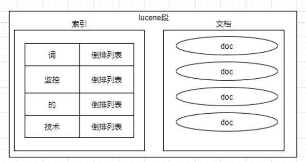

## 1.  开篇

上一篇文章对elasitcsearch进行了整体的介绍，初步了解了下elasticsearch的发展、应用场景、整体功能架构和一些基本的概念，并且实际上手搭建了一个集群做了下文档的操作；elascticsearch是如何进行数据分片的呢，集群的容错性又是如何保证的呢。为什么elascticsearch是近实时搜索而不是实时搜索的呢？带着这些问题，我们将从分片容错、选主、索引生命周期、倒排索引等核心概念来深入了解elasticsearch。

## 2.  分片与容错

### 2.1.  分片

 

我们知道通过主分片，可以将数据分布在所有的节点上，分片提供了集群水平扩展的能力，而副本提升了系统的容错性，也在一定程度上提升了读的吞吐量，但是降低了索引的速率。需要根据实际的应用场景选择合适的副本数量。

### 2.2. 故障转移原理

如上图所示，是一个由3个节点构成的集群，上面的一个索引有3个主分片，每个分片一个副本。现演示一个节点宕机的情况：

1）将node1节点宕掉，elasticsearch会重新选一个主节点。

2）Node1的p0主分片丢失，node3上的R0提升为主分片，集群健康状态变为黄色

3）R0和R1再分配如图所示，集群变绿

 

## 3.  选主与脑裂

elasticsearch可以配置多个master eligible节点，每个节点启动默认都是一个master eligible节点，这种类型的节点参与选主流程，然后其中一个成为master节点。

### 3.1. 主节点作用

1）维护了所有的节点信息

2）维护了所有的索引、mapping、setting信息

3）维护了分片信息（所以一个elasticsearch的分片和索引并不能无限扩大，主节点有限）

4）其它节点同步保存了集群状态信息，只有主节点才能修改状态信息，然后同步给其它节点，这样才能保证一致性

### 3.2.  选主流程

1）互相ping对方，node id低的会成为被选举的节点

2）新节点加入，不会重新选主，发现主节点丢失，重新选主

​	这里会存在一些问题，Master职责负载过重，可能无法即时对组内成员作出响应，这是一种假死。但是其它节点开始选主，选主成功了，原来的Master恢复了，因为原来Master节点的id优先级最高，又开始一轮选主，重新把原来Master又成为主，后来它又负载过重了，这样便重复选主，不可用时间很长。

### 3.3.  脑裂

当出现网络分区问题时，可能导致集群分成两部分，每一部分都有一个主


在7.0版本以前：

需要配置一个参数，必须要大于某个值才能选举，来避免脑裂

比如有三个master eligible节点，这个参数discovery.zen.minimum_master_nodes设置为2，必须两个节点才能选举。

计算方法为Quorum = （master 节点总数 /2）+ 1

在7.0版本以后采用基于raft算法，无需配置，elasticsearch自身可以做判断了。

Raft算法有三个角色，跟随者、候选人、领导者。标准raft的大致的流程为：节点发现没有主了，发起选举，任期增加，接收的节点根据先到先得、任期最大、日志最完整作为条件来确认是否投票。elasticsearch与标准的raft有所改动，比如初始都为候选人、不限制每一个角色直投一票等等，可以参考博客（https://www.pianshen.com/article/16271108957/）

 

## 4.  倒排索引

### 4.1. 正排索引

 

和我们通常理解的索引是一样的，如一本书的目录一样，想查找“spring的结构组成”的章节，可以直接定位到22页

### 4.2. 什么是倒排索引？

如果我们想查找“aop”字样出现的位置，那么使用上面的目录就无法做到了，只能全文扫描才知道。如何来为这个建立索引呢？可以使用倒排索引，这么建立索引：

Aop：23，34，45，65

Aspect：24，56，344

Configuration:245

。。。。。。。

如上面的索引，我们就可以轻松地找到“aop”所在的位置了。

Elascticsearch的倒排索引就是文档的单词和文档的id关联

 

### 4.3. 倒排索引的组成

* 单词词典

  文档的所有的单词，这个量可能很多

* 倒排列表

  单词出现的词频和单词所在的位置

​		 

倒排索引会占用很大的空间，如果不需要检索，可以不使用倒排索引

### 4.4. 相关度打分

Elascticsearch5之前，默认的相关性算分为TF-IDF，现在采⽤用 BM 25算法作为默认打分。

* TF(Term Frequency)表示词在一篇文档出现的频率。

* DF表示词在所有⽂文档中出现的频率。

​	如果只靠TF在文档出现的频率计算相关度打分可能不准确，比如“的”字频率很大，但是贡献度不高，所以还需DF进行加权，IDF是DF的反向值，即IDF越大说明这个词的贡献度更有价值。

1980年，Robertson用信息论相关理论证明和优化了使用于搜索引擎的TF-IDF公式：

 

​	后来人们发现TF-IDF会随TF增大而无限增大，对搜索的正确性有所影响，后续采用了BM25算法了。具体算法可查看相关资料。

​	综合下来，可以看出文档的个数、词频、文档的长度都可能影响相关度得分。

### 4.5. 分词器

分词是将文本转化为一系列单词的过程。转化为单词后就可以形成倒排索引

分词是由分词器实现的。分词器主要由三部分组成：

* character filters

原始文本去除一些特殊符号，比如《》之类的

* Tokenizer

按照规则切分单词

* Token filter

对切分的单词进行加工，比如转小写，删除一些特殊的单词

​     

Elasticsearch内置了很多分词器，比如standard分词器，切分单词和小写处理，它是默认的分词器。我们使用rest api可以测试分词效果：

```
GET /_analyze

{

 "analyzer": "standard",

 "text": "Monitor & Metric"

}
{

 "tokens" : [

  {

   "token" : "monitor",

   "start_offset" : 0,

   "end_offset" : 7,

   "type" : "<ALPHANUM>",

   "position" : 0

  },

  {

   "token" : "metric",

   "start_offset" : 10,

   "end_offset" : 16,

   "type" : "<ALPHANUM>",

   "position" : 1

  }

 ]

}
```

如果语句中有中文，则分词效果不好，需要使用专门的中文分词器，如对unicode很好支持的icu、ik、thulac analyzer，需要在elasticserach上先安装再使用

## 5.  基本流程

### 5.1. 索引

 

如图所示，当一个索引请求到了node3节点上，产生的流程为：

* 客户端向 Node 3 发送新建、删除请求。

* node3发现该文档属于p1分片，转发请求到node1

* Node1完成p1分片的索引，转发node2、node3请求副本分片

* 所有的副本分片完成后node3返回结果。

### 5.2. 查询

#### 5.2.1.    查询流程

 

如图所示，当一个查询请求，请求到node1上，它的查询流程如下：

* node1为协调节点，它随机从这6个主副分片选择3个分片发送查询请求。

* 每个分片查询返回from size排序好了的id和排序值给协调节点。

* 协调节点进入query阶段，将每个分片获取的id和排序值汇总重新排序，选取from size个id。

* 并发携带id向对应的分片获取详细信息，然后返回数据给客户端。

#### 5.2.2.  存在问题

* 性能问题

  每个分片需要查询的数量很大（from+size），深度分页的时候性能消耗很严重。

  解决：携带上一次文档的id（从业务的角度解决）

* 算分不准

  由于每个分片它的相关度计算是根据自身的分片的指标计算的，和多个分片数据汇总起来的真实的相关度排名会有差异。会存在整体相关度不准的问题。

  解决：数据量少的时候，使用一个分片，数据量大的时候，从统计学来看分片的数据分布的会比较均匀，结果会趋近于准确。

## 6.  分片的生命周期

分片写入数据的时候，底层采用分段的存储模式。单个的倒排索引文件被称为一个段。多个段汇总在一起成为一个lucene索引，也是一个elasticsearch索引的一个分片。

 

如上图所示，为一个节点索引文档的流程：

* elasticsearch节点接收index请求，存入index buffer，同步存入磁盘transationlog后返回索引结果

* Refresh定时将index buffer数据生成segment，存入到操作系统缓存，此时没有fsync，清空indexbuffer，此时就可以被elasticsearch查询了，如果index buffer占满时，也会触发refresh，默认为jvm的10%。
* Flush定时将缓存中的segments写入到磁盘，删除transactionlog。如果transactionlog满时（512m），也会触发flush。
* 如果数据很多，segment的也很多，同时也可能由删除的文档，elasticsearch会定期将它们合并。

## 7.  lucene索引初识

Mysql数据库存储数据使用b+树，redis内部使用了多种数据结构存储比如跳跃表。Elasticsearch是一款搜索引擎，核心能力之一就是全文检索，所以采用了倒排索引。

倒排索引的基本结构上文中已经介绍。这里介绍下生成一个lucene段的结构

 

我们知道，倒排索引是由字典和倒排表组成，在lucnen的字典可以由多种数据结构构成。比如排序列表、hash表、树、跳跃表等等。

正如上面所说，当词的量很大时，检索这些词也是非常费劲，首先可以想到将词排序，然后二分法查找，但是词是海量的话，随机io依然很多，为了提升效率，可以使用term index来查找词。elasticsearch使用trie（单词查找）树，如图所示

这个单词前缀的树结构在内存之中，不像mysql的b+树需要和磁盘多次io操作。所以在磁盘中就可以根据索引树查找到最终数据存在哪一个磁盘块中，然后直接到那块磁盘中查找对应的倒排列表。上面只是介绍了简单的trie树，实际上lucene采用了FST变种的trie树，既能前缀匹配也能后缀匹配，而且大大节省了空间，后续有时间再探讨下lucene的FST结构。如果多字段联合检索，获取到了多个倒排列表，需要对它们的文档id取交集，lucene使用Skip List或者bitset的方式计算交集，有兴趣的朋友可以去查阅相关资料了解具体的过程。

Lucene 为了提升索引和搜索的效率，从上层到底层，使用了各种巧妙的数据结构和设计，来支持文档的倒排检索。

## 8.  总结

​	通过本文，我们了解了elasticsearch的核心原理，知道了elasticsearch底层是基于lucenen类库来实现倒排索引的，通过lucene提供了丰富强大的文档检索能力。通过索引先刷入内存、然后定时刷入磁盘来增强写入性能，这也是它近实时搜索的原因。一个索引是单机的，elasticsearch通过分片副本机制来保证了容错性，但是过多的副本会导致写入性能下降，需要结合实际来设置副本数量。6.x及以前的版本需要设置最小的选主节点数来预防脑裂，7.x以后通过新的选举机制来规避了这个问题。篇幅有限，后面会介绍一些elascticsearch有关的内容。