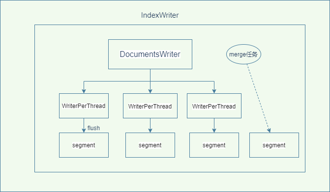
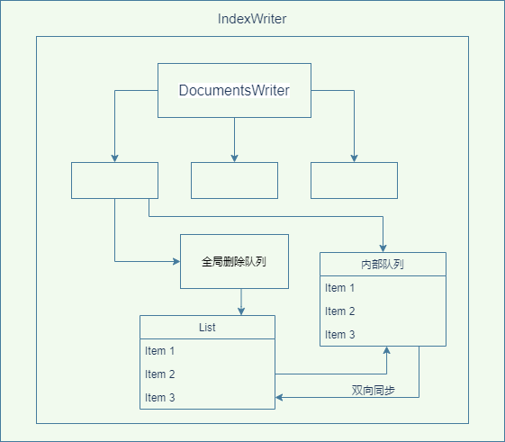
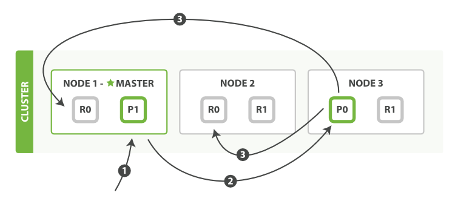
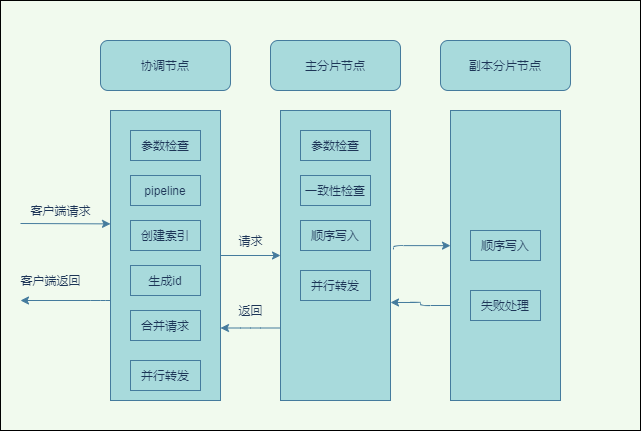
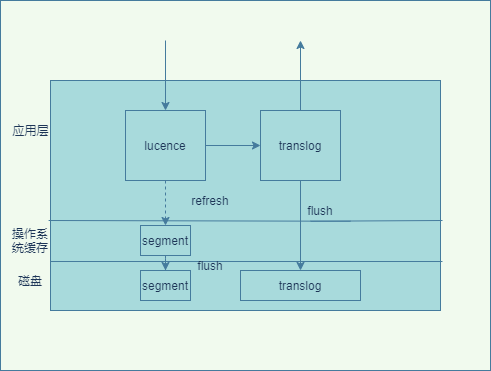
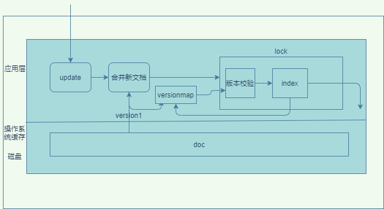

## 1. 开头
&emsp;&emsp;我们在前面已经知道elasticsearch底层的写入是基于lucence依进行doc写入的。elasticsearch作为一款分布式系统，在写入数据时还需要考虑很多重要的事项，比如:可靠性、原子性、一致性、实时性、隔离性、性能等多个指标。elasticsearch是如何做到的呢？下面我们针对elasticsearch的写入进行分析。
<br/>
## 2. lucence写
### 2.1. 增删改
&emsp;&emsp;elasticsearch拿到一个doc后调用lucence的api进行写入的。
```
 public long addDocument();
 public long updateDocuments();
 public long deleteDocuments();
```
如上面的代码所示，我们使用lucence的上面的接口就可以完成文档的增删改操作。在lucence中有一个核心的类IndexWriter负责数据写入和索引相关的工作。
```
//1. 初始化indexwriter对象
IndexWriter writer = new IndexWriter(new Directory(Paths.get("/index")), new IndexWriterConfig());

//2. 创建文档
Document doc = new Document();
doc.add(new StringField("empName", "王某某", Field.Store.YES));
doc.add(new TextField("content", "操作了某菜单", Field.Store.YES));

//3. 添加文档
writer.addDocument(doc);

//4. 提交
writer.commit();
```
以上代码演示了最基础的lucence的写入操作，主要涉及到几个关键点：
* 初始化，Directory是负责持久化的，他的具体实现有很多，有本地文件系统、数据库、分布式文件系统等待，elasticsearch默认的实现是本地文件系统。
* Document就是es中的文档，FiledType定义了很多索引类型。这里列举几个常见的类型：
  * stored，字段原始内容存储
  * indexOptions(NONE、DOCS、DOCS_AND_FREQS、DOCS_AND_FREQS_AND_POSITIONS、DOCS_AND_FREQS_AND_POSITIONS_AND_OFFSETS)，倒排索引的选项，存储词频、位置信息等。
  * docValuesType，正排索引，建立一个docid到field的的一个列存储。
  * 一些其它的类型。
* IndexWriter在doc进行commit后，才会被持久化并且是可搜索的。
* IndexWriterConfig负责了一些整体的配置参数，并提供了方便使用者进行功能定制的参数：
  * Similarity，这个是搜索的核心参数，实现了这个接口就能够进行自定义算分。lucence默认实现了前面文章提到的TF-IDF、BM25算法。
  * MergePolicy，合并的策略。我们知道elasticsearch会进行合并，从而减少段的数量。
  * IndexerThreadPool，线程池的管理
  * FlushPolicy，flush的策略
  * Analyzer，定制分词器
  * IndexDeletionPolicy，提交管理

PS：在elasticsearch中，为了支持分布式的功能，新增了一些系统默认字段：  
* _uid，主键，在写入的时候，可以指定该Doc的ID值，如果不指定，则系统自动生成一个唯一的UUID值。
* _version，版本字段，version来保证对文档的变更正确的执行，更新文档时有用。
* _source，原始信息，如果后面维护不需要reindex索引可以关闭该字段，从而节省空间
* _routiong，路由字段。
* 其它的字段
  

### 2.2. 并发模型
&emsp;&emsp;上面我们知道indexwriter负责了elasticsearch索引增删改查。那它具体是如何管理的呢？  

#### 2.2.1. 基本操作
关键点：
* DocumentsWriter处理写请求，并分配具体的线程DocumentsWriterPerThread
* DocumentsWriterPerThread具有独立内存空间，对文档进行处理
* DocumentsWriter触发一些flush的操作。
* DocumentsWriterPerThread中的内存In-memory buffer会被flush成独立的segement文件。
* 对于这种设计，多线程的写入，针对纯新增文档的场景，所有数据都不会有冲突，非常适合隔离的数据写入方式  
  
#### 2.2.2. 更新
&emsp;&emsp;Lucene的update和数据库的update不太一样，Lucene的更新是查询后删除再新增。
* 分配一个操作线程
* 在线程里执行删除
* 在线程里执行新增

#### 2.2.3. 删除  
  
&emsp;&emsp;上面已经说了，在update中会删除，普通的也会删除，lucence维护了一个全局的删除表，每个线程也会维护一个删除表，他们双向同步数据  

* update的删除会先在内部记录删除的数据，然后同步到全局表中
* delete的删除会作用在Global级别，后异步同步到线程中。
* Lucene Segment内部，数据实际上其实并不会被真正删除，Segment内部会维持一个文件记录，哪些是docid是删除的，在merge时，相应的doc文档会被真正的删除。

#### 2.2.4. flush和commit
&emsp;&emsp;每一个WriterPerThread线程会根据flush策略将文档形成segment文件，此时segment的文件还是不可见的，需要indexWriter进行commit后才能被搜索。  
这里需要注意：  
elasticsearch的refresh对应于lucene的flush，elasticsearch的flush对应于lucene的commit，elasticsearch在refresh时通过其它方式使得segment变得可读。


#### 2.2.5. merge
&emsp;&emsp;merge是对segment文件合并的动作，这样可以提升查询的效率并且可以真正的删除的文档

<br/>

#### 2.2.6. 小结 
&emsp;&emsp;在这里我们稍微总结一下，一个elasticsearch索引的一个分片对应一个完整的lucene索引, 而一个lucene索引对应多个segment。我们在构建同一个lucene索引的时候, 可能有多个线程在并发构建同一个lucene索引, 这个时候每个线程会对应一个DocumentsWriterPerThread, 而每个 DocumentsWriterPerThread会对应一个index buffer. 在执行了flush以后, 一个 DocumentsWriterPerThread会生成一个segment。

## 3. Elasticsearch的写
### 3.1. 宏观看Elasticsearch请求
 &emsp;&emsp;在前面的文章已经讨论了写入的流程Elasticsearch  
  
图片来自官网  
当写入文档的时候，根据routing规则，会将文档发送至特定的Shard中建立lucence。  
* 在Primary Shard上执行成功后，再从Primary Shard上将请求同时发送给多个Replica Shardgit 
* 请求在多个Replica Shard上执行成功并返回给Primary Shard后，写入请求执行成功，返回结果给客户端  
  
注意上面的写入延时=主分片延时+max(Replicas Write),即写入性能如果有副本分片在，就至少是写入两个分片的延时延时之和。

### 3.2. 详细流程
  
#### 3.2.1. 协调节点内部流程  
&emsp;&emsp;如上图所示：
* 协调节点会对请求检查放在第一位，如果如果有问题就直接拒绝。主要有长度校验、必传参数、类型、版本、id等等
* pipeline，用户可以自定义设置处理器，比如可以对字段切割或者新增字段，还支持一些脚本语言，可以查看官方文档编写。
* 如果允许自动创建索引（默认是允许的），会先创建索引，创建索引会发送到主节点上，必须等待master成功响应后，才会进入下一流程
* 请求预处理，比如是否会自动生成id、路由，
* 获取到整个集群的信息了，并检查集群状态，比如集群master不存在，都会被拒绝。
* 构建sharding请求，比如这一批有5个文档， 如果都是属于同一个分片的，那么就会合并到一个请求里，会根据路由算法将文档分类放到一个map里 Map<ShardId, List<BulkItemRequest>> requestsByShard = new HashMap<>();路由算法默认是文档id%分片数
* 转发请求，有了分片会根据前面的集群状态来确定具体的elasticsearch节点ip，然后并行去请求它们。

#### 3.2.2. 主分片节点流程 
#### 3.2.2.1. 写入（index） 
  
&emsp;&emsp;该部分是elasticsarch的核心写入流程，在前面的文章也介绍了，请求到该节点会最终调用lucence的方法，建立lucence索引。其中主要的关键点：
* elasticsearch节点接收index请求，存入index buffer，同步存入磁盘translog后返回索引结果
* Refresh定时将lucence数据生成segment，存入到操作系统缓存，此时没有fsync，清空lucence，此时就可以被elasticsearch查询了，如果index buffer占满时，也会触发refresh，默认为jvm的10%。
* Flush定时将缓存中的segments写入到磁盘，删除translog。如果translog满时（512m），也会触发flush。
* 如果数据很多，segment的也很多，同时也可能由删除的文档，elasticsearch会定期将它们合并。  

#### 3.2.2.2. update  
  
* 读取同id的完整Doc, 记录版本为version1。
* 将version1的doc和update请求的Doc合并成一个Doc，更新内存中的VersionMap。获取到完整Doc后。进入后续的操作。
* 后面的操作会加锁。
* 第二次从versionMap中读取该doc的的最大版本号version2，这里基本都会从versionMap中获取到。
* 检查版本是否冲突，判断版本是否一致（冲突），如果发生冲突，则回到第一步，重新执行查询doc合并操作。如果不冲突，则执行最新的添加doc请求。
* 在add Doc时，首先将Version + 1得到V3，再将Doc加入到Lucene中去，Lucene中会先删同id下的已存在doc id，然后再增加新Doc。写入Lucene成功后，将当前V3更新到versionMap中。
* 释放锁，更新流程就结束了。  

&emsp;&emsp;其实就是乐观锁的机制，每次更新一次版本号加 1 ，不像关系式数据库有事物，你在更新数据，可能别人也在更新的话，就把你的给覆盖了。你要更新的时候，先查询出来，记住版本号，在更新的时候最新的版本号和你查询的时候不一样，说明别人先更新了。你应该读取最新的数据之后再更新。

&emsp;&emsp;写成功后，会转发写副本分片，等待响应，并最后返回数据给协调节点。具体的流程：
* 校验，校验写的分片是否存在、索引的状态是否正常等等。
* 是否需要延迟执行，如果是则会放入到队列里等待
* 校验活跃的分片数是否存在，不足则拒绝写入。
```
 public boolean enoughShardsActive(final int activeShardCount) {
        if (this.value < 0) {
            throw new IllegalStateException("not enough information to resolve to shard count");
        }
        if (activeShardCount < 0) {
            throw new IllegalArgumentException("activeShardCount cannot be negative");
        }
        return this.value <= activeShardCount;
    }
```
为什么会要校验这个活跃的分片数呢？  
elasticsearch的索引层有个一waitforactiveshards参数代表写入的时候必须的分片数，默认是1。如果一个索引是每个分片3个副本的话，那么一共有4个分片，请求时至少需要校验存活的分片数至少为1，相当于提前校验了。如果对数据的可靠性要求很高，就可以调高这个值，必须要达到这个数量才会写入。

* 调用lucence写入doc
* 写入translog日志。
* 写入副本分片，循环处理副本请求，会传递一些信息。在这里需要注意，它们是异步发送到副本分片上的，并且需要全部等待响应结果，直至超时。
* 接着上一步，如果有副本分片失败的情况，会把这个失败的分片发送给master，master会更新集群状态，这个副本分片会从可分配列表中移除。
  发送请求至副本
```
    @Override
    public void tryAction(ActionListener<ReplicaResponse> listener) {
        replicasProxy.performOn(shard, replicaRequest, primaryTerm, globalCheckpoint, maxSeqNoOfUpdatesOrDeletes, listener);
    }
```
等待结果
```
    private void decPendingAndFinishIfNeeded() {
        assert pendingActions.get() > 0 : "pending action count goes below 0 for request [" + request + "]";
        if (pendingActions.decrementAndGet() == 0) {
            finish();
        }
    }
```
&emsp;&emsp;在以前的版本中，其实是异步请求副本分片的，后来觉得丢失数据的风险很大，就改成同步发送了，即Primary等Replica返回后再返回给客户端。如果副本有写入失败的，elasticsearch会进行一些重试，但最终并不强求一定要在多少个节点写入成功。在返回的结果中，会包含数据在多少个shard中写入成功了，多少个失败了，如果有副本上传失败，会将失败的副本上报至Master。  
<br>
PS：elasticsearch的数据副本模型和kafka副本很相似，都是采用的是ISR机制。即：ES里面有一个：in-sync copies概念，主分片会在索引的时候会同步数据至in-sync copies里面所有的节点，然后再返回ACK给client。而in-sync copies里面的节点是动态变化的，如果出现极端情况，在in-sync copies列表中只有主分片一个的话，这里很容易出现SPOF问题，这个是在elasticsearch中是如何解决的呢？  
&emsp;&emsp;就是依靠上面我们分析的wait_for_active_shards参数来防止SPOF，如果配置index的wait_for_active_shards=3就会提前校验必须要有三个活跃的分片才会进行同步，否则拒绝请求。对于可靠性要求高的索引可以提升这个值。
<br>
**PS：为什么是先写lucence再写入translog呢，这是因为写入lucence写入时会有数据检查，有可能会写入失败，这个是发生在内存之中的，如果先写入磁盘的translog的话，还需要回退日志，比较麻烦**

<br/>

#### 3.2.3. 副本分片节点流程

这个过程和主分片节点的流程基本一样，有些校验可能略微不同，最终都会写入lucence索引。 

<br/>

## 4. 总结  
&emsp;&emsp;本文介绍了Elasticsearch的写入流程和一些比较详细的机制，最后我们总结下开头我们提出的问题，一个分布式系统需要满足很多特性，大部分特性都能够在elasticsearch中得到满足。
* 可靠性：lucence只是个工具，Elasticsearch中通过自己设计的副本来保证了节点的容错，通过translog日志保证宕机后能够恢复。通过这两套机制提供了可靠性保障。
* 一致性：elasticsearch实现的是最终一致性，副本和主分片在同一时刻读取的数据可能不一致。比如副本的refresh频率和主分片的频率可能不一样。
* 高性能：elasticsearch通过多种手段来提升性能，具体包括：
  * lucence自身独立线程维护各自的Segment，多线程需要竞争的资源更少，性能更好。
  * update等操作使用versionMap缓存，减少io
  * refresh至操作系统缓存
* 原子性、隔离性：使用版本的乐观锁机制保证的。
* 实时性：elasticsearch设计的是近实时的，如果同步进行refresh、flush将大幅降低性能，所以是”攒一部分数据“再刷入磁盘，不过实时写入的tranlog日志还是可以实时通过id查到的。
