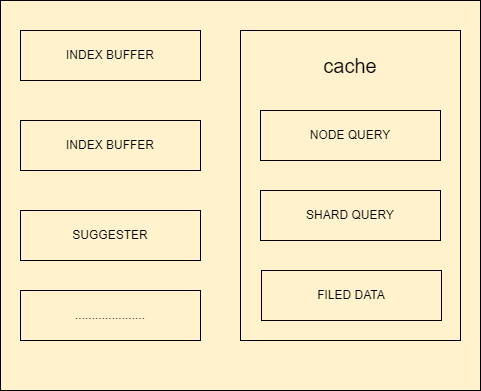
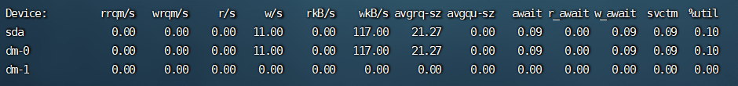

## 1. 开头

​	前面介绍了elasticsearch原理和使用相关的内容，在生产环境如何比较科学的进行容量规划、部署、调优、排查问题呢，业界和官方也对相关的问题进行总结，我这边也结合自己的经验对这些使用elasticsearch经常遇到的问题进行了总结。

其中主要包括三大模块：

* **部署模式**
* **容量规划与调优**
* **问题诊断**

## 2. 部署模式

### 2.1. 节点类型

#### 2.1.1.  节点分类

elasticsearch有多种类型的节点，在前面概述和核心也已经介绍过了。在这里可以重新回顾下。

elasticsearch的部署节点类型如下：

* **Master eligible**

  * 主节点及其候选节点，负责集群状态(cluster state)的管理

  * 配置项：node.master，默认为true

* **data**

  * 数据节点，负责数据存储及处理客户端请求

  * 配置项：node.data，默认为true

* **Ingest**

  * ingest节点，负责数据处理，脚本执行

  * 配置项：node.ingest，默认为true

* **Coordinating**

  * 协调节点

  * 配置项：设置上面三个参数全部为false，那么它就是一个纯协调节点

* **machine learning**

  ​	机器学习节点，收费属于x-pack

#### 2.1.2.  节点推荐配置

在生产环境部署推荐配置整体思路就是：**尽量是一个节点只承担一个角色**。

因为不同的节点所需要的计算机资源都不一样。职责分离后可以按需扩展互不影响

* **Master**

  资源要求：中高CPU；中高内存；中低磁盘

  * 一般在生产环境中配置 3 台
  * 一个集群只有 1 台活跃的主节点，负责分片管理，索引创建，集群管理等操作

* **data**

  资源要求：CPU、内存、磁盘要求都高

* **ingest**

  资源要求：高配置 CPU;中等配置的RAM; 低配置的磁盘

* **Coordinating**

  资源要求：一般中高CPU；中高内存；低磁盘

  协调节点扮演者负载均衡、结果的聚合，在大型的es集群中条件允许可以使用高配的cpu和内存。因为如果客户端发起了深度分页等请求可能会导致oom，这个在之前也有过分析。

**注意：如果和数据节点或者 Coordinate 节点混合部署，数据节点本来相对有比较大的内存占用**

**，而Coordinate 节点有时候可能会有开销很高的查询导致 OOM，这些甚至都有可能影响 Master 节点，导致集群的不稳定。**

### 2.2. 架构模式

搭建一个es集群是由模式可循的。

#### 2.2.1. 基础版部署

 

这是一个基础版的职责分离的部署架构：比如当磁盘容量无法满足需求时，可以增加数据节点； 磁盘读写压力大时，增加数据节点。但是如果大量的聚合查询等操作，这种架构不太适合了。

#### 2.2.2. 水平扩展部署

 

当系统中有大量的复杂查询或者聚合时候，我们可增加 Coordinating 节点，增加查询的性能，这里增加了负载均衡层，通过负载均衡扩展时应用程序无感知

#### 2.2.3. 读写分离

 

这样部署部署相互影响，写入多的话，多部署ingetst节点，读的时候聚合查询较多可以多部署协调节点，存储数据量大，可以适当对数据节点进行调优。

#### 2.2.4. 冷热分离

我们知道数据有冷热之分，比如写入频繁的日志数据，近期的索引将会频繁写入。es根据数据这些特征引入了hot节点和warm节点。

* **hot节点**

  使用ssd，该节点上的索引不断的有新文档写入和查询，对cpu、io的要求较高。

* **warm节点**

  可以使用HDD，上面的索引不会有写入，查询较少。上面只保存只读索引或者旧索引，使用大容量便宜的机械硬盘  

 

配置步骤：

* 在elasticsearch节点启动的时候，在elasticsearch.yml配置文件node.attr中指定当前的节点是hot还是warm。

  如：node.attr.testNodeType=hot

* 通过GET/_cat/nodeattrs?v查看所有的节点的状态

   

* 创建索引时指定在何种类型的节点上

  使用属性："index.routing.allocation.require.testNodeType":"hot"即可

* 也可以在已有的索引上使用上述属性，它会将索引的数据迁移到hot节点上

  

#### 2.2.5. 异地多活

针对多机房灾备，elasticsearch业界有多种不同的通用解决方案：

* **跨机房部署集群**

  一个集群中的节点分布在不同的机房

  * 优点：部署简单，一致性高。
  * 缺点：但是对网络带宽和延迟要求较高，仅适用于同城灾备，可能导致可能由于机房间网络中断造成不可用。

* **应用双写**

  应用程序同时将数据写入两个集群

  * 优点：应用端灵活可控

  * 缺点：但是一致性差、延迟高、集群故障时数据会丢失

* **借助消息队列实现双写**

  应用程序先将数据写入消息队列，然后由下游的消费者消费并写入集群

  * 优点：这种方案数据可靠性高，不易丢失

  * 缺点：引入额外的消息队列组件，维护成本高，开发难度大、延迟高，需要保证消息中间件的高可用。

* **CCR 跨集群复制**

  Elasticsearch 官方的跨集群复制功能，基于文档操作实现订阅复制

  * 优点：一致性高、设置简单、延迟低、提供完善的 API ，并且可以监控同步进度，整体有保障。
  * 缺点：白金功能，会员独享；集群之间拉取数据可能会增加额外的负载并影响原有集群本身的磁盘和网络性能

* **定期快照**

  定期将索引备份到外部存储，如hdfs等设备

  * 优点：操作简单，无技术成本

  * 缺点：但是需要通过快照将数据恢复到新集群中，恢复时间长，数据不是实时备份，可能丢失数据

* **极限网关**

  写请求交给网关，网关实时写入主集群，然后异步写备集群

  * 优点：无缝透明，应用程序无需任何调整、网关自动处理故障情况、一致性高，通过校验任务确保数据完全一致
  * 对网关的要求较高

如下是基于**CCR 跨集群复制**的部署架构，因为篇幅有限，异地多活又是一个很大的话题，其它方案和其细节可以查阅相关资料。

 


## 3. 容量规划与调优

### 3.1. 分片

​	我们知道当es集群的节点数大于索引的分片数时，集群将无法通过水平扩展提升集群的性能。而分片数过多，对于聚合查询以及集群的元数据管理也都有影响。我们可以总结为：

* 分片数量较多优点：

  * 新数据节点加入后，分片会自动分配扩展性强
  * 数据写入分散到不同节点，减少每个节点的压力

* 缺点：

  * 每个分片就是一个lucene索引，这个索引会占用较多的机器资源，造成额外的开销

  * 搜索时，需要到每个分片获取数据

  * master节点维护分片、索引的元信息，造成master节点管理成本过高。

    通常建议一个集群总分片数小于10w

如何设计分片的数量呢？一个分片保持多大的数据量比较合适呢？

#### 3.1.1.  主分片

我们需要根据使用场景来设置：

* 日志类，其特点为：写入频繁，查询较少

  单个分片不要大于50G

* 搜索类，其特点为：写入较少，查询频繁

  单个分片不超过20G

避免使用非常大的分片，因为这会对群集从故障中恢复的能力产生负面影响。而每个分片也会消耗相应的文件句柄, 内存和CPU资源，分片太多会互相竞争，影响性能。

主分片数一旦确定就无法更改，只能新建创建并对数据进行重新索引(reindex)，虽然reindex会比较耗时，但至少能保证你不会停机。所以我们一定要科学的设计分片数。

**这里摘录于官方关于分片大小的建议：**

> * 小的分片会造成小的分段，从而会增加开销。我们的目的是将平均分片大小控制在几 GB 到几十 GB 之间。对于基于时间的数据的使用场景来说，通常将分片大小控制在 20GB 到 40GB 之间。
>
> * 由于每个分片的开销取决于分段的数量和大小，因此通过 forcemerge 操作强制将较小的分段合并为较大的分段，这样可以减少开销并提高查询性能。 理想情况下，一旦不再向索引写入数据，就应该这样做。 请注意，这是一项比较耗费性能和开销的操作，因此应该在非高峰时段执行。
>
> * 我们可以在节点上保留的分片数量与可用的堆内存成正比，但 Elasticsearch 没有强制的固定限制。 一个好的经验法则是确保每个节点的分片数量低于每GB堆内存配置20到25个分片。 因此，具有30GB堆内存的节点应该具有最多600-750个分片，但是低于该限制可以使其保持更好。 这通常有助于集群保持健康。
>
> * 如果担心数据的快速增长, 建议根据这条限制: ElasticSearch推荐的最大JVM堆空间 是 30~32G, 所以把分片最大容量限制为 30GB, 然后再对分片数量做合理估算。例如, 如果的数据能达到 200GB, 则最多分配7到8个分片。
>
> * 如果是基于日期的索引需求, 并且对索引数据的搜索场景非常少。
>
>   也许这些索引量将达到成百上千, 但每个索引的数据量只有1GB甚至更小对于这种类似场景, 建议是只需要为索引分配1个分片。如果使用ES7的默认配置(3个分片), 并且使用 Logstash 按天生成索引, 那么 6 个月下来, 拥有的分片数将达到 540个. 再多的话, 你的集群将难以工作--除非提供了更多(例如15个或更多)的节点。想一下, 大部分的 Logstash 用户并不会频繁的进行搜索, 甚至每分钟都不会有一次查询. 所以这种场景, 推荐更为经济使用的设置. 在这种场景下, 搜索性能并不是第一要素, 所以并不需要很多副本。 维护单个副本用于数据冗余已经足够。不过数据被不断载入到内存的比例相应也会变高。如果索引只需要一个分片, 那么使用 Logstash 的配置可以在 3 节点的集群中维持运行 6 个月。当然你至少需要使用 4GB 的内存, 不过建议使用 8GB, 因为在多数据云平台中使用 8GB 内存会有明显的网速以及更少的资源共享。
>

#### 3.1.2.  副本分片

主分片与副本都能处理查询请求，它们的唯一区别在于只有主分片才能处理索引请求。副本对搜索性能非常重要，同时用户也可在任何时候添加或删除副本。额外的副本能给带来更大的容量，更高的呑吐能力及更强的故障恢复能力

#### 3.1.3. 小结

根据实际经验我们稍微总结下：

- 对于数据量较小（100GB以下）的index，往往写入压力查询压力相对较低，一般设置3~5个shard，numberofreplicas设置为1即可（也就是一主一从，共两副本） 。
- 对于数据量较大（100GB以上）的index：
  - 一般把单个shard的数据量控制在（20GB~50GB）
  - 让index压力分摊至多个节点：可通过index.routing.allocation.totalshardsper_node参数，强制限定一个节点上该index的shard数量，让shard尽量分配到不同节点上
  - 综合考虑整个index的shard数量，如果shard数量（不包括副本）超过50个，就很可能引发拒绝率上升的问题，此时可考虑把该index拆分为多个独立的index，分摊数据量，同时配合routing使用，降低每个查询需要访问的shard数量

### 3.2. 集群配置

#### 3.2.1. jvm配置

* xms和xmx设置成一样，避免heap resize时卡顿

* xmx不要超过物理内存的50%

  因为es的lucene写入强依赖于操作系统缓存，需要预留加多的空间给操作系统

* 最大内存不超过32G，但是也不要太小

  堆太小会导致频繁的小延迟峰值，并因不断的垃圾收集暂停而降低吞吐量

  如果堆太大，应用程序将容易出现来自全堆垃圾回收的罕见长延迟峰值

  将堆限制为略小于 32 GB可以使用jvm的指针压缩技术增强性能

* jvm使用server模式

* 推荐采用g1垃圾回收器

* 关闭jvm swapping

  关闭交换分区的方法是：

  ```
  //将/etc/fstab 文件中包含swap的行注释掉
  sed -i '/swap/s/^/#/' /etc/fstabswapoff -a
  ```

* 其它的配置尽量不要修改，使用默认的配置。

  适当增大写入buffer和bulk队列长度，提高写入性能和稳定性

  ```
  indices.memory.index_buffer_size: 15%thread_pool.bulk.queue_size: 1024
  ```

这里是官方的jvm推荐配置链接：https://www.elastic.co/cn/blog/a-heap-of-trouble

#### 3.2.2. 集群节点数

es的节点提供查询的时候使用较多的内存来存储查询缓存，es的lucene写入到磁盘也会先缓存在内存中，我们开启设计这个es节点时需要根据每个节点的存储数据量来进行判断。这里有一个流行的推荐比例配置：

* 搜索类比例：1:16(内存:节点要存储的数据)
* 日志类比例：1:48-1:96(内存:节点要存储的数据)

**示例：**

有一个业务的数据量预估实际有1T，我们把副本设置1个，那么es中总数据量为2T。

* 如果业务偏向于搜索

  每个节点31*16=496G。在加上其它的预留空间，每个节点有400G的存储空间。2T/400G，则需要5个es存储节点。

* 如果业务偏向于写入日志型

  每个节点31*50=1550G，就只需要2个节点即可

这里31G表示的是jvm设置不超过32g否则不会使用java的指针压缩优化了。

#### 3.2.3. 网络优化

* 单个集群不要跨机房部署
* 如果有多块网卡，可以将tranport和http绑定到不同的网卡上，可以起到隔离的作用
* 使用负载聚合到协调节点和ingest node节点

#### 3.2.4.  磁盘优化

前面也提到过，数据节点推荐使用ssd

#### 3.2.5. 通用设置

* 关闭动态索引创建功能
* 通过模板设置白名单

#### 3.2.6. 其它优化

* Linux参数调优修改系统资源限制# 单用户可以打开的最大文件数量，可以设置为官方推荐的65536或更大些echo

* 设置内存熔断参数，防止写入或查询压力过高导致OOM

  ```
  indices.breaker.total.limit
  indices.breaker.request.limit
  indices.breaker.fielddata.limit
  ```

* 索引、分片等信息都被维护在clusterstate对象中，由master管理，并分发给各个节点。当集群中的index/shard过多，创建索引等基础操作会变成越来越慢，而且master节点的不稳定会影响整体集群的可用性。
  
  可以考虑：
  
  * 拆分独立独有的master节点
  * 降低数据量较小的index的shard数量
  * 把一些有关联的index合并成一个index
  * 数据按某个维度做拆分，写入多个集群

### 3.3. 写入和查询优化

#### 3.3.1. 写入优化

写入的目标在于增大写入的吞吐量，这里主要从两个方面进行优化：

* 客户端：

  * 通过压测确定每次写入的文档数量。一般情况：

    * 单个bulk请求数据两不要太大，官方建议5-15mb
    * 写入请求超时时间建议60s以上
    * 写入尽量不要一直写入同一节点，轮询达到不同节点。

  * 进行多线程写入，最好的情况时动态调整，如果http429，此时可以少写入点，不是可以多写点

  * 写入数据不指定_id，让ES自动产生

    当用户显示指定id写入数据时，ES会先发起查询来确定index中是否已经有相同id的doc存在，若有则先删除原有doc再写入新doc。这样每次写入时，ES都会耗费一定的资源做查询。如果用户写入数据时不指定doc，ES则通过内部算法产生一个随机的id，并且保证id的唯一性，这样就可以跳过前面查询id的步骤，提高写入效率

* server：

  总体目标尽可能压榨服务器资源，提高吞吐量

  * 使用好的硬件，观察cpu、ioblock、内存是否有瓶颈
  * 观察jvm堆栈，垃圾回收情况是否存在耗时较长的gc。
  * 观察写入的分配和节点是否负载均衡
  * 调整bulk线程池和队列的大小，一般不用调整，它是根据现有核数和内存自动算出来的，酌情调整。一般线程数配置为CPU核心数+1，队列也不要太大，否则gc比较频繁。
  * 可靠性要求不高，可以副本设置为0
  * 磁盘io肯定没有内存快，可以在允许的情况refresh调整间隔大一点
  * flush阈值适当调大、落盘异步化、flush频率调高。这些都能减少写入资源的占用，提升写入吞吐能力。但是对容灾能力有损害。

* 索引设置优化

  * 减少不必要的分词，从而降低cpu和磁盘的开销
  * 只需要聚合不需要搜索，index设置成false
  * 不需要算分，可以将norms设置成false
  * 不要对字符串使用默认的dynmic mapping。会自动分词产生不必要的开销
  * index_options控制在创建倒排索引时，哪些内容会被条件到倒排索引中，只添加有用的，这样能很大减少cpu的开销
  * 关闭_source，减少io操作。但是source字段用来存储文档的原始信息，如果我们以后可能reindex，那就必须要有这个字段 

* 设置30s refresh，降低lucene生成频次，资源占用降低提升写入性能，但是损耗实时性

* total_shards_per_node控制分片集中到某一节点，避免热点问题

* translong落盘异步化，提升性能，损耗灾备能力

* dynamic设置false，避免生成多余的分词字段，需要自行确定映射

* merge并发控制。ES的一个index由多个shard组成，而一个shard其实就是一个Lucene的index，它又由多个segment组成，且Lucene会不断地把一些小的segment合并成一个大的segment，这个过程被称为merge。我们可以通过调整并发度来减少这一步占用的资源操作。

  ```
  index.merge.scheduler.max_thread_count
  ```

这里可以针对myindex索引优化的示例：

```
PUT myindex {
	"settings": {
		"index" :{
			"refresh_interval" : "30s","number_of_shards" :"2"
		},
		"routing": {
			"allocation": {
				"total_shards_per_node" :"3"
		    }
		},
		"translog" :{
			"sync_interval" : "30s",
			"durability" : "async"
		},
		number_of_replicas" : 0
	}
	"mappings": {
		"dynamic" : false,
		"properties" :{}
	}
}
```

#### 3.3.2. 查询优化

首先有几个原则我们需要清楚：

* elasticsearch不是关系型数据库，即使elasticsearch支持嵌套、父子查询，但是会严重损耗elasticsearch的性能，速度也很慢。

* 尽量先将数据计算出来放到索引字段中，不要查询的时候再通过es的脚本来进行计算。

* 尽量利用filter的缓存来查询

   

* 设计上不要深度分页查询，否则可能会使得jvm内存爆满

* 可以通过profile、explain工具来分析慢查询的原因

* 严禁*号通配符为开头的关键字查询，我们可以利用不同的分词器进行模糊查询。

* 分片数优化，避免每次查询访问每一个分片，可以借助路由字段进行查询

* 需要控制单个分片的大小

  这个上面有提到：查询类：20GB以内；日志类：50G以内

* 读但是不写入文档的索引进行lucene段进行强制合并。

* 优化数据模型、数据规模、查询语句

## 4. 问题诊断

### 4.1. 索引健康状态 

#### 4.1.1. 监控状态 

* 绿色代表集群的索引的所有分片（主分片和副本分片）正常分配了
* 红色代表至少一个主分片没有分配
* 黄色代表至少一个副本没有分配

我们可以通过health相关的api进行查看

```
//集群的状态（检查节点数量）
GET _cluster/health
//所有索引的健康状态 （查看有问题的索引）
GET _cluster/health?level=indices
//单个索引的健康状态（查看具体的索引）
GET _cluster/health/my_index
//分片级的索引
GET_cluster/health?level=shards
//返回第一个未分配Shard 的原因
GET _cluster/allocation/explain
```

#### 4.1.2. 常见原因

* 集群变红

  * 创建索引失败，我们可以通过Allocation Explain API查看，会返回解释信息
  * 集群重启阶段，短暂变红
  * 打开一个之前关闭的索引
  * 有节点离线。通常只需要重启离线的节点使其回来即可
  * 一个节点离开集群，有索引被删除，离开的节点又回来了。会导致出现红色，产生了dangling索引
  * 磁盘空间限制，分片规则（Shard Filtering）引发的，需要调整规则或者增加节点

  官方文档给出了详细的未分配分片的可能原因:https://www.elastic.co/guide/en/elasticsearch/reference/7.1/cat-shards.html

* 集群变黄
  * 无法创建副本，因为副本能和它的主分配在一个节点上，可能副本数过大或者节点数过少导致

### 4.2. 慢查询

#### 4.2.1. profile api

我们可以使用profile api来定位慢查询。

在查询条件中设置profile为true的参数，将会显示查询经历的细节

```
GET trace_segment_record_202204291430/_search
{
  "query": {
     "match": {
       "serviceIp" : "xxxxx"
     }
  },
  "profile": true
}
```

其结果为：

 

这里会返回一个shards列表。其中：

* id

  【nodeId】【shardId】

* query

  主要包含了如下信息：

  * query_type

    展示了哪种类型的查询被触发。

  * lucene

    显示启动的lucene方法

  * time

    执行lucene查询小号的时间

  * breakdown

    里面包含了lucene查询的一些细节参数

* rewrite_time

  多个关键字会分解创建个别查询，这个分解过程花费的时间。将重写一个或者多个组合查询的时间被称为”重写时间“

* collector

  在Lucene 中，收集器负责收集原始结果，并对它们进行组合、过滤、排序等处理。这里我们可以根据这个查看收集器里面花费的时间及一些参数。

​	**Profile API让我们清楚地看到查询耗时。提供了有关子查询的详细信息，我们可以清楚地知道在哪个环节查询慢，另外返回的结果中，关于Lucene的详细信息也让我们深入了解到ES是如何执行查询的。**

#### 4.2.2. 查看慢日志

ES记录了两类慢日志：

* 慢搜索日志

  用来记录哪些查询比较慢，每个节点可以设置不同的阈值。

  之前我们已经详细分析了ES的搜索由两个阶段组成:

  * 查询
  * 取回

  慢搜索日志给出了每个阶段所花费的时间和整个查询内容本身。慢搜索日志可以为查询和取回阶段单独设置以时间为单位的阈值，在定义好每个级别的时间后，通过level决定输出哪个级别的日志。

  示例如下

  ```autohotkey
  PUT kibana_sample_data_logs/_settings
  {
    "index.search.slowlog.threshold.query.warn": "100ms",
    "index.search.slowlog.threshold.query.info": "50ms",
    "index.search.slowlog.threshold.query.debug": "10ms",
    "index.search.slowlog.threshold.query.trace": "60ms",
    "index.search.slowlog.threshold.fetch.warn": "100ms",
    "index.search.slowlog.threshold.fetch.info": "50ms",
    "index.search.slowlog.threshold.fetch.debug": "20ms",
    "index.search.slowlog.threshold.fetch.trace": "60ms",
    "index.search.slowlog.level": "debug"
  }
  ```
  
  ```
  [2030-08-30T11:59:37,786][WARN ][i.s.s.query              ] [node-0] [index6][0] took[78.4micros], took_millis[0], total_hits[0 hits], stats[], search_type[QUERY_THEN_FETCH], total_shards[1], source[{"query":{"match_all":{"boost":1.0}}}], id[MY_USER_ID],
  ```
  
  参考官方链接：

  https://www.elastic.co/guide/en/elasticsearch/reference/7.17/index-modules-slowlog.html

### 4.3. 节点异常

#### 4.3.1. 节点cpu过高

如果出现节点占用CPU很高，我们需要知道CPU在运行什么任务，一般通过线程堆栈来查看。

这里有两种方式可以查看哪些线程CPU占用率比较高：

* 使用elasticsearch提供的hot_threads api查看
* 使用jstack和top命令查看，针对java应用cpu过高问题的这个是通用做法。

这里推荐使用hot_threads api

```
GET /_nodes/hot_threads
GET /_nodes/<node_id>/hot_threads
```

通过返回的结果可以看到什么线程占用更高，正在做什么操作。

更详细的内容可以参考官网：https://www.elastic.co/guide/en/elasticsearch/reference/7.17/cluster-nodes-hot-threads.html

#### 4.3.2. 内存使用率过高

##### **1）缓存类型**

 首先我们需要了解ES中的缓存类型，缓存主要分成如图所示三大类，如下图所示，一个es节点的内存结构：

 

* **Node Query Cache （Filter Context）**

  * 每一个节点有一个 Node Query 缓存

  * 由该节点的所有 Shard 共享，只缓存  Filter Context 相关内容

  * Cache 采用 LRU 算法，不会被jvm gc

  * Segment 级缓存命中的结果。Segment 被合并后，缓存会失效

  * 缓存的配置项设置为

    ```
    index.queries.cache.enabled: true
    indices.queries.cache.size:10%
    ```

* **Shard Query Cache （Cache Query的结果）**

  * 缓存每个分片上的查询结果

    只会缓存设置了 size=0 的查询对应的结果。不会缓存hits。但是会缓存 Aggregations 和 Suggestions

  * Cache Key

    LRU 算法，将整个 JSON 查询串作为 Key，与 JSON 对象的顺序相关，不会被jvm gc

  * 分片 Refresh 时候，Shard Request Cache 会失效。如果 Shard 对应的数据频繁发生变化，该缓存的效
    率会很差

  * 配置项

    ```
    indices.requests.cache.size: “1%”
    ```

* **Fielddata Cache**

  * 除了 Text 类型，默认都采用 doc_values。节约了内存

  * Aggregation 的 Global ordinals 也保存在 Fielddata cache 中

  * Text 类型的字段需要打开 Fileddata 才能对其进行聚合和排序

    Text 经过分词，排序和聚合效果不佳，建议不要轻易使用

  * Segment 被合并后，会失效

  * 配置项，调整该参数避免产生 GC （默认无限制）：

    ```
     Indices.fielddata.cache.size
    ```

* **Segments Cache**

  **（segments FST数据的缓存），为了加速查询，FST 永驻堆内内存，无法被 GC 回收。该部分内存无法设置大小，长期占用 50% ~ 70% 的堆内存，只能通过delete index，close index以及force-merge index释放内存**

  ES 底层存储采用 Lucene（搜索引擎），写入时会根据原始数据的内容，分词，然后生成倒排索引。查询时，先通过  查询倒排索引找到数据地址（DocID）），再读取原始数据（行存数据、列存数据）。但由于 Lucene 会为原始数据中的每个词都生成倒排索引，数据量较大。所以倒排索引对应的倒排表被存放在磁盘上。这样如果每次查询都直接读取磁盘上的倒排表，再查询目标关键词，会有很多次磁盘 IO，严重影响查询性能。为了解磁盘 IO 问题，Lucene 引入排索引的二级索引 FST [Finite State Transducer] 。原理上可以理解为前缀树，加速查询

##### **2）节点的内存查看**

```
GET _cat/nodes?v
GET _nodes/stats/indices?pretty
GET _cat/nodes?v&h=name,queryCacheMemory,queryCacheEvictions,requestCacheMemory,request CacheHitCount,request_cache.miss_count
GET _cat/nodes?h=name,port,segments.memory,segments.index_writer_memory,fielddata.memory_size,query_cache.memory_size,request_cache.memory_size&v
```

##### **3）案例分析**

如果节点出现了集群整体响应缓慢，也没有特别多的数据读写。但是发现节点在持续进行 Full GC。

**常见原因：**

* **Segments 个数过多，导致 full GC**

  我们可以通过查看 Elasticsearch 的内存分析命令发现 segments.memory 占用很大空间。

  **解决方案：**

  * 通过 force merge，把 segments 合并成一个
  * 对于不在写入和更新的索引，可以将其设置成只读。同时，进行 force merge 操作。如
    果问题依然存在，则需要考虑扩容。此外，对索引进行 force merge ，还可以减少对
    global_ordinals 数据结构的构建，减少对 fielddata cache 的开销

* **Field data cache 过大，导致 full GC**

  我们可以查看 Elasticsearch 的内存使用，发现 fielddata.memory.size 占用很大空间。同时，数据不存在写入和更新，也执行过 segments merge。
  **解决方案：**

  * 将 indices.fielddata.cache.size 设小，重启节点，堆内存恢复正常
  * Field data cache 的构建比较重，Elasticsearch 不会主动释放，所以这个值应该设置
    的保守一些。如果业务上确实有所需要，可以通过增加节点，扩容解决

* **复杂的嵌套聚合，导致集群 full GC**

  节点响应缓慢，持续进行 Full GC。导出 Dump 分析。发现内存中有大量 bucket 对象，查看 日志，发现复杂的嵌套聚合

  **解决方案：**

  * 优化聚合方式
  * 在大量数据集上进行嵌套聚合查询，需要很大的堆内存来完成。如果业务场景确实需要。
    则需要增加硬件进行扩展。同时，为了避免这类查询影响整个集群，需要设置 Circuit Breaker
    和 search.max_buckets 的数值

##### **4）断路器**

es有多种断路器，我们可以合理使用，避免不合理操作引发的 OOM，每个断路器可以指定内存使用的限制。关于es的断路器使用可以参考官网文档：

https://www.elastic.co/cn/blog/improving-node-resiliency-with-the-real-memory-circuit-breaker

### 4.4. 常用工具

在排查es问题时，我们会使用一些常见的命令来分析cpu、io、网络等问题。常见的命令如下

#### 4.4.1. iostat命令

我们这里按照1s的频率输出磁盘信息

```
iostat -xd 1
```

 

* iops

  由r/s(每秒读次数）和 w/s(每秒写次数）组成。

* await

  平均IO等待时间，包括硬件处理IO的时间和在队列中的等待时间。

* %util

  设备的繁忙比
  
  设备执行的I/O时间与所经过的时间百分比。当值接近100%时设备产生饱和。在设备具有并行处理能力的情况下，util达到100%不代表设备没有余力处理更多I/O请求。

如果想查看和进程关联的信息，可以使用pidstat或者iotop。

例如，下面为iotop的输出结果

 

#### 4.4.2. 内存

sar命令可以诊断操作系统内存相关情况。

* sar -B

  当系统物理内存不足时。系统回收效率对部署的es节点的性能有较大的影响。我们可以通过sar -B来观察内存分页信息

  

  * pgfree/s

    每秒被放入空闲列表中的页数，如果其他进程需要内存，则这些页可以被分页( paged out）。


  * pgscank/s

    每秒被kswapd守护进程扫描的页数。


  * pgscand/s

    每秒被直接扫描的页数。


  * pgsteal/s

    为了满足内存需求，系统每秒从缓存（pagecache和 swapcache）回收的页面数。


  * %vmeff

    代表页面回收效率

    计算方式为pgsteal/(pgscand + pgscank)。

    过低表明虚拟内存存在问题，如果在采样周期内没有发生页面扫描，则该值为0或接近100。

  我们可以重点关注vmeff，当为0和接近100时说明内存够用，其它情况页面回收效率过低，内存也不够。

* sar -w

    

  * pswpin/s

    每秒换入交换页数量

  * pswpount/s

    每秒换出交换页的数量

**PS：我们需要关闭内存交换，内存交换会严重损害性能**。

#### 4.4.3.  cpu

我们知道，操作系统有内核态和用户态，该命令可以输出相关信息

* vmstat

   

* mpstat

  用户级(usr）和内核级(sys）的CPU占用百分比

  还可以输出采样周期内的软中断(soft)、硬中断（ irq）占用时间的百分比

   

#### 4.4.4.  网络

* sar -n DEV 1

  sar是用来查看网卡流量的最常用方式，它以字节为单位输出网络传入和传出流量。

   

* netstat -anp

  统计了进程级别连接、监听的端口的信息。
  
   
  
  Recv-Q和Send-Q代表该连接在内核中等待发送和接收的数据长度。
  
  如果改数据太多，可能原因为应用程序处理不及时或者对端的数据接收不及时，比如网络拥塞之类
  
  

## 5. 总结

​	本片文章先介绍了es的部署架构，回顾了es节点类型以及它们的配置方式，也了解了不同类型对硬件的要求不一样。然后总结了几种不同的架构模式，比如基础部署、读写分离、冷热分离、异地多活等架构模式，**在生产环境中一般我们推荐读写分离架构模式**，如果可以最好加上冷热分离，不过配置可能稍微复杂点。

​	对于容量规划与调优，首先要明确存储的数据量和使用场景，推荐内存磁盘比为：搜索类比例（1:16），日志类（1:48）；比如2T的总数据，搜索如果要保持良好的性能的话，每个节点31*16=496G。每个节点实际有400G的存储空间。那么2T/400G，则需要5个es存储节点，每个节点分片数多少合适，文中也有介绍。副本分片数需要根据我们的容错需求。我们还总结了集群配置和jvm配置相关的优化。

​	es的使用优化，我们分别总结了写入和查询的优化。写入是其单次数据量、索引refresh、分词等情况都会影响其吞吐量，我们需要根据实际情况来优化。针对于查询，我们可以使用api工具进行分析，分析慢耗时发在在哪一步。当es集群出现异常时，如cpu过高、内存fullgc、卡顿、变红，我们逐一分析了可能的原因和解决办法，同时也介绍了一些常见的诊断工具和监控api。

​	我们需要先了解es内部运作的原理，这样才能根据实际情况正确的设置集群参数和数据模型，还需要结合实际工作遇到的问题不断的总结经验，才能用好elasticsearch。
