## 背景介绍

在语义检索领域，一般都是把待检索的文档集合提前编码成指定维度的向量入库。检索的时候把query也编码成同样维度的向量，然后在库里面根据指定的距离度量方式寻找距离最近的向量，也就是最相关的文档。

那么如何在使用尽量少的资源，又快又准地检索相关文档呢？

## 暴力检索

最最容易想到的解决方式，把query编码的向量拿到向量库中一一计算距离，然后返回topK距离最近的向量代表的文档作为最相关的topK文档。

这种查找方式当然能够找到真正的topK最相关的文档，但是可以想象这种效率有多低。当然可以也做一些优化，比如每次检索的时候向量库中的向量是随机取出进行距离计算，增加截断参数，只计算前1w个向量，然后从这1w个里面选择topK，但是这种优化方式并不是无损的，截断参数设置较低，影响召回的质量，截断参数设置较大，效率依然低下。

那还能怎么优化呢？

## 基于图的查找

向量其实就是多维空间中的一个点，向量的近邻检索就是寻找空间中相近的点。

我们来看个直观的例子，如下图所示，在二维平面（二维向量空间）中的这些黑色节点，上面的问题就是怎么从这些黑色的点中寻找离红点最近的点？

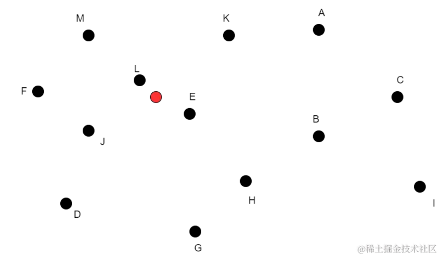 

一种简单做法是把黑色中的某些点和点连起来，构建一个查找图，存下来。与点直接相连的点叫做这个点的邻居节点。

查找的时候随机从某个黑色的点（起始遍历节点：entry point）出发，计算这个点和目标点的距离，然后再计算这个点的邻居节点和目标点的距离，选择距离目标节点距离最近的节点继续迭代。如果当前处理的黑色节点比所有邻居节点距离目标节点都近，则当前黑色节点就是距离最近的节点。

我们举个例子。假设我们对上面的这些黑色节点构建了如下的图。entry point节点是I，要寻找距离红色节点最近的节点。

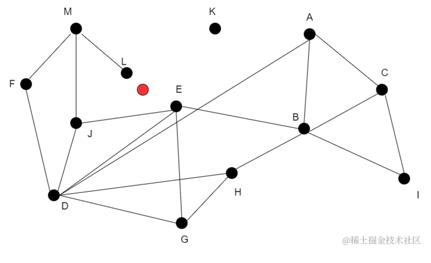 

查找算法执行如下：

先计算I和红色节点的距离，记录下来，再计算下I的邻居节点[B, C]和红色节点的距离，对比三个距离哪个最近，发现B最近，把B点距离红色节点的距离保存下来，继续处理B的邻居节点[A, C, I, H, E]和红色节点的距离，发现E点最近，则把E点和红色节点的距离保存下来，在继续计算E点的邻居节点[J, B, G, D]和红色节点的距离，此时我们发现E点的距离是最近的，则返回最近的点E。

从上面的例子我们可以发现，这种思路虽然行得通，但是存在一些问题：

1. 找到的结果不是最优的结果，最优的应该是L。
2. 如果是要返回最近的两个节点，而L和E之间没有连线，这将增加迭代次数，并且大大影响效率
3. K点是个孤岛，如果随机初始的节点不是K点则它永远无法访问到，而K作为初始节点，则无法遍历其他节点，只能返回K，误差较大。
4. 如何确定哪些节点应该互为邻居呢？

对于上面的这些 问题，粗暴并且直观的解决方案可以是：

- 距离近到一定程度的节点必须互为邻居节点（解决问题2,4，降低1出现的概率）
- 所有的节点必须都有邻居节点（解决问题3）

上面直观的解决方案是否有更严谨，可实现的描述？

## NSW（Navigable Small World graphs）

### 德劳内算法

在图论中有一个剖分法可以有效解决上一节提到的那些问题，**德劳内（Delaunay）三角剖分算法**。这个算法对一批空间中的节点处理之后可以达到以下效果：

- 图中的每个节点都有邻居节点
- 距离相近的节点都互为邻居节点
- 图中的所有连接线段数量最少（邻居对最少）

实际的效果图如下：

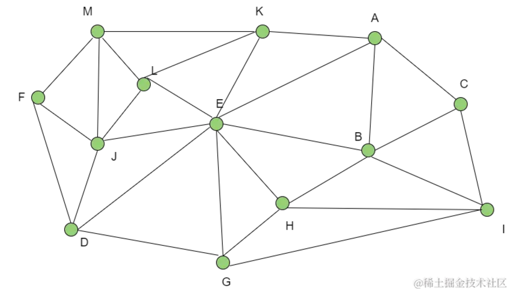 

但是德劳内三角剖分法有两个缺点：

1. 图的构建时间复杂度太高
2. 查找效率比较低：如果起始点和目标点之间的距离比较远，需要大量的迭代才能找到目标。

由于以上的两个缺点，在NSW中并没有直接使用德劳内三角剖分法。为了解决德劳内存在的问题，NSW做了两个改进：

1. NSW使用的是局部的信息来构建图，降低了构建的复杂度。（后面会介绍构建的步骤）
2. 使用局部信息构建图会产生一些“高速公路”，如下图中红色的线所示。使得相邻较远的节点也有互为邻居的概率，从而提升迭代效率。比如从下图的entry point开始查找距离绿色节点，通过红色箭头的线路可以很快找到。

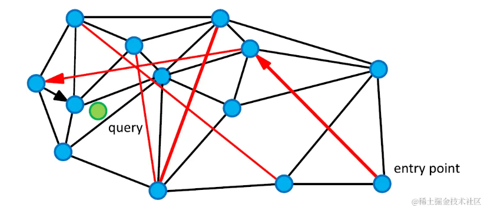 

### NSW构建算法描述

NSW的构建算法非常简单，遍历所有待插入的节点，当新增一个节点时，从当前图中任意节点出发，寻找距离要新增节点的最近m个节点作为邻居节点，把新节点加入图中，并连接新节点和所有的邻居节点。

### NSW构建例子

文字描述有点苍白，我们看个例子，节点的处理顺序为字母顺序，我们规定最多只查询3个邻居：

- **黑色节点**表示待插入的节点
- **红色节点**表示当前处理的节点
- **绿色节点**和**实线**表示已经构建好的图
- **虚线**表示当前处理节点和邻居节点的连线
- **红色连线**表示“高速公路”

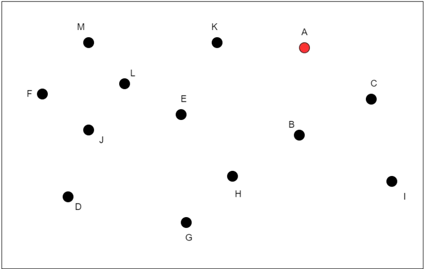 

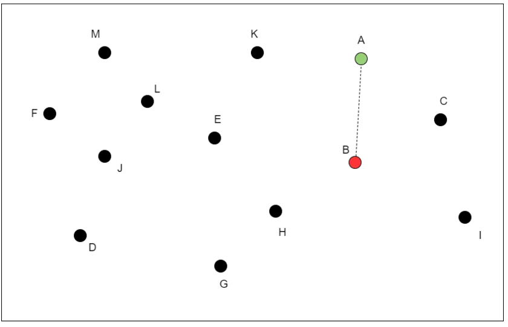 

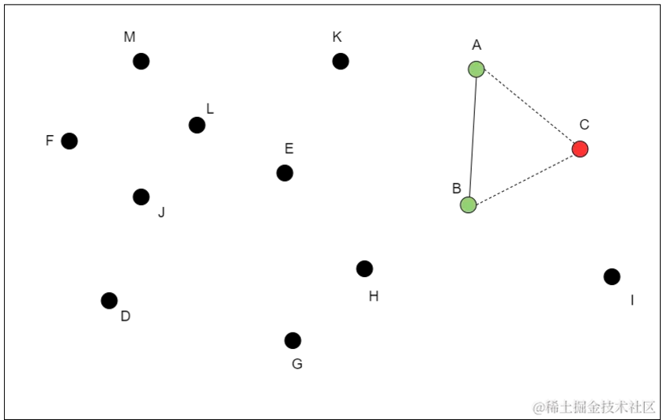 

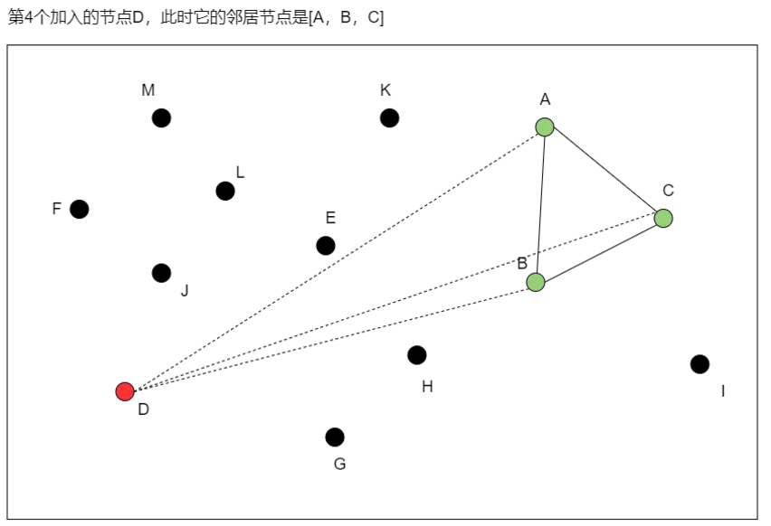 

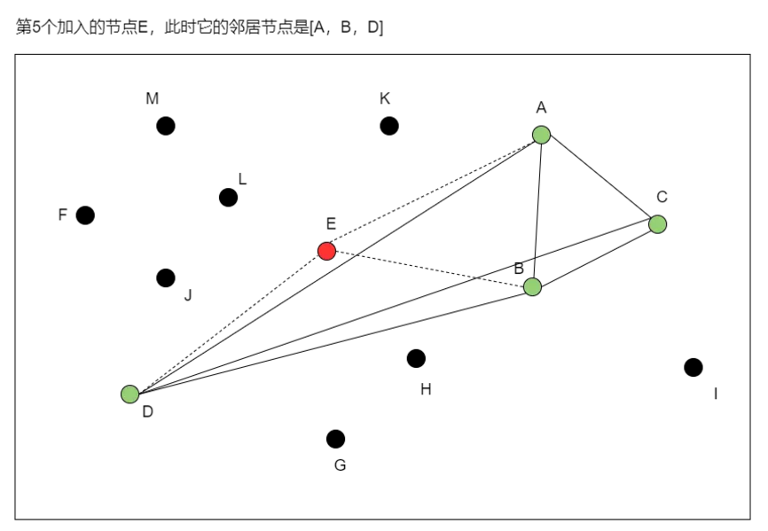 

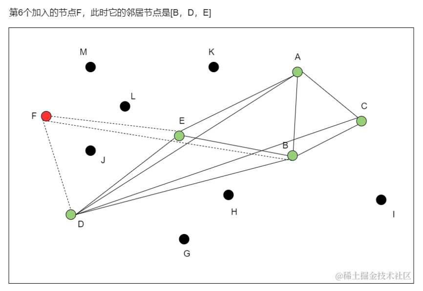 

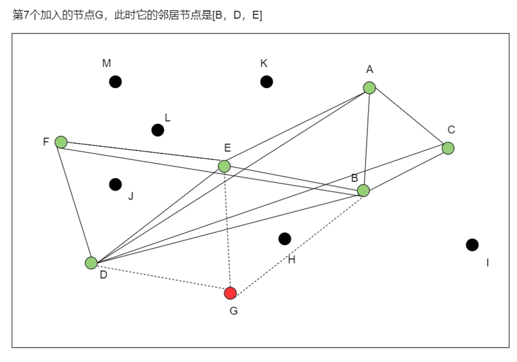 

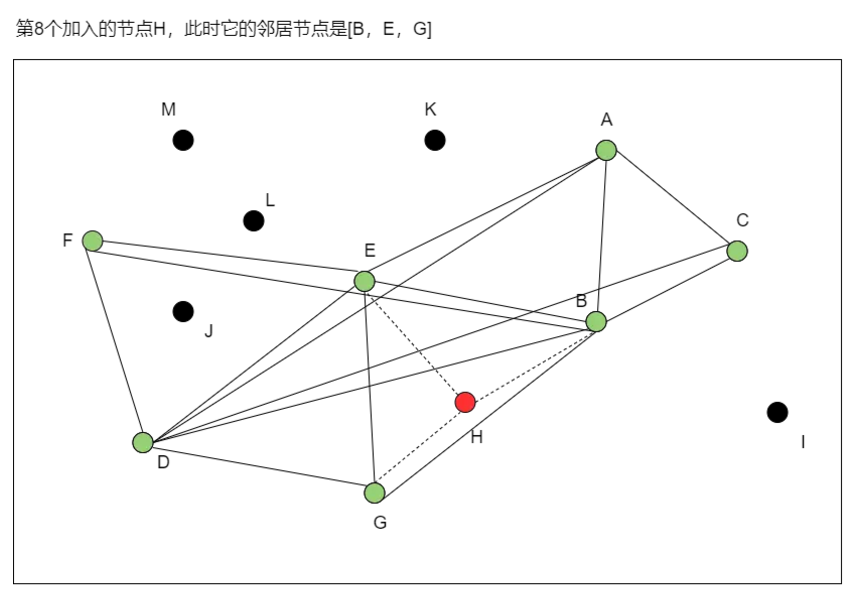 

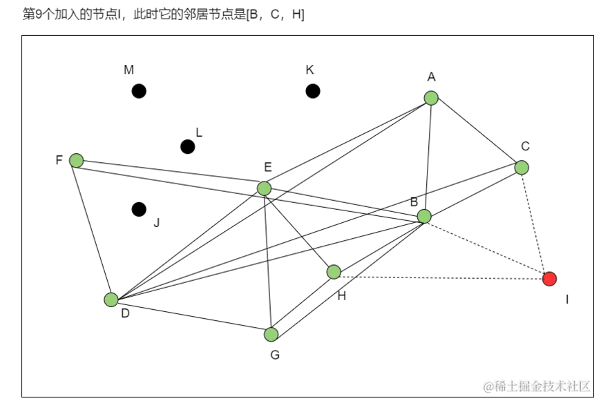 

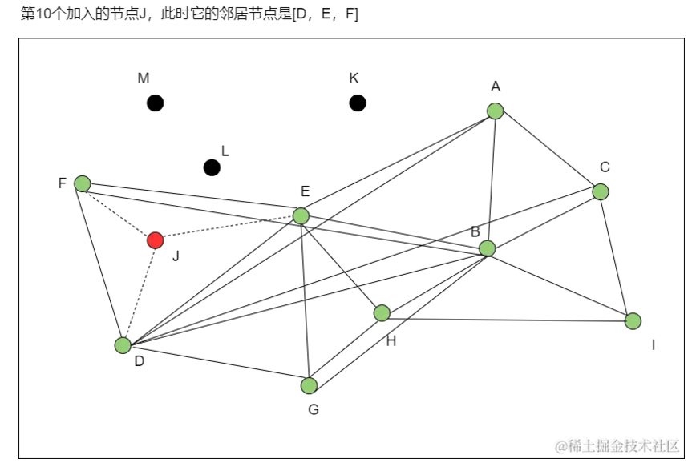 

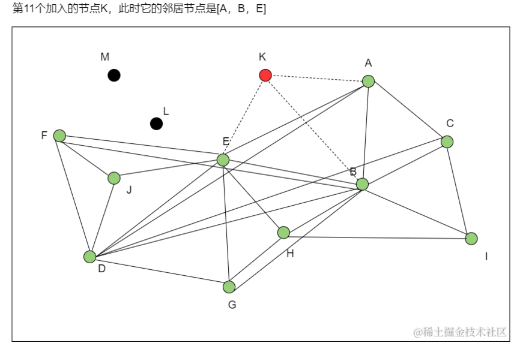 

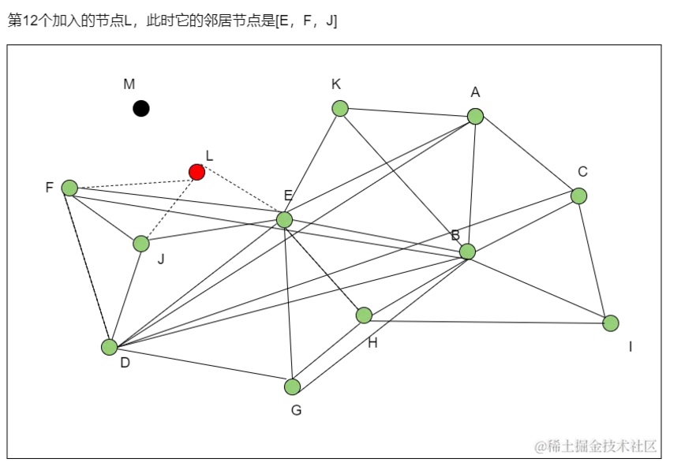 

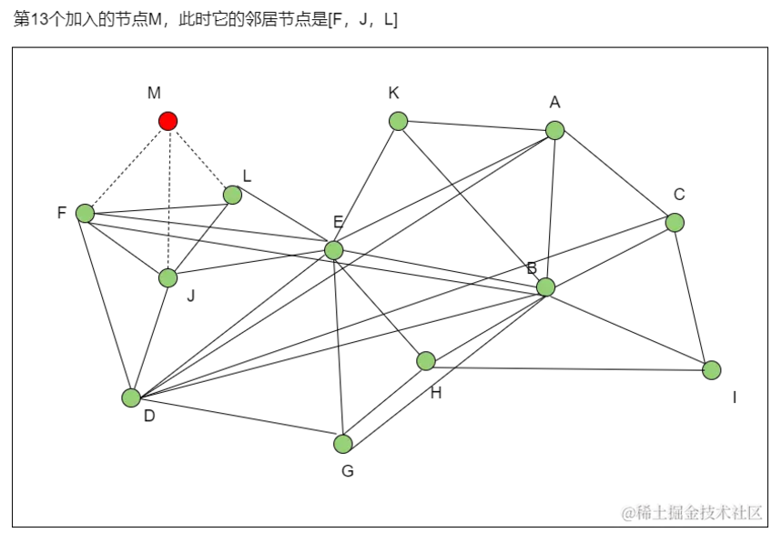 

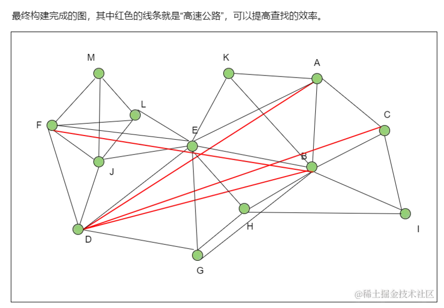 

### 德劳内和NSW构建结果对比

我们对比下德劳内构建的结果：

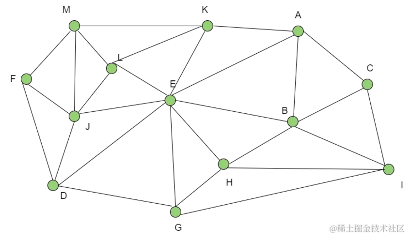 

如果从I开始查找F附近的节点，则德劳内构建的图需要多次迭代，但是NSW通过高速公路可以快速找到。

### 大白话理解NSW

我们从感性上重新理解下NSW的算法，NSW构建的过程中，节点加入是随机的，为当前加入的节点寻找邻居都是使用局部信息，所以前期加入的节点寻找到的邻居有比较高的概率不是最近的，可能是全局来看比较远的节点互为邻居，这就是“高速公路”。而且新增节点都是无脑查询最近的邻居，算法复杂度比较低。

### NSW的查找算法

NSW的查找算法主要是在构建好的NSW图中查找指定的目标节点q的k个近邻点。

NSW的查找算法依赖两个堆和一个位图，用来优化查询速度：

- visited：已经查找过的节点位图
- candidates：候选节点的最小堆，堆顶节点是距离目标节点最近的候选节点
- results：当前结果节点的最大堆，堆顶节点是距离目标节点最远的节点

算法步骤：

1. 建立最大堆results，建立最小堆candidates，建立位图visited
2. 随机选择一个节点作为查找的起点，加入visited，并计算到目标节点的距离，加入candidates
3. 从candidates中获取堆顶的候选节点（candidates中距离目标节点最近的节点）
4. 如果当前候选节点到目标距离大于results的堆顶节点（results中距离目标节点最远的节点）到目标节点的距离并且results的大小已经满足topK，则结束迭代。
5. 否则，遍历候选节点的所有邻居，如果邻居节点没有在visited中，则把邻居节点加入candidates和visited中。
6. 返回3

在论文中会对3-5部加个迭代限制的参数m，也就是最多执行m轮查找，这样可以兼顾到查找的时延和准确度的权衡。另外，整个查询步骤和论文中的伪代码描述有点差别，有兴趣的可以去参考资料中看下论文的原文描述。

NSW已经是一个比较优秀的近邻查找算法了，但是大佬们肯定不会满足于此，于是就有了HNSW。

> 参考：https://blog.csdn.net/u013630299/article/details/100893392
>
> 对于查询来说，这里有三个点集合：candidates、visitedset、results 。其中candidates为当前要考察的点集合，visitedset为已经访问过的点集合，results为当前距离查询点最近的点集合；前两者为变长，最后为定长。
>
> 查询流程如下：
>
> 随机选择一个点作为查询起始点entry_point，把该点加入candidates中，同时加入visitedset
> 遍历candidates，从candidates中选择距离查询点最近的点c，和results中距离查询点最远的点d进行比较，如果c和查询点q的距离大于d和查询点q的距离，则结束查询，说明当前图中所有距离查询点最近的点已经都找到了，或者candidates为空
> 从candidates中删除点c
> 查询c的所有邻居e，如果e已经在visitedset中存在则跳过，不存在则加入visitedset
> 把比d和q距离更近的e加入candidates、results中，如果results未满，则把所有的e都加入candidates、results。如果results已满，则弹出和q距离最远的点
> 循环2-5     
>

## HNSW（Hierarchcal Navigable Small World graphs）

在介绍HNSW和NSW的关系之前，我们可以先对比下有序链表和跳表的关系。

### 有序链表和跳表

我们看下对于同一批数据，有序链表和跳表的结构和查询效率。

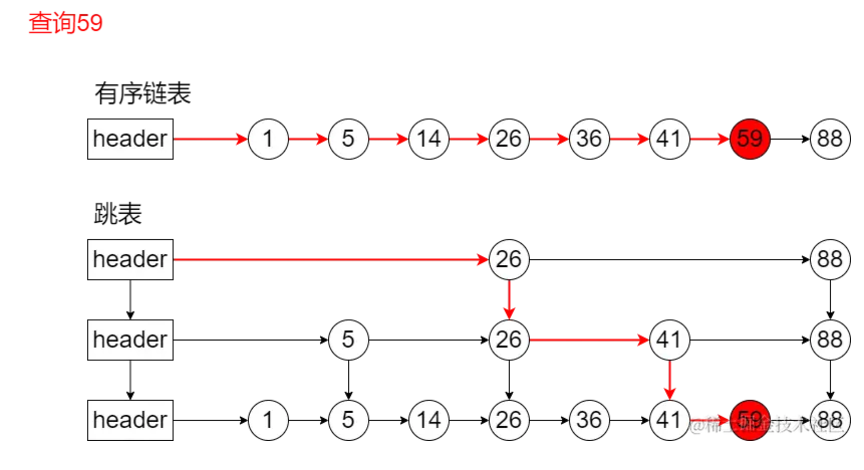 

如上图所示，跳表是由多个有序链表组成的，最底层的有序链表包含了所有的节点。跳表的构建有很多种优化版本，但是最朴素的构建方法非常简单粗暴。从最底层开始遍历每个节点，对每个节点抛硬币，如果正面则进入上一层的有序链表，如此处理每一层的数据。

对于要查找的目标，有序链表只能通过header，从头遍历，直到找到目标或者找到大于目标的最小节点（找不到的情况），然后停止查找。而对于跳表来说它从上往下找，在每一层中找到第一个小于等于目标节点的节点，然后往后或者往下继续查找，停止条件和有序链表一样。

文字描述还是比较枯燥，我们看图中的例子，比如我们的目标节点是59。有序链表就是从头往后找，需要查找7次。而跳表从上往下找，需要5次就找到了目标。可能在这个例子中跳表的效率不明显，但是可以想象成千上百万的节点场景跳表的效率。所以，跳表通过增加层数，以空间换时间，提高了查找的效率。

跳表的上层有序链表之间的节点跨度比较大，就像NSW中的“高速通道”，同样提高了查找的效率。HNSW就是在NSW的基础上提出分层的概念，进一步提高了查找的效率。

### HNSW结构

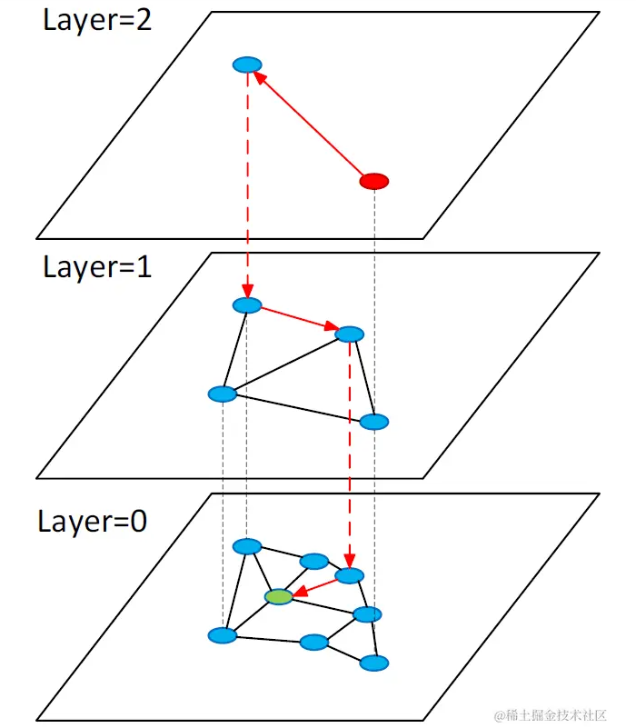  

上面这个图是HNSW论文中的图，第0层是包含了所有的节点。在第i层中的节点，在所有j <= i 层中都存在。每一层可以理解成都是一个NSW（构建算法有所不同，后面会介绍）。

### HNSW查找算法

比如我们要从红色节点开始查找绿色节点。则在最顶层查找红色节点的最近节点，然后以该最近节点进入下一层继续寻找最近的节点，直到最底层中找到的最近节点就是目标。

HNSW中每一层的查找算法和NSW的一模一样。

### HNSW构建算法

HNSW的构建依赖一个随机函数，这个函数产生一个随机值，表示当前处理节点可以到达的层数。然后在每一层为当前处理节点寻找邻居节点，做连线，每一层的构建算法和NSW整体步骤是一样的，差别在于HNSW对于邻居的选取除了直接寻找最近邻外，提出了另一种启发式的选择算法。

#### 启发式邻居选择算法

一句话描述就是对于节点q启发式寻找邻居，找的是邻居候选列表中c，满足c到q的距离比c到当前已经确定的邻居集合中的左右邻居都要近。

乍一看可能有点绕，看个示例图：

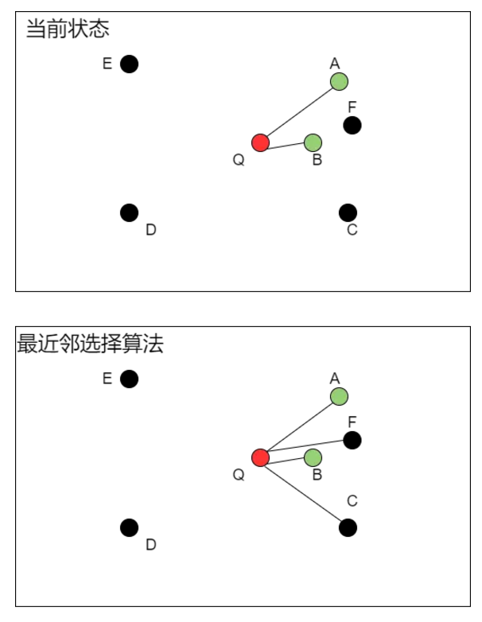 

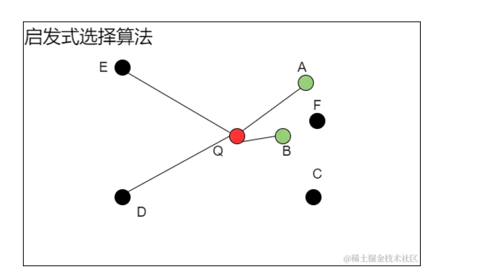 

如上图所示，要为红色节点Q从邻居候选列表（A，B，C，D，E，F，G）中选择四个邻居。当前已经确定的邻居有A和B。

最近邻选择算法会继续选择C和F，而启发式选择算法会继续选择D和E。

从结果来看，最近邻的邻居选择算法选择的邻居集合是比较聚集的，而启发式选择算法选择的邻居是比较发散的，因此启发式算法可以快速查找位于各个方向的目标节点。比如目标节点位于E点附近，最近邻的邻居选择算法就会通过更多的迭代才能找到，而启发式算法可以快速定位。

## lucene的HNSW实现

注：本次的lucene版本为9.1.0.

https://juejin.cn/post/7082580555337826317#heading-19

### 添加向量数据

### HNSW工具类

### HNSW查找

### HNSW构建

### 小结

论文中，启发式邻居选择算法如果没有找到足够的邻居，则会按照最近邻补足邻居个数，而lucene中没有做补足操作。数据删除导致的搜索问题

因为lucene的删除是标记删除，目前的实现是把存活的白名单传给检索接口，在检索的过程中直接过滤。直接考虑最极端的情况，某一层的entry point的邻居都被删除了，则无法找到目标的最近邻。部分删除也会影响召回。有人说是否可以用merge清理删除的数据，但是HNSW的merge操作就是由多个段的数据重新构建，相当耗时。另一种做法是检索完之后再做过滤，这样不会影响召回，但是过滤之后可能会不满足topK。不知道是否还有更优的解决方案？

## 总结