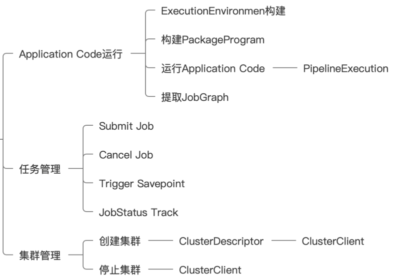
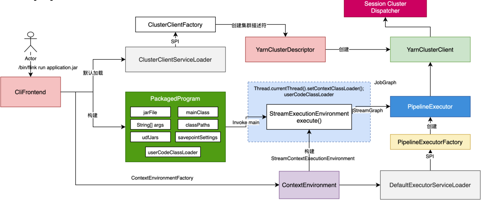
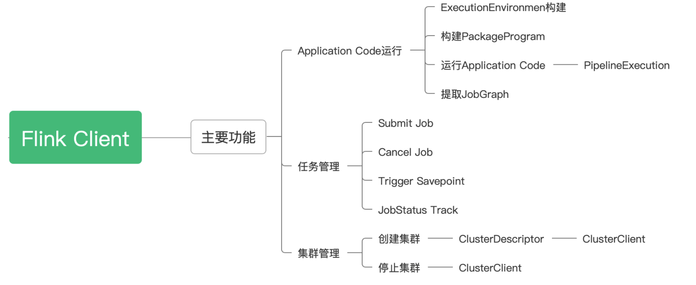
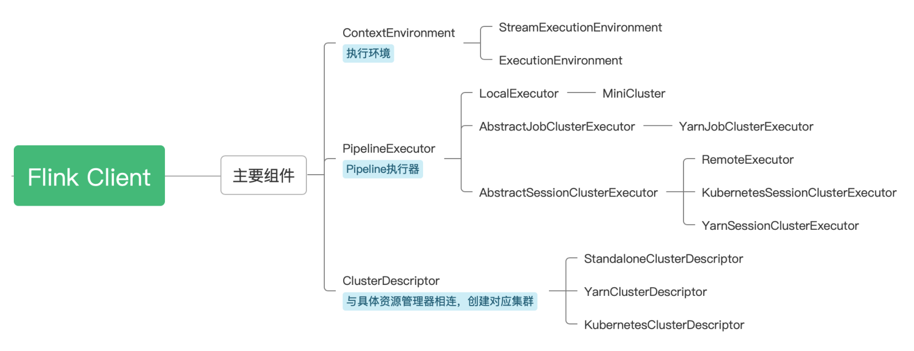
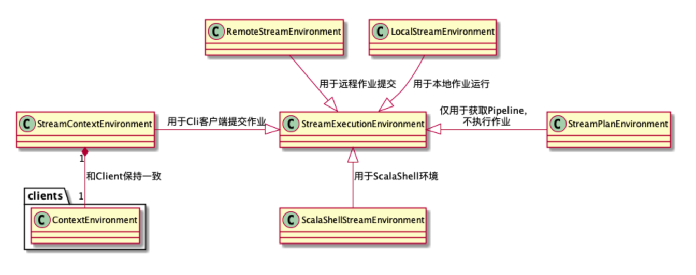

## 1. 概述
### 1.1. 概述   
flink整体架构包括三大部分：  
* ApplicationMaster
* TaskManager
* Client   

    
说明： 
* standalone不依赖外部资源管理器，执行命令start-cluster.sh，启动application master
* **yarn-session，需要提前yarn-session.sh借助yarn来启动application master**
* yarn-per-job，直接提交job./ bin/flink run -m yarn-cluster，借助yarn来启动该job的application master    

### 1.2. 运行模式   
* Session模式
  * Runtime集群组件共享·
  * 资源复用
  * Runtime中有多个JobManager. 
* Per-Job模式
  * Runtime集群组件仅为单个Job服务·
  * 资源相对独立
  * 不支持提交JobGraph  


### 1.3. yarn-seesion架构示例
以下是一个yarn-seesion的启动的flink整体运行图：  
      

* Dispatcher
  * 集群Job的调度分发
  * 根据JobGraph启动JobManager (JobMaster). 
* ResourceManager
  * 集群层面资源管理
  * 适配不同的资源管理，eg Yarn,Kubernetes等
  * 核心组件:SlotManager
* TaskManager
  * Slot计算资源提供者
* JobManager
  * 负责管理具体的Job
  * Scheduler
    * 调度和执行该Job的所有Task
    * 发出Slots资源请求


## 2. 客户端原理  
  
如上图所示，客户端的功能主要三大块：  
* 任务管理
* application code运行
* 集群管理


### 2.1. flink集群启动  
&emsp;&emsp;我们知道flink集群需要启动application master，不管是session模式还是per-job模式。这里我们以yarn-session模式举例：
* 执行yarn-session.sh命令，用来启动application master  
  该命令的具体如下，会传入org.apache.flink.yarn.cli.FlinkYarnSessionCli
  ```
  $JAVA_RUN $JVM_ARGS -classpath "$CC_CLASSPATH" $log_setting org.apache.flink.yarn.cli.FlinkYarnSessionCli -j "$FLINK_LIB_DIR"/flink-dist*.jar "$@"
  ```

  其代码如下：org.apache.flink.yarn.cli.FlinkYarnSessionCli#main  

  ```
    public static void main(final String[] args) {
        final String configurationDirectory = CliFrontend.getConfigurationDirectoryFromEnv();
  
        final Configuration flinkConfiguration = GlobalConfiguration.loadConfiguration();
  
        int retCode;
  
        try {
            final FlinkYarnSessionCli cli =
                    new FlinkYarnSessionCli(
                            flinkConfiguration,
                            configurationDirectory,
                            "",
                            ""); // no prefix for the YARN session
  
            SecurityUtils.install(new SecurityConfiguration(flinkConfiguration));
  
            retCode = SecurityUtils.getInstalledContext().runSecured(() -> cli.run(args));
        } catch (CliArgsException e) {
            retCode = handleCliArgsException(e, LOG);
        } catch (Throwable t) {
            final Throwable strippedThrowable =
                    ExceptionUtils.stripException(t, UndeclaredThrowableException.class);
            retCode = handleError(strippedThrowable, LOG);
        }
  
        System.exit(retCode);
    }
  ```
  


* 获取yarn对应的ClusterClientFactory  
  yarn会获取YarnClusterClientFactory。ClusterClientServiceLoader根据configuration和spi机制获取对应的ClusterClientFactory

    ```
      public <ClusterID> ClusterClientFactory<ClusterID> getClusterClientFactory(
              final Configuration configuration) {
          checkNotNull(configuration);
  
          final ServiceLoader<ClusterClientFactory> loader =
                  ServiceLoader.load(ClusterClientFactory.class);
  
          final List<ClusterClientFactory> compatibleFactories = new ArrayList<>();
          final Iterator<ClusterClientFactory> factories = loader.iterator();
          while (factories.hasNext()) {
              try {
                  final ClusterClientFactory factory = factories.next();
                  if (factory != null && factory.isCompatibleWith(configuration)) {
                      compatibleFactories.add(factory);
                  }
              } catch (Throwable e) {
                  if (e.getCause() instanceof NoClassDefFoundError) {
                      LOG.info("Could not load factory due to missing dependencies.");
                  } else {
                      throw e;
                  }
              }
          }
    ```

* YarnClusterDescriptor的创建  
  YarnClusterClientFactory会创建yarnClient(这个是hadoop的)，然后用YarnClusterDescriptor包装一下
  ```
  private YarnClusterDescriptor getClusterDescriptor(Configuration configuration) {
        final YarnClient yarnClient = YarnClient.createYarnClient();
        final YarnConfiguration yarnConfiguration =
                Utils.getYarnAndHadoopConfiguration(configuration);
  
        yarnClient.init(yarnConfiguration);
        yarnClient.start();
  
        return new YarnClusterDescriptor(
                configuration,
                yarnConfiguration,
                yarnClient,
                YarnClientYarnClusterInformationRetriever.create(yarnClient),
                false);
    }
  ```

* 创建ClusterClientProvider并部署session集群  
  获取ClusterClient，clusterClientProvider.getClusterClient()
  
  ```
  final ClusterSpecification clusterSpecification =
                          yarnClusterClientFactory.getClusterSpecification(
                                  effectiveConfiguration);
  
                  clusterClientProvider =
                          yarnClusterDescriptor.deploySessionCluster(clusterSpecification);
                  ClusterClient<ApplicationId> clusterClient =
                          clusterClientProvider.getClusterClient();
  ```
  流程图如下：  
  
  
  ```
  public int run(String[] args) throws CliArgsException, FlinkException {
      。。。。。
      
      final Configuration configuration = applyCommandLineOptionsToConfiguration(cmd);
      
      。。。
      //获取对应的ClusterClientFactory，这里是yarnClusterClientFactory
      //通过spi机制获取
      final ClusterClientFactory<ApplicationId> yarnClusterClientFactory =
              clusterClientServiceLoader.getClusterClientFactory(configuration);
      configuration.set(DeploymentOptions.TARGET, YarnDeploymentTarget.SESSION.getName());
  	
  	//创建YarnClusterDescriptor
      final YarnClusterDescriptor yarnClusterDescriptor =
              (YarnClusterDescriptor)
                      yarnClusterClientFactory.createClusterDescriptor(configuration);
  
      try {
          // Query cluster for metrics
          if (cmd.hasOption(query.getOpt())) {
            	.......
              return 0;
          } else {
              final ClusterClientProvider<ApplicationId> clusterClientProvider;
              final ApplicationId yarnApplicationId;
              
              if (cmd.hasOption(applicationId.getOpt())) {
                 ......
              } else {
                  final ClusterSpecification clusterSpecification =
                          yarnClusterClientFactory.getClusterSpecification(configuration);
  
  				//通过yarn部署flink master, 并获得一个provider用于和flink master进行交互
                  clusterClientProvider =
                          yarnClusterDescriptor.deploySessionCluster(clusterSpecification);
                          
                  //通过上一步获取的provider获取yarnclient
                  ClusterClient<ApplicationId> clusterClient =
                          clusterClientProvider.getClusterClient();
  
  				//后面的通过将连接信息写入保存
                  // ------------------ ClusterClient deployed, handle connection details
                  yarnApplicationId = clusterClient.getClusterId();
  
                  try {
                    。。。。。。。
  
                      writeYarnPropertiesFile(yarnApplicationId, dynamicPropertiesEncoded);
                  } catch (Exception e) {
                     。。。。。。。
                  }
              }
  
              if (!configuration.getBoolean(DeploymentOptions.ATTACHED)) {
                  YarnClusterDescriptor.logDetachedClusterInformation(yarnApplicationId, LOG);
              } else {
                 。。。。。。。。
                  }
              }
          }
      } finally {
          try {
              yarnClusterDescriptor.close();
          } catch (Exception e) {
              LOG.info("Could not properly close the yarn cluster descriptor.", e);
          }
      }
  
      return 0;
  }
  ```

### 2.2. application code运行  

整体的流程如下：

 

* 提交任务  
  ```
  exec $JAVA_RUN $JVM_ARGS $FLINK_ENV_JAVA_OPTS "${log_setting[@]}" -classpath "`manglePathList "$CC_CLASSPATH:$INTERNAL_HADOOP_CLASSPATHS"`" org.apache.flink.client.cli.CliFrontend "$@"
  ```
  
* CliFrontend初始化一个默认的clusterClientServiceLoader
  
  ```
  public CliFrontend(
          Configuration configuration,
          ClusterClientServiceLoader clusterClientServiceLoader,
          List<CustomCommandLine> customCommandLines) {
      this.configuration = checkNotNull(configuration);
      this.customCommandLines = checkNotNull(customCommandLines);
      this.clusterClientServiceLoader = checkNotNull(clusterClientServiceLoader);
  
      FileSystem.initialize(
              configuration, PluginUtils.createPluginManagerFromRootFolder(configuration));
  
      this.customCommandLineOptions = new Options();
  
      for (CustomCommandLine customCommandLine : customCommandLines) {
          customCommandLine.addGeneralOptions(customCommandLineOptions);
          customCommandLine.addRunOptions(customCommandLineOptions);
      }
  
      this.clientTimeout = configuration.get(ClientOptions.CLIENT_TIMEOUT);
      this.defaultParallelism = configuration.getInteger(CoreOptions.DEFAULT_PARALLELISM);
  }
  ```
  
* CliFrontend的main方法会执行parseParameters，最后执行执行run，可以支持多种模式
  
  ```
        // do action
            switch (action) {
                case ACTION_RUN:
                    run(params);
                    return 0;
                case ACTION_RUN_APPLICATION:
                    runApplication(params);
                    return 0;
                case ACTION_LIST:
                    list(params);
                    return 0;
                case ACTION_INFO:
                    info(params);
                    return 0;
                case ACTION_CANCEL:
  ```
  
* PackagedProgram封装  
  将配置，args参数、jar包封装到PackagedProgram之中  
  
  ```
    PackagedProgram buildProgram(final ProgramOptions runOptions)
              throws FileNotFoundException, ProgramInvocationException, CliArgsException {
          runOptions.validate();
  
          String[] programArgs = runOptions.getProgramArgs();
          String jarFilePath = runOptions.getJarFilePath();
          List<URL> classpaths = runOptions.getClasspaths();
  
          // Get assembler class
          String entryPointClass = runOptions.getEntryPointClassName();
          File jarFile = jarFilePath != null ? getJarFile(jarFilePath) : null;
  
          return PackagedProgram.newBuilder()
                  .setJarFile(jarFile)
                  .setUserClassPaths(classpaths)
                  .setEntryPointClassName(entryPointClass)
                  .setConfiguration(configuration)
                  .setSavepointRestoreSettings(runOptions.getSavepointRestoreSettings())
                  .setArguments(programArgs)
                  .build();
      }
  ```
  
* executeProgram，这里new 了一个默认的PipelineExecutorServiceLoader
  
  构建StreamExecutionEnvironmentFactory  
  具体调用里链为：CliFrontend.run -> CliFrontend.executeProgram -> ClientUtils.executeProgram ->  StreamContextEnvironment.setAsContext
  
  ```
  public static void executeProgram(
        .........
          throws ProgramInvocationException {
      checkNotNull(executorServiceLoader);
      //获取用户的类加载器
      final ClassLoader userCodeClassLoader = program.getUserCodeClassLoader();
      //获取当前线程的类加载器
      final ClassLoader contextClassLoader = Thread.currentThread().getContextClassLoader();
      try {
      	//将当前的线程的类加载器设置为用户的。
          Thread.currentThread().setContextClassLoader(userCodeClassLoader);
  
     	    。。。。。。
  		
  		//内部创建StreamExecutionEnvironmentFactory匿名工厂放入到threadlocal之中。
          ContextEnvironment.setAsContext(
                  executorServiceLoader,
                  configuration,
                  userCodeClassLoader,
                  enforceSingleJobExecution,
                  suppressSysout);
  
          StreamContextEnvironment.setAsContext(
                  executorServiceLoader,
                  configuration,
                  userCodeClassLoader,
                  enforceSingleJobExecution,
                  suppressSysout);
  
          try {
              program.invokeInteractiveModeForExecution();
          } finally {
              ContextEnvironment.unsetAsContext();
              StreamContextEnvironment.unsetAsContext();
          }
      } finally {
          Thread.currentThread().setContextClassLoader(contextClassLoader);
      }
  }
  ```
  
  
  
  ```
        public static void setAsContext(
            final PipelineExecutorServiceLoader executorServiceLoader,
            final Configuration configuration,
            final ClassLoader userCodeClassLoader,
            final boolean enforceSingleJobExecution,
            final boolean suppressSysout) {
        StreamExecutionEnvironmentFactory factory = //匿名创建StreamExecutionEnvironmentFactory类
                conf -> {
                    Configuration mergedConfiguration = new Configuration();
                    mergedConfiguration.addAll(configuration);
                    mergedConfiguration.addAll(conf);
                    return new StreamContextEnvironment(
                            executorServiceLoader,
                            mergedConfiguration,
                            userCodeClassLoader,
                            enforceSingleJobExecution,
                            suppressSysout);
                };
        initializeContextEnvironment(factory);
    }
  ```
  initializeContextEnvironment会将factory放入到StreamExecutionEnvironment静态变量之中
  
* 执行应用main方法  
  ```
  public void invokeInteractiveModeForExecution() throws ProgramInvocationException {
      FlinkSecurityManager.monitorUserSystemExitForCurrentThread();
      try {
          callMainMethod(mainClass, args);
      } finally {
          FlinkSecurityManager.unmonitorUserSystemExitForCurrentThread();
      }
  }
  ```
  
* StreamExecutionEnvironment实例化 
  我们编写的应用会编写如下的代码：
  
  ```
   StreamExecutionEnvironment env = StreamExecutionEnvironment.getExecutionEnvironment();
    env.execute("Service-Report-Job");
  ```
  * StreamExecutionEnvironment.getExecutionEnvironment()会获取到之前的factory创建StreamExecutionEnvironment实例  
  * StreamExecutionEnvironment调用execute来创建jobgraph
  
* DefaultExecutorServiceLoader创建PipelineExecutorFactory  
  通过spi获取对应的PipelineExecutorFactory（yarn、session等）,配置如果是yarn-session则创建对应的factory
  ```
    public JobClient executeAsync(StreamGraph streamGraph) throws Exception {
        checkNotNull(streamGraph, "StreamGraph cannot be null.");
        checkNotNull(
                configuration.get(DeploymentOptions.TARGET),
                "No execution.target specified in your configuration file.");
  
        final PipelineExecutorFactory executorFactory =
                executorServiceLoader.getExecutorFactory(configuration);
  ```
  
* 创建PipelineExecutor  
  ```
      CompletableFuture<JobClient> jobClientFuture =
                executorFactory
                        .getExecutor(configuration)
                        .execute(streamGraph, configuration, userClassloader);
  ```

* PipelineExecutor执行execute
  * 生成job graph
    ```
     JobGraph jobGraph = PipelineExecutorUtils.getJobGraph(pipeline, configuration);
    ```
  * 如果是session模式,根据clusterID拿到clusterClientFactory获取到ClusterClient，将jobGraph提交出去
    ```
       public CompletableFuture<JobClient> execute(
            @Nonnull final Pipeline pipeline,
            @Nonnull final Configuration configuration,
            @Nonnull final ClassLoader userCodeClassloader)
            throws Exception {
        final JobGraph jobGraph = PipelineExecutorUtils.getJobGraph(pipeline, configuration);
    
        try (final ClusterDescriptor<ClusterID> clusterDescriptor =
                clusterClientFactory.createClusterDescriptor(configuration)) {
            final ClusterID clusterID = clusterClientFactory.getClusterId(configuration);
            checkState(clusterID != null);
    
            final ClusterClientProvider<ClusterID> clusterClientProvider =
                    clusterDescriptor.retrieve(clusterID);
            ClusterClient<ClusterID> clusterClient = clusterClientProvider.getClusterClient();
            return clusterClient
                    .submitJob(jobGraph)
                    .thenApplyAsync(
                            FunctionUtils.uncheckedFunction(
                                    jobId -> {
                                        ClientUtils.waitUntilJobInitializationFinished(
                                                () -> clusterClient.getJobStatus(jobId).get(),
                                                () -> clusterClient.requestJobResult(jobId).get(),
                                                userCodeClassloader);
                                        return jobId;
                                    }))
                    .thenApplyAsync(
                            jobID ->
                                    (JobClient)
                                            new ClusterClientJobClientAdapter<>(
                                                    clusterClientProvider,
                                                    jobID,
                                                    userCodeClassloader))
                    .whenCompleteAsync((ignored1, ignored2) -> clusterClient.close());
        }
    }  
    ```


### 2.3. 客户端小结
我们知道我们可以使用client来创建flink集群，会创建对应类型的clusterdescriptor。我们也可以通过client来提交job，贯串提交任务的主要是StreamExecutionEnvironment。
* 客户端的核心功能：  
   
* 客户端主要的组件如：  
  

* ExecutionEnvironment分类  
