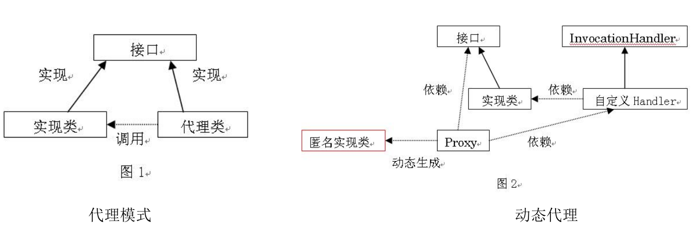
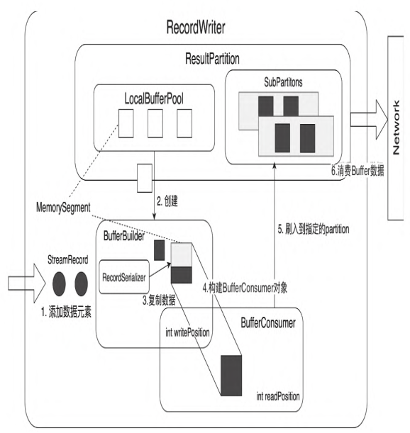
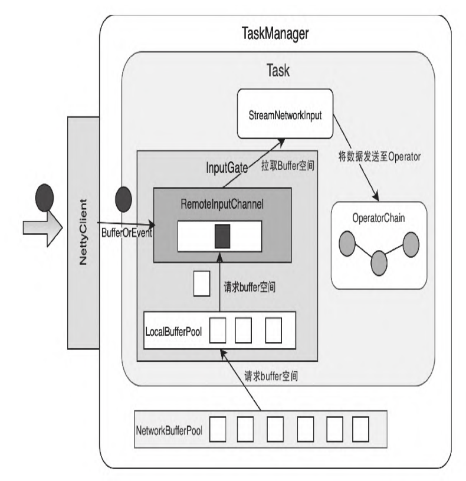
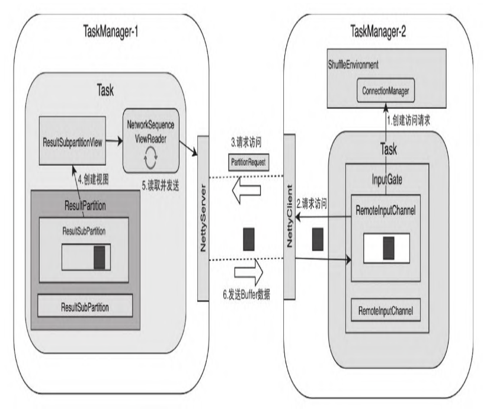
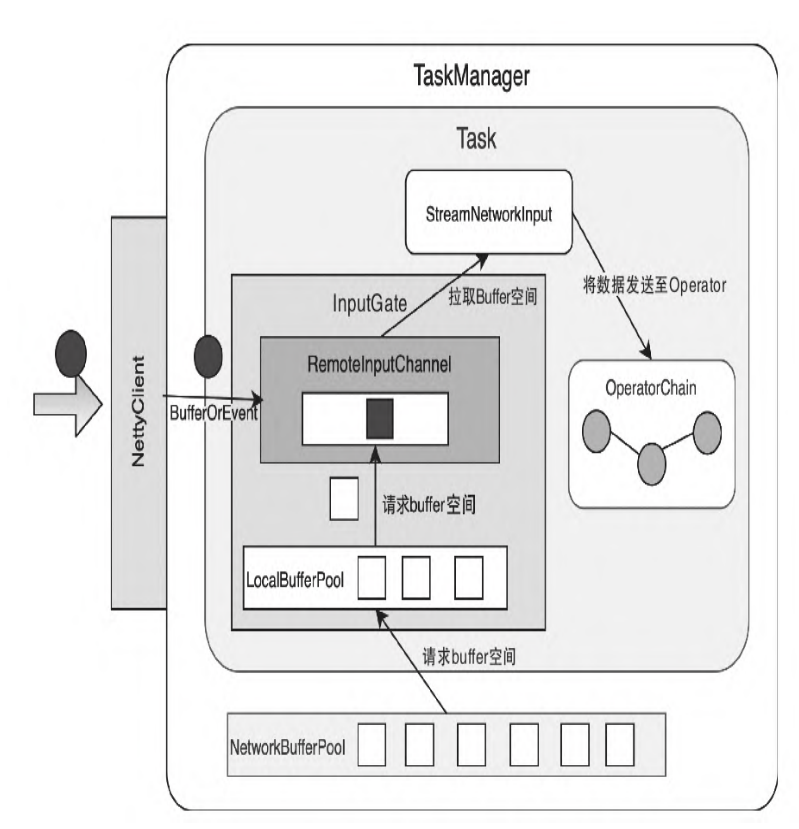
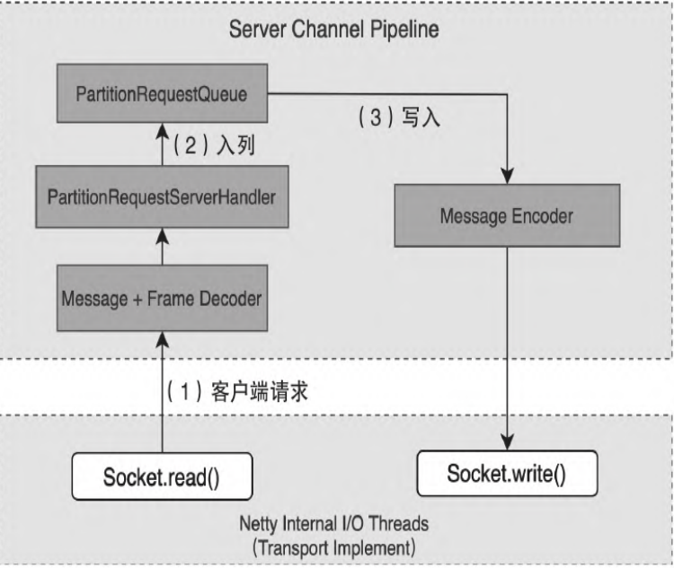
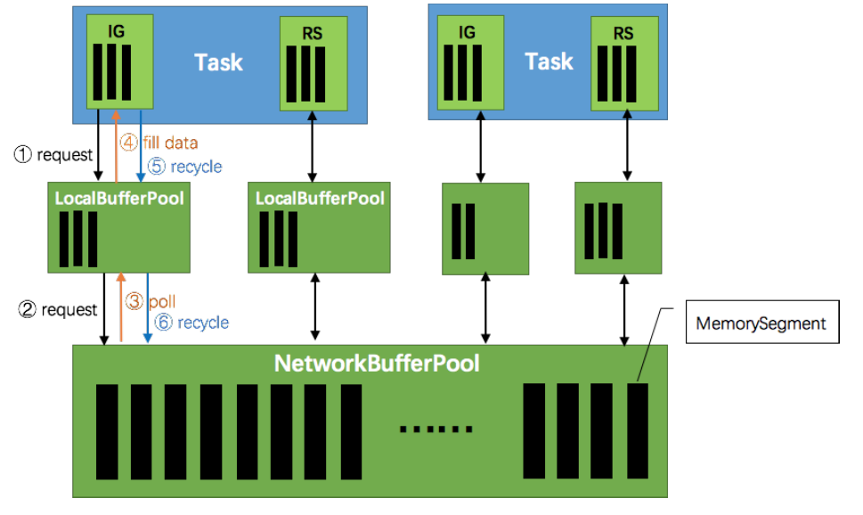

## 1. 开头
flink通信分为组件之间通信和task数据通信。两种方式实现是不同的。
## 2. flink的rpc通信
### 2.1. 整体组件通信架构  

### 2.2. akka通信
    
&emsp;&emsp;flink组件之间通过基于akka的rcp进行通信的。而akka是actor并发模型框架，使用akka进行编程的示例如下：
* 构建ActorSystem
```
ActorSystem system = ActorSystem.create("akka_system");
// ActorSystem system = ActorSystem.create("akka_system", ConfigFactory.load("appsys"));
```
* 构建Actor, 获取该Actor引用
```
// 即ActorRef ActorRef customActor =
system.actorOf(Props.create(CustomActor.class), "customActor");
```

* 给helloActor发送消息
```
helloActor.tell("hello customActor", ActorRef.noSender());
```
* 关闭akka系统框架
```
ActorSystem system.terminate();
```

### 2.3. fink的rpc架构  
    

**RpcEndpoint中创建和启动RpcServer主要是基于集群中的**
**RpcService实现，RpcService的主要实现是AkkaRpcService。**
**从图中可以看出，AkkaRpcService将Akka中的ActorSystem进行封装，通过**
**AkkaRpcService可以创建RpcEndpoint中的RpcServer，同时基于**
**AkkaRpcService提供的connect()方法与远程RpcServer建立RPC连接，**
**提供远程进程调用的能力。**

#### 2.3.1. rpc的基本原理  
  

#### 2.3.2. fink的rpc server设计 
  

#### 2.3.3. fink的rpc 涉及的组件

* RpcEndpoint中提供了集群RPC组件的基本实现，所有需要实现RPC服务的组件都会继承RpcEndpoint抽象类。RpcEndpoint中包含了endpointId，用于唯一标记当前的RPC节点。RpcEndpoint借助RpcService启动内部RpcServer，之后通过RpcServer完成本地和远程线程执行
* 对于RpcEndpoint来讲，底层主要有FencedRpcEndpoint基本实现类，FencedRpcEndpoint在RpcEndpoint的基础上增加了
  FencedToken。实现FencedRpcEndpoint的RPC节点都会有自己的FencedToken，当进行远程RPC调用时，会对比访问者分配的FencedToken和被访问者的FencedToken，结果一致才会进行后续操作
* RpcEndpoint的实现类有TaskExecutor组件，FencedRpcEndpoint的实现类有Dispatcher、JobMaster以及ResourceManager等组件。这些组件继承RpcEndpoint后，就能获取RpcEndpoint中提供的全部非私有化方法，例如在TaskExecutor中调用getRpcService().getExecutor()方法，可以获取RpcService中ActorSystem的dispatcher服务，并直接通过dispatcher创建Task线程
  实例。

* RpcService提供了创建和启动RpcServer的方法，在启动RpcServer的过程中，通过RpcEndpoint的地址创建Akka Actor实例，
  并基于Actor实例构建RpcServer接口的动态代理类，向RpcServer的主线程中提交Runnable以及Callable线程等。同时在RpcService中提供了连接远程RpcEndpoint的方法，并创建了相应RpcGateway接口的动态代理类，用于执行远程RPC请求
* RpcServer接口通过AkkaInvocationHandler动态代理类实现，所有远程或本地的执行请求最终都会转换到AkkaInvocationHandler代
  理类中执行。AkkaInvocationHandler实现了MainThreadExecutable接口，提供了runAsync(Runnable runnable)以及
  callAsync(Callable<V> callable, Time callTimeout)等在主线程中执行代码块的功能。例如在TaskExecutor中释放Slot资源时，会调用runAsync()方法将freeSlotInternal()方法提交到TaskExecutor对应的RpcServer中运行，此时就会调用AkkaInvocationHandler在主线程中执行任务。

#### 2.3.4. RpcEndpoint的设计与实现

RpcEndpoint是集群中RPC组件的端点，每个RpcEndpoint都对应一个由endpointId和actorSystem确定的路径，且该路径对应同一个AkkaActor。所有需要实现RPC通信的集群组件都会继承RpcEndpoint抽象类，例如TaskExecutor、Dispatcher以及ResourceManager组件服务，还包括根据JobGraph动态创建和启动的jobMaster服务

RpcEndpoint实现了RpcGateway和
AutoCloseableAsync两个接口，其中RpcGateway提供了动态获取
RpcEndpoint中Akka地址和HostName的方法。因为JobMaster组件在任
务启动时才会获取Akka中ActorSystem分配的地址信息，所以借助
RpcGateway接口提供的方法就能获取Akka相关连接信息。
RpcEndpoint中包含RpcService、RpcServer以及
MainThreadExecutor三个重要的成员变量，其中RpcService是
RpcEndpoint的后台管理服务，RpcServer是RpcEndpoint的内部服务
类，MainThreadExecutor封装了MainThreadExecutable接口，
MainThreadExecutable的主要底层实现是AkkaInvocationHandler代理
类。所有本地和远程的RpcGateway执行请求都会通过动态代理的形式
转换到AkkaInvocationHandler代理类中执行

### 2.4. AkkaRpcService详解

#### 2.4.1. RpcServer创建

RpcService主要包含如下两个重要方法。
1）startServer()：用于启动RpcEndpoint中的RpcServer。
RpcServer实际上就是对Actor进行封装，启动完成后，RpcEndpoint中
的RpcServer就能够对外提供服务了。
2）connect()：用于连接远端RpcEndpoint并返回给调用方
RpcGateway接口的代理类，RPC客户端就能像本地一样调用RpcServer
提供的RpcGateway接口了。例如在JobMaster组件中创建与
ResourceManager组件之间的RPC连接时，会在JobMaster中创建
ResourceManagerGateway的动态代理类，最终转换成
RpcInvocationMessage通过Akka系统发送到ResourceManager节点对应
的RpcServer中执行，这样就使得JobMaster像调用本地方法一样在
ResourceManager中执行请求任务

RpcServer在RpcEndpoint的构造器中完成初始化后，接下来就是
启动RpcEndpoint和RpcServer，这里我们以ResourceManager为例进行
说明。首先在DefaultDispatcherResourceManagerComponentFactory
中调用ResourceManager.start()方法启动ResourceManager实例，此
时在ResourceManager.start()方法中会同步调用RpcServer.start()
方法，启动ResourceManager所在RpcEndpoint中的RpcServer，如图7-
7所示。
ResourceManager组件对应的RpcServer启动过程主要包含如下流
程。
1）调用ResourceManager.start()方法，此时会调用
RpcEndpoint.start()父方法，启动ResourceManager组件的
RpcServer。
2）通过动态代理AkkaInvocationHandler.invoke()方法执行流
程，发现调用的是StartStoppable.start()方法，此时会直接调用
AkkaInvocationHandler.start()本地方法。
3）在AkkaInvocationHandler.start()方法中，实际上会调用
rpcEndpoint.tell(ControlMessages.START, ActorRef.noSender())
方法向ResourceManager对应的Actor发送控制消息，表明当前Actor实
例可以正常启动并接收来自远端的RPC请求。
4）AkkaRpcActor调用handleControlMessage()方法处理
ControlMessages.START控制消息。
5）将AkkaRpcActor中的状态更新为StartedState，此时
ResourceManager的RpcServer启动完成，ResourceManager组件能够接
收来自其他组件的RPC请求。
经过以上步骤，指定组件的RpcEndpoint节点就正常启动，此时
RpcServer会作为独立的线程运行在JobManager或TaskManager进程
中，处理本地和远程提交的RPC请求

#### 2.4.2. RpcServer启动

#### 2.4.3. 创建RpcGateway

​	当AkkaRpcService启动RpcEndpoint中的RpcServer后，
RpcEndpoint组件仅能对外提供处理RPC请求的能力，RpcEndpoint组件
需要在启动后向其他组件注册自己的RpcEndpoint信息，并完成组件之
间的RpcConnection注册，才能相互访问和通信。创建RPC连接需要调
用RpcService.connect()方法

​	在AkkaRpcService.connect()方法中，实际
上调用了connectInternal()方法完成RpcConnection对象的创建。同
时在方法中会使用Lambda表达式定义函数接口的实现，通过给定的
ActorRef引用类创建FencedAkkaInvocationHandler实例。最后方法会
返回FencedRpcGateway接口代理类，此时调用方就能像本地一样调用
远端RpcEndpoint实现的RpcGateway接口

### 2.5. RpcServer动态代理实现

RpcServer中提供的RpcGateway接口方法，最终都会通过
AkkaInvocationHandler.invoke()方法进行代理实现。
AkkaInvocationHandler中根据在本地执行还是远程执行将代理方法进
行区分。通常情况下，RpcEndpoint实现类除了调用指定服务组件的
RpcGateway接口之外，其余的RpcGateway接口基本上都是本地调用和
执行的。
如代码清单7-6所示，本地接口主要有AkkaBasedEndpoint、
RpcGateway、StartStoppable、MainThreadExecutable和RpcServer
等，这些接口方法都是通过AkkaInvocationHandler代理类通过动态代
理的方式实现的。例如ResourceManager组件需要执行定时代码块时，
会调用RpcEndpoint.scheduleRunAsync()方法，最终调用
AkkaInvocationHandler.scheduleRunAsync()方法执行定时线程服
务。
另外一种方法是远程调用，此时会在AkkaInvocationHandler中创
建RpcInvocationMessage，并通过Akka发送RpcInvocationMessage到
指定地址的远端进程中，远端的RpcEndpoint会接收
RpcInvocationMessage并进行反序列化，然后调用底层的动态代理类
实现进程内部的方法调用

### 2.6. AkkaRpcActor的设计与实现

在RpcEndpoint中创建的RemoteRpcInvocation消息，最终会通过
Akka系统传递到被调用方，例如TaskExecutor向ResourceManager发送
SlotReport请求的时候，会在TaskExecutor中将
ResourceManagerGateway的方法名称和参数打包成
RemoteRpcInvocation对象。然后经过网络发送到ResourceManager中
的AkkaRpcActor，在ResourceManager本地执行具体的方法。接下来我
们深入了解AkkaRpcActor的设计与实现，了解在AkkaRpcActor中如何
接收RemoteRpcInvocation消息并执行后续的操作。
如代码清单7-9所示，首先在AkkaRpcActor中创建Receive对象，
用于处理Akka系统接收的其他Actor发送过来的消息。可以看出，在
AkkaRpcActor中主要创建了RemoteHandshakeMessage、
ControlMessages等消息对应的处理器，其中RemoteHandshakeMessage
主要用于进行正式RPC通信之前的网络连接检测，保障RPC通信正常。
ControlMessages用于控制Akka系统，例如启动和停止Akka Actor等控
制消息。这里我们重点关注第三种类型的消息，即在集群运行时中RPC
组件通信使用的Message类型，此时会调用handleMessage()方法对这
类消息进行处理

### 2.7. 集群组件之间的RPC通信

当TaskExecutor启动后，会立即向ResourceManager中注册当前
TaskManager的信息。同样，JobMaster组件启动后也立即会向
ResourceManager注册JobMaster的信息。这些注册操作实际上就是在
构建集群中各个组件之间的RPC连接，这里的注册连接在Flink中被称
为RegisteredRpcConnection，集群组件之间的RPC通信都会通过创建
RegisteredRpcConnection进行，例如获取RpcEndpoint对应的
RpcGateway接口以及维护组件之间的心跳连接等

集群运行时中各组件的注册连接主要通过
RegisteredRpcConnection基本类提供的，且实现子类主要有
JobManagerRegisteredRpcConnection、ResourceManagerConnection
和TaskExecutorToResourceManagerConnection三种。
·JobManagerRegisteredRpcConnection：用于管理TaskManager中与
JobManager之间的RPC连接。
·ResourceManagerConnection：用于管理JobManager中与
ResourceManager之间的RPC连接。
·TaskExecutorToResourceManagerConnection：用于管理
TaskExecutor中与ResourceManager之间的RPC连接

## 3. flink数据网络传输

除了各个组件之间进行RPC通信之外，在Flink集群中TaskManager
和TaskManager节点之间也会发生数据交换，尤其当用户提交的作业涉
及Task实例运行在不同的TaskManager上时。Task实例之间的数据交换
主要借助Flink中的NetworkStack实现。NetworkStack不仅提供了非常
高效的网络I/O，也提供了非常灵活的反压控制

&emsp;&emsp;flink数据传输是基于netty的，task与task之间是通过netty的tcp协议进行传输。  
 

### 3.1. tasks之间的传输
  

经过Operator处理后的数据，最终会通过RecordWriter组件写入网络栈，即算子输出的数据并不是直接写入网络，而是先将数据元素转换为二级制Buffer数据，并将Buffer缓存在ResultSubPartition队列中，再从ResultSubPartition队列将Buffer数据消费后写入下游Task对应的InputChannel。在上游的Task

中会创建LocalBufferPool为数据元素申请对应Buffer的存储空间，且上游的Task会创建NettyServer作为网络连接服务端，并与下游Task内部的NettyClient之间建立网络连接。

对下游的Task实例来讲，会通过InputGate组件接收上游Task发送
的数据，在InputGate中包含了多个InputChannel。InputChannel实际
上是将Netty中Channel进行封装，数量取决于Task的并行度。上游
Task的ResultPartition会根据ChannelSelector选择需要将数据下发
到哪一个InputChannel中，其实现类似Shuffe的数据洗牌操作。在下
游的Task实例中可以看出，InputGate中接收到的二进制数据，会转换
为Buffer数据结构并存储到本地的Buffer队列中，最后被
StreamTaskInput不断地从队列中拉取出来并处理。StreamTaskInput
会将Buffer数据进行反序列化操作，将Buffer数据转换为
StreamRecord并发送到OperatorChain中继续处理

### 3.2. streamtask之间的传输

 

在ExecutionGraph调度和执行
ExecutionVertex节点的过程中，会将OperatorChain提交到同一个
Task实例中运行。如果被调度的作业为流式类型，则
AbstractInvokable的实现类就为StreamTask。最终StreamTask会被
TaskManager中的Task线程触发执行。
根据数据源不同，StreamTask分为两种类型：一种是直接从外部
源数据读取数据的SourceStreamTask和SourceReaderStreamTask；另
一种是支持从网络或本地获取数据的OneInputStreamTask和
TwoInputStreamTask，图中所表示的Task类型就是
OneInputStreamTask类型

  

我们以OneInputStreamTask为例，从Task层面介绍数据从网
络接入并发送到OperatorChain中进行处理，处理完成后又通过Output
组建输出到下游网络中的过程。通过这些Task的组合实现在
TaskManager节点之间数据的网络交互。如图7-11所示，
OneInputStreamTask包含如下逻辑。
1）OneInputStreamTask包含一个StreamInputProcessor，用于对
输入数据进行处理和输出。在StreamInputProcessor组件中包含
StreamTaskInput、OperatorChain以及DataOutput三个组成部分。
2）StreamTaskInput从Task外部获取数据。根据不同的数据来
源，StreamTaskInput的实现主要分为从网络获取数据的
StreamTaskNetworkInput和从外部系统获取数据的
StreamTaskSourceInput。
3）DataOutput负责将StreamTaskInput接收的数据发送到当前
Task实例的OperatorChain的HeadOperator中进行处理。DataOutput主
要有StreamTaskNetworkOutput和StreamTaskSourceOutput两种实现。
StreamTaskNetworkOutput用于处理StreamTaskNetworkInput接收的数
据，StreamTaskSourceOutput用于处理StreamTaskSourceInput接收的
数据。
4）OperatorChain负责将能够运行在同一个Task实例中的
Operator连接起来，然后形成算子链，且算子链中HeaderOperator会
暴露给StreamTask。当StreamTaskNetworkIutput接收到网络数据后，
就会通过StreamTaskNetworkOutput组件将数据元素发送给
OperatorChain中的HeaderOperator进行处理，此时Task实例中的算子
就能够接收数据并进行处理了。
5）在OperatorChain中，除了具有HeaderOperator之外，还包含
了其他算子，这些算子会按照拓扑关系连接到HeaderOperator之后，
每个算子之间的数据传输通过Output组件相连，即在OperatorChain
中，上一个算子处理的数据会通过Output组件发送到下一个算子中继
续处理。这里需要区分Output和DataOutput的区别，DataOutput强调
的是从外部接入数据到Task实例后再转发到HeaderOperator中，
Output则更加强调算子链内部的数据传递。
6）对于Output组件的实现主要有ChainingOutput、
BroadcastingOutputCollector、DirectedOutput和
RecordWriterOutput等类型，它们最大的区别在于数据下发的方式不
同，例如ChainingOutput代表直接向下游算子推送数据。
7）经过算子链处理后的数据，需要发送到网络中供下游的Task实
例继续处理，此时需要通过RecordWriterOutput完成数据的网络输
出。RecordWriterOutput中包含了RecordWriter组件，用于将数据输
出到网络中，下游Task实例就能通过StreamTaskInput组件从网络中获
取数据，并继续传递到Task内部的算子链进行处理。
在StreamTask中接入数据，然后通过OperatorChain进行处理，再
通过RecordWriterOutput发送到网络中，下游Task节点则继续从网络
中获取数据并继续处理，最后组合这些Task节点就形成了整个Flink作
业的计算拓扑。Task节点的数据输入也可以是本地类型，这种情况主
要出现在Task实例被执行在同一台TaskManager时，数据不需要经过网
络传输

#### 3.2.1. 数据接收

OneInputStreamTask.processInput()方法实际上就会调用
StreamOneInputProcessor.processInput()方法完成数据元素的获取
和处理。调度并执行StreamOneInputProcessor组件，串联并运行
StreamTaskInput组件、DataOutput组件和OperatorChain组件，最终
完成数据元素的处理操作。

StreamTaskNetworkInput.emitNext()方法
包含如下逻辑。
1）启动一个While(true)循环并根据指定条件退出循环。
2）判断currentRecorddeserializer是否为空，如果不为空，表
明currentRecorddeserializer对象中已经含有反序列化的数据元素，
此时会优先从中获取反序列化的数据元素，并返回
DeserializationResult表示数据元素的消费情况。
3）如果DeserializationResult中显示Buffer已经消费完，则对
Buffer内存空间进行回收，本地缓冲区中的数据元素都会通过Buffer
结构以二进制的格式进行存储，我们会在7.2.7节重点介绍Buffer的底
层数据结构设计。
4）判断DeserializationResult是否消费了完整的Record，如果
是则表明当前反序列化的Buffer数据是一个完整的数据元素。接着调
用processElement()方法对该数据元素继续进行处理，并返回
InputStatus.MORE_AVAILABLE状态，表示管道中还有更多的数据元素
可以继续处理。
5）当数据还没有接入的时候，currentRecorddeserializer对象
为空，此时会跳过上面的逻辑，从InputGate中拉取新的Buffer数据，
并调用processBufferOrEvent()方法将接收到的Buffer数据写入
currentRecorddeserializer。
6）调用checkpointedInputGate.pollNext()方法从InputGate中
拉取新的BufferOrEvent数据，BufferOrEvent代表数据元素可以是
Buffer类型，也可以是事件类型，比如CheckpointBarrier、
TaskEvent等事件。
7）bufferOrEvent不为空的时候，会调用
processBufferOrEvent()进行处理，此时如果是Buffer类型的数据则
进行反序列化操作，将接收到的二进制数据存储到
currentRecordDeserializer中，再从currentRecorddeserializer对
象获取数据元素。对于事件数据则直接执行相应类型事件的操作。
8）如果bufferOrEvent为空，则判断checkpointedInputGate是否
已经关闭，如果已经关闭了则直接返回END_OF_INPUT状态，否则返回
NOTHING_AVAILABLE状态

#### 3.2.2. OperatorChain

从InputGate中拉取数据元素并进行反序列化操作，转换成
StreamElement类型后，再调用
StreamTaskNetworkOutput.emitRecord()方法将数据元素推送到
OperatorChain的HeaderOperator中进行处理。后续的数据处理操作主
要在OperatorChain中完成，接下来我们深入了解OperatorChain的设
计与实现

我们知道在JobGraph对象的创建过程中，将链化可以连在一起的
算子，常见的有StreamMap、StreamFilter等类型的算子。
OperatorChain中的所有算子都会被运行在同一个Task实例中。
StreamTaskNetworkOutput会将接入的数据元素写入算子链的
HeadOperator中，从而开启整个OperatorChain的数据处理。如图7-12
所示，在OperatorChain中通过Output组件将上下游算子相连，当上游
算子数据处理完毕后，会通过Output组件发送到下游的算子中继续处
理。
OperatorChain内部定义了
WatermarkGaugeExposingOutput接口，且该接口分别继承了Output和
Collector接口。Collector接口提供了collect()方法，用于收集处理
完的数据。Output接口提供了emitWatermark()、
emitLatencyMarker()等方法，用于对Collector接口进行拓展，使得
Output接口实现类可以输出Watermark和LatencyMarker等事件。
WatermarkGaugeExposingOutput接口则提供了获取WatermarkGauge的
方法，用于监控最新的Watermark

#### 3.2.3. RecordWriter

​	StreamTask节点中的中间结果数据元素最终通过RecordWriterOutput实现了网络输出，RecordWriterOutput底层依赖RecordWriter组件完成数据输出操作。

* 创建RecordWriter实例

在StreamTask构造器方法中会直接创建RecordWriter实例，用于
输出当前任务产生的Intermediate Result数据。这里实际上调用了
createRecordWriterDelegate()方法创建RecordWriterDelegate作为
RecordWriter的代理类

createRecordWriterDelegate()方法中会调用createRecordWriters()方法，根据StreamConfig和Environment
环境信息创建RecordWriter实例。然后根据recordWrites的数量创建
对应的RecordWriterDelegate代理类：如果recordWrites数量等于1，
则创建SingleRecordWriter代理类；如果recordWrites数量等于0，则
创建NonRecordWriter代理类；其他情况则创建
MultipleRecordWriters代理类

StreamTask.createRecordWriters()方法中，首先创建空的
RecordWriter集合，用于存储创建的RecordWriter实例，然后从配置
中获取outEdgesInOrder集合，即当前StreamTask的所有输出边，接着
从configuration中获取chainedConfigs配置，用于调用
BufferTimeOut等参数，再然后遍历输出节点，分别创建每个输出边对
应的RecordWriter，最后将RecordWriter实例添加到RecordWriter集
合中，返回创建的RecordWriter集合


RecordWriter负责将
Buffer数据写入指定的ResultPartition，下游任务的算子可以到
ResultPartition中消费Buffer数据。在创建OperatorChain时会指定
recordWriter作为参数，用于创建RecordWriterOutput组件，代码如
下

* RecordWriter的类型与实现

  RecordWriter内部主要包含RecordSerializer和
  ResultPartitionWriter两个组件。RecordSerializer用于对输出到网
  络中的数据进行序列化操作，将数据元素序列化成Bytes[]二进制格
  式，维护Bytes[]数据中的startBuffer及position等信息。
  ResultPartitionWriter是ResultPartition实现的接口，提供了将数
  据元素写入ResultPartiton的方法，例如addBufferConsumer()方法就
  是将RecordSerializer序列化的BufferConsumer数据对象添加到
  ResultPartition队列并进行缓存，供下游InputGate消费
  BufferConsumer对象

   

  我们知
  道，RecordWriterOutput调用了
  recordWriter.emit(serializationDelegate)方法，将数据元素发送
  到RecordWriter中进行处理。如代码清单7-34所示，
  RecordWriter.emit()方法中首先通过创建好的序列化器将数据元素序
  列化成ByteBuffer二进制格式数据，并缓存在
  SpanningRecordSerializer.serializationBuffer对象中。然后调用
  copyFromSerializerToTargetChannel()方法将序列化器生成的中间数
  据复制到指定分区中，实际上就是将ByteBuffer数据复制到
  BufferBuiler对象中。如果BufferBuiler中存储了完整的数据元素，
  copyFromSerializerToTargetChannel()方法就会返回True，接着清空
  序列化器的中间数据，因为序列化器中累积的数据不宜过大

  RecordWriter组件中将数据元素序列化成二进制
  格式，然后通过BufferBuilder构建成Buffer类型数据，最终存储在
  ResultPartition的ResultSubPartition中

#### 3.2.4. Shuffle

Flink作业最终会被转换为ExecutionGraph并拆解成
Task，在TaskManager中调度并执行，Task实例之间会发生跨
TaskManager节点的数据交换，尤其是在DataStream API中使用了物理
分区操作的情况。如图7-16所示，从ExecutionGraph到物理执行图的
转换中可以看出，ExecutionVertex最终会被转换为Task实例运行，在
ExecutionGraph中上游节点产生的数据被称为IntermediateResult，
即中间结果，在物理执行图中与之对应的是ResultPartition组件。在
ResultPartition组件中会根据分区的数量再细分为
ResultSubPartition。在ResultSubPartition中主要有
BufferConsumer队列，用于本地存储Buffer数据，供下游的Task节点
消费使用。
对下游的Task实例来讲，主要依赖InputGate组件读取上游数据，
在InputGate组件中InputChannel和上游的ResultSubPartition数量相
同，因此RecordWriter向ResultPartition中的ResultSubPartition写
入Buffer数据，就是在向下游的InputChannel写入数据，因为最终会
从ResultSubPartition的队列中读取Buffer数据再经过TCP网络连接发
送到对应的InputChannel中。
TaskManager接收到JobManager的Task创建请求时，会根据
TaskDeploymentDescriptor中的参数创建并初始化ResultPartition和
InputGate组件。Task启动成功并开始接入数据后，使用
ResultPartition和InputGate组件实现上下游算子之间的跨网络数据
传输。
在TaskManager实例中，主要通过ShuffleEnvironment统一创建
ResultPartition和InputGate组件。在JobMaster中也会创建
ShuffleMaster统一管理和监控作业中所有的ResultPartition和
InputGate组件。因此在介绍ResultPartition和InputGate之前，我们
先了解一下ShuffleMaster和ShuffleEnvironment的主要作用和创建过
程。

* ShuffleService的设计与实现

  创建ShuffleMaster和ShuffleEnvironment组件主
  要依赖ShuffleServiceFactory实现。同时为了实现可插拔的
  ShuffleService服务，ShuffleServiceFactory的实现类通过Java SPI
  的方式加载到ClassLoader中，即通过ShuffleServiceLoader从配置文
  件中加载系统配置的ShuffleServiceFactory实现类，因此用户也可以
  自定义实现Shuffle服务。
  1）在JobManager内部创建JobManagerRunner实例的过程中会创建
  ShuffeServiceLoader，用于通过Java SPI服务的方式加载配置的
  ShuffleServiceFactory，同时在TaskManager的TaskManagerServices
  中创建ShuffeServiceLoader并加载ShuffleServiceFactory。
  2）ShuffleServiceFactory接口定义中包含创建ShuffleMaster和
  ShuffleEnvironment的方法。Flink提供了基于Netty通信框架实现的
  NettyShuffleServiceFactory，作为ShuffleServiceFactory接口的默
  认实现类。
  3）ShuffleEnvironment组件提供了创建Task实例中
  ResultPartition和InputGate组件的方法，同时Flink中默认提供了
  NettyShuffleEnvironment实现。
  4）ShuffleMaster组件实现了对ResultPartition和InputGate的
  注册功能，同时每个作业都有ShuffleMaster管理当前作业的
  ResultPartition和InputGate等信息，Flink中提供了
  NettyShuffleMaster默认实现

   

* 在JobMaster中创建ShuffleMaster

  通过ShuffleServiceFactory可以创建ShuffleMaster和
  ShuffleEnvironment服务，其中ShuffleMaster主要用在JobMaster调
  度和执行Execution时，维护当前作业中的ResultPartition信息，例
  如ResourceID、ExecutionAttemptID等。紧接着JobManager会将
  ShuffleMaster创建的NettyShuffleDescriptor参数信息发送给对应的
  TaskExecutor实例，在TaskExecutor中就会基于
  NettyShuffleDescriptor的信息，通过ShuffleEnvironment组件创建
  ResultPartition、InputGate等组件。
  如代码清单7-40所示，在JobMaster开始向Execution分配Slot资
  源时，会通过分配的Slot计算资源获取TaskManagerLocation信息，然
  后调用Execution.registerProducedPartitions()方法将分区信息注
  册到ShuffleMaster中

* 在TaskManager中创建ShuffleEnvironment

  在TaskManagerServices的启动过程中会创建并启动
  ShuffleEnvironment。在
  TaskManagerServices.fromConfiguration()方法中包含创建和启动
  ShuffleEnvironment的过程。和ShuffleMaster的创建过程一样，在
  TaskManagerServices.createShuffleEnvironment()方法中，也会通
  过Java SPI的方式加载ShuffleServiceFactory实现类，然后创建
  ShuffleEnvironment

  在Flink中默认提供基于Netty通信框架实现的
  NettyShuffleServiceFactory实现类，基于
  NettyShuffleServiceFactory可以创建NettyShuffleEnvironment默认
  实现类。ShuffleEnvironment控制了TaskManager中网络数据交换需要
  的全部服务和组件信息，包括创建上下游数据传输的
  ResultPartition、SingleInput以及用于网络栈中Buffer数据缓存的
  NetworkBufferPool等

在StreamTask中会使用这些创建好的网络组件。Task实例会将
ResultPartition和InputGate组件封装在环境信息中，然后传递给
StreamTask。StreamTask获取ResultPartition和InputGate，用于创
建StreamNetWorkTaskInput和RecordWriter组件，从而完成Task中数
据的输入和输出

#### 3.2.5. ResultPartition与InputGate详细实现

ResultPartition组件实际上是ExecutionGraph
中IntermediateResultPartition对应的底层物理实现。通过
ResultPartition实现管理和缓存Task产生的中间结果数据。每个Task
中都有一个ResultPartition，会根据并行度创建多个
ResultSubPartition，然后将产生的Buffer数据缓存在本地队列中，
等待下游的InputChannel消费Buffer数据

* ResultPartition的设计与实现
  如图7-18所示，ResultPartition分别实现了
  ResultPartitionWriter接口和BufferPoolOwner接口。
  ResultPartitionWriter接口主要用在Task实例中，实现将Buffer数据
  写入ResultPartition的操作，例如创建BufferBuilder以及向
  ResultSubPartition添加BufferConsumer等。BufferPoolOwner接口则
  主要用在LocalBufferPool中，用于释放当前ResultPartition占用的
  Buffer存储空间。
  从图7-18中我们也可以看出，单个ResultPartition会包含多个
  ResultSubPartiton实例，ResultSubPartiton的数量取决于
  ExecutonGraph中IntermediateResult的分区数量，且
  ResultSubPartiton的数量和下游InputGate中InputChannel的数量保
  持一致。ResultSubPartiton主要有PipelinedSubParitition和
  BoundedBlockingParitition两种实现类型，是根据
  ResultSubPartitonType类型是否为Blocking确定的。
  PipelinedSubParitition主要用于无界流式数据处理场景，
  BoundedBlockingParitition主要用于有界离线数据处理场景

  resultPartition还包含了LocalBufferPool组件，通过
  LocalBufferPool可以获取Buffer数据的内存存储空间。
  ResultPartitionManager用于监控和跟踪同一个TaskManager中的所有
  生产和消费分区，即ResultPartition和ResultSubpartitionView。
  ResultPartition用于生产输出到网络的Buffer数据，
  ResultSubpartitionView用于消费ResultSubpartition中产生的
  Buffer数据，然后推送到网络中

* InputGate的设计与实现

  InputGate作为下游Task节点的数据输入口，提供了从网络或本地
  获取上游Task传输的Buffer数据的能力。接下来我们来具体了解
  InputGate组件的设计与实现，如图7-19所示。
  1）下游Task节点中的InputGate和上游ResultPartition对应，同
  时在InputGate中包含多个InputChannel，用于接收ResultPartition
  对应的ResultSubPartition写入的Buffer数据。
  2）InputGate同样包含了一个LocalBufferPool组件，用于从
  NetworkBufferPool中申请Buffer内存存储空间，通过Buffer可以缓存
  网络中接入的二进制数据，然后再接入到后续算子中进行处理。
  3）通过将InputGate封装成CheckpointedInputGate，可以实现对
  Checkpoint数据的处理，包括通过CheckpointBarrierHandler实现
  Checkpoint Barrier对齐处理等。
  4）StreamTaskNetworkInput组件通过调用
  CheckpointedInputGate，获取BufferOrEvent数据进行处理，然后借
  助StreamTaskNetworkInput中的DataOut组件将数据推送到
  OperatorChain中进行处理

   

* ResultPartition与InputGate初始化

* 向ResultPartition注册InputChannel

  InputChannel初始化完成后，会向ResultPartition发送访问和读
  取Buffer数据的请求。如图7-20所示，整个过程包含如下流程。
  1）InputChannel调用ConnectionManager创建用于访问上游Task
  实例中ResultPartition的PartitionRequestClient对象，用了
  PartitionRequestClient对象就可以通过网络向上游的Task发送消息
  和TaskEvent，这一步主要会向ResultPartition节点发送
  ResultPartition访问请求。
  2）InputChannel通过调用PartitionRequestClient向网络中发送
  PartitionRequest消息，PartitionRequest中包括PartitionId、
  SubpartitionIndex、InputChannelId和InitialCredit等信息。
  3）当ResultPartition所在节点的NettyServer接收到
  PartitionRequest消息后，会创建NetworkSequenceViewReader组件，
  用于读取ResultSubPartition中的数据，NetworkSequenceViewReader
  的主要实现是CreditBasedSequenceNumberingViewReader。
  4）ResultPartition所在的Task实例会在
  NetworkSequenceViewReader中创建ResultSubPartitionView，用于读
  取ResultSubPartition的Buffer数据。
  5）ResultSubPartition中的Buffer数据通过
  NetworkSequenceViewReader发送到下游网络指定的Channel中，然后
  下游的RemoteInputChannel就能够从Channel中获取BufferOrEvent数
  据，这里的Channel就是Netty通信框架中的通道。
  6）Task通过InputGate中的InputChannel组件获取上游发送的
  Buffer数据，然后经过DataOut组件将其发送到OperatorChain中进行
  处理

   

* 向ResultPartiton写入Buffer数据

* PipelinedSubpartitionView读取Buffer数据

  当接收到下游Task消费节点发送的PartitionRequest消息后，在
  上游生产节点中会为其请求的ResultSubPartition创建
  CreditBasedSequenceNumberingViewReader和
  PipelinedSubpartitionView对象，用于读取和消费
  ResultSubPartition中的Buffer数据。其中
  PipelinedSubpartitionView实际上是一种数据消费视图，
  PipelinedSubpartitionView会读取ResultSubPartition中的Buffer数
  据，然后发送到TCP网络指定的InputChannel中，最终实现下游
  Consumer节点对指定ResultSubPartition中Buffer数据的消费

  在创建
  PipelinedSubpartitionView的过程中，会同步向
  PipelinedSubpartitionView添加BufferAvailabilityListener监听
  器，BufferAvailabilityListener用于监听ResultSubPartition中
  Buffer数据的消费情况。BufferAvailabilityListener接口的实现主
  要是CreditBasedSequenceNumberingViewReader，也就是说，一旦
  ResultSubPartition的Buffer队列中有数据写入，就会通知
  CreditBasedSequenceNumberingViewReader读取Buffer数据，并视情
  况将Buffer数据写入网络

  在CreditBasedSequenceNumberingViewReader中会调用
  PipelinedSubpartitionView.getNextBuffer()方法，从
  ResultSubPartition中读取Buffer数据。而在
  PipelinedSubpartitionView.getNextBuffer()方法中，实际上调用了
  PipelinedSubpartition.pollBuffer()方法进行处理

* 从InputGate中获取Buffer数据

  当数据通过TCP网络传递至下游的Task节点后，下游Task节点会通
  过InputGate获取Buffer数据。InputGate包含多个InputChannel，
  Buffer数据实际上是从InputChannel中获取的，然后通过InputGate传
  递给StreamTask继续计算。
  InputChannel主要有LocalInputChannel和RemoteInputChannel两
  种实现类型，LocalInputChannel用于Producer节点和Consumer节点运
  行在同一个TaskManager的情况，因此不需要跨网络传输Buffer数据。
  RemoteInputChannel则用于需要跨网络传输数据的情况

* 从InputChannel中获取Buffer数据

   

#### 3.2.6. ConnectManager的设计与实现

InputGate中的数据主要是通过InputChannel获取的，如果要从远
程网络中获取数据，InputChannel的实现类就会使用
RemoteInputChannel组件。RemoteInputChannel名称中的Channel和
Netty中Channel的概念一致，都是数据传输的通道。基于Netty框架实
现的网络连接，所有的数据都会经过Netty内部的TCP通道在客户端和
服务端之间传递。本节我们就来看Flink底层如何集成Netty框架实现
上下游Task节点之间的跨网络数据传输

ConnectManager是网络连接管理器的接口，属于TaskManager中网
络环境对象（ShuffleEnvironment）的核心部件。ConnectorManager
的默认实现是NettyConnectionManager，实际上就是基于Netty框架实
现的网络连接管理器。在NettyConnectionManager中提供了创建
NettyServer、NettyClient以及NettyProtocol等主要功能。
TaskManager中会同时运行多个Task实例，有时某些Task需要消费
远程任务生产的结果分区，有时某些Task会生产结果分区供其他任务
消费。对于TaskManager来说，职责并非是单一的，它既可能充当客户
端的角色也可能充当服务端的角色。因此，TaskManager中的
NettyConnectionManager会同时管理一个Netty客户端
（NettyClient）实例和一个Netty服务端（NettyServer）实例。当
然，除此之外还一个Netty Buffer数据缓冲池（NettyBufferPool）以
及一个分区请求客户端工厂（PartitionRequestClientFactory），这
些组件都会在NettyConnectionManager构造器中被初始化。所有的
PartitionRequestClientFactory实例依赖同一个Netty客户端，即所
有PartitionRequestClient底层共用一个Netty客户端

* ConnectionManager的设计与实现

* NettyBufferPool详解

  NettyBufferPool在构造器内以固定的参数
  实例化PooledByteBufAllocator并作为自己的内存分配器。首先，
  PooledByteBufAllocator本身既支持堆内存分配也支持堆外内存分
  配，但NettyBufferPool将其限定为只在堆外内存进行分配。其次，
  NettyBufferPool中指定了pageSize的值为8192，maxOrder的值为11。
  Netty中的内存池包含页（page）和块（chunk）两种分配单位，通过
  PooledByteBufAllocator构造器可以设置页大小，即pageSize参数，
  该参数在PooledByteBufAllocator中的默认值为8192，而参数maxOder
  则主要用于计算块的大小

* NettyProtocol详解
  NettyProtocol定义了基于Netty进行网络通信时，客户端和服务
  端对事件的处理逻辑和顺序。因为Netty中所有事件处理逻辑的代码都
  扩展自ChannelHandler接口，所以NettyProtocol约定了所有的协议实
  现者，必须提供服务端和客户端处理逻辑的ChannelHandler集合，这
  些ChannelHandler会根据它们在数组中的顺序进行链接以形成
  ChannelPipeline。下面我们分别介绍服务端和客户端协议实现

  NettyServer ChannelPipeline中的处理器主要有
  NettyMessageEncoder、NettyMessageDecoder、
  PartitionRequestServerHandler和PartitionRequestQueue。客户端
  的请求通过Socket.read()方法接入后，经过NettyMessageDecoder解
  码接入的NettyMessage，然后交给PartitionRequestServerHandler进
  行处理，最后按照解析出的请求调用PartitionRequestQueue，将消息
  压缩到队列中。如果Netty服务端接收到的是PartitionRequest消息，
  会在PartitionRequestServerHandler对象中创建
  NetworkSequenceViewReader并添加到PartitionRequestQueue的读取
  队列中。此时PartitionRequestQueue将使用有效的
  NetworkSequenceViewReader从ResultPartition中读取Buffer数据并
  下发。然后通过MessageEncoder对Buffer数据进行编码，最后使用
  Socket.write()方法写入TCP通道

   

  

#### 3.2.7.  NetworkBuffer资源管理



* NetworkBuffer的设计与实现
* NetworkBufferPool与LocalBufferPool
* NetworkBufferPool详解
* ResultPartition中NetworkBuffer的管理与使用

###   3.3. 反压机制

在基于网络进行传输数据的过程中，会出现下游Task处理能力下
降的情况，此时如果上游的Task还是不断地向下游节点发送Buffer数
据，就会出现数据生产速率高于消费速率的情况。使得下游Task不断
累积Buffer数据却不能被及时处理，极端情况下可能会导致整个服务
宕机，影响正常处理业务数据。这种情况就需要借助反压机制平衡网
络上游算子的数据发送速度和下游的处理能力

#### 3.3.1. tcp反压

早期Flink版本中并没有刻意增加反压机制，而是借助TCP网络
数据传输中各自的反压能力，也就是说TCP中有反压机制。如果TCP
Channel中的数据没有被及时处理，就会影响TCP上游节点数据的写出
操作。在TCP的反压机制中，通过Socket给发送Buffer数据到接收端
后，接收端将数据堆积情况反馈给发送端，包含接收端的Buffer还有
多少剩余空间等信息，发送端会根据剩余空间控制发送速率

1）下游一旦因Task处理能力不足产生了反压，整个TCP通道就会
堵塞，导致整个TaskManager所有的Task都无法传输Buffer数据，即便
其他Task实例还有额外的Buffer空间处理数据。
2）上游ResultPartition只能通过TCP通道的状态被动地感知下游
数据的处理能力，不能提前调整数据的发送频率，也不能根据
ResultPartition当前的数据挤压情况及时调整下游节点的数据处理速
度

综合来看，基于TCP的反压机制虽然在一定程度上解决了系统中数
据处理过程中的反压问题，但是从影响面和灵活度的角度来看，这种
反压机制对系统的影响过大，某一个Task运行过慢就可能降低整个作
业的效率。同时，这种反压机制缺乏灵活性，上下游Task之间无法快
速感知对方的处理情况，不能自主调整各自的数据处理策略

#### 3.3.2. 信用值的反压机制

基于信用值的反压机制，旨在解决基于TCP通道实现反压机制的问题，
如图7-34所示。其实现原理是引入信用值表示下游Task的处理能力，
使用Backlog表示上游ResultPartition中数据堆积的情况，通过
Credit和Backlog指标的增减控制上下游数据生成和处理的频率。和早
期的反压机制相比，基于信用值的反压机制更具灵活性且影响范围更
小。
如图7-34所示，基于信用值实现的反压机制多了许多新的概念，
除了Backlog和Credit外，还有ExclusiveBuffer和FloatingBuffer队
列，ExclusiveBuffer是为每一个InputChannel申请的专有Buffer队
列，仅为当前InputChannel中的Buffer数据提供存储空间，
FloatingBuffers是一个浮动的Buffer队列，所有的InputChannel都可
以向NetworkBufferPool申请Floating Buffer资源，申请到的资源可
以为当前InputChannel使用，但使用完毕后会立即释放。

 

1）在RemoteInputChannel的创建和启动过程中，会向
NetworkBufferPool申请Exclusive Buffers空间，具体申请的大小由
用户根据参数配置。
2）当RemoteInputChannel启动后，会向ResultPartition提交
PartitionRequest注册InputChannel信息，此时会将Exclusive
Buffers队列的大小写入InitialCredit对象，再将InitialCredit指标
写入PartitionRequest，最终注册到ResultPartition中。
3）当上游ResultSubPartition BufferConsumer队列写入新的
BufferConsumer对象后，当前ResultSubPartition会同步增加Backlog
值，Backlog越大说明BufferConsumer的数量也越多，最后将Backlog
值跟随Buffer数据转换成BufferResponse结构发送到
RemoteInputChannel中。
4）当RemoteInputChannel接收到BufferResponse后，会解析出
Backlog指标，根据Backlog的大小，判断当前RemoteInputChannel中
的Exclusive Buffers是否有足够的Buffer资源，如果没有则向
NetworkBufferPool申请Floating Buffers资源。申请成功后，会更新
UnAnnouncedCredit指标。
5）RemoteInputChannel检测到有足够的可用Buffer时，会向
ResultPartition发送UnAnnounced信用值，从而增加该
RemoteInputChannel中的信用值。
6）在ResultSubPartition的NetworkSequenceViewReader中维护
RemoteInputChannel中的信用值。
7）当NetworkSequenceViewReader中检测到下游有足够的信用值
后，会将NetworkSequenceViewReader添加到AvailableReader队列
中，然后从ResultSubPartition中读取Buffer数据，下发到下游
RemoteInputChannel中进行处理。
以上就是基于信用值实现反压机制的过程，相比于直接基于TCP实
现的反压机制，虽然显得比较复杂，但是带来了非常灵活的反压能
力，减少了因部分Task反压而影响整个TaskManager服务的情况。

以上就是Backlog和Credit的更新逻辑，可以看出，Backlog能够
通过指标的变化影响下游RemoteInputChannel中浮动Buffer的数量，
提升InputChannel的数据处理能力。Backlog越大说明上游堆积的数据
越多，需要更多的Buffer空间存储上游的数据。可以将Credit理解为
下游处理数据能力的体现，当RemoteInputChannel中AvailableBuffer
的数量发生变化时，会将该信息转换为信用值发送给
ResultPartition，表明下游具备数据处理能力，可以处理更多的
Buffer数据，即通过信用值控制上游Task发送数据的频率。可以看
出，上述两个过程是相辅相承的，ResultPartition通过Backlog控制
下游处理数据的能力，RemoteInputChannel通过信用值控制上游发送
数据的频率。下游数据如果处理不及时，就会发送Backlog提升
RemoteInputChannel中Floating Buffer的数量。如果
RemoteInputChannel无法申请更多的浮动Buffer，则不会再向上游发
送Credit，此时就会从AvailableReader队列中移除
NetworkSequenceViewReader，不会再将ResultPartition中的Buffer
推送给下游，直到下游有足够的信用值，才会触发
NetworkSequenceViewReader的读取和发送操作。