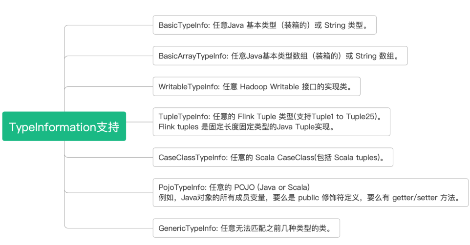
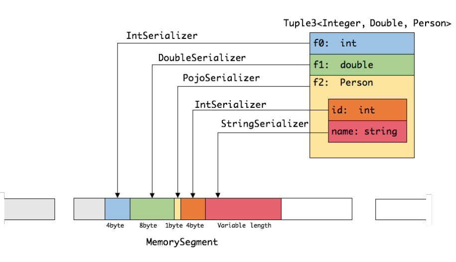
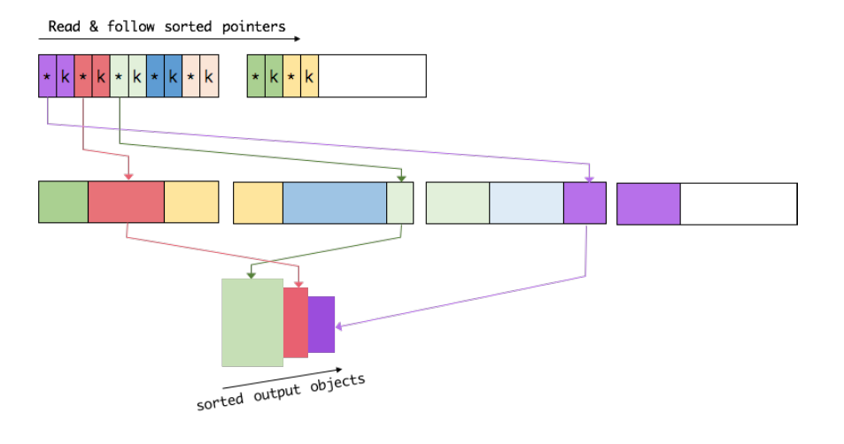
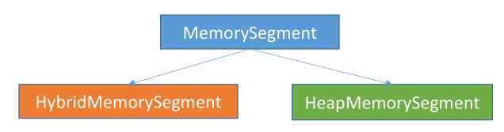

## 1. 标准jvm内存  

在大数据领域，大部分开源框架（如Hadoop、Spark、Storm）都
使用JVM，且会将大量数据存储到内存中，此时如果内存管理过度依赖
JVM，就会出现Java对象存储密度低导致内存使用率低以及垃圾回收导
致系统不稳定等问题，这极大地影响了系统的性能和稳定性。虽然
Flink本身也是基于JVM构建的大规模数据处理框架，但是它能够自己
实现内存管理，即脱离JVM对内存进行管理，统一且有效地管理堆内存
和堆外内存，确保大规模数据处理不会因为GC等问题造成系统不稳
定

我们使用标准的jvm来开发程序，将会有如下的内存相关的问题：  
* Java  对象存储密度低  
  一个只包含 boolean 属性的对象占用了16个字节内存：对象头占了8个，boolean 属性占了1个，对齐填充占了7个。而实际上只需要一个 bit（1/8字节）就够了。
* Full GC  会极大地影响性能  
  尤其是为了处理更大数据而开了很大内存空间的 JVM 来说，GC 会达到秒级甚至分钟级。
* OOM  问题影响稳定性  
  OutOfMemoryError 是分布式计算框架经常会遇到的问题，当 JVM 中所有对象大小超过分配给 JVM 的内存大小时，就会发生 OutOfMemoryError 错误，导致 JVM 崩溃，分布式框架的健壮性和性能都会受到影响。 
## 2. 内存模型  
   
## 3. TypeInformation 支持
    

## 4. 对象序列化  
  

## 5. 堆外内存管理
      

### 5.1. MemorySegment内存块  
启动超大内存（上百GB）的JVM需要很长时间，GC停留时间也会很长（分钟级）。使用堆外内存的话，可以极大地减小堆内存（只需要分配Remaining Heap那一块），使得
TaskManager 扩展到上百GB内存不是问题。  
* 高效的 IO 操作。堆外内存在写磁盘或网络传输时是 zero-copy，而堆内存的话，至少需要
copy 一次。
* 堆外内存是进程间共享的。也就是说，即使JVM进程崩溃也不会丢失数据。这可以用来做故
障恢复（Flink暂时没有利用起这个，不过未来很可能会去做）。
* Flink用通过ByteBuffer.allocateDirect(numBytes)来申请堆外内存，用 sun.misc.Unsafe
来操作堆外内存  

