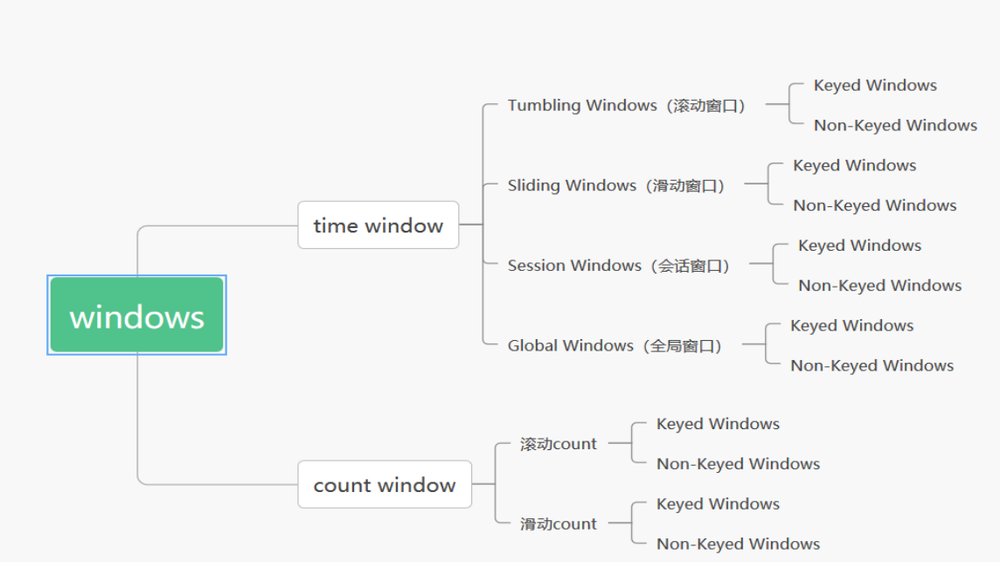
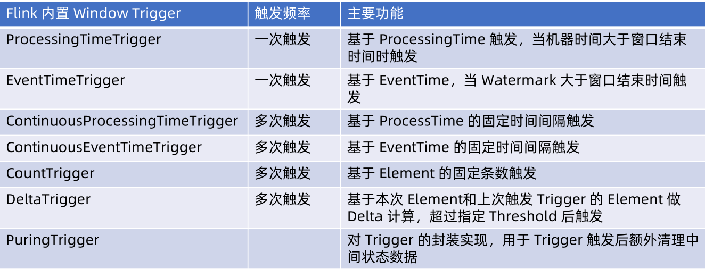
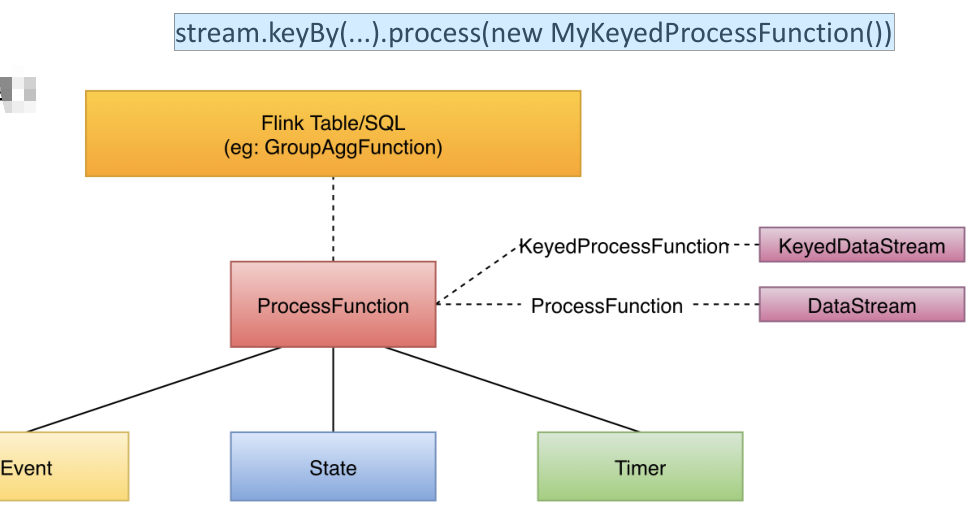

## 1. 背景
datastream的使用主要分为如下的关键：
* 分布式流处理模型
* DataStream API 总体概念
* Timestamp 与 Watermark原理
* Windows 窗口计算（Assigner，Function，Trigger，Evictors）
* DataStream 多流合并
* ProcessFunction 应用
* SideOutput 旁路输出
* Asynchronous I/O 异步操作
* Pipeline 与 StreamGraph 生成与转换
* 项目实战：基于 DataStream API 实现 PV，UV 统计  


## 2. 分布式流处理模型  
* 数据从上一个Operation节点直接Push到下一个Operation节点。
* 各节点可以分布在不同的Task线程中运行，数据在Operation之间传递。
* 具有Shuffle过程，但是数据不像MapReduce模型，Reduce 从 Map端拉取数据
* 实现框架有Apache Storm和Apache Flink以及Apache Beam。
  

  


## 3. datastream的api    

### 3.1. StreamExecutionEnvironment
流的执行环境

### 3.2. DataStreamSource
数据流源

### 3.3. DataStream转换的操作
数据流的操作可以分为，单个流转换，多个流的窗口操作，多个流的合并，单流拆分操作  
      
  

### 3.4. Watermark
* 1) 定义
* 2) 使用  
  两种方式：  
  * Periodic Watermarks
  * Punctuated Watermarks
* 3) 总结  
*  Watermark = Max EventTime – Late
   Threshold
   * Late Threshold 越高，数据处理延时越高
   * 启发式更新
   * 解决一定范围内的乱序事件
   * 窗口触发条件：Current Watermark >
   Window EndTime
   * Watermark 的主要目的是告诉窗口不再会
   有比当前 Watermark 更晚的数据到达
   * Idel Watermark 仅会发生在顺序事件中  
   

### 3.5. 窗口计算  

#### 3.5.1.  flink的窗口类型  

  

* 窗口计算可分为keyed窗口计算和nonekeyd窗口计算

* 转换为窗口流后，可以执行的函数有 reduce、aggregate、process

* 常用的窗口类型有：
  * 时间窗口，滚动
  
  * 时间窗口，滑动
  
  * 时间窗口，会话，会话的意思就是根据空隙时间决定是否关闭
  
  * 时间窗口，全局
  
  * 次数窗口，滚动
  
  * 次数窗口，滑动
  
    

#### 3.5.2. flink窗口定义函数  

```
Tumbling time window
keyedStream.timeWindow(Time.minutes(1))
• Sliding time window
keyedStream.timeWindow(Time.minutes(1), Time.seconds(10))
• Tumbling count window
keyedStream.countWindow(100)
• Sliding count window
keyedStream.countWindow(100, 10)
• Session window
keyedStream.window(EventTimeSessionWindows.withGap(Time. seconds(3))
```

#### 3.5.3. Trigger  

Trigger的意思时何时将窗口的数据关闭和清理  
如trigger(PurgingTrigger.of(ProcessingTimeTrigger.create()))代表机器，GlobalWindow必须自己定义何时关闭窗口。    



#### 3.5.3.1. 触发机制  

触发的机制比较复杂，需要结合水位线来看：这里省略了流程图  


#### 3.5.3.2. Trigger小结  

* 通常情况下WindowAssigner 中已经默认包含相应的Window Trigger，且适用于大部分场
  景；

* 所有基于Event Time 时间的 WindowAssigner 默认Trigger 都是 EventTimeTrigger；

* GlobalWindow默认为 NeverTrigger，也就是不触发，因此使用 GlobalWindow 必须指定
  CustomTrigger，否则窗口永远不触发；

* 通过 WindowStream 提供的 trigger() 方法能够接受新的 Trigger 实现，但是会覆盖
  WindowAssigner 自带的默认 Triigger；

  

#### 3.5.4. Evictor

Evictor 窗口清除器的作用：
* CountEvictor，保留一定数目的元素，多余的元素按照从前到后的顺序先后清理
* TimeEvictor，保留一个时间段的元素，早于这个时间段的元素会被清理
* DeltaEvictor，窗口计算时，最近一条 Element 和其他 Element 做 Delta 计算，仅保留 Delta 结果在指定 Threshold 内的 Element

使用方法：

```
windowStream.evictor(CountEvictor.of(5))
windowStream.evictor(TimeEvictor.of(Time.of(5, TimeUnit.SECONDS)))
windowStream.evictor(DeltaEvictor.of(threshold, new DeltaFunction<Tuple2<String,
Integer>>() {
@Override
public double getDelta(Tuple2<String, Integer> oldDataPoint, Tuple2<String,
Integer> newDataPoint) {
return newDataPoint.f1 - oldDataPoint.f1;
}}, evictAfter),0,null))
```


### 3.5.4. window function

* ReduceFunction
  增量，归约
* AggregateFunction
  增量，聚合
* FoldFunction
  增量
* ProcessWindowFunction
  全量

### 3.5.5. window的多流合并
示例

```
streamA.join(streamB)
.where(<KeySelector>)
.equalTo(<KeySelector>)
.window(<WindowAssigner>)
.apply(<JoinFunction>)
```
多流合并类型:
  * WIndow Join
  * Interval Join
### 3.6. ProcessFunction

#### 3.6.1. ProcessFunction功能特点

是flink更加底层的相关接口，使用起来更加灵活，可以访问流应用程序所有（非循环）基本构建块：

• 事件（数据流元素）
• 状态（容错和一致性）
• 定时器（事件时间和处理时间）

一般定义三个方法，open（初始化）、processElement、onTimer（可以为每一个流元素定义一个回调定时器）   

如：

```
stream.keyBy(...).process(new MyKeyedProcessFunction())
```



其特点为：

* 对于每一个接入的数据元素：
  • 更新数据状态
  • 注册未来某一时间需要调用的 callback 回调函数
* 当某一时间到来后：
  	• 检查条件是否满足，并执行对应的行为，例如输出数据元素等


#### 3.6.2. ProcessFunction功能案例  

需求描述：

* 记录每个传入的 Key 的 counts 数量
*  如果指定的 Key 在最近100ms（Event Time）没有接收到任何 Element，则输出
  key/count 键值对

思路：

* 存储 count 值，key 以及最后更新的 TimeStamp 到 ValueState 中，ValueState 由 key隐含定义

* 对于每条记录：
  • 更新计数器并修改最后的时间戳
  • 注册一个100ms timer 计时器，起始时间从当前的 EventTime 开始

* Times 被回调时：
  • 检查存储计数的最后修改时间与回调的事件时间 TimeStamp
  • 如果匹配则发送键/计数键值对（即在100ms内没有更新）

代码：

```
// the data type stored in the state
public class CountWithTimestamp {
public String key;
public long count;
public long lastModified;
}
// apply the process function onto a keyed stream
DataStream<Tuple2<String, Long>> result = stream
.keyBy(0)
.process(new CountWithTimeoutFunction());
```


```
public class CountWithTimeoutFunction extends RichProcessFunction<Tuple2<String, String>, Tuple2<String, Long>> {
	private ValueState<CountWithTimestamp> state;
	
	@Override
	public void open(Configuration parameters) throws Exception {
		state = getRuntimeContext().getState(new ValueStateDescriptor<>("myState", CountWithTimestamp.class));
	}
}
```

```
public class CountWithTimeoutFunction extends RichProcessFunction<Tuple2<String, String>, Tuple2<String, Long>> {
    @Override
    public void processElement(Tuple2<String, Long> value, Context ctx, Collector<Tuple2<String, Long>> out) throws Exception {
        CountWithTimestamp current = state.value();
        if (current == null) {
            current = new CountWithTimestamp();
            current.key = value.f0;
    	}
        current.count++;
        current.lastModified = ctx.timestamp();
        state.update(current);
		ctx.timerService().registerEventTimeTimer(current.lastModified + 100);
	}
}
```

```
public class CountWithTimeoutFunction extends RichProcessFunction<Tuple2<String, String>, Tuple2<String, Long>> {
    @Override
    public void onTimer(long timestamp, OnTimerContext ctx, Collector<Tuple2<String, Long>> out) throws Exception {
        CountWithTimestamp result = state.value();
        if (timestamp == result.lastModified + 100) {
            out.collect(new Tuple2<String, Long>(result.key, result.count));
            state.clear();
        }
    }
}
```


### 3.7. 旁路输出
先给输出的流打一个标签，然后再获取一个旁路输出流，SideOutput

### 3.8. 异步IO（关联）
可以使用AsyncFunction，异步关联外部表的数据，不必等到结果一个一个返回导致性能问题。

### 3.9. flink的系统类型

### 3.9.1. 作用

 TypeInformation 可以由如下优势：

* Flink对数据类型了解得越多，序列化和数据Schema布局就越好，数据处理也更方便；
* 在大多数情况下，可以使用户不必担心序列化框架和以及类型注册；
* 基于 Flink 自身的数据序列化能力，可以直接将数据序列化成二进制数据格式存储在内存中

### 3.10. 自定义 Source 与 Sink  

#### 3.10.1. 作用

#### 3.10.2. 接口

#### 3.10.3. 案例
