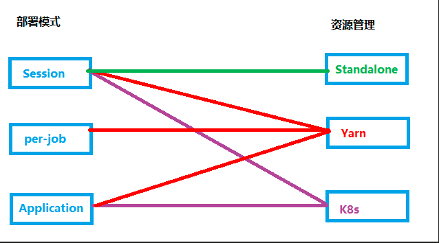

## flink部署架构

 

### k8s架构

 

* Master 节点:
  负责整个集群的管理，资源管理。
  运行APlServer，ControllerManager，Scheduler服务。提供 Etcd 高可用键值存储服务，用来保存Kubernetes 集群所有对象的状态信息和网络信息。
* Node:
  集群操作的单元，Pod 运行宿主机。运行业务负载，业务负载会以 Pod的形式运行
* Kubelet:
  运行在Node节点上，维护和管理该 Node上的容器。
* Container Runtime:
  Docker容器运行环境，负责容器的创建和管理
* Pod:
  运行在 Node 节点上，多个相关 Container的组合。
  Kubunetes创建和管理的最小单位

### Flink On Kubernetes

#### Standalone Session

 

- 步骤 1， 使用 Kubectl 或者 K8s 的 Dashboard 提交请求到 K8s Master。
- 步骤 2， K8s Master 将创建 Flink Master Deployment、TaskManager Deployment、ConfigMap、SVC 的请求分发给 Slave 去创建这四个角色，创建完成后，这时 Flink Master、TaskManager 启动了。
- 步骤 3， TaskManager 注册到 JobManager。在非 HA 的情况下，是通过内部 Service 注册到 JobManager。
- 至此，Flink 的 Sesion Cluster 已经创建起来。此时就可以提交任务了。
- 步骤 4，在 Flink Cluster 上提交 Flink run 的命令，通过指定 Flink Master 的地址，将相应任务提交上来，用户的 Jar 和 JobGrapth 会在 Flink Client 生成，通过 SVC 传给 Dispatcher。
- 步骤 5，Dispatcher 会发现有一个新的 Job 提交上来，这时会起一个新的 JobMaster，去运行这个 Job。
- 步骤 6，JobMaster 会向 ResourceManager 申请资源，因为 Standalone 方式并不具备主动申请资源的能力，所以这个时候会直接返回，而且我们已经提前把 TaskManager 起好，并且已经注册回来了。
- 步骤 7-8，这时 JobMaster 会把 Task 部署到相应的 TaskManager 上，整个任务运行的过程就完成了。

#### Native Kubernetes Session

 

- 第一个阶段：启动 Session Cluster。Flink Client 内置了 K8s Client，告诉 K8s Master 创建 Flink Master Deployment，ConfigMap，SVC。创建完成后，Master 就拉起来了。这时，Session 就部署完成了，并没有维护任何 TaskManager。
- 第二个阶段：当用户提交 Job 时，可以通过 Flink Client 或者 Dashboard 的方式，然后通过 Service 到 Dispatcher，Dispatcher 会产生一个 JobMaster。JobMaster 会向 K8sResourceManager 申请资源。ResourceManager 会发现现在没有任何可用的资源，它就会继续向 K8s 的 Master 去请求资源，请求资源之后将其发送回去，起新的 Taskmanager。Taskmanager 起来之后，再注册回来，此时的 ResourceManager 再向它去申请 slot 提供给 JobMaster，最后由 JobMaster 将相应的 Task 部署到 TaskManager 上。这样整个从 Session 的拉起到用户提交都完成了。
- 需注意的是，图中 SVC 是一个 External Service。必须要保证 Client 通过 Service 可以访问到 Master。在很多 K8s 集群里，K8s 和 Flink Client 是不在同一个网络环境的，这时候可以通过 LoadBalancer 的方式或者 NodePort 的方式，使 Flink Client 可以访问到 Jobmanager Dispatcher，否则 Jar 包是无法提交的。

#### Native Kubernetes  application

目前 application 模式和 perjob 模式最大的区别是用户代码在 client 端还是 jobmanager 端运行。在 K8s 部署上，由于用户的 jar 和依赖都可以提前打在镜像里面，所以支持 application 模式就变得非常容易

 

- 首先创建出了 Service、Master 和 ConfigMap 这几个资源以后，Flink Master Deployment 里面已经带了一个用户 Jar，这个时候 entrypoint 就会从用户 Jar 里面去提取出或者运行用户的  main，然后产生 JobGraph。之后再提交到 Dispatcher，由 Dispatcher 去产生 Master，然后再向 ResourceManager 申请资源，后面的逻辑的就和 Session 的方式是一样的。
- 它和 Session 最大的差异就在于它是一步提交的。因为没有了两步提交的需求，如果不需要在任务起来以后访问外部 UI，就可以不用外部的 Service。可直接通过一步提交使任务运行。通过本地的 port-forward 或者是用 K8s ApiServer 的一些 proxy 可以访问 Flink 的 Web UI。此时，External Service 就不需要了，意味着不需要再占用一个 LoadBalancer 或者占用 NodePort

#### 高可用

flink on k8s基于k8s服务发现探测

### 总结

#### 部署模式对比


#### 生产推荐

Native Kubernetes 具有以下优势：

- 更短的 Failover 时间
- 可以实现资源托管，不需要手动创建 TaskManager 的 Pod，可以自动完成销毁
- 具有更加便捷的 HA，Flink 1.12 版本之后在 Native Kubernetes 模式下，可以依赖于原生 Kubernetes 的 Leader选举机制来完成 JobManager 的 HA

综上生产采用Native Kubernetes部署，而application 模式部署规避了 Session 模式的资源隔离问题、以及客户端资源消耗问题，因此生产环境更推荐采用 Application Mode 部署 Flink 任务

PS：Native Kubernetes 和 Standalone Kubernetes 主要区别在于 Flink 与 Kubernetes 交互的方式不同以及由此产生的一系列优势。Standalone Kubernetes 需要用户自定义 JobManager 和 TaskManager 的 Kubernetes 资源描述文件，提交作业时需要用 kubectl 结合资源描述文件启动 Flink 集群。而 Native Kubernetes 模式 Flink Client 里面集成了一个 Kubernetes Client，它可以直接和 Kubernetes API Server 进行通讯，完成 JobManager Deployment 以及 ConfigMap 的创建。JobManager Development 创建完成之后，它里面的 Resource Manager 模块可以直接和 Kubernetes API Server 进行通讯，完成 TaskManager pod 的创建和销毁工作以及 Taskmanager 的弹性伸缩。因此生产环境中推荐使用 Flink on Native Kubernetes 模式部署 Flink 任务；

## flink流程规范

 

## StreamPark

### 背景

每提交一个任务，都需要打包新的镜像，提交到私有仓库，然后再调用 Flink Run 指令沟通 K8s，去拉取镜像运行 Pod。任务提交之后，还需要去 K8s 查看 log，还存在如下问题：

- 方式过于原始无法适配大批量任务

  在没有一个支持 Flink on Kubernetes 任务开发部署的平台的情况下，需要使用脚本的方式进行任务的提交和停止，这也是 Flink 提供的默认的方式，具体步骤如下:

  1. 在 Flink 客户端节点准备 kubectl 和 Docker 命令运行环境，创建部署 Flink 作业使用的 Kubernetes Namespace 和 Service Account 以及进行 RBAC
  2. 编写 Dockerfile 文件，将 Flink 基础镜像和用户的作业 Jar 打包到一起

  ```dockerfile
  FROM flink:1.13.6-scala_2.11
  RUN mkdir -p $FLINK_HOME/usrlib
  COPY my-flink-job.jar $FLINK_HOME/usrlib/my-flink-job.jar
  ```

  3. 使用 Flink 客户端脚本启动 Flink 任务

  ```shell
  ./bin/flink run-application \
      --target kubernetes-application \
      -Dkubernetes.namespace=flink-cluster \
      -Dkubernetes.jobmanager.service-account=default \
      -Dkubernetes.cluster-id=my-first-application-cluster \
      -Dkubernetes.container.image=relx_docker_url/streamx/relx_flink_1.13.6-scala_2.11:latest \
      -Dkubernetes.rest-service.exposed.type=NodePort \
      local:///opt/flink/usrlib/my-flink-job.jar
  ```

  4. 使用 Kubectl 命令获取到 Flink 作业的 WebUI 访问地址和 JobId

  ```shell
  kubectl -n flink-cluster get svc
  ```

  

  5. 使用Flink命令停止作业

  ```shell
  ./bin/flink cancel
      --target kubernetes-application
      -Dkubernetes.cluster-id=my-first-application-cluster
      -Dkubernetes.namespace=flink-cluster <jobId>
  ```

- 无法实时状态跟踪

  需要进入job控制台查看任务状态

- 任务运维和监控困难

  任务运维需要命令行进行操作取消，需要搭配prometheus、grafana等组件进行监控

- 无告警机制

  借助prometheus告警机制进行任务告警

- 无法集中化管理等等

  多任务无法集中化管理，需要命令行查看，且任务控制台分散

| 对比项       | 原始方式                                     | streampark                                               |
| ------------ | -------------------------------------------- | -------------------------------------------------------- |
| 提交任务方式 | 使用flink客户端命令行提交脚本                | 页面上传jar包设置参数提交                                |
| 状态跟踪     | kubectrl svc地址，手动输入进入jobmanager后台 | 页面有基础的任务状态，且有地址点击可跳转到原生Jobmanager |
| 任务运维     | 命令行取消和查看任务列表                     | 任务列表菜单启停、复制、修改、备注任务                   |
| 监控         | 需要搭配prometheus、grafana等组件进行监控    | 地址点击可跳转到原生Jobmanager查看                       |
| 告警机制     | 借助prometheus告警机制进行任务告警           | 预置的任务状态告警                                       |
| 集中化管理   | 无                                           | 任务列表可查看发布的任务                                 |
|              |                                              |                                                          |


### 核心功能

#### 作业提交

 

 

#### 作业管理

在作业提交之后，StreamPark 能实时获取到任务的最新 checkpoint 地址、任务的运行状态、集群实时的资源消耗信息，针对运行的任务可以非常方便的一键启停, 在停止作业时支持记录 savepoint 的位置, 以及再次启动时从 savepoint 恢复状态等功能，从而保证了生产环境的数据一致性，真正具备 Flink on Kubernetes 的 一站式开发、部署、运维监控的能力。

接下来我们来看看这一块的能力 StreamPark 是如何进行支持的:

- 实时跟踪运行状态

  对于生产环境的挑战，很重要的一点就是监控是否到位，Flink on Kubernetes 更是如此。这点很重要, 也是最基本需要具备的能力，StreamPark 可实时监控 Flink on Kubernetes 作业的运行状态并在平台上展示给用户，在页面上可以很方便的根据各种运行状态来检索任务。

   

* 告警机制

   

### 部署过程

K8s Application 模式下具体提交流程

 

### 改进点

* fat-jar 包 build 完成之后不再构建镜像，直接利用 Pod Tempelet 挂载 PVC 到 Flink Pod 中的目录，进一步优化代码提交流程

- 复杂告警规则无法页面配置
- 任务提交日志也需要可视化展示：任务提交伴随着加载 class 文件，打 jar 包，build 镜像，提交镜像，提交任务等过程，每一个环节出错，都会导致任务的失败，但是失败日志往往不明确，或者因为某种原因导致异常未正常抛出，没有转换任务状态，用户会无从下手改进。
- 存在bug，部分出错的任务可能需要重新创建任务发布，否则状态显示不对
- 任务构建相关的镜像本地存储占用空间
- 针对多flink集群的情况隔离性不强