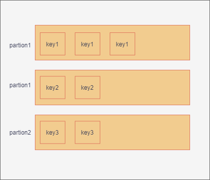

## 1、kafka的分区
### 1.1 分区概念
kafka作为消息中间件时，消息的量一般是巨大的。并且一台服务器肯定是不够用的，所以需要扩展成多台服务器，使用者是通过不同的主题来存储不同维度的消息。为了将数据能够更加均匀的分配到各个机器上来分摊压力，这里引入了分区。这个分区类似于elasticsearch分片。如下图所示，为一个消息分区：

  

总的来说，分区的作用为：  
* 负载均衡，数据能够比较均匀的打到不同的分区上
* 高的伸缩性，可以通过添加新的机器来增加整体系统的吞吐量 

当然分区也有一定其它方面的影响，比如可能会影响消息的顺序性。如果分区太多，会造成随机io太多，一定程度上影响写入性能。

### 1.2 kafka分区的策略
首先消息在哪一个分区是由生产者决定的，需要生产者来决定发送到哪个一个分区。分区策略就是生产者通过的一种算法将消息发送到某一分区中。kafka提供了默认的分区策略，我们也可以自定义策略发送。如何进行自定义分区策略呢？需要实现org.apache.kafka.clients.producer.Partitioner接口，其中的参数有主题、borker数等信息。我们可以通过这些信息进行灵活的进行分区。常见的分区策略有如下的策略：  
* 轮询策略  
就是按顺序一个分区放一条。  

* 随机策略  
随机策略如上图所示，是按照一定的随机算法，随机的将消息分到分区上。这种算法在实际上表现没有轮询算法好，老版本的默认算法为随机算法，新版的算法已经改为轮询了。
* 业务键策略  
入名字表示，根据业务的id，是的同一id的消息，一定会分到某分区，入可以取单号的hash值落到同一分区。同一分区的消息是能够保证消费的顺序的。这样就不必为了保证消息的顺序性而只设置一个分区了。  
  
* 其它的分区策略  
可以基于地理位置进行分区。比如我们将两个国家的机房组成了一个大的broker集群，不同业务根据发送方所在的机房，比如中国产生的消息分区发送到中国的机房，美国的消息发送至美国的机房的分区。
```
    List<PartitionInfo> partitions = cluster.partitionsForTopic(topic);
    return partitions.stream().filter(p -> isSouth(p.leader().host()))
        .map(PartitionInfo::partition).findAny()
            .get();
```

### 1.3 注意  
分区一般使用默认的策略即可，但是如果有业务需求，可以自定义分区策略，但是一定要注意防止数据倾斜产生，进而影响broker的性能。


## 2 客户端通讯协议
  我们知道应用层有很多耳熟能详的通讯协议，比如http等，为什么kafka不使用http协议却使用了更加底层的tcp协议呢？查阅了相关的资料，主要有两点：
  * 基于tcp可以实现更加高级的功能  
  比如网络传输常用的多路复用，这里并不是说tcp提供了多路复用，而是多路复用可以很方便的基于tcp实现可靠的消息传输
  * http协议在大多数语言中支持的不够完善。

## 3 kafka的生产者
生产者是发送消息的对象，而生产生者如何发送消息呢？
### 3.1 java发送消息流程
主要经过如下步骤：
* 构造生产者对象所需的参数对象
* 创建KafkaProducer对象实例
* 调用send方法发送数据
* 调用close方法，关闭资源
```
    Properties props = new Properties ();
    props.put(“参数 1”, “参数 1 的值”)；
    props.put(“参数 2”, “参数 2 的值”)；
    Producer<String, String> producer = new KafkaProducer<>(props));
    producer.send(new ProducerRecord<String, String>(……), callback);
}
```
上面只是一个简单的发送消息流程，其实还有很多细节，比如建立连接、关闭连接等等，后面一一讨论。
### 3.1 元信息
* Producer 通过 metadata.max.age.ms 参数定期地去更新元信息。该参数的默认值是5min，每 5 分钟都会强制刷新一次元数据
* Producer发送不存在的主题信息，则会强制从broker集群拉取最新的元信息

### 3.2 建立连接
发送消息的时候，什么时候和kakfa服务端建立连接呢？
答案是：  
在创建 KafkaProducer 对象时，生产者应用会在后台创建并启动一个名为 Sender 的线程，该线程会建立和broker的连接。  
这里有几个**注意点**：
* **最开始生产者对象会和所有的borker地址建立连接**
* 如果有servers配置了100个broker地址，那么就会建立100个连接，这是没有必要的，只需要配置几个就行了，因为只要连接成功后就能拿到整个集群信息了  

除了上述的建立时机外，还有哪些地方会创建呢？ 
*  更新元数据  
kakfa会定期更新元数据信息，发现与某些 Broker 当前没有连接，那么它就会创建一个 TCP 连接
*  发送消息时 发现尚不存在与目标 Broker 的连接，也会创建一个  

小讨论：这种设计可能不是特别优秀，创建了很多无用的连接，比如可能要给topic就和两个broker打交道，但是连接了kafka集群100个连接。
### 3.3 关闭连接
kafka的关闭连接有两种，一种是用户主动关闭，一种是 Kafka 自动关闭。
* 主动关闭  
如何用户produce.close();或者kill
* Kafka自动关闭  
connections.max.idle.ms（默认9min）,如果9分钟之内没有任何数据，则主动关闭避免浪费资源。也可以设置成-1来使得自动关闭禁用。  
### 3.4 预防消息丢失  
kafka能够保证已提交的消息有限度的不丢失消息的，注意这个有限度的意思是保证至少有broker存活，否则谈丢失消息毫无意义  
在生产端如何防止生产丢失消息呢？  
* 使用回调producer.send(msg, callback)来发送消息  
直接使用send(msg)是异步发送的，需要回调保证消息发送是否成功还是失败
* acks = all代表所有的副本都已经提交了
* retries设置代表遇到网络抖动时，多试几次提升不丢的概率
* unclean.leader.election.enable
* replication.factor >= 3，冗余数量
* min.insync.replicas > 1，至少写入副本数量算已经提交
* replication.factor > min.insync.replicas，replication.factor = min.insync.replicas + 1
* 确保消息消费完成再提交  

**注意**  
增加主题分区。当增加主题分区后，在某段“不凑巧”的时间间隔后，Producer 先于 Consumer 感知到新增加的分区，而 Consumer 设置的是“从最新位移处”开始读取消息，因此在 Consumer 感知到新分区前，Producer 发送的这些消息就全部“丢失”了，或者说 Consumer 无法读取到这些消息

## 4. 生产者的消息压缩
### 4.1 为什么要压缩
&emsp;&emsp;为了极致提升性能，即通过压缩cpu的时间来换取磁盘空间或者带宽。当发送端cpu还有,而带宽已经快没了就很需要压缩了。
### 4.2 如何进行压缩呢？
kafka的消息格式分为两种：v1和v2（0.11.0.0版本以后）  
  
如上图所示消息格式，在V1版本中，每条消息都需要执行 CRC 校验，即使broker端做了一些改动后，还需要重新校验一遍，从而影响性能。所以V2中，校验从日志项层移动到消息集层。在压缩方式上，v2是对整体消息集进行压缩效果好于v1对消息压缩再放到外层这种房市要好。
### 4.3 消息压缩的时机
* 生产端通过compression.type配置指定压缩算法，生产者会发生压缩
* broker通过compression.type参数配置了broker压缩算法且和生产者压缩算法不一样，broker会先解压然后再压缩，**这个会非常耗费cpu性能，需要注意**
* broker兼容老版本的消息格式，会解压转换，然后再压缩，**保持一样的消息格式也会非常有利于性能提升**

### 4.4 消息解压的时机
* 消费端解压
* 4.3 消息压缩的时机 中有解压的场景
* 每个压缩过的消息集合在 Broker 端写入时都要发生解压缩操作，目的就是为了对消息执行各种验证。我们必须承认这种解压缩对 Broker 端性能是有一定影响的，特别是对 CPU 的使用率而言


### 4.5 压缩算法对比
如下图所示压缩算法比较：  
  
在网上查找的资料显示：  
&emsp;&emsp;在实际使用中，GZIP、Snappy、LZ4 甚至是 zstd 的表现各有千秋。
* 吞吐量方面：LZ4 > Snappy > zstd 和 GZIP；
* 而在压缩比方面，zstd > LZ4 > GZIP > Snappy。  

对于物理资源：  
* 使用 Snappy 算法占用的网络带宽最多，zstd 最少，这是合理的，因为 zstd 就是要提供超高的压缩比；
* 在 CPU 使用率方面，各个算法表现得差不多，只是在压缩时 Snappy 算法使用的 CPU 较多一些，而在解压缩时 GZIP 算法使用更多的 CPU。

## 5 消息可靠性保障  
### 5.1 可靠性保障的概念  
对于一个消息系统，可靠性保障的含义一般有三种：  
* 最多一次，消息最多被发送一次，可能会丢失，但是绝不会重复发送
* 至少一次，消息不会丢失，但是绝对不会丢失
* 精确一次，不会丢失，也不会被重复发送  
  
&emsp;&emsp;目前kafka的消息保障位 至少一次 的保障。比如，broker其实已经提交了，但是producer由于网络原因认为没有成功，可能会导致重复发送。如果在 producer 禁用了重试，则就是 最多一次 保障， 最多被发送一次，可能会丢失。不同的业务场景要求可能不一样，需要选择适合的可靠性保障。当然 精确一次 是最好的，kafka是支持这种精确一次 语义来保障的。

### 5.2 基本的kafka 精确一次保障  
&emsp;&emsp;在produce设置enable.idempotence=true，其它的代码不用改动，Producer 就成了幂等性 Producer，broker端会自动去重，即在 Broker 端多保存一些字段。当 Producer 发送了具有相同字段值的消息后，Broker 能够自动知晓这些消息已经重复了，进而丢掉重复的消息。这样即使Producer发送重复消息也无所谓了。但这种幂等性存在局限性：
* 只能保障单分区上的幂等性，如果消息变成其它分片了，就失效了
* 只能是会话级别，如果producer重启了，也会失效。

### 5.3 kafka发送消息事务
&emsp;&emsp;Kafka 自 0.11 版本开始也提供了对事务的支持，目前主要是在 read committed 隔离级别上做事情。它能保证多条消息原子性地写入到目标分区。  
&emsp;&emsp;kafka如何开启事务消息呢？  
1. enable.idempotence = true，这个和幂等性消息一样
2. 在Producer 设置transctional. id
3. producer代码做一些改动
```
    //初始化事务
    producer.initTransactions();
    try {
        //开启事务
        producer.beginTransaction();
        producer.send(record1);
        producer.send(record2);
        //提交事务
        producer.commitTransaction();
    } catch (KafkaException e) {
                producer.abortTransaction();
    }
```
4. 在 Consumer 端需要设置 isolation.level  
* read_uncommitted，默认，如果有失败的消息，这个也能读到
* read_committed，表明 Consumer 只会读取事务型 Producer 成功提交事务写入的消息。  

&emsp;&emsp;通过上述的设置就能保证，两个分区的消息要么同时成功要么同时失败，同时也就能保证了跨分区的消息的幂等性，但是有得必有失，幂等性消息本来就有损耗消息了，Producer 的性能要更差。实际使用中，我们要合理评估常见使用，不可盲目。