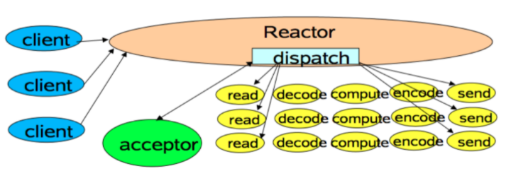
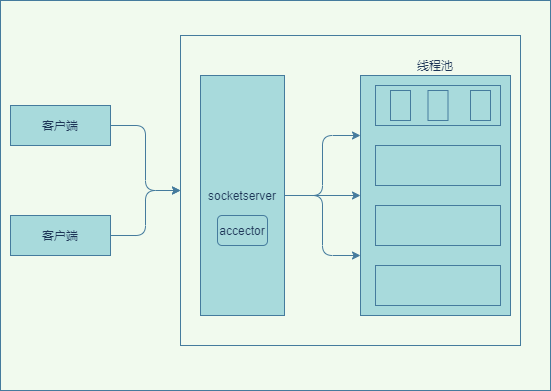
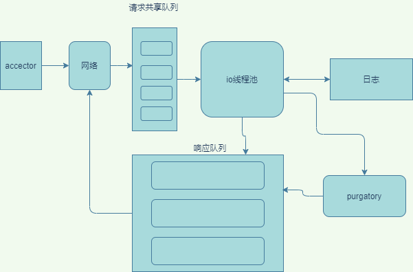

## 1. 背景
我们首先回顾下io的线程模型

* 顺序请求  
这种相当于同步请求，一个接一个的处理。每个请求都必须等待前一个请求处理完毕才能得到处理

* 多线程模型  
  每个入站请求都创建一个新的线程来异步处理，为每个请求都创建线程的做法开销极大，这种做法也是非常不推荐  

* Reactor模式  
  Reactor 模式是事件驱动架构的一种实现方式，特别适合应用于处理多个客户端并发向服务器端发送请求的场景  
  
  
## 2. kafka的reactor
上面简单介绍了通用的线程模型，显然kafka不可能采用前两种线程模型，kafka采用的是reactor模式  
整体的网络模型图：  
  
* 类似于 Reactor 模式中的 Dispatcher，Kafka 的 Broker 端也有个对应的SocketServer 组件
* 工作线程池有个专属的名字，叫网络线程池，num.network.threads（线程数量）默认为3  

## 3. 网络线程处理
 Broker 端的 Acceptor 线程分发消息到任意一个网络线程中（轮询策略），并非按照顺序处理，而是又做了一层异步线程池的处理。  
 如图所示：  
   
 * 网络线程拿到请求后，将请求放入到一个共享请求队列中
 *  IO 线程池，负责从该队列中取出请求，执行真正的处理
 *  num.io.threads控制io线程池的线程数，默认为8个
 *  大多数请求将生成的响应发送到网络线程池的响应队列中，然后由对应的网络线程负责将 Response 返还给客户端    
**注意：请求队列是所有网络线程共享的，而响应队列则是每个网络线程专属**
 *  Purgatory用来缓冲延时请求，比如设置了acks=all的PRODUCE，必须等待ISR中所有副本都接收了消息后才能返回，请求不能立刻处理时，它就会暂存在 Purgatory，满足了完成条件，才会将Response放入对应网络线程的响应队列中。

## 4. 控制类请求   
&emsp;&emsp;它们不是数据类的请求，而是控制类的请求，比如说删除主题、或者将某个broker上的分区角色由领导者副本变为跟随着副本。  这种控制类请求需要直接令数据类请求失效。但是kafka的 2.3 版本以前是将数据类请求和控制类请求放在一个队列中的，这会造成延迟。比如一个分区的领导者副本角色变更了，但是Purgatory中还有部分数据没处理完，那么会等到没处理的发生了重试报错后，才会被感知到返回给客户端。 造成了请求的延时增加。  
&emsp;&emsp;kafka的 2.3 版本以后实现了数据类请求和控制类请求的分离，broker启动后会创建两套网络线程池和 IO 线程池用于处理数据和控制，所以它会有两个端口，这样隔离开后可以直接令数据类请求失效。

