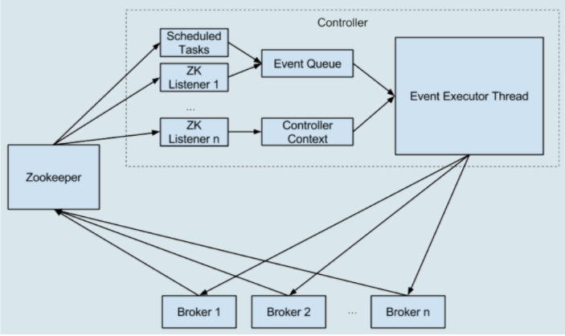
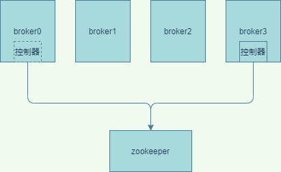

## 1. 什么是控制器  
类似于elasticsearch的master，它的作用是管理和协调整个 Kafka 集群，在运行的过程中只会有一个broker能够成为控制器。它是强依赖于zookeeper的
## 2. ZooKeeper的作用
&emsp;&emsp;ZooKeeper高可靠性的分布式协调服务框架，客户端可以改变zk的节点，如果zk的节点发生了变更，Watch它的客户端将感知到这些变更。  
&emsp;&emsp;依托于这些功能，ZooKeeper 常被用来实现集群成员管理、分布式锁、领导者选举
## 3. 控制器的选举
Broker 在启动时，会尝试去 ZooKeeper 中创建 /controller 节点。Kafka 当前选举控制器的规则是：第一个成功创建 /controller 节点的 Broker 会被指定为控制器。  
## 4. 控制器作用
### 4.1. 主题管理
&emsp;&emsp;控制器帮助我们完成对Kafka主题的创建、删除以及分区增加的操作，即完成kafka-topics脚本的工作。
### 4.2. 分区重分配
&emsp;&emsp;kafka-reassign-partitions脚本的工作，即分区重分配  
### 4.3. 领导者选举
&emsp;&emsp;避免部分 Broker 负载过重，更换leader。
### 4.4. 集群成员管理
&emsp;&emsp;自动检测新增 Broker、Broker 主动关闭及被动宕机，用Watch 机制检查 ZooKeeper 的 /brokers/ids 节点下的子节点数量变更，控制器就能自动地感知到这个变化，进而开启后续的新增 Broker 作业。当主动下线broker后，控制器也能通过节点变化感知到。
### 4.5. 数据服务
&emsp;&emsp;控制器上保存了最全的集群元数据信息，其他所有 Broker 会定期接收控制器发来的元数据更新请求，从而更新其内存中的缓存数据。

## 5. 控制器原理
### 5.1. 控制器的数据种类
* 所有主题信息。包括具体的分区信息，比如领导者副本是谁，ISR 集合中有哪些副本等
* 所有 Broker 信息。包括当前都有哪些运行中的 Broker，哪些正在关闭中的 Broker 等
* 所有涉及运维任务的分区。包括当前正在进行 Preferred 领导者选举以及分区重分配的分区列表  
  
&emsp;&emsp;这些数据其实在zookeeper也保存了一份。当控制器初始化时，它都会从zookeeper上读取然后缓存到内存中。当如果元数据发生了变更后，会向broker发送请求同步过去。
### 5.2. 控制器核心原理  
&emsp;&emsp;在以前的版本中，请求broker变更元数据或者连接zk都是采用多线程设计的，而且这些多线程会访问共享数据导致性能很低。  
&emsp;&emsp;0.11 版本重构了，将多线程的方式改为单线程加队列的方案
  
如图所示，引入了一个事件处理线程，统一处理控制器事件，然后使用单一线程处理。这样不用担心多线程并发问题。同时之前操作zk全部改为异步，也提升了性能。  
&emsp;&emsp;在新的版本中又做了进一步优化，比如停止副本请求给某个broker,但是之前broker上是在同一队列，优先级不高，可能很晚执行，导致broker还会继续处理数据，2.2版本后，将着各种请求和普通数据分离。使得broker能够立即生效。
### 5.3. 故障转移
  
如图所示，因为控制器只能有一个，当一个控制器宕机了，该怎么办呢，会发生故障转移。粗略的过程如：  
* Broker 0 是控制器
* Broker 0 宕机后
* ZooKeeper 通过 Watch 机制感知到并删除了 /controller 临时节点。
* 所有存活的 Broker 开始竞选新的控制器身份。
* Broker 3 最终赢得了选举，成功地在 ZooKeeper 上重建了 /controller 节点。
* 之后，Broker 3 会从 ZooKeeper 中读取集群元数据信息，并初始化到自己的缓存中。
* 控制器的 Failover 完成，可以行使正常的工作职责了  

## 6. 总结
总的来看控制器是非常依赖于zk的