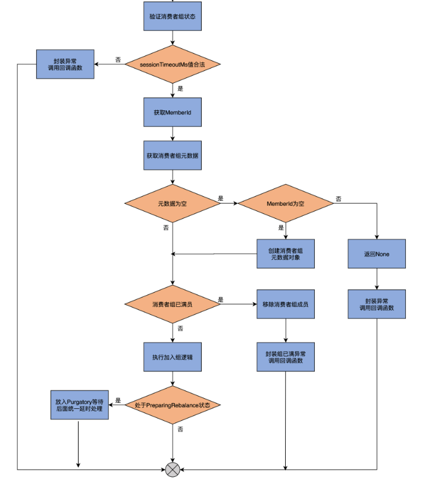
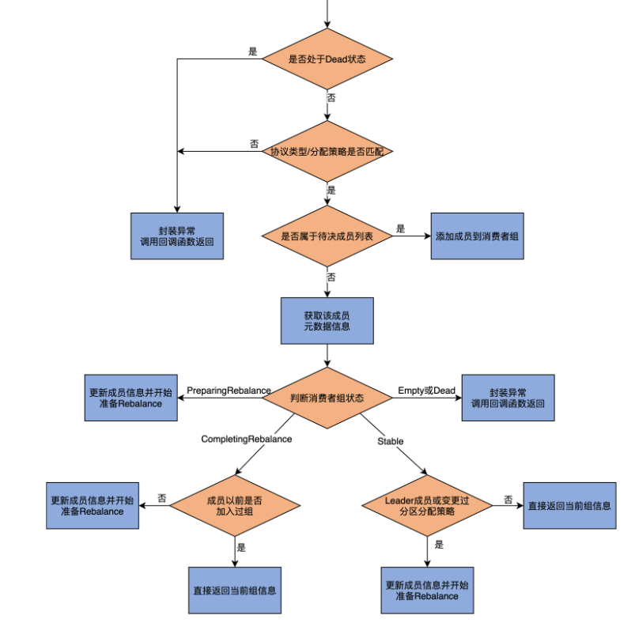
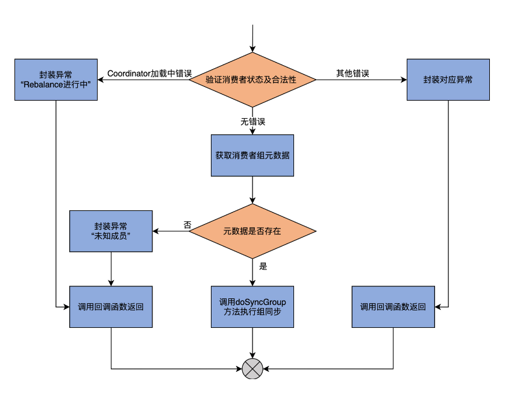
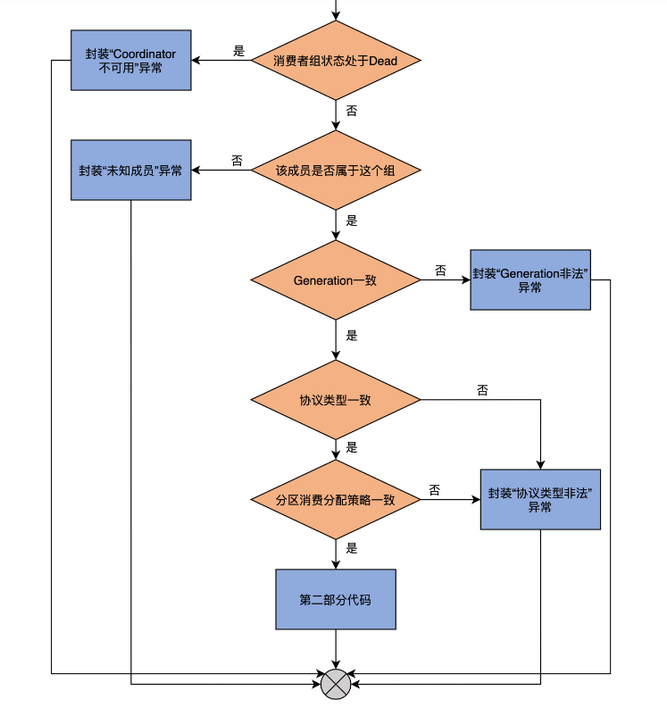
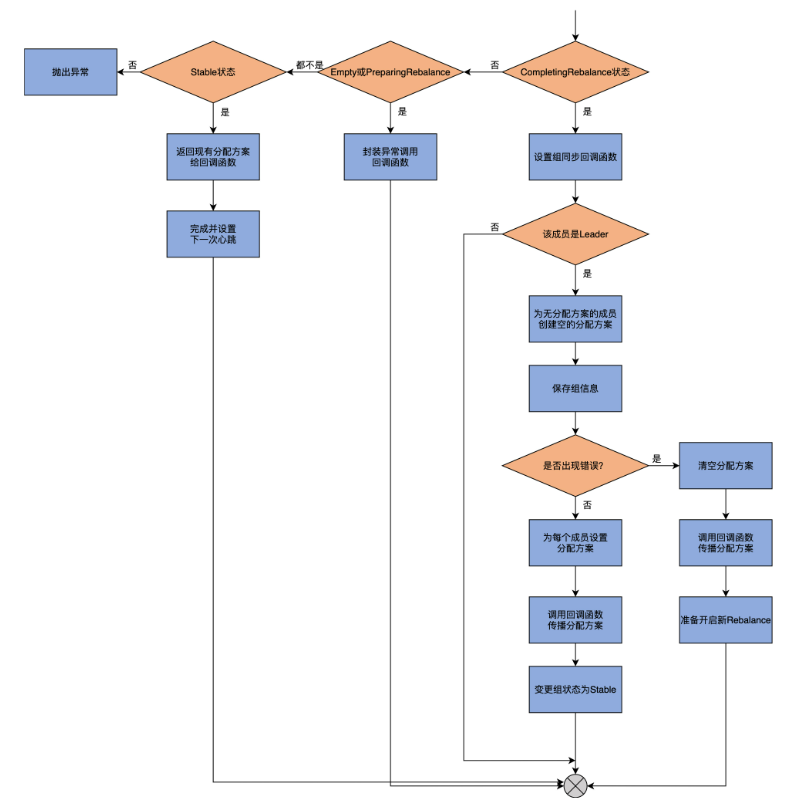
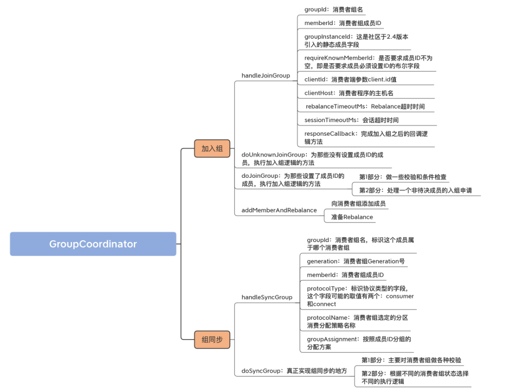

## 1. 开头

​	有些人认为，Consumer 端参数 session.timeout.ms 决定了完成一次 Rebalance 流程的最大时间。这种认知是不对的，实际上，这个参数是用于检测消费者组成员存活性的，即如果在这段超时时间内，没有收到该成员发给 Coordinator 的心跳请求，则把该成员标记为 Dead，而且要显式地将其从消费者组中移除，并触发新一轮的 Rebalance。而真正决定单次 Rebalance 所用最大时长的参数，是 Consumer 端的 **max.poll.interval.ms**

​	总体而言， Rebalance 的流程大致分为两大步：加入组（JoinGroup）和组同步（SyncGroup）

​	**加入组，是指消费者组下的各个成员向 Coordinator 发送 JoinGroupRequest 请求加入进组的过程**。这个过程有一个超时时间，如果有成员在超时时间之内，无法完成加入组操作，它就会被排除在这轮 Rebalance 之外。

​	组同步，是指当所有成员都成功加入组之后，Coordinator 指定其中一个成员为 Leader，然后将订阅分区信息发给 Leader 成员。接着，所有成员（包括 Leader 成员）向 Coordinator 发送 SyncGroupRequest 请求。需要注意的是，**只有 Leader 成员发送的请求中包含了订阅分区消费分配方案，在其他成员发送的请求中，这部分的内容为空**。当 Coordinator 接收到分配方案后，会通过向成员发送响应的方式，通知各个成员要消费哪些分区

## 2. 成员入组

加入组的源码实现，它们位于 GroupCoordinator.scala 文件中

handleJoinGroup、doUnknownJoinGroup、doJoinGroup 和 addMemberAndRebalance。

handleJoinGroup 是执行加入组的顶层方法，被 KafkaApis 类调用，该方法依据给定消费者组成员是否了设置成员 ID，来决定是调用 doUnknownJoinGroup 还是 doJoinGroup，前者对应于未设定成员 ID 的情形，后者对应于已设定成员 ID 的情形。而这两个方法，都会调用 addMemberAndRebalance，执行真正的加入组逻辑

### 2.1. handleJoinGroup

KafkaApis.scala 这个 API 入口文件，就可以看到，处理 JoinGroupRequest 请求的方法是 handleJoinGroupRequest。而它的主要逻辑，就是**调用 GroupCoordinator 的 handleJoinGroup 方法，来处理消费者组成员发送过来的加入组请求，所以，我们要具体学习一下 handleJoinGroup 方法**

```
def handleJoinGroup(
  groupId: String, // 消费者组名
  memberId: String, // 消费者组成员ID
  groupInstanceId: Option[String], // 组实例ID，用于标识静态成员
  requireKnownMemberId: Boolean, // 是否需要成员ID不为空
  clientId: String, // client.id值
  clientHost: String, // 消费者程序主机名
  rebalanceTimeoutMs: Int, // Rebalance超时时间,默认是max.poll.interval.ms值
  sessionTimeoutMs: Int, // 会话超时时间
  protocolType: String, // 协议类型
  protocols: List[(String, Array[Byte])], // 按照分配策略分组的订阅分区
  responseCallback: JoinCallback // 回调函数
  ): Unit = {
  ......
} 

```

 

### 2.2. doUnknownJoinGroup 方法

### 2.3. doJoinGroup 方法

 


 doJoinGroup 方法。这是为那些设置了成员 ID 的成员，执行加入组逻辑的方法。它的输入参数全部承袭自 handleJoinGroup 方法输入参数

就是变更消费者组状态，以及处理延时请求并放入 Purgatory，因此，我不展开说了，你可以自行阅读下这部分代码

### 2.4. addMemberAndRebalance 

doUnknownJoinGroup 和 doJoinGroup 方法都会用到的 addMemberAndRebalance 方法。从名字上来看，它的作用有两个：

向消费者组添加成员；

准备 Rebalance。

```
private def addMemberAndRebalance(
  rebalanceTimeoutMs: Int,
  sessionTimeoutMs: Int,
  memberId: String,
  groupInstanceId: Option[String],
  clientId: String,
  clientHost: String,
  protocolType: String,
  protocols: List[(String, Array[Byte])],
  group: GroupMetadata,
  callback: JoinCallback): Unit = {
  // 创建MemberMetadata对象实例
  val member = new MemberMetadata(
    memberId, group.groupId, groupInstanceId,
    clientId, clientHost, rebalanceTimeoutMs,
    sessionTimeoutMs, protocolType, protocols)
  // 标识该成员是新成员
  member.isNew = true
  // 如果消费者组准备开启首次Rebalance，设置newMemberAdded为True
  if (group.is(PreparingRebalance) && group.generationId == 0)
    group.newMemberAdded = true
  // 将该成员添加到消费者组
  group.add(member, callback)
  // 设置下次心跳超期时间
  completeAndScheduleNextExpiration(group, member, NewMemberJoinTimeoutMs)
  if (member.isStaticMember) {
    info(s"Adding new static member $groupInstanceId to group ${group.groupId} with member id $memberId.")
    group.addStaticMember(groupInstanceId, memberId)
  } else {
    // 从待决成员列表中移除
    group.removePendingMember(memberId)
  }
  // 准备开启Rebalance
  maybePrepareRebalance(group, s"Adding new member $memberId with group instance id $groupInstanceId")
}
```


**第 1 步**，该方法会根据传入参数创建一个 MemberMetadata 对象实例，并设置 isNew 字段为 True，标识其是一个新成员。isNew 字段与心跳设置相关联，你可以阅读下 MemberMetadata 的 hasSatisfiedHeartbeat 方法的代码，搞明白该字段是如何帮助 Coordinator 确认消费者组成员心跳的。

**第 2 步**，代码会判断消费者组是否是首次开启 Rebalance。如果是的话，就把 newMemberAdded 字段设置为 True；如果不是，则无需执行这个赋值操作。这个字段的作用，是 Kafka 为消费者组 Rebalance 流程做的一个性能优化。大致的思想，是在消费者组首次进行 Rebalance 时，让 Coordinator 多等待一段时间，从而让更多的消费者组成员加入到组中，以免后来者申请入组而反复进行 Rebalance。这段多等待的时间，就是 Broker 端参数 **group.initial.rebalance.delay.ms 的值**。这里的 newMemberAdded 字段，就是用于判断是否需要多等待这段时间的一个变量。

我们接着说回 addMemberAndRebalance 方法。该方法的**第 3 步**是调用 GroupMetadata 的 add 方法，将新成员信息加入到消费者组元数据中，同时设置该成员的下次心跳超期时间。

**第 4 步**，代码将该成员从待决成员列表中移除。毕竟，它已经正式加入到组中了，就不需要待在待决列表中了。

**第 5 步**，调用 maybePrepareRebalance 方法，准备开启 Rebalance。

### 2.5. 小结

在这一步中，你要格外注意，**加入组时是区分有无消费者组成员 ID**。对于未设定成员 ID 的分支，代码调用 doUnkwonwJoinGroup 为成员生成 ID 信息；对于已设定成员 ID 的分支，则调用 doJoinGroup 方法。而这两个方法，底层都是调用 addMemberAndRebalance 方法，实现将消费者组成员添加进组的逻辑。

* Rebalance 流程：包括 JoinGroup 和 SyncGroup 两大步。

* handleJoinGroup 方法：Coordinator 端处理成员加入组申请的方法。

* Member Id：成员 ID。Kafka 源码根据成员 ID 的有无，决定调用哪种加入组逻辑方法，比如 doUnknownJoinGroup 或 doJoinGroup 方法。

* addMemberAndRebalance 方法：实现加入组功能的实际方法，用于完成“加入组 + 开启 Rebalance”这两个操作。

## 3. 组同步

当所有成员都成功加入到组之后，所有成员会开启 Rebalance 的第二大步：组同步。在这一步中，成员会发送 SyncGroupRequest 请求给 Coordinator。

​	组同步，也就是成员向 Coordinator 发送 SyncGroupRequest 请求，等待 Coordinator 发送分配方案。在 GroupCoordinator 类中，负责处理这个请求的入口方法就是 handleSyncGroup。它进一步调用 doSyncGroup 方法完成组同步的逻辑。后者除了给成员下发分配方案之外，还需要在元数据缓存中注册组消息，以及把组状态变更为 Stable。一旦完成了组同步操作，Rebalance 宣告结束，消费者组开始正常工作。

​	我们先从顶层的入口方法 handleSyncGroup 方法开始学习，**该方法被 KafkaApis 类的 handleSyncGroupRequest 方法调用，用于处理消费者组成员发送的 SyncGroupRequest 请求**

### 3.1. handleSyncGroup 方法

```
def handleSyncGroup(
  groupId: String,  // 消费者组名
  generation: Int,  // 消费者组Generation号
  memberId: String,  // 消费者组成员ID
  protocolType: Option[String],  // 协议类型
  protocolName: Option[String],  // 分区消费分配策略名称
  groupInstanceId: Option[String],  // 静态成员Instance ID
  groupAssignment: Map[String, Array[Byte]],  // 按照成员分组的分配方案
  responseCallback: SyncCallback  // 回调函数
  ): Unit = {
  ......
}
```

* **groupId**

  消费者组名，标识这个成员属于哪个消费者组。

* **generation**

  消费者组 Generation 号。Generation 类似于任期的概念，标识了 Coordinator 负责为该消费者组处理的 Rebalance 次数。每当有新的 Rebalance 开启时，Generation 都会自动加 1。

* **memberId**

  消费者组成员 ID。该字段由 Coordinator 根据一定的规则自动生成。具体的规则上节课我们已经学过了，我就不多说了。总体而言，成员 ID 的值不是由你直接指定的，但是你可以通过 client.id 参数，间接影响该字段的取值。

* **protocolType**

  标识协议类型的字段，这个字段可能的取值有两个：consumer 和 connect。对于普通的消费者组而言，这个字段的取值就是 consumer，该字段是 Option 类型，因此，实际的取值是 Some(“consumer”)；Kafka Connect 组件中也会用到消费者组机制，那里的消费者组的取值就是 connect。

* **protocolName**

  消费者组选定的分区消费分配策略名称。这里的选择方法，就是我们之前学到的 GroupMetadata.selectProtocol 方法。

* **groupAssignment**

  按照成员 ID 分组的分配方案。需要注意的是，**只有 Leader 成员发送的 SyncGroupRequest 请求，才包含这个方案**，因此，Coordinator 在处理 Leader 成员的请求时，该字段才有值

protocolType 和 protocolName 都是 Option 类型，这说明，它们的取值可能是 None，即表示没有值。这是为什么呢？

目前，这两个字段的取值，其实都是 Coordinator 帮助消费者组确定的，也就是在 Rebalance 流程的上一步加入组中确定的。

如果成员成功加入组，那么，Coordinator 会给这两个字段赋上正确的值，并封装进 JoinGroupRequest 的 Response 里，发送给消费者程序。一旦消费者拿到了 Response 中的数据，就提取出这两个字段的值，封装进 SyncGroupRequest 请求中，再次发送给 Coordinator。

如果成员没有成功加入组，那么，Coordinator 会将这两个字段赋值成 None，加到 Response 中。因此，在这里的 handleSyncGroup 方法中，它们的类型就是 Option

 

handleSyncGroup 方法首先会调用上一节课我们学习过的 validateGroupStatus 方法，校验消费者组状态及合法性。这些检查项包括：

消费者组名不能为空；

Coordinator 组件处于运行状态；

Coordinator 组件当前没有执行加载过程；

SyncGroupRequest 请求发送给了正确的 Coordinator 组件。

前两个检查项很容易理解，我重点解释一下最后两项的含义。

当 Coordinator 变更到其他 Broker 上时，需要从内部位移主题中读取消息数据，并填充到内存上的消费者组元数据缓存，这就是所谓的加载。

如果 Coordinator 变更了，那么，发送给老 Coordinator 所在 Broker 的请求就失效了，因为它没有通过第 4 个检查项，即发送给正确的 Coordinator；

如果发送给了正确的 Coordinator，但此时 Coordinator 正在执行加载过程，那么，它就没有通过第 3 个检查项，因为 Coordinator 尚不能对外提供服务，要等加载完成之后才可以。

代码对消费者组依次执行上面这 4 项校验，一旦发现有项目校验失败，validateGroupStatus 方法就会将检查失败的原因作为结果返回。如果是因为 Coordinator 正在执行加载，就意味着**本次 Rebalance 的所有状态都丢失了**。这里的状态，指的是消费者组下的成员信息。那么，此时最安全的做法，是**让消费者组重新从加入组开始**，因此，代码会封装 REBALANCE_IN_PROGRESS 异常，然后调用回调函数返回。一旦消费者组成员接收到此异常，就会知道，它至少找到了正确的 Coordinator，只需要重新开启 Rebalance，而不需要在开启 Rebalance 之前，再大费周章地去定位 Coordinator 组件了。但如果是其它错误，就封装该错误，然后调用回调函数返回。

倘若消费者组通过了以上校验，那么，代码就会获取该消费者组的元数据信息。如果找不到对应的元数据，就封装 UNKNOWN_MEMBER_ID 异常，之后调用回调函数返回；如果找到了元数据信息，就调用 doSyncGroup 方法执行真正的组同步逻辑

### 3.2. doSyncGroup 方法

doSyncGroup 方法接收的输入参数，与它的调用方法 handleSyncGroup 如出一辙，所以这里我就不再展开讲了，我们重点关注一下它的源码实现。

鉴于它的代码很长，我把它拆解成两个部分，并配以流程图进行介绍。

第 1 部分：主要**对消费者组做各种校验**，如果没有通过校验，就封装对应的异常给回调函数；

第 2 部分：**根据不同的消费者组状态选择不同的执行逻辑**。你需要特别关注一下，在 CompletingRebalance 状态下，代码是如何实现组同步的

#### 3.2.1. 第一部分

 

**首先**，这部分代码会判断消费者组的状态是否是 Dead。如果是的话，就说明该组的元数据信息已经被其他线程从 Coordinator 中移除了，这很可能是因为 Coordinator 发生了变更。此时，最佳的做法是**拒绝该成员的组同步操作**，封装 COORDINATOR_NOT_AVAILABLE 异常，显式告知它去寻找最新 Coordinator 所在的 Broker 节点，然后再尝试重新加入组。

接下来的 isStaticMemberFenced 方法判断是有关静态成员的，我们可以不用理会。

**之后**，代码判断 memberId 字段标识的成员是否属于这个消费者组。如果不属于的话，就封装 UNKNOWN_MEMBER_ID 异常，并调用回调函数返回；如果属于的话，则继续下面的判断。

**再之后**，代码**判断成员的 Generation 是否和消费者组的相同**。如果不同的话，则封装 ILLEGAL_GENERATION 异常给回调函数；如果相同的话，则继续下面的判断。

接下来，代码**判断成员和消费者组的协议类型是否一致**。如果不一致，则封装 INCONSISTENT_GROUP_PROTOCOL 异常给回调函数；如果一致，就进行下一步。

**最后**，判断**成员和消费者组的分区消费分配策略是否一致**。如果不一致，同样封装 INCONSISTENT_GROUP_PROTOCOL 异常给回调函数。

#### 3.2.2. 第二部分

 

进入到这部分之后，代码要做什么事情，完全**取决于消费者组的当前状态**。如果消费者组处于 CompletingRebalance 状态，这部分代码要做的事情就比较复杂，现在先看除了这个状态之外的逻辑代码。

```
group.currentState match {
  case Empty =>
    // 封装UNKNOWN_MEMBER_ID异常，调用回调函数返回
    responseCallback(SyncGroupResult(Errors.UNKNOWN_MEMBER_ID))
  case PreparingRebalance =>
    // 封装REBALANCE_IN_PROGRESS异常，调用回调函数返回
    responseCallback(SyncGroupResult(Errors.REBALANCE_IN_PROGRESS))
  case CompletingRebalance =>
    // 下面详细展开......
  case Stable =>
    // 获取消费者组成员元数据
    val memberMetadata = group.get(memberId)
    // 封装组协议类型、分配策略、成员分配方案，调用回调函数返回
    responseCallback(SyncGroupResult(group.protocolType, group.protocolName, memberMetadata.assignment, Errors.NONE))
    // 设定成员下次心跳时间
    completeAndScheduleNextHeartbeatExpiration(group, group.get(memberId))
  case Dead =>
    // 抛出异常
    throw new IllegalStateException(s"Reached unexpected condition for Dead group ${group.groupId}")
}
```

如果消费者组的当前状态是 Empty 或 PreparingRebalance，那么，代码会封装对应的异常给回调函数，供其调用。

如果是 Stable 状态，则说明，此时消费者组已处于正常工作状态，无需进行组同步的操作。因此，在这种情况下，简单返回消费者组当前的分配方案给回调函数，供它后面发送给消费者组成员即可。

如果是 Dead 状态，那就说明，这是一个异常的情况了，因为理论上，不应该为处于 Dead 状态的组执行组同步，因此，代码只能选择抛出 IllegalStateException 异常，让上层方法处理。

如果这些状态都不是，那么，消费者组就只能处于 CompletingRebalance 状态，这也是执行组同步操作时消费者组最有可能处于的状态。因此，这部分的逻辑要复杂一些，我们看下代码：

```
// 为该消费者组成员设置组同步回调函数
group.get(memberId).awaitingSyncCallback = responseCallback
// 组Leader成员发送的SyncGroupRequest请求需要特殊处理
if (group.isLeader(memberId)) {
  info(s"Assignment received from leader for group ${group.groupId} for generation ${group.generationId}")
  // 如果有成员没有被分配任何消费方案，则创建一个空的方案赋给它
  val missing = group.allMembers.diff(groupAssignment.keySet)
  val assignment = groupAssignment ++ missing.map(_ -> Array.empty[Byte]).toMap
  if (missing.nonEmpty) {
    warn(s"Setting empty assignments for members $missing of ${group.groupId} for generation ${group.generationId}")
  }
  // 把消费者组信息保存在消费者组元数据中，并且将其写入到内部位移主题
  groupManager.storeGroup(group, assignment, (error: Errors) => {
    group.inLock {
      // 如果组状态是CompletingRebalance以及成员和组的generationId相同
      if (group.is(CompletingRebalance) && generationId == group.generationId) {
        // 如果有错误
        if (error != Errors.NONE) {
          // 清空分配方案并发送给所有成员
          resetAndPropagateAssignmentError(group, error)
          // 准备开启新一轮的Rebalance
          maybePrepareRebalance(group, s"error when storing group assignment during SyncGroup (member: $memberId)")
        // 如果没错误
        } else {
          // 在消费者组元数据中保存分配方案并发送给所有成员
          setAndPropagateAssignment(group, assignment)
          // 变更消费者组状态到Stable
          group.transitionTo(Stable)
        }
      }
    }
  })
  groupCompletedRebalanceSensor.record()
}
```

第 1 步，为该消费者组成员设置组同步回调函数。我们总说回调函数，其实它的含义很简单，也就是将传递给回调函数的数据，通过 Response 的方式发送给消费者组成员。

第 2 步，判断当前成员是否是消费者组的 Leader 成员。如果不是 Leader 成员，方法直接结束，因为，只有 Leader 成员的 groupAssignment 字段才携带了分配方案，其他成员是没有分配方案的；如果是 Leader 成员，则进入到下一步。

第 3 步，为没有分配到任何分区的成员创建一个空的分配方案，并赋值给这些成员。这一步的主要目的，是构造一个统一格式的分配方案字段 assignment。

第 4 步，调用 storeGroup 方法，保存消费者组信息到消费者组元数据，同时写入到内部位移主题中。一旦完成这些动作，则进入到下一步。

第 5 步，在组状态是 CompletingRebalance，而且成员和组的 Generation ID 相同的情况下，就判断一下刚刚的 storeGroup 操作过程中是否出现过错误：

如果有错误，则清空分配方案并发送给所有成员，同时准备开启新一轮的 Rebalance；

如果没有错误，则在消费者组元数据中保存分配方案，然后发送给所有成员，并将消费者组状态变更到 Stable。

倘若组状态不是 CompletingRebalance，或者是成员和组的 Generation ID 不相同，这就说明，消费者组可能开启了新一轮的 Rebalance，那么，此时就不能继续给成员发送分配方案。

至此，CompletingRebalance 状态下的组同步操作完成。总结一下，组同步操作完成了以下 3 件事情：

将包含组成员分配方案的消费者组元数据，添加到消费者组元数据缓存以及内部位移主题中；

将分配方案通过 SyncGroupRequest 响应的方式，下发给组下所有成员。

将消费者组状态变更到 Stable。

### 3.3. 小结

Rebalance 流程是 Kafka 提供的一个非常关键的消费者组功能。由于它非常重要，所以，社区在持续地对它进行着改进，包括引入增量式的 Rebalance 以及静态成员等。

组同步：成员向 Coordinator 发送 SyncGroupRequest 请求以获取分配方案。

handleSyncGroup 方法：接收 KafkaApis 发来的 SyncGroupRequest 请求体数据，执行组同步逻辑。

doSyncGroup 方法：真正执行组同步逻辑的方法，执行组元数据保存、分配方案下发以及状态变更操作。

## 4. 总结

我们先从最低层次的消费者组元数据类开始学习，逐渐上浮到它的管理器类 GroupMetadataManager 类以及顶层类 GroupCoordinator 类。接着，在学习 Rebalance 流程时，我们反其道而行之，先从 GroupCoordinator 类的入口方法进行拆解，又逐渐下沉到 GroupMetadataManager 和更底层的 GroupMetadata 以及 MemberMetadata。

 