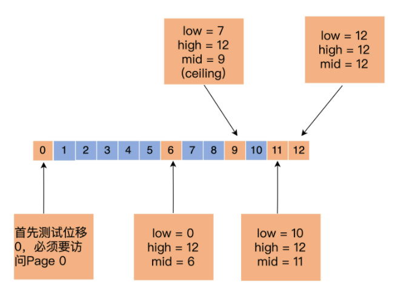
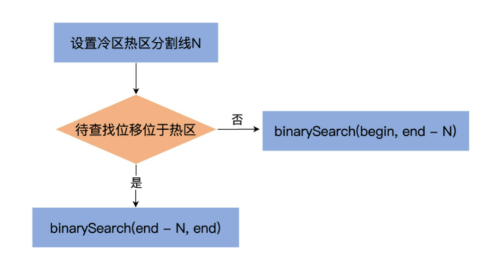
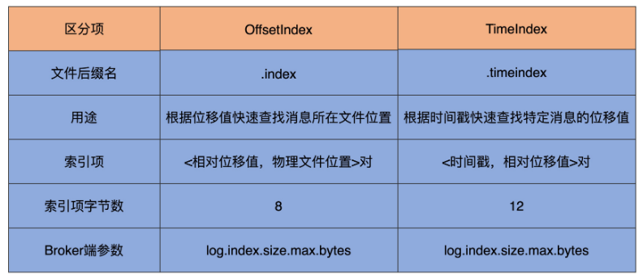
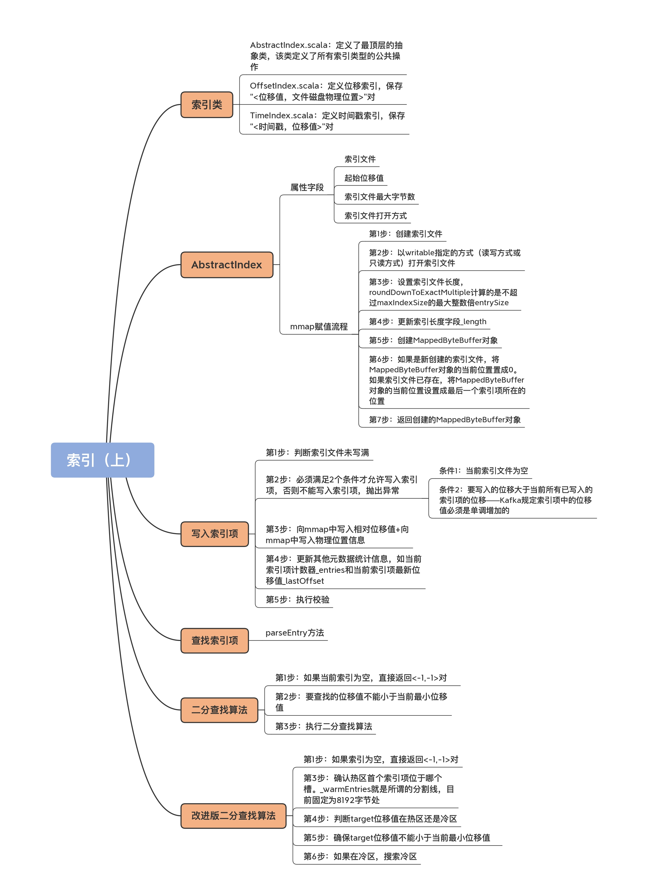

## 1. 索引文件

查看日志文件的内容不需要 sudo 权限，而查看索引文件的内容必须要有 sudo 权限

## 2. 索引类结构

在目录kafka/log目录下，我们可以找到kafka的所有相关的类。

* AbstractIndex.scala

  它定义了最顶层的抽象类，这个类封装了所有索引类型的公共操作。

* LazyIndex.scala

  它定义了 AbstractIndex 上的一个包装类，实现索引项延迟加载。这个类主要是为了提高性能。

* OffsetIndex.scala

  定义位移索引，保存“< 位移值，文件磁盘物理位置 >”对。

* TimeIndex.scala

  定义时间戳索引，保存“< 时间戳，位移值 >”对。

* TransactionIndex.scala

  定义事务索引，为已中止事务（Aborted Transcation）保存重要的元数据信息。只有启用 Kafka 事务后，这个索引才有可能出现。

OffsetIndex、TimeIndex 和 TransactionIndex 都继承了 AbstractIndex 类，LazyIndex 仅仅是包装了一个 AbstractIndex 的实现类，用于延迟加载

## 3. AbstractIndex

### 3.1. 构造参数

​	这个类封装了所有索引类型的公共操作，它是承载索引项的容器，而每个继承它的子类负责定义具体的索引项结构。比如，OffsetIndex 的索引项是 < 位移值，物理磁盘位置 > 对，TimeIndex 的索引项是 < 时间戳，位移值 > 对。

abstractIndex构造方法

```
abstract class AbstractIndex(@volatile private var _file: File, val baseOffset: Long, val maxIndexSize: Int = -1, val writable: Boolean) extends Closeable {
```

该class定义了四个属性

* 索引文件

  每个索引对象在磁盘上都对应了一个索引文件。自 1.1.0 版本之后，Kafka 允许迁移底层的日志路径

* 起始位移值

  索引对象对应日志段对象的起始位移值。日志文件和索引文件都是成组出现的。

  比如说，如果日志文件是 00000000000000000123.log，正常情况下，一定还有一组索引文件 00000000000000000123.index、00000000000000000123.timeindex 等。这里的“123”就是这组文件的起始位移值，也就是 baseOffset 值

* 索引文件最大字节数

  它控制索引文件的最大长度。Kafka 源码传入该参数的值是 Broker 端参数 segment.index.bytes 的值，即 10MB。这就是在默认情况下，所有 Kafka 索引文件大小都是 10MB 的原因

* 索引文件打开方式

  “True”表示以“读写”方式打开，“False”表示以“只读”方式打开

### 3.2. 不同索引项的大小

abstractindex的索引项大小

```
protected def entrySize: Int
```

​	AbstractIndex 类中定义了一个抽象方法 entrySize 来表示不同索引项的大小，子类实现该方法时需要给定自己索引项的大小，对于 OffsetIndex 而言，该值就是 8；对于 TimeIndex 而言，该值是 12。

* OffsetIndex 

  ​	在 OffsetIndex 中，位移值用 4 个字节来表示，物理磁盘位置也用 4 个字节来表示，所以总共是 8 个字节。 AbstractIndex 已经保存了 baseOffset ，这里的位移值，实际上是相对于 baseOffset 的相对位移值，即真实位移值减去 baseOffset 的值。使用相对位移值能够有效地节省磁盘空间。所以只占4个字节。

  ​	Broker 端参数 log.segment.bytes 是整型，这说明，Kafka 中每个日志段文件的大小不会超过 2^32，即 4GB，这就说明同一个日志段文件上的位移值减去 baseOffset 的差值一定在整数范围内。因此，源码只需要 4 个字节保存就行了。

* TimeIndex

  因为时间戳类型是长整型，占用 8 个字节，位移依然使用相对位移值，占用 4 个字节，因此总共需要 12 个字节

### 3.3.  内存映射

​	使用内存映射文件的主要优势在于，它有很高的 I/O 性能，特别是对于索引这样的小文件来说，由于文件内存被直接映射到一段虚拟内存上，访问内存映射文件的速度要快于普通的读写文件速度。

​	而且在很多操作系统中（比如 Linux），这段映射的内存区域实际上就是内核的页缓存（Page Cache）。这就意味着，里面的数据不需要重复拷贝到用户态空间，避免了很多不必要的时间、空间消耗。

​	 AbstractIndex 中，这个 MappedByteBuffer 就是名为 mmap 的变量。

```
@volatile
protected var mmap: MappedByteBuffer = {
  // 第1步：创建索引文件
  val newlyCreated = file.createNewFile()
  // 第2步：以writable指定的方式（读写方式或只读方式）打开索引文件
  val raf = if (writable) new RandomAccessFile(file, "rw") else new RandomAccessFile(file, "r")
  try {
    /* pre-allocate the file if necessary */
    if(newlyCreated) {
    // 预设的索引文件大小不能太小，如果连一个索引项都保存不了，直接抛出异常
      if(maxIndexSize < entrySize)
        throw new IllegalArgumentException("Invalid max index size: " + maxIndexSize)
        
     // 第3步：设置索引文件长度，roundDownToExactMultiple计算的是不超过maxIndexSize的最大整数倍entrySize
     // 比如maxIndexSize=1234567，entrySize=8，那么调整后的文件长度为1234560  
      raf.setLength(roundDownToExactMultiple(maxIndexSize, entrySize))
    }

	// 第4步：更新索引长度字段_length
    /* memory-map the file */
    _length = raf.length()
    val idx = {
      if (writable)
        raf.getChannel.map(FileChannel.MapMode.READ_WRITE, 0, _length)
      else
        raf.getChannel.map(FileChannel.MapMode.READ_ONLY, 0, _length)
    }
    
   // 第6步：如果是新创建的索引文件，将MappedByteBuffer对象的当前位置置成0
   // 如果索引文件已存在，将MappedByteBuffer对象的当前位置设置成最后一个索引项所在的位置
    /* set the position in the index for the next entry */
    if(newlyCreated)
      idx.position(0)
    else
      // if this is a pre-existing index, assume it is valid and set position to last entry
      idx.position(roundDownToExactMultiple(idx.limit(), entrySize))
    // 第7步：返回创建的MappedByteBuffer对象
    idx
  } finally {
    CoreUtils.swallow(raf.close(), AbstractIndex)
  }
}
```

AbstractIndex 其他大部分的操作都是和 mmap 相关：

* 计算索引对象中当前有多少个索引项

  ```
  protected var _entries: Int = mmap.position() / entrySize
  ```

* 计算索引文件最多能容纳多少个索引项

  ```
  private[this] var _maxEntries: Int = mmap.limit() / entrySize
  ```

* 判断当前索引文件是否已经写满

  ```
   def isFull: Boolean = _entries >= _maxEntries
  ```

​	AbstractIndex 中最重要的就是这个 mmap 变量了。事实上，AbstractIndex 继承类实现添加索引项的主要逻辑，也就是向 mmap 中添加对应的字段

## 4. 索引操作

### 4.1. 写入索引项

```
  def append(offset: Long, position: Int): Unit = {
    inLock(lock) {
       // 第1步：判断索引文件未写满
      require(!isFull, "Attempt to append to a full index (size = " + _entries + ").")
      // 第2步：必须满足以下条件之一才允许写入索引项：
      // 条件1：当前索引文件为空
      // 条件2：要写入的位移大于当前所有已写入的索引项的位移——Kafka规定索引项中的位移值必须是单调增加的
      if (_entries == 0 || offset > _lastOffset) {
        trace(s"Adding index entry $offset => $position to ${file.getAbsolutePath}")
        // 第3步A：向mmap中写入相对位移值
        mmap.putInt(relativeOffset(offset))
        // 第3步B：向mmap中写入物理位置信息
        mmap.putInt(position)
        // 第4步：更新其他元数据统计信息，如当前索引项计数器_entries和当前索引项最新位移值_lastOffset
        _entries += 1
        _lastOffset = offset
		// 第5步：执行校验。写入的索引项格式必须符合要求，即索引项个数*单个索引项占用字节数匹配当前文件物理大小，否则说明文件已损坏
        require(_entries * entrySize == mmap.position(), s"$entries entries but file position in index is ${mmap.position()}.")
      } else {
       // 如果第2步中两个条件都不满足，不能执行写入索引项操作，抛出异常
        throw new InvalidOffsetException(s"Attempt to append an offset ($offset) to position $entries no larger than" +
          s" the last offset appended (${_lastOffset}) to ${file.getAbsolutePath}.")
      }
    }
  }
```

### 4.2. 查询索引项

​	索引项的写入逻辑并不复杂，难点在于如何查找索引项。AbstractIndex 定义了抽象方法 **parseEntry** 用于查找给定的索引项，如下所示:

```
protected def parseEntry(buffer: ByteBuffer, n: Int): IndexEntry
```

​	这里的“n”表示要查找给定 ByteBuffer 中保存的第 n 个索引项（在 Kafka 中也称第 n 个槽）。IndexEntry 是源码定义的一个接口，里面有两个方法：indexKey 和 indexValue，分别返回不同类型索引的 <Key，Value> 对。

​	如OffsetIndex实现的parseEntry如下：

```
override protected def parseEntry(buffer: ByteBuffer, n: Int): OffsetPosition = {
  OffsetPosition(baseOffset + relativeOffset(buffer, n), physical(buffer, n))
}
```

​	OffsetPosition 是实现 IndexEntry 的实现类，Key 就是之前说的位移值，而 Value 就是物理磁盘位置值。所以，这里你能看到代码调用了 relativeOffset(buffer, n) + baseOffset 计算出绝对位移值，之后调用 physical(buffer, n) 计算物理磁盘位置，最后将它们封装到一起作为一个独立的索引项返回。

​	有了 parseEntry 方法，我们就能够根据给定的 n 来查找索引项了。

​	我们如何确定要找的索引项在第 n 个槽中呢？

#### 4.2.1. 二分查找算法问题

​	从已排序数组中寻找某个数字最快速的算法就是二分查找了。普通的二分查找当然可以

​	但是大多数操作系统使用页缓存来实现内存映射，而目前几乎所有的操作系统都使用 LRU（Least Recently Used）或类似于 LRU 的机制来管理页缓存。Kafka 写入索引文件的方式是在文件末尾追加写入，而几乎所有的索引查询都集中在索引的尾部。这么来看的话，LRU 机制是非常适合 Kafka 的索引访问场景的。

​	当 Kafka 在查询索引的时候，普通的二分查找算法并没有考虑到缓存的问题，因此很可能会导致一些不必要的缺页中断（Page Fault）。此时，Kafka 线程会被阻塞，等待对应的索引项从物理磁盘中读出并放入到页缓存中。

​	例如，Kafka 的某个索引占用了操作系统页缓存 13 个页（Page），如果待查找的位移值位于最后一个页上，也就是 Page 12，那么标准的二分查找算法会依次读取页号 0、6、9、11 和 12，具体的推演流程如下所示：

   


普通的2分查找问题成因：

* 一个页上保存了成百上千的索引项数据。随着索引文件不断被写入，Page #12 不断地被填充新的索引项。
* 如果此时索引查询方都来自 ISR 副本或 Lag 很小的消费者，那么这些查询大多集中在对 Page #12 的查询
* 因此，Page #0、6、9、11、12 一定经常性地被源码访问。也就是说，这些页一定保存在页缓存上。后面当新的索引项填满了 Page #12，页缓存就会申请一个新的 Page 来保存索引项，即 Page #13。
* 现在，最新索引项保存在 Page #13 中。如果要查找最新索引项，原版二分查找算法将会依次访问 Page #0、7、10、12 和 13。
* 此时，问题来了：Page 7 和 10 已经很久没有被访问过了，它们大概率不在页缓存中
* 因此，一旦索引开始征用 Page #13，就会发生 Page Fault，等待那些冷页数据从磁盘中加载到页缓存。

​	以上就是2分查找因为LRU缓存导致性能问题，根据国外用户的测试，这种加载过程可能长达 1 秒。

​	显然，这是一个普遍的问题，即每当索引文件占用 Page 数发生变化时，就会强行变更二分查找的搜索路径，从而出现不在页缓存的冷数据必须要加载到页缓存的情形，而这种加载过程是非常耗时的。

#### 4.2.2. 二分查找改良

​	基于上面的问题，社区提出了改进版的二分查找策略，也就是缓存友好的搜索算法。总体的思路是，代码将所有索引项分成两个部分：热区（Warm Area）和冷区（Cold Area），然后分别在这两个区域内执行二分查找算法，如下图所示：

 

这个改进版算法是把搜寻区域分成了冷、热两个区域，然后有条件地在不同区域执行普通的二分查找算法。**它能保证那些经常需要被访问的 Page 组合是固定的**，原先同样是查询最热的那部分数据，一旦索引占用了更多的 Page，要遍历的 Page 组合就会发生变化。这是导致性能下降的主要原因，而改进的**查询最热那部分数据所遍历的 Page 永远是固定的，因此大概率在页缓存中，从而避免无意义的 Page Fault**

AbstractIndex中的2分查找源码：

```
private def indexSlotRangeFor(idx: ByteBuffer, target: Long, searchEntity: IndexSearchEntity): (Int, Int) = {
  // 第1步：如果索引为空，直接返回<-1,-1>对
  // check if the index is empty
  if(_entries == 0)
    return (-1, -1)

  // 封装标准二分查找算法
  def binarySearch(begin: Int, end: Int) : (Int, Int) = {
    // binary search for the entry
    var lo = begin
    var hi = end
    while(lo < hi) {
      val mid = (lo + hi + 1) >>> 1
      val found = parseEntry(idx, mid)
      val compareResult = compareIndexEntry(found, target, searchEntity)
      if(compareResult > 0)
        hi = mid - 1
      else if(compareResult < 0)
        lo = mid
      else
        return (mid, mid)
    }
    (lo, if (lo == _entries - 1) -1 else lo + 1)
  }

// 第3步：确认热区首个索引项位于哪个槽。_warmEntries就是所谓的分割线，目前固定为8192字节处
// 如果是OffsetIndex，_warmEntries = 8192 / 8 = 1024，即第1024个槽
// 如果是TimeIndex，_warmEntries = 8192 / 12 = 682，即第682个槽
  val firstHotEntry = Math.max(0, _entries - 1 - _warmEntries)
  // check if the target offset is in the warm section of the index
  // 第4步：判断target位移值在热区还是冷区
  if(compareIndexEntry(parseEntry(idx, firstHotEntry), target, searchEntity) < 0) {
   // 如果在热区，搜索热区
   return binarySearch(firstHotEntry, _entries - 1)
  }

  // 第5步：确保target位移值不能小于当前最小位移值
  // check if the target offset is smaller than the least offset
  if(compareIndexEntry(parseEntry(idx, 0), target, searchEntity) > 0)
    return (-1, 0)

  // 第6步：如果在冷区，搜索冷区
  binarySearch(0, firstHotEntry)
}
```

​	因此，社区在标准原版的基础上，对二分查找算法根据实际访问场景做了定制化的改进。改进版在提升缓存性能方面做努力。改进版能够有效地提升页缓存的使用率，从而在整体上降低物理 I/O，缓解系统负载瓶颈。

**PS：对于改进版二分查找算法中冷区和热区的分割线设定在8192字节处的原理。**

8192这个数字不大不小正合适。所谓不大不小是指它并不是太小，它足以确保大多数lagging很小的follower或consumer都只在热区查询；同时它也不会太大，对于主流4KB大小的page size而言， 热区大约也就只占用2~3个页面应该只是一个经验值。


前面已经分析过，Kafka 索引类型有三大类：

* 位移索引
* 时间戳索引
* 已中止事务索引。

​	相比于最后一类索引，前两类索引的出镜率更高一些。

在 Kafka 的数据路径下，很多.index 和.timeindex 后缀的文件。其中index 文件就是 Kafka 中的位移索引文件，而.timeindex 文件则是时间戳索引文件。

## 5. 位移索引

### 5.1. 索引项的定义

#### 5.1.1. 为什么需要位移索引 

​	位移索引也就是所谓的 OffsetIndex，国内大面积使用 Kafka 应该是在 0.8 时代。从那个时候开始，OffsetIndex 就已经存在了。每当 Consumer 需要从主题分区的某个位置开始读取消息时，Kafka 就会用到 OffsetIndex 直接定位物理文件位置，从而避免了因为从头读取消息而引入的昂贵的 I/O 操作。

​	不同索引类型保存不同的 <Key, Value> 对。就 OffsetIndex 而言，Key 就是消息的相对位移，Value 是保存该消息的日志段文件中该消息第一个字节的物理文件位置。

#### 5.1.2. 相对位移

​	entrySize 定义了单个 <Key, Value> 对所用的字节数。对于 OffsetIndex 来说，entrySize 就是 8，如 OffsetIndex.scala

```
  override def entrySize = 8
```

​	相对位移是一个整型（Integer），占用 4 个字节，物理文件位置也是一个整型，同样占用 4 个字节，因此总共是 8 个字节

​	我们知道，Kafka 中的消息位移值是一个长整型（Long），应该占用 8 个字节才对。但是呢在保存 OffsetIndex 的 <Key, Value> 对时，Kafka 做了一些优化。每个 OffsetIndex 对象在创建时，都已经保存了对应日志段对象的起始位移，因此，OffsetIndex 索引项没必要保存完整的 8 字节位移值。相反地，它只需要保存与起始位移的差值（Delta）就够了，而这个差值是可以被整型容纳的。这种设计可以让 OffsetIndex 每个索引项都节省 4 个字节。假设一个索引文件保存了 1000 个索引项，使用相对位移值就能节省大约 4MB 的空间。

OffsetIndex 定义了专门的方法，用于将一个 Long 型的位移值转换成相对位移：

```
def relativeOffset(offset: Long): Int = {
    val relativeOffset = toRelative(offset)
    if (relativeOffset.isEmpty)
      // 如果无法转换成功（比如差值超过了整型表示范围)，则抛出异常
      throw new IndexOffsetOverflowException(s"Integer overflow for offset: $offset (${file.getAbsoluteFile})")
    relativeOffset.get
}
```

relativeOffset 方法调用了父类的 toRelative 方法执行真正的转换。我们来看一下 toRelative 方法的实现：

```
private def toRelative(offset: Long): Option[Int] = {
  val relativeOffset = offset - baseOffset
  if (relativeOffset < 0 || relativeOffset > Int.MaxValue)
    None
  else
    Some(relativeOffset.toInt)
}
```

逻辑很简单：

* 第一步是计算给定的 offset 值与 baseOffset 的差值；
* 第二步是校验该差值不能是负数或不能超过整型表示范围。如果校验通过，就直接返回该差值作为相对位移值
* 否则就返回 None 表示转换失败

#### 5.1.3. 完整位移

当读取 OffsetIndex 时，源码还需要将相对位移值还原成之前的完整位移。这个是在 parseEntry 方法中实现的

```
override protected def parseEntry(buffer: ByteBuffer, n: Int): OffsetPosition = {
  OffsetPosition(baseOffset + relativeOffset(buffer, n), physical(buffer, n))
}
```

**这里的 parseEntry 方法，就是要构造 OffsetPosition 所需的 Key 和 Value**。最后parseEntry 方法把 Key 和 Value 封装到一个 OffsetPosition 实例中，然后将这个实例返回。该类有两个方法，分别返回索引项的 Key 和 Value

* Key 是索引项中的完整位移值，**代码使用 baseOffset + relativeOffset(buffer, n) 的方式将相对位移值还原成完整位移值**；

* Value 是这个位移值上消息在日志段文件中的物理位置，代码调用 physical 方法计算这个物理位置并把它作为 Value。

​	由于索引文件的总字节数就是索引项字节数乘以索引项数，因此，代码结合 entrySize 和 buffer.getInt 方法能够轻松地计算出第 n 个索引项所处的物理文件位置。这就是 physical 方法做的事情

### 5.2. 写入索引项

我们来看下 OffsetIndex 中最重要的操作——**写入索引项 append 方法的实现**

写入索引项的方法需要传入两个参数：**Long 型的位移值**和 **Integer 型的物理文件位置**。

**该方法最重要的两步，就是分别向 mmap 写入相对位移值和物理文件位置**

```
def append(offset: Long, position: Int): Unit = {
  inLock(lock) {
    // 索引文件如果已经写满，直接抛出异常
    require(!isFull, "Attempt to append to a full index (size = " + _entries + ").")
    // 要保证待写入的位移值offset比当前索引文件中所有现存的位移值都要大
    // 这主要是为了维护索引的单调增加性
    if (_entries == 0 || offset > _lastOffset) {
      trace(s"Adding index entry $offset => $position to ${file.getAbsolutePath}")
      mmap.putInt(relativeOffset(offset)) // 向mmap写入相对位移值
      mmap.putInt(position) // 向mmap写入物理文件位置
      _entries += 1 // 更新索引项个数
      _lastOffset = offset // 更新当前索引文件最大位移值
      // 确保写入索引项格式符合要求
      require(_entries * entrySize == mmap.position(), s"$entries entries but file position in index is ${mmap.position()}.")
    } else {
      throw new InvalidOffsetException(s"Attempt to append an offset ($offset) to position $entries no larger than" +
        s" the last offset appended (${_lastOffset}) to ${file.getAbsolutePath}.")
    }
  }
}
```

* 给定位移不满足单调增加性，抛出异常
* 给定位移满足单调增加性，然后接着：
  * 向mmap写入相对位移值
  * 向mmap写入物理文件位置
  * 更新元数据（索引项个数、当前最大位移值）
  * 校验索引格式

### 5.3. 索引截断

​	索引还有一个常见的操作：截断操作（Truncation）。**截断操作是指，将索引文件内容直接裁剪掉一部分**。比如，OffsetIndex 索引文件中当前保存了 100 个索引项，我想只保留最开始的 40 个索引项。源码定义了 truncateToEntries 方法来实现这个需求：

```
private def truncateToEntries(entries: Int): Unit = {
  inLock(lock) {
    _entries = entries
    mmap.position(_entries * entrySize)
    _lastOffset = lastEntry.offset
    debug(s"Truncated index ${file.getAbsolutePath} to $entries entries;" +
      s" position is now ${mmap.position()} and last offset is now ${_lastOffset}")
  }
}

```

这个方法接收 entries 参数，表示**要截取到哪个槽**，主要的逻辑实现是调用 mmap 的 position 方法。

源码中的 _entries * entrySize 就是 mmap 要截取到的字节处

### 5.4. 索引查询

```
def lookup(targetOffset: Long): OffsetPosition = {
  maybeLock(lock) {
    val idx = mmap.duplicate // 使用私有变量复制出整个索引映射区
    // largestLowerBoundSlotFor方法底层使用了改进版的二分查找算法寻找对应的槽
    val slot = largestLowerBoundSlotFor(idx, targetOffset, IndexSearchType.KEY)
    // 如果没找到，返回一个空的位置，即物理文件位置从0开始，表示从头读日志文件
  // 否则返回slot槽对应的索引项
    if(slot == -1)
      OffsetPosition(baseOffset, 0)
    else
      parseEntry(idx, slot)
  }
}

```

该方法返回的是不大于给定位移值 targetOffset 的最大位移值，以及对应的物理文件位置。我们可以可以把这个方法，理解为位移值的 FLOOR 函数

## 6. 时间戳索引

### 6.1. 索引项的定义

与 OffsetIndex 不同的是，TimeIndex 保存的是 < 时间戳，相对位移值 > 对。

时间戳需要一个长整型来保存，相对位移值使用 Integer 来保存。

因此，TimeIndex 单个索引项需要占用 12 个字节。这也揭示了一个重要的事实：

**在保存同等数量索引项的基础上，TimeIndex 会比 OffsetIndex 占用更多的磁盘空间**

### 6.2. 写入索引项

TimeIndex 也有 append 方法，只不过它叫作 maybeAppend：

```
def maybeAppend(timestamp: Long, offset: Long, skipFullCheck: Boolean = false): Unit = {
  inLock(lock) {
    if (!skipFullCheck)
      // 如果索引文件已写满，抛出异常
      require(!isFull, "Attempt to append to a full time index (size = " + _entries + ").")
    // 确保索引单调增加性
    if (_entries != 0 && offset < lastEntry.offset)
      throw new InvalidOffsetException(s"Attempt to append an offset ($offset) to slot ${_entries} no larger than" +
        s" the last offset appended (${lastEntry.offset}) to ${file.getAbsolutePath}.")
    // 确保时间戳的单调增加性
    if (_entries != 0 && timestamp < lastEntry.timestamp)
      throw new IllegalStateException(s"Attempt to append a timestamp ($timestamp) to slot ${_entries} no larger" +
        s" than the last timestamp appended (${lastEntry.timestamp}) to ${file.getAbsolutePath}.")
    if (timestamp > lastEntry.timestamp) {
      trace(s"Adding index entry $timestamp => $offset to ${file.getAbsolutePath}.")
      mmap.putLong(timestamp) // 向mmap写入时间戳
      mmap.putInt(relativeOffset(offset)) // 向mmap写入相对位移值
      _entries += 1 // 更新索引项个数
      _lastEntry = TimestampOffset(timestamp, offset) // 更新当前最新的索引项
      require(_entries * entrySize == mmap.position(), s"${_entries} entries but file position in index is ${mmap.position()}.")
    }
  }
}
```

* 和 OffsetIndex 类似，向 TimeIndex 写入索引项的主体逻辑，是向 mmap 分别写入时间戳和相对位移值。
* **除了校验位移值的单调增加性之外，TimeIndex 还会确保顺序写入的时间戳也是单调增加的**

这个时间戳索引可以帮助我们的消费者端程序根据时间戳信息去过滤待读取的消息时

## 7. 总结

虽然 OffsetIndex 和 TimeIndex 是不同类型的索引，但 Kafka 内部是把二者结合使用的。通常的流程是，先使用 TimeIndex 寻找满足时间戳要求的消息位移值，然后再利用 OffsetIndex 去定位该位移值所在的物理文件位置。因此，它们其实是合作的关系

 

 

6. 
