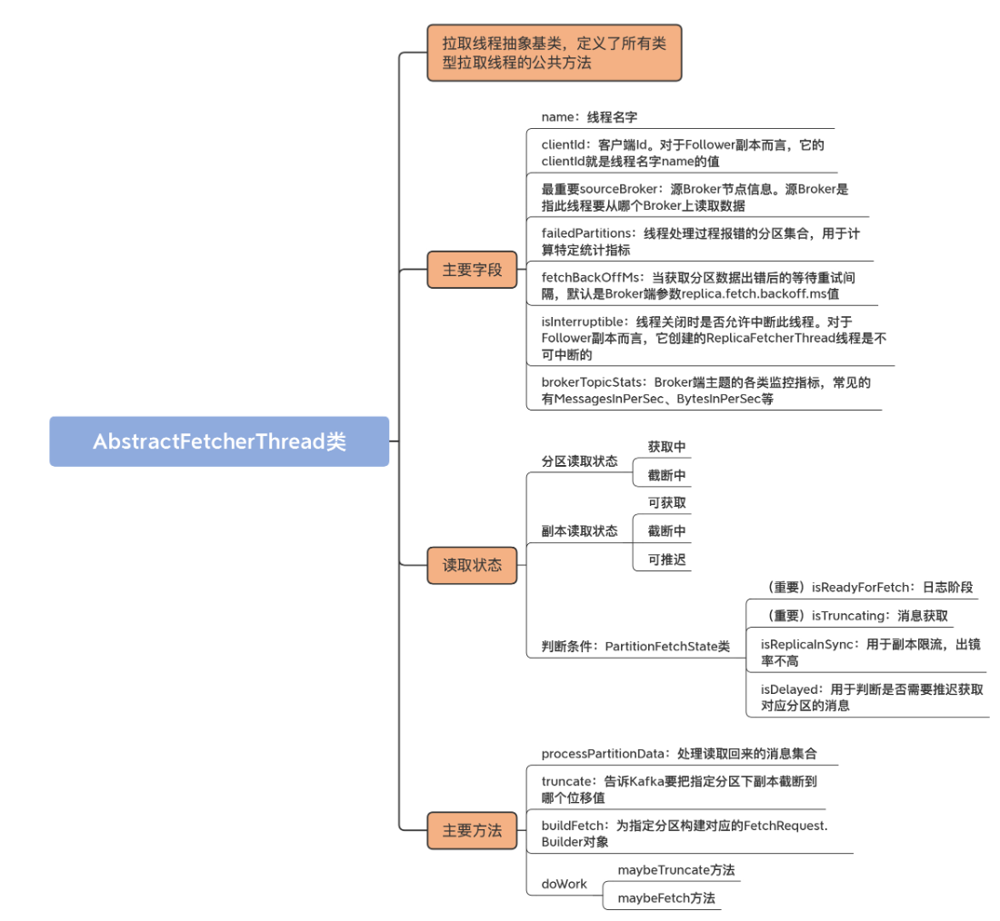
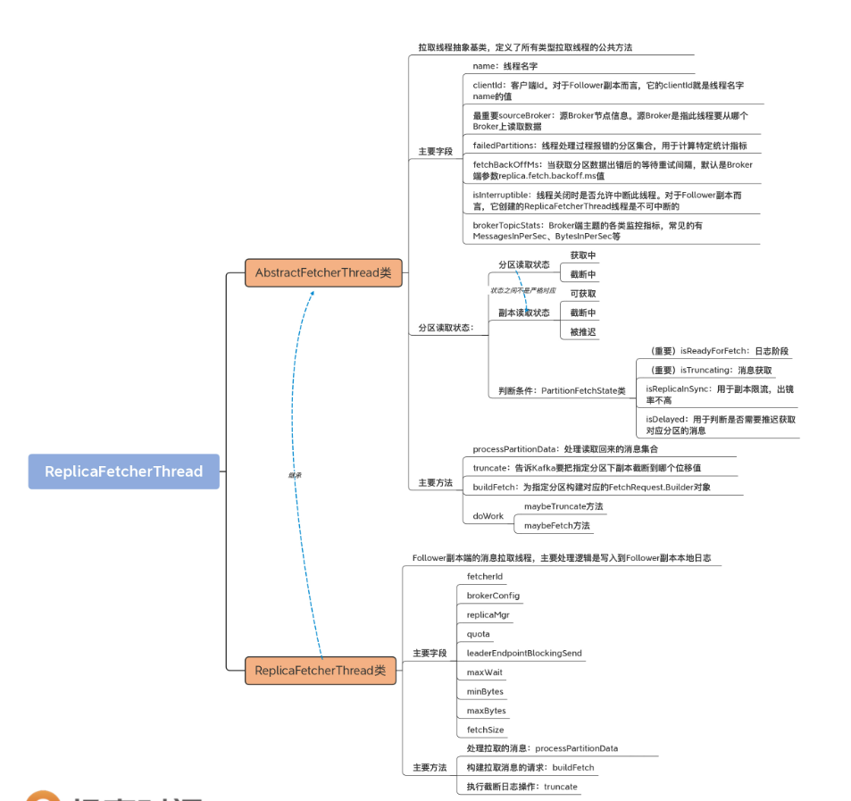
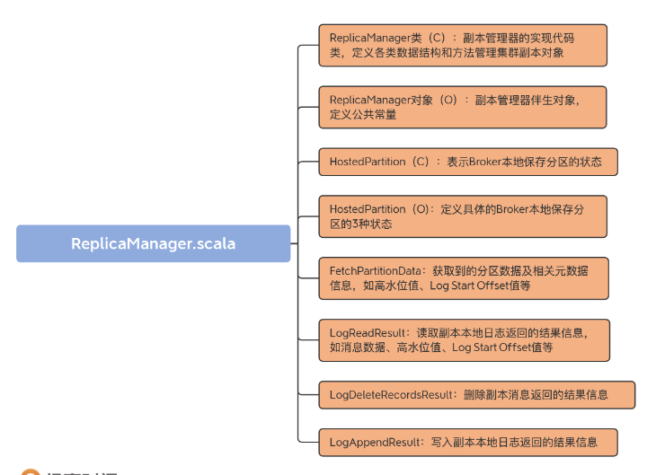
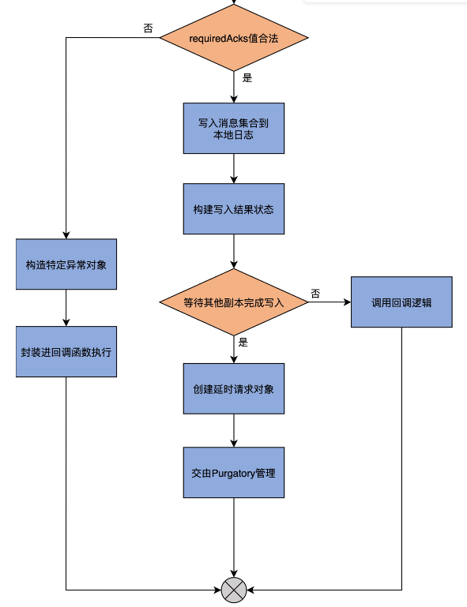
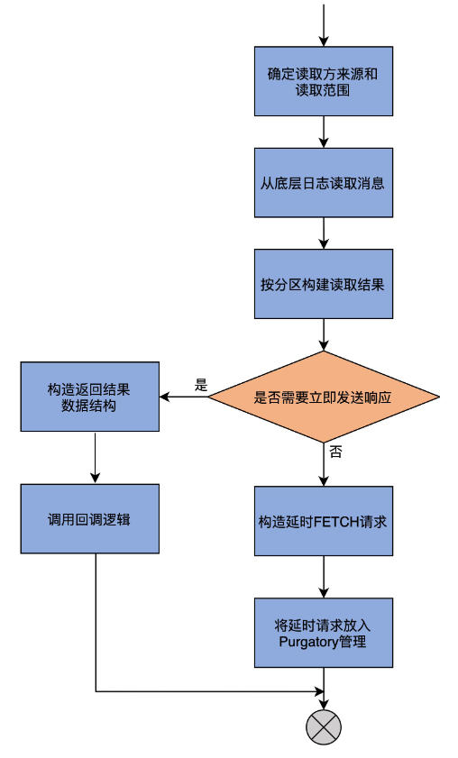
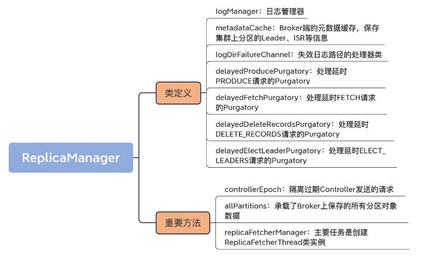
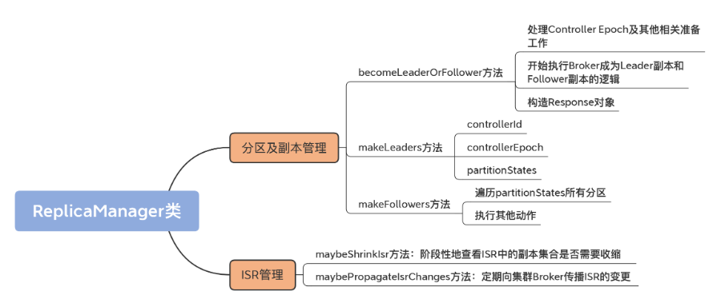
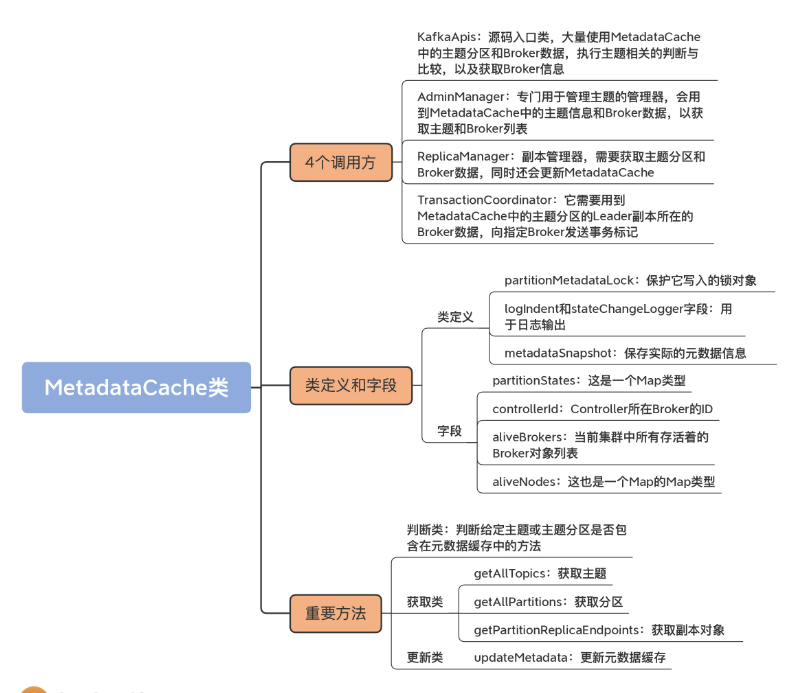

## 1. 开头

## 2. AbstractFetcherThread

### 2.1. 定义

```

abstract class AbstractFetcherThread(
  name: String,  // 线程名称
  clientId: String,  // Client Id，用于日志输出
  val sourceBroker: BrokerEndPoint,  // 数据源Broker地址
  failedPartitions: FailedPartitions,  // 处理过程中出现失败的分区
  fetchBackOffMs: Int = 0,  // 获取操作重试间隔
  isInterruptible: Boolean = true,  // 线程是否允许被中断
  val brokerTopicStats: BrokerTopicStats) // Broker端主题监控指标
  extends ShutdownableThread(name, isInterruptible) {
  // 定义FetchData类型表示获取的消息数据
  type FetchData = FetchResponse.PartitionData[Records]
  // 定义EpochData类型表示Leader Epoch数据
  type EpochData = OffsetsForLeaderEpochRequest.PartitionData
  private val partitionStates = new PartitionStates[PartitionFetchState]
  ......
}

```

name：线程名字。

sourceBroker：源 Broker 节点信息。源 Broker 是指此线程要从哪个 Broker 上读取数据。

failedPartitions：线程处理过程报错的分区集合。

fetchBackOffMs：当获取分区数据出错后的等待重试间隔，默认是 Broker 端参数 replica.fetch.backoff.ms 值。

brokerTopicStats：Broker 端主题的各类监控指标，常见的有 MessagesInPerSec、BytesInPerSec 等。

这些字段中比较重要的是 **sourceBroker**，因为它决定 Follower 副本从哪个 Broker 拉取数据，也就是 Leader 副本所在的 Broker 是哪台

#### 2.1.1. PartitionData

```
public static final class PartitionData<T extends BaseRecords> {
    public final Errors error;           // 错误码
    public final long highWatermark;     // 高水位值
    public final long lastStableOffset;  // 最新LSO值 
    public final long logStartOffset;    // 最新Log Start Offset值
    // 期望的Read Replica
    // KAFKA 2.4之后支持部分Follower副本可以对外提供读服务
    public final Optional<Integer> preferredReadReplica;
    // 该分区对应的已终止事务列表
    public final List<AbortedTransaction> abortedTransactions;
    // 消息集合，最重要的字段！
    public final T records;
    // 构造函数......
}
```

PartitionData 这个类定义的字段中，除了我们已经非常熟悉的 highWatermark 和 logStartOffset 等字段外，还有一些属于比较高阶的用法：

preferredReadReplica，用于指定可对外提供读服务的 Follower 副本；

abortedTransactions，用于保存该分区当前已终止事务列表；

lastStableOffset 是最新的 LSO 值，属于 Kafka 事务的概念。

关于这几个字段，你只要了解它们的基本作用就可以了。实际上，在 PartitionData 这个类中，最需要你重点关注的是 **records 字段**。因为它保存实际的消息集合，而这是我们最关心的数据。

说到这里，如果你去查看 EpochData 的定义，能发现它也是 PartitionData 类型。但，你一定要注意的是，EpochData 的 PartitionData 是 OffsetsForLeaderEpochRequest 的 PartitionData 类型。

事实上，**在 Kafka 源码中，有很多名为 PartitionData 的嵌套类**。很多请求类型中的数据都是按分区层级进行分组的，因此源码很自然地在这些请求类中创建了同名的嵌套类。我们在查看源码时，一定要注意区分 PartitionData 嵌套类是定义在哪类请求中的，不同类型请求中的 PartitionData 类字段是完全不同的

#### 2.1.2. **PartitionFetchState**

**PartitionStates[PartitionFetchState]**类型的字段.表征分区读取状态的，保存的是分区的已读取位移值和对应的副本状态

注意这里的状态有两个，一个是分区读取状态，一个是副本读取状态。副本读取状态由 ReplicaState 接口表示，如下所示：

```
sealed trait ReplicaState

// 截断中

case object Truncating extends ReplicaState

// 获取中

case object Fetching extends ReplicaState
```

可见，副本读取状态有截断中和获取中两个：当副本执行截断操作时，副本状态被设置成 Truncating；当副本被读取时，副本状态被设置成 Fetching。

而分区读取状态有 3 个，分别是：

可获取，表明副本获取线程当前能够读取数据。

截断中，表明分区副本正在执行截断操作（比如该副本刚刚成为 Follower 副本）。

被推迟，表明副本获取线程获取数据时出现错误，需要等待一段时间后重试。

值得注意的是，分区读取状态中的可获取、截断中与副本读取状态的获取中、截断中两个状态并非严格对应的。换句话说，副本读取状态处于获取中，并不一定表示分区读取状态就是可获取状态。对于分区而言，它是否能够被获取的条件要比副本严格一些。

接下来，我们就来看看这 3 类分区获取状态的源码定义：

```
case class PartitionFetchState(fetchOffset: Long,

  lag: Option[Long],

  currentLeaderEpoch: Int,

  delay: Option[DelayedItem],

  state: ReplicaState) {

  // 分区可获取的条件是副本处于Fetching且未被推迟执行

  def isReadyForFetch: Boolean = state == Fetching && !isDelayed

  // 副本处于ISR的条件：没有lag

  def isReplicaInSync: Boolean = lag.isDefined && lag.get <= 0

  // 分区处于截断中状态的条件：副本处于Truncating状态且未被推迟执行

  def isTruncating: Boolean = state == Truncating && !isDelayed

  // 分区被推迟获取数据的条件：存在未过期的延迟任务

  def isDelayed: Boolean = 

​    delay.exists(_.getDelay(TimeUnit.MILLISECONDS) > 0)

  ......

}
```

这段源码中有 4 个方法，你只要重点了解 isReadyForFetch 和 isTruncating 这两个方法即可。因为副本获取线程做的事情就是这两件：日志截断和消息获取。

至于 isReplicaInSync，它被用于副本限流，出镜率不高。而 isDelayed，是用于判断是否需要推迟获取对应分区的消息。源码会不断地调整那些不需要推迟的分区的读取顺序，以保证读取的公平性。

这个公平性，其实就是在 partitionStates 字段的类型 PartitionStates 类中实现的。这个类是在 clients 工程中定义的。它本质上会接收一组要读取的主题分区，然后以轮询的方式依次读取这些分区以确保公平性。

鉴于咱们这门儿课聚焦于 Broker 端源码，因此，这里我只是简单和你说下这个类的实现原理。如果你想要深入理解这部分内容，可以翻开 clients 端工程的源码，自行去探索下这部分的源码。

```
public class PartitionStates<S> {
    private final LinkedHashMap<TopicPartition, S> map = new LinkedHashMap<>();
    ......
    public void updateAndMoveToEnd(TopicPartition topicPartition, S state) {
      map.remove(topicPartition);
      map.put(topicPartition, state);
      updateSize();
    }
    ......
}
```

前面说过了，PartitionStates 类用轮询的方式来处理要读取的多个分区。那具体是怎么实现的呢？简单来说，就是依靠 LinkedHashMap 数据结构来保存所有主题分区。LinkedHashMap 中的元素有明确的迭代顺序，通常就是元素被插入的顺序。

假设 Kafka 要读取 5 个分区上的消息：A、B、C、D 和 E。如果插入顺序就是 ABCDE，那么自然首先读取分区 A。一旦 A 被读取之后，为了确保各个分区都有同等机会被读取到，代码需要将 A 插入到分区列表的最后一位，这就是 updateAndMoveToEnd 方法要做的事情。

具体来说，就是把 A 从 map 中移除掉，然后再插回去，这样 A 自然就处于列表的最后一位了。大体上，PartitionStates 类就是做这个用的。

### 2.2. 重要方法

 processPartitionData、truncate、buildFetch 和 doWork

#### 2.2.1. **processPartitionData**

用于处理读取回来的消息集合。它是一个抽象方法，因此需要子类实现它的逻辑。具体到 Follower 副本而言， 是由 ReplicaFetcherThread 类实现的

```
protected def processPartitionData(

  topicPartition: TopicPartition,  // 读取哪个分区的数据

  fetchOffset: Long,               // 读取到的最新位移值

  partitionData: FetchData         // 读取到的分区消息数据

): Option[LogAppendInfo]           // 写入已读取消息数据前的元数据
```

我们需要重点关注的字段是，该方法的返回值 Option[LogAppendInfo]：

* 对于 Follower 副本读消息写入日志而言，你可以忽略这里的 Option，因为它肯定会返回具体的 LogAppendInfo 实例，而不会是 None。

* 至于 LogAppendInfo 类，我们在“日志模块”中已经介绍过了。它封装了很多消息数据被写入到日志前的重要元数据信息，比如首条消息的位移值、最后一条消息位移值、最大时间戳等。

#### 2.2.2. **truncate**

```
protected def truncate(
  topicPartition: TopicPartition, // 要对哪个分区下副本执行截断操作
  truncationState: OffsetTruncationState  // Offset + 截断状态
): Unit
```

这里的 OffsetTruncationState 类封装了一个位移值和一个截断完成与否的布尔值状态。它的主要作用是，告诉 Kafka 要把指定分区下副本截断到哪个位移值

#### 2.2.3. **buildFetch** 

```
protected def buildFetch(
  // 一组要读取的分区列表
  // 分区是否可读取取决于PartitionFetchState中的状态
  partitionMap: Map[TopicPartition, PartitionFetchState]): 
// 封装FetchRequest.Builder对象
ResultWithPartitions[Option[ReplicaFetch]]
```

为指定分区构建对应的 FetchRequest.Builder 对象，而该对象是构建 FetchRequest 的核心组件.

Kafka 中任何类型的消息读取，都是通过给指定 Broker 发送 FetchRequest 请求来完成的.

#### 2.2.4. **doWork** 

**串联前面 3 个方法的主要入口方法，也是 AbstractFetcherThread** 类的核心方法。因此，我们要多花点时间，弄明白这些方法是怎么组合在一起共同工作的。

### 2.3. 小结

 

* AbstractFetcherThread 类

  拉取线程的抽象基类。它定义了公共方法来处理所有拉取线程都要实现的逻辑，如执行截断操作，获取消息等。

* 拉取线程逻辑

  循环执行截断操作和获取数据操作。

* 分区读取状态

  当前，源码定义了 3 类分区读取状态。拉取线程只能拉取处于可读取状态的分区的数据

## 3. ReplicaFetcherThread

### doWork 

```

override def doWork(): Unit = {
  maybeTruncate()   // 执行副本截断操作
  maybeFetch()      // 执行消息获取操作
}
```

AbstractFetcherThread 线程只要一直处于运行状态，就是会不断地重复这两个操作。获取消息这个逻辑容易理解，但是为什么 AbstractFetcherThread 线程总要不断尝试去做截断呢？

这是因为，分区的 Leader 可能会随时发生变化。每当有新 Leader 产生时，Follower 副本就必须主动执行截断操作，将自己的本地日志裁剪成与 Leader 一模一样的消息序列，甚至，Leader 副本本身也需要执行截断操作，将 LEO 调整到分区高水位处。

#### maybeTruncate

```
private def maybeTruncate(): Unit = {
  // 将所有处于截断中状态的分区依据有无Leader Epoch值进行分组
  val (partitionsWithEpochs, partitionsWithoutEpochs) = fetchTruncatingPartitions()
  // 对于有Leader Epoch值的分区，将日志截断到Leader Epoch值对应的位移值处
  if (partitionsWithEpochs.nonEmpty) {
    truncateToEpochEndOffsets(partitionsWithEpochs)
  }
  // 对于没有Leader Epoch值的分区，将日志截断到高水位值处
  if (partitionsWithoutEpochs.nonEmpty) {
    truncateToHighWatermark(partitionsWithoutEpochs)
  }
}

```


首先，是对分区状态进行分组。既然是做截断操作的，那么该方法操作的就只能是处于截断中状态的分区。代码会判断这些分区是否存在对应的 Leader Epoch 值，并按照有无 Epoch 值进行分组。这就是 fetchTruncatingPartitions 方法做的事情

#### maybeFetch

第 1 步，为 partitionStates 中的分区构造 FetchRequest 对象，严格来说是 FetchRequest.Builder 对象。构造了 Builder 对象之后，通过调用其 build 方法，就能创建出所需的 FetchRequest 请求对象。

这里的 partitionStates 中保存的是，要去获取消息的一组分区以及对应的状态信息。这一步的输出结果是两个对象：

一个对象是 ReplicaFetch，即要读取的分区核心信息 + FetchRequest.Builder 对象。而这里的核心信息，就是指要读取哪个分区，从哪个位置开始读，最多读多少字节，等等。

另一个对象是一组出错分区。

第 2 步，处理这组出错分区。处理方式是将这组分区加入到有序 Map 末尾等待后续重试。如果发现当前没有任何可读取的分区，代码会阻塞等待一段时间。

第 3 步，发送 FETCH 请求给对应的 Leader 副本，并处理相应的 Response，也就是 processFetchRequest 方法要做的事情

##### processFetchRequest 

分为以下 3 大部分。

* 第 1 步，调用 fetchFromLeader 方法给 Leader 发送 FETCH 请求，并阻塞等待 Response 的返回，然后更新 FETCH 请求发送速率的监控指标。
* 第 2 步，拿到 Response 之后，代码从中取出分区的核心信息，然后比较要读取的位移值，和当前 AbstractFetcherThread 线程缓存的、该分区下一条待读取的位移值是否相等，以及当前分区是否处于可获取状态。如果不满足这两个条件，说明这个 Request 可能是一个之前等待了许久都未处理的请求，压根就不用处理了。相反，如果满足这两个条件且 Response 没有错误，代码会提取 Response 中的 Leader Epoch 值，然后交由子类实现具体的 Response 处理，也就是调用 processPartitionData 方法。之后将该分区放置在有序 Map 的末尾以保证公平性。而如果该 Response 有错误，那么就调用对应错误的定制化处理逻辑，然后将出错分区加入到出错分区列表中。
* 第 3 步，调用 handlePartitionsWithErrors 方法，统一处理上一步处理过程中出现错误的分区

### ReplicaFetcherThread

#### 类定义及字段

```
class ReplicaFetcherThread(name: String,
                           fetcherId: Int,
                           sourceBroker: BrokerEndPoint,
                           brokerConfig: KafkaConfig,
                           failedPartitions: FailedPartitions,
                           replicaMgr: ReplicaManager,
                           metrics: Metrics,
                           time: Time,
                           quota: ReplicaQuota,
                           leaderEndpointBlockingSend: Option[BlockingSend] = None)
  extends AbstractFetcherThread(name = name,
                                clientId = name,
                                sourceBroker = sourceBroker,
                                failedPartitions,
                                fetchBackOffMs = brokerConfig.replicaFetchBackoffMs,
                                isInterruptible = false,
                                replicaMgr.brokerTopicStats) {
  // 副本Id就是副本所在Broker的Id
  private val replicaId = brokerConfig.brokerId
  ......
  // 用于执行请求发送的类
  private val leaderEndpoint = leaderEndpointBlockingSend.getOrElse(
    new ReplicaFetcherBlockingSend(sourceBroker, brokerConfig, metrics, time, fetcherId,
      s"broker-$replicaId-fetcher-$fetcherId", logContext))
  // Follower发送的FETCH请求被处理返回前的最长等待时间
  private val maxWait = brokerConfig.replicaFetchWaitMaxMs
  // 每个FETCH Response返回前必须要累积的最少字节数
  private val minBytes = brokerConfig.replicaFetchMinBytes
  // 每个合法FETCH Response的最大字节数
  private val maxBytes = brokerConfig.replicaFetchResponseMaxBytes
  // 单个分区能够获取到的最大字节数
  private val fetchSize = brokerConfig.replicaFetchMaxBytes
  // 维持某个Broker连接上获取会话状态的类
  val fetchSessionHandler = new FetchSessionHandler(
    logContext, sourceBroker.id)
  ......
}
```


##### 基础字段

ReplicaFetcherThread 类的定义代码虽然有些长，但你会发现没那么难懂，因为构造函数中的大部分字段我们上节课都学习过了。现在，我们只要学习 ReplicaFetcherThread 类特有的几个字段就可以了。

- fetcherId

  Follower 拉取的线程 Id，也就是线程的编号。单台 Broker 上，允许存在多个 ReplicaFetcherThread 线程。Broker 端参数 num.replica.fetchers，决定了 Kafka 到底创建多少个 Follower 拉取线程。

- brokerConfig

  KafkaConfig 类实例。虽然我们没有正式学习过它的源码，但之前学过的很多组件代码中都有它的身影。它封装了 Broker 端所有的参数信息。同样地，ReplicaFetcherThread 类也是通过它来获取 Broker 端指定参数的值。

- replicaMgr

  副本管理器。该线程类通过副本管理器来获取分区对象、副本对象以及它们下面的日志对象。

- quota

  用做限流。限流属于高阶用法，如果你想深入理解这部分内容的话，可以自行阅读 ReplicationQuotaManager 类的源码。现在，只要你下次在源码中碰到 quota 字样的，知道它是用作 Follower 副本拉取速度控制就行了。

- leaderEndpointBlockingSend

  这是用于实现同步发送请求的类。所谓的同步发送，是指该线程使用它给指定 Broker 发送请求，然后线程处于阻塞状态，直到接收到 Broker 返回的 Response。

##### 消息字段

除了构造函数中定义的字段之外，ReplicaFetcherThread 类还定义了与消息获取息息相关的 4 个字段。

maxWait：Follower 发送的 FETCH 请求被处理返回前的最长等待时间。它是 Broker 端参数 replica.fetch.wait.max.ms 的值。

minBytes：每个 FETCH Response 返回前必须要累积的最少字节数。它是 Broker 端参数 replica.fetch.min.bytes 的值。

maxBytes：每个合法 FETCH Response 的最大字节数。它是 Broker 端参数 replica.fetch.response.max.bytes 的值。

fetchSize：单个分区能够获取到的最大字节数。它是 Broker 端参数 replica.fetch.max.bytes 的值。

这 4 个参数都是 FETCH 请求的参数，主要控制了 Follower 副本拉取 Leader 副本消息的行为，比如一次请求到底能够获取多少字节的数据，或者当未达到累积阈值时，FETCH 请求等待多长时间等

#### 重要方法

 3个重要方法：processPartitionData、buildFetch 和 truncate代表了 Follower 副本拉取线程要做的最重要的三件事：处理拉取的消息、构建拉取消息的请求，以及执行截断日志操作

##### processPartitionData 

processPartitionData 方法中的 process，实际上就是写入 Follower 副本本地日志的意思。因此，这个方法的主体逻辑，就是调用分区对象 Partition 的 appendRecordsToFollowerOrFutureReplica 写入获取到的消息。如果你沿着这个写入方法一路追下去，就会发现它调用的是我们在第 2 讲中讲到过的 appendAsFollower 方法。你看一切都能串联起来，源码也没什么大不了的，对吧？

当然，仅仅写入日志还不够。我们还要做一些更新操作。比如，需要更新 Follower 副本的高水位值，即将 FETCH 请求 Response 中包含的高水位值作为新的高水位值，同时代码还要尝试更新 Follower 副本的 Log Start Offset 值。

那为什么 Log Start Offset 值也可能发生变化呢？这是因为 Leader 的 Log Start Offset 可能发生变化，比如用户手动执行了删除消息的操作等。Follower 副本的日志需要和 Leader 保持严格的一致，因此，如果 Leader 的该值发生变化，Follower 自然也要发生变化，以保持一致。

除此之外，processPartitionData 方法还会更新其他一些统计指标值，最后将写入结果返回

##### buildFetch

接下来， 我们看下 buildFetch 方法。此方法的主要目的是，构建发送给 Leader 副本所在 Broker 的 FETCH 请求 

这个方法的逻辑比 processPartitionData 简单。前面说到过，它就是构造 FETCH 请求的 Builder 对象然后返回。有了 Builder 对象，我们就可以分分钟构造出 FETCH 请求了，仅需要调用 builder.build() 即可。

当然，这个方法的一个副产品是汇总出错分区，这样的话，调用方后续可以统一处理这些出错分区。值得一提的是，在构造 Builder 的过程中，源码会用到 ReplicaFetcherThread 类定义的那些与消息获取相关的字段，如 maxWait、minBytes 和 maxBytes

##### truncate

最后，我们看下 truncate 方法的实现。这个方法的主要目的是对给定分区执行日志截断操作。

总体来说，truncate 方法利用给定的 offsetTruncationState 的 offset 值，对给定分区的本地日志进行截断操作。该操作由 Partition 对象的 truncateTo 方法完成，但实际上底层调用的是 Log 的 truncateTo 方法。truncateTo 方法的主要作用，是将日志截断到小于给定值的最大位移值处

### 小结

AbstractFetcherThread 线程的 doWork 方法把上一讲提到的 3 个重要方法全部连接在一起，共同完整了拉取线程要执行的逻辑，即日志截断（truncate）+ 日志获取（buildFetch）+ 日志处理（processPartitionData），而其子类 ReplicaFetcherThread 类是真正实现该 3 个方法的地方。如果用一句话归纳起来，那就是：Follower 副本利用 ReplicaFetcherThread 线程实时地从 Leader 副本拉取消息并写入到本地日志，从而实现了与 Leader 副本之间的同步。以下是一些要点：

doWork 方法：拉取线程工作入口方法，联结所有重要的子功能方法，如执行截断操作，获取 Leader 副本消息以及写入本地日志。

truncate 方法：根据 Leader 副本返回的位移值和 Epoch 值执行本地日志的截断操作。

buildFetch 方法：为一组特定分区构建 FetchRequest 对象所需的数据结构。

processPartitionData 方法：处理从 Leader 副本获取到的消息，主要是写入到本地日志中。

 

## 4. ReplicaManager

ReplicaManager 类是 Kafka Broker 端管理分区和副本对象的重要组件。每个 Broker 在启动的时候，都会创建 ReplicaManager 实例。该实例一旦被创建，就会开始行使副本管理器的职责，对其下辖的 Leader 副本或 Follower 副本进行管理。

* ReplicaManager 类

  副本管理器的具体实现代码，里面定义了读写副本、删除副本消息的方法，以及其他的一些管理方法。

* allPartitions 字段

  承载了 Broker 上保存的所有分区对象数据。ReplicaManager 类通过它实现对分区下副本的管理。

* replicaFetcherManager 字段

  创建 ReplicaFetcherThread 类实例，该线程类实现 Follower 副本向 Leader 副本实时拉取消息的逻辑。

### 4.1. 代码结构

 

* ReplicaManager 类

  它是副本管理器的具体实现代码，里面定义了读写副本、删除副本消息的方法以及其他管理方法。

* ReplicaManager 对象

  ReplicaManager 类的伴生对象，仅仅定义了 3 个常量。

* HostedPartition 及其实现对象

  表示 Broker 本地保存的分区对象的状态。可能的状态包括：不存在状态（None）、在线状态（Online）和离线状态（Offline）。

* FetchPartitionData

  定义获取到的分区数据以及重要元数据信息，如高水位值、Log Start Offset 值等。

* LogReadResult

  表示副本管理器从副本本地日志中**读取**到的消息数据以及相关元数据信息，如高水位值、Log Start Offset 值等。

* LogDeleteRecordsResult

  表示副本管理器执行副本日志**删除**操作后返回的结果信息。

* LogAppendResult

  表示副本管理器执行副本日志**写入**操作后返回的结果信息

FetchPartitionData 和 LogReadResult 很类似，它们的区别在哪里呢？

其实，它们之间的差别非常小。如果翻开源码的话，你会发现，FetchPartitionData 类总共有 8 个字段，而构建 FetchPartitionData 实例的前 7 个字段都是用 LogReadResult 的字段来赋值的。你大致可以认为两者的作用是类似的。只是，FetchPartitionData 还有个字段标识该分区是不是处于重分配中。如果是的话，需要更新特定的 JXM 监控指标。这是这两个类的主要区别。

```
class ReplicaManager(
  val config: KafkaConfig,  // 配置管理类
  metrics: Metrics,  // 监控指标类
  time: Time,  // 定时器类
  val zkClient: KafkaZkClient,  // ZooKeeper客户端
  scheduler: Scheduler,   // Kafka调度器
  val isShuttingDown: AtomicBoolean,  // 是否已经关闭
  quotaManagers: QuotaManagers,  // 配额管理器
  val brokerTopicStats: BrokerTopicStats,  // Broker主题监控指标类
  val metadataCache: MetadataCache,  // Broker元数据缓存
  logDirFailureChannel: LogDirFailureChannel,
  // 处理延时PRODUCE请求的Purgatory
  val delayedProducePurgatory: DelayedOperationPurgatory[DelayedProduce],
  // 处理延时FETCH请求的Purgatory
  val delayedFetchPurgatory: DelayedOperationPurgatory[DelayedFetch],
  // 处理延时DELETE_RECORDS请求的Purgatory
  val delayedDeleteRecordsPurgatory: DelayedOperationPurgatory[DelayedDeleteRecords],
  // 处理延时ELECT_LEADERS请求的Purgatory
  val delayedElectLeaderPurgatory: DelayedOperationPurgatory[DelayedElectLeader],
  threadNamePrefix: Option[String]) extends Logging with KafkaMetricsGroup {
  ......
}  
```

### 4.2. 字段

ReplicaManager 类构造函数的字段非常多。这里几个关键的字段比较重要

#### 4.2.1. 基本字段

**1.logManager**

这是日志管理器。它负责创建和管理分区的日志对象，里面定义了很多操作日志对象的方法，如 getOrCreateLog 等。

**2.metadataCache**

这是 Broker 端的元数据缓存，保存集群上分区的 Leader、ISR 等信息。注意，它和我们之前说的 Controller 端元数据缓存是有联系的。每台 Broker 上的元数据缓存，是从 Controller 端的元数据缓存异步同步过来的。

**3.logDirFailureChannel**

这是失效日志路径的处理器类。Kafka 1.1 版本新增了对于 JBOD 的支持。这也就是说，Broker 如果配置了多个日志路径，当某个日志路径不可用之后（比如该路径所在的磁盘已满），Broker 能够继续工作。那么，这就需要一整套机制来保证，在出现磁盘 I/O 故障时，Broker 的正常磁盘下的副本能够正常提供服务。

其中，logDirFailureChannel 是暂存失效日志路径的管理器类。我们不用具体学习这个特性的源码，但你最起码要知道，该功能算是 Kafka 提升服务器端高可用性的一个改进。有了它之后，即使 Broker 上的单块磁盘坏掉了，整个 Broker 的服务也不会中断。

**4. 四个 Purgatory 相关的字段**

这 4 个字段是 delayedProducePurgatory、delayedFetchPurgatory、delayedDeleteRecordsPurgatory 和 delayedElectLeaderPurgatory，它们分别管理 4 类延时请求的。其中，前两类我们应该不陌生，就是处理延时生产者请求和延时消费者请求；后面两类是处理延时消息删除请求和延时 Leader 选举请求，属于比较高阶的用法（可以暂时不用理会）。

在副本管理过程中，状态的变更大多都会引发对延时请求的处理，这时候，这些 Purgatory 字段就派上用场了。

只要掌握了刚刚的这些字段，就可以应对接下来的副本管理操作了。其中，最重要的就是 logManager。它是协助副本管理器操作集群副本对象的关键组件

#### 4.2.2. 自定义字段

​	ReplicaManager 类中那些重要的自定义字段。这样的字段大约有 20 个，我们不用花时间逐一学习它们。像 isrExpandRate、isrShrinkRate 这样的字段，我们只看名字，就能知道，它们是衡量 ISR 变化的监控指标

* controllerEpoch

  这个字段的作用是**隔离过期 Controller 发送的请求**。这就是说，老的 Controller 发送的请求不能再被继续处理了。至于如何区分是老 Controller 发送的请求，还是新 Controller 发送的请求，就是**看请求携带的 controllerEpoch 值，是否等于这个字段的值**

  Broker 上接收的所有请求都是由 Kafka I/O 线程处理的，而 I/O 线程可能有多个，因此，这里的 controllerEpoch 字段被声明为 volatile 型，以保证其内存可见性

* allPartitions

  Kafka 没有所谓的分区管理器，ReplicaManager 类承担了一部分分区管理的工作。这里的 allPartitions，就承载了 Broker 上保存的所有分区对象数据，allPartitions 是分区 Partition 对象实例的容器。这里的 HostedPartition 是代表分区状态的类。allPartitions 会将所有分区对象初始化成 Online 状态

  ```
  private val allPartitions = new Pool[TopicPartition, HostedPartition](
    valueFactory = Some(tp => HostedPartition.Online(Partition(tp, time, this)))
  )
  
  ```

  值得注意的是，这里的分区状态和我们之前讲到的分区状态机里面的状态完全隶属于两套“领导班子”。也许未来它们会有合并的可能。毕竟，它们二者的功能是有重叠的地方的，表示的含义也有相似之处。比如它们都定义了 Online 状态，其实都是表示正常工作状态下的分区状态。当然，这只是我根据源码功能做的一个大胆推测，至于是否会合并，我们拭目以待吧。

  再多说一句，Partition 类是表征分区的对象。一个 Partition 实例定义和管理单个分区，它主要是利用 logManager 帮助它完成对分区底层日志的操作。ReplicaManager 类对于分区的管理，都是通过 Partition 对象完成的

* replicaFetcherManager

  replicaFetcherManager。它的主要任务是**创建 ReplicaFetcherThread 类实例**。上节课，我们学习了 ReplicaFetcherThread 类的源码，它的主要职责是**帮助 Follower 副本向 Leader 副本拉取消息，并写入到本地日志中**

  该方法的主要目的是创建 ReplicaFetcherThread 实例，供 Follower 副本使用。线程的名字是根据 fetcherId 和 Broker ID 来确定的。ReplicaManager 类利用 replicaFetcherManager 字段，对所有 Fetcher 线程进行管理，包括线程的创建、启动、添加、停止和移除

### 4.3. 副本读写

无论是读取副本还是写入副本，都是通过底层的 Partition 对象完成的。整个 Kafka 的同步机制，本质上就是副本读取 + 副本写入。

这两个重要方法为 appendRecords 和 fetchMessages。

* appendRecords

  向副本写入消息的方法，主要利用 Log 的 append 方法和 Purgatory 机制，共同实现 Follower 副本向 Leader 副本获取消息后的数据同步工作。

* fetchMessages

  从副本读取消息的方法，为普通 Consumer 和 Follower 副本所使用。当它们向 Broker 发送 FETCH 请求时，Broker 上的副本管理器调用该方法从本地日志中获取指定消息。

#### 4.3.1.副本写入

所谓的副本写入，是指向副本底层日志写入消息。在 ReplicaManager 类中，实现副本写入的方法叫 appendRecords。

放眼整个 Kafka 源码世界，需要副本写入的场景有 4 个。

场景一：生产者向 Leader 副本写入消息；

场景二：Follower 副本拉取消息后写入副本；

场景三：消费者组写入组信息；

场景四：事务管理器写入事务信息（包括事务标记、事务元数据等）。

除了第二个场景是直接调用 Partition 对象的方法实现之外，其他 3 个都是调用 appendRecords 来完成的。

该方法将给定一组分区的消息写入到对应的 Leader 副本中，并且根据 PRODUCE 请求中 acks 设置的不同，有选择地等待其他副本写入完成。然后，调用指定的回调逻辑

```
def appendRecords(
  timeout: Long,  // 请求处理超时时间
  requiredAcks: Short,  // 请求acks设置
  internalTopicsAllowed: Boolean,  // 是否允许写入内部主题
  origin: AppendOrigin,  // 写入方来源
  entriesPerPartition: Map[TopicPartition, MemoryRecords], // 待写入消息
  // 回调逻辑 
  responseCallback: Map[TopicPartition, PartitionResponse] => Unit,
  delayedProduceLock: Option[Lock] = None,
  recordConversionStatsCallback: 
    Map[TopicPartition, RecordConversionStats] => Unit = _ => ())
  : Unit = {
  ......
}
```

 

* **appendToLocalLog**

  该方法主要就是利用 Partition 的 appendRecordsToLeader 方法写入消息集合。最终会appendAsLeader 方法写入本地日志的。总体来说，appendToLocalLog 的逻辑不复杂

* **delayedProduceRequestRequired**

  ```
  private def delayedProduceRequestRequired(
    requiredAcks: Short,
    entriesPerPartition: Map[TopicPartition, MemoryRecords],
    localProduceResults: Map[TopicPartition, LogAppendResult]): Boolean = {
    requiredAcks == -1 && entriesPerPartition.nonEmpty && 
      localProduceResults.values.count(_.exception.isDefined) < entriesPerPartition.size
  }
  ```

  如果所有分区的数据写入都不成功，就表明可能出现了很严重的错误，此时，比较明智的做法是不再等待，而是直接返回错误给发送方。相反地，如果有部分分区成功写入，而部分分区写入失败了，就表明可能是由偶发的瞬时错误导致的。此时，不妨将本次写入请求放入 Purgatory，再给它一个重试的机会

### 4.4. 副本读取

​	在 ReplicaManager 类中，负责读取副本数据的方法是 fetchMessages。不论是 Java 消费者 API，还是 Follower 副本，它们拉取消息的主要途径都是向 Broker 发送 FETCH 请求，Broker 端接收到该请求后，调用 fetchMessages 方法从底层的 Leader 副本取出消息。

​	和 appendRecords 方法类似，fetchMessages 方法也可能会延时处理 FETCH 请求，因为 Broker 端必须要累积足够多的数据之后，才会返回 Response 给请求发送方。

​	可以看一下下面的这张流程图，它展示了 fetchMessages 方法的主要逻辑

 

#### 4.4.1. 方法定义

```
def fetchMessages(timeout: Long,
                  replicaId: Int,
                  fetchMinBytes: Int,
                  fetchMaxBytes: Int,
                  hardMaxBytesLimit: Boolean,
                  fetchInfos: Seq[(TopicPartition, PartitionData)],
                  quota: ReplicaQuota,
                  responseCallback: Seq[(TopicPartition, FetchPartitionData)] => Unit,
                  isolationLevel: IsolationLevel,
                  clientMetadata: Option[ClientMetadata]): Unit = {
  ......
}
```

**timeout**：请求处理超时时间。对于消费者而言，该值就是 request.timeout.ms 参数值；对于 Follower 副本而言，该值是 Broker 端参数 replica.fetch.wait.max.ms 的值。

**replicaId**：副本 ID。对于消费者而言，该参数值是 -1；对于 Follower 副本而言，该值就是 Follower 副本所在的 Broker ID。

**fetchMinBytes & fetchMaxBytes**：能够获取的最小字节数和最大字节数。对于消费者而言，它们分别对应于 Consumer 端参数 fetch.min.bytes 和 fetch.max.bytes 值；对于 Follower 副本而言，它们分别对应于 Broker 端参数 replica.fetch.min.bytes 和 replica.fetch.max.bytes 值。

**hardMaxBytesLimit**：对能否超过最大字节数做硬限制。如果 hardMaxBytesLimit=True，就表示，读取请求返回的数据字节数绝不允许超过最大字节数。

**fetchInfos**：规定了读取分区的信息，比如要读取哪些分区、从这些分区的哪个位移值开始读、最多可以读多少字节，等等。

**quota**：这是一个配额控制类，主要是为了判断是否需要在读取的过程中做限速控制。

**responseCallback**：Response 回调逻辑函数。当请求被处理完成后，调用该方法执行收尾逻辑。

#### 4.4.2. 核心逻辑

整个方法的代码分成两部分：第一部分是读取本地日志；第二部分是根据读取结果确定 Response。

* 读取本地日志

首先会判断，读取消息的请求方到底是 Follower 副本，还是普通的 Consumer。判断的依据就是看 **replicaId 字段是否大于 0**。Consumer 的 replicaId 是 -1，而 Follower 副本的则是大于 0 的数。一旦确定了请求方，代码就能确定可读取范围。

这里的 fetchIsolation 是读取隔离级别的意思。对于 Follower 副本而言，它能读取到 Leader 副本 LEO 值以下的所有消息；对于普通 Consumer 而言，它只能“看到”Leader 副本高水位值以下的消息。

待确定了可读取范围后，fetchMessages 方法会调用它的内部方法 **readFromLog**，读取本地日志上的消息数据，并将结果赋值给 logReadResults 变量。readFromLog 方法的主要实现是调用 readFromLocalLog 方法，而后者就是在待读取分区上依次调用其日志对象的 read 方法执行实际的消息读取

* 确定 Response

  统计可读取的总字节数，之后，判断此时是否能够立即返回 Reponse

  只要满足以下 4 个条件中的任意一个即可：

  * 请求没有设置超时时间，说明请求方想让请求被处理后立即返回；

  * 未获取到任何数据；

  * 已累积到足够多数据；

  * 读取过程中出错。

如果这 4 个条件一个都不满足，就需要进行延时处理了。具体来说，就是构建 DelayedFetch 对象，然后把该延时对象交由 delayedFetchPurgatory 后续自动处理。

至此，关于副本管理器读写副本的两个方法 appendRecords 和 fetchMessages，我们就学完了。本质上，它们在底层分别调用 Log 的 append 和 read 方法，以实现本地日志的读写操作。当完成读写操作之后，这两个方法还定义了延时处理的条件。一旦发现满足了延时处理的条件，就交给对应的 Purgatory 进行处理。

从这两个方法中，我们已经看到了之前课程中单个组件融合在一起的趋势。就像我在开篇词里面说的，虽然我们学习单个源码文件的顺序是自上而下，但串联 Kafka 主要组件功能的路径却是自下而上

### 小结

 

### 4.5. 管理副本

ReplicaManager 类具有分区和副本管理功能，以及 ISR 管理。

* 分区 / 副本管理

  ReplicaManager 类的核心功能是，应对 Broker 端接收的 LeaderAndIsrRequest 请求，并将请求中的分区信息抽取出来，让所在 Broker 执行相应的动作。

* becomeLeaderOrFollower 方法

  它是应对 LeaderAndIsrRequest 请求的入口方法。它会将请求中的分区划分成两组，分别调用 makeLeaders 和 makeFollowers 方法。

* makeLeaders 方法

  它的作用是让 Broker 成为指定分区 Leader 副本。

* makeFollowers 方法

  它的作用是让 Broker 成为指定分区 Follower 副本的方法。

* ISR 管理

  ReplicaManager 类提供了 ISR 收缩和定期传播 ISR 变更通知的功能

副本管理器是如何管理副本的。这里的副本，涵盖了广义副本对象的方方面面，包括副本和分区对象、副本位移值和 ISR 管理

#### 4.5.1. 分区及副本管理

ReplicaManager 管理它们的方式，是通过字段 allPartitions 来实现的

每个 ReplicaManager 实例都维护了所在 Broker 上保存的所有分区对象，而每个分区对象 Partition 下面又定义了一组副本对象 Replica。通过这样的层级关系，副本管理器实现了对于分区的直接管理和对副本对象的间接管理。应该这样说，**ReplicaManager 通过直接操作分区对象来间接管理下属的副本对象**

对于一个 Broker 而言，它管理下辖的分区和副本对象的主要方式，就是要确定在它保存的这些副本中，哪些是 Leader 副本、哪些是 Follower 副本。

这些划分可不是一成不变的，而是随着时间的推移不断变化的。比如说，这个时刻 Broker 是分区 A 的 Leader 副本、分区 B 的 Follower 副本，但在接下来的某个时刻，Broker 很可能变成分区 A 的 Follower 副本、分区 B 的 Leader 副本。

而这些变更是通过 Controller 给 Broker 发送 LeaderAndIsrRequest 请求来实现的。当 Broker 端收到这类请求后，会调用副本管理器的 becomeLeaderOrFollower 方法来处理，并依次执行“成为 Leader 副本”和“成为 Follower 副本”的逻辑，令当前 Broker 互换分区 A、B 副本的角色。

* becomeLeaderOrFollower 方法

  简单来说，它就是告诉接收该请求的 Broker：在我传给你的这些分区中，哪些分区的 Leader 副本在你这里；哪些分区的 Follower 副本在你这里。becomeLeaderOrFollower 方法，就是具体处理 LeaderAndIsrRequest 请求的地方，同时也是副本管理器添加分区的地方。一共有三 3 个部分向你介绍，分别是处理 Controller Epoch 事宜、执行成为 Leader 和 Follower 的逻辑以及构造 Response。	

  * **处理 Controller Epoch 及其他相关准备工作**

    * 首先，比较 LeaderAndIsrRequest 携带的 Controller Epoch 值和当前 Controller Epoch 值。如果发现前者小于后者，说明 Controller 已经变更到别的 Broker 上了，需要构造一个 STALE_CONTROLLER_EPOCH 异常并封装进 Response 返回。否则，代码进入 else 分支。
    * 然后，becomeLeaderOrFollower 方法会更新当前缓存的 Controller Epoch 值，再提取出 LeaderAndIsrRequest 请求中涉及到的分区，之后依次遍历这些分区，并执行下面的两步逻辑。
    * 第 1 步，从 allPartitions 中取出对应的分区对象。分区有 3 种状态，即在线（Online）、离线（Offline）和不存在（None），这里代码就需要分别应对这 3 种情况：
      * 如果是 Online 状态的分区，直接将其赋值给 partitionOpt 字段即可；
      * 如果是 Offline 状态的分区，说明该分区副本所在的 Kafka 日志路径出现 I/O 故障时（比如磁盘满了），需要构造对应的 KAFKA_STORAGE_ERROR 异常并封装进 Response，同时令 partitionOpt 字段为 None；
      * 如果是 None 状态的分区，则创建新分区对象，然后将其加入到 allPartitions 中，进行统一管理，并赋值给 partitionOpt 字段。
    * 第 2 步，检查 partitionOpt 字段表示的分区的 Leader Epoch。检查的原则是要确保请求中携带的 Leader Epoch 值要大于当前缓存的 Leader Epoch，否则就说明是过期 Controller 发送的请求，就直接忽略它，不做处理。
  
    总之呢，becomeLeaderOrFollower 方法的第一部分代码，主要做的事情就是创建新分区、更新 Controller Epoch 和校验分区 Leader Epoch
  
  * **becomeLeaderOrFollower 方法进入到第 2 部分，开始执行 Broker 成为 Leader 副本和 Follower 副本的逻辑**
  
    **首先**，这部分代码需要先确定两个分区集合，一个是把该 Broker 当成 Leader 的所有分区；一个是把该 Broker 当成 Follower 的所有分区。判断的依据，主要是看 LeaderAndIsrRequest 请求中分区的 Leader 信息，是不是和本 Broker 的 ID 相同。如果相同，则表明该 Broker 是这个分区的 Leader；否则，表示当前 Broker 是这个分区的 Follower。
  
    一旦确定了这两个分区集合，**接着**，代码就会分别为它们调用 makeLeaders 和 makeFollowers 方法，正式让 Leader 和 Follower 角色生效。之后，对于那些当前 Broker 成为 Follower 副本的主题，代码需要移除它们之前的 Leader 副本监控指标，以防出现系统资源泄露的问题。同样地，对于那些当前 Broker 成为 Leader 副本的主题，代码要移除它们之前的 Follower 副本监控指标。
  
    **最后**，如果有分区的本地日志为空，说明底层的日志路径不可用，那么标记该分区为 Offline 状态。所谓的标记为 Offline 状态，主要是两步：第 1 步是更新 allPartitions 中分区的状态；第 2 步是移除对应分区的监控指标。
  
  * **第 3 大部分的代码，构造 Response 对象**
  
    首先，这部分开始时会启动一个专属线程来执行高水位值持久化，定期地将 Broker 上所有非 Offline 分区的高水位值写入检查点文件。这个线程是个后台线程，默认每 5 秒执行一次。
  
    同时，代码还会添加日志路径数据迁移线程。这个线程的主要作用是，将路径 A 上面的数据搬移到路径 B 上。这个功能是 Kafka 支持 JBOD（Just a Bunch of Disks）的重要前提。
  
    之后，becomeLeaderOrFollower 方法会关闭空闲副本拉取线程和空闲日志路径数据迁移线程。判断空闲与否的主要条件是，分区 Leader/Follower 角色调整之后，是否存在不再使用的拉取线程了。代码要确保及时关闭那些不再被使用的线程对象。
  
    再之后是执行 LeaderAndIsrRequest 请求的回调处理逻辑。这里的回调逻辑，实际上只是对 Kafka 两个内部主题（__consumer_offsets 和 __transaction_state）有用，其他主题一概不适用。所以通常情况下，你可以无视这里的回调逻辑。
  
    等这些都做完之后，代码开始执行这部分最后，也是最重要的任务：构造 LeaderAndIsrRequest 请求的 Response，然后将新创建的 Response 返回。至此，这部分方法的逻辑结束。
  
    纵观 becomeLeaderOrFollower 方法的这 3 大部分，becomeLeaderOrFollower 方法最重要的职责，在我看来就是调用 makeLeaders 和 makeFollowers 方法，为各自的分区列表执行相应的角色确认工作
  
* makeLeaders 

  makeLeaders 方法的作用是，让当前 Broker 成为给定一组分区的 Leader，也就是让当前 Broker 下该分区的副本成为 Leader 副本

  停掉这些分区对应的获取线程；

  更新 Broker 缓存中的分区元数据信息；

  将指定分区添加到 Leader 分区集合

* makeFollowers 

  makeFollowers 方法的作用是，将当前 Broker 配置成指定分区的 Follower 副本

  * 遍历 partitionStates 中的所有分区，然后执行“成为 Follower”的操作；
    * 更新 Controller Epoch 值；
    * 保存副本列表（Assigned Replicas，AR）和清空 ISR；
    * 创建日志对象；
    * 重设 Leader 副本的 Broker ID。
  * 执行其他动作，主要包括重建 Fetcher 线程、完成延时请求等

  更新 Controller Epoch 值；

  保存副本列表（Assigned Replicas，AR）和清空 ISR；

  创建日志对象；

  重设 Leader 副本的 Broker ID

  遍历 partitionStates 中的所有分区，然后执行“成为 Follower”的操作；

#### 4.5.2. ISR 管理

除了读写副本、管理分区和副本的功能之外，副本管理器还有一个重要的功能，那就是管理 ISR。这里的管理主要体现在两个方法：

* 一个是 maybeShrinkIsr 方法，作用是阶段性地查看 ISR 中的副本集合是否需要收缩；

  收缩是指，把 ISR 副本集合中那些与 Leader 差距过大的副本移除的过程。所谓的差距过大，就是 ISR 中 Follower 副本滞后 Leader 副本的时间，超过了 Broker 端参数 replica.lag.time.max.ms 值的 1.5 倍

  ReplicaManager 类的 startup 方法会在被调用时创建一个异步线程，定时查看是否有 ISR 需要进行收缩。这里的定时频率是 replicaLagTimeMaxMs 值的一半，而判断 Follower 副本是否需要被移除 ISR 的条件是，滞后程度是否超过了 replicaLagTimeMaxMs 值

  因此理论上，滞后程度小于 1.5 倍 replicaLagTimeMaxMs 值的 Follower 副本，依然有可能在 ISR 中，不会被移除。这就是数字“1.5”的由来了

  整个更新的流程为：

  * **第 1 步**，判断是否需要执行 ISR 收缩。主要的方法是，调用 needShrinkIsr 方法来获取与 Leader 不同步的副本。如果存在这样的副本，说明需要执行 ISR 收缩。
  * **第 2 步**，再次获取与 Leader 不同步的副本列表，并把它们从当前 ISR 中剔除出去，然后计算得出最新的 ISR 列表。
  * **第 3 步**，调用 shrinkIsr 方法去更新 ZooKeeper 上分区的 ISR 数据以及 Broker 上元数据缓存。
  * **第 4 步**，尝试更新 Leader 分区的高水位值。这里有必要检查一下是否可以抬升高水位值的原因在于，如果 ISR 收缩后只剩下 Leader 副本一个了，那么高水位值的更新就不再受那么多限制了。
  * **第 5 步**，根据上一步的结果，来尝试解锁之前不满足条件的延迟操作

* 另一个是 maybePropagateIsrChanges 方法，作用是定期向集群 Broker 传播 ISR 的变更。

  ISR 收缩之后，ReplicaManager 还需要将这个操作的结果传递给集群的其他 Broker，以同步这个操作的结果。这是由 ISR 通知事件来完成的。

  在 ReplicaManager 类中，方法 maybePropagateIsrChanges 专门负责创建 ISR 通知事件。这也是由一个异步线程定期完成的，代码如下：

  ```
  scheduler.schedule("isr-change-propagation", maybePropagateIsrChanges _, period = 2500L, unit = TimeUnit.MILLISECONDS)
  ```

  ```
  def maybePropagateIsrChanges(): Unit = {
    val now = System.currentTimeMillis()
    isrChangeSet synchronized {
      // ISR变更传播的条件，需要同时满足：
      // 1. 存在尚未被传播的ISR变更
      // 2. 最近5秒没有任何ISR变更，或者自上次ISR变更已经有超过1分钟的时间
      if (isrChangeSet.nonEmpty &&
        (lastIsrChangeMs.get() + ReplicaManager.IsrChangePropagationBlackOut < now ||
          lastIsrPropagationMs.get() + ReplicaManager.IsrChangePropagationInterval < now)) {
        // 创建ZooKeeper相应的Znode节点
        zkClient.propagateIsrChanges(isrChangeSet)
        // 清空isrChangeSet集合
        isrChangeSet.clear()
        // 更新最近ISR变更时间戳
        lastIsrPropagationMs.set(now)
      }
    }
  }
  
  ```

  确定 ISR 变更传播的条件。这里需要同时满足两点：

  一是， 存在尚未被传播的 ISR 变更；

  二是， 最近 5 秒没有任何 ISR 变更，或者自上次 ISR 变更已经有超过 1 分钟的时间。

  一旦满足了这两个条件，代码会创建 ZooKeeper 相应的 Znode 节点；然后，清空 isrChangeSet 集合；最后，更新最近 ISR 变更时间戳。

### 小结

eplicaManager 类的核心功能和方法。

分区 / 副本管理。ReplicaManager 类的核心功能是，应对 Broker 端接收的 LeaderAndIsrRequest 请求，并将请求中的分区信息抽取出来，让所在 Broker 执行相应的动作。

becomeLeaderOrFollower 方法。它是应对 LeaderAndIsrRequest 请求的入口方法。它会将请求中的分区划分成两组，分别调用 makeLeaders 和 makeFollowers 方法。

makeLeaders 方法。它的作用是让 Broker 成为指定分区 Leader 副本。

makeFollowers 方法。它的作用是让 Broker 成为指定分区 Follower 副本的方法。

ISR 管理。ReplicaManager 类提供了 ISR 收缩和定期传播 ISR 变更通知的功能

 

## 5. MetadataCache

​	这里的 MetadataCache 是指 Broker 上的元数据缓存，这些数据是 Controller 通过 UpdateMetadataRequest 请求发送给 Broker 的。换句话说，Controller 实现了一个异步更新机制，能够将最新的集群信息广播给所有 Broker

​	Broker 就能够及时**响应客户端发送的元数据请求，也就是处理 Metadata 请求**。Metadata 请求是为数不多的能够被集群任意 Broker 处理的请求类型之一，也就是说，客户端程序能够随意地向任何一个 Broker 发送 Metadata 请求，去获取集群的元数据信息，这完全得益于 MetadataCache 的存在

​	Kafka 的一些重要组件会用到这部分数据。比如副本管理器会使用它来获取 Broker 的节点信息，事务管理器会使用它来获取分区 Leader 副本的信息

​	MetadataCache 是每台 Broker 上都会保存的数据。Kafka 通过异步更新机制来保证所有 Broker 上的元数据缓存实现最终一致性。

​	在实际使用的过程中，你可能会碰到这样一种场景：集群明明新创建了主题，但是消费者端却报错说“找不到主题信息”，这种情况通常只持续很短的时间。不知道你是否思考过这里面的原因，其实说白了，很简单，这就是因为元数据是异步同步的，因此，在某一时刻，某些 Broker 尚未更新元数据，它们保存的数据就是过期的元数据，无法识别最新的主题

### 5.1. MetadataCache 类

MetadataCache 的实例化是在 Kafka Broker 启动时完成的，具体的调用发生在 KafkaServer 类的 startup 方法中

一旦实例被成功创建，就会被 Kafka 的 4 个组件使用。

* KafkaApis

  它是执行 Kafka 各类请求逻辑的地方。该类大量使用 MetadataCache 中的主题分区和 Broker 数据，执行主题相关的判断与比较，以及获取 Broker 信息。

* AdminManager

  这是 Kafka 定义的专门用于管理主题的管理器，里面定义了很多与主题相关的方法。同 KafkaApis 类似，它会用到 MetadataCache 中的主题信息和 Broker 数据，以获取主题和 Broker 列表。

* ReplicaManager

  副本管理器。它需要获取主题分区和 Broker 数据，同时还会更新 MetadataCache。

* TransactionCoordinator

  这是管理 Kafka 事务的协调者组件，它需要用到 MetadataCache 中的主题分区的 Leader 副本所在的 Broker 数据，向指定 Broker 发送事务标记

### 5.2. 类定义及字段

MetadataCache 类构造函数只需要一个参数：**brokerId**，即 Broker 的 ID 序号。除了这个参数，该类还定义了 4 个字段。

partitionMetadataLock 字段是保护它写入的锁对象，logIndent 和 stateChangeLogger 字段仅仅用于日志输出，而 metadataSnapshot 字段保存了实际的元数据信息，它是 MetadataCache 类中最重要的字段，我们要重点关注一下它。

该字段的类型是 MetadataSnapshot 类，该类是 MetadataCache 中定义的一个嵌套类

```

case class MetadataSnapshot(partitionStates: mutable.AnyRefMap
  [String, mutable.LongMap[UpdateMetadataPartitionState]],
  controllerId: Option[Int],
  aliveBrokers: mutable.LongMap[Broker],
  aliveNodes: mutable.LongMap[collection.Map[ListenerName, Node]])
```

从源码可知，它是一个 case 类，相当于 Java 中配齐了 Getter 方法的 POJO 类。同时，它也是一个不可变类（Immutable Class）。正因为它的不可变性，其字段值是不允许修改的，我们只能重新创建一个新的实例，来保存更新后的字段值。

我们看下它的各个字段的含义。

**partitionStates**：这是一个 Map 类型。Key 是主题名称，Value 又是一个 Map 类型，其 Key 是分区号，Value 是一个 UpdateMetadataPartitionState 类型的字段。UpdateMetadataPartitionState 类型是 UpdateMetadataRequest 请求内部所需的数据结构。一会儿我们再说这个类型都有哪些数据。

**controllerId**：Controller 所在 Broker 的 ID。

**aliveBrokers**：当前集群中所有存活着的 Broker 对象列表。

**aliveNodes**：这也是一个 Map 的 Map 类型。其 Key 是 Broker ID 序号，Value 是 Map 类型，其 Key 是 ListenerName，即 Broker 监听器类型，而 Value 是 Broker 节点对象

#### 5.2.1. UpdateMetadataPartitionState 

UpdateMetadataPartitionState 类型。这个类型的源码是由 Kafka 工程自动生成的。UpdateMetadataRequest 请求所需的字段用 JSON 格式表示，由 Kafka 的 generator 工程负责为 JSON 格式自动生成对应的 Java 文件，生成的类是一个 POJO 类，其定义如下：

```
static public class UpdateMetadataPartitionState implements Message {
    private String topicName;     // 主题名称
    private int partitionIndex;   // 分区号
    private int controllerEpoch;  // Controller Epoch值
    private int leader;           // Leader副本所在Broker ID
    private int leaderEpoch;      // Leader Epoch值
    private List<Integer> isr;    // ISR列表
    private int zkVersion;        // ZooKeeper节点Stat统计信息中的版本号
    private List<Integer> replicas;  // 副本列表
    private List<Integer> offlineReplicas;  // 离线副本列表
    private List<RawTaggedField> _unknownTaggedFields; // 未知字段列表
    ......
}
```

UpdateMetadataPartitionState 类的字段信息非常丰富，它包含了一个主题分区非常详尽的数据，从主题名称、分区号、Leader 副本、ISR 列表到 Controller Epoch、ZooKeeper 版本号等信息，一应俱全。从宏观角度来看，Kafka 集群元数据由主题数据和 Broker 数据两部分构成

#### 5.2.2. 重要方法

 MetadataCache 类的方法大致分为三大类：

* 判断类；

  就是判断给定主题或主题分区是否包含在元数据缓存中的方法。MetadataCache 类提供了两个判断类的方法，方法名都是 **contains**，只是输入参数不同

  第一个 contains 方法用于判断给定主题是否包含在元数据缓存中，比较简单，只需要判断 metadataSnapshot 中 partitionStates 的所有 Key 是否包含指定主题就行了。

  第二个 contains 方法相对复杂一点。它首先要从 metadataSnapshot 中获取指定主题分区的分区数据信息，然后根据分区数据是否存在，来判断给定主题分区是否包含在元数据缓存中。

* 获取类；

  MetadataCache 类的 getXXX 方法非常多，其中，比较有代表性的是 getAllTopics 方法、getAllPartitions 方法和 getPartitionReplicaEndpoints，它们分别是获取主题、分区和副本对象的方法

* 更新类

  元数据缓存只有被更新了，才能被读取。从某种程度上说，它是后续所有 getXXX 方法的前提条件

  updateMetadata 方法的主要逻辑，就是**读取 UpdateMetadataRequest 请求中的分区数据，然后更新本地元数据缓存**;
  
  主要有三部分：
  
  * 第一部分
  
    主要作用是给后面的操作准备数据，即 aliveBrokers 和 aliveNodes 两个字段中保存的数据。
  
    因此，首先，代码会创建这两个字段，分别保存存活 Broker 对象和存活节点对象。aliveBrokers 的 Key 类型是 Broker ID，而 Value 类型是 Broker 对象；aliveNodes 的 Key 类型也是 Broker ID，Value 类型是 < 监听器，节点对象 > 对。
  
    然后，该方法从 UpdateMetadataRequest 中获取 Controller 所在的 Broker ID，并赋值给 controllerIdOpt 字段。如果集群没有 Controller，则赋值该字段为 None。
  
    接着，代码会遍历 UpdateMetadataRequest 请求中的所有存活 Broker 对象。取出它配置的所有 EndPoint 类型，也就是 Broker 配置的所有监听器。
  
    最后，代码会遍历它配置的监听器，并将 < 监听器，Broker 节点对象 > 对保存起来，再将 Broker 加入到存活 Broker 对象集合和存活节点对象集合。至此，第一部分代码逻辑完成。
  
  * 再来看第二部分的代码。
  
    这一部分的主要工作是**确保集群 Broker 配置了相同的监听器，同时初始化已删除分区数组对象，等待下一部分代码逻辑对它进行操作**
  
    这部分代码首先使用上一部分中的存活 Broker 节点对象，获取当前 Broker 所有的 < 监听器, 节点 > 对。
  
    之后，拿到为当前 Broker 配置的所有监听器。如果发现配置的监听器与其他 Broker 有不同之处，则记录一条错误日志。
  
    接下来，代码会构造一个已删除分区数组，将其作为方法返回结果。然后判断 UpdateMetadataRequest 请求是否携带了任何分区信息，如果没有，则构造一个新的 MetadataSnapshot 对象，使用之前的分区信息和新的 Broker 列表信息
  
  * 最后一部分全部位于上面代码中的 else 分支上。这部分的主要工作是**提取 UpdateMetadataRequest 请求中的数据，然后填充元数据缓存**
  
    首先，该方法会备份现有元数据缓存中的分区数据到 partitionStates 的局部变量中。
  
    之后，获取 UpdateMetadataRequest 请求中携带的所有分区数据，并遍历每个分区数据。如果发现分区处于被删除的过程中，就将分区从元数据缓存中移除，并把分区加入到已删除分区数组中。否则的话，代码就将分区加入到元数据缓存中。
  
    最后，方法使用更新过的分区元数据，和第一部分计算的存活 Broker 列表及节点列表，构建最新的元数据缓存，然后返回已删除分区列表数组。至此，updateMetadata 方法结束
  
    

### 5.3. 小结

元数据缓存类。该类保存了当前集群上的主题分区详细数据和 Broker 数据。每台 Broker 都维护了一个 MetadataCache 实例。Controller 通过给 Broker 发送 UpdateMetadataRequest 请求的方式，来异步更新这部分缓存数据

 

* MetadataCache 类

  Broker 元数据缓存类，保存了分区详细数据和 Broker 节点数据。

* 四大调用方

  分别是 ReplicaManager、KafkaApis、TransactionCoordinator 和 AdminManager。

* updateMetadata 方法

  Controller 给 Broker 发送 UpdateMetadataRequest 请求时，触发更新
