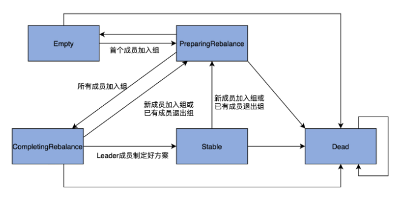
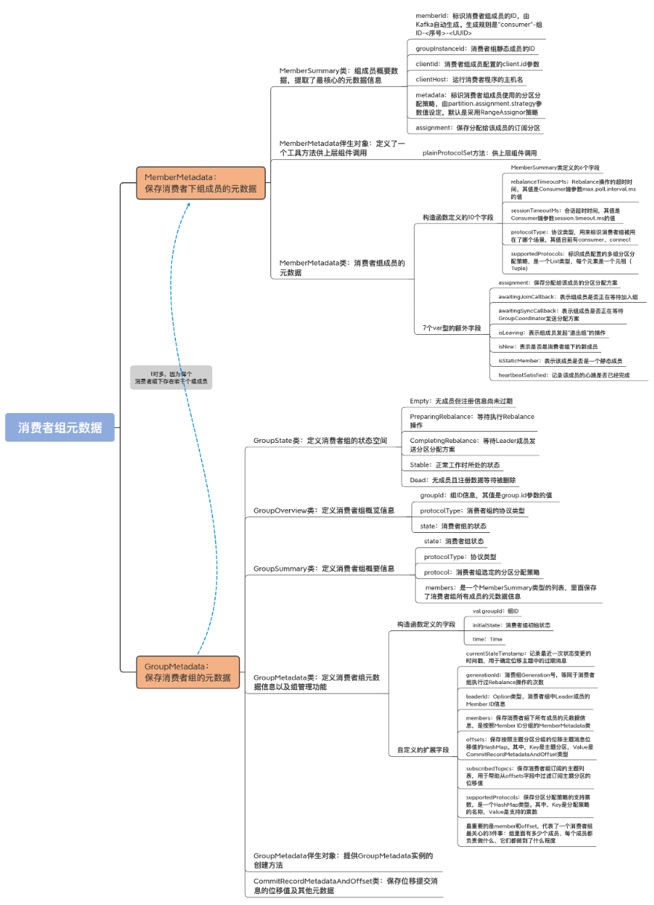
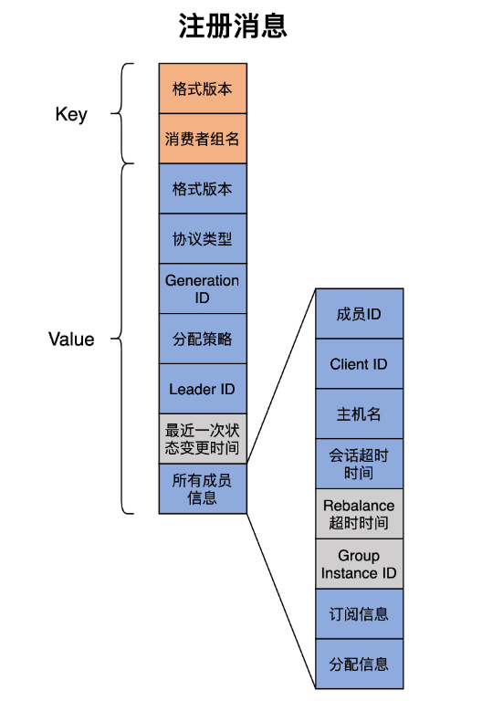
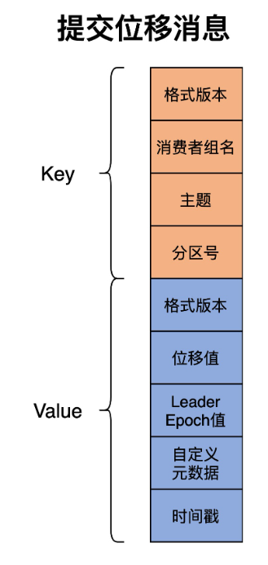
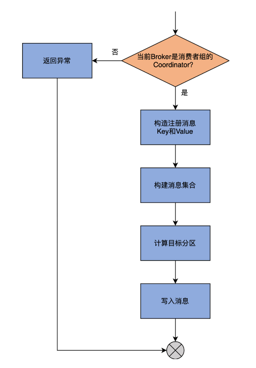

## 1. 开头

主要分析Kafka 消费者组在 Broker 端的源码实现，包括消费者组元数据的定义与管理、组元数据管理器、内部主题 __consumer_offsets 和重要的组件 GroupCoordinator

* 消费者组元数据

  这部分源码主要包括 GroupMetadata 和 MemberMetadata。这两个类共同定义了消费者组的元数据都由哪些内容构成。

* 组元数据管理器

  由 GroupMetadataManager 类定义，可被视为消费者组的管理引擎，提供了消费者组的增删改查功能。

* __consumer_offsets

  Kafka 的内部主题。除了我们熟知的消费者组提交位移记录功能之外，它还负责保存消费者组的注册记录消息。

* GroupCoordinator

  组协调者组件，提供通用的组成员管理和位移管理。

## 2. 消费者组元信息

​	元数据主要是由 GroupMetadata 和 MemberMetadata 两个类组成，它们分别位于 GroupMetadata.scala 和 MemberMetadata.scala 这两个源码文件中

### 2.1. 组成员元数据

MemberMetadata

MemberMetadata.scala 文件，包括 3 个类和对象。

* MemberSummary 类

  组成员概要数据，提取了最核心的元数据信息。上面例子中工具行命令返回的结果，就是这个类提供的数据。

* MemberMetadata 伴生对象

  仅仅定义了一个工具方法，供上层组件调用。

* MemberMetadata 类

  消费者组成员的元数据。Kafka 为消费者组成员定义了很多数据，一会儿我们将会详细学习。

#### 2.1.1. MemberSummary 类

```
case class MemberSummary(
  memberId: String,                 // 成员ID，由Kafka自动生成
  groupInstanceId: Option[String],  // Consumer端参数group.instance.id值
  clientId: String,                 // client.id参数值
  clientHost: String,               // Consumer端程序主机名
  metadata: Array[Byte],            // 消费者组成员使用的分配策略
  assignment: Array[Byte])          // 成员订阅分区
```

* memberId

  标识消费者组成员的 ID，这个 ID 是 Kafka 自动生成的，规则是 consumer- 组 ID-< 序号 >-。虽然现在社区有关于是否放开这个限制的讨论，即是否允许用户自己设定这个 ID，但目前它还是硬编码的，不能让你设置。

* groupInstanceId

  消费者组静态成员的 ID。静态成员机制的引入能够规避不必要的消费者组 Rebalance 操作。它是非常新且高阶的功能，这里你只要稍微知道它的含义就可以了。如果你对此感兴趣，建议你去官网看看 group.instance.id 参数的说明。

* clientId

  消费者组成员配置的 client.id 参数。由于 memberId 不能被设置，因此，你可以用这个字段来区分消费者组下的不同成员。

* clientHost

  运行消费者程序的主机名。它记录了这个客户端是从哪台机器发出的消费请求。

* metadata

  标识消费者组成员分区分配策略的字节数组，由消费者端参数 partition.assignment.strategy 值设定，默认的 RangeAssignor 策略是按照主题平均分配分区。

* assignment

  保存分配给该成员的订阅分区。每个消费者组都要选出一个 Leader 消费者组成员，负责给所有成员分配消费方案。之后，Kafka 将制定好的分配方案序列化成字节数组，赋值给 assignment，分发给各个成员。

#### 2.1.2. MemberMetadata 伴生对象

从一组给定的分区分配策略详情中提取出分区分配策略的名称，并将其封装成一个集合对象，然后返回。

如果消费者组下有 3 个成员，它们的 partition.assignment.strategy 参数分别设置成 RangeAssignor、RangeAssignor 和 RoundRobinAssignor，那么，plainProtocolSet 方法的返回值就是集合[RangeAssignor，RoundRobinAssignor]。实际上，它经常被用来统计一个消费者组下的成员到底配置了多少种分区分配策略

#### 2.1.3. MemberMetadata 类

MemberMetadata 类保存的数据很丰富，在它的构造函数中，除了包含 MemberSummary 类定义的 6 个字段外，还定义了 4 个新字段。

* rebalanceTimeoutMs

  Rebalance 操作的超时时间，即一次 Rebalance 操作必须在这个时间内完成，否则被视为超时。这个字段的值是 Consumer 端参数 max.poll.interval.ms 的值。

* sessionTimeoutMs

  会话超时时间。当前消费者组成员依靠心跳机制“保活”。如果在会话超时时间之内未能成功发送心跳，组成员就被判定成“下线”，从而触发新一轮的 Rebalance。这个字段的值是 Consumer 端参数 session.timeout.ms 的值。

* protocolType

  直译就是协议类型。它实际上标识的是消费者组被用在了哪个场景。这里的场景具体有两个：第一个是作为普通的消费者组使用，该字段对应的值就是 consumer；第二个是供 Kafka Connect 组件中的消费者使用，该字段对应的值是 connect。当然，不排除后续社区会增加新的协议类型。但现在，你只要知道它是用字符串的值标识应用场景，就足够了。除此之外，该字段并无太大作用。

* supportedProtocols

  标识成员配置的多组分区分配策略。目前，Consumer 端参数 partition.assignment.strategy 的类型是 List，说明你可以为消费者组成员设置多组分配策略，因此，这个字段也是一个 List 类型，每个元素是一个元组（Tuple）。元组的第一个元素是策略名称，第二个元素是序列化后的策略详情

还有5个重要的自定义字段

5 个比较重要的扩展字段，和你介绍下。

* assignment

  保存分配给该成员的分区分配方案。

* awaitingJoinCallback

  表示组成员是否正在等待加入组。

* awaitingSyncCallback

  表示组成员是否正在等待 GroupCoordinator 发送分配方案。

* isLeaving

  表示组成员是否发起“退出组”的操作。

* isNew

  表示是否是消费者组下的新成员

例如 metadata 方法的逻辑为:

从该成员配置的分区分配方案列表中寻找给定策略的详情。如果找到，就直接返回详情字节数组数据，否则，就抛出异常。

### 2.2. 组元数据

​	GroupMetadata类

​	GroupMetadata 管理的是消费者组而不是消费者组成员级别的元数据，它的代码结构要比 MemberMetadata 类复杂得多。我先画一张思维导图帮你梳理下它的代码结构。

GroupMetadata.scala 文件由 6 部分构成。

GroupState 类：定义了消费者组的状态空间。当前有 5 个状态，分别是 Empty、PreparingRebalance、CompletingRebalance、Stable 和 Dead。其中，Empty 表示当前无成员的消费者组；PreparingRebalance 表示正在执行加入组操作的消费者组；CompletingRebalance 表示等待 Leader 成员制定分配方案的消费者组；Stable 表示已完成 Rebalance 操作可正常工作的消费者组；Dead 表示当前无成员且元数据信息被删除的消费者组。

GroupMetadata 类：组元数据类。这是该 scala 文件下最重要的类文件，也是我们今天要学习的重点内容。

GroupMetadata 伴生对象：该对象提供了创建 GroupMetadata 实例的方法。

GroupOverview 类：定义了非常简略的消费者组概览信息。

GroupSummary 类：与 MemberSummary 类类似，它定义了消费者组的概要信息。

CommitRecordMetadataAndOffset 类：保存写入到位移主题中的消息的位移值，以及其他元数据信息。这个类的主要职责就是保存位移值，因此，我就不展开说它的详细代码了

#### 2.2.1. GroupState

 GroupState类及实现对象

一个消费者组从创建到正常工作，它的状态流转路径是 Empty -> PreparingRebalance -> CompletingRebalance -> Stable。

 

#### 2.2.2. GroupOverview

这是一个非常简略的组概览信息

GroupOverview 类封装了最基础的组数据，包括组 ID、协议类型和状态信息

#### 2.2.3. GroupSummary 

GroupSummary 类有 4 个字段，它们的含义也都很清晰，看字段名就能理解。你需要关注的是 **members 字段**，它是一个 MemberSummary 类型的列表，里面保存了消费者组所有成员的元数据信息。通过这个字段，我们可以看到，**消费者组元数据和组成员元数据是 1 对多的关系**

#### 2.2.4. GroupMetadata

我们看下 GroupMetadata 类的源码。我们先看下该类构造函数所需的字段和自定义的扩展元数据。

 GroupMetadata 类最重要的字段。

currentStateTimestamp：记录最近一次状态变更的时间戳，用于确定位移主题中的过期消息。位移主题中的消息也要遵循 Kafka 的留存策略，所有当前时间与该字段的差值超过了留存阈值的消息都被视为“已过期”（Expired）。

generationId：消费组 Generation 号。Generation 等同于消费者组执行过 Rebalance 操作的次数，每次执行 Rebalance 时，Generation 数都要加 1。

leaderId：消费者组中 Leader 成员的 Member ID 信息。当消费者组执行 Rebalance 过程时，需要选举一个成员作为 Leader，负责为所有成员制定分区分配方案。在 Rebalance 早期阶段，这个 Leader 可能尚未被选举出来。这就是，leaderId 字段是 Option 类型的原因。

members：保存消费者组下所有成员的元数据信息。组元数据是由 MemberMetadata 类建模的，因此，members 字段是按照 Member ID 分组的 MemberMetadata 类。

offsets：保存按照主题分区分组的位移主题消息位移值的 HashMap。Key 是主题分区，Value 是前面讲过的 CommitRecordMetadataAndOffset 类型。当消费者组成员向 Kafka 提交位移时，源码都会向这个字段插入对应的记录。

subscribedTopics：保存消费者组订阅的主题列表，用于帮助从 offsets 字段中过滤订阅主题分区的位移值。

supportedProtocols：保存分区分配策略的支持票数。它是一个 HashMap 类型，其中，Key 是分配策略的名称，Value 是支持的票数。前面我们说过，每个成员可以选择多个分区分配策略，因此，假设成员 A 选择[“range”，“round-robin”]、B 选择[“range”]、C 选择[“round-robin”，“sticky”]，那么这个字段就有 3 项，分别是：<“range”，2>、<“round-robin”，2> 和 <“sticky”，1>。

这些扩展字段和构造函数中的字段，共同构建出了完整的消费者组元数据。就我个人而言，我认为这些字段中最重要的就是 **members 和 offsets**，它们分别保存了组内所有成员的元数据，以及这些成员提交的位移值。这样看的话，这两部分数据不就是一个消费者组最关心的 3 件事吗：**组里面有多少个成员**、**每个成员都负责做什么**、**它们都做到了什么程度**

### 小结

GroupMetadata.scala 和 MemberMetadata.scala 这两个源码文件中，学习了消费者组元数据和组成员元数据的定义。它们封装了一个消费者组及其成员的所有数据。后续的 GroupCoordinator 和其他消费者组组件，都会大量利用这部分元数据执行消费者组的管理。

- 消费者组元数据：包括组元数据和组成员元数据两部分，分别由 GroupMetadata 和 MemberMetadata 类表征。
- MemberMetadata 类：保存组成员元数据，比如组 ID、Consumer 主机名、协议类型等。同时，它还提供了 MemberSummary 类，封装了组成员元数据的概要信息。
- GroupMetadata 类：保存组元数据，包括组状态、组成员元数据列表，等等。
- 1 对多关系：组元数据与组成员元数据是 1 对多的关系。这是因为每个消费者组下存在若干个组成员

 

### 2.3. 元数据管理

#### 2.3.3. 消费者组管理方法

* **transitionTo 方法**

  transitionTo 方法的作用是**将消费者组状态变更成给定状态**。在变更前，代码需要确保这次变更必须是合法的状态转换。这是依靠每个 GroupState 实现类定义的 **validPreviousStates 集合**来完成的。只有在这个集合中的状态，才是合法的前置状态。简单来说，只有集合中的这些状态，才能转换到当前状态。

  同时，该方法还会**更新状态变更的时间戳字段**。Kafka 有个定时任务，会定期清除过期的消费者组位移数据，它就是依靠这个时间戳字段，来判断过期与否的

* **canRebalance 方法**

  它用于判断消费者组是否能够开启 Rebalance 操作。判断依据是，**当前状态是否是 PreparingRebalance 状态的合法前置状态**。只有 **Stable**、**CompletingRebalance** 和 **Empty** 这 3 类状态的消费者组，才有资格开启 Rebalance

* **is 和 not 方法**

  至于 is 和 not 方法，它们分别判断消费者组的状态与给定状态吻合还是不吻合，主要被用于**执行状态校验**。特别是 is 方法，被大量用于上层调用代码中，执行各类消费者组管理任务的前置状态校验工作。

#### 2.3.4. 成员管理方法

管理成员就是添加成员（add 方法）、移除成员（remove 方法）和查询成员（has、get、size 方法等）

* 添加成员

  add。add 方法的主要逻辑，是将成员对象添加到 members 字段，同时更新其他一些必要的元数据，比如 Leader 成员字段、分区分配策略支持票数等

  作为关键的成员管理方法之一，add 方法是实现消费者组 Rebalance 流程至关重要的一环。每当 Rebalance 开启第一大步——加入组的操作时，本质上就是在利用这个 add 方法实现新成员入组的逻辑。

* 移除成员

  remove 方法比 add 要简单一些。**首先**，代码从 members 中移除给定成员。**之后**，更新分区分配策略支持票数，以及更新已加入组的成员数。**最后**，代码判断该成员是否是 Leader 成员，如果是的话，就选择成员列表中尚存的第一个成员作为新的 Leader 成员

* 查询成员

  has 方法，判断消费者组是否包含指定成员；

  get 方法，获取指定成员对象；

  size 方法，统计总成员数。

  其它的查询方法逻辑也都很简单，比如 allMemberMetadata、rebalanceTimeoutMs，等等，我就不多讲了。课后你可以自行阅读下，重点是体会这些方法利用 members 都做了什么事情。

#### 2.3.5. 位移管理方法

除了组状态和成员管理之外，GroupMetadata 还有一大类管理功能，就是**管理消费者组的提交位移**（Committed Offsets），主要包括添加和移除位移值。

```
private val offsets = new mutable.HashMap[TopicPartition, CommitRecordMetadataAndOffset]
```

它是 HashMap 类型，Key 是 TopicPartition 类型，表示一个主题分区，而 Value 是 CommitRecordMetadataAndOffset 类型

消费者组需要向 Coordinator 提交已消费消息的进度，在 Kafka 中，这个进度有个专门的术语，叫作提交位移。Kafka 使用它来定位消费者组要消费的下一条消息。那么，提交位移在 Coordinator 端是如何保存的呢？它实际上是保存在内部位移主题中。提交的方式是，消费者组成员向内部主题写入符合特定格式的事件消息，这类消息就是所谓的位移提交消息（Commit Record）。这里所说的 CommitRecordMetadataAndOffset 类，就是标识位移提交消息的地方

```
case class CommitRecordMetadataAndOffset(appendedBatchOffset: Option[Long], offsetAndMetadata: OffsetAndMetadata) {
  def olderThan(that: CommitRecordMetadataAndOffset): Boolean = appendedBatchOffset.get < that.appendedBatchOffset.get
}
```

这个类的构造函数有两个参数。

appendedBatchOffset：保存的是位移主题消息自己的位移值；

offsetAndMetadata：保存的是位移提交消息中保存的消费者组的位移值。

* 添加位移值

  在 GroupMetadata 中，有 3 个向 offsets 中添加订阅分区的已消费位移值的方法，分别是 initializeOffsets、onOffsetCommitAppend 和 completePendingTxnOffsetCommi

  * initializeOffsets 

    这个方法的第一行语句就行了。当消费者组的协调者组件启动时，它会创建一个异步任务，定期地读取位移主题中相应消费者组的提交位移数据，并把它们加载到 offsets 字段中

  * onOffsetCommitAppend 

    该方法在提交位移消息被成功写入后调用。主要判断的依据，是 offsets 中是否已包含该主题分区对应的消息值，或者说，offsets 字段中该分区对应的提交位移消息在位移主题中的位移值是否小于待写入的位移值。如果是的话，就把该主题已提交的位移值添加到 offsets 中

  * completePendingTxnOffsetCommit 

    作用是完成一个待决事务（Pending Transaction）的位移提交。所谓的待决事务，就是指正在进行中、还没有完成的事务。在处理待决事务的过程中，可能会出现将待决事务中涉及到的分区的位移值添加到 offsets 中的情况

* 移除位移值

  如果当前时间与已提交位移消息时间戳的差值，超过了 Broker 端参数 offsets.retention.minutes 值，Kafka 就会将这条记录从 offsets 字段中移除。这就是方法 removeExpiredOffsets 要做的事情。

  * **getExpiredOffsets**

    该方法定义了一个内部嵌套方法 **getExpiredOffsets**

    该方法接收两个参数。

    * baseTimestamp：它是一个函数类型，接收 CommitRecordMetadataAndOffset 类型的字段，然后计算时间戳，并返回；

    * subscribedTopics：即订阅主题集合，默认是空

    如果消费者组状态是 Empty，就传入组变更为 Empty 状态的时间，若该时间没有被记录，则使用提交位移消息本身的写入时间戳，来获取过期位移；

    如果是普通的消费者组类型，且订阅主题信息已知，就传入提交位移消息本身的写入时间戳和订阅主题集合共同确定过期位移值；

    如果 protocolType 为 None，就表示，这个消费者组其实是一个 Standalone 消费者，依然是传入提交位移消息本身的写入时间戳，来决定过期位移值；

    如果消费者组的状态不符合刚刚说的这些情况，那就说明，没有过期位移值需要被移除。

    当确定了要被移除的位移值集合后，代码会将它们从 offsets 中移除，然后返回这些被移除的位移值信息。至此，方法结束。

#### 2.3.6. 位移管理方法

supportedProtocols 的管理。supportedProtocols 是分区分配策略的支持票数，这个票数在添加成员、移除成员时，会进行相应的更新。

消费者组每次 Rebalance 的时候，都要重新确认本次 Rebalance 结束之后，要使用哪个分区分配策略，因此，就需要特定的方法来对这些票数进行统计，把票数最多的那个策略作为新的策略。

GroupMetadata 类中定义了两个方法来做这件事情，分别是 candidateProtocols 和 selectProtocol 方法。

* candidateProtocols 

  它的作用是**找出组内所有成员都支持的分区分配策略集**

  该方法首先会获取组内的总成员数，然后，找出 supportedProtocols 中那些支持票数等于总成员数的分配策略，并返回它们的名称。**支持票数等于总成员数的意思，等同于所有成员都支持该策略**

* selectProtocol 

  selectProtocol 方法，它的作用是**选出消费者组的分区消费分配策略**

  这个方法首先会判断组内是否有成员。如果没有任何成员，自然就无法确定选用哪个策略了，方法就会抛出异常，并退出。否则的话，代码会调用刚才的 candidateProtocols 方法，获取所有成员都支持的策略集合，然后让每个成员投票，票数最多的那个策略当选

  需要注意**成员支持列表中的策略是有顺序的**。这就是说，[“策略 B”，“策略 A”]和[“策略 A”，“策略 B”]是不同的，成员会倾向于选择靠前的策略

### 2.4. 小结

Kafka 对消费者组元数据的管理，主要包括组状态、成员、位移和分区分配策略四个维度。

* 消费者组元数据管理

  主要包括对组状态、成员、位移和分区分配策略的管理。

* 组状态管理

  transitionTo 方法负责设置状态，is、not 和 get 方法用于查询状态。

* 成员管理

  add、remove 方法用于增减成员，has 和 get 方法用于查询特定成员。

* 分区分配策略管理

  定义了专属方法 selectProtocols，用于在每轮 Rebalance 时选举分区分配策略。
  
  

## 3. GroupMetadataManager

GroupMetadataManager 类是在消费者组 Coordinator 组件被创建时被实例化的。这就是说，每个 Broker 在启动过程中，都会创建并维持一个 GroupMetadataManager 实例，以实现对该 Broker 负责的消费者组进行管理。更重要的是，生产环境输出日志中的与消费者组相关的大多数信息，都和它息息相关。

​	 GroupMetadataManager 类的源码。作为消费者组管理器，它负责管理消费者组的方方面面。其中，非常重要的两个管理功能是消费者组元数据管理和消费者组位移管理，分别包括查询获取、移除、添加和加载消费者组元数据，以及保存和查询消费者组位移，这些方法是上层组件 GroupCoordinator 倚重的重量级功能载体

### 3.1. 类定义与字段

重要字段信息

* brokerId

  这个参数我们已经无比熟悉了。它是所在 Broker 的 ID 值，也就是 broker.id 参数值。

* interBrokerProtocolVersion

  保存 Broker 间通讯使用的请求版本。它是 Broker 端参数 inter.broker.protocol.version 值。这个参数的主要用途是**确定位移主题消息格式的版本**。

* config

  这是一个 OffsetConfig 类型。该类型定义了与位移管理相关的重要参数，比如位移主题日志段大小设置、位移主题备份因子、位移主题分区数配置等。

* replicaManager

  副本管理器类。GroupMetadataManager 类使用该字段实现获取分区对象、日志对象以及写入分区消息的目的。

* zkClient

  ZooKeeper 客户端。该类中的此字段只有一个目的：从 ZooKeeper 中获取位移主题的分区数。

* **compressionType**

  **压缩器类型**。Kafka 向位移主题写入消息前，可以选择对消息执行压缩操作。是否压缩，取决于 Broker 端参数 offsets.topic.compression.codec 值，默认是不进行压缩。如果你的位移主题占用的磁盘空间比较多的话，可以考虑启用压缩，以节省资源。

* **groupMetadataCache**

  **该字段是 GroupMetadataManager 类上最重要的属性，它保存这个 Broker 上 GroupCoordinator 组件管理的所有消费者组元数据。**它的 Key 是消费者组名称，Value 是消费者组元数据，也就是 GroupMetadata。源码通过该字段实现对消费者组的添加、删除和遍历操作。

* **loadingPartitions**

  **位移主题下正在执行加载操作的分区号集合**。这里需要注意两点：首先，这些分区都是位移主题分区，也就是 __consumer_offsets 主题下的分区；其次，所谓的加载，是指读取位移主题消息数据，填充 GroupMetadataCache 字段的操作。

* **ownedPartitions**

  **位移主题下完成加载操作的分区号集合**。与 loadingPartitions 类似的是，该字段保存的分区也是位移主题下的分区。和 loadingPartitions 不同的是，它保存的分区都是**已经完成加载操作**的分区。

* **groupMetadataTopicPartitionCount**

  **位移主题的分区数**。它是 Broker 端参数 offsets.topic.num.partitions 的值，默认是 50 个分区。若要修改分区数，除了变更该参数值之外，你也可以手动创建位移主题，并指定不同的分区数。

在这些字段中，groupMetadataCache 是最重要的，GroupMetadataManager 类大量使用该字段实现对消费者组的管理。接下来，我们就重点学习一下该类是如何管理消费者组的

### 3.2. 重要方法

管理消费者组包含两个方面，对消费者组元数据的管理以及对消费者组位移的管理。组元数据和组位移都是 Coordinator 端重要的消费者组管理对象

#### 3.2.1. 消费者组元数据管理

* 查询获取消费者组元数据

getGroup 方法和 getOrMaybeCreateGroup 方法

GroupMetadataManager 类的上层组件 GroupCoordinator 会大量使用这两个方法来获取给定消费者组的数据。这两个方法都会返回给定消费者组的元数据信息，但是它们之间是有区别的。

对于 getGroup 方法而言，如果该组信息不存在，就返回 None，而这通常表明，消费者组确实不存在，或者是，该组对应的 Coordinator 组件变更到其他 Broker 上了。

而对于 getOrMaybeCreateGroup 方法而言，若组信息不存在，就根据 createIfNotExist 参数值决定是否需要添加该消费者组。而且，getOrMaybeCreateGroup 方法是在消费者组第一个成员加入组时被调用的，用于把组创建出来

*  移除消费者组元数据

  当 Broker 卸任某些消费者组的 Coordinator 角色时，它需要将这些消费者组从 groupMetadataCache 中全部移除掉，这就是 removeGroupsForPartition 方法要做的事情

  该方法的主要逻辑是，先定义一个内部方法 removeGroupsAndOffsets，然后创建一个异步任务，调用该方法来执行移除消费者组信息和位移信息

  怎么判断要移除哪些消费者组呢？这里的依据就是**传入的位移主题分区**。每个消费者组及其位移的数据，都只会保存在位移主题的一个分区下。一旦给定了位移主题分区，那么，元数据保存在这个位移主题分区下的消费者组就要被移除掉。removeGroupsForPartition 方法传入的 offsetsPartition 参数，表示 Leader 发生变更的位移主题分区，因此，这些分区保存的消费者组都要从该 Broker 上移除掉

  异步任务从 ownedPartitions 中移除给定位移主题分区

  其次，遍历消费者组元数据缓存中的所有消费者组对象，如果消费者组正是在给定位移主题分区下保存的

  * 第 1 步，调用 onGroupUnloaded 方法执行组卸载逻辑。这个方法的逻辑是上层组件 GroupCoordinator 传过来的。它主要做两件事情：将消费者组状态变更到 Dead 状态；封装异常表示 Coordinator 已发生变更，然后调用回调函数返回。

  * 第 2 步，把消费者组信息从 groupMetadataCache 中移除。这一步非常关键，目的是彻底清除掉该组的“痕迹”。

  * 第 3 步，把消费者组从 producer 对应的组集合中移除。这里的 producer，是给 Kafka 事务用的。

  * 第 4 步，增加已移除组计数器。

  * 第 5 步，更新已移除位移值计数器。

* 添加消费者组元数据

 addGroup。它特别简单，仅仅是调用 putIfNotExists 将给定组添加进 groupMetadataCache 中而已

* 加载消费者组元数据

  GroupMetadataManager 类中定义了一个 loadGroup 方法执行对应的加载过程。

  该方法的逻辑有两步：

  * 第 1 步

    通过 initializeOffsets 方法，将位移值添加到 offsets 字段标识的消费者组提交位移元数据中，实现加载消费者组订阅分区提交位移的目的。

  * 第 2 步

    调用 addGroup 方法，将该消费者组元数据对象添加进消费者组元数据缓存，实现加载消费者组元数据的目的

#### 3.2.2. 消费者组位移管理

除了消费者组的管理，GroupMetadataManager 类的另一大类功能，是提供消费者组位移的管理，主要包括位移数据的保存和查询。我们总说，位移主题是保存消费者组位移信息的地方。实际上，**当消费者组程序在查询位移时，Kafka 总是从内存中的位移缓存数据查询，而不会直接读取底层的位移主题数据**

* **保存**

  

* **查询**

  getOffsets 方法首先会读取 groupMetadataCache 中的组元数据，如果不存在对应的记录，则返回空数据集，如果存在，就接着判断组是否处于 Dead 状态。

  如果是 Dead 状态，就说明消费者组已经被销毁了，位移数据也被视为不可用了，依然返回空数据集；若状态不是 Dead，就提取出消费者组订阅的分区信息，再依次为它们获取对应的位移数据并返回。至此，方法结束。

### 3.3. 位移主题概念

​	 __consumer_offsets，是 Kafka 的两大内部主题之一（另一个内部主题是管理 Kafka 事务的，名字是 __transaction_state，用于保存 Kafka 事务的状态信息）

​	Kafka 创建位移主题的目的，是**保存消费者组的注册消息和提交位移消息**。前者保存能够标识消费者组的身份信息；后者保存消费者组消费的进度信息。在 Kafka 源码中，GroupMetadataManager 类定义了操作位移主题消息类型以及操作位移主题的方法

* 位移主题

  即 __consumer_offsets。该主题是内部主题，默认有 50 个分区，Kafka 负责将其创建出来，因此你不需要亲自执行创建主题操作。

* 消息类型

  位移主题分为注册消息和已提交位移消息。

* Tombstone 消息

  Value 为 null 的位移主题消息，用于清除消费者组已提交的位移值和注册信息。

* Coordinator 确认原则

  消费者组名的哈希值与位移主题分区数求模的绝对值，即为目标分区，目标分区 Leader 副本所在的 Broker 即为 Coordinator。

#### 3.3.1. 消息类型

位移主题有两类消息：**消费者组注册消息**（Group Metadata）和**消费者组的已提交位移消息**（Offset Commit）

* 消费者组注册消息

  **所有成员都加入组后**：Coordinator 向位移主题写入注册消息，只是该消息不含分区消费分配方案；

  **Leader 成员发送方案给 Coordinator 后**：当 Leader 成员将分区消费分配方案发给 Coordinator 后，Coordinator 写入携带分配方案的注册消息

   

* 消费者组注册消息

  这类消息的 Key 是一个 GroupTopicPartition 类型，也就是 < 消费者组名，主题，分区号 > 三元组

  该方法接收三元组中的数据，然后创建一个结构体对象，依次写入消费者组名、主题和分区号。接下来，构造 ByteBuffer，写入格式版本和结构体，最后返回它底层的字节数组

  offsetCommitValue 方法决定了 Value 中都有哪些元素

   

* Tombstone 消息

  关于位移主题，Kafka 源码中还存在一类消息，那就是 Tombstone 消息。其实，它并没有任何稀奇之处，就是 Value 为 null 的消息。因此，注册消息和提交位移消息都有对应的 Tombstone 消息。这个消息的主要作用，是让 Kafka 识别哪些 Key 对应的消息是可以被删除的，有了它，Kafka 就能保证，内部位移主题不会持续增加磁盘占用空间

  无论是哪类消息，**它们的 Value 字段都是 null**。一旦注册消息中出现了 Tombstone 消息，就表示 Kafka 可以将该消费者组元数据从位移主题中删除；一旦提交位移消息中出现了 Tombstone，就表示 Kafka 能够将该消费者组在某主题分区上的位移提交数据删除

#### 3.3.2. 确定 Coordinator

**Coordinator 组件是操作位移主题的唯一组件，它在内部对位移主题进行读写操作**。

每个 Broker 在启动时，都会启动 Coordinator 组件，但是，一个消费者组只能被一个 Coordinator 组件所管理。Kafka 是如何确定哪台 Broker 上的 Coordinator 组件为消费者组服务呢？答案是，**位移主题某个特定分区 Leader 副本所在的 Broker 被选定为指定消费者组的 Coordinator。**

```
def partitionFor(groupId: String): Int = Utils.abs(groupId.hashCode) % groupMetadataTopicPartitionCount
```

假设位移主题默认是 50 个分区，我们的消费者组名是“testgroup”，因此，Math.abs(“testgroup”.hashCode % 50) 的结果是 27，那么，目标分区号就是 27。也就是说，这个消费者组的注册消息和提交位移消息都会写入到位移主题的分区 27 中，而分区 27 的 Leader 副本所在的 Broker，就成为该消费者组的 Coordinato

### 3.4. 位移主题读写

#### 3.4.1. 写入位移主题

我们已经学过了 appendForGroup 方法。Kafka 定义的两类消息类型都是由它写入的。在源码中，storeGroup 方法调用它写入消费者组注册消息，storeOffsets 方法调用它写入已提交位移消息。

*  storeGroup 方法的逻辑

  

  写入位移主题和写入其它的普通主题并无差别。Coordinator 会构造符合规定格式的消息数据，并把它们传给 storeOffsets 和 storeGroup 方法，由它们执行写入操作。因此，我们可以认为，Coordinator 相当于位移主题的消息生产者

#### 3.4.2. 读取位移主题

Coordinator 还扮演了消费者的角色，也就是读取位移主题。跟写入相比，读取操作的逻辑更加复杂一些，不光体现在代码长度上，更体现在消息读取之后的处理上

真正需要读取位移主题的时机，**是在当前 Broker 当选 Coordinator**，也就是 Broker 成为了位移主题某分区的 Leader 副本时

一旦当前 Broker 当选为位移主题某分区的 Leader 副本，它就需要将它内存中的元数据缓存填充起来，因此需要读取位移主题。在代码中，这是由 **scheduleLoadGroupAndOffsets** 方法完成的。该方法会创建一个异步任务，来读取位移主题消息，并填充缓存。这个异步任务要执行的逻辑，就是 loadGroupsAndOffsets 方法

它本质上是调用 doLoadGroupsAndOffsets 方法实现的位移主题读取

doLoadGroupsAndOffsets 方法，顾名思义，它要做两件事请：加载消费者组；加载消费者组的位移。再强调一遍，所谓的加载，就是指读取位移主题下的消息，并将这些信息填充到缓存中。

该方法接收两个参数，第一个参数 topicPartition 是位移主题目标分区；第二个参数 onGroupLoaded 是加载完成后要执行的逻辑，这个逻辑是在上层组件中指定的，我们不需要掌握它的实现，这不会影响我们学习位移主题的读取。

doLoadGroupsAndOffsets 还定义了一个内置子方法 logEndOffset。它的目的很简单，就是**获取位移主题指定分区的 LEO 值，如果当前 Broker 不是该分区的 Leader 副本，就返回 -1**。

这是一个特别重要的事实，因为 Kafka 依靠它来判断分区的 Leader 副本是否发生变更。一旦发生变更，那么，在当前 Broker 执行 logEndOffset 方法的返回值，就是 -1，此时，Broker 就不再是 Leader 副本了。

doLoadGroupsAndOffsets 方法会**读取位移主题目标分区的日志对象**，并执行核心的逻辑动作，代码如下：

```
......

replicaManager.getLog(topicPartition) match {

  // 如果无法获取到日志对象

  case None =>

​    warn(s"Attempted to load offsets and group metadata from $topicPartition, but found no log")

  case Some(log) =>

​     // 核心逻辑......
```

我把核心的逻辑分成 3 个部分来介绍。

第 1 部分：初始化 4 个列表 + 读取位移主题；

第 2 部分：处理读到的数据，并填充 4 个列表；

第 3 部分：分别处理这 4 个列表

### 3.5. 小结

Coordinator 会使用这些方法对位移主题进行操作，实现对消费者组的管理。写入操作比较简单，它和一般的消息写入并无太大区别，而读取操作相对复杂一些。更重要的是，和我们的直观理解可能相悖的是，Kafka 在查询消费者组已提交位移时，是不会读取位移主题的，而是直接从内存中的消费者组元数据缓存中查询

读写方法：appendForGroup 方法负责写入位移主题，doLoadGroupsAndOffsets 负责读取位移主题，并加载组信息和位移值。

查询消费者组位移：查询位移时不读取位移主题，而是读取消费者组元数据缓存。