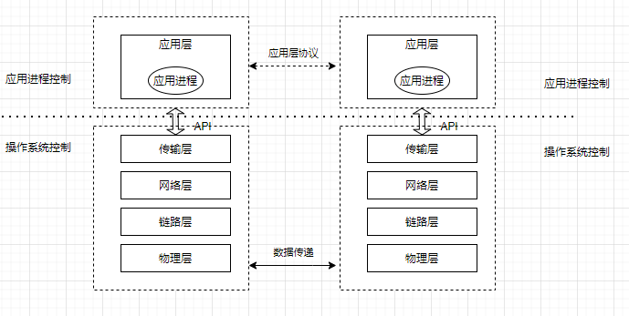
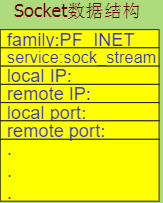
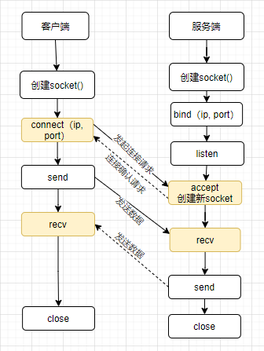
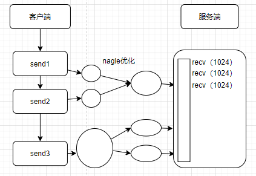
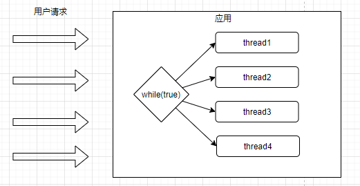
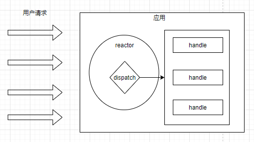
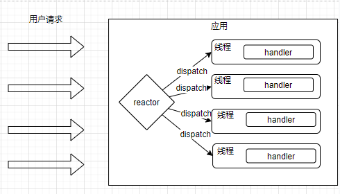
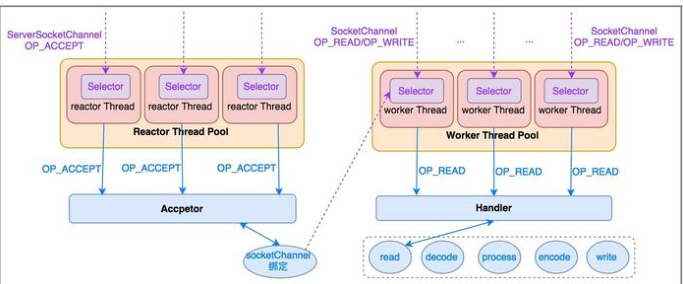

## 1. socket回顾  
### 1.1. Socket核心机制  
  
* 操作系统定义的一种套接字api，叫做socket，这个接口供应用进程调用。
* 操作系统为每一个进程创建了套接字信息表，进程创建套接字的时候就会产生一条套接字信息记录表  
  

* 创建套接字的时候可以选择TCP协议（可靠、面向连接、点对点、字节流）还是UDP协议（不可靠、无连接、数据报）。
* 调用过程：服务端创建套接字，绑定本地IP和端口、调用listen套接字（tcp）；客户端connect连接服务端套接字；服务端accept套接字（tcp），取出客户端的请求，然后创建一个新的套接字，利用新的套接字与客户端通讯；客户端send（tcp），客户端sendto（udp）；服务端recv（tcp），recvfrom（udp）；  
    

### 1.2. Socket之粘包
&emsp;&emsp;tcp由于是基于流的，而且发送的时候有可能使用优化算法将多次发送的数据包进行合并进行一次发生，接收方一般情况下并不知道每次发送数据的边界，不知道一次要提取多少数据，这个就会导致读取错误。发送的时候，如果发送数据大于发送缓冲区的剩余大小，也会拆包发送，如果接收缓冲区的数据没有及时读取就会发生粘连。  
  

如何解决粘包问题呢？  
* 数据包之间设置边界，如特殊符号
* 发送端设置固定长度，不够补齐，读取的时候固定读取
* 增加头部信息，包含数据包的长度，读取的时候就知道读取多少了。

Ps：同一个连接下，传输层会保证可靠性，和发送顺序，保证先发的包先到否则会等待或者丢弃。  

### 1.3. Tcp的连接和断开
&emsp;&emsp;Tcp连接需要3次握手，断开需要4次(参考https://www.jianshu.com/p/9d30976a2d7f)。并且客户端断开需要等待2msl 
&emsp;&emsp;为什么要等这么长呢?  
&emsp;&emsp;因为防止服务端没有收到客户端最终ack，客户端发起ack后，要么服务端收到了，要么没收到，什么时候服务端认为没收到呢，是服务端发起请求后最多等2msl,就会重发，如果服务端重发会最多1msl到达客户端，客户端会最多1msl重新ack回来，综合算下来客户端2msl后关闭最安全。

还有就是发送完最后一个ACK报文段后，再经过2MSL，就可以使本连接持续的时间内所产生的所有报文段都从网络中消失，使下一个新的连接中不会出现这种旧的连接请求报文段。

&emsp;&emsp;参考文章：https://blog.csdn.net/sinat_35297665/article/details/80979181  

## 1.4. Java nio的基本原理
待分析

## 2. 网络模型
### 2.1. 基础模型    
  
&emsp;&emsp;当应用收到网络请求后，accept一个socket后就创建一个线程，有多少个用户请求就有多少个线程，这种系统肯定是非常不合适的，无线的扩张，cpu资源切换上下文会导致性能越来越低。应用可以做一个线程池优化一下，不用需要创建那么多线程，但是当如果有连接空闲的话那么创建的线程就会一直被占用，这样就会影响整体的性能。并且如果线程池的容量不够，同时接收请求有限，那应用的吞吐量就会被限制了。

### 2.2. 单线程reactor模型  
  
&emsp;&emsp;如上图所示，当收到新用户请求后，reactor通过selector机制获取到新连接事件后，将同步调用业务handler进行处理，当有handler有阻塞行为的时候，将会影响所有的连接。
单线程模型不能充分利用多核资源，实际使用的不多，除非handler能够快速的完成。

  

### 2.3. 多线程Reactor模型  
&emsp;&emsp;基于单线程的模型存在缺点，我们可以将handle放入线程池，handle进行多线程处理，如下图所示：  
  
为充分利用多核cpu资源，我们还可以reactor拆分两个selector，handler读取的时候选取一个进行读取。  

### 2.4. 主从Reactor模型
  
&emsp;&emsp;如上图所示，reactor所在是一个线程池，并行处理serversocketchannel，使用accpetor来从serversocketchannel获取到socketchannel,而处理这个socketchannel也是个线程池，通过socketchennel来read或着write,具体业务逻辑在hanlder里面。  

## 3. 总结  
