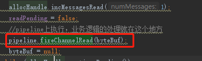
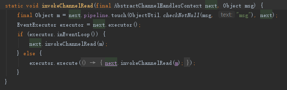
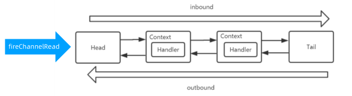

## 1. 开头

4.接收数据
4.1.接收op_read事件
selector接收到了op_read事件
4.2.处理op_read事件
NioSocketChannel.NioSocketChannelUnsafe.read()处理事件。
核心为：sun.nio.ch.SocketChannelImpl#read(java.nio.ByteBuffer)

1）NioSocketChannel read()

技巧：AdaptiveRecvByteBufAllocator可以对buffer的大小猜测(扩大敏感，缩小谨慎)  

## 2. 处理数据  
### 2.1. 设置handler，设置处理链
* 默认处理线程就是 Channel 绑定的 NioEventLoop 线程，pipeline.addLast( new  UnorderedThreadPoolEventExecutor( 10 ) , serverHandler )
* Handler 要实现 io.netty.channel.ChannelInboundHandler#channelRead (ChannelHandlerContext ctx ,Object msg)，且不能加注解 @Skip 才能被执行到。
pipeline.addLast( new  UnorderedThreadPoolEventExecutor( 10 ) , serverHandler )
### 2.2. 使用handler
收到数据读取事件处理，接收数据后，触发pipeline.fireChannelRead( ( byteBuf) 把读取到的数据传播出去  
  
  
