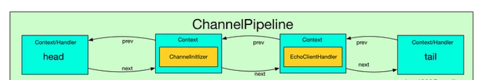
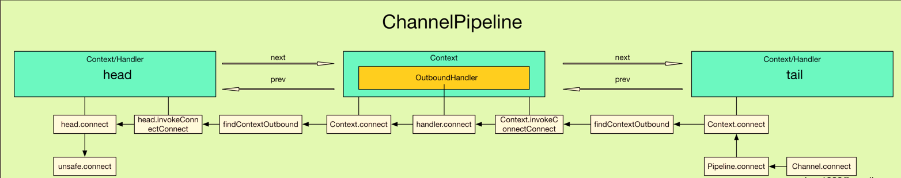
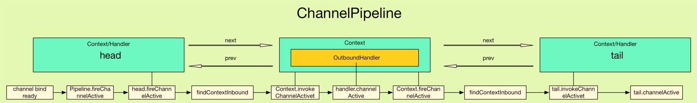

## 1. 开头
关于ChannelPipeline，这里有几点重新声明下：
* 一个 Channel 包含了一个 ChannelPipeline
* ChannelPipeline持有一个ChannelHandlerContext组成的双向链表
* ChannelHandlerContext都持有一个ChannelHandler  
如下是一个整体的图
  


## 2. channelPipeline生成
### 2.1. channelPipeline创建入口
它是在AbstractChannel构造方法中创建的，即每个 Channel 都有一个 ChannelPipeline
```
protected AbstractChannel(Channel parent) {
    this.parent = parent;
    unsafe = newUnsafe();
    pipeline = new DefaultChannelPipeline(this);
}
```

### 2.2. channelPipeline关键属性
* DefaultChannelPipeline持有Channel属性，会设置创建它的Channel对象
* 实例化两个ChannelHandlerContext，一个是 HeadContext 实例 head, 另一个是 TailContext 实例 tail，形成双向链表
* TailContext实现了ChannelInboundHandler
* HeadContext实现了ChannelOutboundHandler, ChannelInboundHandler  

**注意：head 和 tail 并没有包含 ChannelHandler, 这是因为 HeadContext 和 TailContext 继承于 AbstractChannelHandlerContext 的同时也实现了 ChannelHandler 接口了, 因此它们有 Context 和 Handler 的双重属性**
```
public DefaultChannelPipeline(AbstractChannel channel) {
    if (channel == null) {
        throw new NullPointerException("channel");
    }
    this.channel = channel;

    tail = new TailContext(this);
    head = new HeadContext(this);

    head.next = tail;
    tail.prev = head;
}
```

### 2.3. HeadContext、TailContext的构造器  
* HeadContext构造方法inbound = false, outbound = true，都会调用了父类 AbstractChannelHandlerContext 的构造器
* TailContext 的构造器与 HeadContext 的相反， inbound = true, outbound = false，都会调用了父类 AbstractChannelHandlerContext 的构造器
```
HeadContext(DefaultChannelPipeline pipeline) {
    super(pipeline, null, HEAD_NAME, false, true);
    unsafe = pipeline.channel().unsafe();
}
```


### 2.4. ChannelInitializer的添加    
在初始化 Bootstrap, 我们会添加我们自定义的 ChannelHandler到ChannelPipeline
```
Bootstrap b = new Bootstrap();
b.group(group)
 .channel(NioSocketChannel.class)
 .option(ChannelOption.TCP_NODELAY, true)
 .handler(new ChannelInitializer<SocketChannel>() {
     @Override
     public void initChannel(SocketChannel ch) throws Exception {
         ChannelPipeline p = ch.pipeline();
         p.addLast(new EchoClientHandler());
     }
 });
```
添加的流程如下：
* 在调用handler时, 传入了ChannelInitializer对象
* ChannelInitializer提供了一个 initChannel 方法供我们初始化 ChannelHandler.
* ChannelInitializer 实现了 ChannelHandler
* 最终是由Bootstrap.init 方法中添加到 ChannelPipeline
  ```
    @Override
    @SuppressWarnings("unchecked")
    void init(Channel channel) throws Exception {
        ChannelPipeline p = channel.pipeline();
        p.addLast(handler());
        ...
    }
  ```
  

* Bootstrap.init 中会调用 p.addLast() 方法, 将 ChannelInitializer 插入到链表末端
  ```
    @Override
    public ChannelPipeline addLast(EventExecutorGroup group, final String name, ChannelHandler handler) {
        synchronized (this) {
            checkMultiplicity(handler);
            newCtx = newContext(group, filterName(name, handler), handler);
            addLast0(newCtx);
            //......
        }

        return this;
    }
  ```
* 为了添加一个handler到pipeline中, 必须把此handler包装成ChannelHandlerContext
  ```
    private AbstractChannelHandlerContext newContext(EventExecutorGroup group, String name, ChannelHandler handler) {
        return new DefaultChannelHandlerContext(this, childExecutor(group), name, handler);
    }
  ```
* 添加到双向链表之中
  ```
    private void addLast0(AbstractChannelHandlerContext newCtx) {
        AbstractChannelHandlerContext prev = tail.prev;
        newCtx.prev = prev;
        newCtx.next = tail;
        prev.next = newCtx;
        tail.prev = newCtx;
    }
  ```

### 2.4. 自定义handler的添加  
&emsp;&emsp;上一节我们分析了一个 ChannelInitializer 如何插入到 Pipeline 。  
&emsp;&emsp;下面我们来分析如下的内容：  
* ChannelInitializer 在哪里被调用？
* ChannelInitializer 的作用是什么呢？
* ChannelHandler 是如何插入到 Pipeline的呢？  

#### 2.4.1. channel 的注册的回顾

* AbstractBootstrap.initAndRegister中, 通过 group().register(channel), 调用 MultithreadEventLoopGroup.register 方法
* MultithreadEventLoopGroup.register 中, 通过 next() 获取一个可用的 SingleThreadEventLoop, 然后调用它的 register
* SingleThreadEventLoop.register 中, 通过 channel.unsafe().register(this, promise) 来获取 channel 的 unsafe() 底层操作对象, 然后调用它的 register.
* AbstractUnsafe.register 方法中, 调用 register0 方法注册 Channel
* AbstractUnsafe.register0 中, 调用 AbstractNioChannel#doRegister 方法
* AbstractNioChannel.doRegister 方法通过 javaChannel().register(eventLoop().selector, 0, this) 将 Channel 对应的 Java NIO SockerChannel 注册到一个 eventLoop 的 Selector 中, 并且将当前 Channel 作为 attachment。

```
    final ChannelFuture initAndRegister() {
        Channel channel = null;
        try {
            channel = channelFactory.newChannel();
            init(channel);
        } catch (Throwable t) {
            if (channel != null) {
                // channel can be null if newChannel crashed (eg SocketException("too many open files"))
                channel.unsafe().closeForcibly();
                // as the Channel is not registered yet we need to force the usage of the GlobalEventExecutor
                return new DefaultChannelPromise(channel, GlobalEventExecutor.INSTANCE).setFailure(t);
            }
            // as the Channel is not registered yet we need to force the usage of the GlobalEventExecutor
            return new DefaultChannelPromise(new FailedChannel(), GlobalEventExecutor.INSTANCE).setFailure(t);
        }
        //开始register
        ChannelFuture regFuture = config().group().register(channel);
        if (regFuture.cause() != null) {
            if (channel.isRegistered()) {
                channel.close();
            } else {
                channel.unsafe().closeForcibly();
            }
        }
    }
```

#### 2.4.2. handler的添加
在上面的步骤中，AbstractUnsafe.register0会调用pipeline.fireChannelRegistered来添加自定义ChannelHandler 
```
  private void register0(ChannelPromise promise) {
      try {
          // check if the channel is still open as it could be closed in the mean time when the register
          // call was outside of the eventLoop
          if (!promise.setUncancellable() || !ensureOpen(promise)) {
              return;
          }
          boolean firstRegistration = neverRegistered;
          doRegister();
          neverRegistered = false;
          registered = true;

          // Ensure we call handlerAdded(...) before we actually notify the promise. This is needed as the
          // user may already fire events through the pipeline in the ChannelFutureListener.
          pipeline.invokeHandlerAddedIfNeeded();

          safeSetSuccess(promise);
          pipeline.fireChannelRegistered();
          // Only fire a channelActive if the channel has never been registered. This prevents firing
          // multiple channel actives if the channel is deregistered and re-registered.
            //server socket的注册不会走进下面if,server socket接受连接创建的socket可以走进去。因为accept后就active了。
          if (isActive()) {
              if (firstRegistration) {
                  pipeline.fireChannelActive();
              } else if (config().isAutoRead()) {
                  // This channel was registered before and autoRead() is set. This means we need to begin read
                  // again so that we process inbound data.
                  //
                  // See https://github.com/netty/netty/issues/4805
                  beginRead();
              }
          }
      } catch (Throwable t) {
          // Close the channel directly to avoid FD leak.
          closeForcibly();
          closeFuture.setClosed();
          safeSetFailure(promise, t);
      }
  }
```
pipeline.fireChannelRegistered()会最终调用。head.fireChannelRegistered。
```
  public final ChannelPipeline fireChannelRegistered() {
      AbstractChannelHandlerContext.invokeChannelRegistered(head);
      return this;
  }
```
因为head没有重写父类的invokeChannelRegistered所以最终还是调用的AbstractChannelHandlerContext.fireChannelRegistered
```
   static void invokeChannelRegistered(final AbstractChannelHandlerContext next) {
        EventExecutor executor = next.executor();
        if (executor.inEventLoop()) {
            next.invokeChannelRegistered();
        } else {
            executor.execute(new Runnable() {
                @Override
                public void run() {
                    next.invokeChannelRegistered();
                }
            });
        }
    }
```
接着会调用fireChannelRegistered
```
    public ChannelHandlerContext fireChannelRegistered() {
        invokeChannelRegistered(findContextInbound(MASK_CHANNEL_REGISTERED));
        return this;
    }
```
上面的方法会findContextInbound，而这个found会从 head 开始遍历 Pipeline 的双向链表.
```
    private AbstractChannelHandlerContext findContextInbound(int mask) {
        AbstractChannelHandlerContext ctx = this;
        do {
            ctx = ctx.next;
        } while ((ctx.executionMask & mask) == 0);
        return ctx;
    }
```
注意executionMask这个标识，它会找到MASK_CHANNEL_REGISTERED类型handler进行注册
然后会回到这里
```
  private void invokeChannelRegistered() {
        if (invokeHandler()) {
            try {
                ((ChannelInboundHandler) handler()).channelRegistered(this);
            } catch (Throwable t) {
                notifyHandlerException(t);
            }
        } else {
            fireChannelRegistered();
        }
    }
```
```
    private void invokeChannelRegistered() {
        if (invokeHandler()) {
            try {
                ((ChannelInboundHandler) handler()).channelRegistered(this);
            } catch (Throwable t) {
                notifyHandlerException(t);
            }
        } else {
            fireChannelRegistered();
        }
    }
```
 **ChannelHandler 都与一个 ChannelHandlerContext 关联，这里 handler() 返回的, 其实就是一开始我们实例化的 ChannelInitializer 对象，并接着调用了 ChannelInitializer.channelRegistered 方法**，这个方法在之前也提到过。它会调用initchannel方法
 ```
     public final void channelRegistered(ChannelHandlerContext ctx) throws Exception {
        // Normally this method will never be called as handlerAdded(...) should call initChannel(...) and remove
        // the handler.
        if (initChannel(ctx)) {
            // we called initChannel(...) so we need to call now pipeline.fireChannelRegistered() to ensure we not
            // miss an event.
            ctx.pipeline().fireChannelRegistered();

            // We are done with init the Channel, removing all the state for the Channel now.
            removeState(ctx);
        } else {
            // Called initChannel(...) before which is the expected behavior, so just forward the event.
            ctx.fireChannelRegistered();
        }
    }
 ```
 **而initChannel是个抽象类的方法，正是我们定义handler是定义的需要我们实现的**，它会干什么呢？
 ```
  .childOption(ChannelOption.ALLOCATOR, UnpooledByteBufAllocator.DEFAULT)
                    .childHandler(new ChannelInitializer<SocketChannel>() {
                 @Override
                 public void initChannel(SocketChannel ch) throws Exception {
                     ChannelPipeline p = ch.pipeline();
                     if (sslCtx != null) {
                         p.addLast(sslCtx.newHandler(ch.alloc()));
                     }
                     p.addLast(new LoggingHandler(LogLevel.INFO));
                     p.addLast(serverHandler);
                 }
             });
 ```
 当调用了这个方法后, 我们自定义的 ChannelHandler 就插入到 Pipeline 了, 此时的 Pipeline 如下图所示  
   
 当添加了自定义的 ChannelHandler 后, 会删除 ChannelInitializer 这个 ChannelHandler, 即 "ctx.pipeline().remove(this)  
 所以ChannelInitializer的作用就是先在pipeline中占个坑位，而你需要ChannelInitializer实现它的initchannel方法，这个方法是将你自己的handler添加到pipeline，最终initchannel会被调用进行handler的添加。然后 会删除 ChannelInitializer 这个 ChannelHandler，最终被删除完毕了。  


## 3. ChannelHandler的名称  
### 3.1. 名称的校验
 当我们添加handler的时候，可以传入一个名称来标识,在生产环境中，我们也建议这么做。
 ```
     public final ChannelPipeline addLast(String name, ChannelHandler handler) {
        return addLast(null, name, handler);
    }
 ```
 最终我们添加的时候也会校验名称是否存在
 ```
     private void checkDuplicateName(String name) {
        if (context0(name) != null) {
            throw new IllegalArgumentException("Duplicate handler name: " + name);
        }
    }
 ```
 这里会遍历context进行校验
 ```
     private AbstractChannelHandlerContext context0(String name) {
        AbstractChannelHandlerContext context = head.next;
        while (context != tail) {
            if (context.name().equals(name)) {
                return context;
            }
            context = context.next;
        }
        return null;
    }
 ```

### 3.2. 自动生成名称
如果传入name为空，则会生成名称。如果生成重复了，自动生成的名字的规则很简单, 就是 handler 的简单类名加上 "#0"
```
    private static String generateName0(Class<?> handlerType) {
        return StringUtil.simpleClassName(handlerType) + "#0";
    }

      // It's not very likely for a user to put more than one handler of the same type, but make sure to avoid
        // any name conflicts.  Note that we don't cache the names generated here.
        if (context0(name) != null) {
            String baseName = name.substring(0, name.length() - 1); // Strip the trailing '0'.
            for (int i = 1;; i ++) {
                String newName = baseName + i;
                if (context0(newName) == null) {
                    name = newName;
                    break;
                }
            }
        }
        return name;
```


## 4. Pipeline的事件传输机制  
### 4.1. Pipeline的事件传输整体介绍
&emsp;&emsp;AbstractChannelHandlerContext是有 inbound 和 outbound 之分的，inbound的ChannelHandler 实现了 ChannelInboundHandler 方法。outbound对应的ChannelHandler实现了ChannelOutboundHandler方法。  
&emsp;&emsp;inbound 事件和 outbound 事件的流向是不一样的, inbound 事件的流行是从下至上, 而 outbound 刚好相反, 是从上到下


### 4.2. ChannelHandlerContext的outbound相关方法 
#### 4.2.1. 主要的方法 
```
ChannelHandlerContext.bind(SocketAddress, ChannelPromise)
ChannelHandlerContext.connect(SocketAddress, SocketAddress, ChannelPromise)
ChannelHandlerContext.write(Object, ChannelPromise)
ChannelHandlerContext.flush()
ChannelHandlerContext.read()
ChannelHandlerContext.disconnect(ChannelPromise)
ChannelHandlerContext.close(ChannelPromise)
```
#### 4.2.2. outbound相关方法的特点
* Outbound 事件都是请求事件，请求某件事情的发生，通过 Outbound 事件进行通知. 比如发起写，发起绑定、发起连接等等。
* Outbound 事件的传播方向是 tail -> customContext -> head

#### 4.2.3. 流程  
我们以一个 Bootstrap.connect 事件为例，此时就会触发一个outbound的调用链表，Bootstrap.connect -> Bootstrap.doConnect -> Bootstrap.doConnect0 -> AbstractChannel.connect

* 第一步会调用socketchannel的connect的方法  
  io.netty.channel.AbstractChannel#connect(java.net.SocketAddress, io.netty.channel.ChannelPromise)
* AbstractChannel.connect 其实由调用了 DefaultChannelPipeline.connect 方法
  ```
    @Override
    public ChannelFuture connect(SocketAddress remoteAddress, ChannelPromise promise) {
        return pipeline.connect(remoteAddress, promise);
    }
  ```
 * pipeline.connectd其实是以tail 为起点开始传播的.而 tail.connect 其实调用的是 AbstractChannelHandlerContext.connect ‘
    ```
        public ChannelFuture connect(
            final SocketAddress remoteAddress, final SocketAddress localAddress, final ChannelPromise promise) {

            if (remoteAddress == null) {
                throw new NullPointerException("remoteAddress");
            }
            if (isNotValidPromise(promise, false)) {
                // cancelled
                return promise;
            }

            final AbstractChannelHandlerContext next = findContextOutbound(MASK_CONNECT);
            EventExecutor executor = next.executor();
            if (executor.inEventLoop()) {
                next.invokeConnect(remoteAddress, localAddress, promise);
            } else {
                safeExecute(executor, new Runnable() {
                    @Override
                    public void run() {
                        next.invokeConnect(remoteAddress, localAddress, promise);
                    }
                }, promise, null);
            }
            return promise;
        }
    ```
  * tail传播的时候会找到outbound的context，调用findContextOutbound(MASK_CONNECT);
  * 当我们找到了一个 outbound 的 Context 后, 就调用它的 invokeConnect 方法, 这个方法中会调用 Context 所关联着的 ChannelHandler 的 connect 方法
  * 如果用户没有重写 ChannelHandler 的 connect 方法, 那么会调用 ChannelOutboundHandlerAdapter
    ```
        @Override
        public void connect(ChannelHandlerContext ctx, SocketAddress remoteAddress,
                SocketAddress localAddress, ChannelPromise promise) throws Exception {
            ctx.connect(remoteAddress, localAddress, promise);
        }
    ```
   * ChannelOutboundHandlerAdapter.connect 仅仅调用了 ctx.connect, 而这个调用又回到了
   * Context.connect -> Connect.findContextOutbound -> next.invokeConnect -> handler.connect -> Context.connect
   * 最终connect 事件传递到head, 因为head实现了ChannelOutboundHandler。
   * head的处理逻辑如下,到这里, 整个 Connect 请求事件就结束了
     ```
        @Override
        public void connect(
                ChannelHandlerContext ctx,
                SocketAddress remoteAddress, SocketAddress localAddress,
                ChannelPromise promise) throws Exception {
            unsafe.connect(remoteAddress, localAddress, promise);
        }
     ```

      


### 4.3. ChannelHandlerContext的inbound相关方法
#### 4.3.1. 主要方法 
```
ChannelHandlerContext.fireChannelRegistered()
ChannelHandlerContext.fireChannelActive()
ChannelHandlerContext.fireChannelRead(Object)
ChannelHandlerContext.fireChannelReadComplete()
ChannelHandlerContext.fireExceptionCaught(Throwable)
ChannelHandlerContext.fireUserEventTriggered(Object)
ChannelHandlerContext.fireChannelWritabilityChanged()
ChannelHandlerContext.fireChannelInactive()
ChannelHandlerContext.fireChannelUnregistered()
```
MyInboundHandler 收到了一个 channelActive 事件, 它在处理后, 如果希望将事件继续传播下去, 那么需要接着调用 ctx.fireChannelActive().

```
public class MyInboundHandler extends ChannelInboundHandlerAdapter {
    @Override
    public void channelActive(ChannelHandlerContext ctx) {
        System.out.println("Connected!");
        ctx.fireChannelActive();
    }
}
```
#### 4.3.2. 特点
* Inbound 事件是一个通知事件，通过 Inbound 事件进行通知. Inbound 通常发生在 Channel 的状态的改变或 IO 事件就绪.
* 它的传播链为head -> customContext -> tail.


#### 4.3.3. 流程分析
正如前面connect的outbound事件，最终会调用AbstractNioUnsafe.connect进行处理，其大致逻辑为
```
@Override
public final void connect(
        final SocketAddress remoteAddress, final SocketAddress localAddress, final ChannelPromise promise) {
    ...
    if (doConnect(remoteAddress, localAddress)) {
        fulfillConnectPromise(promise, wasActive);
    } else {
        ...
    }
    ...
}
```
* doConnect为调用原生的socket连接的方法， 当连接上后, 会调用 fulfillConnectPromise 方法
  ```
    private void fulfillConnectPromise(ChannelPromise promise, boolean wasActive) {
        ...
        // Regardless if the connection attempt was cancelled, channelActive() event should be triggered,
        // because what happened is what happened.
        if (!wasActive && isActive()) {
            pipeline().fireChannelActive();
        }
        ...
    }
  ```
*  fulfillConnectPromise 中, 会通过调用 pipeline().fireChannelActive() 将通道激活的消息(即 Socket 连接成功)发送出去
* 当调用 pipeline.fireXXX 后, 就是 Inbound 事件的起点
*  pipeline().fireChannelActive() 后, 就产生了一个 ChannelActive Inbound 事件
  ```
    @Override
    public ChannelPipeline fireChannelActive() {
        head.fireChannelActive();

        if (channel.config().isAutoRead()) {
            channel.read();
        }

        return this;
    }
  ```
 * 此时调用的是 head.fireChannelActive, 因此可以证明了, Inbound 事件在 Pipeline 中传输的起点是 head
 * 接着会查找所有的inbound的handler，进行实践传播处理
   ```
    public ChannelHandlerContext fireChannelActive() {
            final AbstractChannelHandlerContext next = findContextInbound();
            EventExecutor executor = next.executor();
            ...
            next.invokeChannelActive();
            ...
            return this;
        }
   ```
   ```
    private void invokeChannelActive() {
        try {
            ((ChannelInboundHandler) handler()).channelActive(this);
        } catch (Throwable t) {
            notifyHandlerException(t);
        }
    }
   ```
   * 如果用户没有重写 channelActive 方法, 那么会调用 ChannelInboundHandlerAdapter 的 channelActive 方法
   ```
    @Override
        public void channelActive(ChannelHandlerContext ctx) throws Exception {
            ctx.fireChannelActive();
        }
   ```
   ChannelInboundHandlerAdapter.channelActive 中, 仅仅调用了 ctx.fireChannelActive

   * 整个调用链串起来为：Context.fireChannelActive -> Connect.findContextInbound -> nextContext.invokeChannelActive -> nextHandler.channelActive -> nextContext.fireChannelActive
   *  tail 本身 既实现了 ChannelInboundHandler 接口, 又实现了 ChannelHandlerContext 接口, 因此当 channelActive 消息传递到 tail 后, 会将消息转递到对应的 ChannelHandler 中处理, 而恰好, tail 的 handler() 返回的就是 tail 本身
    ```
    @Override
    public ChannelHandler handler() {
        return this;
    }
    ```
    * channelActive Inbound 事件最终是在 tail 中处理的, 我们看一下它的处理方法
    ```
    @Override
    public void channelActive(ChannelHandlerContext ctx) throws Exception { }
    ```
    TailContext.channelActive 方法是空的. 如果读者自行查看 TailContext 的 Inbound 处理方法时, 会发现, 它们的实现都是空的. 可见, 如果是 Inbound, 当用户没有实现自定义的处理器时, 那么默认是不处理的.


其整体的流程图为：  



## 5. 总结  
&emsp;&emsp;对于 Outbound事件:
* Outbound 事件是请求事件(由 Connect 发起一个请求, 并最终由 unsafe 处理这个请求)
* Outbound 事件的发起者是 Channel
* Outbound 事件的处理者是 unsafe
* Outbound 事件在 Pipeline 中的传输方向是 tail -> head.
* 在 ChannelHandler 中处理事件时, 如果这个 Handler 不是最后一个 handler, 则需要调用 ctx.xxx (例如 ctx.connect) 将此事件继续传播下去. 如果不这样做, 那么此事件的传播会提前终止.  
Outbound 事件流: Context.OUT_EVT -> Connect.findContextOutbound -> nextContext.invokeOUT_EVT -> nextHandler.OUT_EVT -> nextContext.OUT_EVT   

&emsp;&emsp;对于 Inbound 事件:
* Inbound 事件是通知事件, 当某件事情已经就绪后, 通知上层.
* Inbound 事件发起者是 unsafe
* Inbound 事件的处理者是 Channel, 如果用户没有实现自定义的处理方法, 那么Inbound 事件默认的处理者是 TailContext, 并且其处理方法是空实现.
* Inbound 事件在 Pipeline 中传输方向是 head -> tail
* 在 ChannelHandler 中处理事件时, 如果这个 Handler 不是最后一个 Hnalder, 则需要调用 ctx.fireIN_EVT (例如 ctx.fireChannelActive) 将此事件继续传播下去. 如果不这样做, 那么此事件的传播会提前终止

&emsp;&emsp;Inbound 事件流: Context.fireIN_EVT -> Connect.findContextInbound -> nextContext.invokeIN_EVT -> nextHandler.IN_EVT -> nextContext.fireIN_EVT