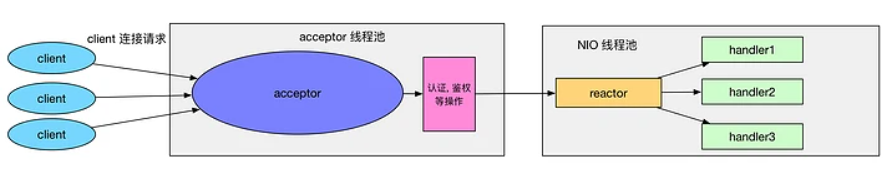
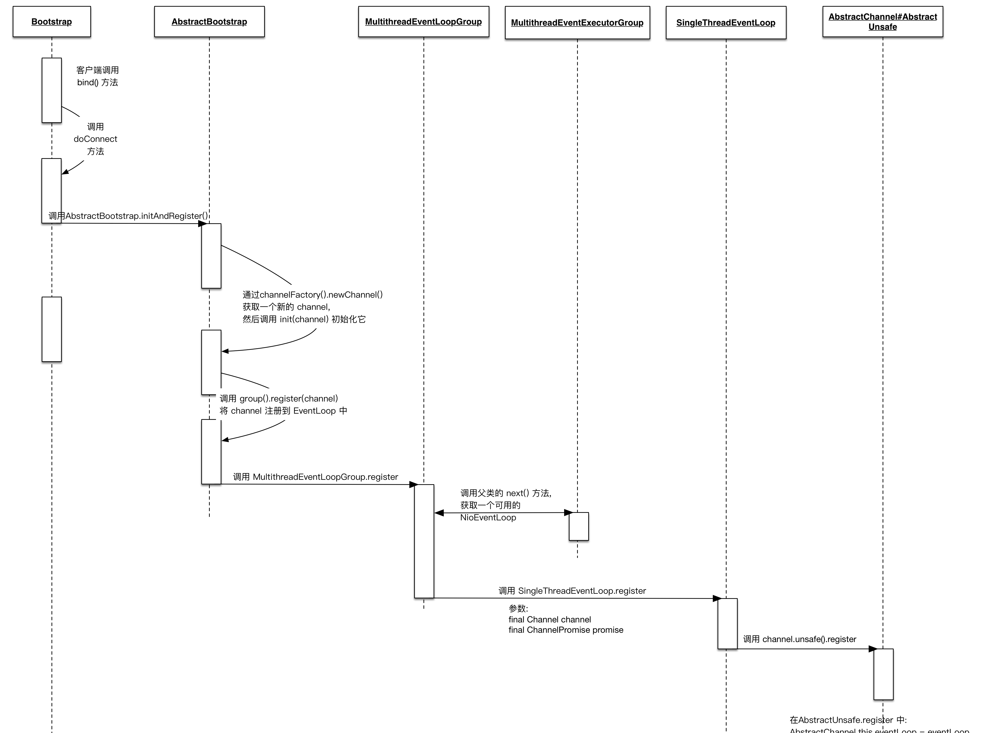

## 1. 开头  
我们由前面的直到当一个netty程序启动后，至少需要一个EventLoopGroup，服务端需要一个bossEventLoopgroup，还需要一个WorkEventLoopGroup，我们知道这是对应于reacotr模型  


## 2. reactor模型回顾
### 2.1. 单线程  
  
 &emsp;&emsp;acceptor 处理和 handler 处理都在一个线程中处理。    
 存在缺陷：
* 当其中某个 handler 阻塞时, 会导致其他所有的 client 的 handler 都得不到执行,
* 并且更严重的是, handler 的阻塞也会导致整个服务不能接收新的 client 请求(因为 acceptor 也被阻塞了). 因为有这么多的缺陷, 因此单线程Reactor 模型用的比较少。
### 2.2. 非主从多线程
  
为了避免单线程的缺陷，如图所示，对单线程进行改进，形成了多线程reactor模型, 其特点如下：  
* 有专门一个线程, 即 Acceptor 线程用于监听客户端的TCP连接请求
* 客户端连接的 IO 操作都是由一个特定的 NIO 线程池负责. 每个客户端连接都与一个特定的 NIO 线程绑定, 因此在这个客户端连接中的所有 IO 操作都是在同一个线程中完成的
* 客户端连接有很多, 但是 NIO 线程数是比较少的, 因此一个 NIO 线程可以同时绑定到多个客户端连接中.  

一般情况下, Reactor 的多线程模式已经可以很好的工作了, 但是依然存在一些缺陷：  
* 如果我们的服务器需要同时处理大量的客户端连接请求， 造成了大量的客户端不能连接到服务器
* 我们需要在客户端连接时, 进行一些权限的检查, 那么单线程的 Acceptor 很有可能就处理不过来, 造成了大量的客户端不能连接到服务器
### 2.3. 主从模型    
  
为了解决上述的缺陷，提出了主从多线程模型，如上图所示  
&emsp;&emsp;其特点为：
* 服务器端接收客户端的连接请求不再是一个线程, 而是由一个独立的线程池组成  


## 3. netty对reactor模型的支持
### 3.1. 单线程
```
EventLoopGroup bossGroup = new NioEventLoopGroup(1);
ServerBootstrap b = new ServerBootstrap();
b.group(bossGroup)
 .channel(NioServerSocketChannel.class)
 ...
```
解释：  
* NioEventLoopGroup 的线程池大小是1
* b.group(bossGroup) 设置了服务器端的 EventLoopGroup
* ServerBootstrap 重写了 group，当传入一个 group 时, 那么 bossGroup 和 workerGroup 就是同一个 NioEventLoopGroup 
* NioEventLoopGroup 只有一个线程, 这样就会导致 Netty 中的 acceptor 和后续的所有客户端连接的 IO 操作都是在一个线程中处理的. 那么对应到 Reactor 的线程模型中, 我们这样设置 NioEventLoopGroup 时, 就相当于 Reactor 单线程模型
### 3.2. 非主从多线程
```
EventLoopGroup bossGroup = new NioEventLoopGroup(1);
EventLoopGroup workerGroup = new NioEventLoopGroup();
ServerBootstrap b = new ServerBootstrap();
b.group(bossGroup, workerGroup)
 .channel(NioServerSocketChannel.class)
 ...
```
解释：  
* bossGroup 中只有一个线程
* 而 workerGroup 中的线程是 CPU 核心数乘以2, 因此对应的到 Reactor 线程模型中, 我们知道, 这样设置的 NioEventLoopGroup 其实就是 Reactor 多线程模型.
### 3.3. 主从多线程模型
主从多线程模型 在 Netty 的服务器端是不存在的。 ServerSocketChannel 只绑定到了 bossGroup 中的一个线程, 因此在调用 Java NIO 的 Selector.select 处理客户端的连接请求时, 实际上是在一个线程中的, 所以对只有一个服务的应用来说, bossGroup 设置多个线程是没有什么作用的, 反而还会造成资源浪费。但是为什么Netty 中的 bossGroup 为什么使用线程池呢？  
作者的回复是：
the creator of Netty says multiple boss threads are useful if we share NioEventLoopGroup between different server bootstraps, but I don't see the reason for it.


&emsp;&emsp;Reactor就是一个执行while (true) { selector.select(); ...}循环的线程，会源源不断的产生新的事件，称作反应堆很贴切。
事件又分为连接事件、IO读和IO写事件，一般把连接事件单独放一线程里处理，即主Reactor（MainReactor），IO读和IO写事件放到另外的一组线程里处理，即从Reactor（SubReactor），从Reactor线程数量一般为2*(CPUs - 1)。   
&emsp;&emsp;所以在运行时，MainReactor只处理Accept事件，连接到来，马上按照策略转发给从Reactor之一，只处理连接，故开销非常小；每个SubReactor管理多个连接，负责这些连接的读和写，属于IO密集型线程，读到完整的消息就丢给业务线程池处理业务，处理完比后，响应消息一般放到队列里，SubReactor会去处理队列，然后将消息写回。  


## 4. NioEventLoopGroup

NioEventLoopGroup可以类比为线程池，其关键点主要有：  
* EventLoopGroup(其实是MultithreadEventExecutorGroup) 内部维护一个类型为 EventExecutor children 数组, 其大小是 nThreads, 这样就构成了一个线程池
* 如果我们在实例化 NioEventLoopGroup 时, 如果指定线程池大小, 则 nThreads 就是指定的值, 反之是处理器核心数 * 2
* MultithreadEventExecutorGroup 中会调用 newChild 抽象方法来初始化 children 数组
* 抽象方法 newChild 是在 NioEventLoopGroup 中实现的, 它返回一个 NioEventLoop 实例.
* NioEventLoop 属性:
   * SelectorProvider provider 属性: NioEventLoopGroup 构造器中通过 SelectorProvider.provider() 获取一个 SelectorProvider
   * Selector selector 属性: NioEventLoop 构造器中通过调用通过 selector = provider.openSelector() 获取一个 selector 对象


## 5. EventLoop 初始化

### 5.1. EventLoop总览
通过类图，我们可以知道NioEventLoop继承于SingleThreadEventExecutor，SingleThreadEventExecutor持有java thread, NioEventLoop是Netty 中对本地线程的抽象, 它内部有一个 Thread thread 属性, 存储了一个本地 Java 线程. 因此我们可以认为, 一个 NioEventLoop 其实和一个特定的线程绑定, 并且在其生命周期内, 绑定的线程都不会再改变。它的关键点主要有：
* eventloop的继承链为：NioEventLoop -> SingleThreadEventLoop -> SingleThreadEventExecutor -> AbstractScheduledEventExecutor
* AbstractScheduledEventExecutor实现了schedule 功能，所以eventloop拥有定时任务的功能
* SingleThreadEventLoop实现了队列功能，所以eventloop可以执行execute 方法来向任务队列中添加一个 task, 并由 NioEventLoop 进行调度执行
* 一般eventloop主要执行两中任务：
  * 作为 IO 线程, 执行与 Channel 相关的 IO 操作，包括 调用 select 等待就绪的 IO 事件、读写数据与数据的处理等
  * 作为任务队列, 执行 taskQueue 中的任务, 例如用户调用 eventLoop.schedule 提交的定时任务也是这个线程执行的  


### 5.2. EventLoop实例化
  
我们从时序图中可以看出，SingleThreadEventExecutor会通过ThreadPerTaskExecutor创建thread
```
//一个task一个thread
public final class ThreadPerTaskExecutor implements Executor {
    private final ThreadFactory threadFactory;

    public ThreadPerTaskExecutor(ThreadFactory threadFactory) {
        if (threadFactory == null) {
            throw new NullPointerException("threadFactory");
        }
        this.threadFactory = threadFactory;
    }

    @Override
    public void execute(Runnable command) {
        threadFactory.newThread(command).start();
    }
}

```

```
  protected SingleThreadEventExecutor(EventExecutorGroup parent, Executor executor,
                                        boolean addTaskWakesUp, int maxPendingTasks,
                                        RejectedExecutionHandler rejectedHandler) {
        super(parent);
        this.addTaskWakesUp = addTaskWakesUp;
        this.maxPendingTasks = Math.max(16, maxPendingTasks);
        this.executor = ThreadExecutorMap.apply(executor, this);
        taskQueue = newTaskQueue(this.maxPendingTasks);
        rejectedExecutionHandler = ObjectUtil.checkNotNull(rejectedHandler, "rejectedHandler");
    }
```


### 5.3. EventLoop与 Channel绑定
每个 Channel 都有且仅有一个 EventLoop 与之关联过程如时序图所示
  
AbstractChannel#AbstractUnsafe.register 后, 就完成了 Channel 和 EventLoop 

```

    final ChannelFuture initAndRegister() {
        Channel channel = null;
        try {
            channel = channelFactory.newChannel();
            init(channel);
        } catch (Throwable t) {
            if (channel != null) {
                // channel can be null if newChannel crashed (eg SocketException("too many open files"))
                channel.unsafe().closeForcibly();
                // as the Channel is not registered yet we need to force the usage of the GlobalEventExecutor
                return new DefaultChannelPromise(channel, GlobalEventExecutor.INSTANCE).setFailure(t);
            }
            // as the Channel is not registered yet we need to force the usage of the GlobalEventExecutor
            return new DefaultChannelPromise(new FailedChannel(), GlobalEventExecutor.INSTANCE).setFailure(t);
        }
        //开始register
        ChannelFuture regFuture = config().group().register(channel);
        if (regFuture.cause() != null) {
            if (channel.isRegistered()) {
                channel.close();
            } else {
                channel.unsafe().closeForcibly();
            }
        }
```


```
    public ChannelFuture register(final ChannelPromise promise) {
        ObjectUtil.checkNotNull(promise, "promise");
        promise.channel().unsafe().register(this, promise);
        return promise;
    }
```
发生channel和eventloop绑定

```
    protected abstract class AbstractUnsafe implements Unsafe {

        ......


        public final void register(EventLoop eventLoop, final ChannelPromise promise) {
            if (eventLoop == null) {
                throw new NullPointerException("eventLoop");
            }
            if (isRegistered()) {
                promise.setFailure(new IllegalStateException("registered to an event loop already"));
                return;
            }
            if (!isCompatible(eventLoop)) {
                promise.setFailure(
                        new IllegalStateException("incompatible event loop type: " + eventLoop.getClass().getName()));
                return;
            }

            AbstractChannel.this.eventLoop = eventLoop;

```


### 5.4. EventLoop启动
NioEventLoop 本身就是一个 SingleThreadEventExecutor, 因此 NioEventLoop 的启动, 其实就是 NioEventLoop 所绑定的本地 Java 线程的启动  
所以我们需要找到 SingleThreadEventExecutor 的 thread 字段的 start() 方法。   

* 如下代码为SingleThreadEventExecutor的start方法
```
  private void startThread() {
        if (state == ST_NOT_STARTED) {
            if (STATE_UPDATER.compareAndSet(this, ST_NOT_STARTED, ST_STARTED)) {
                boolean success = false;
                try {
                    doStartThread();
                    success = true;
                } finally {
                    if (!success) {
                        STATE_UPDATER.compareAndSet(this, ST_STARTED, ST_NOT_STARTED);
                    }
                }
            }
        }
    }
```
  * STATE_UPDATER 是 SingleThreadEventExecutor 内部维护的一个属性, 它的作用是标识当前的 thread 的状态. 
  * 在初始的时候, STATE_UPDATER == ST_NOT_STARTED, 因此第一次调用 startThread() 方法时, 就会进入到 if 语句内, 进而调用到 thread.start().  

* 上面的start的方法被execute方法执行，而execute正是在 EventLoop 与 Channel 的关联的时候被AbstractUnsafe.register所执行，如下代码所示
  io.netty.channel.AbstractChannel.AbstractUnsafe#register方法.
  ```
    if (eventLoop.inEventLoop()) {
        register0(promise);
    } else {
        try {
            eventLoop.execute(new Runnable() {
                @Override
                public void run() {
                    register0(promise);
                }
            });
        } catch (Throwable t) {
            logger.warn(
                    "Force-closing a channel whose registration task was not accepted by an event loop: {}",
                    AbstractChannel.this, t);
            closeForcibly();
            closeFuture.setClosed();
            safeSetFailure(promise, t);
        }
  ```
    * Bootstrap.bind -> AbstractChannel#AbstractUnsafe.register 方法, 整个代码都是在主线程中运行的, 因此上面的 eventLoop.inEventLoop() 就为 false
    * 进入到 else 分支, 在这个分支中调用了 eventLoop.execute. eventLoop 是一个 NioEventLoop 的实例, 而 NioEventLoop 没有实现 execute 方法, 因此调用的是 SingleThreadEventExecutor.execute
    * 于是就调用了开始的方法startThread() 方法来启动 SingleThreadEventExecutor 内部关联的 Java 本地线程了，即当 EventLoop.execute 第一次被调用时, 就会触发 startThread() 的调用, 进而导致了 EventLoop 所对应的 Java 线程的启动
    


## 6. EventLoop处理事件
我们在前面也分析过，EventLoop 主要负责两个工作：
* 第一个是作为 IO 线程, 负责相应的 IO 操作
* 第二个是作为任务线程, 执行 taskQueue 中的任务   

Netty的reactor模型是如何将TCP数据从Java NIO Socket 传递到我们的 handler 中的呢？  
### 6.1. java nio selector回顾
#### 6.1.1. 使用流程
* 通过 Selector.open() 打开一个 Selector.
* 将 Channel 注册到 Selector 中, 并设置需要监听的事件(interest set)
* 不断重复:
    * 调用 select() 方法
    * 调用 selector.selectedKeys() 获取 selected keys
    * 迭代每个 selected key:
      * 从 selected key 中获取 对应的 Channel 和附加信息(如果有的话)
      * 判断是哪些 IO 事件已经就绪了, 然后处理它们. 如果是 OP_ACCEPT 事件, 则调用 "SocketChannel clientChannel = ((ServerSocketChannel) key.channel()).accept()" 获取 SocketChannel, 并将它设置为 非阻塞的, 然后将这个 Channel 注册到 Selector 中.
      * 根据需要更改 selected key 的监听事件.
      * 将已经处理过的 key 从 selected keys 集合中删除.

#### 6.1.2. 使用示例
```
public class NioEchoServer {
    private static final int BUF_SIZE = 256;
    private static final int TIMEOUT = 3000;

    public static void main(String args[]) throws Exception {
        // 打开服务端 Socket
        ServerSocketChannel serverSocketChannel = ServerSocketChannel.open();

        // 打开 Selector
        Selector selector = Selector.open();

        // 服务端 Socket 监听8080端口, 并配置为非阻塞模式
        serverSocketChannel.socket().bind(new InetSocketAddress(8080));
        serverSocketChannel.configureBlocking(false);

        // 将 channel 注册到 selector 中.
        // 通常我们都是先注册一个 OP_ACCEPT 事件, 然后在 OP_ACCEPT 到来时, 再将这个 Channel 的 OP_READ
        // 注册到 Selector 中.
        serverSocketChannel.register(selector, SelectionKey.OP_ACCEPT);

        while (true) {
            // 通过调用 select 方法, 阻塞地等待 channel I/O 可操作
            if (selector.select(TIMEOUT) == 0) {
                System.out.print(".");
                continue;
            }

            // 获取 I/O 操作就绪的 SelectionKey, 通过 SelectionKey 可以知道哪些 Channel 的哪类 I/O 操作已经就绪.
            Iterator<SelectionKey> keyIterator = selector.selectedKeys().iterator();

            while (keyIterator.hasNext()) {

                SelectionKey key = keyIterator.next();

                // 当获取一个 SelectionKey 后, 就要将它删除, 表示我们已经对这个 IO 事件进行了处理.
                keyIterator.remove();

                if (key.isAcceptable()) {
                    // 当 OP_ACCEPT 事件到来时, 我们就有从 ServerSocketChannel 中获取一个 SocketChannel,
                    // 代表客户端的连接
                    // 注意, 在 OP_ACCEPT 事件中, 从 key.channel() 返回的 Channel 是 ServerSocketChannel.
                    // 而在 OP_WRITE 和 OP_READ 中, 从 key.channel() 返回的是 SocketChannel.
                    SocketChannel clientChannel = ((ServerSocketChannel) key.channel()).accept();
                    clientChannel.configureBlocking(false);
                    //在 OP_ACCEPT 到来时, 再将这个 Channel 的 OP_READ 注册到 Selector 中.
                    // 注意, 这里我们如果没有设置 OP_READ 的话, 即 interest set 仍然是 OP_CONNECT 的话, 那么 select 方法会一直直接返回.
                    clientChannel.register(key.selector(), OP_READ, ByteBuffer.allocate(BUF_SIZE));
                }

                if (key.isReadable()) {
                    SocketChannel clientChannel = (SocketChannel) key.channel();
                    ByteBuffer buf = (ByteBuffer) key.attachment();
                    long bytesRead = clientChannel.read(buf);
                    if (bytesRead == -1) {
                        clientChannel.close();
                    } else if (bytesRead > 0) {
                        key.interestOps(OP_READ | SelectionKey.OP_WRITE);
                        System.out.println("Get data length: " + bytesRead);
                    }
                }

                if (key.isValid() && key.isWritable()) {
                    ByteBuffer buf = (ByteBuffer) key.attachment();
                    buf.flip();
                    SocketChannel clientChannel = (SocketChannel) key.channel();

                    clientChannel.write(buf);

                    if (!buf.hasRemaining()) {
                        key.interestOps(OP_READ);
                    }
                    buf.compact();
                }
            }
        }
    }
}
```


### 6.1. netty的绑定serversocketchannel
其实在之前的分析中，我们已经分析过如何将serversocketchannel注册到selector上。   
* 其注册的调用链如下：  
```
Bootstrap.initAndRegister -> 
    AbstractBootstrap.initAndRegister -> 
        MultithreadEventLoopGroup.register -> 
            SingleThreadEventLoop.register -> 
                AbstractUnsafe.register ->
                    AbstractUnsafe.register0 ->
                        AbstractNioChannel.doRegister
```

* AbstractUnsafe.register 方法中调用了 register0 方法
* register0 又调用了 AbstractNioChannel.doRegister，如下：
```
    protected void doRegister() throws Exception {
        boolean selected = false;
        for (;;) {
            try {
                logger.info("initial register： " + 0);
                selectionKey = javaChannel().register(eventLoop().unwrappedSelector(), 0, this);
                return;
            } catch (CancelledKeyException e) {
                if (!selected) {
                    // Force the Selector to select now as the "canceled" SelectionKey may still be
                    // cached and not removed because no Select.select(..) operation was called yet.
                    eventLoop().selectNow();
                    selected = true;
                } else {
                    // We forced a select operation on the selector before but the SelectionKey is still cached
                    // for whatever reason. JDK bug ?
                    throw e;
                }
            }
        }
    }
```
**javaChannel() 返回的是一个 Java NIO SocketChannel 对象, 我们将此 SocketChannel 注册到前面第一步获取的 Selector 中**  


### 6.2. netty触发监听selector
 &emsp;&emsp;EventLoop 的启动时，我们也分析过了， EventLoop.execute 第一次被调用时, 就会触发 startThread() 的调用，进而导致了 EventLoop 所对应的 Java 线程的启动，对selector的事件的监听就在这个流程之中。

* excute触发SingleThreadEventExecutor.this.run();
```
   private void doStartThread() {
        assert thread == null;
        executor.execute(new Runnable() {
            @Override
            public void run() {
                thread = Thread.currentThread();
                if (interrupted) {
                    thread.interrupt();
                }

                boolean success = false;
                updateLastExecutionTime();
                try {
                    SingleThreadEventExecutor.this.run();
```

*  NioEventLoop.run() 方法
  ```
      //死循环监听、处理事件
    protected void run() {
        for (;;) {
            try {
                try {
                    switch (selectStrategy.calculateStrategy(selectNowSupplier, hasTasks())) {
                    case SelectStrategy.CONTINUE:
                        continue;
                    case SelectStrategy.BUSY_WAIT:
                    case SelectStrategy.SELECT:
                        select(wakenUp.getAndSet(false));
                        if (wakenUp.get()) {
                            selector.wakeup();
                        }
                        // fall through
                    default:
                    }
                } catch (IOException e) {
                    // If we receive an IOException here its because the Selector is messed up. Let's rebuild
                    // the selector and retry. https://github.com/netty/netty/issues/8566
                    rebuildSelector0();
                    handleLoopException(e);
                    continue;
                }
  
                cancelledKeys = 0;
                needsToSelectAgain = false;
                final int ioRatio = this.ioRatio;
                if (ioRatio == 100) {
                    try {
                        processSelectedKeys();
                    } finally {
                        // Ensure we always run tasks.
                        runAllTasks();
                    }
                } else {
                    final long ioStartTime = System.nanoTime();
                    try {
                        processSelectedKeys();
                    } finally {
                        // Ensure we always run tasks.
                        final long ioTime = System.nanoTime() - ioStartTime;
                        runAllTasks(ioTime * (100 - ioRatio) / ioRatio);
                    }
                }
            } catch (Throwable t) {
                handleLoopException(t);
            }
            // Always handle shutdown even if the loop processing threw an exception.
            try {
                if (isShuttingDown()) {
                    closeAll();
                    if (confirmShutdown()) {
                        return;
                    }
                }
            } catch (Throwable t) {
                handleLoopException(t);
            }
        }
    }
  ```

  **NioEventLoop 事件循环的核心就是这里的死循环**


### 6.3. selector触发事件
* 第一步是调用 hasTasks() 方法来判断当前任务队列中是否有任务
  ```
    public int calculateStrategy(IntSupplier selectSupplier, boolean hasTasks) throws Exception {
        return hasTasks ? selectSupplier.get() : SelectStrategy.SELECT;
    }
  ```
  ```
    protected boolean hasTasks() {
        return super.hasTasks() || !tailTasks.isEmpty();
    }
  ```
* 当 hasTasks有任务时，每一个NioEventLoop持有一个selector,就会执行selector的selectNow() 方法, 
  ```
      int selectNow() throws IOException {
        try {
            return selector.selectNow();
        } finally {
            // restore wakeup state if needed
            if (wakenUp.get()) {
                selector.wakeup();
            }
        }
    }
  ```
  **selectNow() 方法会检查当前是否有就绪的 IO 事件, 如果有, 则返回就绪 IO 事件的个数; 如果没有, 则返回0. 注意, selectNow() 是立即返回的, 不会阻塞当前线程. 当 selectNow() 调用后, finally 语句块中会检查 wakenUp 变量是否为 true, 当为 true 时, 调用 selector.wakeup() 唤醒 select() 的阻塞调用**

* 当没有task要做的时候， 会执行private void select(boolean oldWakenUp)方法，select阻塞1s，如果有task,wakeup去做。
  ```
    private void select(boolean oldWakenUp) throws IOException {
        Selector selector = this.selector;
        try {
            ...
            int selectedKeys = selector.select(timeoutMillis);
            ...
        } catch (CancelledKeyException e) {
            ...
        }
    }
  ```
  具体分析：  
  * 在这个 select 方法中, 调用了 selector.select(timeoutMillis), 而这个调用是会阻塞住当前线程的, timeoutMillis 是阻塞的超时时间.
  * 当hasTasks() 为真时, 调用的的 selectNow() 方法是不会阻塞当前线程的, 而当 hasTasks() 为假时, 调用的 select(oldWakenUp) 是会阻塞当前线程的.
  * 当 taskQueue 中没有任务时, 那么 Netty 可以阻塞地等待 IO 就绪事件; 而当 taskQueue 中有任务时, 我们自然地希望所提交的任务可以尽快地执行, 因此 Netty 会调用非阻塞的 selectNow() 方法, 以保证 taskQueue 中的任务尽快可以执行  


### 6.4. 事件处理
NioEventLoop.run 中循环的剩余部分就是处理event事件了。
```
    cancelledKeys = 0;
    needsToSelectAgain = false;
    final int ioRatio = this.ioRatio;
    if (ioRatio == 100) {
        try {
            processSelectedKeys();
        } finally {
            // Ensure we always run tasks.
            runAllTasks();
        }
    } else {
        final long ioStartTime = System.nanoTime();
        try {
            processSelectedKeys();
        } finally {
            // Ensure we always run tasks.
            final long ioTime = System.nanoTime() - ioStartTime;
            runAllTasks(ioTime * (100 - ioRatio) / ioRatio);
        }
    }
```
分析：
* processSelectedKeys()查询就绪的 IO 事件, 然后处理它
* runAllTasks(), 运行 taskQueue 中的任务
* ioRatio，线程分配给 IO 操作所占的时间比，我们设置 ioRate = 70 时, 则表示 IO 运行耗时占比为70%, 即假设某次循环一共耗时为 100ms, 那么根据公式, 我们知道 processSelectedKeys() 方法调用所耗时大概为70ms(即 IO 耗时), 而 runAllTasks() 耗时大概为 30ms(即执行 task 耗时).
当 ioRatio 为 100 时, Netty 就不考虑 IO 耗时的占比, 而是分别调用 processSelectedKeys()、runAllTasks(); 而当 ioRatio 不为 100时, 则执行到 else 分支, 在这个分支中, 首先记录下 processSelectedKeys() 所执行的时间(即 IO 操作的耗时), 然后根据公式, 计算出执行 task 所占用的时间, 然后以此为参数, 调用 runAllTasks()  


#### 6.4.1. processSelectedKeysOptimized
##### 6.4.1.1. 整体流程
```
    private void processSelectedKeys() {
        if (selectedKeys != null) {
            //不用JDK的selector.selectedKeys(), 性能更好（1%-2%），垃圾回收更少
            processSelectedKeysOptimized();
        } else {
            processSelectedKeysPlain(selector.selectedKeys());
        }
    }

        private void processSelectedKeysOptimized() {
        for (int i = 0; i < selectedKeys.size; ++i) {
            final SelectionKey k = selectedKeys.keys[i];

            selectedKeys.keys[i] = null;

            //呼应于channel的register中的this: 例如：selectionKey = javaChannel().register(eventLoop().unwrappedSelector(), 0, this);
            final Object a = k.attachment();

            if (a instanceof AbstractNioChannel) {
                processSelectedKey(k, (AbstractNioChannel) a);
            } else {
                @SuppressWarnings("unchecked")
                NioTask<SelectableChannel> task = (NioTask<SelectableChannel>) a;
                processSelectedKey(k, task);
            }

            if (needsToSelectAgain) {

                selectedKeys.reset(i + 1);

                selectAgain();
                i = -1;
            }
        }
    }
```
分析：  
* 迭代 selectedKeys 获取就绪的 IO 事件, 然后为每个事件都调用 processSelectedKey 来处理它
* 通过selectionKey.attachment() 获取之前附加的SocketChannel对象，因为我们在将 SocketChannel 注册到 Selector 中时, 将 SocketChannel 所对应的 NioSocketChannel 以附加字段的方式添加到了selectionKey 中
* processSelectedKey进行处理
  ```
      private void processSelectedKey(SelectionKey k, AbstractNioChannel ch) {
        final AbstractNioChannel.NioUnsafe unsafe = ch.unsafe();
        if (!k.isValid()) {
            final EventLoop eventLoop;
            try {
                eventLoop = ch.eventLoop();
            } catch (Throwable ignored) {
                // If the channel implementation throws an exception because there is no event loop, we ignore this
                // because we are only trying to determine if ch is registered to this event loop and thus has authority
                // to close ch.
                return;
            }
            // Only close ch if ch is still registered to this EventLoop. ch could have deregistered from the event loop
            // and thus the SelectionKey could be cancelled as part of the deregistration process, but the channel is
            // still healthy and should not be closed.
            // See https://github.com/netty/netty/issues/5125
            if (eventLoop != this || eventLoop == null) {
                return;
            }
            // close the channel if the key is not valid anymore
            unsafe.close(unsafe.voidPromise());
            return;
        }
  
        try {
            int readyOps = k.readyOps();
            // We first need to call finishConnect() before try to trigger a read(...) or write(...) as otherwise
            // the NIO JDK channel implementation may throw a NotYetConnectedException.
            if ((readyOps & SelectionKey.OP_CONNECT) != 0) {
                // remove OP_CONNECT as otherwise Selector.select(..) will always return without blocking
                // See https://github.com/netty/netty/issues/924
                int ops = k.interestOps();
                ops &= ~SelectionKey.OP_CONNECT;
                k.interestOps(ops);
  
                unsafe.finishConnect();
            }
  
            // Process OP_WRITE first as we may be able to write some queued buffers and so free memory.
            if ((readyOps & SelectionKey.OP_WRITE) != 0) {
                // Call forceFlush which will also take care of clear the OP_WRITE once there is nothing left to write
                ch.unsafe().forceFlush();
            }
  
            // Also check for readOps of 0 to workaround possible JDK bug which may otherwise lead
            // to a spin loop
            //处理读请求（断开连接）或接入连接
            if ((readyOps & (SelectionKey.OP_READ | SelectionKey.OP_ACCEPT)) != 0 || readyOps == 0) {
                unsafe.read();
            }
        } catch (CancelledKeyException ignored) {
            unsafe.close(unsafe.voidPromise());
        }
    }
  ```
   这里就是Java NIO 的 Selector 的那一套处理流程：
     * OP_READ, 可读事件, 即 Channel 中收到了新数据可供上层读取.
     * OP_WRITE, 可写事件, 即上层可以向 Channel 写入数据.
     * OP_CONNECT, 连接建立事件, 即 TCP 连接已经建立, Channel 处于 active 状态  


##### 6.4.1.2. OP_READ 处理  
```
// 可读事件
if ((readyOps & (SelectionKey.OP_READ | SelectionKey.OP_ACCEPT)) != 0 || readyOps == 0) {
    unsafe.read();
    if (!ch.isOpen()) {
        // Connection already closed - no need to handle write.
        return;
    }
}
```
unsafe是一个 NioSocketChannelUnsafe 实例, 负责的是 Channel 的底层 IO 操作在它的父类 AbstractNioByteChannel 实现read方法：  
```
       @Override
        public final void read() {
            final ChannelConfig config = config();
            if (shouldBreakReadReady(config)) {
                clearReadPending();
                return;
            }
            final ChannelPipeline pipeline = pipeline();
            final ByteBufAllocator allocator = config.getAllocator();
            //io.netty.channel.DefaultChannelConfig中设置RecvByteBufAllocator，默认AdaptiveRecvByteBufAllocator
            final RecvByteBufAllocator.Handle allocHandle = recvBufAllocHandle();
            allocHandle.reset(config);

            ByteBuf byteBuf = null;
            boolean close = false;
            try {
                do {
                    //尽可能分配合适的大小：guess
                    byteBuf = allocHandle.allocate(allocator);
                    //读并且记录读了多少，如果读满了，下次continue的话就直接扩容。
                    allocHandle.lastBytesRead(doReadBytes(byteBuf));
                    if (allocHandle.lastBytesRead() <= 0) {
                        // nothing was read. release the buffer.
                        byteBuf.release();
                        byteBuf = null;
                        close = allocHandle.lastBytesRead() < 0;
                        if (close) {
                            // There is nothing left to read as we received an EOF.
                            readPending = false;
                        }
                        break;
                    }

                    allocHandle.incMessagesRead(1);
                    readPending = false;
                    //pipeline上执行，业务逻辑的处理就在这个地方
                    pipeline.fireChannelRead(byteBuf);
                    byteBuf = null;
                } while (allocHandle.continueReading());

                //记录这次读事件总共读了多少数据，计算下次分配大小。
                allocHandle.readComplete();
                //相当于完成本次读事件的处理
                pipeline.fireChannelReadComplete();

                if (close) {
                    closeOnRead(pipeline);
                }
            } catch (Throwable t) {
                handleReadException(pipeline, byteBuf, t, close, allocHandle);
            } finally {
                // Check if there is a readPending which was not processed yet.
                // This could be for two reasons:
                // * The user called Channel.read() or ChannelHandlerContext.read() in channelRead(...) method
                // * The user called Channel.read() or ChannelHandlerContext.read() in channelReadComplete(...) method
                //
                // See https://github.com/netty/netty/issues/2254
                if (!readPending && !config.isAutoRead()) {
                   removeReadOp();
                }
            }
        }
    }
```
分析：  
* 分配 ByteBuf
* 从 SocketChannel 中读取数据
* 调用 pipeline.fireChannelRead 发送一个 inbound 事件。此事件会以 head -> customContext -> tail 的方向依次流经 ChannelPipeline 中的各个 handler。调用了 pipeline.fireChannelRead 后, 就是 ChannelPipeline 中所需要做的工作了  

##### 6.4.1.3. OP_WRITE 处理
```
if ((readyOps & SelectionKey.OP_WRITE) != 0) {
    // Call forceFlush which will also take care of clear the OP_WRITE once there is nothing left to write
    ch.unsafe().forceFlush();
}
```
比较简单，就是可以写入了，你写吧
##### 6.4.1.4. OP_CONNECT 处理
```
if ((readyOps & SelectionKey.OP_CONNECT) != 0) {
    // remove OP_CONNECT as otherwise Selector.select(..) will always return without blocking
    // See https://github.com/netty/netty/issues/924
    int ops = k.interestOps();
    ops &= ~SelectionKey.OP_CONNECT;
    k.interestOps(ops);

    unsafe.finishConnect();
}
```
分析：  
* 正如代码中的注释所言, 我们需要将 OP_CONNECT 从就绪事件集中清除, 不然会一直有 OP_CONNECT 事件.
* 调用 unsafe.finishConnect() 通知上层连接已建立     

pipeline().fireChannelActive(), 产生一个 inbound 事件, 通知 pipeline 中的各个 handler TCP 通道已建立(即 ChannelInboundHandler.channelActive 方法  


#### 6.4.2. 任务机制  
##### 6.4.2.1. 普通任务
NioEventLoop 继承于 SingleThreadEventExecutor， SingleThreadEventExecutor 中有一个 Queue<Runnable> taskQueue 字段，用于存放添加的 Task. 每个 Task 都使用一个实现了 Runnable 接口的实例
* 添加任务,添加到 taskQueue 
  ```
    EventLoop eventLoop = channel.eventLoop();
    eventLoop.execute(new Runnable() {
        @Override
        public void run() {
            System.out.println("Hello, Netty!");
        }
    });
  ```
* 当调用 execute 后, 实际上是调用到了 SingleThreadEventExecutor.execute() 方法
  ```
    @Override
    public void execute(Runnable task) {
        if (task == null) {
            throw new NullPointerException("task");
        }
  
        boolean inEventLoop = inEventLoop();
        if (inEventLoop) {
            addTask(task);
        } else {
            startThread();
            addTask(task);
            if (isShutdown() && removeTask(task)) {
                reject();
            }
        }
  
        if (!addTaskWakesUp && wakesUpForTask(task)) {
            wakeup(inEventLoop);
        }
    }
  ```
* addTask
  ```
    protected void addTask(Runnable task) {
        if (task == null) {
            throw new NullPointerException("task");
        }
        if (isShutdown()) {
            reject();
        }
        taskQueue.add(task);
    }
  ```
##### 6.4.2.2. 定时任务  
&emsp;&emsp;EventLoop 中实现任务队列的功能在超类 SingleThreadEventExecutor 实现的, 而 schedule 功能的实现是在 SingleThreadEventExecutor 的父类, 即 AbstractScheduledEventExecutor 中实现的.
在 AbstractScheduledEventExecutor 中，他持有一个PriorityQueue<ScheduledFutureTask<?>> scheduledTaskQueue; 字段，存放的是ScheduledFutureTask。  
&emsp;&emsp;当一个 Runnable 传递进来后, 会被封装为一个 ScheduledFutureTask 对象, 这个对象会记录下这个 Runnable 在何时运行、已何种频率运行等信息.
当构建了 ScheduledFutureTask 后, 会继续调用 另一个重载的 schedule 方法
```
    @Override
    public <V> ScheduledFuture<V> schedule(Callable<V> callable, long delay, TimeUnit unit) {
        ObjectUtil.checkNotNull(callable, "callable");
        ObjectUtil.checkNotNull(unit, "unit");
        if (delay < 0) {
            delay = 0;
        }
        validateScheduled0(delay, unit);

        return schedule(new ScheduledFutureTask<V>(
                this, callable, ScheduledFutureTask.deadlineNanos(unit.toNanos(delay))));
    }
```
```
<V> ScheduledFuture<V> schedule(final ScheduledFutureTask<V> task) {
    if (inEventLoop()) {
        scheduledTaskQueue().add(task);
    } else {
        execute(new OneTimeTask() {
            @Override
            public void run() {
                scheduledTaskQueue().add(task);
            }
        });
    }

    return task;
}
```

##### 6.4.2.3. 执行任务  
当一个任务被添加到 taskQueue 后, 它是怎么被 EventLoop 执行的呢?  
NioEventLoop.run() 方法中, 在这个方法里, 会分别调用 processSelectedKeys() 和 runAllTasks() 方法, 来进行 IO 事件的处理和 task 的处理. processSelectedKeys()   
即runAllTasks()会执行添加的任务。

```
    protected boolean runAllTasks() {
        assert inEventLoop();
        boolean fetchedAll;
        boolean ranAtLeastOne = false;

        do {
            //转移scheduledTaskQueue -> taskQueue
            fetchedAll = fetchFromScheduledTaskQueue();
            if (runAllTasksFrom(taskQueue)) {
                ranAtLeastOne = true;
            }
        } while (!fetchedAll); // keep on processing until we fetched all scheduled tasks.

        if (ranAtLeastOne) {
            lastExecutionTime = ScheduledFutureTask.nanoTime();
        }
        afterRunningAllTasks();
        return ranAtLeastOne;
    }
```
分析：  
* EventLoop 可以通过调用 EventLoop.execute 来将一个 Runnable 提交到 taskQueue 中
* 也可以通过调用 EventLoop.schedule 来提交一个 schedule 任务到 scheduledTaskQueue 中
* 在此方法的一开始调用的 fetchFromScheduledTaskQueue() 其实就是将 scheduledTaskQueue 中已经可以执行的(即定时时间已到的 schedule 任务) 拿出来并添加到 taskQueue 中, 作为可执行的 task 等待被调度执行
  ```
    private void fetchFromScheduledTaskQueue() {
        if (hasScheduledTasks()) {
            long nanoTime = AbstractScheduledEventExecutor.nanoTime();
            for (;;) {
                Runnable scheduledTask = pollScheduledTask(nanoTime);
                if (scheduledTask == null) {
                    break;
                }
                taskQueue.add(scheduledTask);
            }
        }
    }
     protected final boolean runAllTasksFrom(Queue<Runnable> taskQueue) {
        Runnable task = pollTaskFrom(taskQueue);
        if (task == null) {
            return false;
        }
        for (;;) {
            safeExecute(task);
            task = pollTaskFrom(taskQueue);
            if (task == null) {
                return true;
            }
        }
    }
  ```
  **注意：因为 EventLoop 既需要执行 IO 操作, 又需要执行 task, 因此我们在调用 EventLoop.execute 方法提交任务时, 不要提交耗时任务, 更不能提交一些会造成阻塞的任务, 不然会导致我们的 IO 线程得不到调度, 影响整个程序的并发量.**


## 7. 总结
* ServerBooststrap的initAndRegister完成server的初始化和注册：
  * 创建了serversocketchannel实例（channelFactory.newChannel()）
  * 为serversocketchannel添加一个ChannelInitializer的hander（init方法）
  * 调用bossgroup绑定一个eventloop,并触发pipeline.fireChannelRegistered()的执行，(ChannelFuture regFuture = config().group().register(channel);)
  * fireChannelRegistered将会调用最终第二步ChannelInitializer的initChannel方法，并给pipine绑定用户的hander，移除自身，开启一个给pipine添加ServerBootstrapAcceptor hander的任务，用于接收socketchannel与childgroup的eventloop绑定
  * 上一步开启的任务会形成selector监听死循环任务，当有连接请求时，调用 unsafe.read()进行处理
  * serversocketchannel持有的是NioMessageUnsafe.read()会调用serversocketchannel的doReadMessages创建socketchannel实例
  * 接着上一步，继续执行pipeline.fireChannelRead(readBuf.get(i))，正好执行到ServerBootstrapAcceptor的channelRead方法
  * ServerBootstrapAcceptor的channelRead方法，会进行给scocketchannel的pipline设置handler，并选取一个child的eventloop绑定socketchannel(childGroup.register(child))
  * 上一步的注册动作会io.netty.channel.AbstractChannel.AbstractUnsafe#register0和第二步类似，最终会pipeline.fireChannelRegistered()，会触发initchannle的动作
