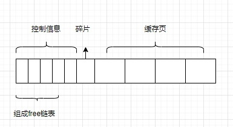

## InnoDB行

我们插入mysql的数据是一条一条的插入数据的，它在磁盘中存放的方式叫做行格式，一共有四种行格式（它们的基本原理相同的）：

### Compact格式

 

* 额外信息：

  第一列，存储了可变字段的数据长度（逆序排序）。

  第二列，记录了字段是否为空（逆序排序）。

    

  第三列，固定的5个字节，描述记录的元信息，该记录是否删除、位置信息、是否为叶子节点、下一节点记录的相对位置

  **注意：删除并没有将数据真正的删除，只是做了标记，被删除的记录会形成一个垃圾链表，这个链表所占的空间被称为可重用				  空间，后面有记录进来按照一定的规则会使用这个可重用空间，不过加入到可重用空间和删除是两个阶段。**

	真实信息

​				记录真实数据的时候，mysql会默认添加一些隐藏列：行id（如果表没有主键会添加该列）、事务id、回滚指针，这里如果字符				集utf-8这种变长字符集时，该字段也会被记录到变长字段中。


### Redundant格式

是一个比较老的格式，mysql5.0以前  

 

​	字段长度偏移列表：记录了每一个字段的偏移量，可以通过差值来计算每一个字段所占空间，这个也是逆序排序的

​	记录头信息：和compact大体类似，多了少量的属性

​	该行格式没有空值列表，如果是可变字段为空值，则长度偏移计算长度时为0，如果是固定长度的，则长度为预留的长度，而实际	存储的数据为oxoooooo这种符号表示。

​    **注意，redundant格式如果是变长字符集，则使用最大的长度，这样不会产生碎片，而compact存储最小的长度，如果有大于		这个最小的长度时，则需要重新开辟空间，原来的空间就会产生碎片**。

### InnoDB行溢出

#### VARCHAR(M)

​	我们知道对于 VARCHAR(M) 类型的列最多可以占用 65535 个字节。其中的 M 代表该类型最多存储的字符数量。

​	从执行结果中可以看出，如果 VARCHAR(M) 类型的列使用的不是 ascii 字符集，那 M 的最大取值取决于该字符集表示一个字符最多需要的字节数。在列的值允许为 NULL 的情况下， gbk 字符集表示一个字符最多需要 2 个字节，那在该字符集下， M 的最大取值就是 32766 （也就是：65532/2），也就是说最多能存储 32766 个字符；

​	utf8 字符集表示一个字符最多需要 3 个字节，那在该字符集下， M 的最大取值就是 21844 ，就是说最多能存储 21844 （也就是：65532/3）个字符。

**PS：gbk字符集下M的最大取值就是32766，utf8字符集下M的最大取值就是21844，这都是在表中只有一个字段的情况下说的，一定要记住一个行中的所有列（不包括隐藏列和记录头信息）占用的字节长度加起来不能超过65535个字节**。

#### 数据溢出

​	其中的 REPEAT('a', 65532) 是一个函数调用，它表示生成一个把字符 'a' 重复 65532 次的字符串。前边说过， MySQL 中磁盘和内存交互的基本单位是 页 ，也就是说 MySQL 是以 页 为基本单位来管理存储空间的，我们的记录都会被分配到某个 页 中存储。而一个页的大小一般是 16KB ，也就是 16384 字节，而一个 VARCHAR(M) 类型的列就最多可以存储 65532 个字节，这样就可能造成一个页存放不了一条记录的尴尬情况

​	VARCHAR(M)最多能存储的数据。 当一条数据不能完整在一个页中存储，需要放在其它页上时，这个就叫做行溢出。

​	不只是 VARCHAR(M) 类型的列，其他的 TEXT、BLOB 类型的列在存储数据非常多的时候也会发生 行溢出；

示例：

 

对于 Compact 和 Reduntant 行格式来说，如果某一列中的数据非常多的话，在本记录的真实数据处只会存储该列的前 768 个字节的数据和一个指向其他页的地址，然后把剩下的数据存放到其他页中，这个过程也叫做 行溢出 ，存储超出 768 字节的那些页面也被称为 溢出页

#### 临界点

不用关注这个临界点是什么，只需要一个行中存储了很大的数据时，可能发生行溢出 的现象

### Dynamic

格式和compact类似，在处理行溢出时有所不同。它们不会在记录的真实数据处存储字段真实数据的前 768 个字节，而是把所有的字节都存储到其他页面中，只在记录的真实数据处存储其他页面的地址，就像这样：

 

### Compressed

会采用压缩算法对页面压缩来节省空间

## InnoDB页（索引页）

​	Innodb是mysql具有事务特性的存储引擎，它存储和读取磁盘的数据的最小单位为页，一个页16kb，一般情况至少从磁盘读取16kb的内容到内存中，避免了一条一条读取数据。页根据存储的类型可以分为很多种，有存放表元数据的页，有undo日志的页，还有存储数据的索引页，这里我们先介绍下索引页（即存放数据的页）

### 索引页整体结构

 

### 行记录链表  

 

​	**这里指针指向的是真实数据和行信息之间，因为向右读直接是真实数据，向左读是null数据和可变长度，逆序排序这样读正好是正序的，这个设计很巧妙**

### 页内查找记录

​	将页内的记录分组，每一组最后的记录该组的记录树，并将该记录的偏移量拷贝出来放到页尾page dictory之中。

​	而如何去分组，有一套规定：

​	对于最小记录所在的分组只能有 1条记录，最大记录所在的分组拥有的记录条数只能在1-8条之间，剩下的分组中记录的条数范围只能在是4-8条之间

 

这样查找的时候可以根据2分法先找到对应的槽，然后在槽对应的分组中查找对应的记录。 

### 页的header

​	存储了描述页的元数据信息，比如存了多少条记录、还有多少空间没使用、删除了多少条、目录有多少个槽等等。

​	这个是专门针对数据页的描述信息

### file header

​	这个是描述的通用的元信息，包括其它类型的页，比如上一页是啥，下一页是啥等等，还有一个校验和，校验这个页是不是完整的。

​	还有页的类型，表示这个页是什么页，索引页、undo日志页、新分配页、系统页等等，数据是分散在不同的页中的，所以需要上一页和下一页把它们串联起来

 

### File Trailer

​	修改数据的时候是先修改内存的，后面会异步更新到磁盘中。写入磁盘时可能会断电出错，首部的校验和会被先写，然后再写尾部的校验和，当写的过程中断点，尾部没写完，那么校验和就不想等。这个尾部还会标记修改日志lsn

### 小结

#### 数据页结构

InnoDB为了不同的目的而设计了不同类型的页，我们把用于存放记录的页叫做 数据页 。

一个数据页可以被大致划分为7个部分，分别是

* File Header 

  表示页的一些通用信息，占固定的38字节。

* Page Header 

  表示数据页专有的一些信息，占固定的56个字节。

* Infimum + Supremum

  两个虚拟的伪记录，分别表示页中的最小和最大记录，占固定的 26 个字节。

* User Records

  真实存储我们插入的记录的部分，大小不固定。

* Free Space

  页中尚未使用的部分，大小不确定

* Page Directory

  页中的某些记录相对位置，也就是各个槽在页面中的地址偏移量，大小不固定，插
  入的记录越多，这个部分占用的空间越多。

* File Trailer

  用于检验页是否完整的部分，占用固定的8个字节

#### 行记录槽

每个记录的头信息中都有一个 next_record 属性，从而使页中的所有记录串联成一个 单链表 。

InnoDB 会为把页中的记录划分为若干个组，每个组的最后一个记录的地址偏移量作为一个 槽 ，存放在
Page Directory 中，所以在一个页中根据主键查找记录是非常快的，分为两步：

* 通过二分法确定该记录所在的槽。
* 通过记录的next_record属性遍历该槽所在的组中的各个记录。

#### 双链表

每个数据页的 File Header 部分都有上一个和下一个页的编号，所以所有的数据页会组成一个 双链表 。

#### 校验和

为保证从内存中同步到磁盘的页的完整性，在页的首部和尾部都会存储页中数据的校验和和页面最后修改时对应的 LSN 值，如果首部和尾部的校验和和 LSN 值校验不成功的话，就说明同步过程出现了问题。

**总的来说，各个数据页可以组成一个 双向链表 ，而每个数据页中的记录会按照主键值从小到大的顺序组成一个 单向链表 ，每个数据页都会为存储在它里边儿的记录生成一个页目录 ，在通过主键查找某条记录的时候可以在 页目录 中使用二分法快速定位到对应的槽，然后再遍历该槽对应分组中的记录即可快速找到指定的记录**

## b+树

如何组织这些数据页，下一个数据页中用户记录的主键值必须大于上一个页中用户记录的主键值

### innoDB

#### 页分裂

​	新分配的数据页编号可能并不是连续的，也就是说我们使用的这些页在存储空间里可能并不挨着。它们只是通过维护着上一个页和下一个页的编号而建立了链表关系。另外， 页10 中用户记录最大的主键值是 5 ，而 页28 中有一条记录的主键值是 4 ，因为 5>4 ，所以这就不符合下一个数据页中用户记录的主键值必须大于上一个页中用户记录的主键值的要求，所以在插入主键值为 4 的记录的时候需要伴随着一次记录移动，也就是把主键值为 5 的记录移动到 页28 中，然后再把主键值为 4 的记录插入到 页10 中。

​	这个过程表明了在对页中的记录进行增删改操作的过程中，我们必须通过一些诸如记录移动的操作来始终保证这个状态一直成立：下一个数据页中用户记录的主键值必须大于上一个页中用户记录的主键值。这个过程我们也可以称为 页分裂

#### 目录页

目录页中每一条记录指向一个数据页；

假设所有存放用户记录的叶子节点代表的数据页可以存放100条用户记录，所有存放目录项记录的内节点代表的数据页可以存放1000条目录项记录，那么：

* 如果 B+ 树只有1层，也就是只有1个用于存放用户记录的节点，最多能存放 100 条记录。
* 如果 B+ 树有2层，最多能存放 1000×100=100000 条记录。
* 如果 B+ 树有3层，最多能存放 1000×1000×100=100000000 条记录。
* 如果 B+ 树有4层，最多能存放 1000×1000×1000×100=100000000000 条记录

一般情况下，我们用到的 B+ 树都不会超过4层，那我们通过主键值去查找某条记录最多只需要做4个页面内的查找（查找3个目录项页和一个用户记录页），又因为在每个页面内有所谓的 Page Directory （页目录），所以在页面内也可以通过二分法实现快速定位记录；

#### 聚簇索引

我们上边介绍的 B+ 树本身就是一个目录，或者说本身就是一个索引。它有两个特点：

* 使用记录主键值的大小进行记录和页的排序，这包括三个方面的含义：
  * 页内的记录是按照主键的大小顺序排成一个单向链表。
  * 各个存放用户记录的页也是根据页中用户记录的主键大小顺序排成一个双向链表。
  * 存放目录项记录的页分为不同的层次，在同一层次中的页也是根据页中目录项记录的主键大小顺序排成一个双向链表。

* B+ 树的叶子节点存储的是完整的用户记录。
  所谓完整的用户记录，就是指这个记录中存储了所有列的值（包括隐藏列）。

我们把具有这两种特性的 B+ 树称为 聚簇索引 ，所有完整的用户记录都存放在这个 聚簇索引 的叶子节点处。这种 聚簇索引 并不需要我们在 MySQL 语句中显式的使用 INDEX 语句去创建InnoDB 存储引擎会自动的为我们创建聚簇索引。另外有趣的一点是，在 InnoDB 存储引擎中， 聚簇索引 就是数据的存储方式（所有的用户记录都存储在了 叶子节点 ），也就是所谓的索引即数据，数据即索引

#### 二级索引

​	因为这种按照 非主键列 建立的 B+ 树需要一次 回表 操作才可以定位到完整的用户记录，所以这种 B+ 树也被称为 二级索引 （英文名 secondary index ），或者 辅助索引 。由于我们使用的是 c2 列的大小作为 B+ 树的排序规则，所以我们也称这个 B+ 树为为c2列建立的索引；

​	我们根据这个以 c2 列大小排序的 B+ 树只能确定我们要查找记录的主键值，所以如果我们想根据 c2 列的值查找到完整的用户记录的话，仍然需要到 聚簇索引 中再查一遍，这个过程也被称为 **回表**；

如果我们想新插入一行记录，那么在修改这个为 c2 列建立的二级索引对应的 B+ 树时便碰到了个大问题：由于 页3 中存储的目录项记录是由 c2列 + 页号 的值构成的，页3 中的两条目录项记录对应的 c2 列的值都是 1 ，而我们新插入的这条记录的 c2 列的值也是 1 ，那我们这条新插入的记录到底应该放到 页4 中，还是应该放到 页5 中啊？答案是：不知道；所以对于二级索引的内节点的目录项记录的内容实际上是由三个部分构成的：

* 索引列的值
* 主键值
* 页号

也就是我们把 主键值 也添加到二级索引内节点中的目录项记录了，这样就能保证 B+ 树每一层节点中各条目录项记录除 页号 这个字段外是唯一的

#### 联合索引

​	以c2和c3列的大小为排序规则建立的B+树称为联合索引，本质上也是一个二级索引。它的意思与分别为c2和c3列分别建立索引的表述是不同的；

​	每条 目录项记录 都由 c2 、 c3 、 页号 这三个部分组成，各条记录先按照 c2 列的值进行排序，如果记录的 c2 列相同，则按照 c3 列的值进行排序。B+ 树叶子节点处的用户记录由 c2 、 c3 和主键 c1 列组成；

#### 根节点不变

 B+ 树的形成过程是这样的：

* 每当为某个表创建一个 B+ 树索引（聚簇索引不是人为创建的，默认就有）的时候，都会为这个索引创建一个 根节点 页面。最开始表中没有数据的时候，每个 B+ 树索引对应的 根节点 中既没有用户记录，也没有目录项记录
* 随后向表中插入用户记录时，先把用户记录存储到这个 根节点 中
* 当 根节点 中的可用空间用完时继续插入记录，此时会将 根节点 中的所有记录复制到一个新分配的页，比如 页a 中，然后对这个新页进行 页分裂 的操作，得到另一个新页，比如 页b 。这时新插入的记录根据键值（也就是聚簇索引中的主键值，二级索引中对应的索引列的值）的大小就会被分配到 页a 或者 页b 中，而根节点 便升级为存储目录项记录的页

一个B+树索引的根节点自诞生之日起，便不会再移动。这样只要我们对某个表建立一个索引，那么它的 根节点 的页号便会被记录到某个地方，然后凡是 InnoDB 存储引擎需要用到这个索引的时候，都会从那个固定的地方取出 根节点 的页号，从而来访问这个索引

#### 最少的记录

B+树本质上就是一个大的多层级目录，每经过一个目录时都会过滤掉许多无效的子目录，直到最后访问到存储真实数据的目录。 InnoDB 的一个数据页至少可以存放两条记录，这也是我们之前唠叨记录行格式的时候说过一个结论（我们当时依据这个结论推导了表中只有一个列时该列在不发生行溢出的情况下最多能存储多少字节，忘了的话回去看看吧）

### MyISAM

MyISAM的行格式有定长记录格式（Static）、变长记录格式（Dynamic）、压缩记录格式（Compressed）。上边用到的index_demo表采用定长记录格式，也就是一条记录占用存储空间的大小是固定的，这样就可以轻松算出某条记录在数据文件中的地址偏移量。但是变长记录格式就不行了，MyISAM会直接在索引叶子节点处存储该条记录在数据文件中的地址偏移量。通过这个可以看出，MyISAM的回表操作是十分快速的，因为是拿着地址偏移量直接到文件中取数据的，反观InnoDB是通过获取主键之后再去聚簇索引里边儿找记录，虽然说也不慢，但还是比不上直接用地址去访问。此处我们只是非常简要的介绍了一下MyISAM的索引，具体细节有很多。InnoDB中的索引即数据，数据即索引，而MyISAM中却是索引是索引、数据是数据。

### 小结

 


* 每个索引都对应一棵 B+ 树， B+ 树分为好多层，最下边一层是叶子节点，其余的是内节点。所有 用户记录都存储在 B+ 树的叶子节点，所有 目录项记录 都存储在内节点。

* InnoDB 存储引擎会自动为主键（如果没有它会自动帮我们添加）建立 聚簇索引 ，聚簇索引的叶子节点包含完整的用户记录。
* 我们可以为自己感兴趣的列建立 二级索引 ， 二级索引 的叶子节点包含的用户记录由 索引列 + 主键 组成，所以如果想通过 二级索引 来查找完整的用户记录的话，需要通过 回表 操作，也就是在通过 二级索引找到主键值之后再到 聚簇索引 中查找完整的用户记录。
* B+ 树中每层节点都是按照索引列值从小到大的顺序排序而组成了双向链表，而且每个页内的记录（不论是用户记录还是目录项记录）都是按照索引列的值从小到大的顺序而形成了一个单链表。如果是 联合索引 的话，则页面和记录先按照 联合索引 前边的列排序，如果该列值相同，再按照 联合索引 后边的列排序。
* 通过索引查找记录是从 B+ 树的根节点开始，一层一层向下搜索。由于每个页面都按照索引列的值建立了Page Directory （页目录），所以在这些页面中的查找非常快。

## MySQL的数据目录

​	InnoDB 、 MyISAM 这样的存储引擎都是把表存储在文件系统上的，当我们想读取数据的时候，这些存储引擎会从文件系统中把数据读出来返回给我们，当我们想写入数据的时候，这些存储引擎会把这些数据又写回文件系统

### 什么是数据目录

​	MySQL服务器程序在启动时会到文件系统的某个目录下加载一些文件，之后在运行过程中产生的数据也都会存储到这个目录下的某些文件中，这个目录就称为 数据目录

#### 什么是安装目录

​	安装目录 下非常重要的 bin 目录，它里边存储了许多关于控制客户端程序和服务器程序的命令（许多可执行文件，比如 mysql ， mysqld ， mysqld_safe 等等等等好几十个）。而 数据目录 是用来存储 MySQL 在运行过程中产生的数据；

#### 数据目录查看

数据目录 对应着一个系统变量 datadir

使用mysql命令

```
SHOW VARIABLES LIKE 'datadir'
```

 

### 数据目录的结构

MySQL 在运行过程中产生的数据主要有：

* 数据库、表、视图和触发器的用户数据
*  MySQL 也会创建一些其他的额外数据

#### 数据库目录

 CREATE DATABASE 数据库名 语句创建一个数据库的时候，每个数据库都对应数据目录下的一个子目录，或者说对应一个文件夹。具体的步骤为：

* 在 数据目录 下创建一个和数据库名同名的子目录（或者说是文件夹）。
* 在该与数据库名同名的子目录下创建一个名为 db.opt 的文件，这个文件中包含了该数据库的各种属性，比方说该数据库的字符集和比较规则

 

#### 表文件

 

我们的数据其实都是以记录的形式插入到表中的，每个表的信息其实可以分为两种：

* 表结构的定义

   就是该表的名称、列数量、数据类型、约束条件和索引、字符集等各种信息，这些信息都体现在了我们的建表语句中了。为了保存这些信息， InnoDB 和
  MyISAM 这两种存储引擎都在 数据目录 下对应的数据库子目录下创建了一个专门用于描述表结构的文件，文件名

  ```
  表名.frm
  ```

  当创建一个表时，就会创建一个名为 x.frm 的用于描述表结构的文件。值得注意的是，这个后缀名为.frm是以二进制格式存储的

* 表中的数据

  * InnoDB是存储表数据

    * InnoDB 其实是使用 页 为基本单位来管理存储空间的，默认的 页 大小为 16KB 。
    * 对于 InnoDB 存储引擎来说，每个索引都对应着一棵 B+ 树，该 B+ 树的每个节点都是一个数据页，数据页之间不必要是物理连续的，因为数据页之间有 双向链表 来维护着这些页的顺序。
    * InnoDB 的聚簇索引的叶子节点存储了完整的用户记录，也就是所谓的索引即数据，数据即索引

    为了更好的管理这些页，设计 InnoDB定义了一个 表空间 或者 文件空间 （英文名： table space 或者 file space ）的概念，这个表空间是一个抽象的概念，它可以对应文件系统上一个或多个真实文件（不同表空间对应的文件数量可能不同）。每一个 表空间 可以被划分为很多很多很多个 页 ，我们的表数据就存放在某个 表空间 下的某些页里。表空间划分为几种不同的类型

    * 系统表空间

      系统表空间 可以对应文件系统上一个或多个实际的文件，默认情况下， InnoDB 会在 数据目录 下创建一个名为 ibdata1 大小为 12M 的文件，这个文件就是对应的 系统表空间 在文件系统上的表示。这个文件是所谓的自扩展文件 ，当不够用的时候它会自己增加文件大小。

      可以在 MySQL 启动时配置对应的文件路径以及它们的大小，比如我们这样修改一下配置文件：

      ```
      [server]
      innodb_data_file_path=data1:512M;data2:512M:autoextend
      ```

      如上的配置会使得 MySQL 启动之后就会创建这两个512M大小的文件作为 系统表空间 ，其中的 autoextend 表明这两个文件如果不够用会自动扩展 data2 文件的大小。

      我们也可以把 系统表空间 对应的文件路径不配置到 数据目录 下，甚至可以配置到单独的磁盘分区上，涉及到的启动参数就是 innodb_data_file_path 和 innodb_data_home_dir。

      **PS：需要注意的一点是，在一个MySQL服务器中，系统表空间只有一份。从MySQL5.5.7到MySQL5.6.6之间的各个版本中，我们表中的数据都会被默认存储到这个 系统表空间；**

    * 独立表空间

      在MySQL5.6.6以及之后的版本中， InnoDB 并不会默认的把各个表的数据存储到系统表空间中，而是为每一个表建立一个独立表空间，也就是说我们创建了多少个表，就有多少个独立表空间。使用 独立表空间 来存储表数据的话，会在该表所属数据库对应的子目录下创建一个表示该 独立表空间 的文件，文件名和表名相同，只不过添加了一个 .ibd 的扩展名而已

      ```
      表名.ibd
      ```

      test 表的话，那么在该表所在数据库对应的 test 表创建这两个文件：

      ```
      test.frm
      test.ibd
      ```

      其中 test.ibd 文件就用来存储 test 表中的数据和索引。当然我们也可以自己指定使用 系统表空间 还是 独立表空间 来存储数据，这个功能由启动参数 innodb_file_per_table 控制，比如说我们想刻意将表数据都存储到系统表空间 时，可以在启动 MySQL 服务器的时候这样配置：

      ```
      [server]
      innodb_file_per_table=0
      ```

      当 innodb_file_per_table 的值为 0 时，代表使用系统表空间；当 innodb_file_per_table 的值为 1 时，代表使用独立表空间。不过 innodb_file_per_table 参数只对新建的表起作用，对于已经分配了表空间的表并不起作用。如果我们想把已经存在系统表空间中的表转移到独立表空间，可以使用下边的语法：

      ```
      ALTER TABLE 表名 TABLESPACE [=] innodb_file_per_table;
      ```

      或者把已经存在独立表空间的表转移到系统表空间，可以使用下边的语法：

      ```
      ALTER TABLE 表名 TABLESPACE [=] innodb_system;
      ```

      其中中括号扩起来的 = 可有可无，比方说我们想把 test 表从独立表空间移动到系统表空间，可以这么写：

      ```
      ALTER TABLE test TABLESPACE innodb_system;
      ```

    * 其他类型的表空间

      比如通用表空间（general tablespace）、undo表空间（undo tablespace）、临时表空间（temporary tablespace）

  * MyISAM是存储表数据

    在 MyISAM 中的索引全部都是 二级索引 ，该存储引擎的数据和索引是分开存放的。所以在文件系统中也是使用不同的文件来存储数据文件和索引文件。而且和 InnoDB 不同的是， MyISAM 并没有什么所谓的 表空间 一说，**表数据都存放到对应的数据库子目录下**。假如 test 表使用 MyISAM 存储引擎的话，那么在它所在数据库对应的 xiaohaizi 目录下会为 test 表创建这三个文件：

    ```
    test.frm
    test.MYD
    test.MYI
    ```

    其中 test.MYD 代表表的数据文件，也就是我们插入的用户记录； test.MYI 代表表的索引文件，我们为该表创建的索引都会放到这个文件中；frm前面介绍了。

#### 视图文件

MySQL 中的视图其实是虚拟的表，也就是某个查询语句的一个别名而已，所以在存储 视图 的时候是不需要存储真实的数据的，只需要把它的结构存储起来就行了。和 表 一样，描述视图结构的文件也会被存储到所属数据库对应的子目录下边，只会存储一个 视图名.frm 的文件

#### 其它文件

数据目录 下还包括为了更好运行程序的一些额外文件，主要包括这几种类型的文件：

* 服务器进程文件

  我们知道每运行一个 MySQL 服务器程序，都意味着启动一个进程。 MySQL 服务器会把自己的进程ID写入到一个文件中。

* 服务器日志文件
  在服务器运行过程中，会产生各种各样的日志，比如常规的查询日志、错误日志、二进制日志、redo日志了。

* 默认/自动生成的SSL和RSA证书和密钥文件
  主要是为了客户端和服务器安全通信而创建的一些文件

### 文件系统的影响

因为 MySQL 的数据都是存在文件系统中的，就不得不受到文件系统的一些制约，这在数据库和表的命名、表的大小和性能方面体现的比较明显，比如下边这些方面：

* 数据库名称和表名称不得超过文件系统所允许的最大长度

  每个数据库都对应 数据目录 的一个子目录，数据库名称就是这个子目录的名称；每个表都会在数据库子目录下产生一个和表名同名的 .frm 文件，如果是 InnoDB 的独立表空间或者使用 MyISAM 引擎还会有别的文件的名称与表名一致。这些目录或文件名的长度都受限于文件系统所允许的长度～

* 特殊字符的问题
  为了避免因为数据库名和表名出现某些特殊字符而造成文件系统不支持的情况， MySQL 会把数据库名和表名中所有除数字和拉丁字母以外的所有字符在文件名里都映射成 @+编码值 的形式作为文件名。比方说我们创建的表的名称为 'test?' ，由于 ? 不属于数字或者拉丁字母，所以会被映射成编码值，所以这个表对应的 .frm 文件的名称就变成了 test@003f.frm 。

* 文件长度受文件系统最大长度限制
  对于 InnoDB 的独立表空间来说，每个表的数据都会被存储到一个与表名同名的 .ibd 文件中；对于 MyISAM存储引擎来说，数据和索引会分别存放到与表同名的 .MYD 和 .MYI 文件中。这些文件会随着表中记录的增加而增大，它们的大小受限于文件系统支持的最大文件大小。

### 系统预置数据库

MySQL的几个系统数据库，这几个数据库包含了MySQL服务器运行过程中所需的一些信息以及一些运行状态信息。

* mysql

  这个数据库贼核心，它存储了MySQL的用户账户和权限信息，一些存储过程、事件的定义信息，一些运行过程中产生的日志信息，一些帮助信息以及时区信息等。

* information_schema
  这个数据库保存着MySQL服务器维护的所有其他数据库的信息，比如有哪些表、哪些视图、哪些触发器、哪些列、哪些索引吧啦吧啦。这些信息并不是真实的用户数据，而是一些描述性信息，有时候也称之为元数据。

* performance_schema
  这个数据库里主要保存MySQL服务器运行过程中的一些状态信息，算是对MySQL服务器的一个性能监控。包括统计最近执行了哪些语句，在执行过程的每个阶段都花费了多长时间，内存的使用情况等等信息。

* sys
  这个数据库主要是通过视图的形式把 information_schema 和 performance_schema 结合起来，让程序员可以更方便的了解MySQL服务器的一些性能信息

## 表空间深入分析

&emsp;&emsp;Inodb的表空间是由众多的页组成，而页有很多种类型，它们有不同的用途，后面会陆续介绍它们的用途。如果mysql设置为独立表空间，那么存储数据对应的表空间就是一个表名.ibd文件，当我们查询和插入数据的时候都是对这个文件进行操作。为了提升查询效率，mysql将数据在这个文件中组成了b+树，数据都会被添加到这颗树上；同时，如何高效的为表空间分配磁盘空间，如果更加的方便管理这些存储空间，设计者们做了很多相关的工作。

### 页的结构


&emsp;&emsp;一个页大小16kb，页有很多类型，比如数据页、表空间信息头部页、段信息节点页等等。它们有通用的结构，比如页头和页尾，校验和主要是为了校验整个页的数据是否有损坏，上一页和下一页主要是为了数据页组成b+树使用的。

### 独立表空间

Mysql5.6.6以前，系统默认会将数据存储到系统表空间，在以后的版本默认存储独立的表空间，即创建一个表名.ibd的文件。  


### 区的基本概览  

&emsp;&emsp;Mysql的页太多，我们把64个连续的页归成一个区。独立表空间和系统表空间都是一样的，都是以区为单位进行管理的。  


### 组

按照区的数量，每256个区分为一个组，每个组的开头几页的类型有所不同。
第一组（0-255）：

* fsp_hdr，表空间的整体属性，本组的所有区的属性，段的信息，后面会解释这个类型的具体作用。
* ibuf_bitmap，本组的所有页的insert buffer信息

* inode，存储了inode的数据结构，这个后面会解释这个类型的作用，存放段的信息，其中会有三种xdes entry的链表指针  

第二组（256-511，及以后）：

* xdes，本组的256个区的属性
* ibuf_bitmap，本组的所有页的insert buffer信息

### 段

&emsp;&emsp;如果以页为单位扩增容量，会导致连接索引页之间的双向链表很疏远，查询的时候随机io过多，性能下降。所以尽可能的将数据页双向链表物理挨在一块，我们知道叶子节点存放数据，非叶子节点存放id，最好的情况就是分开来存，于是就有了存放叶子节点的区，和非叶子节点的区。这两部分的区都称作段。因此可以知道一个索引在mysql中至少包含两个段，那么一个表就至少包含两个段，因为系统会默认给表创建一个聚簇索引。  
&emsp;&emsp;如果一个小表每增加一个索引，就有两个段，而一个区就有1m（16x64kb）多，那会造成很大的空间浪费，所以设计者提出了碎片的概念，一个区中的页可以被多个段来使用，这个区被称为碎片区，最开始段的数据都是从碎片区拿的，当超过了32个页后，才会以完整的区为单位分配空间。  
&emsp;&emsp;因此段的构成有两部分，一些区的集合，再加上最开始的一些碎片页构成。在innodb的存储结构中，除了叶子段、非叶子段，还有一些其它特殊用途的段，比如回滚段等等，这里就不再展开了，如果需要了解请查有关资料。

### 区的分类

Mysql的区按照它的使用情况可以进行分类，它也被称为区的状态，一共有四种如下展示  

| 状态      | 描述                             |
| --------- | -------------------------------- |
| Free      | 空闲的区，属于表空间             |
| Free_frag | 有剩余空间的碎片区，属于表空间   |
| Full_frag | 没有剩余空间的碎片区，属于表空间 |
| fseg      | 属于某段的区                     |

如何管理这些不同类型的区呢？

Mysql是通过xdes entry（Extent Descriptor Entry）这个东西来管理区的，一个区就对应一个这样的entry。

 

如图所示一个xdes entry有四个重要属性：

* 段id，区所属的段的id，如果是free状态则没有这个值。
* Node list，将多个entry组成一个链表
* Xdes的类型，见上一个表格，一共四种类型
* Bitmap，一共16字节，128bit，因为一个区有64页，那么就是两个比特来描述每一个页是否使用，这里冗余了一个bit没有用。

这些xdex entry是如何使用的呢？
	上面提到了很多概念，一切的作用就是为了高效的插入记录而且也不造成空间的浪费。我们已经知道叶子段和非叶子段是分开存储的，

那么新增一条数据的时候，这些结构发生了什么呢？
	这里分为两种情况：

* 最开始段的数据量少的时候，先去表空间查找free_frag的区，如果有就使用，没有就申请一个区作为free_frag，其它段的数据都可以使用同一个free_frag的页，当free_frag的页用完了，则就将其修改为full_frag。
  注意：我们如何去查找free_frag呢,就可以使用xdes entry中的node list属性指针遍历下一个就行了。根据三种状态分了三种链表，即free链表、free_frag链表、full_frag链表。按需查找对应的链表即可，这个链表的信息存储在表空间属性那里。
* 当段中的页的数量超过32个来自frag区的页时，就直接申请完整的区来填充数据了。
  注意：这里不能将fseg的区直接组成链表，因为这种类型的区是不能共享给其它的段的，这里xdes entry的段号就起作用了，设计者为每个段建立了三个链表
  * Free链表，所有的页都是空的的区的xdes entry放在这个链表
  * Not_free链表，有部分的页是空的区的xdes entry
  * Full链表，所有的xdes entry的页都满了

​	所以，如果一个表有3个自定义的索引，那么加上聚簇索引（默认的），一共会有8个段，每个段有三个链表，一共就有24个链表。当插入数据的时候，先从not_free链表找页，插入数据，如果都满了，会放到full链表中，为该段新申请的区会放到free链表中。这样就很方便的管理存储空间。

​	段维护着这些链表，需要有个查找的入口，mysql设计了一个 base list node的结构来指向xdes entry链表的头和尾，这个结构放在一个方便存取的位置就可以了，存在哪里可以见下文的Inode Entry之中，即存在inode之中。

 

### Inode Entry

​	上面我们知道，区可以用一个xdes entry来表示，然后可以让他们组成链表可以进行方便的维护和查找，而表中有很多段该如何管理呢，mysql定义Inode Entry来描述段的结构，如何所示：  

 

* 段id，段的编号
* Not full未使用的页数，上文说过，一个段维护这个not full 的xdes entry链表，为了快速查找有多少个未使用的页，不需要每次都去遍历整个链表
* 3个base node list，存储了上文中的base链表
* 魔数。固定的，有这个值就代表已经初始化
* Fragment区的数组，段会有一些零散的页，这个数组表示的就是所有的零散页的页号。

### 页类型重新分析

#### fsp_hdr

​	上面介绍了xdes entry、inode entry、段、区等概念，它们是存在什么地方呢？
我们知道64个页组成了一个区，我们根据数量将0到255的区划分为第一组，而第一组中第一个页面它的页号为0，类型为fsp_hdr，最开始也说到，它存储了表空间的整体属性和该组的所有的xdes entry结构。  

  


如何所示，为第一组第0页的fsp_hdr结构

* 页头，页通用的头部
* 表空间头部，表空间的整体信息，这个很重要，其中包括
  * 表空间id
  * 表空间一共使用的页数
  * 尚未初始化的最小页号，大于该页号的页表示所在的区没有加入free链表，申请的区可能有部分没有初始化，先不加入到free链表，等需要的时候再加入，这个最小页号就完成这个优化一个标记。
  * Free_frag链表使用的页数量
  * Free、free_frag、full_freg链表的base list基点
  * 下一个未使用的段id，如果需要新段，那么就用这个字段的id作为下一个新段的id
  * 一些全局的布尔属性值，比如是否加密、是否为临时表、是否共享等等
  * Base Seg full list 和 base seg free list，段对应inode entry会放在inode类型的页中，一个页可能放不下，组成一个链表。那么放满inode entry的页放在Base Seg full list，没放满的放在base seg free list中。这个inode类型的页是什么样的呢，后面会再做分析。
* Xdes列，存储了该组所有的区的xdes entry列表
* 页尾，通用的尾部信息

#### Xdes类型

​	每个区都有一个xdes entry，如果一个页来放xdes entry，如果区太多那么就放不下了，所以将多个区按照数量分组，每组的开头记录了该区的xdes entry记录，因为第一组特殊，需要记录表空间的整体信息，所以有了fsp_hdr类型的页。对于后面组的xdes entry使用该组的xdes类型页来记录记录。如图所示，xdes类型的页：

  


与fsp hdr类型相比，少了file space header

#### Ibuf bitmap类型

​	主要用于跟踪该组的每个page的change buffer信息，Change buffer的主要目的是将对二级索引的数据操作缓存下来，以此减少二级索引的随机IO，并达到操作合并的效果，这个change buffer比较复杂，后续的文章再做分析。

#### Inode类型

inode类型的页就是为了存储inode entry结构而存在的 

如何所示：

 

* header、trailer、空空间就不解释了
* Inode部分记录了段inode的列表
* 上一个和下一个node，如果一个页不够用，将多个页组合来表示inode列表，这里和file space header关联起来，形成了SEG_INODES_FULL链表、SEG_INODES_FREE链表

#### Segment header类型

叶子节点和非叶子节点都有一个根节点，根节点所在页中保存了叶子段和非叶子段的信息，其中包括：

* inode所在表空间id
* Inode entry所在的页
* Inode entry 结构在所在页的偏移量。
  通过根节点就可以方便找到段信息了。

### 小结

* 独立表空间会创建一个表名.ibd文件来存储数据
* Innodb存储是以页为单位的，页有不同的类型，索引页存储数据，fsp_hdr存储表空间全局数据、xdes类型专门存储xdes结构列表、inode存储段信息等
* 64个页构成区，区有不同的类型，fseg类型的区属于某个段
* 一个索引有两个段，叶子节点段和非叶子节点段，一个段填充数据时，先从碎片区获取空间，当达到了32个页后，才以完整的区来获取空间，所以一个inode结构包含：碎片页号和3大xdes链表（free、notfree、full）的基点
* 一个xdes结构包含：段id、指向上一个和下个xdes的指针、区内64个页使用情况数组  

 


## Buffer Pool

​	我们知道mysql基本的存储单位是页，页中有多条行记录，也有不同类型的页，即使我们访问某个页中的一条数据时，也会把所属页的数据都加载到内存之中。这样后续的读取就不用到表空间io读取数据了。Mysql的缓存部分就是bufferpool。

### 基本介绍

​	Mysql启动时会从内存申请一块连续的内存作为缓冲区，默认128m，缓冲区是用来缓存页的，一个缓存页的大小和表空间的页的大小一致16kb

  

如图所示，向操作系统申请的缓存区结构如下，每一个缓存页都会对应一个控制信息单元，相当于缓存页的元信息。碎片是缓存页大小设置不合理导致一部分空间没有被利用到。真实的缓存区大小会比缓存页大5%左右

### 缓存页的管理

​	最开始的时候缓存页都是空的，后面会陆续填充磁盘的数据页，于是可以把空的控制块组成一个链表，叫做free链表，来方便进行管理。当然这个链表有个基节点，这个节点不属于缓存区，只占40字节。

  

### 缓存页查找

​	通过表空间号+页号确定一个key。放在hash表中，来了一个key，先判断它在不在缓存页中，不在的话从磁盘页读取，在的话从缓存区查找。控制信息就是存的是表空间id，页号，以及缓存页地址。

### 缓存页修改

​	当某一个缓存页发生修改，mysql并不会立即同步更新到磁盘页之中，因为会非常损耗性能，会先更新缓存页，后续再更新， 已更新的缓存页叫做脏页，如果区分脏页呢，这里创建了一个flush链表，代表发生修改的缓存页的控制块链表

### 缓存的lru

​	缓存页并不是无限的，如何过期没有价值的缓存页呢？这里可以过期最近很少使用的缓存页。创建一个链表，表示最近很少使用的缓存页，叫做lru。

​	只要使用了某一页，就将改页的控制块加入到lru链表的头部。所以尾部的就是很少使用的缓存页，当缓存页不够了，就从尾部区淘汰对应的缓存页空间。

存在的问题：

* 全表扫描会访问所有的页，使用频率不高会将真正的热数据挤下来

* Mysql自己的预读取优化，当顺序访问大于某数后会将改区所有的页都会预加载到缓存中。或者以及缓存了某区的连续13个页，会异步加载该区的所有页

以上都会导致lru链表可能不精准，可以解决：

* 将lru链表分为young和old区，第一次读取放在old，后续访问再移动到young的头部

* 放到old设置一个时间，当第二次访问大于这个时间一定的范围，则判断为不是全表扫描，再移动至young头部。

* 进一步优化，为了减少链表的移动操作，只有young区的4分之一才会被移动到首部，其它的部分不动，影响不大。

总结下来是，由于全表扫描特点是只访问一次，那么只访问一次的可以放到危险区，第二次访问时间间隔稍微长的放到安全区，尽量减少移动的次数，每次移动4分之1

### 其它的链表

还有其它的链表，比如压缩链表等等，这里不做介绍

### 脏页刷新

有两种方式刷新脏页到磁盘

* 从lru链表的尾部刷新

* 从前面讲到的flush链表刷新

不过有时候，当系统在加载新页到缓存页中时，缓存页不够，看有没有不是脏页的，把它释放掉，没有的话就比较尴尬，需要将脏页处理掉，再放到缓存页中，这个速度就很慢了。

PS：脏页的更新是很慢的

### 多buffer pool

​	一个buffer pool内部有很多锁之类的，可能会影响处理效率，这里可以申请多个buffer pool,需要在设置才可以。

### Buffer pool的大小变更

chunk_size的值只能在服务器启动时指定，在服务器运行过程中是不可以修改的，一个buffer pool由多个chunk构成；

5.7.5以后可以动态调整buffer pool的大小

### 小结
