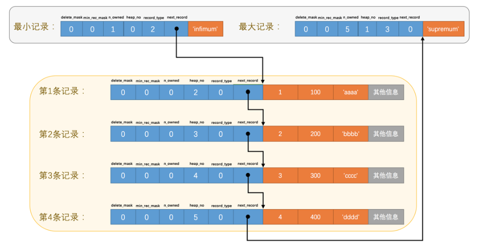
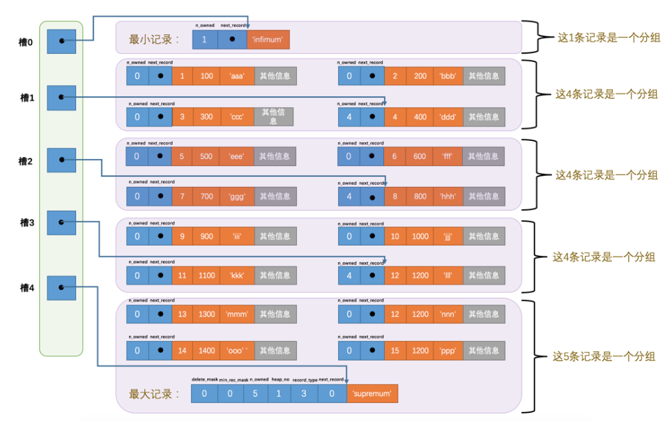

## 1. InnoDB行

### 1.1. InnoDB行格式

我们插数据是一条一条的插入数据的，它在磁盘中存放的方式叫做行格式，一共有四种行格式（它们的基本原理相同的）：

* Compact  

   

  * 额外信息：

    第一列，存储了可变字段的数据长度（逆序排序）。

    第二列，记录了字段是否为空（逆序排序）。

      

    第三列，固定的5个字节，描述记录的元信息，该记录是否删除、位置信息、是否为叶子节点、下一节点记录的相对位置

    **注意：删除并没有将数据真正的删除，只是做了标记，被删除的记录会形成一个垃圾链表，这个链表所占的空间被称为可重用				  空间，后面有记录进来按照一定的规则会使用这个可重用空间，不过加入到可重用空间和删除是两个阶段。**

  			 * 真实信息

​				记录真实数据的时候，mysql会默认添加一些隐藏列：行id（如果表没有主键会添加该列）、事务id、回滚指针，这里如果字符				集utf-8这种变长字符集时，该字段也会被记录到变长字段中。

*  Redundant

    是一个比较老的格式，mysql5.0以前  

     

  ​	字段长度偏移列表：记录了每一个字段的偏移量，可以通过差值来计算每一个字段所占空间，这个也是逆序排序的

  ​	记录头信息：和compact大体类似，多了少量的属性

  ​	该行格式没有空值列表，如果是可变字段为空值，则长度偏移计算长度时为0，如果是固定长度的，则长度为预留的长度，而实际	存储的数据为oxoooooo这种符号表示。

  ​    **注意，redundant格式如果是变长字符集，则使用最大的长度，这样不会产生碎片，而compact存储最小的长度，如果有大于		这个最小的长度时，则需要重新开辟空间，原来的空间就会产生碎片**。

* Dynamic

​		格式和compact类似，在处理行溢出时有所不同。

* Compressed`

​		会采用压缩算法对页面压缩来节省空间

### 1.1. VARCHAR(M)最多能存储的数据

### 1.2. InnoDB行溢出

​		当一条数据不能完整在一个页中存储，需要放在其它页上时，这个就叫做行溢出。

## 2. InnoDB页

​	Innodb是mysql具有事务特性的存储引擎，它存储和读取磁盘的数据的最小单位为页，一个页16kb，一般情况至少从磁盘读取16kb的内容到内存中，避免了一条一条读取数据。页根据存储的类型可以分为很多种，有存放表元数据的页，有undo日志的页，还有存储数据的索引页，这里我们先介绍下索引页

### 2.1. 索引页整体结构

 

### 2.2. 行记录链表  

 

​	**这里指针指向的是真实数据和行信息之间，因为向右读直接是真实数据，向左读是null数据和可变长度，逆序排序这样读正好是正序的，这个设计很巧妙**

### 2.3. 页内查找记录

​	将页内的记录分组，每一组最后的记录该组的记录树，并将该记录的偏移量拷贝出来放到页尾page dictory之中。

​	而如何去分组，有一套规定：

​	对于最小记录所在的分组只能有 1条记录，最大记录所在的分组拥有的记录条数只能在1-8条之间，剩下的分组中记录的条数范围只能在是4-8条之间

 

这样查找的时候可以根据2分法先找到对应的槽，然后在槽对应的分组中查找对应的记录。 

### 2.4. 页的header

​	存储了描述页的元数据信息，比如存了多少条记录、还有多少空间没使用、删除了多少条、目录有多少个槽等等。

​	这个是专门针对数据页的描述信息

### 2.5. file header

​	这个是描述的通用的元信息，包括其它类型的页，比如上一页是啥，下一页是啥等等，还有一个校验和，校验这个页是不是完整的。

​	还有页的类型，表示这个页是什么页，索引页、undo日志页、新分配页、系统页等等，数据是分散在不同的页中的，所以需要上一页和下一页把它们串联起来

 

### 2.6. File Trailer

​	修改数据的时候是先修改内存的，后面会异步更新到磁盘中。写入磁盘时可能会断电出错，首部的校验和会被先写，然后再写尾部的校验和，当写的过程中断点，尾部没写完，那么校验和就不想等。这个尾部还会标记修改日志lsn

## 3. 总结