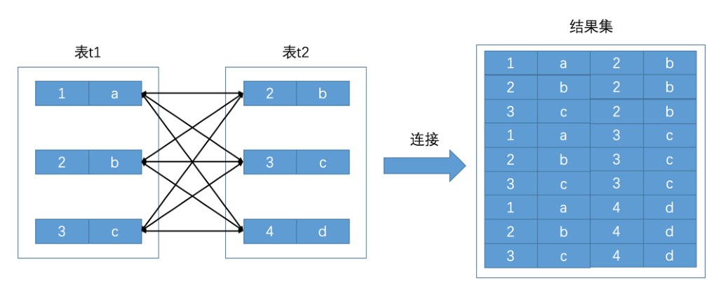

## 背景

MySQL Server 有一个称为 查询优化器 的模块，一条查询语句进行语法解析之后就会被交给查询优化器来进行优化，优化的结果就是生成一个 执行计划 ，这个执行计划表明了应该使用哪些索引进行查询，表之间的连接顺序是啥样的，最后会按照执行计划中的步骤调用存储引擎提供的方法来真正的执行查询，并将查询结果返回给用户。

 

## 单表访问

### 访问方法

* 使用全表扫描进行查询

  这种执行方式很好理解，就是把表的每一行记录都扫一遍嘛，把符合搜索条件的记录加入到结果集就完了。不管是啥查询都可以使用这种方式执行，当然，这种也是最笨的执行方式。

* 使用索引进行查询
  因为直接使用全表扫描的方式执行查询要遍历好多记录，所以代价可能太大了。如果查询语句中的搜索条件可以使用到某个索引，那直接使用索引来执行查询可能会加快查询执行的时间。使用索引来执行查询的方式五花八门，又可以细分为许多种类：

  * 针对主键或唯一二级索引的等值查询
  * 针对普通二级索引的等值查询
  * 针对索引列的范围查询
  * 直接扫描整个索引

 MySQL 执行查询语句的方式称之为 访问方法 或者 访问类型.

同一个查询语句可能可以使用多种不同的访问方法来执行，虽然最后的查询结果都是一样的

#### const

* 聚簇索引查询

  ```
  SELECT * FROM single_table WHERE id = 1438;
  ```

  这个语句MySQL 会直接利用主键值在聚簇索引中定位对应的用户记录。

  B+ 树叶子节点中的记录是按照索引列排序的，对于的聚簇索引来说，它对应的 B+ 树叶子节点中的记录就是按照 id 列排序的。 B+ 树本来就很矮，所以这样根据主键值定位一条记录的速度非常快。

* 唯一二级索引

  ```
  SELECT * FROM single_table WHERE key2 = 3841;
  ```

  可以看到这个查询的执行分两步，第一步先从 idx_key2 对应的 B+ 树索引中根据 key2 列与常数的等值比较条件定位到一条二级索引记录，然后再根据该记录的 id 值到聚簇索引中获取到完整的用户记录。

Mysql设计者认为通过主键或者唯一二级索引列与常数的等值比较来定位一条记录是像坐火箭一样快的，所以他们把这种通过主键或者唯一二级索引列来定位一条记录的访问方法定义为： const ，意思是常数级别的，代价是可以忽略不计的。不过这种 const 访问方法只能在主键列或者唯一二级索引列和一个常数进行等值比较时才有效，如果主键或者唯一二级索引是由多个列构成的话，索引中的每一个列都需要与常数进行等值比较，这个const 访问方法才有效（这是因为只有该索引中全部列都采用等值比较才可以定位唯一的一条记录）

**注意：对于唯一二级索引来说，查询该列为 NULL 值的情况比较特殊，比如这样：**

```
SELECT * FROM single_table WHERE key2 IS NULL
```

因为唯一二级索引列并不限制 NULL 值的数量，所以上述语句可能访问到多条记录，也就是说 上边这个语句不可以使用 const 访问方法来执行（至于是什么访问方法我们下边马上说）

#### ref

普通的二级索引列与常数进行等值比较

```
SELECT * FROM single_table WHERE key1 = 'abc';
```

​	对于这个查询，我们当然可以选择全表扫描来逐一对比搜索条件是否满足要求，我们也可以先使用二级索引找到对应记录的 id 值，然后再回表到聚簇索引中查找完整的用户记录。由于普通二级索引并不限制索引列值的唯一性，所以可能找到多条对应的记录，也就是说使用二级索引来执行查询的代价取决于等值匹配到的二级索引记录条数。如果匹配的记录较少，则回表的代价还是比较低的，所以 MySQL 可能选择使用索引而不是全表扫描的方式来执行查询。这种搜索条件为二级索引列与常数等值比较，采用二级索引来执行查询的访问方法称为： ref 。我们看一下采用 ref 访问方法执行查询的图示：

​	对于普通的二级索引来说，通过索引列进行等值比较后可能匹配到多条连续的记录，而不是像主键或者唯一二级索引那样最多只能匹配1条记录，所以这种 ref 访问方法比 const 差了那么一丢丢，但是在二级索引等值比较时匹配的记录数较少时的效率还是很高的。

​	这里仍需要注意两种情况：

* 二级索引列值为 NULL 的情况

  不论是普通的二级索引，还是唯一二级索引，它们的索引列对包含 NULL 值的数量并不限制，所以我们采用key IS NULL 这种形式的搜索条件最多只能使用 ref 的访问方法，而不是 const 的访问方法

* 对于某个包含多个索引列的二级索引来说，只要是最左边的连续索引列是与常数的等值比较就可能采用 ref
  的访问方法，比方说下边这几个查询

  ```
  SELECT * FROM single_table WHERE key_part1 = 'god like';
  SELECT * FROM single_table WHERE key_part1 = 'god like' AND key_part2 = 'legendary';
  SELECT * FROM single_table WHERE key_part1 = 'god like' AND key_part2 = 'legendary' AND key_part3 = 'penta kill';
  ```

  但是如果最左边的连续索引列并不全部是等值比较的话，它的访问方法就不能称为 ref 了，比方说这样：

  ```
  SELECT * FROM single_table WHERE key_part1 = 'god like' AND key_part2 > 'legendary';
  ```

#### ref_or_null

有时候我们不仅想找出某个二级索引列的值等于某个常数的记录，还想把该列的值为 NULL 的记录也找出来，就像下边这个查询：

```
SELECT * FROM single_demo WHERE key1 = 'abc' OR key1 IS NULL;
```

当使用二级索引而不是全表扫描的方式执行该查询时，这种类型的查询使用的访问方法就称为ref_or_null ，这个 ref_or_null 访问方法的执行过程如下：

先分别从 idx_key1 索引对应的 B+ 树中找出 key1 IS NULL 和 key1 = 'abc' 的两个连续的记录范围，然后根据这些二级索引记录中的 id 值再回表查找完整的用户记录。

#### range

之前介绍的几种访问方法都是在对索引列与某一个常数进行等值比较的时候才可能使用到（ ref_or_null 比较奇特，还计算了值为 NULL 的情况），但是有时候我们面对的搜索条件更复杂，比如下边这个查询：

```
SELECT * FROM single_table WHERE key2 IN (1438, 6328) OR (key2 >= 38 AND key2 <= 79);
```

我们当然还可以使用全表扫描的方式来执行这个查询，不过也可以使用 二级索引 + 回表 的方式执行，如果采用 二级索引 + 回表 的方式来执行的话，那么此时的搜索条件就不只是要求索引列与常数的等值匹配了，而是索引列需要匹配某个或某些范围的值，在本查询中 key2 列的值只要匹配下列3个范围中的任何一个就算是匹配成功：

* key2 的值是 1438
* key2 的值是 6328
* key2 的值在 38 和 79 之间。

利用索引进行范围匹配的访问方法称之为： range

**PS:此处所说的使用索引进行范围匹配中的 `索引` 可以是聚簇索引，也可以是二级索引。**

从数学的角度看，每一个所谓的范围都是数轴上的一个 区间 ，3个范围也就对应着3个区间：

* 范围1： key2 = 1438
* 范围2： key2 = 6328
* 范围3： key2 ∈ [38, 79] ，注意这里是闭区间

我们可以把那种索引列等值匹配的情况称之为 单点区间 ，上边所说的 范围1 和 范围2 都可以被称为单点区间，像 范围3 这种的我们可以称为连续范围区间

#### index

```
SELECT key_part1, key_part2, key_part3 FROM single_table WHERE key_part2 = 'abc';
```

由于 key_part2 并不是联合索引 idx_key_part 最左索引列，所以我们无法使用 ref 或者 range 访问方法来执行这个语句。但是这个查询符合下边这两个条件：

也就是说我们可以直接通过遍历 idx_key_part 索引的叶子节点的记录来比较 key_part2 = 'abc' 这个条件是否成立，把匹配成功的二级索引记录的 key_part1 , key_part2 , key_part3 列的值直接加到结果集中就行了。由于二级索引记录比聚簇索记录小的多（聚簇索引记录要存储所有用户定义的列以及所谓的隐藏列，而二级索引记录只需要存放索引列和主键），而且这个过程也不用进行回表操作，所以直接遍历二级索引比直接遍历聚簇索引的成本要小很多；把这种采用遍历二级索引记录的执行方式称之为： index

#### all

最直接的查询执行方式就是我们已经提了无数遍的全表扫描，对于 InnoDB 表来说也就是直接扫描聚簇索引，这种使用全表扫描执行查询的方式称之为： all 


### 单二级索引

一般情况下只能利用单个二级索引执行查询，比方说下边的这个查询：

```
SELECT * FROM single_table WHERE key1 = 'abc' AND key2 > 1000;
```

查询优化器会识别到这个查询中的两个搜索条件：

* key1 = 'abc'
* key2 > 1000

优化器一般会根据 single_table 表的统计数据来判断到底使用哪个条件到对应的二级索引中查询扫描的行数会更少，选择那个扫描行数较少的条件到对应的二级索引中查询。然后将从该二级索引中查询到的结果经过回表得到完整的用户记录后再根据其余的 WHERE 条件过滤记录。一般来说，等值查找比范围查找需要扫描的行数更少（也就是 ref 的访问方法一般比 range 好，但这也不总是一定的，也可能采用 ref 访问方法的那个索引列的值为特定值的行数特别多），所以这里假设优化器决定使用idx_key1 索引进行查询，那么整个查询过程可以分为两个步骤：

* 步骤1：使用二级索引定位记录的阶段，也就是根据条件 key1 = 'abc' 从 idx_key1 索引代表的 B+ 树中找到对应的二级索引记录。
* 步骤2：回表阶段，也就是根据上一步骤中找到的记录的主键值进行 回表 操作，也就是到聚簇索引中找到对应的完整的用户记录，再根据条件 key2 > 1000 到完整的用户记录继续过滤。将最终符合过滤条件的记录返回给用户。

这里需要特别提醒大家的一点是，因为二级索引的节点中的记录只包含索引列和主键，所以在步骤1中使用idx_key1 索引进行查询时只会用到与 key1 列有关的搜索条件，其余条件，比如 key2 > 1000 这个条件在步骤1中是用不到的，只有在步骤2完成回表操作后才能继续针对完整的用户记录中继续过滤

因此，我们说一般情况下执行一个查询只会用到单个二级索引，不过还是有特殊情况的

### range范围

其实对于 B+ 树索引来说，只要索引列和常数使用 = 、 <=> 、 IN 、 NOT IN 、 IS NULL 、 IS NOT NULL 、 < 、 >= 、 <= 、 BETWEEN 、 != （不等于也可以写成 <> ）或者 LIKE 操作符连接起来，就可以产生一个 区间。

PS：LIKE操作符比较特殊，只有在匹配完整字符串或者匹配字符串前缀时才可以利用索引。

IN操作符的效果和若干个等值匹配操作符`=`之间用`OR`连接起来是一样的，也就是说会产生多个单点区间，比如下边这两个语句的效果是一样的；

```
SELECT * FROM single_table WHERE key2 IN (1438, 6328);
SELECT * FROM single_table WHERE key2 = 1438 OR key2 = 6328;
```

不过在日常的工作中，一个查询的 WHERE 子句可能有很多个小的搜索条件，这些搜索条件需要使用 AND 或者 OR操作符连接起来，虽然大家都知道这两个操作符的作用，但我还是要再说一遍：

* cond1 AND cond2 ：只有当 cond1 和 cond2 都为 TRUE 时整个表达式才为 TRUE 。
* cond1 OR cond2 ：只要 cond1 或者 cond2 中有一个为 TRUE 整个表达式就为 TRUE 

当我们想使用 range 访问方法来执行一个查询语句时，重点就是找出该查询可用的索引以及这些索引对应的范围区间。下边分两种情况看一下怎么从由 AND 或 OR 组成的复杂搜索条件中提取出正确的范围区间

#### 条件中索引都存在

```
SELECT * FROM single_table WHERE key2 > 100 AND key2 > 200;
```

key2 > 100 和 key2 > 200 交集当然就是 key2 > 200 了，也就是说上边这个查询使用 idx_key2 的范围区间就是 (200, +∞) 

```
SELECT * FROM single_table WHERE key2 > 100 OR key2 > 200;
```

OR 意味着需要取各个范围区间的并集，所以上边这个查询在我们使用 range 访问方法执行查询时，使用的idx_key2 索引的范围区间。上边这个查询使用 idx_key2 的范围区间就是 (100， +∞)

#### 条件中有索引不在

```
SELECT * FROM single_table WHERE key2 > 100 AND common_field = 'abc';
```

这个查询语句中能利用的索引只有 idx_key2 一个，而 idx_key2 这个二级索引的记录中又不包含common_field 这个字段，所以在使用二级索引 idx_key2 定位记录的阶段用不到 common_field = 'abc' 这个条件，这个条件是在回表获取了完整的用户记录后才使用的，而 范围区间 是为了到索引中取记录中提出的概念。所以在确定 范围区间 的时候不需要考虑 common_field = 'abc' 这个条件，我们在为某个索引确定范围区间的时候只需要把用不到相关索引的搜索条件替换为 TRUE 就好了。

**PS：之所以把用不到索引的搜索条件替换为TRUE，是因为我们不打算使用这些条件进行在该索引上进行过滤，所以不管索引的记录满不满足这些条件，我们都把它们选取出来，待到之后回表的时候再使用它们过滤**

因此上面的sql就

```
SELECT * FROM single_table WHERE key2 > 100 AND TRUE;
```

化简之后就是这样：

```
SELECT * FROM single_table WHERE key2 > 100
```

也就是说最上边那个查询使用 idx_key2 的范围区间就是： (100, +∞) 

再来看一下使用 OR 的情况：

```
SELECT * FROM single_table WHERE key2 > 100 OR common_field = 'abc';
```

同理，我们把使用不到 idx_key2 索引的搜索条件替换为 TRUE ：

```
SELECT * FROM single_table WHERE key2 > 100 OR TRUE;
```

接着化简：

```
SELECT * FROM single_table WHERE TRUE
```

**这也就说说明如果我们强制使用 idx_key2 执行查询的话，对应的范围区间就是 (-∞, +∞) ，也就是需要将全部二级索引的记录进行回表，这个代价肯定比直接全表扫描都大了。也就是说一个使用到索引的搜索条件和没有使用该索引的搜索条件使用 OR 连接起来后是无法使用该索引的**

#### 复杂条件范围匹配

有的查询的搜索条件可能特别复杂，光是找出范围匹配的各个区间就挺烦的，比方说下边这个：

```
SELECT * FROM single_table WHERE
(key1 > 'xyz' AND key2 = 748 ) OR
(key1 < 'abc' AND key1 > 'lmn') OR
(key1 LIKE '%suf' AND key1 > 'zzz' AND (key2 < 8000 OR common_field = 'abc')) ;
```

### 索引合并

MySQL 在一般情况下执行一个查询时最多只会用到单个二级索引，这个也有特殊情况，在这些特殊情况下也可能在一个查询中使用到多个二级索引，这种使用到多个索引来完成一次查询的执行方法称之为： index merge

#### Intersection合并

Intersection 翻译过来的意思是 交集 。这里是说某个查询可以使用多个二级索引，将从多个二级索引中查询到的结果取交集，比方说下边这个查询：

```
SELECT * FROM single_table WHERE key1 = 'a' AND key3 = 'b';
```

这个查询使用 Intersection 合并的方式执行的话，那这个过程就是这样的：

* 从 idx_key1 二级索引对应的 B+ 树中取出 key1 = 'a' 的相关记录
* 从 idx_key3 二级索引对应的 B+ 树中取出 key3 = 'b' 的相关记录
* 二级索引的记录都是由 索引列 + 主键 构成的，所以我们可以计算出这两个结果集中 id 值的交集。
* 按照上一步生成的 id 值列表进行回表操作，也就是从聚簇索引中把指定 id 值的完整用户记录取出来，返回给用户\

MySQL 在某些特定的情况下才可能会使用到 Intersection 索引合并：

* 二级索引列是等值匹配的情况，对于联合索引来说，在联合索引中的每个列都必须等值匹配，不能出现只出现匹配部分列的情况。

  ```
  //使用索引合并
  SELECT * FROM single_table WHERE key1 = 'a' AND key_part1 = 'a' AND key_part2 = 'b'AND key_part3 = 'c';
  
  //不使用索引合并，因为对 key1 进行了范围匹配
  SELECT * FROM single_table WHERE key1 > 'a' AND key_part1 = 'a' AND key_part2 = 'b' AND key_part3 = 'c';
  //不使用索引合并，因为联合索引 idx_key_part 中的 key_part2 列并没有出现在搜索条件中，所以这两个查询不能进行 Intersection 索引合并
  SELECT * FROM single_table WHERE key1 = 'a' AND key_part1 = 'a';
  ```

* 主键列可以是范围匹配

  ```
  SELECT * FROM single_table WHERE id > 100 AND key1 = 'a';
  ```

  

**总结**：对于 InnoDB 的二级索引来说，记录先是按照索引列进行排序，如果该二级索引是一个联合索引，那么会按照联合索引中的各个列依次排序。而二级索引的用户记录是由 索引列 + 主键 构成的，二级索引列的值相同的记录可能会有好多条，这些索引列的值相同的记录又是按照主键 的值进行排序的。所以重点来了，之所以在二级索引列都是等值匹配的情况下才可能使用 Intersection 索引合并，是因为只有在这种情况下根据二级索引查询出的结果集是按照主键值排序的,如果从各个二级索引中查询的到的结果集本身就是已经按照主键排好序的，那么求交集的过程就很容易了。

假设某个查询使用Intersection 索引合并的方式从 idx_key1 和 idx_key2 这两个二级索引中获取到的主键值分别是：

```
从 idx_key1 中获取到已经排好序的主键值：1、3、5
从 idx_key2 中获取到已经排好序的主键值：2、3、4
```

逐个取出这两个结果集中最小的主键值，如果两个值相等，则加入最后的交集结果中，否则丢弃当前较小的主键值，再取该丢弃的主键值所在结果集的后一个主键值来比较，直到某个结果集中的主键值用完了，这个过程其实可快了，时间复杂度是 O(n)，但是如果从各个二级索引中查询出的结果集并不是按照主键排序的话，那就要先把结果集中的主键值排序完再来做上边的那个过程，就比较耗时了；

不仅是多个二级索引之间可以采用 Intersection 索引合并，索引合并也可以有聚簇索引参加，也就是我们上边写的 情况二 ：在搜索条件中有主键的范围匹配的情况下也可以使用 Intersection 索引合并索引合并

```
SELECT * FROM single_table WHERE key1 = 'a' AND id > 100;
```

假设这个查询可以采用 Intersection 索引合并，我们理所当然的以为这个查询会分别按照 id > 100 这个条件从聚簇索引中获取一些记录，在通过 key1 = 'a' 这个条件从 idx_key1 二级索引中获取一些记录，然后再求交集，其实这样就把问题复杂化了，没必要从聚簇索引中获取一次记录。别忘了二级索引的记录中都带有主键值的，所以可以在从 idx_key1 中获取到的主键值上直接运用条件 id > 100 过滤就行了，这样多简单。所以涉及主键的搜索条件只不过是为了从别的二级索引得到的结果集中过滤记录罢了，是不是等值匹配不重要.

当然，上边说的 情况一 和 情况二 只是发生 Intersection 索引合并的必要条件，不是充分条件。也就是说即使情况一、情况二成立，也不一定发生 Intersection 索引合并，这得看优化器。优化器只有在单独根据搜索条件从某个二级索引中获取的记录数太多，导致回表开销太大，而通过 Intersection 索引合并后需要回表的记录数大大减少时才会使用 Intersection 索引合并

#### Union合并

在写查询语句时经常想把既符合某个搜索条件的记录取出来，也把符合另外的某个搜索条件的记录取出来，我们说这些不同的搜索条件之间是 OR 关系。有时候 OR 关系的不同搜索条件会使用到不同的索引，比方说这样：

```
SELECT * FROM single_table WHERE key1 = 'a' OR key3 = 'b'
```

Intersection 是交集的意思，这适用于使用不同索引的搜索条件之间使用 AND 连接起来的情况； Union 是并集的意思，适用于使用不同索引的搜索条件之间使用 OR 连接起来的情况。与 Intersection 索引合并类似，MySQL 在某些特定的情况下才可能会使用到 Union 索引合并：

* 二级索引列是等值匹配的情况，对于联合索引来说，在联合索引中的每个列都必须等值匹配，不能出现只出现匹配部分列的情况

  比方说下边这个查询可能用到 idx_key1 和 idx_key_part 这两个二级索引进行 Union 索引合并的操作：

  ```
  SELECT * FROM single_table WHERE key1 = 'a' OR ( key_part1 = 'a' AND key_part2 = 'b' AND key_part3 = 'c');
  ```

  下边这两个查询就不能进行 Union 索引合并：

  ```
  SELECT * FROM single_table WHERE key1 > 'a' OR (key_part1 = 'a' AND key_part2 = 'b' AND key_part3 = 'c');
  SELECT * FROM single_table WHERE key1 = 'a' OR key_part1 = 'a';
  
  第一个查询是因为对 key1 进行了范围匹配，第二个查询是因为联合索引 idx_key_part 中的 key_part2 列
  并没有出现在搜索条件中，所以这两个查询不能进行 Union 索引合并。
  ```

* 主键列可以是范围匹配

* 使用 Intersection 索引合并的搜索条件

  这种情况其实也挺好理解，就是搜索条件的某些部分使用 Intersection 索引合并的方式得到的主键集合和其他方式得到的主键集合取交集，比方说这个查询：

  ```
  SELECT * FROM single_table WHERE key_part1 = 'a' AND key_part2 = 'b' AND key_part3 = 'c' OR (key1 = 'a' AND key3 = 'b');
  ```

  优化器可能采用这样的方式来执行这个查询：

  * 先按照搜索条件 key1 = 'a' AND key3 = 'b' 从索引 idx_key1 和 idx_key3 中使用 Intersection 索引合并的方式得到一个主键集合。
  * 再按照搜索条件 key_part1 = 'a' AND key_part2 = 'b' AND key_part3 = 'c' 从联合索引idx_key_part 中得到另一个主键集合。
  * 采用 Union 索引合并的方式把上述两个主键集合取并集，然后进行回表操作，将结果返回给用户。当然，查询条件符合了这些情况也不一定就会采用 Union 索引合并，也得看优化器的心情。优化器只有在单独根据搜索条件从某个二级索引中获取的记录数比较少，通过 Union 索引合并后进行访问的代价比全表扫描更小时才会使用 Union 索引合并

#### Sort-Union合并

Union 索引合并的使用条件太苛刻，必须保证各个二级索引列在进行等值匹配的条件下才可能被用到，比方说下边这个查询就无法使用到 Union 索引合并：

```
SELECT * FROM single_table WHERE key1 < 'a' OR key3 > 'z'
```

这是因为根据 key1 < 'a' 从 idx_key1 索引中获取的二级索引记录的主键值不是排好序的，根据 key3 > 'z' 从 idx_key3 索引中获取的二级索引记录的主键值也不是排好序的，但是 key1 < 'a' 和 key3 > 'z' 这两个条件又特别让我们动心，所以我们可以这样：

* 先根据 key1 < 'a' 条件从 idx_key1 二级索引总获取记录，并按照记录的主键值进行排序
* 再根据 key3 > 'z' 条件从 idx_key3 二级索引总获取记录，并按照记录的主键值进行排序

因为上述的两个二级索引主键值都是排好序的，剩下的操作和 Union 索引合并方式就一样了。我们把上述这种先按照二级索引记录的主键值进行排序，之后按照 Union 索引合并方式执行的方式称之为 Sort-Union 索引合并，很显然，这种 Sort-Union 索引合并比单纯的 Union 索引合并多了一步对二级索引记录的主键
值排序的过程

PS：为啥有Sort-Union索引合并，就没有Sort-Intersection索引合并么？是的，的确没有Sort-Intersection索引合并这么一说，Sort-Union的适用场景是单独根据搜索条件从某个二级索引中获取的记录数比较少，这样即使对这些二级索引记录按照主键值进行排序的成本也不会太高而Intersection索引合并的适用场景是单独根据搜索条件从某个二级索引中获取的记录数太多，导致回表开销太大，合并后可以明显降低回表开销，但是如果加入Sort-Intersection后，就需要为大量的二级索引记录按照主键值进行排序，这个成本可能比回表查询都高了，所以也就没有引入Sort-Intersection

#### 注意事项

```
SELECT * FROM single_table WHERE key1 = 'a' AND key3 = 'b';
```

这个查询之所以可能使用 Intersection 索引合并的方式执行，还不是因为 idx_key1 和 idx_key3 是两个单独
的 B+ 树索引，你要是把这两个列搞一个联合索引，那直接使用这个联合索引就把事情搞定了，何必用啥索引合
并呢，就像这样：

```
ALTER TABLE single_table drop index idx_key1, idx_key3, add index idx_key1_key3(key1, key
3);
```

这样我们把没用的 idx_key1 、 idx_key3 都干掉，再添加一个联合索引 idx_key1_key3 ，使用这个联合索引进行查询简直是又快又好

**PS：不过小心有单独对key3列进行查询的业务场景，这样子不得不再把key3列的单独索引给加上**

## 表关联

### 什么是连接

#### 连接本质

连接 的本质就是把各个连接表中的记录都取出来依次匹配的组合加入结果集并返回给用户。

 

MySQL 中，连接查询的语法也很随意，只要在 FROM 语句后边跟多个表名就好了，比如我们把 t1 表和 t2 表连接起来的查询语句可以写成这样：

```sql
SELECT * FROM t1, t2;
```

#### 连接过程

我们可以连接任意数量张表，但是如果没有任何限制条件的话，这些表连接起来产生的 笛卡尔积 可能是非常巨大的。比方说3个100行记录的表连接起来产生的 笛卡尔积 就有 100×100×100=1000000 行数据！所以在连接的时候过滤掉特定记录组合是有必要的，在连接查询中的过滤条件可以分成两种：

* 涉及单表的条件

  这种只设计单表的过滤条件我们之前都提到过一万遍了，我们之前也一直称为 搜索条件 ，比如 t1.m1 > 1是只针对 t1 表的过滤条件， t2.n2 < 'd' 是只针对 t2 表的过滤条件。

* 涉及两表的条件
  这种过滤条件我们之前没见过，比如 t1.m1 = t2.m2 、 t1.n1 > t2.n2 等，这些条件中涉及到了两个表，我们稍后会仔细分析这种过滤条件是如何使用的

```
SELECT * FROM t1, t2 WHERE t1.m1 > 1 AND t1.m1 = t2.m2 AND t2.n2 < 'd';
```

* t1.m1 > 1
* t1.m1 = t2.m2
* t2.n2 < 'd'

#### 内连接和外连接

* 内连接
* 左外连接
* 右外连接

#### 小结

​	内连接和外连接的根本区别就是在驱动表中的记录不符合 ON 子句中的连接条件时不会把该记录加入到最后的结果集，由于在内连接中ON子句和WHERE子句是等价的，所以内连接中不要求强制写明ON子句；左外连接和右外连接的驱动表和被驱动表不能轻易互换；

​	连接的本质就是把各个连接表中的记录都取出来依次匹配的组合加入结果集并返回给用户。不论哪个表作为驱动表，两表连接产生的笛卡尔积肯定是一样的。而对于内连接来说，由于凡是不符合 ON 子句或WHERE 子句中的条件的记录都会被过滤掉，其实也就相当于从两表连接的笛卡尔积中把不符合过滤条件的记录给踢出去，所以对于内连接来说，驱动表和被驱动表是可以互换的，并不会影响最后的查询结果。但是对于外连接来说，由于驱动表中的记录即使在被驱动表中找不到符合 ON 子句连接条件的记录，所以此时驱动表和被驱动表的关系就很重要了，也就是说左外连接和右外连接的驱动表和被驱动表不能轻易互换

### 连接的原理

#### 连接的步骤

​	对于两表连接来说，驱动表只会被访问一遍，但被驱动表却要被访问到好多遍，具体访问几遍取决于对驱动表执行单表查询后的结果集中的记录条数。对于内连接来说，选取哪个表为驱动表都没关系，而外连接的驱动表是固定的，也就是说左（外）连接的驱动表就是左边的那个表，右（外）连接的驱动表就是右边的那
个表。我们上边已经大致介绍过 t1 表和 t2 表执行内连接查询的大致过程：

* 步骤1：选取驱动表，使用与驱动表相关的过滤条件，选取代价最低的单表访问方法来执行对驱动表的单表查询。
* 步骤2：对上一步骤中查询驱动表得到的结果集中每一条记录，都分别到被驱动表中查找匹配的记录。

#### 使用索引连接

如果访问被驱动表的方式都是全表扫描的，查询 t2 表其实就相当于一次单表扫描，我们可以利用索引来加快查询速度。

```
SELECT * FROM t1, t2 WHERE t1.m1 > 1 AND t1.m1 = t2.m2 AND t2.n2 < 'd';
```

查询驱动表 t1 后的结果集中有两条记录， 嵌套循环连接 算法需要对被驱动表查询2次：

* 当 t1.m1 = 2 时，去查询一遍 t2 表，对 t2 表的查询语句相当于：

  ```
  SELECT * FROM t2 WHERE t2.m2 = 2 AND t2.n2 < 'd';
  ```

* 当 t1.m1 = 3 时，再去查询一遍 t2 表，此时对 t2 表的查询语句相当于：

  ```
  SELECT * FROM t2 WHERE t2.m2 = 3 AND t2.n2 < 'd';
  ```

可以看到，原来的 t1.m1 = t2.m2 这个涉及两个表的过滤条件在针对 t2 表做查询时关于 t1 表的条件就已经确定了，所以我们只需要单单优化对 t2 表的查询了，上述两个对 t2 表的查询语句中利用到的列是 m2 和 n2 列，我们可以：

* 在 m2 列上建立索引，因为对 m2 列的条件是等值查找，比如 t2.m2 = 2 、 t2.m2 = 3 等，所以可能使用到ref 的访问方法，假设使用 ref 的访问方法去执行对 t2 表的查询的话，需要回表之后再判断 t2.n2 < d 这个条件是否成立。
  这里有一个比较特殊的情况，就是假设 m2 列是 t2 表的主键或者唯一二级索引列，那么使用 t2.m2 = 常数值 这样的条件从 t2 表中查找记录的过程的代价就是常数级别的。我们知道在单表中使用主键值或者唯一二级索引列的值进行等值查找的方式称之为 const ，连接查询中对被驱动表使用主键值或者唯一二级索引列的值进行等值查找的查询执行方式称之为： eq_ref 。
* 在 n2 列上建立索引，涉及到的条件是 t2.n2 < 'd' ，可能用到 range 的访问方法，假设使用 range 的访问方法对 t2 表的查询的话，需要回表之后再判断在 m2 列上的条件是否成立。

​	假设 m2 和 n2 列上都存在索引的话，那么就需要从这两个里边儿挑一个代价更低的去执行对 t2 表的查询。当然，建立了索引不一定使用索引，只有在 二级索引 + 回表 的代价比全表扫描的代价更低时才会使用索引。

​	另外，有时候连接查询的查询列表和过滤条件中可能只涉及被驱动表的部分列，而这些列都是某个索引的一部分，这种情况下即使不能使用 eq_ref 、 ref 、 ref_or_null 或者 range 这些访问方法执行对被驱动表的查询的话，也可以使用索引扫描，也就是 index 的访问方法来查询被驱动表。所以我们建议在真实工作中最好不要使用 * 作为查询列表，最好把真实用到的列作为查询列表

#### 基于块的嵌套循环连接

​	扫描一个表的过程其实是先把这个表从磁盘上加载到内存中，然后从内存中比较匹配条件是否满足。现实生活中的表可不像 t1 、 t2 这种只有3条记录，成千上万条记录都是少的，几百万、几千万甚至几亿条记录的表到处都是。内存里可能并不能完全存放的下表中所有的记录，所以在扫描表前边记录的时候后边的记录可能还在磁盘上，等扫描到后边记录的时候可能内存不足，所以需要把前边的记录从内存中释放掉。我们前边又说过，采用 嵌套循环连接 算法的两表连接过程中，被驱动表可是要被访问好多次的，如果这个被驱动表中的数据特别多而且不能使用索引进行访问，那就相当于要从磁盘上读好几次这个表，这个 I/O 代价就非常大了，所以我们得想办法：**尽量减少访问被驱动表的次数**。

​	当被驱动表中的数据非常多时，每次访问被驱动表，被驱动表的记录会被加载到内存中，在内存中的每一条记录只会和驱动表结果集的一条记录做匹配，之后就会被从内存中清除掉。然后再从驱动表结果集中拿出另一条记录，再一次把被驱动表的记录加载到内存中一遍，周而复始，驱动表结果集中有多少条记录，就得把被驱动表从磁盘上加载到内存中多少次。所以我们可不可以在把被驱动表的记录加载到内存的时候，一次性和多条驱动表中的记录做匹配，这样就可以大大减少重复从磁盘上加载被驱动表的代价了。所以提出了一个join buffer 的概念， join buffer 就是执行连接查询前申请的一块固定大小的内存，先把若干条驱动表结果集
中的记录装在这个 join buffer 中，然后开始扫描被驱动表，每一条被驱动表的记录一次性和 join buffer 中的多条驱动表记录做匹配，因为匹配的过程都是在内存中完成的，所以这样可以显著减少被驱动表的 I/O 代价

​	最好的情况是 join buffer 足够大，能容纳驱动表结果集中的所有记录，这样只需要访问一次被驱动表就可以完成连接操作了。设计 MySQL 的大叔把这种加入了 join buffer 的嵌套循环连接算法称之为 基于块的嵌套连接（Block Nested-Loop Join）算法。这个 join buffer 的大小是可以通过启动参数或者系统变量 join_buffer_size 进行配置，默认大小为 262144字节 （也就是 256KB ），最小可以设置为 128字节 。当然，对于优化被驱动表的查询来说，最好是为被驱动表加
上效率高的索引，如果实在不能使用索引，并且自己的机器的内存也比较大可以尝试调大 join_buffer_size 的值来对连接查询进行优化。另外需要注意的是，驱动表的记录并不是所有列都会被放到 join buffer 中，只有查询列表中的列和过滤条件中的列才会被放到 join buffer 中，所以再次提醒我们，最好不要把 * 作为查询列表，只需要把我们关心的列放到查询列表就好了，这样还可以在 join buffer 中放置更多的记录呢

## 成本优化

我们之前老说 MySQL 执行一个查询可以有不同的执行方案，它会选择其中成本最低，或者说代价最低的那种方案去真正的执行查询。不过我们之前对 成本 的描述是非常模糊的，其实在 MySQL 中一条查询语句的执行成本是由下边这两个方面组成的：

* I/O 成本

  我们的表经常使用的 MyISAM 、 InnoDB 存储引擎都是将数据和索引都存储到磁盘上的，当我们想查询表中的
  记录时，需要先把数据或者索引加载到内存中然后再操作。这个从磁盘到内存这个加载的过程损耗的时间称
  之为 I/O 成本。

* CPU 成本

  读取以及检测记录是否满足对应的搜索条件、对结果集进行排序等这些操作损耗的时间称之为 CPU 成本

对于 InnoDB 存储引擎来说，页是磁盘和内存之间交互的基本单位，设计 MySQL 的大叔规定读取一个页面花费的成本默认是 1.0 ，读取以及检测一条记录是否符合搜索条件的成本默认是 0.2 。 1.0 、 0.2 这些数字称之为 成本常数 ，这两个成本常数我们最常用到，其余的成本常数后序再聊

**PS：需要注意的是，不管读取记录时需不需要检测是否满足搜索条件，其成本都算是0.2**

### 单表成本

#### 成本优化步骤

​	在一条单表查询语句真正执行之前， MySQL 的查询优化器会找出执行该语句所有可能使用的方案，对比之后找出成本最低的方案，这个成本最低的方案就是所谓的 执行计划 ，之后才会调用存储引擎提供的接口真正的执行查询

* 根据搜索条件，找出所有可能使用的索引
* 计算全表扫描的代价
* 计算使用不同索引执行查询的代价
* 对比各种执行方案的代价，找出成本最低的那一个

案例分析：

```
SELECT * FROM single_table WHERE
key1 IN ('a', 'b', 'c') AND
key2 > 10 AND key2 < 1000 AND
key3 > key2 AND
key_part1 LIKE '%hello%' AND
common_field = '123';
```

* 找出所有索引

  只要索引列和常数使用 = 、 <=> 、 IN 、 NOT IN 、 IS NULL 、 IS NOT NULL 、 > 、 < 、 >= 、 <= 、 BETWEEN 、 != （不等于也可以写成 <> ）或者 LIKE 操作符连接起来，就可以产生一个所谓的 范围区间 （ LIKE 匹配字符串前缀也行），也就是说这些搜索条件都可能使用到索引，这种把一个查询中可能使用到的索引称之为 possible keys。

  * key1 IN ('a', 'b', 'c') ，这个搜索条件可以使用二级索引 idx_key1 。
  * key2 > 10 AND key2 < 1000 ，这个搜索条件可以使用二级索引 idx_key2 。
  * key3 > key2 ，这个搜索条件的索引列由于没有和常数比较，所以并不能使用到索引。
  * key_part1 LIKE '%hello%' ， key_part1 通过 LIKE 操作符和以通配符开头的字符串做比较，不可以适用
    索引。
  * common_field = '123' ，由于该列上压根儿没有索引，所以不会用到索引

  综上所述，上边的查询语句可能用到的索引，也就是 possible keys 只有 idx_key1 和 idx_key2 

* 计算全表扫描的代价

  对于 InnoDB 存储引擎来说，全表扫描的意思就是把聚簇索引中的记录都依次和给定的搜索条件做一下比较，把符合搜索条件的记录加入到结果集，所以需要将聚簇索引对应的页面加载到内存中，然后再检测记录是否符合搜索条件。由于查询成本= I/O 成本+ CPU 成本，所以计算全表扫描的代价需要两个信息

  * 聚簇索引占用的页面数
  * 该表中的记录数

  每个表维护了一系列的 统计信息

  ```
   SHOW TABLE STATUS LIKE 'single_table'
  ```

  虽然出现了很多统计选项，但我们目前只关心两个：
  * Rows

    对于使用 MyISAM 存储引擎的表来说，该值是准确的，对于使用 InnoDB 存储引擎的表来说，该值是一个估计值

  * Data_length

    使用 MyISAM 存储引擎的表来说，该值就是数据文件的大小，对于使用 InnoDB 存储引擎的表来说，该值就相当于聚簇索引占用的存储空间大小

    Data_length = 聚簇索引的页面数量 x 每个页面的大小

    我们的 single_table 使用默认 16KB 的页面大小，而上边查询结果显示 Data_length 的值是 1589248 ，所以我们可以反向来推导出 聚簇索引的页面数量 ：**聚簇索引的页面数量 = 1589248 ÷ 16 ÷ 1024 = 97**

  全表扫描成本的计算过程：

  * I/O 成本

    97 x 1.0 + 1.1 = 98.1

    97 指的是聚簇索引占用的页面数， 1.0 指的是加载一个页面的成本常数，后边的 1.1 是一个微调值，不用在意

  * CPU 成本

    9693 x 0.2 + 1.0 = 1939.6

    9693 指的是统计数据中表的记录数，对于 InnoDB 存储引擎来说是一个估计值， 0.2 指的是访问一条记录所需的成本常数，后边的 1.0 是一个微调值，不用在意

  * 总成本

    98.1 + 1939.6 = 2037.7

  综上所述，对于 single_table 的全表扫描所需的总成本就是 2037.7

  **注意：设计MySQL的大叔们在计算全表扫描成本时直接使用聚簇索引占用的页面数作为计算I/O成本的依据，是不区分内节点和叶子节点的，有点儿简单暴力，其实有的B+树内节点是不需要访问的**

* 计算使用不同索引执行查询的代价

  上述查询可能使用到 idx_key1 和 idx_key2 这两个索引，我们需要分别分析单独使用这些索引执行查询的成本，最后还要分析是否可能使用到索引合并。这里需要提一点的是， MySQL 查询优化器先分析使用唯一二级索引的成本，再分析使用普通索引的成本，所以我们也先分析 idx_key2 的成本，然后再看使用idx_key1 的成本

  * 使用idx_key2执行查询的成本分析

    idx_key2 对应的搜索条件是： key2 > 10 AND key2 < 1000 ，也就是说对应的范围区间就是： (10, 1000) ，使用 idx_key2 搜索的示意图就是这样子

    对于使用 二级索引 + 回表 方式的查询，计算成本的方式：

    * 范围区间数量

      不论某个范围区间的二级索引到底占用了多少页面，查询优化器粗暴的认为读取索引的一个范围区间的 I/O成本和读取一个页面是相同的。本例中使用 idx_key2 的范围区间只有一个： (10, 1000) ，所以相当于访问这个范围区间的二级索引付出的 I/O 成本就是：
      1 x 1.0 = 1.0

    * 需要回表的记录数

      优化器需要计算二级索引的某个范围区间到底包含多少条记录，对于本例来说就是要计算 idx_key2 在 (10,1000) 这个范围区间中包含多少二级索引记录，计算过程是这样的

      * 先根据 key2 > 10 这个条件访问一下 idx_key2 对应的 B+ 树索引，找到满足 key2 > 10 这个条件的第一条记录，我们把这条记录称之为 区间最左记录

      * 然后再根据 key2 < 1000 这个条件继续从 idx_key2 对应的 B+ 树索引中找出第一条满足这个条件的记录，我们把这条记录称之为 区间最右记录

      * 如果 区间最左记录 和 区间最右记录 相隔不太远，那就可以精确统计出满足 key2 > 10 AND key2 < 1000 条件的二级索引记录条数。否则只沿着 区间最左记录 向右读10个页面，计算平均每个页面中包含多少记录，然后用这个平均值乘以 区间最左记录 和 区间最右记录 之间的页面数量就可以了，所以计算 页b 和 页c 之间有多少页面就相当于计算它们父节点（也就是页a）中对应的目录项记录之间隔着几条记录。在一个页面中统计两条记录之间有几条记录的成本就很小了

      * 根据上述算法测得idx_key2 在区间 (10, 1000) 之间大约有 95 条记录。读取这 95 条二级索引记录需要付出的 CPU 成本
        就是：

        ```
        95 x 0.2 + 0.01 = 19.01
        其中 95 是需要读取的二级索引记录条数， 0.2 是读取一条记录成本常数， 0.01 是微调。
        ```

    * 根据这些记录里的主键值到聚簇索引中做回表操作

      所以回表操作带来的 I/O 成本就是：

      ```
      95 x 1.0 = 95.0
      ```

    * 回表操作后得到的完整用户记录，然后再检测其他搜索条件是否成立

      回表操作的本质就是通过二级索引记录的主键值到聚簇索引中找到完整的用户记录，然后再检测除key2 > 10 AND key2 < 1000 这个搜索条件以外的搜索条件是否成立

      ```
      95 x 0.2 = 19.0
      其中`95`是待检测记录的条数，`0.2`是检测一条记录是否符合给定的搜索条件的成本常数。
      ```

    * 小结

      idx_key2 执行查询的成本就如下所示

      ```
      I/O 成本：
      1.0 + 95 x 1.0 = 96.0 (范围区间的数量 + 预估的二级索引记录条数)
      CPU 成本：
      95 x 0.2 + 0.01 + 95 x 0.2 = 38.01 （读取二级索引记录的成本 + 读取并检测回表后聚簇索引记录的成本）
      ```

      使用 idx_key2 执行查询的总成本就是：

      ```
      96.0 + 38.01 = 134.01
      ```

  * 使用idx_key1执行查询的成本分析

    idx_key1 对应的搜索条件是： key1 IN ('a', 'b', 'c') ，也就是说相当于3个单点区间：

    ```
    ['a', 'a']
    ['b', 'b']
    ['c', 'c']
    ```

    与使用 idx_key2 的情况类似，我们也需要计算使用 idx_key1 时需要访问的范围区间数量以及需要回表的记录数

    * 范围区间数量

      使用 idx_key1 执行查询时很显然有3个单点区间，所以访问这3个范围区间的二级索引付出的I/O成本就是：

      ```
      3 x 1.0 = 3.0
      ```

    * 需要回表的记录数

      由于使用 idx_key1 时有3个单点区间，所以每个单点区间都需要查找一遍对应的二级索引记录数：

      * 查找单点区间 ['a', 'a'] 对应的二级索引记录数

        计算单点区间对应的二级索引记录数和计算连续范围区间对应的二级索引记录数是一样的，都是先计算区间最左记录 和 区间最右记录 ，然后再计算它们之间的记录数，具体算法和前面一致，就不赘述了。最后计算得到单点区间 ['a', 'a'] 对应的二级索引记录数是： 35 。

      * 查找单点区间 ['b', 'b'] 对应的二级索引记录数

        与上同理，计算得到本单点区间对应的记录数是： 44 

      * 查找单点区间 ['c', 'c'] 对应的二级索引记录数

        与上同理，计算得到本单点区间对应的记录数是： 39 。

      * 所以，这三个单点区间总共需要回表的记录数就是：
        35 + 44 + 39 = 118

        读取这些二级索引记录的 CPU 成本就是：
        118 x 0.2 + 0.01 = 23.61

      * 根据这些记录里的主键值到聚簇索引中做回表操作

        所需的 I/O 成本就是：

        ```
        118 x 1.0 = 118.0
        ```

    * 回表操作后得到的完整用户记录，然后再比较其他搜索条件是否成立

      此步骤对应的 CPU 成本就是：

      ```
      118 x 0.2 = 23.6
      ```

    * 使用 idx_key1 执行查询的成本就如下所示：

      ```
      I/O 成本：
      3.0 + 118 x 1.0 = 121.0 (范围区间的数量 + 预估的二级索引记录条数)
      CPU 成本：
      118 x 0.2 + 0.01 + 118 x 0.2 = 47.21 （读取二级索引记录的成本 + 读取并检测回表后聚簇索引记录的成本）
      ```

    * 使用 idx_key1 执行查询的总成本就是：

      ```
      121.0 + 47.21 = 168.21
      ```

  * 否有可能使用索引合并（Index Merge）

    本例中有关 key1 和 key2 的搜索条件是使用 AND 连接起来的，而对于 idx_key1 和 idx_key2 都是范围查询，也就是说查找到的二级索引记录并不是按照主键值进行排序的，并不满足使用 Intersection 索引合并的条件，所以并不会使用索引合并，MySQL查询优化器计算索引合并成本的算法也比较麻烦。

  * 对比各种执行方案的代价，找出成本最低的那一个

    下边把执行本例中的查询的各种可执行方案以及它们对应的成本列出来：

    * 全表扫描的成本： 2037.7
    * 使用 idx_key2 的成本： 134.01
    * 使用 idx_key1 的成本： 168.21

  * 使用 idx_key2 的成本最低，所以当然选择 idx_key2 来执行查询

#### 基于索引统计数据

```
SELECT * FROM single_table WHERE key1 IN ('aa1', 'aa2', 'aa3', ... , 'zzz');
```

针对如上的查询

系统变量eq_range_index_dive_limit

 IN 语句中的参数个数小于eq_range_index_dive_limit，将使用 index dive 的方式计算各个单点区间对应的记录条数，如果大于或等于eq_range_index_dive_limit个的话，可就不能使用 index dive 了，要使用所谓的索引统计数据来进行估算

MySQL 也会为表中的每一个索引维护一份统计数据，查看某个表中索引的
统计数据可以使用 SHOW INDEX FROM 表名 的语法

```
SHOW INDEX FROM single_table;
```

我们现在最在意的是 Cardinality 属性， Cardinality 直译过来就是 基数 的意思，表示索引列中不重复值的个数。比如对于一个一万行记录的表来说，某个索引列的 Cardinality 属性是 10000 ，那意味着该列中没有重复的值，如果 Cardinality 属性是 1 的话，就意味着该列的值全部是重复的。不过需要注意的是，对于InnoDB存储引擎来说，使用SHOW INDEX语句展示出来的某个索引列的Cardinality属性是一个估计值，并不是精确的。关于这个 Cardinality 属性的值是如何被计
前边说道，当 IN 语句中的参数个数大于或等于系统变量 eq_range_index_dive_limit 的值的话，就不会使用index dive 的方式计算各个单点区间对应的索引记录条数，而是使用索引统计数据，这里所指的 索引统计数据
指的是这两个值：

* 使用 SHOW TABLE STATUS 展示出的 Rows 值，也就是一个表中有多少条记录。
  
* 使用 SHOW INDEX 语句展示出的 Cardinality 属性。

  结合上一个 Rows 统计数据，我们可以针对索引列，计算出平均一个值重复多少次。

  ```
  一个值的重复次数 ≈ Rows ÷ Cardinality
  ```

以 single_table 表的 idx_key1 索引为例，它的 Rows 值是 9693 ，它对应索引列 key1 的 Cardinality 值是968 ，所以我们可以计算 key1 列平均单个值的重复次数就是：

```
9693 ÷ 968 ≈ 10（条）
```

此时再看上边那条查询语句：

```
SELECT * FROM single_table WHERE key1 IN ('aa1', 'aa2', 'aa3', ... , 'zzz');
```

假设 IN 语句中有20000个参数的话，就直接使用统计数据来估算这些参数需要单点区间对应的记录条数了，每
个参数大约对应 10 条记录，所以总共需要回表的记录数就是：

```
20000 x 10 = 200000
```

**使用统计数据来计算单点区间对应的索引记录条数可比 index dive 的方式简单多了，但是它的致命弱点就是：不精确！。使用统计数据算出来的查询成本与实际所需的成本可能相差非常大**

PS：家需要注意一下，在MySQL 5.7.3以及之前的版本中，eq_range_index_dive_limit的默认值为10，之后的版本默认值为200。所以如果大家采用的是5.7.3以及之前的版本的话，很容易采用索引统计数据而不是index dive的方式来计算查询成本。当你的查询中使用到了IN查询，但是却实际没有用到索引，就应该考虑一下是不是由于 eq_range_index_dive_limit 值太小导致的

### 连接的成本

#### 条件过滤（启发式规则）

MySQL 中连接查询采用的是嵌套循环连接算法，驱动表会被访问一次，被驱动表可能会被访问多次，所以对于两表连接查询来说，它的查询成本由下边两个部分构成：

* 单次查询驱动表的成本
* 多次查询被驱动表的成本（具体查询多少次取决于对驱动表查询的结果集中有多少条记录）

如何计算驱动表的记录数是一个难点，在不同条件下计算方式不一样，如果能够直接计算就可以直接计算，不能直接计算就只能靠启发式规则算法进行估算了

下面的几个查询语句进行分析计算方式：

* SELECT * FROM single_table AS s1 INNER JOIN single_table2 AS s2;

  假设使用 s1 表作为驱动表，很显然对驱动表的单表查询只能使用全表扫描的方式执行，驱动表的扇出值也很明确，那就是驱动表中有多少记录，扇出值就是多少。我们前边说过，统计数据中 s1 表的记录行数是9693 ，也就是说优化器就直接会把 9693 当作在 s1 表的扇出值

* SELECT * FROM single_table AS s1 INNER JOIN single_table2 AS s2 WHERE s1.key2 >10 AND s1.key2 < 1000;

  仍然假设 s1 表是驱动表的话，很显然对驱动表的单表查询可以使用 idx_key2 索引执行查询。此时idx_key2 的范围区间 (10, 1000) 中有多少条记录，那么扇出值就是多少。我们前边计算过，满足idx_key2 的范围区间 (10, 1000) 的记录数是95条，也就是说本查询中优化器会把 95 当作驱动表 s1 的扇出值

* SELECT * FROM single_table AS s1 INNER JOIN single_table2 AS s2 WHERE s1.common_field > 'xyz';

  只不过对于驱动表 s1 多了一个 common_field > 'xyz' 的搜索条件。查询优化器又不会真正的去执行查询，所以它只能 猜 这 9693 记录里有多少条记录满足 common_field > 'xyz' 条件

* SELECT * FROM single_table AS s1 INNER JOIN single_table2 AS s2 WHERE s1.key2 > 10 AND s1.key2 < 1000 AND s1.common_field > 'xyz';

  只不过对于驱动表 s1 也多了一个 common_field > 'xyz' 的搜索条件。不过因为本查询可以使用 idx_key2 索引，所以只需要从符合二级索引范围区间的记录中猜有多少条记录符合common_field > 'xyz' 条件，也就是只需要猜在 95 条记录中有多少符合 common_field > 'xyz' 条件

* SELECT * FROM single_table AS s1 INNER JOIN single_table2 AS s2 WHERE s1.key2 > 10 AND s1.key2 < 1000 AND s1.key1 IN ('a', 'b', 'c') AND s1.common_field > 'xyz';

  在驱动表 s1 选取 idx_key2 索引执行查询后，优化器需要从符合二级索引范围
  区间的记录中猜有多少条记录符合下边两个条件：

  * key1 IN ('a', 'b', 'c')
  * common_field > 'xyz'

  也就是优化器需要猜在 95 条记录中有多少符合上述两个条件的

总结下来，计算驱动表的条数的策略为：

* 如果使用的是全表扫描的方式执行的单表查询，那么计算驱动表扇出时需要猜满足搜索条件的记录到底有多少条。
* 如果使用的是索引执行的单表扫描，那么计算驱动表扇出的时候需要猜满足除使用到对应索引的搜索条件外的其他搜索条件的记录有多少条

#### 连接成本分析

连接查询的成本计算公式是这样的：

```
连接查询总成本 = 单次访问驱动表的成本 + 驱动表扇出数 x 单次访问被驱动表的成本
```

对于左（外）连接和右（外）连接查询来说，它们的驱动表是固定的，所以想要得到最优的查询方案只需要：

* 分别为驱动表和被驱动表选择成本最低的访问方法

可是对于内连接来说，驱动表和被驱动表的位置是可以互换的，所以需要考虑两个方面的问题：

* 不同的表作为驱动表最终的查询成本可能是不同的，也就是需要考虑最优的表连接顺序。
* 然后分别为驱动表和被驱动表选择成本最低的访问方法

计算内连接查询成本的方式更麻烦一些，下边我们就以内连接为例来看看如何计算出最优的连接查询方案

```
SELECT * FROM single_table AS s1 INNER JOIN single_table2 AS s2
ON s1.key1 = s2.common_field
WHERE s1.key2 > 10 AND s1.key2 < 1000 AND
s2.key2 > 1000 AND s2.key2 < 2000;
```

可以选择的连接顺序有两种：

* s1 连接 s2 ，也就是 s1 作为驱动表， s2 作为被驱动表。

  驱动表：

  ​	分析对于驱动表的成本最低的执行方案首先看一下涉及 s1 表单表的搜索条件有哪些：

  * s1.key2 > 10 AND s1.key2 < 1000 所以这个查询可能使用到 idx_key2 索引，从全表扫描和使用 idx_key2 这两个方案中选出成本最低的那个，这个过程我们上边都唠叨过了，很显然使用 idx_key2 执行查询的成本更低些

  被驱动表：

  ​	然后分析对于被驱动表的成本最低的执行方案此时涉及被驱动表 idx_key2 的搜索条件就是：

  * s2.common_field = 常数 （这是因为对驱动表 s1 结果集中的每一条记录，都需要进行一次被驱动表 s2 的访问，此时那些涉及两表的条件现在相当于只涉及被驱动表 s2 了。）
  * s2.key2 > 1000 AND s2.key2 < 2000很显然，第一个条件由于 common_field 没有用到索引，所以并没有什么卵用，此时访问single_table2 表时可用的方案也是全表扫描和使用 idx_key2 两种，很显然使用 idx_key2 的成本更小。

  所以此时使用 single_table 作为驱动表时的总成本就是（暂时不考虑使用 join buffer 对成本的影响）：

  使用idx_key2访问s1的成本 + s1的扇出 × 使用idx_key2访问s2的成本

  

* s2 连接 s1 ，也就是 s2 作为驱动表， s1 作为被驱动表

  驱动表：

  ​	分析对于驱动表的成本最低的执行方案首先看一下涉及 s2 表单表的搜索条件有哪些：

  * s2.key2 > 10 AND s2.key2 < 1000

    所以这个查询可能使用到 idx_key2 索引，从全表扫描和使用 idx_key2 这两个方案中选出成本最低的那个，这个过程我们上边都唠叨过了，很显然使用 	idx_key2 执行查询的成本更低些。然后分析对于被驱动表的成本最低的执行方案

  被驱动表：

  ​	此时涉及被驱动表 idx_key2 的搜索条件就是：

  * s1.key1 = 常数

  * s1.key2 > 1000 AND s1.key2 < 2000

    这时就很有趣了，使用 idx_key1 可以进行 ref 方式的访问，使用 idx_key2 可以使用 range 方式
    的访问。这是优化器需要从全表扫描、使用 idx_key1 、使用 idx_key2 这几个方案里选出一个成本
    最低的方案。这里有个问题啊，因为 idx_key2 的范围区间是确定的： (10, 1000) ，怎么计算使
    用 idx_key2 的成本我们上边已经说过了，可是在没有真正执行查询前， s1.key1 = 常数 中的 常
    数 值我们是不知道的，怎么衡量使用 idx_key1 执行查询的成本呢？其实很简单，直接使用索引统
    计数据就好了（就是索引列平均一个值重复多少次）。一般情况下， ref 的访问方式要比 range 成
    本最低，这里假设使用 idx_key1 进行对 s2 的访问

  所以此时使用 single_table 作为驱动表时的总成本就是：

  ```
  使用idx_key2访问s2的成本 + s2的扇出 × 使用idx_key1访问s1的成本
  ```

查询优化器需要分别考虑这两种情况下的最优查询成本，然后选取那个成本更低的连接顺序以及该连接顺序下各个表的最优访问方法作为最终的查询计划

从上边的计算
过程也可以看出来，连接查询成本占大头的其实是 驱动表扇出数 x 单次访问被驱动表的成本 ，所以我们的优化
重点其实是下边这两个部分：

* 尽量减少驱动表的扇出
* 对被驱动表的访问成本尽量低

因此，我们需要尽量在被驱动表的连接列上建立索引，这样就可以使用 ref 访问方法来降低访问被驱动表的成本了。如果可以，被驱动表的连接列最好是该表的主键或者唯一二级索引列，这样就可以把访问被驱动表的成本降到更低了

#### 多表连接的成本分析

* 对于两表连接，比如表A和表B连接
  只有 AB、BA这两种连接顺序。其实相当于 2 × 1 = 2 种连接顺序。
* 对于三表连接，比如表A、表B、表C进行连接
  有ABC、ACB、BAC、BCA、CAB、CBA这么6种连接顺序。其实相当于 3 × 2 × 1 = 6 种连接顺序。
* 对于四表连接的话，则会有 4 × 3 × 2 × 1 = 24 种连接顺序。
* 对于 n 表连接的话，则有 n × (n-1) × (n-2) × ··· × 1 种连接顺序，就是n的阶乘种连接顺序，也就是 n! 。

有 n 个表进行连接， MySQL 查询优化器要每一种连接顺序的成本都计算一遍么？那可是 n! 种连接顺序呀。其实真的是要都算一遍，但是有减少计算非常多种连接顺序的成本的方法或者优化：

* 提前结束某种顺序的成本评估
  MySQL 在计算各种链接顺序的成本之前，会维护一个全局的变量，这个变量表示当前最小的连接查询成本。如果在分析某个连接顺序的成本时，该成本已经超过当前最小的连接查询成本，那就压根儿不对该连接顺序继续往下分析了。比方说A、B、C三个表进行连接，已经得到连接顺序 ABC 是当前的最小连接成本，比方说 10.0 ，在计算连接顺序 BCA 时，发现 B 和 C 的连接成本就已经大于 10.0 时，就不再继续往后分析 BCA这个连接顺序的成本了。
* 系统变量 optimizer_search_depth
  为了防止无穷无尽的分析各种连接顺序的成本，设计 MySQL 的大叔们提出了 optimizer_search_depth 系统变量，如果连接表的个数小于该值，那么就继续穷举分析每一种连接顺序的成本，否则只对与optimizer_search_depth 值相同数量的表进行穷举分析。很显然，该值越大，成本分析的越精确，越容易得到好的执行计划，但是消耗的时间也就越长，否则得到不是很好的执行计划，但可以省掉很多分析连接成本的时间。
* 根据某些规则压根儿就不考虑某些连接顺序
  即使是有上边两条规则的限制，但是分析多个表不同连接顺序成本花费的时间还是会很长， 启发式规则 （就是根据以往经验指定的一些规则），凡是不满足这些规则的连接顺序压根儿就不分析，这样可以极大的减少需要分析的连接顺序的数量，但是也可能造成错失最优的执行计划。他们提供了一个系统变量 optimizer_prune_level 来控制到底是不是用这些启发式规则

### 调节成本常数

两个 成本常数 ：

* 读取一个页面花费的成本默认是 1.0
* 检测一条记录是否符合搜索条件的成本默认是 0.2

其实除了这两个成本常数， MySQL 还支持好多呢，它们被存储到了 mysql 数据库

```
SHOW TABLES FROM mysql LIKE '%cost%';
```

一条语句的执行其实是分为两层的：

* server 层
* 存储引擎层

在 server 层进行连接管理、查询缓存、语法解析、查询优化等操作，在存储引擎层执行具体的数据存取操作。也就是说一条语句在 server 层中执行的成本是和它操作的表使用的存储引擎是没关系的，所以关于这些操作对应的 成本常数 就存储在了 server_cost 表中，而依赖于存储引擎的一些操作对应的 成本常数 就存储在了engine_cost 表中

#### server 层

存储引擎层
在 server 层进行连
server_cost 表中在 server 层进行的一些操作对应的 成本常数 ，具体内容如下：
 

 

PS：MySQL在执行诸如DISTINCT查询、分组查询、Union查询以及某些特殊条件下的排序查询都可能在内部先创建一个临时表，使用这个临时表来辅助完成查询（比如对于DISTINCT查询可以建一个带有UNIQUE索引的临时表，直接把需要去重的记录插入到这个临时表中，插入完成之后的记录就是结果集了）。在数据量大的情况下可能创建基于磁盘的临时表，也就是为该临时表使用MyISAM、InnoDB等存储引擎，在数据量不大时可能创建基于内存的临时表，也就是使用Memory存储引擎 

这些成本常数在 server_cost 中的初始值都是 NULL ，意味着优化器会使用它们的默认值来计算某个操作的成本，如果我们想修改某个成本常数的值的话，需要做两个步骤：

* 对我们感兴趣的成本常数做更新操作
  比方说我们想把检测一条记录是否符合搜索条件的成本增大到 0.4 ，那么就可以这样写更新语句：

  ```
  UPDATE mysql.server_cost
  SET cost_value = 0.4
  WHERE cost_name = 'row_evaluate_cost';
  ```

* 让系统重新加载这个表的值。
  使用下边语句即可：
  FLUSH OPTIMIZER_COSTS;

当然，在你修改完某个成本常数后想把它们再改回默认值的话，可以直接把 cost_value 的值设置为 NULL ，再使用 FLUSH OPTIMIZER_COSTS 语句让系统重新加载它就好了。

#### engine层

engine_cost表 表中在存储引擎层进行的一些操作对应的 成本常数 ，具体内容如下：

 

与 server_cost 相比， engine_cost 多了两个列：

* engine_name 列
  指成本常数适用的存储引擎名称。如果该值为 default ，意味着对应的成本常数适用于所有的存储引擎。
* device_type 列
  指存储引擎使用的设备类型，这主要是为了区分常规的机械硬盘和固态硬盘，不过在 MySQL 5.7.21 这个版本中并没有对机械硬盘的成本和固态硬盘的成本作区分，所以该值默认是 0 。

我们从 engine_cost 表中的内容可以看出来，目前支持的存储引擎成本常数只有两个：

 

**PS：大家看完这两个成本常数的默认值是不是有些疑惑，怎么从内存中和从磁盘上读取一个块的默认成本是一样的，这主要是因为在 MySQL 目前的实现中，并不能准确预测某个查询需要访问的块中有哪些块已经加载到内存中，有哪些块还停留在磁盘上，所以设计 MySQL 的大叔们很粗暴的认为不管这个块有没有加载到内存中，使用的成本都是 1.0 ，不过随着 MySQL 的发展，等到可以准确预测哪些块在磁盘上，那些块在内存中的那一天，这两个成本常数的默认值可能会改一改吧。**

与更新 server_cost 表中的记录一样，我们也可以通过更新 engine_cost 表中的记录来更改关于存储引擎的成本常数，我们也可以通过为 engine_cost 表插入新记录的方式来添加只针对某种存储引擎的成本常数：

* 插入针对某个存储引擎的成本常数
  比如我们想增大 InnoDB 存储引擎页面 I/O 的成本，书写正常的插入语句即可：

  ```
  INSERT INTO mysql.engine_cost VALUES ('InnoDB', 0, 'io_block_read_cost', 2.0, CURRENT_TIMESTAMP, 'increase Innodb I/O cost');
  ```

* 让系统重新加载这个表的值。
  使用下边语句即可：

  ```
  FLUSH OPTIMIZER_COSTS;
  ```

  

## InnoDB统计数据

### 存储方式

InnoDB 提供了两种存储统计数据的方式：

* 永久性的统计数据

  这种统计数据存储在磁盘上，也就是服务器重启之后这些统计数据还在

* 非永久性的统计数据
  这种统计数据存储在内存中，当服务器关闭时这些这些统计数据就都被清除掉了，等到服务器重启之后，在某些适当的场景下才会重新收集这些统计数据

InnoDB 默认是以表为单位来收集和存储统计数据的，也就是说我们可以把某些表的统计数据（以及该表的索引统计数据）存储在磁盘上，把另一些表的统计数据存储在内存中。怎么做到的呢？我们可以在创建和修改表的时候通过指定 STATS_PERSISTENT 属性来指明该表的统计数据存储方式

```
CREATE TABLE 表名 (...) Engine=InnoDB, STATS_PERSISTENT = (1|0);
ALTER TABLE 表名 Engine=InnoDB, STATS_PERSISTENT = (1|0);
```

当 STATS_PERSISTENT=1 时，表明我们想把该表的统计数据永久的存储到磁盘上，当 STATS_PERSISTENT=0 时，表明我们想把该表的统计数据临时的存储到内存中。如果我们在创建表时未指定 STATS_PERSISTENT 属性，那默认采用系统变量 innodb_stats_persistent 的值作为该属性的值

### 永久性统计数据

把这些统计数据存储到了两个表里：

 

可以看到，这两个表都位于 mysql 系统数据库下边，其中：

* innodb_table_stats 

  存储了关于表的统计数据，每一条记录对应着一个表的统计数据。

* innodb_index_stats 

  存储了关于索引的统计数据，每一条记录对应着一个索引的一个统计项的统计数据。

我们下边的任务就是看一下这两个表里边都有什么以及表里的数据是如何生成的。

#### innodb_table_stats

直接看一下这个 innodb_table_stats 表中的各个列都是干嘛的：

 

innodb_table_stats表的每条记录代表着一个表的统计信息 

* n_rows收集

  表钟的记录条数，这个统计项的值是估计值

  * 按照一定算法（并不是纯粹随机的）选取几个叶子节点页面，计算每个页面中主键值记录数量，然后计算平均一个页面中主键值的记录数量乘以全部叶子节点的数量就算是该表的 n_rows 值

    可以看出来这个 n_rows 值精确与否取决于统计时采样的页面数量，**innodb_stats_persistent_sample_pages** 的系统变量来控制使用永久性的统计数据时，计算统计数据时采样的页面数量。该值设置的越大，统计出的 n_rows 值越精确，但是统计耗时也就最久；该值设置的越小，统计出的 n_rows 值越不精确，但是统计耗时特别少。所以在实际使用是需要我们去权衡利弊，该系统变量的默认值是 20 。我们前边说过，不过 InnoDB 默认是以表为单位来收集和存储统计数据的，我们也可以单独设置某个表的采样页面的数量，设置方式就是在创建或修改表的时候通过指定 STATS_SAMPLE_PAGES 属性来指明该表的统计数据存储方式：

    ```
    CREATE TABLE 表名 (...) Engine=InnoDB, STATS_SAMPLE_PAGES = 具体的采样页面数量;
    ALTER TABLE 表名 Engine=InnoDB, STATS_SAMPLE_PAGES = 具体的采样页面数量;
    ```

    如果我们在创建表的语句中并没有指定 STATS_SAMPLE_PAGES 属性的话，将默认使用系统变量
    **innodb_stats_persistent_sample_pages 的值作为该属性的值**。

* clustered_index_size和sum_of_other_index_sizes统计项的收集

  这两个统计项的收集过程如下：

  * 从数据字典里找到表的各个索引对应的根页面位置

    系统表 SYS_INDEXES 里存储了各个索引对应的根页面信息。

  * 从根页面的 Page Header 里找到叶子节点段和非叶子节点段对应的 Segment Header 。
    在每个索引的根页面的 Page Header 部分都有两个字段：

    * PAGE_BTR_SEG_LEAF ：表示B+树叶子段的 Segment Header 信息。
    * PAGE_BTR_SEG_TOP ：表示B+树非叶子段的 Segment Header 信息。

  * 从叶子节点段和非叶子节点段的 Segment Header 中找到这两个段对应的 INODE Entry 结构

  * 从对应的 INODE Entry 结构中可以找到该段对应所有零散的页面地址以及 FREE 、 NOT_FULL 、 FULL 链表的基节点

    这个是 INODE Entry 结构：

     

  * 直接统计零散的页面有多少个，然后从那三个链表的 List Length 字段中读出该段占用的区的大小，每个区占用 64 个页，所以就可以统计出整个段占用的页面

    这个是链表基节点的示意图：

     

  * 分别计算聚簇索引的叶子结点段和非叶子节点段占用的页面数，它们的和就是 clustered_index_size 的值，按照同样的套路把其余索引占用的页面数都算出来，加起来之后就是 sum_of_other_index_sizes 的值

**PS：这里需要大家注意一个问题，我们说一个段的数据在非常多时（超过32个页面），会以 区 为单位来申请空间，这里头的问题是以区为单位申请空间中有一些页可能并没有使用，但是在统计 clustered_index_size 和sum_of_other_index_sizes 时都把它们算进去了，所以说聚簇索引和其他的索引占用的页面数可能比这两个值要小一些**

#### innodb_index_stats

 

注意这个表的主键是 (database_name,table_name,index_name,stat_name) ，其中的 stat_name 是指统计项的名称，也就是说innodb_index_stats表的每条记录代表着一个索引的一个统计项。可能这会大家有些懵逼这个统计项到底指什么，别着急，我们直接看一下关于 single_table 表的索引统计数据都有些什么：

* index_name 列，这个列说明该记录是哪个索引的统计信息，从结果中我们可以看出来， PRIMARY 索引（也就是主键）占了3条记录， idx_key_part 索引占了6条记录。

* 针对 index_name 列相同的记录， stat_name 表示针对该索引的统计项名称， stat_value 展示的是该索引在该统计项上的值， stat_description 指的是来描述该统计项的含义的。我们来具体看一下一个索引都有哪些统计项：

  * n_leaf_pages 

    表示该索引的叶子节点占用多少页面。

  * size 

    表示该索引共占用多少页面。

  * n_diff_pfxNN

    表示对应的索引列不重复的值有多少。 NN 可以被替换为 01 、 02 、 03 ... 这样的数字。比如对于 idx_key_part 来说：

    * n_diff_pfx01 表示的是统计 key_part1 这单单一个列不重复的值有多少。
    * n_diff_pfx02 表示的是统计 key_part1、key_part2 这两个列组合起来不重复的值有多少。
    * n_diff_pfx03 表示的是统计 key_part1、key_part2、key_part3 这三个列组合起来不重复的值有多少。
    * n_diff_pfx04 表示的是统计 key_part1、key_part2、key_part3、id 这四个列组合起来不重复的值有多少。

    **PS：这里需要注意的是，对于普通的二级索引，并不能保证它的索引列值是唯一的，比如对于idx_key1来说，key1列就可能有很多值重复的记录。此时只有在索引列上加上主键值才可以区分两条索引列值都一样的二级索引记录。对于主键和唯一二级索引则没有这个问题，它们本身就可以保证索引列值的不重复，所以也不需要再统计一遍在索引列后加上主键值的不重复值有多少。比如上边的idx_key1有n_diff_pfx01、n_diff_pfx02两个统计项，而**
    **idx_key2却只有n_diff_pfx01一个统计项**

  * 在计算某些索引列中包含多少不重复值时，需要对一些叶子节点页面进行采样， size 列就表明了采样的页面数量是多少。

    **PS：对于有多个列的联合索引来说，采样的页面数量是：innodb_stats_persistent_sample_pages × 索引列的个数。当需要采样的页面数量大于该索引的叶子节点数量的话，就直接采用全表扫描来统计索引列的不重复值数量了。所以大家可以在查询结果中看到不同索引对应的size列的值可能是不同的**

#### 定期更新统计数据

随着我们不断的对表进行增删改操作，表中的数据也一直在变化， innodb_table_stats 和 innodb_index_stats表里的统计数据是不是也应该跟着变一变了？当然要变了，不变的话 MySQL 查询优化器计算的成本可就差老鼻子远了。两种更新统计数据的方式：

* 开启 innodb_stats_auto_recalc

  系统变量 innodb_stats_auto_recalc 决定着服务器是否自动重新计算统计数据，它的默认值是 ON ，也就是该功能默认是开启的。每个表都维护了一个变量，该变量记录着对该表进行增删改的记录条数，如果发生变动的记录数量超过了表大小的 10% ，并且自动重新计算统计数据的功能是打开的，那么服务器会重新进行一次统计数据的计算，并且更新 innodb_table_stats 和 innodb_index_stats 表。不过自动重新计算统计数据的过程是异步发生的，也就是即使表中变动的记录数超过了 10% ，自动重新计算统计数据也不会立即发生，可能会延迟几秒才会进行计算。

  再一次强调， InnoDB 默认是以表为单位来收集和存储统计数据的，我们也可以单独为某个表设置是否自动重新计算统计数的属性，设置方式就是在创建或修改表的时候通过指定 STATS_AUTO_RECALC 属性来指明该表的统计数据存储方式：

  ```
  CREATE TABLE 表名 (...) Engine=InnoDB, STATS_AUTO_RECALC = (1|0);
  ALTER TABLE 表名 Engine=InnoDB, STATS_AUTO_RECALC = (1|0);
  ```

  当 STATS_AUTO_RECALC=1 时，表明我们想让该表自动重新计算统计数据，当 STATS_PERSISTENT=0 时，表明不想让该表自动重新计算统计数据。如果我们在创建表时未指定 STATS_AUTO_RECALC 属性，那默认采用系统变量 innodb_stats_auto_recalc 的值作为该属性的值

  

* 手动调用 ANALYZE TABLE 语句来更新统计信息
  如果 innodb_stats_auto_recalc 系统变量的值为 OFF 的话，我们也可以手动调用 ANALYZE TABLE 语句来重新计算统计数据，比如我们可以这样更新关于 single_table 表的统计数据：

   

  需要注意的是，ANALYZE TABLE语句会立即重新计算统计数据，也就是这个过程是同步的，在表中索引多或者采样页面特别多时这个过程可能会特别慢，请不要没事儿就运行一下 ANALYZE TABLE 语句，最好在业务不是很繁忙的时候再运行。

#### 手动更新统计表

其实 innodb_table_stats 和 innodb_index_stats 表就相当于一个普通的表一样，我们能对它们做增删改查操作。这也就意味着我们可以手动更新某个表或者索引的统计数据

* 步骤一：更新 innodb_table_stats 表。

  ```
  UPDATE innodb_table_stats
  SET n_rows = 1
  WHERE table_name = 'single_table';
  ```

* 步骤二：让 MySQL 查询优化器重新加载我们更改过的数据。
  更新完 innodb_table_stats 只是单纯的修改了一个表的数据，需要让 MySQL 查询优化器重新加载我们更改过的数据，运行下边的命令就可以了：

  ```
  FLUSH TABLE single_table;
  ```

  之后我们使用 SHOW TABLE STATUS 语句查看表的统计数据时就看到 Rows 行变为了 1 

### 非永久性统计数据

​	当我们把系统变量 innodb_stats_persistent 的值设置为 OFF 时，之后创建的表的统计数据默认就都是非永久性的了，或者我们直接在创建表或修改表时设置STATS_PERSISTENT 属性的值为 0 ，那么该表的统计数据就是非永久性的了。
​	与永久性的统计数据不同，非永久性的统计数据采样的页面数量是由 innodb_stats_transient_sample_pages 控制的，这个系统变量的默认值是 8 。

​	另外，由于非永久性的统计数据经常更新，所以导致 MySQL 查询优化器计算查询成本的时候依赖的是经常变化的统计数据，也就会生成经常变化的执行计划，最近的 MySQL 版本都不咋用这种基于内存的非永久性统计数据了，不必深入研究它；

### innodb_stats_method的使用

我们知道 索引列不重复的值的数量 这个统计数据对于 MySQL 查询优化器十分重要，因为通过它可以计算出在索引列中平均一个值重复多少行，它的应用场景主要有两个：

* 单表查询中单点区间太多，比方说这样：

  ```
  SELECT * FROM tbl_name WHERE key IN ('xx1', 'xx2', ..., 'xxn');
  ```

  当 IN 里的参数数量过多时，采用 index dive 的方式直接访问 B+ 树索引去统计每个单点区间对应的记录的数量就太耗费性能了，所以直接依赖统计数据中的平均一个值重复多少行来计算单点区间对应的记录数量。

* 连接查询时，如果有涉及两个表的等值匹配连接条件，该连接条件对应的被驱动表中的列又拥有索引时，则可以使用 ref 访问方法来对被驱动表进行查询，比方说这样：

  ```
  SELECT * FROM t1 JOIN t2 ON t1.column = t2.key WHERE ...;
  ```

  在真正执行对 t2 表的查询前， t1.comumn 的值是不确定的，所以我们也不能通过 index dive 的方式直接访问 B+ 树索引去统计每个单点区间对应的记录的数量，所以也只能依赖统计数据中的平均一个值重复多少行来计算单点区间对应的记录数量。

在统计索引列不重复的值的数量时，有一个比较烦的问题就是索引列中出现 NULL 值怎么办，比方说某个索引列的内容是这样：

 

此时计算这个 col 列中不重复的值的数量就有下边的分歧：

* 有的人认为 NULL 值代表一个未确定的值，任何和 NULL 值做比较的表达式的值都为 NULL ，就是这样：

   

  所以每一个`NULL`值都是独一无二的，也就是说统计索引列不重复的值的数量时，应该把`NULL`值当作一个独立的值，所以`col`列的不重复的值的数量就是：`4`（分别是1、2、NULL、NULL这四个值）。

* 有的人认为其实 NULL 值在业务上就是代表没有，所有的 NULL 值代表的意义是一样的，所以 col 列不重复的值的数量就是： 3 （分别是1、2、NULL这三个值）。
* 有的人认为这 NULL 完全没有意义嘛，所以在统计索引列不重复的值的数量时压根儿不能把它们算进来，所以 col 列不重复的值的数量就是： 2 （分别是1、2这两个值）。

mysql提供了一个名为 innodb_stats_method 的系统变量，相当于在计算某个索引列不重复值的数量时如何对待 NULL 值这个锅甩给了用户，这个系统变量有三个候选值：

* nulls_equal 

  认为所有 NULL 值都是相等的。这个值也是 innodb_stats_method 的默认值。如果某个索引列中 NULL 值特别多的话，这种统计方式会让优化器认为某个列中平均一个值重复次数特别多，所以倾向于不使用索引进行访问。

* nulls_unequal ：认为所有 NULL 值都是不相等的。
  如果某个索引列中 NULL 值特别多的话，这种统计方式会让优化器认为某个列中平均一个值重复次数特别少，所以倾向于使用索引进行访问。

* nulls_ignored ：直接把 NULL 值忽略掉。
  反正这个锅是甩给用户了，当你选定了 innodb_stats_method 值之后，优化器即使选择了不是最优的执行计划

### 小结

* InnoDB 以表为单位来收集统计数据，这些统计数据可以是基于磁盘的永久性统计数据，也可以是基于内存的非永久性统计数据。
* innodb_stats_persistent 控制着使用永久性统计数据还是非永久性统计数据；
  innodb_stats_persistent_sample_pages 控制着永久性统计数据的采样页面数量；
  innodb_stats_transient_sample_pages 控制着非永久性统计数据的采样页面数量；
  innodb_stats_auto_recalc 控制着是否自动重新计算统计数据。
* 我们可以针对某个具体的表，在创建和修改表时通过指定 STATS_PERSISTENT 、 STATS_AUTO_RECALC 、STATS_SAMPLE_PAGES 的值来控制相关统计数据属性。
* innodb_stats_method 决定着在统计某个索引列不重复值的数量时如何对待 NULL 值。

## 优化器重写

​	无法避免某些写一些执行起来十分耗费性能的语句。MySql依据一些规则，竭尽全力的把这个很糟糕的语句转换成某种可以比较高效执行的形式，这个过程也可以被称作 查询重写；

### 条件化简

我们编写的查询语句的搜索条件本质上是一个表达式，这些表达式可能比较繁杂，或者不能高效的执行， MySQL的查询优化器会为我们简化这些表达式。为了方便大家理解，我们后边举例子的时候都使用诸如 a 、 b 、 c 之类的简单字母代表某个表的列名

#### 移除括号

有时候表达式里有许多无用的括号，比如这样：

```
((a = 5 AND b = c) OR ((a > c) AND (c < 5)))
```

看着就很烦，优化器会把那些用不到的括号给干掉，就是这样：

```
(a = 5 and b = c) OR (a > c AND c < 5)
```

#### 常量传递

有时候某个表达式是某个列和某个常量做等值匹配，比如这样：

```
a = 5
```

当这个表达式和其他涉及列 a 的表达式使用 AND 连接起来时，可以将其他表达式中的 a 的值替换为 5 ，比如这样：

```
a = 5 AND b > a
```

就可以被转换为：

```
a = 5 AND b > 5
```

ps：注意OR连接起来的表达式就不能进行常量传递；

#### 等值传递

有时候多个列之间存在等值匹配的关系，比如这样：

```
a = b and b = c and c = 5
```

这个表达式可以被简化为：

```
a = 5 and b = 5 and c = 5
```

#### 移除没用的条件

对于一些明显永远为 TRUE 或者 FALSE 的表达式，优化器会移除掉它们，比如这个表达式：

```
(a < 1 and b = b) OR (a = 6 OR 5 != 5)
```

很明显， b = b 这个表达式永远为 TRUE ， 5 != 5 这个表达式永远为 FALSE ，所以简化后的表达式就是这样的：

```
(a < 1 and TRUE) OR (a = 6 OR FALSE)
```

可以继续被简化为

```
a < 1 OR a = 6
```

#### 表达式计算

在查询开始执行之前，如果表达式中只包含常量的话，它的值会被先计算出来，比如这个：

```
a = 5 + 1
```

因为 5 + 1 这个表达式只包含常量，所以就会被化简成：

```
a = 6
```

但是这里需要注意的是，如果某个列并不是以单独的形式作为表达式的操作数时，比如出现在函数中，出现在某
个更复杂表达式中，就像这样：

```
ABS(a) > 5
```

或者：

```
-a < -8
```

优化器是不会尝试对这些表达式进行化简的。我们前边说过只有搜索条件中索引列和常数使用某些运算符连接起来才可能使用到索引，所以如果可以的话，最好让索引列以单独的形式出现在表达式中。

#### 子句合并

​	如果查询语句中没有出现诸如 SUM 、 MAX 等等的聚集函数以及 GROUP BY 子句，优化器就把 HAVING 子句和WHERE 子句合并起来。

#### 常量表检测

* 查询的表中一条记录没有，或者只有一条记录。
* 使用主键等值匹配或者唯一二级索引列等值匹配作为搜索条件来查询某个表

这两种查询花费的时间特别少，少到可以忽略，所以也把通过这两种方式查询的表称之为 常量表 （英文名： constant tables ）。优化器在分析一个查询语句时，先首先执行常量表查询，然后把查询中涉及到该表的条件全部替换成常数，最后再分析其余表的查询成本，比方说这个查询语句：

```
SELECT * FROM table1 INNER JOIN table2 ON table1.column1 = table2.column2 WHERE table1.primary_key = 1;
```

很明显，这个查询可以使用主键和常量值的等值匹配来查询 table1 表，也就是在这个查询中 table1 表相当于常量表 ，在分析对 table2 表的查询成本之前，就会执行对 table1 表的查询，并把查询中涉及 table1 表的条件都替换掉，也就是上边的语句会被转换成这样：

```
SELECT table1表记录的各个字段的常量值, table2.* FROM table1 INNER JOIN table2
ON table1表column1列的常量值 = table2.column2;
```

### 外连接消除

内连接 的驱动表和被驱动表的位置可以相互转换，而 左（外）连接 和 右（外）连接 的驱动表和被驱动表是固定的。这就导致 内连接 可能通过优化表的连接顺序来降低整体的查询成本，而 外连接 却无法优化表的连接顺序。

**指定的 WHERE 子句中包含被驱动表中的列不为 NULL 值的条件称之为 空值拒绝（英文名： reject-NULL ）。在被驱动表的WHERE子句符合空值拒绝的条件后，外连接和内连接可以相互转换。这种转换带来的好处就是查询优化器可以通过评估表的不同连接顺序的成本，选出成本最低的那种连接顺序来执行查询**

### 子查询优化

#### 子查询语法

* SELECT 子句中

  ```
  SELECT (SELECT m1 FROM t1 LIMIT 1);
  ```

* FROM 子句中

  ```
  SELECT m, n FROM (SELECT m2 + 1 AS m, n2 AS n FROM t2 WHERE m2 > 2) AS t;
  ```

  这种由子查询结果集组成的表称之为 派生表

* WHERE 或 ON 子句中

  把子查询放在外层查询的 WHERE 子句或者 ON 子句中可能是我们最常用的一种使用子查询的方式了，比如这样：

  ```
  SELECT * FROM t1 WHERE m1 IN (SELECT m2 FROM t2);
  ```

  这个查询表明我们想要将 (SELECT m2 FROM t2) 这个子查询的结果作为外层查询的 IN 语句参数，整个查询
  语句的意思就是我们想找 t1 表中的某些记录，这些记录的 m1 列的值能在 t2 表的 m2 列找到匹配的值

* ORDER BY 子句、GROUP BY 子句中

  虽然语法支持，但没啥意义

#### 结果集区分

因为子查询本身也算是一个查询，所以可以按照它们返回的不同结果集类型而把这些子查询分为不同的类型：

* 标量子查询

  ```
  SELECT (SELECT m1 FROM t1 LIMIT 1);
  SELECT * FROM t1 WHERE m1 = (SELECT MIN(m2) FROM t2);
  ```

* 行子查询

  就是返回一条记录的子查询，不过这条记录需要包含多个列（只包含一个列就成了标量子查询了）。比如这样：

  ```
  SELECT * FROM t1 WHERE (m1, n1) = (SELECT m2, n2 FROM t2 LIMIT 1);
  ```

* 列子查询

  列子查询自然就是查询出一个列的数据喽，不过这个列的数据需要包含多条记录（只包含一条记录就成了标量子查询了）。比如这样：

  ```
  SELECT * FROM t1 WHERE m1 IN (SELECT m2 FROM t2)
  ```

  其中的 (SELECT m2 FROM t2) 就是一个列子查询，表明查询出 t2 表的 m2 列的值作为外层查询 IN 语句的参数

* 表子查询

  顾名思义，就是子查询的结果既包含很多条记录，又包含很多个列，比如这样：

  ```
  SELECT * FROM t1 WHERE (m1, n1) IN (SELECT m2, n2 FROM t2);
  ```

  其中的 (SELECT m2, n2 FROM t2) 就是一个表子查询，这里需要和行子查询对比一下，行子查询中我们用了 LIMIT 1 来保证子查询的结果只有一条记录，表子查询中不需要这个限制。

#### 外层关系区分

* 不相关子查询
  如果子查询可以单独运行出结果，而不依赖于外层查询的值，我们就可以把这个子查询称之为 不相关子查询 。我们前边介绍的那些子查询全部都可以看作不相关子查询

* 相关子查询
  如果子查询的执行需要依赖于外层查询的值，我们就可以把这个子查询称之为 相关子查询 。比如：

  ```
  SELECT * FROM t1 WHERE m1 IN (SELECT m2 FROM t2 WHERE n1 = n2);
  ```

  例子中的子查询是 (SELECT m2 FROM t2 WHERE n1 = n2) ，可是这个查询中有一个搜索条件是 n1 = n2 ，别忘了 n1 是表 t1 的列，也就是外层查询的列，也就是说子查询的执行需要依赖于外层查询的值，所以这个子查询就是一个 相关子查询

#### 布尔表达式

​	子查询最多的地方就是把它作为布尔表达式的一部分来作为搜索条件用在 WHERE 子句或者 ON 子句里。所以我们这里来总结一下子查询在布尔表达式中的使用场景

* 使用 = 、 > 、 < 、 >= 、 <= 、 <> 、 != 、 <=> 作为布尔表达式的操作符

  子查询组成的布尔表达式就长这样：

  ```
  操作数 comparison_operator (子查询)
  ```

  这里的 操作数 可以是某个列名，或者是一个常量，或者是一个更复杂的表达式，甚至可以是另一个子查询。但是需要注意的是，**这里的子查询只能是标量子查询或者行子查询，也就是子查询的结果只能返回一个单一的值或者只能是一条记录**

  ```
  SELECT * FROM t1 WHERE m1 < (SELECT MIN(m2) FROM t2);
  SELECT * FROM t1 WHERE (m1, n1) = (SELECT m2, n2 FROM t2 LIMIT 1);
  ```

* [NOT] IN/ANY/SOME/ALL子查询

  对于列子查询和表子查询来说，它们的结果集中包含很多条记录，这些记录相当于是一个集合，所以就不能单纯的和另外一个操作数使用 comparison_operator 来组成布尔表达式了， MySQL 通过下面的语法来支持某个操作数和一个集合组成一个布尔表达式：

  * IN 或者 NOT IN

    ```
    操作数 [NOT] IN (子查询)
    ```

    这个布尔表达式的意思是用来判断某个操作数在不在由子查询结果集组成的集合中，比如下边的查询的意思是找出 t1 表中的某些记录，这些记录存在于子查询的结果集中：

    ```
    SELECT * FROM t1 WHERE (m1, n2) IN (SELECT m2, n2 FROM t2);
    ```

  * ANY/SOME （ ANY 和 SOME 是同义词）

    具体的语法形式如下：

    ```
    操作数 comparison_operator ANY/SOME(子查询)
    ```

    这个布尔表达式的意思是只要子查询结果集中存在某个值和给定的操作数做 comparison_operator 比较结果为 TRUE ，那么整个表达式的结果就为 TRUE ，否则整个表达式的结果就为 FALSE 。比方说下边这个查询：

    ```
    SELECT * FROM t1 WHERE m1 > ANY(SELECT m2 FROM t2);
    ```

    这个查询的意思就是对于 t1 表的某条记录的 m1 列的值来说，如果子查询 (SELECT m2 FROM t2) 的结果集中存在一个小于 m1 列的值，那么整个布尔表达式的值就是 TRUE ，否则为 FALSE ，也就是说只要m1 列的值大于子查询结果集中最小的值，整个表达式的结果就是 TRUE ，所以上边的查询本质上等价于这个查询：

    ```
    SELECT * FROM t1 WHERE m1 > (SELECT MIN(m2) FROM t2);
    ```

    另外，=ANY相当于判断子查询结果集中是否存在某个值和给定的操作数相等，它的含义和IN是相同的

* ALL

  具体的语法形式如下：

  ```
  操作数 comparison_operator ALL(子查询)
  ```

  这个布尔表达式的意思是子查询结果集中所有的值和给定的操作数做 comparison_operator 比较结果为 TRUE ，那么整个表达式的结果就为 TRUE ，否则整个表达式的结果就为 FALSE 。比方说下边这个查询：

  ```
  SELECT * FROM t1 WHERE m1 > ALL(SELECT m2 FROM t2);
  ```

  这个查询的意思就是对于 t1 表的某条记录的 m1 列的值来说，如果子查询 (SELECT m2 FROM t2) 的结果集中的所有值都小于 m1 列的值，那么整个布尔表达式的值就是 TRUE ，否则为 FALSE ，也就是说只要 m1 列的值大于子查询结果集中最大的值，整个表达式的结果就是 TRUE ，所以上边的查询本质上等价于这个查询：

  ```
  SELECT * FROM t1 WHERE m1 > (SELECT MAX(m2) FROM t2);
  ```

* EXISTS子查询

  有的时候我们仅仅需要判断子查询的结果集中是否有记录，而不在乎它的记录具体是个啥，可以使用把EXISTS 或者 NOT EXISTS 放在子查询语句前边，就像这样：
  [NOT] EXISTS (子查询)

  ```
  SELECT * FROM t1 WHERE EXISTS (SELECT 1 FROM t2);
  ```

  对于子查询 (SELECT 1 FROM t2) 来说，我们并不关心这个子查询最后到底查询出的结果是什么，所以查询列表里填 * 、某个列名，或者其他啥东西都无所谓，我们真正关心的是子查询的结果集中是否存在记录。也就是说只要 (SELECT 1 FROM t2) 这个查询中有记录，那么整个 EXISTS 表达式的结果就为 TRUE

#### 语法注意事项

* 子查询必须用小括号扩起来。

  不扩起来的子查询是非法的，比如这样：

  ```
  mysql> SELECT SELECT m1 FROM t1;
  ERROR 1064 (42000): You have an error in your SQL syntax; check the manual that corr
  esponds to your MySQL server version for the right syntax to use near 'SELECT m1 FROM
  t1' at line 1
  ```

* 在 SELECT 子句中的子查询必须是标量子查询。

  如果子查询结果集中有多个列或者多个行，都不允许放在 SELECT 子句中，也就是查询列表中，比如这样就是非法的：

  ```
  mysql> SELECT (SELECT m1, n1 FROM t1);
  ERROR 1241 (21000): Operand should contain 1 column(s)
  ```

* 在想要得到标量子查询或者行子查询，但又不能保证子查询的结果集只有一条记录时，应该使用 LIMIT 1 语句来限制记录数量。

* 对于 [NOT] IN/ANY/SOME/ALL 子查询来说，子查询中不允许有 LIMIT 语句。
  比如这样是非法的：

  ```
  mysql> SELECT * FROM t1 WHERE m1 IN (SELECT * FROM t2 LIMIT 2);
  ERROR 1235 (42000): This version of MySQL doesn't yet support 'LIMIT & IN/ALL/ANY/SO
  ME subquery'
  ```

  因为 [NOT] IN/ANY/SOME/ALL 子查询不支持 LIMIT 语句，所以子查询中的这些语句也就是多余的了：

  * ORDER BY 子句
    子查询的结果其实就相当于一个集合，集合里的值排不排序一点儿都不重要，比如下边这个语句中的ORDER BY 子句简直就是画蛇添足：

    ```
    SELECT * FROM t1 WHERE m1 IN (SELECT m2 FROM t2 ORDER BY m2);
    ```

  * DISTINCT 语句
    集合里的值去不去重也没啥意义，比如这样：

    ```
    SELECT * FROM t1 WHERE m1 IN (SELECT DISTINCT m2 FROM t2);
    ```

  * 没有聚集函数以及 HAVING 子句的 GROUP BY 子句。
    在没有聚集函数以及 HAVING 子句时， GROUP BY 子句就是个摆设，比如这样：

    ```
    SELECT * FROM t1 WHERE m1 IN (SELECT m2 FROM t2 GROUP BY m2);
    ```

    对于这些冗余的语句，查询优化器在一开始就把它们给干掉了。

  * 不允许在一条语句中增删改某个表的记录时同时还对该表进行子查询。
    比方说这样：

    ```
    mysql> DELETE FROM t1 WHERE m1 < (SELECT MAX(m1) FROM t1);
    ERROR 1093 (HY000): You can't specify target table 't1' for update in FROM clause
    ```

### 子查询原理

#### 标量和行子查询

对于上述两种场景中的不相关标量子查询或者行子查询来说，它们的执行方式是简单的，比方说下边这个查询语句：

```
SELECT * FROM s1
WHERE key1 = (SELECT common_field FROM s2 WHERE key3 = 'a' LIMIT 1);
```

它的执行方式：

* 先单独执行 (SELECT common_field FROM s2 WHERE key3 = 'a' LIMIT 1) 这个子查询。
* 然后在将上一步子查询得到的结果当作外层查询的参数再执行外层查询 SELECT * FROM s1 WHERE key1 = xx

**对于包含不相关的标量子查询或者行子查询的查询语句来说，MySQL会分别独立的执行外层查询和子查询，就当作两个单表查询就好了**

对于相关的标量子查询或者行子查询来说，比如下边这个查询：

```
SELECT * FROM s1 WHERE
key1 = (SELECT common_field FROM s2 WHERE s1.key3 = s2.key3 LIMIT 1);
```

它的执行方式是这样的：

* 先从外层查询中获取一条记录，本例中也就是先从 s1 表中获取一条记录。
* 然后从上一步骤中获取的那条记录中找出子查询中涉及到的值，本例中就是从 s1 表中获取的那条记录中找出 s1.key3 列的值，然后执行子查询。
* 最后根据子查询的查询结果来检测外层查询 WHERE 子句的条件是否成立，如果成立，就把外层查询的那条记录加入到结果集，否则就丢弃。再次执行第一步，获取第二条外层查询中的记录，依次类推～
* 也就是说对于一开始唠叨的两种使用标量子查询以及行子查询的场景中， MySQL 优化器的执行方式并没有什么新鲜的

#### **物化表提出**

对于不相关的 IN 子查询，比如这样：

```
SELECT * FROM s1
WHERE key1 IN (SELECT common_field FROM s2 WHERE key3 = 'a');
```

对于不相关的 IN 子查询来说，如果子查询的结果集中的记录条数很少，那么把子查询和外层查询分别看成两个单独的单表查询效率还是蛮高的，但是如果单独执行子查询后的结果集太多的话，就会导致这些问题：

* 结果集太多，可能内存中都放不下

* 对于外层查询来说，如果子查询的结果集太多，那就意味着 IN 子句中的参数特别多，这就导致：

  * 无法有效的使用索引，只能对外层查询进行全表扫描。

  * 在对外层查询执行全表扫描时，由于 IN 子句中的参数太多，这会导致检测一条记录是否符合和 IN 子句中的参数匹配花费的时间太长。

    比如说 IN 子句中的参数只有两个：

    ```
    SELECT * FROM tbl_name WHERE column IN (a, b);
    ```

    这样相当于需要对 tbl_name 表中的每条记录判断一下它的 column 列是否符合 column = a OR column = b 。在 IN 子句中的参数比较少时这并不是什么问题，如果 IN 子句中的参数比较多时，比如这样：

    ```
    SELECT * FROM tbl_name WHERE column IN (a, b, c ..., ...);
    ```

    那么这样每条记录需要判断一下它的 column 列是否符合 column = a OR column = b OR column = c OR ... ，这样性能耗费可就多了

**于是提出了，不直接将不相关子查询的结果集当作外层查询的参数，而是将该结果集写入一个临时表里。写入临时表的过程是这样的：**

* 该临时表的列就是子查询结果集中的列。

* 写入临时表的记录会被去重。
  我们说 IN 语句是判断某个操作数在不在某个集合中，集合中的值重不重复对整个 IN 语句的结果并没有啥子关系，所以我们在将结果集写入临时表时对记录进行去重可以让临时表变得更小，更省地方～

  **PS：一般情况下子查询结果集不会大的离谱，所以会为它建立基于内存的使用 Memory 存储引擎的临时表，而且会为该表建立哈希索引**

  如果子查询的结果集非常大，超过了系统变量 tmp_table_size 或者 max_heap_table_size ，临时表会转而使用基于磁盘的存储引擎来保存结果集中的记录，索引类型也对应转变为 B+ 树索引

**这种把这个将子查询结果集中的记录保存到临时表的过程称之为 物化 （英文名：Materialize ）。为了方便起见，我们就把那个存储子查询结果集的临时表称之为 物化表 。正因为物化表中的记录都建立了索引（基于内存的物化表有哈希索引，基于磁盘的有B+树索引），通过索引执行 IN 语句判断某个操作数在不在子查询结果集中变得非常快，从而提升了子查询语句的性能**

#### 物化表转连接

```
SELECT * FROM s1
WHERE key1 IN (SELECT common_field FROM s2 WHERE key3 = 'a');
```

当我们把子查询进行物化之后，假设子查询物化表的名称为 materialized_table ，该物化表存储的子查询结果集的列为 m_val ，那么这个查询其实可以从下边两种角度来看待：

* 从表 s1 的角度来看待，整个查询的意思其实是：对于 s1 表中的每条记录来说，如果该记录的 key1 列的值在子查询对应的物化表中，则该记录会被加入最终的结果集
* 从子查询物化表的角度来看待，整个查询的意思其实是：对于子查询物化表的每个值来说，如果能在 s1 表中找到对应的 key1 列的值与该值相等的记录，那么就把这些记录加入到最终的结果集

也就是说其实上边的查询就相当于表 s1 和子查询物化表 materialized_table 进行内连接：

```
SELECT s1.* FROM s1 INNER JOIN materialized_table ON key1 = m_val;
```

转化成内连接之后就有意思了，查询优化器可以评估不同连接顺序需要的成本是多少，选取成本最低的那种查询方式执行查询。我们分析一下上述查询中使用外层查询的表 s1 和物化表 materialized_table 进行内连接的成本都是由哪几部分组成的：

* 如果使用 s1 表作为驱动表的话，总查询成本由下边几个部分组成：
  * 物化子查询时需要的成本
  * 扫描 s1 表时的成本
  * s1表中的记录数量 × 通过 m_val = xxx 对 materialized_table 表进行单表访问的成本（我们前边说过物化表中的记录是不重复的，并且为物化表中的列建立了索引，所以这个步骤显然是非常快的）。
* 如果使用 materialized_table 表作为驱动表的话，总查询成本由下边几个部分组成：
  * 物化子查询时需要的成本
  * 扫描物化表时的成本
  * 物化表中的记录数量 × 通过 key1 = xxx 对 s1 表进行单表访问的成本（非常庆幸 key1 列上建立了索引，所以这个步骤是非常快的）。

MySQL 查询优化器会通过运算来选择上述成本更低的方案来执行查询

#### 将子查询转换为semi-join

虽然将子查询进行物化之后再执行查询都会有建立临时表的成本，但是不管怎么说，我们见识到了将子查询转换为连接的强大作用，能否直接把子查询转换为连接呢？让我们重新审视一下上边的查询语句：

```
SELECT * FROM s1
WHERE key1 IN (SELECT common_field FROM s2 WHERE key3 = 'a');
```

我们可以把这个查询理解成：对于 s1 表中的某条记录，如果我们能在 s2 表（准确的说是执行完 WHERE s2.key3 = 'a' 之后的结果集）中找到一条或多条记录，这些记录的 common_field 的值等于 s1 表记录的 key1 列的值，那么该条 s1 表的记录就会被加入到最终的结果集。这个过程其实和把 s1 和 s2 两个表连接起来的效果很像：

```
SELECT s1.* FROM s1 INNER JOIN s2
ON s1.key1 = s2.common_field
WHERE s2.key3 = 'a';
```

只不过我们不能保证对于 s1 表的某条记录来说，在 s2 表（准确的说是执行完 WHERE s2.key3 = 'a' 之后的结果集）中有多少条记录满足 s1.key1 = s2.common_field 这个条件，不过我们可以分三种情况讨论：

* 情况一：对于 s1 表的某条记录来说， s2 表中没有任何记录满足 s1.key1 = s2.common_field 这个条件，那么该记录自然也不会加入到最后的结果集。
* 情况二：对于 s1 表的某条记录来说， s2 表中有且只有记录满足 s1.key1 = s2.common_field 这个条件，那么该记录会被加入最终的结果集。
* 情况三：对于 s1 表的某条记录来说， s2 表中至少有2条记录满足 s1.key1 = s2.common_field 这个条件，那么该记录会被多次加入最终的结果集。

对于 s1 表的某条记录来说，由于我们只关心 s2 表中是否存在记录满足 s1.key1 = s2.common_field 这个条件，而不关心具体有多少条记录与之匹配，又因为有 情况三 的存在，我们上边所说的 IN 子查询和两表连接之间并不完全等价。但是将子查询转换为连接又真的可以充分发挥优化器的作用，所以在这里提出了一个新概念 --- 半连接 （英文名： semi-join ）。将 s1 表和 s2 表进行半连接的意思就是：**对于 s1 表的某条记录来说，我们只关心在 s2 表中是否存在与之匹配的记录是否存在，而不关心具体有多少条记录与之匹配，最终的结果集中只保留 s1 表的记录**。为了让大家有更直观的感受，我们假设MySQL内部是这么改写上边的子查询的：

```
SELECT s1.* FROM s1 SEMI JOIN s2
ON s1.key1 = s2.common_field
WHERE key3 = 'a';
```

**PS：semi-join只是在MySQL内部采用的一种执行子查询的方式，MySQL并没有提供面向用户的semi-join语法**

怎么实现这种所谓的 半连接 呢

* Table pullout （子查询中的表上拉）

  当子查询的查询列表处只有主键或者唯一索引列时，可以直接把子查询中的表 上拉 到外层查询的 FROM 子句中，并把子查询中的搜索条件合并到外层查询的搜索条件中，比如这个

  ```
  SELECT * FROM s1
  WHERE key2 IN (SELECT key2 FROM s2 WHERE key3 = 'a');
  ```

  由于 key2 列是 s2 表的唯一二级索引列，所以我们可以直接把 s2 表上拉到外层查询的 FROM 子句中，并且把子查询中的搜索条件合并到外层查询的搜索条件中，上拉之后的查询就是这样的：

  ```
  SELECT s1.* FROM s1 INNER JOIN s2
  ON s1.key2 = s2.key2
  WHERE s2.key3 = 'a';
  ```

  为啥当子查询的查询列表处只有主键或者唯一索引列时，就可以直接将子查询转换为连接查询呢？主键或者唯一索引列中的数据本身就是不重复的。所以对于同一条 s1 表中的记录，你不可能找到两条以上的符合 s1.key2 = s2.key2 的记录呀～

* DuplicateWeedout execution strategy （重复值消除）

  对于这个查询来说：

  ```
  SELECT * FROM s1
  WHERE key1 IN (SELECT common_field FROM s2 WHERE key3 = 'a');
  ```

  转换为半连接查询后， s1 表中的某条记录可能在 s2 表中有多条匹配的记录，所以该条记录可能多次被添加到最后的结果集中，为了消除重复，我们可以建立一个临时表，比方说这个临时表长这样：

  ```
  CREATE TABLE tmp (
  id PRIMARY KEY
  );
  ```

  这样在执行连接查询的过程中，每当某条 s1 表中的记录要加入结果集时，就首先把这条记录的 id 值加入到这个临时表里，如果添加成功，说明之前这条 s1 表中的记录并没有加入最终的结果集，现在把该记录添加到最终的结果集；如果添加失败，说明这条之前这条 s1 表中的记录已经加入过最终的结果集，这里直接把它丢弃就好了，这种使用临时表消除 semi-join 结果集中的重复值的方式称之为 DuplicateWeedout

* LooseScan execution strategy （松散索引扫描）

  ```
  SELECT * FROM s1
  WHERE key3 IN (SELECT key1 FROM s2 WHERE key1 > 'a' AND key1 < 'b');
  ```

  在子查询中，对于 s2 表的访问可以使用到 key1 列的索引，而恰好子查询的查询列表处就是 key1 列，这样在将该查询转换为半连接查询后，如果将 s2 作为驱动表执行查询的话，那么执行过程就是这样：

  在 s2 表的 idx_key1 索引中，值为 'aa' 的二级索引记录一共有3条，那么只需要取第一条的值到 s1 表中查找 s1.key3 = 'aa' 的记录，如果能在 s1 表中找到对应的记录，那么就把对应的记录加入到结果集。依此类推，其他值相同的二级索引记录，也只需要取第一条记录的值到 s1 表中找匹配的记录，这种虽然是扫描索引，但只取值相同的记录的第一条去做匹配操作的方式称之为 松散索引扫描

* Semi-join Materialization execution strategy

  我们之前介绍的先把外层查询的 IN 子句中的不相关子查询进行物化，然后再进行外层查询的表和物化表的连接本质上也算是一种 semi-join ，只不过由于物化表中没有重复的记录，所以可以直接将子查询转为连接查询

* FirstMatch execution strategy （首次匹配）

  FirstMatch 是一种最原始的半连接执行方式，**跟我们认为的相关子查询的执行方式是一样的**，就是说先取一条外层查询的中的记录，然后到子查询的表中寻找符合匹配条件的记录，如果能找到一条，则将该外层查询的记录放入最终的结果集并且停止查找更多匹配的记录，如果找不到则把该外层查询的记录丢弃掉；然后再开始取下一条外层查询中的记录，重复上边这个过程；

对于某些使用 IN 语句的相关子查询，比方这个查询：

```
SELECT * FROM s1
WHERE key1 IN (SELECT common_field FROM s2 WHERE s1.key3 = s2.key3);
```

它也可以很方便的转为半连接，转换后的语句类似这样：

```
SELECT s1.* FROM s1 SEMI JOIN s2
ON s1.key1 = s2.common_field AND s1.key3 = s2.key3;
```

**然后就可以使用我们上边介绍过的 DuplicateWeedout 、 LooseScan 、 FirstMatch 等半连接执行策略来执行查询，当然，如果子查询的查询列表处只有主键或者唯一二级索引列，还可以直接使用 table pullout 的策略来执行查询，但是需要大家注意的是，由于相关子查询并不是一个独立的查询，所以不能转换为物化表来执行查询**

#### semi-join的适用条件

并不是所有包含 IN 子查询的查询语句都可以转换为 semi-join ，只有形如这样的查询才可以被转换为

```
SELECT ... FROM outer_tables
WHERE expr IN (SELECT ... FROM inner_tables ...) AND ...

SELECT ... FROM outer_tables
WHERE (oe1, oe2, ...) IN (SELECT ie1, ie2, ... FROM inner_tables ...) AND ...
```

用文字总结一下，只有符合下边这些条件的子查询才可以被转换为 semi-join ：

* 该子查询必须是和 IN 语句组成的布尔表达式，并且在外层查询的 WHERE 或者 ON 子句中出现。
* 外层查询也可以有其他的搜索条件，只不过和 IN 子查询的搜索条件必须使用 AND 连接起来。
* 该子查询必须是一个单一的查询，不能是由若干查询由 UNION 连接起来的形式。
* 该子查询不能包含 GROUP BY 或者 HAVING 语句或者聚集函数。
* ... 还有一些条件比较少见

#### 不适用于semi-join

对于一些不能将子查询转位 semi-join 的情况，典型的比如下边这几种：

* 外层查询的WHERE条件中有其他搜索条件与IN子查询组成的布尔表达式使用 OR 连接起来

  ```
  SELECT * FROM s1
  WHERE key1 IN (SELECT common_field FROM s2 WHERE key3 = 'a')
  OR key2 > 100;
  ```

* 使用 NOT IN 而不是 IN 的情况

  ```
  SELECT * FROM s1
  WHERE key1 NOT IN (SELECT common_field FROM s2 WHERE key3 = 'a')
  ```

* 在 SELECT 子句中的IN子查询的情况

  ```
  SELECT key1 IN (SELECT common_field FROM s2 WHERE key3 = 'a') FROM s1 ;
  ```

* 子查询中包含 GROUP BY 、 HAVING 或者聚集函数的情况

  ```
  SELECT * FROM s1
  WHERE key2 IN (SELECT COUNT(*) FROM s2 GROUP BY key1);
  ```

* 子查询中包含 UNION 的情况

  ```
  SELECT * FROM s1 WHERE key1 IN (
  SELECT common_field FROM s2 WHERE key3 = 'a'
  UNION
  SELECT common_field FROM s2 WHERE key3 = 'b'
  );
  ```

MySQL 仍然留了两手绝活来优化不能转为 semi-join 查询的子查询，那就是：

* 对于不相关子查询来说，可以尝试把它们物化之后再参与查询

  比如我们上边提到的这个查询：

  ```
  SELECT * FROM s1
  WHERE key1 NOT IN (SELECT common_field FROM s2 WHERE key3 = 'a')
  ```

  先将子查询物化，然后再判断 key1 是否在物化表的结果集中可以加快查询执行的速度

**PS：请注意这里将子查询物化之后不能转为和外层查询的表的连接，只能是先扫描s1表，然后对s1表的某条记录来说，判断该记录的key1值在不在物化表中**

* 不管子查询是相关的还是不相关的，都可以把 IN 子查询尝试专为 EXISTS 子查询

  其实对于任意一个IN子查询来说，都可以被转为 EXISTS 子查询，通用的例子如下：

  ```
  outer_expr IN (SELECT inner_expr FROM ... WHERE subquery_where)
  ```

  可以被转换为：

  ```
  EXISTS (SELECT inner_expr FROM ... WHERE subquery_where AND outer_expr=inner_expr)
  ```

  当然这个过程中有一些特殊情况，比如在 outer_expr 或者 inner_expr 值为 NULL 的情况下就比较特殊。因为有 NULL 值作为操作数的表达式结果往往是 NULL ，比方说：

  ```
  SELECT NULL IN (1, 2, 3);
  SELECT 1 IN (1, 2, 3);
  SELECT NULL IN (NULL);
  ```

   

  而 EXISTS 子查询的结果肯定是 TRUE 或者 FASLE ：

  ```
  SELECT EXISTS (SELECT 1 FROM s1 WHERE NULL = 1);
  SELECT EXISTS (SELECT 1 FROM s1 WHERE 1 = NULL);
  SELECT EXISTS (SELECT 1 FROM s1 WHERE NULL = NULL);
  ```

   

  

但是幸运的是，我们大部分使用 IN 子查询的场景是把它放在 WHERE 或者 ON 子句中，而 WHERE 或者 ON 子句是不区分 NULL 和 FALSE 的，比方说：

```
mysql> SELECT 1 FROM s1 WHERE NULL;
Empty set (0.00 sec)
mysql> SELECT 1 FROM s1 WHERE FALSE;
Empty set (0.00 sec)
```

所以只要我们的 IN 子查询是放在 WHERE 或者 ON 子句中的，那么 IN -> EXISTS 的转换就是没问题的。说了这么多，为啥要转换呢？这是因为不转换的话可能用不到索引，比方说下边这个查询：

```
SELECT * FROM s1
WHERE key1 IN (SELECT key3 FROM s2 where s1.common_field = s2.common_field)
OR key2 > 1000;
```

这个查询中的子查询是一个相关子查询，而且子查询执行的时候不能使用到索引，但是将它转为 EXISTS 子查询后却可以使用到索引：

```
SELECT * FROM s1
WHERE EXISTS (SELECT 1 FROM s2 where s1.common_field = s2.common_field AND s2.ke
y3 = s1.key1)
OR key2 > 1000;
```

转为 EXISTS 子查询时便可以使用到 s2 表的 idx_key3 索引了。
需要注意的是，如果 IN 子查询不满足转换为 semi-join 的条件，又不能转换为物化表或者转换为物化表的成本太大，那么它就会被转换为 EXISTS 查询。

**PS:在MySQL5.5以及之前的版本没有引进semi-join和物化的方式优化子查询时，优化器都会把IN子查询转换为EXISTS子查询，好多同学就惊呼我明明写的是一个不相关子查询，为啥要按照执行相关子查询的方式来执行呢？所以当时好多声音都是建议大家把子查询转为连接，不过随着MySQL的发展，最近的版本中引入了非常多的子查询优化策略，大家可以稍微放心的使用子查询了，内部的转换工作优化器会为大家自动实现**

#### 小结

* 如果 IN 子查询符合转换为 semi-join 的条件，查询优化器会优先把该子查询为 semi-join ，然后再考虑下边5种执行半连接的策略中哪个成本最低：

  * Table pullout
  * DuplicateWeedout
  * LooseScan
  * Materialization
  * FirstMatch

  选择成本最低的那种执行策略来执行子查询。

* 如果 IN 子查询不符合转换为 semi-join 的条件，那么查询优化器会从下边两种策略中找出一种成本更低的方式执行子查询：

  * 先将子查询物化之后再执行查询
  * 执行 IN to EXISTS 转换

#### ANY/ALL子查询优化

如果ANY/ALL子查询是不相关子查询的话，它们在很多场合都能转换成我们熟悉的方式去执行，比方说：

 

#### [NOT] EXISTS子查询的执行

如果 [NOT] EXISTS 子查询是不相关子查询，可以先执行子查询，得出该 [NOT] EXISTS 子查询的结果是 TRUE 还是 FALSE ，并重写原先的查询语句，比如对这个查询来说：

```
SELECT * FROM s1
WHERE EXISTS (SELECT 1 FROM s2 WHERE key1 = 'a')
OR key2 > 100;
```

因为这个语句里的子查询是不相关子查询，所以优化器会首先执行该子查询，假设该EXISTS子查询的结果为TRUE ，那么接着优化器会重写查询为：

```
SELECT * FROM s1
WHERE TRUE OR key2 > 100;
```

进一步简化后就变成了：

```
SELECT * FROM s1
WHERE TRUE;
```

对于相关的 [NOT] EXISTS 子查询来说，比如这个查询：

```
SELECT * FROM s1
WHERE EXISTS (SELECT 1 FROM s2 WHERE s1.common_field = s2.common_field);
```

这个查询只能按照我们年少时的那种执行相关子查询的方式来执行。不过如果 [NOT] EXISTS 子查询中如果可以使用索引的话，那查询速度也会加快不少，比如：

```
SELECT * FROM s1
WHERE EXISTS (SELECT 1 FROM s2 WHERE s1.common_field = s2.key1);
```

上边这个 EXISTS 子查询中可以使用 idx_key1 来加快查询速度。

#### 对于派生表的优化

我们前边说过把子查询放在外层查询的 FROM 子句后，那么这个子查询的结果相当于一个 派生表 ，比如下边这个查询

```
SELECT * FROM (
SELECT id AS d_id, key3 AS d_key3 FROM s2 WHERE key1 = 'a'
) AS derived_s1 WHERE d_key3 = 'a';
```

子查询 ( SELECT id AS d_id, key3 AS d_key3 FROM s2 WHERE key1 = 'a') 的结果就相当于一个派生表，这
个表的名称是 derived_s1 ，该表有两个列，分别是 d_id 和 d_key3 。
对于含有 派生表 的查询， MySQL 提供了两种执行策略：

* 最容易想到的就是把派生表物化

  我们可以将派生表的结果集写到一个内部的临时表中，然后就把这个物化表当作普通表一样参与查询。当然，在对派生表进行物化时，设计 MySQL 的大叔使用了一种称为 延迟物化 的策略，也就是在查询中真正使用到派生表时才回去尝试物化派生表，而不是还没开始执行查询呢就把派生表物化掉。比方说对于下边这个含有派生表的查询来说：

  ```
  SELECT * FROM (
  SELECT * FROM s1 WHERE key1 = 'a'
  ) AS derived_s1 INNER JOIN s2
  ON derived_s1.key1 = s2.key1
  WHERE s2.key2 = 1;
  ```

  如果采用物化派生表的方式来执行这个查询的话，那么执行时首先会到 s1 表中找出满足 s1.key2 = 1 的记录，如果压根儿找不到，说明参与连接的 s1 表记录就是空的，所以整个查询的结果集就是空的，所以也就没有必要去物化查询中的派生表了

* 将派生表和外层的表合并，也就是将查询重写为没有派生表的形式

  我们来看这个贼简单的包含派生表的查询：

  ```
  SELECT * FROM (SELECT * FROM s1 WHERE key1 = 'a') AS derived_s1;
  ```

  这个查询本质上就是想查看 s1 表中满足 key1 = 'a' 条件的的全部记录，所以和下边这个语句是等价的：

  ```
  SELECT * FROM s1 WHERE key1 = 'a';
  ```

  对于一些稍微复杂的包含派生表的语句，比如我们上边提到的那个：

  ```
  SELECT * FROM (
  SELECT * FROM s1 WHERE key1 = 'a'
  ) AS derived_s1 INNER JOIN s2
  ON derived_s1.key1 = s2.key1
  WHERE s2.key2 = 1;
  ```

  我们可以将派生表与外层查询的表合并，然后将派生表中的搜索条件放到外层查询的搜索条件中，就像这样：

  ```
  SELECT * FROM s1 INNER JOIN s2
  ON s1.key1 = s2.key1
  WHERE s1.key1 = 'a' AND s2.key2 = 1;
  ```

  这样通过将外层查询和派生表合并的方式成功的消除了派生表，也就意味着我们没必要再付出创建和访问临时表的成本了。可是并不是所有带有派生表的查询都能被成功的和外层查询合并，当派生表中有这些语句就不可以和外层查询合并：

  * 聚集函数，比如MAX()、MIN()、SUM()啥的
  * DISTINCT
  * GROUP BY
  * HAVING
  * LIMIT
  * UNION 或者 UNION ALL
  * 派生表对应的子查询的 SELECT 子句中含有另一个子查询
  * ... 还有些不常用的情况就不多说了哈～

所以 MySQL 在执行带有派生表的时候，优先尝试把派生表和外层查询合并掉，如果不行的话，再把派生表物化掉执行查询

### 总结

