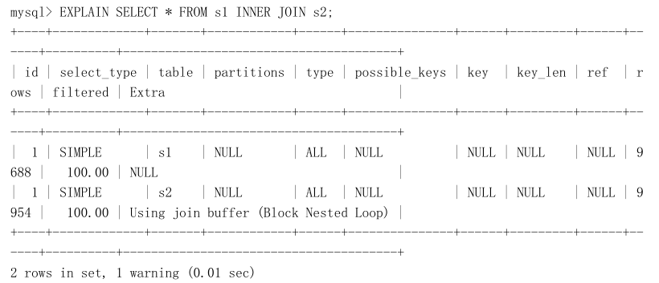
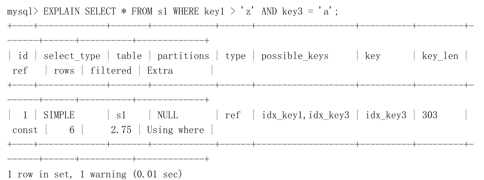
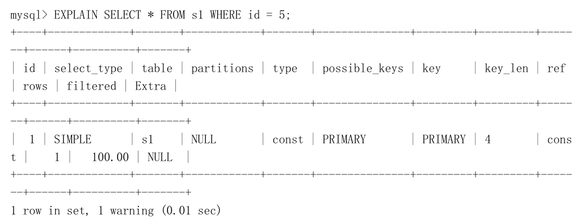
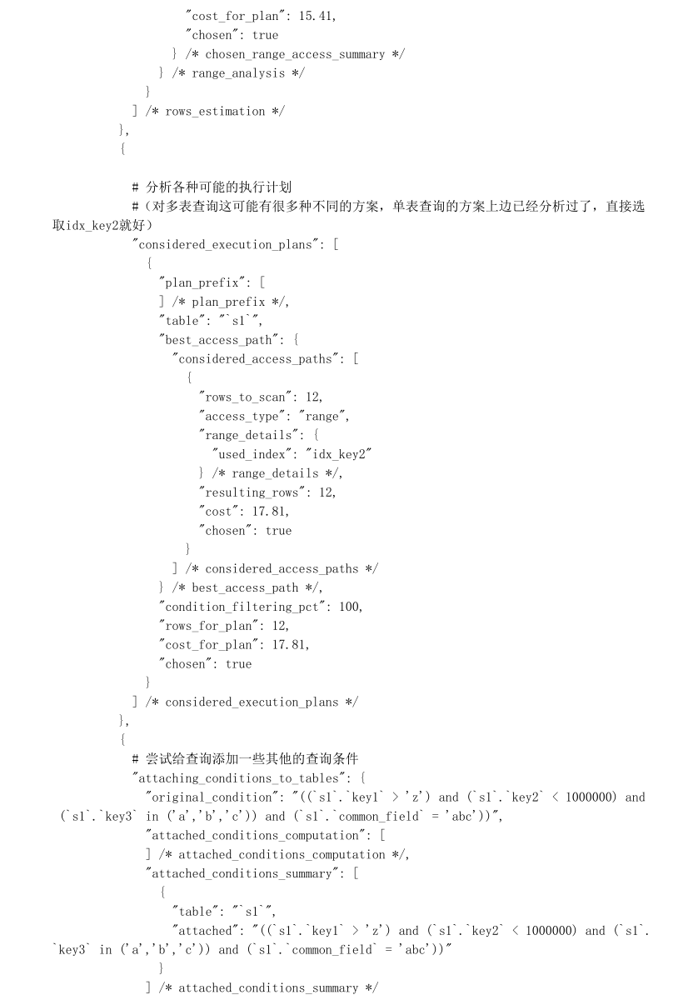

## 概要

​	我们知道mysql基本的存储单位是页，页中有多条行记录，也有不同类型的页，即使我们访问某个页中的一条数据时，也会把所属页的数据都加载到内存之中。这样后续的读取就不用到表空间io读取数据了。Mysql的缓存部分就是bufferpool。


## 索引设计优化

### 索引的代价

虽然索引是个好东西，可不能乱建，在介绍如何更好的使用索引之前先要了解一下使用这玩意儿的代价，它在空间和时间上都会拖后腿。

* 空间上的代价

  这个是显而易见的，每建立一个索引都要为它建立一棵 B+ 树，每一棵 B+ 树的每一个节点都是一个数据页，一个页默认会占用 16KB 的存储空间，一棵很大的 B+ 树由许多数据页组成，那可是很大的一片存储空间

* 时间上的代价
  每次对表中的数据进行增、删、改操作时，都需要去修改各个 B+ 树索引。而且我们讲过， B+ 树每层节点都是按照索引列的值从小到大的顺序排序而组成了双向链表。不论是叶子节点中的记录，还是内节点中的记录（也就是不论是用户记录还是目录项记录）都是按照索引列的值从小到大的顺序而形成了一个单向链表。而增、删、改操作可能会对节点和记录的排序造成破坏，所以存储引擎需要额外的时间进行一些记录移位，页面分裂、页面回收啥的操作来维护好节点和记录的排序。如果我们建了许多索引，每个索引对应的 B+ 树都要进行相关的维护操作，这还能不给性能拖后腿么？所以说，一个表上索引建的越多，就会占用越多的存储空间，在增删改记录的时候性能就越差。为了能建立又好又少的索引，我们先得学学这些索引在哪些条件下起作用的

### 索引命中场景

#### 全值匹配

如果我们的搜索条件中的列和索引列一致的话，这种情况就称为全值匹配，比方说下边这个查找语句：

```
SELECT * FROM person_info WHERE name = 'Ashburn' AND birthday = '1990-09-27' AND phone_num
ber = '15123983239';整个这个查询过程：
```

* 先是按照 name 列的值进行排序的，所以先可以很快定位 name 列的值是 Ashburn的记录位置。
* 在 name 列相同的记录里又是按照 birthday 列的值进行排序的，所以在 name 列的值是 Ashburn 的记录里又可以快速定位 birthday 列的值是 '1990-09-27' 的记录。
* name 和 birthday 列的值都是相同的，那记录是按照 phone_number 列的值排序的，所以联合索引中的三个列都可能被用到。

调换name 、 birthday 、 phone_number 的顺序是没影响索引顺序。 mysql的查询顺序会进行优化；

```
SELECT * FROM person_info WHERE birthday = '1990-09-27' AND phone_number = '15123983239' AND name = 'Ashburn';
```

#### 匹配左边的列

只包含左边的就行或者包含多个左边的列也行，比方说下边的查询语句：

```
SELECT * FROM person_info WHERE name = 'Ashburn';

SELECT * FROM person_info WHERE name = 'Ashburn' AND birthday = '1990-09-27';
```

这种就不能使用索引

```
SELECT * FROM person_info WHERE birthday = '1990-09-27';
```

因为 B+ 树的数据页和记录先是按照 name 列的值排序的，在 name 列的值相同的情况下才使用 birthday 列进行排序，也就是说 name 列的值不同的记录中 birthday 的值可能是无序的。而现在你跳过name 列直接根据 birthday 的值去查找,是无法做到的，也不能跳过；

```
SELECT * FROM person_info WHERE name = 'Ashburn' AND phone_number = '15123983239';
```

这种就只能使用name的索引

#### 匹配列前缀

字符串排序的本质就是比较哪个字符串大一点儿，哪个字符串小一点，比较字符串大小就用到了该列的字符集和比较规则，这个我们前边儿唠叨过，就不多唠叨了。这里需要注意的是，一般的比较规则都是逐个比较字符的大小，也就是说我们比较两个字符串的大小的过程其实是这样的：

* 先比较字符串的第一个字符，第一个字符小的那个字符串就比较小。
* 如果两个字符串的第一个字符相同，那就再比较第二个字符，第二个字符比较小的那个字符串就比较小。
* 如果两个字符串的第二个字符也相同，那就接着比较第三个字符，依此类推。

所以一个排好序的字符串列其实有这样的特点：

* 先按照字符串的第一个字符进行排序。
* 如果第一个字符相同再按照第二个字符进行排序。
* 如果第二个字符相同再按照第三个字符进行排序，依此类推。

**使用索引**:

```
SELECT * FROM person_info WHERE name LIKE 'As%';
```

后缀或者中间的某个字符串**不使用索引**:

```
SELECT * FROM person_info WHERE name LIKE '%As%';
```

对于后缀匹配需求，我们可以进行数据全部逆序存储一下，那么就可以使用前缀匹配；

#### 匹配范围值

所有记录都是按照索引列的值从小到大的顺序排好序的，所以这极大的方便我们查找索引列的值在某个范围内的记录。比方说下边这个查询语句：

```sql
SELECT * FROM person_info WHERE name > 'Asa' AND name < 'Barlow';
```

由于 B+ 树中的数据页和记录是先按 name 列排序的，所以我们上边的查询过程其实是这样的：

* 找到 name 值为 Asa 的记录。
* 找到 name 值为 Barlow 的记录。
* 由于所有记录都是由链表连起来的（记录之间用单链表，数据页之间用双链表），所以他们之间的记录都可以很容易的取出来
* 找到这些记录的主键值，再到 聚簇索引 中 回表 查找完整的记录。

不过在使用联合进行范围查找的时候需要注意，如果对多个列同时进行范围查找的话，只有对索引最左边的那个列进行范围查找的时候才能用到 B+ 树索引，比方说这样：

```sql
SELECT * FROM person_info WHERE name > 'Asa' AND name < 'Barlow' AND birthday > '1980-01-01';
```

上边这个查询可以分成两个部分：

* 通过条件 name > 'Asa' AND name < 'Barlow' 来对 name 进行范围，查找的结果可能有多条 name 值不同的
  记录

* 对这些 name 值不同的记录继续通过 birthday > '1980-01-01' 条件继续过滤。

  这样子对于联合索引 idx_name_birthday_phone_number 来说，只能用到 name 列的部分，而用不到 birthday 列的部分，因为只有 name 值相同的情况下才能用 birthday 列的值进行排序，而这个查询中通过 name 进行范围查找的记录中可能并不是按照 birthday 列进行排序的，所以在搜索条件中继续以 birthday 列进行查找时是用不到这个 B+ 树索引的

#### 精确&范围匹配

对于同一个联合索引来说，虽然对多个列都进行范围查找时只能用到最左边那个索引列，但是如果左边的列是精确查找，则右边的列可以进行范围查找。是可能命中索引或者部分索引的；

```sql
SELECT * FROM person_info WHERE name = 'Ashburn' AND birthday > '1980-01-01' AND birthday
< '2000-12-31' AND phone_number > '15100000000';
```


这个查询的条件可以分为3个部分：

* name = 'Ashburn' ，对 name 列进行精确查找，当然可以使用 B+ 树索引了。
* birthday > '1980-01-01' AND birthday < '2000-12-31' ，由于 name 列是精确查找，所以通过 name ='Ashburn' 条件查找后得到的结果的 name 值都是相同的，它们会再按照 birthday 的值进行排序。所以此时对 birthday 列进行范围查找是可以用到 B+ 树索引的。

* phone_number > '15100000000' ，通过 birthday 的范围查找的记录的 birthday 的值可能不同，所以这个条件无法再利用 B+ 树索引了，只能遍历上一步查询得到的记录。

同理，下边的查询也是可能用到这个 idx_name_birthday_phone_number 联合索引的：

```sql
SELECT * FROM person_info WHERE name = 'Ashburn' AND birthday = '1980-01-01' AND AND phone
_number > '15100000000';
```

#### 字段排序

我们经常通过 ORDER BY 子句按照某种规则进行排序。一般情况下，我们只能把记录都加载到内存中，再用一些排序算法，比如快速排序、归并排序、吧啦吧啦排序等等在内存中对这些记录进行排序，有的时候可能查询的结果集太大以至于不能在内存中进行排序的话，还可能暂时借助磁盘的空间来存放中间结果，排序操作完成后再把排好序的结果集返回到客户端。在 MySQL 中，把这种在内存中或者磁盘上进行排序的方式统称为文件排序（英文名： filesort ），文件本来很慢，但是如果 ORDER BY 子句里使用到了我们的索引列，就有可能省去在内存或文件中排序的步骤，比如下边这个简单的查询语句：

```
SELECT * FROM person_info ORDER BY name, birthday, phone_number LIMIT 10;
```

这个查询的结果集需要先按照 name 值排序，如果记录的 name 值相同，则需要按照 birthday 来排序，如果birthday 的值相同，则需要按照 phone_number 排序。因为这个 B+ 树索引本身就是按照上述规则排好序的，所以直接从索引中提取数据，然后进行 回表 操作取出该索引中不包含的列就好了。

**不使用索引的场景：**

* WHERE子句中出现非排序使用到的索引列

  ```
  SELECT * FROM person_info WHERE country = 'China' ORDER BY name LIMIT 10;
  ```

  这个查询只能先把符合搜索条件 country = 'China' 的记录提取出来后再进行排序，是使用不到索引。注意和下
  边这个查询作区别：

  ```
  SELECT * FROM person_info WHERE name = 'A' ORDER BY birthday, phone_number LIMIT 10;
  ```

  虽然这个查询也有搜索条件，但是 name = 'A' 可以使用到索引 idx_name_birthday_phone_number ，而且过滤剩
  下的记录还是按照 birthday 、 phone_number 列排序的，所以还是可以使用索引进行排序的，**如果name是范围则不会使用索引**

* 排序列包含非同一个索引的列

  有时候用来排序的多个列不是一个索引里的，这种情况也不能使用索引进行排序，比方说：

  ```
  SELECT * FROM person_info ORDER BY name, country LIMIT 10;
  ```

  name 和 country 并不属于一个联合索引中的列，所以无法使用索引进行排序

* 排序列使用了复杂的表达式

  要想使用索引进行排序操作，必须保证索引列是以单独列的形式出现，而不是修饰过的形式

  ```
  SELECT * FROM person_info ORDER BY UPPER(name) LIMIT 10;
  ```

  使用了 UPPER 函数修饰过的列

#### 字段分组

```
SELECT name, birthday, phone_number, COUNT(*) FROM person_info GROUP BY name, birthday, ph
one_number
```

查询语句相当于做了3次分组操作：

* 先把记录按照 name 值进行分组，所有 name 值相同的记录划分为一组。
* 将每个 name 值相同的分组里的记录再按照 birthday 的值进行分组，将 birthday 值相同的记录放到一个小分组里，所以看起来就像在一个大分组里又化分了好多小分组。
* 再将上一步中产生的小分组按照 phone_number 的值分成更小的分组，所以整体上看起来就像是先把记录分成一个大分组，然后把 大分组 分成若干个 小分组 ，然后把若干个 小分组 再细分成更多的 小小分组 。

然后针对那些 小小分组 进行统计，比如在我们这个查询语句中就是统计每个 小小分组 包含的记录条数。如果没有索引的话，这个分组过程全部需要在内存里实现，而如果有了索引的话，恰巧这个分组顺序又和我们的 B+ 树中的索引列的顺序是一致的，而我们的 B+ 树索引又是按照索引列排好序的，这不正好么，所以可以直接使用B+ 树索引进行分组。和使用 B+ 树索引进行排序是一个道理，分组列的顺序也需要和索引列的顺序一致，也可以只使用索引列中左边的列进行分组

### 回表

#### 回表过程

```
SELECT * FROM person_info WHERE name > 'Asa' AND name < 'Barlow';
```

在使用 idx_name_birthday_phone_number 索引进行查询时大致可以分为这两个步骤：
* 从索引 idx_name_birthday_phone_number 对应的 B+ 树中取出 name 值在 Asa ～ Barlow 之间的用户记录。

  由于索引 idx_name_birthday_phone_number 对应的 B+ 树中的记录首先会按照 name 列的值进行排序，所以值在 Asa ～ Barlow 之间的记录在磁盘中的存储是相连的，集中分布在一个或几个数据页中，我们可以很快的把这些连着的记录从磁盘中读出来，这种读取方式我们也可以称为 **顺序I/O**

* 由于索引 idx_name_birthday_phone_number 对应的 B+ 树用户记录中只包含 name 、 birthday 、phone_number 、 id 这4个字段，而查询列表是 * ，意味着要查询表中所有字段，也就是还要包括 country字段。这时需要把从上一步中获取到的每一条记录的 id 字段都到聚簇索引对应的 B+ 树中找到完整的用户记录，也就是我们通常所说的 回表 ，然后把完整的用户记录返回给查询用户。

  根据第1步中获取到的记录的 id 字段的值可能并不相连，而在聚簇索引中记录是根据 id （也就是主键）的顺序排列的，所以根据这些并不连续的 id值到聚簇索引中访问完整的用户记录可能分布在不同的数据页中，这样读取完整的用户记录可能要访问更多的数据页，这种读取方式我们也可以称为 随机I/O 。一般情况下，顺序I/O比随机I/O的性能高很多，所以步骤1的执行可能很快，而步骤2就慢一些

总结下来：

* 会使用到两个 B+ 树索引，一个二级索引，一个聚簇索引。
* 访问二级索引使用 顺序I/O ，访问聚簇索引使用 随机I/O 

#### 回表优化

需要回表的记录越多，使用二级索引的性能就越低，甚至让某些查询宁愿使用全表扫描也不使用 二级索引 。比方说 name 值在 Asa ～ Barlow 之间的用户记录数量占全部记录数量90%以上，那么如果使用idx_name_birthday_phone_number 索引的话，有90%多的 id 值需要回表，这不是吃力不讨好么，**还不如直接去扫描聚簇索引（也就是全表扫描）**

查询优化器会事先对表中的记录计算一些统计数据，然后再利用这些统计数据根据查询的条件来计算一下需要回表的记录数，需要回表的记录数越多，就越倾向于使用全表扫描，反之倾向于使用 二级索引 + 回表 的方式。当然优化器做的分析工作不仅仅是这么简单，但是大致上是个这个过程。一般情况下，限制查询获取较少的记录数会让优化器更倾向于选择使用 二级索引 + 回表 的方式进行查询，因为回表的记录越少，性能提升就越高，比方说上边的查询可以改写成这样：

```
SELECT * FROM person_info WHERE name > 'Asa' AND name < 'Barlow' LIMIT 10;
```

添加了 LIMIT 10 的查询更容易让优化器采用 二级索引 + 回表 的方式进行查询。
对于有排序需求的查询，上边讨论的采用 全表扫描 还是 二级索引 + 回表 的方式进行查询的条件也是成立的，比方说下边这个查询：

```
SELECT * FROM person_info ORDER BY name, birthday, phone_number;
```

由于查询列表是 * ，所以如果使用二级索引进行排序的话，需要把排序完的二级索引记录全部进行回表操作，这样操作的成本还不如直接遍历聚簇索引然后再进行文件排序（ filesort ）低，所以优化器会倾向于使用 全表扫描 的方式执行查询。如果我们加了 LIMIT 子句，比如这样：

```
SELECT * FROM person_info ORDER BY name, birthday, phone_number LIMIT 10;
```

这样需要回表的记录特别少，优化器就会倾向于使用 二级索引 + 回表 的方式执行查询。

#### 索引覆盖优化

为了彻底告别 回表 操作带来的性能损耗，我们建议：最好在查询列表里只包含索引列，比如这样：

```
SELECT name, birthday, phone_number FROM person_info WHERE name > 'Asa' AND name < 'Barlow'
```

因为我们只查询 name , birthday , phone_number 这三个索引列的值，所以在通过idx_name_birthday_phone_number 索引得到结果后就不必到 聚簇索引 中再查找记录的剩余列，也就是country 列的值了，这样就省去了 回表 操作带来的性能损耗。我们把这种只需要用到索引的查询方式称为 索引覆盖 。排序操作也优先使用 覆盖索引 的方式进行查询，比方说这个查询：

```
SELECT name, birthday, phone_number FROM person_info ORDER BY name, birthday, phone_number;
```

虽然这个查询中没有 LIMIT 子句，但是采用了 覆盖索引 ，所以查询优化器就会直接使用idx_name_birthday_phone_number 索引进行排序而不需要回表操作了。当然，如果业务需要查询出索引以外的列，那还是以保证业务需求为重。但是我们很不鼓励用 * 号作为查询列表，最好把我们需要查询的列依次标明。

### 索引设计经验

#### 按需选择字段

只为出现在 WHERE 子句中的列、连接子句中的连接列，或者出现在 ORDER BY 或 GROUP BY 子句中的列创建索引。而出现在查询列表中的列就没必要建立索引了：

```
SELECT birthday, country FROM person name WHERE name = 'Ashburn';
```

像查询列表中的 birthday 、 country 这两个列就不需要建立索引，我们只需要为出现在 WHERE 子句中的 name列创建索引就可以了

#### 列基数大小

​	列的基数 指的是某一列中不重复数据的个数，比方说某个列包含值 2, 5, 8, 2, 5, 8, 2, 5, 8 ，虽然有 9 条记录，但该列的基数却是 3 。也就是说，在记录行数一定的情况下，列的基数越大，该列中的值越分散，列的基数越小，该列中的值越集中。这个 列的基数 指标非常重要，直接影响我们是否能有效的利用索引。假设某个列的基数为 1 ，也就是所有记录在该列中的值都一样，那为该列建立索引是没有用的，因为所有值都一样就无法排序，无法进行快速查找了～ 而且如果某个建立了二级索引的列的重复值特别多，那么使用这个二级索引查出的记录还可能要做回表操作，这样性能损耗就更大了。所以结论就是：最好为那些列的基数大的列建立索引，为基数太小列的建立索引效果可能不好

#### 字段类型长度

​	我们在定义表结构的时候要显式的指定列的类型，以整数类型为例，有 TINYINT 、 MEDIUMINT 、 INT 、 BIGINT这么几种，它们占用的存储空间依次递增，我们这里所说的 类型大小 指的就是该类型表示的数据范围的大小。能表示的整数范围当然也是依次递增，如果我们想要对某个整数列建立索引的话，在表示的整数范围允许的情况下，**尽量让索引列使用较小的类型**，比如我们能使用 INT 就不要使用 BIGINT ，能使用 MEDIUMINT 就不要使用INT，这是因为：

* 数据类型越小，在查询时进行的比较操作越快
* 数据类型越小，索引占用的存储空间就越少，在一个数据页内就可以放下更多的记录，从而减少磁盘 I/O 带来的性能损耗，也就意味着可以把更多的数据页缓存在内存中，从而加快读写效率

这个建议对于表的主键来说更加适用，因为不仅是聚簇索引中会存储主键值，其他所有的二级索引的节点处都会存储一份记录的主键值，如果主键适用更小的数据类型，也就意味着节省更多的存储空间和更高效的 I/O 。

#### 字符串前缀

MySQL 中使用 utf8 字符集去存储字符串的话，编码一个字符需要占用 1~3 个字节。假设我们的字符串很长，那存储一个字符串就需要占用很大的存储空间。在我们需要为这个字符串列建立索引时，那就意味着在对应的 B+ 树中有这么两个问题：

* B+ 树索引中的记录需要把该列的完整字符串存储起来，而且字符串越长，在索引中占用的存储空间越大。
* 如果 B+ 树索引中索引列存储的字符串很长，那在做字符串比较时会占用更多的时间。

我们前边儿说过索引列的字符串前缀其实也是排好序的，所以索引的设计者提出了个方案 --- 只对字符串的前几个字符进行索引也就是说在二级索引的记录中只保留字符串前几个字符。这样在查找记录时虽然不能精确的定位到记录的位置，但是能定位到相应前缀所在的位置，然后根据前缀相同的记录的主键值回表查询完整的字符串值，再对比就好了。这样只在 B+ 树中存储字符串的前几个字符的编码，既节约空间，又减少了字符串的比较时间，还大概能解决排序的问题，何乐而不为，比方说我们在建表语句中只对 name 列的前10个字符进行索引可以这么写：

```sql
CREATE TABLE person_info(
    name VARCHAR(100) NOT NULL,
    birthday DATE NOT NULL,
    phone_number CHAR(11) NOT NULL,
    country varchar(100) NOT NULL,
    KEY idx_name_birthday_phone_number (name(10), birthday, phone_number)
);
```

name(10) 就表示在建立的 B+ 树索引中只保留记录的前 10 个字符的编码，这种只索引字符串值的前缀的策略是我们非常鼓励的，尤其是在字符串类型能存储的字符比较多的时候

如果使用了索引列前缀，比方说前边只把 name 列的前10个字符放到了二级索引中，

```sql
SELECT * FROM person_info ORDER BY name LIMIT 10;
```

因为二级索引中不包含完整的 name 列信息，所以无法对前十个字符相同，后边的字符不同的记录进行排序，也就是使用索引列前缀的方式无法支持使用索引排序，只能进行文件排序

#### 函数

假设表中有一个整数列 my_col ，我们为这个列建立了索引。下边的两个 WHERE 子句虽然语义是一致的，但是在效率上却有差别：
* WHERE my_col * 2 < 4
* WHERE my_col < 4/2

第1个 WHERE 子句中 my_col 列并不是以单独列的形式出现的，而是以 my_col * 2 这样的表达式的形式出现的，存储引擎会依次遍历所有的记录，计算这个表达式的值是不是小于 4 ，所以这种情况下是使用不到为 my_col 列建立的 B+ 树索引的。而第2个 WHERE 子句中 my_col 列并是以单独列的形式出现的，这样的情况可以直接使用B+ 树索引。

所以结论就是：如果索引列在比较表达式中不是以单独列的形式出现，而是以某个表达式，或者函数调用形式出现的话，是用不到索引的。

#### 主键插入顺序

对于一个使用 InnoDB 存储引擎的表来说，在我们没有显式的创建索引时，表中的数据实际上都是存储在 聚簇索引 的叶子节点的。而记录又是存储在数据页中的，数据页和记录又是按照记录主键值从小到大的顺序进行排序，所以如果我们插入的记录的主键值是依次增大的话，那我们每插满一个数据页就换到下一个数据页继续插，而如果我们插入的主键值忽大忽小的话，这就比较麻烦了，假设某个数据页存储的记录已经满了，它存储的主键值在 1~100 之间

可这个数据页已经满了啊，再插进来咋办呢？我们需要把当前页面分裂成两个页面，把本页中的一些记录移动到新创建的这个页中。页面分裂和记录移位意味着什么？意味着：性能损耗！所以如果我们想尽量避免这样无谓的性能损耗，最好让插入的记录的主键值依次递增，这样就不会发生这样的性能损耗了。所以我们建议：让主键具有 AUTO_INCREMENT ，让存储引擎自己为表生成主键，而不是我们手动插入

```sql
CREATE TABLE person_info(
    id INT UNSIGNED NOT NULL AUTO_INCREMENT,
    name VARCHAR(100) NOT NULL,
    birthday DATE NOT NULL,
    phone_number CHAR(11) NOT NULL,
    country varchar(100) NOT NULL,
    PRIMARY KEY (id),
    KEY idx_name_birthday_phone_number (name(10), birthday, phone_number)
);
```

我们自定义的主键列 id 拥有 AUTO_INCREMENT 属性，在插入记录时存储引擎会自动为我们填入自增的主键值

#### 避免冗余

```sql
CREATE TABLE person_info(
    id INT UNSIGNED NOT NULL AUTO_INCREMENT,
    name VARCHAR(100) NOT NULL,
    birthday DATE NOT NULL,
    phone_number CHAR(11) NOT NULL,
    country varchar(100) NOT NULL,
    PRIMARY KEY (id),
    KEY idx_name_birthday_phone_number (name(10), birthday, phone_number),
    KEY idx_name (name(10))
);
```

我们知道，通过 idx_name_birthday_phone_number 索引就可以对 name 列进行快速搜索，再创建一个专门针对name 列的索引就算是一个 冗余 索引，维护这个索引只会增加维护的成本，并不会对搜索有什么好处

另一种情况，我们可能会对某个列重复建立索引，比方说这样：

```sql
CREATE TABLE repeat_index_demo (
c1 INT PRIMARY KEY,
c2 INT,
UNIQUE uidx_c1 (c1),
INDEX idx_c1 (c1)
);
```

我们看到， c1 既是主键、又给它定义为一个唯一索引，还给它定义了一个普通索引，可是主键本身就会生成聚
簇索引，所以定义的唯一索引和普通索引是重复的，这种情况要避免。

### 小结

* B+ 树索引在空间和时间上都有代价，需要谨慎建立索引。
* B+ 树索引适用于下边这些情况：
  * 全值匹配
  * 匹配左边的列
  * 匹配范围值
  * 精确匹配某一列并范围匹配另外一列
  * 用于排序
  * 用于分组
* 在使用索引时需要注意下边这些事项：
  * 只为用于搜索、排序或分组的列创建索引
  * 为列的基数大的列创建索引
  * 索引列的类型尽量小
  * 可以只对字符串值的前缀建立索引
  * 只有索引列在比较表达式中单独出现才可以适用索引
  * 为了尽可能少的让 聚簇索引 发生页面分裂和记录移位的情况，建议让主键拥有 AUTO_INCREMENT 属性。
  * 定位并删除表中的重复和冗余索引
  * 尽量使用 覆盖索引 进行查询，避免 回表 带来的性能损耗

## Explain辅助工具

​	一条查询语句在经过 MySQL 查询优化器的各种基于成本和规则的优化会后生成一个所谓的 执行计划 ，这个执行计划展示了接下来具体执行查询的方式，比如多表连接的顺序是什么，对于每个表采用什么访问方法来具体执行查询等

 	EXPLAIN 语句来帮助我们查看某个查询语句的具体执行计划；其实除了以 SELECT 开头的查询语句，其余的 DELETE 、 INSERT 、 REPLACE 以及 UPDATE 语句前边都可以加上 EXPLAIN这个词儿，用来查看这些语句的执行计划，不过我们这里对 SELECT 语句更感兴趣，所以后边只会以 SELECT 语句为例来描述 EXPLAIN 语句的用法。为了让大家先有一个感性的认识，我们把 EXPLAIN 语句输出的各个列的作用先大致罗列一下：

 

### 各列详解

#### table

​	不论我们的查询语句有多复杂，里边儿包含了多少个表，到最后也是需要对每个表进行单表访问的，所以设计MySQL 的大叔规定EXPLAIN语句输出的每条记录都对应着某个单表的访问方法，该条记录的table列代表着该表的表名。所以我们看一条比较简单的查询语句：

 

​	这个查询语句只涉及对 s1 表的单表查询，所以 EXPLAIN 输出中只有一条记录，其中的 table 列的值是 s1 ，表明这条记录是用来说明对 s1 表的单表访问方法的。下边我们看一下一个连接查询的执行计划：

 

可以看到这个连接查询的执行计划中有两条记录，这两条记录的 table 列分别是 s1 和 s2 ，这两条记录用来分别说明对 s1 表和 s2 表的访问方法是什么

#### id

我们知道我们写的查询语句一般都以 SELECT 关键字开头，比较简单的查询语句里只有一个 SELECT 关键字，比如下边这个查询语句：

```
SELECT * FROM s1 WHERE key1 = 'a';
```

稍微复杂一点的连接查询中也只有一个 SELECT 关键字，比如：

```
SELECT * FROM s1 INNER JOIN s2
ON s1.key1 = s2.key1
WHERE s1.common_field = 'a';
```

但是下边两种情况下在一条查询语句中会出现多个 SELECT 关键字：查询中包含子查询的情况，比如下边这个查询语句中就包含2个 SELECT 关键字：

```
SELECT * FROM s1
WHERE key1 IN (SELECT * FROM s2);
```

查询中包含 UNION 语句的情况比如下边这个查询语句中也包含2个 SELECT 关键字：

```
SELECT * FROM s1 UNION SELECT * FROM s2;
```

查询语句中每出现一个 SELECT 关键字，会为它分配一个唯一的 id 值。这个 id 值就是EXPLAIN 语句的第一个列，比如下边这个查询中只有一个 SELECT 关键字，所以 EXPLAIN 的结果中也就只有一条 id 列为 1 的记录：

 

对于连接查询来说，一个 SELECT 关键字后边的 FROM 子句中可以跟随多个表，所以在连接查询的执行计划中，每个表都会对应一条记录，但是这些记录的id值都是相同的，比如：

 

可以看到，上述连接查询中参与连接的 s1 和 s2 表分别对应一条记录，但是这两条记录对应的 id 值都是 1 。这里需要大家记住的是，**在连接查询的执行计划中，每个表都会对应一条记录，这些记录的id列的值是相同的，出现在前边的表表示驱动表，出现在后边的表表示被驱动表**。所以从上边的 EXPLAIN 输出中我们可以看出，查询优化器准备让 s1 表作为驱动表，让 s2 表作为被驱动表来执行查询。对于包含子查询的查询语句来说，就可能涉及多个 SELECT 关键字，所以在包含子查询的查询语句的执行计划中，每个 SELECT 关键字都会对应一个唯一的 id 值，比如这样：

 

从输出结果中我们可以看到， s1 表在外层查询中，外层查询有一个独立的 SELECT 关键字，所以第一条记录的id 值就是 1 ， s2 表在子查询中，子查询有一个独立的 SELECT 关键字，所以第二条记录的 id 值就是 2 。

但是这里大家需要特别注意，查询优化器可能对涉及子查询的查询语句进行重写，从而转换为连接查询。所以如果我们想知道查询优化器对某个包含子查询的语句是否进行了重写，直接查看执行计划就好了，比如说： 

 

可以看到，虽然我们的查询语句是一个子查询，但是执行计划中 s1 和 s2 表对应的记录的 id 值全部是 1 ，这就表明了查询优化器将子查询转换为了连接查询。

对于包含 UNION 子句的查询语句来说，每个 SELECT 关键字对应一个 id 值也是没错的，不过还是有点儿特别的东西，比方说下边这个查询： 

 

这个语句的执行计划的第三条记录是个什么鬼？为毛 id 值是 NULL ，而且 table 列长的也怪怪的？大家别忘了UNION 子句是干嘛用的，它会把多个查询的结果集合并起来并对结果集中的记录进行去重，怎么去重呢？ MySQL使用的是内部的临时表。正如上边的查询计划中所示， UNION 子句是为了把 id 为 1 的查询和 id 为 2 的查询的结果集合并起来并去重，所以在内部创建了一个名为 <union1, 2> 的临时表（就是执行计划第三条记录的 table列的名称）， id 为 NULL 表明这个临时表是为了合并两个查询的结果集而创建的。跟 UNION 对比起来， UNION ALL 就不需要为最终的结果集进行去重，它只是单纯的把多个查询的结果集中的记录合并成一个并返回给用户，所以也就不需要使用临时表。所以在包含 UNION ALL 子句的查询的执行计划中，就没有那个 id 为 NULL 的记录，如下所示： 

 

#### select_type

​	通过上边的内容我们知道，一条大的查询语句里边可以包含若干个 SELECT 关键字，每个 SELECT 关键字代表着一个小的查询语句，而每个 SELECT 关键字的 FROM 子句中都可以包含若干张表（这些表用来做连接查询），每一张表都对应着执行计划输出中的一条记录，对于在同一个 SELECT 关键字中的表来说，它们的 id 值是相同的。
​	为每一个 SELECT 关键字代表的小查询都定义了一个称之为 select_type 的属性，意思是我们只要知道了某个小查询的 select_type 属性，就知道了这个小查询在整个大查询中扮演了一个什么角色，口说无凭，我们还是先来见识见识这个 select_type 都能取哪些值：

* SIMPLE

  查询语句中不包含 UNION 或者子查询的查询都算作是 SIMPLE 类型，比方说下边这个单表查询的select_type 的值就是 SIMPLE ：

   

  当然，连接查询也算是 SIMPLE 类型，比如： 

   

* PRIMARY

  对于包含 UNION 、 UNION ALL 或者子查询的大查询来说，它是由几个小查询组成的，其中最左边的那个查询的 select_type 值就是 PRIMARY ，比方说：

   

  从结果中可以看到，最左边的小查询 SELECT * FROM s1 对应的是执行计划中的第一条记录，它的select type 值就是 PRIMARY

* UNION

  对于包含 UNION 或者 UNION ALL 的大查询来说，它是由几个小查询组成的，其中除了最左边的那个小查询以外，其余的小查询的 select_type 值就是 UNION ，可以对比上一个例子的效果

* UNION RESULT

  MySQL 选择使用临时表来完成 UNION 查询的去重工作，针对该临时表的查询的 select_type 就是 UNION RESULT

* SUBQUERY

  如果包含子查询的查询语句不能够转为对应的 semi-join 的形式，并且该子查询是不相关子查询，并且查询优化器决定采用将该子查询物化的方案来执行该子查询时，该子查询的第一个 SELECT 关键字代表的那个查询的 select_type 就是 SUBQUERY ，比如下边这个查询：

   

  可以看到，外层查询的 select_type 就是 PRIMARY ，子查询的 select_type 就是 SUBQUERY 。需要大家注意的是，由于select_type为SUBQUERY的子查询由于会被物化，所以只需要执行一遍；

* DEPENDENT SUBQUERY

  如果包含子查询的查询语句不能够转为对应的 semi-join 的形式，并且该子查询是相关子查询，则该子查询的第一个 SELECT 关键字代表的那个查询的 select_type 就是 DEPENDENT SUBQUERY ，比如下边这个查询：

   

  需要大家注意的是，select_type为DEPENDENT SUBQUERY的查询可能会被执行多次

* DEPENDENT UNION

  在包含 UNION 或者 UNION ALL 的大查询中，如果各个小查询都依赖于外层查询的话，那除了最左边的那个小查询之外，其余的小查询的 select_type 的值就是 DEPENDENT UNION 。说的有些绕哈，比方说下边这个查询：

   

  这个查询比较复杂，大查询里包含了一个子查询，子查询里又是由 UNION 连起来的两个小查询。从执行计划中可以看出来， SELECT key1 FROM s2 WHERE key1 = 'a' 这个小查询由于是子查询中第一个查询，所以它的 select_type 是 DEPENDENT SUBQUERY ，而 SELECT key1 FROM s1 WHERE key1 = 'b' 这个查询的select_type 就是 DEPENDENT UNION

* DERIVED

  对于采用物化的方式执行的包含派生表的查询，该派生表对应的子查询的 select_type 就是 DERIVED ，比方说下边这个查询：

   

  从执行计划中可以看出， id 为 2 的记录就代表子查询的执行方式，它的 select_type 是 DERIVED ，说明该子查询是以物化的方式执行的。 id 为 1 的记录代表外层查询，大家注意看它的 table 列显示的是<derived2> ，表示该查询是针对将派生表物化之后的表进行查询的

  **PS：如果派生表可以通过和外层查询合并的方式执行的话**

* MATERIALIZED

  当查询优化器在执行包含子查询的语句时，选择将子查询物化之后与外层查询进行连接查询时，该子查询对应的 select_type 属性就是 MATERIALIZED ，比如下边这个查询：

   

  执行计划的第三条记录的 id 值为 2 ，说明该条记录对应的是一个单表查询，从它的 select_type 值为MATERIALIZED 可以看出，查询优化器是要把子查询先转换成物化表。然后看执行计划的前两条记录的 id 值都为 1 ，说明这两条记录对应的表进行连接查询，需要注意的是第二条记录的 table 列的值是
  <subquery2> ，说明该表其实就是 id 为 2 对应的子查询执行之后产生的物化表，然后将 s1 和该物化表进行连接查询

* UNCACHEABLE SUBQUERY

  不常用

* UNCACHEABLE UNION

  不常用

#### partitions

略

#### type

​	对使用 InnoDB 存储引擎的表进行单表访问的一些访问方法，完整的访问方法如下： system ， const ，eq_ref ， ref ， fulltext ， ref_or_null ， index_merge ， unique_subquery ， index_subquery ，range ， index ， ALL

* system 

  当表中只有一条记录并且该表使用的存储引擎的统计数据是精确的，比如MyISAM、Memory，那么对该表的访问方法就是 system 。比方说我们新建一个 MyISAM 表，并为其插入一条记录：

   

  然后我们看一下查询这个表的执行计划：

   

  可以看到 type 列的值就是 system 

* const

  这个我们前边唠叨过，就是当我们根据主键或者唯一二级索引列与常数进行等值匹配时，对单表的访问方法就是 const ，比如：

   

* eq_ref

  在连接查询时，如果被驱动表是通过主键或者唯一二级索引列等值匹配的方式进行访问的（如果该主键或者唯一二级索引是联合索引的话，所有的索引列都必须进行等值比较），则对该被驱动表的访问方法就是eq_ref ，比方说：

   

  从执行计划的结果中可以看出， MySQL 打算将 s1 作为驱动表， s2 作为被驱动表，重点关注 s2 的访问方法是 eq_ref ，表明在访问 s2 表的时候可以通过主键的等值匹配来进行访问

* ref

  当通过普通的二级索引列与常量进行等值匹配时来查询某个表，那么对该表的访问方法就可能是 ref

* fulltext

  全文索引

* ref_or_null

  当对普通二级索引进行等值匹配查询，该索引列的值也可以是 NULL 值时，那么对该表的访问方法就可能是ref_or_null ，比如说：

   

* index_merge

  一般情况下对于某个表的查询只能使用到一个索引，但我们唠叨单表访问方法时特意强调了在某些场景下可以使用 Intersection 、 Union 、 Sort-Union 这三种索引合并的方式来执行查询，忘掉的回去补一下哈，我们看一下执行计划中是怎么体现 MySQL 使用索引合并的方式来对某个表执行查询的：

   

  从执行计划的 type 列的值是 index_merge 就可以看出， MySQL 打算使用索引合并的方式来执行对 s1 表的查询

* unique_subquery

  类似于两表连接中被驱动表的 eq_ref 访问方法， unique_subquery 是针对在一些包含 IN 子查询的查询语句中，如果查询优化器决定将 IN 子查询转换为 EXISTS 子查询，而且子查询可以使用到主键进行等值匹配的话，那么该子查询执行计划的 type 列的值就是 unique_subquery ，比如下边的这个查询语句：

   

  可以看到执行计划的第二条记录的 type 值就是 unique_subquery ，说明在执行子查询时会使用到 id 列的索引

* index_subquery

  index_subquery 与 unique_subquery 类似，只不过访问子查询中的表时使用的是普通的索引，比如这样：

   

* range

  如果使用索引获取某些 范围区间 的记录，那么就可能使用到 range 访问方法，比如下边的这个查询：

   

  或者

   

* index

  当我们可以使用索引覆盖，但需要扫描全部的索引记录时，该表的访问方法就是 index ，比如这样：

   

  上述查询中的搜索列表中只有 key_part2 一个列，而且搜索条件中也只有 key_part3 一个列，这两个列又恰好包含在 idx_key_part 这个索引中，可是搜索条件 key_part3 不能直接使用该索引进行 ref 或者 range 方式的访问，只能扫描整个 idx_key_part 索引的记录，所以查询计划的 type 列的值就是 index 。

**PS：对于使用InnoDB存储引擎的表来说，二级索引的记录只包含索引列和主键列的值，而聚簇索引中包含用户定义的全部列以及一些隐藏列，所以扫描二级索引的代价比直接全表扫描，也就是扫描聚簇索引的代价更低一些**

* ALL

  全表扫描

   

  一般来说，这些访问方法按照我们介绍它们的顺序性能依次变差。其中除了 All 这个访问方法外，其余的访问方法都能用到索引，除了 index_merge 访问方法外，其余的访问方法都最多只能用到一个索引；

#### possible_keys和key

在 EXPLAIN 语句输出的执行计划中， possible_keys 列表示在某个查询语句中，对某个表执行单表查询时可能用到的索引有哪些， key 列表示实际用到的索引有哪些，比方说下边这个查询：

 

​	上述执行计划的 possible_keys 列的值是 idx_key1,idx_key3 ，表示该查询可能使用到 idx_key1,idx_key3 两个索引，然后 key 列的值是 idx_key3 ，表示经过查询优化器计算使用不同索引的成本后，最后决定使用idx_key3 来执行查询比较划算。
​	不过有一点比较特别，就是在使用 index 访问方法来查询某个表时， possible_keys 列是空的，而 key 列展示的是实际使用到的索引，比如这样：

 

**另外需要注意的一点是，possible_keys列中的值并不是越多越好，可能使用的索引越多，查询优化器计算查询成本时就得花费更长时间，所以如果可以的话，尽量删除那些用不到的索引**

#### key_len

key_len 列表示当优化器决定使用某个索引执行查询时，该索引记录的最大长度，它是由这三个部分构成的：

* 对于使用固定长度类型的索引列来说，它实际占用的存储空间的最大长度就是该固定值，对于指定字符集的变长类型的索引列来说，比如某个索引列的类型是 VARCHAR(100) ，使用的字符集是 utf8 ，那么该列实际占用的最大存储空间就是 100 × 3 = 300 个字节。
* 如果该索引列可以存储 NULL 值，则 key_len 比不可以存储 NULL 值时多1个字节。
* 对于变长字段来说，都会有2个字节的空间来存储该变长列的实际长度。

比如如下查询：

 

由于 id 列的类型是 INT ，并且不可以存储 NULL 值，所以在使用该列的索引时 key_len 大小就是 4 。当索引列可以存储 NULL 值时，比如：

 

可以看到 key_len 列就变成了 5 ，比使用 id 列的索引时多了 1 。对于可变长度的索引列来说，比如下边这个查询：

 

由于 key1 列的类型是 VARCHAR(100) ，所以该列实际最多占用的存储空间就是 300 字节，又因为该列允许存储NULL 值，所以 key_len 需要加 1 ，又因为该列是可变长度列，所以 key_len 需要加 2 ，所以最后 ken_len 的值就是 303 。

你在前边唠叨 InnoDB 行格式的时候不是说，存储变长字段的实际长度不是可能占用1个字节或者2个字节么？为什么现在不管三七二十一都用了 2 个字节？这里需要强调的一点是，执行计划的生成是在MySQL server 层中的功能，并不是针对具体某个存储引擎的功能，设计 MySQL 的大叔在执行计划中输出key_len 列主要是为了让我们区分某个使用联合索引的查询具体用了几个索引列，而不是为了准确的说明针对某个具体存储引擎存储变长字段的实际长度占用的空间到底是占用1个字节还是2个字节。比方说下边这个使用到联合索引 idx_key_part 的查询： 

 

我们可以从执行计划的 key_len 列中看到值是 303 ，这意味着 MySQL 在执行上述查询中只能用到 idx_key_part索引的一个索引列，而下边这个查询：

 

这个查询的执行计划的 ken_len 列的值是 606 ，说明执行这个查询的时候可以用到联合索引 idx_key_part 的两个索引列

#### ref

当使用索引列等值匹配的条件去执行查询时，也就是在访问方法是 const 、 eq_ref 、 ref 、 ref_or_null 、unique_subquery 、 index_subquery 其中之一时， ref 列展示的就是与索引列作等值匹配的东东是个啥，比如只是一个常数或者是某个列。大家看下边这个查询：

  

可以看到 ref 列的值是 const ，表明在使用 idx_key1 索引执行查询时，与 key1 列作等值匹配的对象是一个常数，当然有时候更复杂一点： 

 

可以看到对被驱动表 s2 的访问方法是 eq_ref ，而对应的 ref 列的值是 xiaohaizi.s1.id ，这说明在对被驱动表进行访问时会用到 PRIMARY 索引，也就是聚簇索引与一个列进行等值匹配的条件，于 s2 表的 id 作等值匹配的对象就是 xiaohaizi.s1.id 列（注意这里把数据库名也写出来了）。有的时候与索引列进行等值匹配的对象是一个函数，比方说下边这个查询： 

 

我们看执行计划的第二条记录，可以看到对 s2 表采用 ref 访问方法执行查询，然后在查询计划的 ref 列里输出·的是 func ，说明与 s2 表的 key1 列进行等值匹配的对象是一个函数

#### rows

如果查询优化器决定使用全表扫描的方式对某个表执行查询时，执行计划的 rows 列就代表预计需要扫描的行数，如果使用索引来执行查询时，执行计划的 rows 列就代表预计扫描的索引记录行数。比如下边这个查询： 

 

我们看到执行计划的 rows 列的值是 266 ，这意味着查询优化器在经过分析使用 idx_key1 进行查询的成本之后，觉得满足 key1 > 'z' 这个条件的记录只有 266 条

#### filtered

之前在分析连接查询的成本时提出过一个 condition filtering 的概念，就是 MySQL 在计算驱动表扇出时采用的一个策略：

* 如果使用的是全表扫描的方式执行的单表查询，那么计算驱动表扇出时需要估计出满足搜索条件的记录到底有多少条。
* 如果使用的是索引执行的单表扫描，那么计算驱动表扇出的时候需要估计出满足除使用到对应索引的搜索条件外的其他搜索条件的记录有多少条。

比方说下边这个查询： 

 

从执行计划的 key 列中可以看出来，该查询使用 idx_key1 索引来执行查询，从 rows 列可以看出满足 key1 > 'z' 的记录有 266 条。执行计划的 filtered 列就代表查询优化器预测在这 266 条记录中，有多少条记录满足其余的搜索条件，也就是 common_field = 'a' 这个条件的百分比。此处 filtered 列的值是 10.00 ，说明查询优化器预测在 266 条记录中有 10.00% 的记录满足 common_field = 'a' 这个条件。 

对于单表查询来说，这个 filtered 列的值没什么意义，我们更关注在连接查询中驱动表对应的执行计划记录的filtered 值，比方说下边这个查询：

  

从执行计划中可以看出来，查询优化器打算把 s1 当作驱动表， s2 当作被驱动表。我们可以看到驱动表 s1 表的执行计划的 rows 列为 9688 ， filtered 列为 10.00 ，这意味着驱动表 s1 的扇出值就是 9688 × 10.00% = 968.8 ，这说明还要对被驱动表执行大约 968 次查询

#### Extra

 Extra 列是用来说明一些额外信息的，我们可以通过这些额外信息来更准确的理解 MySQL 到底将如何执行给定的查询语句

* No tables used

  当查询语句的没有 FROM 子句时将会提示该额外信息，比如：

   

* Impossible WHERE

  查询语句的 WHERE 子句永远为 FALSE 时将会提示该额外信息，比方说：

   

* No matching min/max row

  当查询列表处有 MIN 或者 MAX 聚集函数，但是并没有符合 WHERE 子句中的搜索条件的记录时，将会提示该额外信息，比方说：

   

* Using index

  当我们的查询列表以及搜索条件中只包含属于某个索引的列，也就是在可以使用索引覆盖的情况下，在Extra 列将会提示该额外信息。比方说下边这个查询中只需要用到 idx_key1 而不需要回表操作：

   

* Using index condition

  有些搜索条件中虽然出现了索引列，但却不能使用到索引，比如下边这个查询：

   

  其中的 key1 > 'z' 可以使用到索引，但是 key1 LIKE '%a' 却无法使用到索引，在以前版本的 MySQL 中，
  是按照下边步骤来执行这个查询的：

  * 先根据 key1 > 'z' 这个条件，从二级索引 idx_key1 中获取到对应的二级索引记录。

  * 根据上一步骤得到的二级索引记录中的主键值进行回表，找到完整的用户记录再检测该记录是否符合key1 LIKE '%a' 这个条件，将符合条件的记录加入到最后的结果集。

    但是虽然 key1 LIKE '%a' 不能组成范围区间参与 range 访问方法的执行，但这个条件毕竟只涉及到了key1 列，所以设计 MySQL 的大叔把上边的步骤改进了一下：

  * 先根据 key1 > 'z' 这个条件，定位到二级索引 idx_key1 中对应的二级索引记录。

  * 对于指定的二级索引记录，先不着急回表，而是先检测一下该记录是否满足 key1 LIKE '%a' 这个条件，如果这个条件不满足，则该二级索引记录压根儿就没必要回表。

  * 对于满足 key1 LIKE '%a' 这个条件的二级索引记录执行回表操作。

  我们说回表操作其实是一个随机 IO ，比较耗时，所以上述修改虽然只改进了一点点，但是可以省去好多回表操作的成本。设计 MySQL 的大叔们把他们的这个改进称之为 索引条件下推 （英文名： Index Condition Pushdown ）。
  如果在查询语句的执行过程中将要使用 索引条件下推 这个特性，在 Extra 列中将会显示 Using index condition ，比如这样： 

   

* Using where

  当我们使用全表扫描来执行对某个表的查询，并且该语句的 WHERE 子句中有针对该表的搜索条件时，在Extra 列中会提示上述额外信息。比如下边这个查询：

   

  当使用索引访问来执行对某个表的查询，并且该语句的 WHERE 子句中有除了该索引包含的列之外的其他搜索条件时，在 Extra 列中也会提示上述额外信息。比如下边这个查询虽然使用 idx_key1 索引执行查询，但是搜索条件中除了包含 key1 的搜索条件 key1 = 'a' ，还有包含 common_field 的搜索条件，所以 Extra 列会显示 Using where 的提示：

   

* Using join buffer (Block Nested Loop)

  在连接查询执行过程中，当被驱动表不能有效的利用索引加快访问速度， MySQL 一般会为其分配一块名叫join buffer 的内存块来加快查询速度，也就是我们所讲的 基于块的嵌套循环算法 ，比如下边这个查询语句：

    

  可以在对 s2 表的执行计划的 Extra 列显示了两个提示：

  * Using join buffer (Block Nested Loop) 

    这是因为对表 s2 的访问不能有效利用索引，只好退而求其次，使用 join buffer 来减少对 s2 表的访问次数，从而提高性能。

  * Using where 

    可以看到查询语句中有一个 s1.common_field = s2.common_field 条件，因为 s1 是驱动表， s2 是被驱动表，所以在访问 s2 表时， s1.common_field 的值已经确定下来了，所以实际上查询 s2 表的条件就是 s2.common_field = 一个常数 ，所以提示了 Using where 额外信息

* Not exists

  当我们使用左（外）连接时，如果 WHERE 子句中包含要求被驱动表的某个列等于 NULL 值的搜索条件，而且那个列又是不允许存储 NULL 值的，那么在该表的执行计划的 Extra 列就会提示 Not exists 额外信息，比如这样：

    

  上述查询中 s1 表是驱动表， s2 表是被驱动表， s2.id 列是不允许存储 NULL 值的，而 WHERE 子句中又包含 s2.id IS NULL 的搜索条件，这意味着必定是驱动表的记录在被驱动表中找不到匹配 ON 子句条件的记录才会把该驱动表的记录加入到最终的结果集，所以对于某条驱动表中的记录来说，如果能在被驱动表中找到1条符合 ON 子句条件的记录，那么该驱动表的记录就不会被加入到最终的结果集，也就是说我们没有必要到被驱动表中找到全部符合ON子句条件的记录，这样可以稍微节省一点性能

**PS：右（外）连接可以被转换为左（外）连接，所以就不提右（外）连接的情况了**

* Using intersect(...) 、 Using union(...) 和 Using sort_union(...)

  如果执行计划的 Extra 列出现了 Using intersect(...) 提示，说明准备使用 Intersect 索引合并的方式执行查询，括号中的 ... 表示需要进行索引合并的索引名称；如果出现了 Using union(...) 提示，说明准备使用 Union 索引合并的方式执行查询；出现了 Using sort_union(...) 提示，说明准备使用 Sort-Union 索
  引合并的方式执行查询。比如这个查询的执行计划：

   

  其中 Extra 列就显示了 Using intersect(idx_key3,idx_key1) ，表明 MySQL 即将使用 idx_key3 和idx_key1 这两个索引进行 Intersect 索引合并的方式执行查询

  PS：剩下两种类型的索引合并的Extra列信息就不一一举例子了

* Zero limit

  当我们的 LIMIT 子句的参数为 0 时，表示压根儿不打算从表中读出任何记录，将会提示该额外信息，比如这样：

   

* Using filesort

  有一些情况下对结果集中的记录进行排序是可以使用到索引的，比如下边这个查询：

   

  这个查询语句可以利用 idx_key1 索引直接取出 key1 列的10条记录，然后再进行回表操作就好了。但是很多情况下排序操作无法使用到索引，只能在内存中（记录较少的时候）或者磁盘中（记录较多的时候）进行排序，设计 MySQL 的大叔把这种在内存中或者磁盘上进行排序的方式统称为文件排序（英文名：
  filesort ）。如果某个查询需要使用文件排序的方式执行查询，就会在执行计划的 Extra 列中显示 Using filesort 提示，比如这样：

   

  需要注意的是，如果查询中需要使用 filesort 的方式进行排序的记录非常多，那么这个过程是很耗费性能的，我们最好想办法将使用 文件排序 的执行方式改为使用索引进行排序。

* Using temporary

  在许多查询的执行过程中， MySQL 可能会借助临时表来完成一些功能，比如去重、排序之类的，比如我们在执行许多包含 DISTINCT 、 GROUP BY 、 UNION 等子句的查询过程中，如果不能有效利用索引来完成查询，MySQL 很有可能寻求通过建立内部的临时表来执行查询。如果查询中使用到了内部的临时表，在执行计划的 Extra 列将会显示 Using temporary 提示，比方说这样：

   

   

  不知道大家注意到没有，上述执行计划的 Extra 列不仅仅包含 Using temporary 提示，还包含 Using filesort 提示，可是我们的查询语句中明明没有写 ORDER BY 子句呀？这是因为 MySQL 会在包含 GROUP BY 子句的查询中默认添加上 ORDER BY 子句，也就是说上述查询其实和下边这个查询等价：

   

  如果我们并不想为包含 GROUP BY 子句的查询进行排序，需要我们显式的写上 ORDER BY NULL ，就像这样： 

   

  这回执行计划中就没有 Using filesort 的提示了，也就意味着执行查询时可以省去对记录进行文件排序的成本了。

  另外，执行计划中出现 Using temporary 并不是一个好的征兆，因为建立与维护临时表要付出很大成本的，所以我们最好能使用索引来替代掉使用临时表，比方说下边这个包含 GROUP BY 子句的查询就不需要使用临时表：

   

  从 Extra 的 Using index 的提示里我们可以看出，上述查询只需要扫描 idx_key1 索引就可以搞定了，不再需要临时表了

* Start temporary, End temporary

  我们前边唠叨子查询的时候说过，查询优化器会优先尝试将 IN 子查询转换成 semi-join ，而 semi-join 又有好多种执行策略，当执行策略为 DuplicateWeedout 时，也就是通过建立临时表来实现为外层查询中的记录进行去重操作时，驱动表查询执行计划的 Extra 列将显示 Start temporary 提示，被驱动表查询执行计划的 Extra 列将显示 End temporary 提示，就是这样： 

   

* LooseScan

  在将 In 子查询转为 semi-join 时，如果采用的是 LooseScan 执行策略，则在驱动表执行计划的 Extra 列就是显示 LooseScan 提示，比如这样： 

   

* FirstMatch(tbl_name)

  在将 In 子查询转为 semi-join 时，如果采用的是 FirstMatch 执行策略，则在被驱动表执行计划的 Extra列就是显示 FirstMatch(tbl_name) 提示，比如这样：

   

### Json格式的执行计划

我们上边介绍的 EXPLAIN 语句输出中缺少了一个衡量执行计划好坏的重要属性 —— 成本。贴心的为我们提供了一种查看某个执行计划花费的成本的方式：

* 在 EXPLAIN 单词和真正的查询语句中间加上 FORMAT=JSON

  这样我们就可以得到一个 json 格式的执行计划，里边儿包含该计划花费的成本，比如这样：

   

   

  我们使用 # 后边跟随注释的形式为大家解释了 EXPLAIN FORMAT=JSON 语句的输出内容，但是大家可能有疑
  问 "cost_info" 里边的成本看着怪怪的，它们是怎么计算出来的？先看 s1 表的 "cost_info" 部分：

  ```
  "cost_info": {
  "read_cost": "1840.84",
  "eval_cost": "193.76",
  "prefix_cost": "2034.60",
  "data_read_per_join": "1M"
  }
  ```

* read_cost 是由下边这两部分组成的：

  * IO 成本
  * 检测 rows × (1 - filter) 条记录的 CPU 成本

**ps：rows和filter都是我们前边介绍执行计划的输出列，在JSON格式的执行计划中，rows相当于rows_examined_per_scan，filtered名称不变**

* eval_cost 是这样计算的：

  检测 rows × filter 条记录的成本。

* prefix_cost 就是单独查询 s1 表的成本，也就是：

  ```
  read_cost + eval_cost
  ```

* data_read_per_join 表示在此次查询中需要读取的数据量，我们就不多唠叨这个了

对于 s2 表的 "cost_info" 部分是这样的：

```
"cost_info": {
"read_cost": "968.80",
"eval_cost": "193.76",
"prefix_cost": "3197.16",
"data_read_per_join": "1M"
}
```

由于 s2 表是被驱动表，所以可能被读取多次，这里的 read_cost 和 eval_cost 是访问多次 s2 表后累加起来的值，大家主要关注里边儿的 prefix_cost 的值代表的是整个连接查询预计的成本，也就是单次查询 s1 表和多次查询 s2 表后的成本的和，也就是：

```
968.80 + 193.76 + 2034.60 = 3197.16
```

### Extented EXPLAIN

在我们使用 EXPLAIN 语句查看了某个查询的执行计划后，紧接着还可以使用 SHOW WARNINGS 语句查看与这个查询的执行计划有关的一些扩展信息，比如这样： 

 

​	大家可以看到 SHOW WARNINGS 展示出来的信息有三个字段，分别是 Level 、 Code 、 Message 。我们最常见的就是 Code 为 1003 的信息，当 Code 值为 1003 时， Message 字段展示的信息类似于查询优化器将我们的查询语句重写后的语句。比如我们上边的查询本来是一个左（外）连接查询，但是有一个 s2.common_field IS NOT NULL的条件，着就会导致查询优化器把左（外）连接查询优化为内连接查询，从 SHOW WARNINGS 的 Message 字段也可以看出来，原本的 LEFT JOIN 已经变成了 JOIN 。

​	但是大家一定要注意，我们说 Message 字段展示的信息类似于查询优化器将我们的查询语句重写后的语句，并不是等价于，也就是说 Message 字段展示的信息并不是标准的查询语句，在很多情况下并不能直接拿到黑框框中运行，它只能作为帮助我们理解查 MySQL 将如何执行查询语句的一个参考依据；

## OptimizerTrace辅助工具

Optimizer trace 的功能，这个功能可以让我们方便的查看优化器生成执行计划的整个过程，这个功能的开启与关闭由系统变量optimizer_trace 决定；而通过 EXPLAIN 语句查看到最后优化器决定使用的执行计划，却无法知道它为什么做这个决策;

 

功能默认是关闭的

如果想打开这个功能，必须首先把 enabled 的值改为 on ，就像这样：

 

然后我们就可以输入我们想要查看优化过程的查询语句，当该查询语句执行完成后，就可以到information_schema 数据库下的 OPTIMIZER_TRACE 表中查看完整的优化过程。这个 OPTIMIZER_TRACE 表有4个列，分别是：

* QUERY ：表示我们的查询语句。
* TRACE ：表示优化过程的JSON格式文本。
* MISSING_BYTES_BEYOND_MAX_MEM_SIZE ：由于优化过程可能会输出很多，如果超过某个限制时，多余的文本将不会被显示，这个字段展示了被忽略的文本字节数。
* INSUFFICIENT_PRIVILEGES ：表示是否没有权限查看优化过程，默认值是0，只有某些特殊情况下才会是
  1 ，我们暂时不关心这个字段的值

完整的使用 optimizer trace 功能的步骤总结如下：

```
# 1. 打开optimizer trace功能 (默认情况下它是关闭的):
SET optimizer_trace="enabled=on";
# 2. 这里输入你自己的查询语句
SELECT ...;
# 3. 从OPTIMIZER_TRACE表中查看上一个查询的优化过程
SELECT * FROM information_schema.OPTIMIZER_TRACE;
# 4. 可能你还要观察其他语句执行的优化过程，重复上边的第2、3步
...
# 5. 当你停止查看语句的优化过程时，把optimizer trace功能关闭
SET optimizer_trace="enabled=off";
```

现在我们有一个搜索条件比较多的查询语句，它的执行计划如下：

 

可以看到该查询可能使用到的索引有3个，那么为什么优化器最终选择了 idx_key2 而不选择其他的索引或者直接全表扫描呢？这时候就可以通过 otpimzer trace 功能来查看优化器的具体工作过程：

 

我们直接看一下通过查询 OPTIMIZER_TRACE 表得到的输出（我使用 # 后跟随注释的形式为大家解释了优化过程中的一些比较重要的点，大家重点关注一下）：

  

   

  

 

  

 

大家看到这个输出的第一感觉就是这文本也太多了点儿吧，其实这只是优化器执行过程中的一小部分，设计MySQL 的大叔可能会在之后的版本中添加更多的优化过程信息。不过杂乱之中其实还是蛮有规律的，优化过程大致分为了三个阶段：

* prepare 阶段
* optimize 阶段
* execute 阶段

我们所说的基于成本的优化主要集中在 optimize 阶段，对于单表查询来说，我们主要关注 optimize 阶段的 "rows_estimation" 这个过程，这个过程深入分析了对单表查询的各种执行方案的成本；对于多表连接查询来说，我们更多需要关注 "considered_execution_plans" 这个过程，这个过程里会写明各种不同的连接方式所对应的成本。反正优化器最终会选择成本最低的那种方案来作为最终的执行计划，也就是我们使用 EXPLAIN 语句所展现出的那种方案。

如果有小伙伴对使用EXPLAIN 语句展示出的对某个查询的执行计划很不理解，大家可以尝试使用 optimizertrace 功能来详细了解每一种执行方案对应的成本，相信这个功能能让大家更深入的了解 MySQL 查询优化器

## 总结