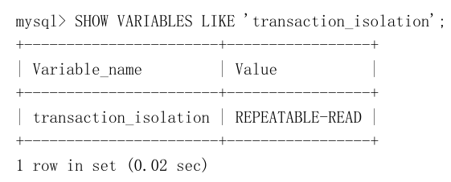
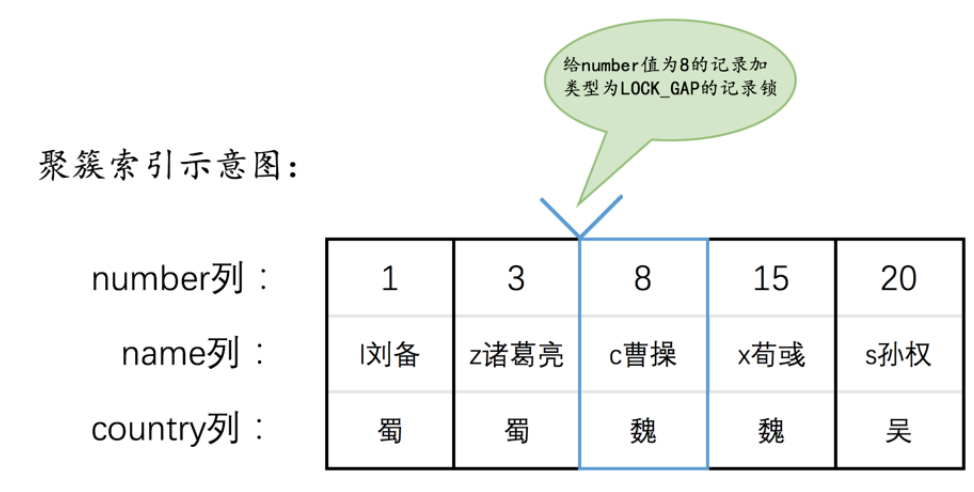
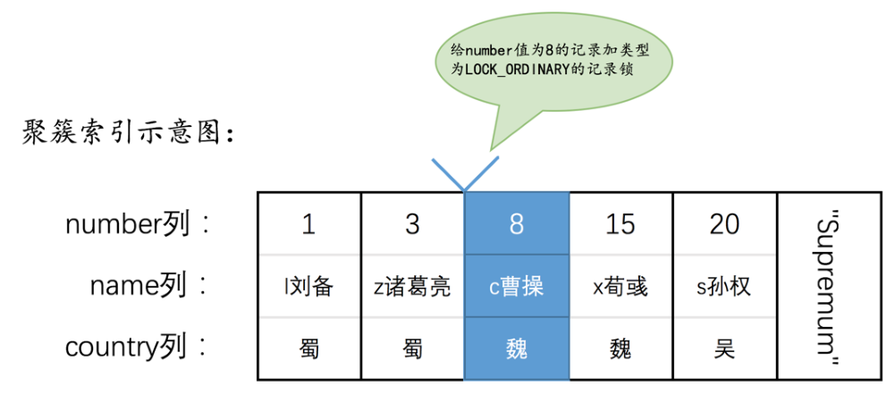

## 概要

​	我们知道mysql基本的存储单位是页，页中有多条行记录，也有不同类型的页，即使我们访问某个页中的一条数据时，也会把所属页的数据都加载到内存之中。这样后续的读取就不用到表空间io读取数据了。Mysql的缓存部分就是bufferpool。

## 事务简介

**事务就是让数据库操作符合现实世界中状态转换的规则。比如让数据库执行转账，有两条语句，a加上100，b减去100最终符合现实世界的预期；**

这种现象如何去描述呢？我们对事务性质进行分析和总结，一共有4大特性

### 事务特性

#### 原子性（Atomicity）

强调单个事务性质；

现实世界中转账操作是一个不可分割的操作，也就是说要么压根儿就没转，要么转账成功，不能存在中间的状态，也就是转了一半的这种情况；但是说着容易，做出来难；在现实世界中的一个不可分割的操作却可能对应着数据库世界若干条不同的操作，数据库中的一条操作也可能被分解成若干个步骤（比如先修改缓存页，之后再刷新到磁盘等），最要命的是在任何一个可能的时间都可能发生意想不到的错误（可能是数据库本身的错误，或者是操作系统错误，甚至是直接断电之类的）而使操作执行不下去。为了保证在数据库世界中某些操作的原子性，设计数据库的需要费一些心机来保证如果在执行操作的过程中发生了错误，把已经做了的操作恢复成没执行之前的样子；

#### 隔离性（Isolation）

强调多个事务对于单个事务的影响；

对于现实世界中状态转换对应的某些数据库操作来说，不仅要保证这些操作以 原子性 的方式执行完成，而且要保证其它的状态转换不会影响到本次状态转换，这个规则被称之为 隔离性 。这时设计数据库的大叔们就需要采取一些措施来让访问相同数据（上例中的A账户和B账户）的不同状态转换对应的数据库操作的执行顺序有一定规律；

不满足隔离性的案例为：

 


#### 一致性（Consistency）

强调最终的结果符合预期；如何保证一致性呢？有很多手段

* 数据库的约束条件

  比如余额字段必须要大于0，什么账户id不能重复，或者转账业务中，A、B账户的余额必须要保证总额不变

* 原子性和隔离性

  原子性 和 隔离性 都会对 一致性 产生影响，比如我们现实世界中转账操作完成后，有一个 一致性 需求就是参与转账的账户的总的余额是不变的。如果数据库不遵循 原子性 要求，也就是转了一半就不转了，也就是说给狗哥扣了钱而没给猫爷转过去，那最后就是不符合一致性需求的；类似的，如果数据库不遵循 隔
  离性 要求，就像我们前边唠叨 隔离性 时举的例子中所说的，最终狗哥账户中扣的钱和猫爷账户中涨的钱可能就不一样了，也就是说不符合 一致性 需求了。所以说，数据库某些操作的原子性和隔离性都是保证一致性的一种手段，在操作执行完成后保证符合所有既定的约束则是一种结果。那满足 原子性 和 隔离性 的操作一定就满足一致性 么？那倒也不一定，比如说狗哥要转账20元给猫爷，虽然在满足 原子性 和 隔离性 ，但转账完成了之后狗哥的账户的余额就成负的了，这显然是不满足 一致性 的。那不满足 原子性 和 隔离性 的操作就一定不满足一致性 么？这也不一定，只要最后的结果符合所有现实世界中的约束，那么就是符合 一致性 的

#### 持久性（Durability）

强调结果的时间特性，基本都要满足；

当把现实世界的状态转换映射到数据库世界时， 持久性 意味着该转换对应的数据库操作所修改的数据都应该在磁盘上保留下来，不论之后发生了什么事故，本次转换造成的影响都不应该被丢失掉；

当现实世界的一个状态转换完成后，这个转换的结果将永久的保留，这个规则被设计数据库的大叔们称为 持久性 。比方说狗哥向猫爷转账，当ATM机提示转账成功了，就意味着这次账户的状态转换完成了，狗哥就可以拔卡走人了。如果当狗哥走掉之后，银行又把这次转账操作给撤销掉，恢复到没转账之前的样子，那猫爷不就惨了，又得被砍死了，所以这个 持久性 是非常重要的

### 事务生命周期

**原子性（ Atomicity ）、 隔离性 （ Isolation ）、 一致性 （ Consistency ）和 持久性 （ Durability ）**这四个词对应的英文单词首字母提取出来就是 A 、 I 、 C 、 D ，稍微变换一下顺序可以组成一个完整的英文单词：ACID 。想必大家都是学过初高中英语的， ACID 是英文 酸 的意思，以后我们提到 ACID 这个词儿，大家就应该想到原子性、一致性、隔离性、持久性这几个规则。另外，设计数据库了方便起见，把需要保证 原子性 、 隔离性 、 一致性 和 持久性 的一个或多个数据库操作称之为一个 事务 （英文名是： transaction ）； 事务 是一个抽象的概念，它其实对应着一个或多个数据库操作，设计数据库的大叔根据这些操作
所执行的不同阶段把 事务 大致上划分成了这么几个状态：

* 活动的（active）

  事务对应的数据库操作正在执行过程中时，我们就说该事务处在 活动的 状态。

* 部分提交的（partially committed）

  当事务中的最后一个操作执行完成，但由于操作都在内存中执行，所造成的影响并没有刷新到磁盘时，我们就说该事务处在 部分提交的 状态。

* 失败的（failed）
  当事务处在 活动的 或者 部分提交的 状态时，可能遇到了某些错误（数据库自身的错误、操作系统错误或者直接断电等）而无法继续执行，或者人为的停止当前事务的执行，我们就说该事务处在 失败的 状态。

* 中止的（aborted）

  如果事务执行了半截而变为 失败的 状态，比如我们前边转账的事务，当狗哥账户的钱被扣除，但是猫爷账户的钱没有增加时遇到了错误，从而当前事务处在了 失败的 状态，那么就需要把已经修改的狗哥账户余额调整为未转账之前的金额，换句话说，就是要撤销失败事务对当前数据库造成的影响。书面一点的话，我们把这个撤销的过程称之为 回滚 。当 回滚 操作执行完毕时，也就是数据库恢复到了执行事务之前的状态，我们就说该事务处在了 中止的 状态。

* 提交的（committed）
  当一个处在 部分提交的 状态的事务将修改过的数据都同步到磁盘上之后，我们就可以说该事务处在了 提交的 状态

  

只有当事务处于提交的或者中止的状态时，一个事务的生命周期才算是结束了。对于已经提交的事务来说，该事务对数据库所做的修改将永久生效，对于处于中止状态的事务，该事务对数据库所做的所有修改都会被回滚到没执行该事务之前的状态

### mysql事务的语法

#### 开启事务

* BEGIN [WORK];

* START TRANSACTION;

  后边跟随几个 修饰符

  * READ ONLY

    标识当前事务是一个只读事务，也就是属于该事务的数据库操作只能读取数据，而不能修改数据

  * READ WRITE

    标识当前事务是一个读写事务，也就是属于该事务的数据库操作既可以读取数据，也可以修改数据

  * WITH CONSISTENT SNAPSHOT

    启动一致性读

**PS：READ ONLY 和 READ WRITE 是用来设置所谓的事务 访问模式 的，就是以只读还是读写的方式来访问数据库中的数据，一个事务的访问模式不能同时既设置为 只读 的也设置为 读写 的，所以我们不能同时把 READ ONLY 和 READ WRITE 放到 START TRANSACTION 语句后边。另外，如果我们不显式指定事务的访问模式，那么该事务的访问模式就是 读写 模式**

#### 提交事务

开启事务之后就可以继续写需要放到该事务中的语句了，当最后一条语句写完了之后，我们就可以提交该事务了，提交的语句也很简单：

```
COMMIT [WORK]
```

完整的过程就是这样：

```
mysql> BEGIN;
Query OK, 0 rows affected (0.00 sec)
mysql> UPDATE account SET balance = balance - 10 WHERE id = 1;
Query OK, 1 row affected (0.02 sec)
Rows matched: 1 Changed: 1 Warnings: 0
mysql> UPDATE account SET balance = balance + 10 WHERE id = 2;
Query OK, 1 row affected (0.00 sec)
Rows matched: 1 Changed: 1 Warnings: 0
mysql> COMMIT;
Query OK, 0 rows affected (0.00 sec)
```

#### 手动中止事务

可以手动的使用下边这个语句来将数据库恢复到事务执行之前的样子：

```
ROLLBACK [WORK]
```

ROLLBACK 语句就代表中止并回滚一个事务，后边的 WORK 可有可无类似的。ROLLBACK 语句进行回滚，完整的过程就是这样：

```
mysql> BEGIN;
Query OK, 0 rows affected (0.00 sec)
mysql> UPDATE account SET balance = balance - 10 WHERE id = 1;
Query OK, 1 row affected (0.00 sec)
Rows matched: 1 Changed: 1 Warnings: 0
mysql> UPDATE account SET balance = balance + 1 WHERE id = 2;
Query OK, 1 row affected (0.00 sec)
Rows matched: 1 Changed: 1 Warnings: 0
mysql> ROLLBACK;
Query OK, 0 rows affected (0.00 sec)
```

ROLLBACK 语句是我们程序员手动的去回滚事务时才去使用的，如果事务在执行过程中遇到了某些错误而无法继续执行的话，事务自身会自动的回滚；

#### 事务存储引擎

ySQL 中并不是所有存储引擎都支持事务的功能，目前只有 InnoDB 和 NDB 存储引擎支持（NDB存储引擎不是我们的重点），如果某个事务中包含了修改使用不支持事务的存储引擎的表，那么对该使用不支持事务的存储引擎的表所做的修改将无法进行回滚。比方说我们有两个表， tbl1 使用支持事务的存储引擎 InnoDB ， tbl2 使用不支持事务的存储引擎 MyISAM，效果就是插入了然后回滚，插入的数据没有变化；

#### 自动提交

MySQL 中有一个系统变量 autocommit 

它的默认值为 ON ，也就是说默认情况下，如果我们不显式的使用 START TRANSACTION 或者 BEGIN 语句
开启一个事务，那么每一条语句都算是一个独立的事务，这种特性称之为事务的 自动提交；

关闭这种 自动提交 的功能，可以使用下边两种方法之一：

* 显式的的使用 START TRANSACTION 或者 BEGIN 语句开启一个事务。

  这样在本次事务提交或者回滚前会暂时关闭掉自动提交的功能。

* 把系统变量 autocommit 的值设置为 OFF ，就像这样：

  ```
  SET autocommit = OFF;
  ```

  这样的话，我们写入的多条语句就算是属于同一个事务了，直到我们显式的写出 COMMIT 语句来把这个事务提交掉，或者显式的写出 ROLLBACK 语句来把这个事务回滚掉

#### 隐式提交

START TRANSACTION 或者 BEGIN 语句开启了一个事务，或者把系统变量 autocommit 的值设置为 OFF时，事务就不会进行 自动提交 ，但是如果我们输入了某些语句之后就会 悄悄的 提交掉，就像我们输入了COMMIT 语句了一样，这种因为某些特殊的语句而导致事务提交的情况称为 隐式提交 ，这些会导致事务隐式提交的语句包括：

* 定义或修改数据库对象的数据定义语言（Data definition language，缩写为： DDL ）。

  所谓的数据库对象，指的就是 数据库 、 表 、 视图 、 存储过程 等等这些东西。当我们使用 CREATE 、ALTER 、 DROP 等语句去修改这些所谓的数据库对象时，就会隐式的提交前边语句所属于的事务，就像这样：

  ```
  BEGIN;
  SELECT ... # 事务中的一条语句
  UPDATE ... # 事务中的一条语句
  ... # 事务中的其它语句
  CREATE TABLE ... # 此语句会隐式的提交前边语句所属于的事务
  ```

* 隐式使用或修改 mysql 数据库中的表

  当我们使用 ALTER USER 、 CREATE USER 、 DROP USER 、 GRANT 、 RENAME USER 、 REVOKE 、 SET PASSWORD 等语句时也会隐式的提交前边语句所属于的事务

* 事务控制或关于锁定的语句

  当我们在一个事务还没提交或者回滚时就又使用 START TRANSACTION 或者 BEGIN 语句开启了另一个事务时，会隐式的提交上一个事务，比如这样：

  ```
  BEGIN;
  SELECT ... # 事务中的一条语句
  UPDATE ... # 事务中的一条语句
  ... # 事务中的其它语句
  BEGIN; # 此语句会隐式的提交前边语句所属于的事务
  ```

* 当前的 autocommit 系统变量的值为 OFF ，我们手动把它调为 ON 时，也会隐式的提交前边语句所属的事务

  或者使用 LOCK TABLES 、 UNLOCK TABLES 等关于锁定的语句也会隐式的提交前边语句所属的事务

* 加载数据的语句

  比如我们使用 LOAD DATA 语句来批量往数据库中导入数据时，也会隐式的提交前边语句所属的事务

*  MySQL 复制的一些语句

  使用 START SLAVE 、 STOP SLAVE 、 RESET SLAVE 、 CHANGE MASTER TO 等语句时也会隐式的提交前边语句所属的事务

* 其它的一些语句

  使用 ANALYZE TABLE 、 CACHE INDEX 、 CHECK TABLE 、 FLUSH 、 LOAD INDEX INTO CACHE 、 OPTIMIZE TABLE 、 REPAIR TABLE 、 RESET 等语句也会隐式的提交前边语句所属的事务

#### 保存点

如果你开启了一个事务，并且已经敲了很多语句，忽然发现上一条语句有点问题，你只好使用 ROLLBACK 语句来让数据库状态恢复到事务执行之前的样子，然后一切从头再来，总有一种一夜回到解放前的感觉。所以一个 保存点 （英文： savepoint ）的概念，就是在事务对应的数据库语句中打几个点，我们在调用 ROLLBACK 语句时可以指定会滚到哪个点，而不是回到最初的原点。定义保存点的语法如下

```
SAVEPOINT 保存点名称;
```

当我们想回滚到某个保存点时，可以使用下边这个语句（下边语句中的单词 WORK 和 SAVEPOINT 是可有可无的）：

```
ROLLBACK [WORK] TO [SAVEPOINT] 保存点名称;
```

不过如果 ROLLBACK 语句后边不跟随保存点名称的话，会直接回滚到事务执行之前的状态。

如果我们想删除某个保存点，可以使用这个语句：

```
RELEASE SAVEPOINT 保存点名称;
```


## 事务隔离级别

当同一条记录，多个客户端同时访问的时候，就需要隔离级别了，一个事务在访问的时候，另一个事务应该排队。但是直接隔离就会导致性能不高。所以就有了事务的隔离级别了。

**PS：事务有一个称之为 隔离性 的特性，理论上在某个事务对某个数据进行访问时，其他事务应该进行排队，当该事务提交之后，其他事务才可以继续访问这个数据。但是这样子的话对性能影响太大，我们既想保持事务的 隔离性 ，又想让服务器在处理访问同一数据的多个事务时性能尽量高些，鱼和熊掌不可得兼，舍一部分 隔离性 而取性能者也**

### Mysql的事务问题

* 脏写

​        Update table set name = “xxx1” where uid = 1;

​		Update table set name = “xxx2” where uid = 1;rollback;

​		如何两条语句同时执行，则有可能第一条语句被回滚了。但是它的客户端确实已经提交成功了

* 脏读

​		一个事务读到了另一个未提交事务修改过的数据，那么这就是脏读

* 不可重复读

​			一个事务只能读到另一个已经提交的事务修改过的数据，并且其他事务每对该数据进行一次修改并提交后，该事务都能查询得到最		新值，那就意味着发生了 不可重复读。意思就是，第一个事务可以读到其它事务的最新值，这种现象被称为不可重复读。

​		举例：

​				有一个大事务，要执行很长时间；另外有一堆小事务，很快就执行完成。

​				大事务来回查一个数据

​				一堆小事务串行改这个数据，改完之后提交成功。

​				大事务虽然读到的也是小事务提交之后的内容，但是这个数据经常被小事务改来改去。

​				想避免不可重复读，可以给加共享锁（即读锁），加了共享锁之后，任何事务就不得加排他锁（即写锁）了，这样就完美解决了				不可重复读的问题。

​				设置共享读锁也就是隔离级别提高到 REPETABLE_READ 可重读，这也是 MySQL 的默认隔离级别。

​				至于危害也很简单，程序里面一堆 if 怎样再怎样，每次读的东西都不一样，你到底想怎样

* 幻读

​			一个事务先根据某些条件查询出一些记录，之后另一个事务又向表中插入了符合这些条件的记录，原先的事务再次按照该条件查询		时，能把另一个事务插入的记录也读出来。

​			幻读只是重点强调了读取到了之前读取没有获取到的记录

### 标准的隔离级别

​	上面的的问题严重性可以来排个序，有些是很严重的，有些是不那么严重的问题严重性从大到小排序：

​	脏写>脏读>不可重复读>幻读

为了解决上面的问题，又能兼顾一定的性能。所以就设定了隔离级别

- 未提交读，可能出现脏读，不可重复读、幻读
- 已提交读，可能出现不可重复读、幻读
- 可重复读，可能出现幻读
- 可串行化，都不会发生

脏写在mysql内部都解决掉了，这几种隔离级别都不会发生。

### Mysql隔离级别

​	不同的数据库产品对隔离级别的支持不一样，oracle支持已提交读和串行化，mysql支持全部的四种，但是高版本已经解决了可重复读可能出现幻读的问题，且它的默认隔离级别为可重复读。Mysql可以通过配置参数或者session去更改它的隔离级别。具体的方式可以参考相应的文档。MySQL 的默认隔离级别为 REPEATABLE READ

如何设置事务的隔离级别呢，可以使用如下的语句

```
SET [GLOBAL|SESSION] TRANSACTION ISOLATION LEVEL level;
```

其中的 level 可选值有4个：

```
level: {
REPEATABLE READ
| READ COMMITTED
| READ UNCOMMITTED
| SERIALIZABLE
}
```

设置事务的隔离级别的语句中，在 SET 关键字后可以放置 GLOBAL 关键字、 SESSION 关键字或者什么都不放，这样会对不同范围的事务产生不同的影响，具体如下：

* 使用 GLOBAL 关键字（在全局范围影响）：

  * 只对执行完该语句之后产生的会话起作用。

    当前已经存在的会话无效。

* 使用 SESSION 关键字（在会话范围影响）

  * 对当前会话的所有后续的事务有效
  * 该语句可以在已经开启的事务中间执行，但不会影响当前正在执行的事务。
  * 如果在事务之间执行，则对后续的事务有效

* 上述两个关键字都不用（只对执行语句后的下一个事务产生影响）：

  * 只对当前会话中下一个即将开启的事务有效。
  * 下一个事务执行完后，后续事务将恢复到之前的隔离级别。
  * 该语句不能在已经开启的事务中间执行，会报错的。

​	如果我们在服务器启动时想改变事务的默认隔离级别，可以修改启动参数 transaction-isolation 的值，比方说我们在启动服务器时指定了 --transaction-isolation=SERIALIZABLE ，那么事务的默认隔离级别就从原来的REPEATABLE READ 变成了 SERIALIZABLE

​	想要查看当前会话默认的隔离级别可以通过查看系统变量 transaction_isolation 的值来确定：

 

## Mvcc原理

### 版本链

我们前边说过，对于使用 InnoDB 存储引擎的表来说，它的聚簇索引记录中都包含两个必要的隐藏列（ row_id 并不是必要的，我们创建的表中有主键或者非NULL的UNIQUE键时都不会包含 row_id 列）：

* trx_id ：每次一个事务对某条聚簇索引记录进行改动时，都会把该事务的 事务id 赋值给 trx_id 隐藏列。
* roll_pointer ：每次对某条聚簇索引记录进行改动时，都会把旧的版本写入到 undo日志 中，然后这个隐藏列就相当于一个指针，可以通过它来找到该记录修改前的信息。

PS：实际上insert undo只在事务回滚时起作用，当事务提交后，该类型的undo日志就没用了，它占用的Undo Log Segment也会被系统回收（也就是该undo日志占用的Undo页面链表要么被重用，要么被释放）。虽然真正的insert undo日志占用的存储空间被释放了，但是roll_pointer的值并不会被清除，roll_po
inter属性占用7个字节，第一个比特位就标记着它指向的undo日志的类型，如果该比特位的值为1时，就代表着它zhi向的undo日志类型为insert undo。所以我们之后在画图时都会把insert undo给去掉

假设之后两个 事务id 分别为 100 、 200 的事务对这条记录进行 UPDATE 操作，操作流程如下：

 

每次对记录进行改动，都会记录一条 undo日志 ，每条 undo日志 也都有一个 roll_pointer 属性（ INSERT 操作对应的 undo日志 没有该属性，因为该记录并没有更早的版本），可以将这些 undo日志 都连起来，串成一个链表，所以现在的情况就像下图一样：

 

​	对该记录每次更新后，都会将旧值放到一条 undo日志 中，就算是该记录的一个旧版本，随着更新次数的增多，所有的版本都会被 roll_pointer 属性连接成一个链表，我们把这个链表称之为 版本链 ，**版本链的头节点就是当前记录最新的值**。另外，每个版本中还包含生成该版本时对应的 事务id ，这个信息很重要，我们稍后就会用到

### ReadView

对于使用 READ UNCOMMITTED 隔离级别的事务来说，由于可以读到未提交事务修改过的记录，所以直接读取记录的最新版本就好了；对于使用 SERIALIZABLE 隔离级别的事务来说，设计 InnoDB 的大叔规定使用加锁的方式来访问记录（；对于使用 READ COMMITTED 和 REPEATABLE READ 隔离级别的事务来说，都必须保证读到已经提交了的事务修改过的记录，也就是说假如另一个事务已经修改了记录但是尚未提交，是不能直接读取最新版本的记录的，核心问题就是：需要判断一下版本链中的哪个版本是当前事务可见的。为此提出了一个 ReadView 的概念，这个 ReadView 中主要包含4个比较重要的内容：

* m_ids ：表示在生成 ReadView 时当前系统中活跃的读写事务的 事务id 列表。
* min_trx_id ：表示在生成 ReadView 时当前系统中活跃的读写事务中最小的 事务id ，也就是 m_ids 中的最小值。
* max_trx_id ：表示生成 ReadView 时系统中应该分配给下一个事务的 id 值。
  **注意max_trx_id并不是m_ids中的最大值，事务id是递增分配的。比方说现在有id为1，2，3这三个事务，之后id为3的事务提交了。那么一个新的读事务在生成ReadView时，m_ids就包括1和2，min_trx_id的值就是1，max_trx_id的值就是4。**
* creator_trx_id ：表示生成该 ReadView 的事务的 事务id

**PS：我们前边说过，只有在对表中的记录做改动时（执行INSERT、DELETE、UPDATE这些语句时）才会为事务分配事务id，否则在一个只读事务中的事务id值都默认为0**

有了这个 ReadView ，这样在访问某条记录时，只需要按照下边的步骤判断记录的某个版本是否可见：

* 如果被访问版本的 trx_id 属性值与 ReadView 中的 creator_trx_id 值相同，意味着当前事务在访问它自己修改过的记录，所以该版本可以被当前事务访问。
* 如果被访问版本的 trx_id 属性值小于 ReadView 中的 min_trx_id 值，表明生成该版本的事务在当前事务生成 ReadView 前已经提交，所以该版本可以被当前事务访问。
* 如果被访问版本的 trx_id 属性值大于 ReadView 中的 max_trx_id 值，表明生成该版本的事务在当前事务生成 ReadView 后才开启，所以该版本不可以被当前事务访问。
* 如果被访问版本的 trx_id 属性值在 ReadView 的 min_trx_id 和 max_trx_id 之间，那就需要判断一下trx_id 属性值是不是在 m_ids 列表中，如果在，说明创建 ReadView 时生成该版本的事务还是活跃的，该版本不可以被访问；如果不在，说明创建 ReadView 时生成该版本的事务已经被提交，该版本可以被访问

如果某个版本的数据对当前事务不可见的话，那就顺着版本链找到下一个版本的数据，继续按照上边的步骤判断可见性，依此类推，直到版本链中的最后一个版本。如果最后一个版本也不可见的话，那么就意味着该条记录对该事务完全不可见，查询结果就不包含该记录；

在 MySQL 中，READ COMMITTED 和 REPEATABLE READ 隔离级别的的一个非常大的区别就是它们生成ReadView的时机不同。我们还是以表 hero 为例来，假设现在表 hero 中只有一条由 事务id 为 80 的事务插入的一条记录：

 

READ COMMITTED 和 REPEATABLE READ 所谓的生成ReadView的时机不同

#### READ COMMITTED

比方说现在系统里有两个 事务id 分别为 100 、 200 的事务在执行：

```
# Transaction 100
BEGIN;
UPDATE hero SET name = '关羽' WHERE number = 1;
UPDATE hero SET name = '张飞' WHERE number = 1;
# Transaction 200
BEGIN;
# 更新了一些别的表的记录
...
```

PS：事务执行过程中，只有在第一次真正修改记录时（比如使用INSERT、DELETE、UPDATE语句），才会被分配一个单独的事务id，这个事务id是递增的。所以我们才在Transaction 200中更新一些别的表的记录，目的是让它分配事务id

此刻，表 hero 中 number 为 1 的记录得到的版本链表如下所示： 

 

假设现在有一个使用 READ COMMITTED 隔离级别的事务开始执行：

```
# 使用READ COMMITTED隔离级别的事务
BEGIN;
# SELECT1：Transaction 100、200未提交
SELECT * FROM hero WHERE number = 1; # 得到的列name的值为'刘备'
```

这个 SELECT1 的执行过程如下：

* 在执行 SELECT 语句时会先生成一个 ReadView ， ReadView 的 m_ids 列表的内容就是 [100, 200] ，min_trx_id 为 100 ， max_trx_id 为 201 ， creator_trx_id 为 0 。
* 然后从版本链中挑选可见的记录，从图中可以看出，最新版本的列 name 的内容是 '张飞' ，该版本的trx_id 值为 100 ，在 m_ids 列表内，所以不符合可见性要求，根据 roll_pointer 跳到下一个版本。
* 下一个版本的列 name 的内容是 '关羽' ，该版本的 trx_id 值也为 100 ，也在 m_ids 列表内，所以也不符合要求，继续跳到下一个版本。
* 下一个版本的列 name 的内容是 '刘备' ，该版本的 trx_id 值为 80 ，小于 ReadView 中的 min_trx_id 值100 ，所以这个版本是符合要求的，最后返回给用户的版本就是这条列 name 为 '刘备' 的记录

之后，我们把 事务id 为 100 的事务提交一下，就像这样：

```
# Transaction 100
BEGIN;
UPDATE hero SET name = '关羽' WHERE number = 1;
UPDATE hero SET name = '张飞' WHERE number = 1;
COMMIT;
```

然后再到 事务id 为 200 的事务中更新一下表 hero 中 number 为 1 的记录： 

 

然后再到刚才使用 READ COMMITTED 隔离级别的事务中继续查找这个 number 为 1 的记录，如下：

```
# 使用READ COMMITTED隔离级别的事务
BEGIN;
# SELECT1：Transaction 100、200均未提交
SELECT * FROM hero WHERE number = 1; # 得到的列name的值为'刘备'
# SELECT2：Transaction 100提交，Transaction 200未提交
SELECT * FROM hero WHERE number = 1; # 得到的列name的值为'张飞'
```

这个 SELECT2 的执行过程如下：

* 在执行 SELECT 语句时会又会单独生成一个 ReadView ，该 ReadView 的 m_ids 列表的内容就是 [200] （ 事务id 为 100 的那个事务已经提交了，所以再次生成快照时就没有它了）， min_trx_id 为 200 ，
  max_trx_id 为 201 ， creator_trx_id 为 0 。
* 然后从版本链中挑选可见的记录，从图中可以看出，最新版本的列 name 的内容是 '诸葛亮' ，该版本的trx_id 值为 200 ，在 m_ids 列表内，所以不符合可见性要求，根据 roll_pointer 跳到下一个版本。
* 下一个版本的列 name 的内容是 '赵云' ，该版本的 trx_id 值为 200 ，也在 m_ids 列表内，所以也不符合要求，继续跳到下一个版本。
* 下一个版本的列 name 的内容是 '张飞' ，该版本的 trx_id 值为 100 ，小于 ReadView 中的 min_trx_id 值200 ，所以这个版本是符合要求的，最后返回给用户的版本就是这条列 name 为 '张飞' 的记录

以此类推，如果之后 事务id 为 200 的记录也提交了，再此在使用 READ COMMITTED 隔离级别的事务中查询表hero 中 number 值为 1 的记录时，得到的结果就是 '诸葛亮' 了，具体流程我们就不分析了。

**总结一下就是：使用READ COMMITTED隔离级别的事务在每次查询开始时都会生成一个独立的ReadView**

#### REPEATABLE READ

在第一次读取数据时生成一个ReadView

对于使用 REPEATABLE READ 隔离级别的事务来说，只会在第一次执行查询语句时生成一个 ReadView ，之后的查询就不会重复生成了。我们还是用例子看一下是什么效果。比方说现在系统里有两个 事务id 分别为 100 、 200 的事务在执行：

```
# Transaction 100
BEGIN;
UPDATE hero SET name = '关羽' WHERE number = 1;
UPDATE hero SET name = '张飞' WHERE number = 1;
# Transaction 200
BEGIN;
# 更新了一些别的表的记录
...
```

此刻，表 hero 中 number 为 1 的记录得到的版本链表如下所示：

 

假设现在有一个使用 REPEATABLE READ 隔离级别的事务开始执行：

```
# 使用REPEATABLE READ隔离级别的事务
BEGIN;
# SELECT1：Transaction 100、200未提交
SELECT * FROM hero WHERE number = 1; # 得到的列name的值为'刘备'
```

这个 SELECT1 的执行过程如下：

* 在执行 SELECT 语句时会先生成一个 ReadView ， ReadView 的 m_ids 列表的内容就是 [100, 200] ，
  min_trx_id 为 100 ， max_trx_id 为 201 ， creator_trx_id 为 0 。
* 然后从版本链中挑选可见的记录，从图中可以看出，最新版本的列 name 的内容是 '张飞' ，该版本的trx_id 值为 100 ，在 m_ids 列表内，所以不符合可见性要求，根据 roll_pointer 跳到下一个版本。
* 下一个版本的列 name 的内容是 '关羽' ，该版本的 trx_id 值也为 100 ，也在 m_ids 列表内，所以也不符合要求，继续跳到下一个版本。
* 下一个版本的列 name 的内容是 '刘备' ，该版本的 trx_id 值为 80 ，小于 ReadView 中的 min_trx_id 值100 ，所以这个版本是符合要求的，最后返回给用户的版本就是这条列 name 为 '刘备' 的记录。

之后，我们把 事务id 为 100 的事务提交一下，就像这样：

```
# Transaction 100
BEGIN;
UPDATE hero SET name = '关羽' WHERE number = 1;
UPDATE hero SET name = '张飞' WHERE number = 1;
COMMIT;
```

然后再到 事务id 为 200 的事务中更新一下表 hero 中 number 为 1 的记录：

```
# Transaction 200
BEGIN;
# 更新了一些别的表的记录
...
UPDATE hero SET name = '赵云' WHERE number = 1;
UPDATE hero SET name = '诸葛亮' WHERE number = 1;
```

此刻，表 hero 中 number 为 1 的记录的版本链就长这样：

 

然后再到刚才使用 REPEATABLE READ 隔离级别的事务中继续查找这个 number 为 1 的记录，如下：

```
# 使用REPEATABLE READ隔离级别的事务
BEGIN;
# SELECT1：Transaction 100、200均未提交
SELECT * FROM hero WHERE number = 1; # 得到的列name的值为'刘备'
# SELECT2：Transaction 100提交，Transaction 200未提交
SELECT * FROM hero WHERE number = 1; # 得到的列name的值仍为'刘备'
```

这个 SELECT2 的执行过程如下：

* 因为当前事务的隔离级别为 REPEATABLE READ ，而之前在执行 SELECT1 时已经生成过 ReadView 了，所以此时直接复用之前的 ReadView ，之前的 ReadView 的 m_ids 列表的内容就是 [100, 200] ， min_trx_id 为
  100 ， max_trx_id 为 201 ， creator_trx_id 为 0 。
* 然后从版本链中挑选可见的记录，从图中可以看出，最新版本的列 name 的内容是 '诸葛亮' ，该版本的trx_id 值为 200 ，在 m_ids 列表内，所以不符合可见性要求，根据 roll_pointer 跳到下一个版本。
* 下一个版本的列 name 的内容是 '赵云' ，该版本的 trx_id 值为 200 ，也在 m_ids 列表内，所以也不符合要求，继续跳到下一个版本。
* 下一个版本的列 name 的内容是 '张飞' ，该版本的 trx_id 值为 100 ，而 m_ids 列表中是包含值为 100 的事务id 的，所以该版本也不符合要求，同理下一个列 name 的内容是 '关羽' 的版本也不符合要求。继续跳到下一个版本。
* 下一个版本的列 name 的内容是 '刘备' ，该版本的 trx_id 值为 80 ，小于 ReadView 中的 min_trx_id 值100 ，所以这个版本是符合要求的，最后返回给用户的版本就是这条列 c 为 '刘备' 的记录。

也就是说两次 SELECT 查询得到的结果是重复的，记录的列 c 值都是 '刘备' ，这就是 可重复读 的含义。如果我们之后再把 事务id 为 200 的记录提交了，然后再到刚才使用 REPEATABLE READ 隔离级别的事务中继续查找这个 number 为 1 的记录，得到的结果还是 '刘备' ，具体执行过程大家可以自己分析一下;

### purge

我们说 insert undo 在事务提交之后就可以被释放掉了，而 update undo 由于还需要支持 MVCC ，不能立即删除掉。为了支持 MVCC ，对于 delete mark 操作来说，仅仅是在记录上打一个删除标记，并没有真正将它删除掉

随着系统的运行，在确定系统中包含最早产生的那个 ReadView 的事务不会再访问某些 update undo日志 以及被
打了删除标记的记录后，有一个后台运行的 purge线程 会把它们真正的删除掉

### 小结

​	从上边的描述中我们可以看出来，所谓的 MVCC （Multi-Version Concurrency Control ，多版本并发控制）指的就是在使用 READ COMMITTD 、 REPEATABLE READ 这两种隔离级别的事务在执行普通的 SEELCT 操作时访问记录的版本链的过程，这样子可以使不同事务的 读-写 、 写-读 操作并发执行，从而提升系统性能。

​	**READ COMMITTD 、REPEATABLE READ 这两个隔离级别的一个很大不同就是：生成ReadView的时机不同，READ COMMITTD在每一次进行普通SELECT操作前都会生成一个ReadView，而REPEATABLE READ只在第一次进行普通SELECT操作前生成一个ReadView，之后的查询操作都重复使用这个ReadView就好了**

**PS：我们之前说执行DELETE语句或者更新主键的UPDATE语句并不会立即把对应的记录完全从页面中删除，而**
**是执行一个所谓的delete mark操作，相当于只是对记录打上了一个删除标志位，这主要就是为MVCC服务的，大家可以对比上边举的例子自己试想一下怎么使用。另外，所谓的MVCC只是在我们进行普通的SEELCT查询时才生效，截止到目前我们所见的所有SELECT语句都算是普通的查询**

## 锁

事务并发执行时可能带来的各种问题，并发事务访问相同记录的情况大致可以划分为3种

### 并发事务访问

#### 读-读 

即并发事务相继读取相同的记录

读取操作本身不会对记录有一毛钱影响，并不会引起什么问题，所以允许这种情况的发生

#### 写-写

即并发事务相继对相同的记录做出改动

在这种情况下会发生 脏写 的问题，任何一种隔离级别都不允许这种问题的发生。所以在多个未提交事务相继对一条记录做改动时，需要让它们排队执行，这个排队的过程其实是通过 锁 来实现的。这个所谓的 锁 其实是一个内存中的结构，在事务执行前本来是没有锁的，也就是说一开始是没有 锁结构 和 记录进行关联的

当一个事务想对这条记录做改动时，首先会看看内存中有没有与这条记录关联的 锁结构 ，当没有的时候就
会在内存中生成一个 锁结构 与之关联。比方说事务 T1 要对这条记录做改动，就需要生成一个 锁结构 与之
关联：

 

其实在 锁结构 里有很多信息，不过为了简化理解，我们现在只把两个比较重要的属性拿了出来：

* trx信息 ：代表这个锁结构是哪个事务生成的。
* is_waiting ：代表当前事务是否在等待

当事务 T1 改动了这条记录后，就生成了一个 锁结构 与该记录关联，因为之前没有别的事务为这条记录加锁，所以 is_waiting 属性就是 false ，我们把这个场景就称之为获取锁成功，或者加锁成功，然后就可以继续执行操作了

在事务 T1 提交之前，另一个事务 T2 也想对该记录做改动，那么先去看看有没有 锁结构 与这条记录关联，发现有一个 锁结构 与之关联后，然后也生成了一个 锁结构 与这条记录关联，不过 锁结构 的 is_waiting 属性值为 true ，表示当前事务需要等待，我们把这个场景就称之为**获取锁失败，或者加锁失败，或者没有成功的获取到锁**，画个图表示就是这样：

 

在事务 T1 提交之后，就会把该事务生成的 锁结构 释放掉，然后看看还有没有别的事务在等待获取锁，发现了事务 T2 还在等待获取锁，所以把事务 T2 对应的锁结构的 is_waiting 属性设置为 false ，然后把该事务对应的线程唤醒，让它继续执行，此时事务 T2 就算获取到锁了。效果图就是这样：

 


总结一下后续内容中可能用到的几种说法，以免大家混淆：

* 不加锁

  意思就是不需要在内存中生成对应的 锁结构 ，可以直接执行操作。

* 获取锁成功，或者加锁成功

  意思就是在内存中生成了对应的 锁结构 ，而且锁结构的 is_waiting 属性为 false ，也就是事务可以继续执行操作。

* 获取锁失败，或者加锁失败，或者没有获取到锁

  意思就是在内存中生成了对应的 锁结构 ，不过锁结构的 is_waiting 属性为 true ，也就是事务需要等待，不可以继续执行操作

#### 读-写

也就是一个事务进行读取操作，另一个进行改动操作

这种情况下可能发生 脏读 、 不可重复读 、 幻读 的问题

**PS：幻读问题的产生是因为某个事务读了一个范围的记录，之后别的事务在该范围内插入了新记录，该事务再次读取该范围的记录时，可以读到新插入的记录，所以幻读问题准确的说并不是因为读取和写入一条相同记录而产生的，这一点要注意一下**

SQL标准 规定不同隔离级别下可能发生的问题不一样：

- 在 READ UNCOMMITTED 隔离级别下， 脏读 、 不可重复读 、 幻读 都可能发生。
- 在 READ COMMITTED 隔离级别下， 不可重复读 、 幻读 可能发生， 脏读 不可以发生。
- 在 REPEATABLE READ 隔离级别下， 幻读 可能发生， 脏读 和 不可重复读 不可以发生。
- 在 SERIALIZABLE 隔离级别下，上述问题都不可以发生

不过各个数据库厂商对 SQL标准 的支持都可能不一样，与 SQL标准 不同的一点就是， MySQL 在REPEATABLE READ 隔离级别实际上就已经解决了 幻读 问题

### 解决并发方案

怎么解决 脏读 、 不可重复读 、 幻读呢？

* 方案一：读操作利用多版本并发控制（ MVCC ），写操作进行 加锁

  就是通过生成一个 ReadView ，然后通过 ReadView 找到符合条件的记录版本（历史版本是由 undo日志 构建的），其实就像是在生成 ReadView 的那个时刻做了一次时间静止（就像用相机拍了一个快照），查询语句只能读到在生成 ReadView 之前已提交事务所做的更改，在生成 ReadView 之前未提交的事务或者之后才开启的事务所做的更改是看不到的。而写操作肯定针对的是最新版本的记录，读记录的历史版本和改动记录的最新版本本身并不冲突，也就是采用
  MVCC 时， 读-写 操作并不冲突

* 方案二：读、写操作都采用 加锁 的方式

  如果我们的一些业务场景不允许读取记录的旧版本，而是每次都必须去读取记录的最新版本，比方在银行存款的事务中，你需要先把账户的余额读出来，然后将其加上本次存款的数额，最后再写到数据库中。在将账户余额读取出来后，就不想让别的事务再访问该余额，直到本次存款事务执行完成，其他事务才可以访问账户的余额。这样在读取记录的时候也就需要对其进行 加锁 操作，这样也就意味着 读 操作和 写 操作也像 写-写 操作那样排队执行

  **PS：我们说脏读的产生是因为当前事务读取了另一个未提交事务写的一条记录，如果另一个事务在写记录的时候就给这条记录加锁，那么当前事务就无法继续读取该记录了，所以也就不会有脏读问题的产生了。不可重复读的产生是因为当前事务先读取一条记录，另外一个事务对该记录做了改动之后并提交之后，当前事务再次读取时会获得不同的值，如果在当前事务读取记录时就给该记录加锁，那么另一个事务就无法修改该记录，自然也不会发生不可重复读了。我们说幻读问题的产生是因为当前事务读取了一个范围的记录，然后另外的事务向该范围内插入了新记录，当前事务再次读取该范围的记录时发现了新插入的新记录，我们把新插入的那些记录称之为幻影记录。采用加锁的方式解决幻读问题就有那么一丢丢麻烦了，因为当前事务在第一次读取记录时那些幻影记录并不存在，所以读取的时候加锁就有点尴尬 —— 因为你并不知道给谁加锁**

  很明显，采用 MVCC 方式的话， 读-写 操作彼此并不冲突，性能更高，采用 加锁 方式的话， 读-写 操作彼此需要排队执行，影响性能。一般情况下我们当然愿意采用 MVCC 来解决 读-写 操作并发执行的问题，但是业务在某些特殊情况下，要求必须采用 加锁 的方式执行，那也是没有办法的事

#### 一致性读

事务利用 MVCC 进行的读取操作称之为 一致性读 ，或者 一致性无锁读 ，有的地方也称之为 快照读 。所有普通的 SELECT 语句（ plain SELECT ）在 READ COMMITTED 、 REPEATABLE READ 隔离级别下都算是 一致性读 ，比方说：

```
SELECT * FROM t;
SELECT * FROM t1 INNER JOIN t2 ON t1.col1 = t2.col2
```

一致性读 并不会对表中的任何记录做 加锁 操作，其他事务可以自由的对表中的记录做改动。

#### 锁定读

##### 共享锁和独占锁

我们前边说过，并发事务的 读-读 情况并不会引起什么问题，不过对于 写-写 、 读-写 或 写-读 这些情况可能会引起一些问题，需要使用 MVCC 或者 加锁 的方式来解决它们。在使用 加锁 的方式解决问题时，由于既要允许 读-读 情况不受影响，又要使 写-写 、 读-写 或 写-读 情况中的操作相互阻塞，所以设计 MySQL 的大叔给锁分了个类：

* 共享锁 ，英文名： Shared Locks ，简称 S锁 。在事务要读取一条记录时，需要先获取该记录的 S锁 。
* 独占锁 ，也常称 排他锁 ，英文名： Exclusive Locks ，简称 X锁 。在事务要改动一条记录时，需要先获取该记录的 X锁 。

假如事务 T1 首先获取了一条记录的 S锁 之后，事务 T2 接着也要访问这条记录：

- 如果事务 T2 想要再获取一个记录的 S锁 ，那么事务 T2 也会获得该锁，也就意味着事务 T1 和 T2 在该记录上同时持有 S锁 。
- 如果事务 T2 想要再获取一个记录的 X锁 ，那么此操作会被阻塞，直到事务 T1 提交之后将 S锁 释放掉。

如果事务 T1 首先获取了一条记录的 X锁 之后，那么不管事务 T2 接着想获取该记录的 S锁 还是 X锁 都会被阻塞，直到事务 T1 提交。
所以我们说 S锁 和 S锁 是兼容的， S锁 和 X锁 是不兼容的， X锁 和 X锁 也是不兼容的，画个表表示一下就是这样：

 

##### 锁定读的语句

我们前边说在采用 加锁 方式解决 脏读 、 不可重复读 、 幻读 这些问题时，读取一条记录时需要获取一下该记录的 S锁 ，其实这是不严谨的，有时候想在读取记录时就获取记录的 X锁 ，来禁止别的事务读写该记录，为此设计 MySQL 的大叔提出了两种比较特殊的 SELECT 语句格式：

* 对读取的记录加 S锁 ：

  ```
  SELECT ... LOCK IN SHARE MODE;
  ```

  也就是在普通的 SELECT 语句后边加 LOCK IN SHARE MODE ，如果当前事务执行了该语句，那么它会为读取到的记录加 S锁 ，这样允许别的事务继续获取这些记录的 S锁 （比方说别的事务也使用 SELECT ... LOCK IN SHARE MODE 语句来读取这些记录），但是不能获取这些记录的 X锁 （比方说使用 SELECT ... FOR UPDATE语句来读取这些记录，或者直接修改这些记录）。如果别的事务想要获取这些记录的 X锁 ，那么它们会阻塞，直到当前事务提交之后将这些记录上的 S锁 释放掉

* 对读取的记录加 X锁 ：

  ```
  SELECT ... FOR UPDATE;
  ```

  也就是在普通的 SELECT 语句后边加 FOR UPDATE ，如果当前事务执行了该语句，那么它会为读取到的记录加 X锁 ，这样既不允许别的事务获取这些记录的 S锁 （比方说别的事务使用 SELECT ... LOCK IN SHARE MODE 语句来读取这些记录），也不允许获取这些记录的 X锁 （比方也说使用 SELECT ... FOR UPDATE 语句来读取这些记录，或者直接修改这些记录）。如果别的事务想要获取这些记录的 S锁 或者 X锁 ，那么它们会阻塞，直到当前事务提交之后将这些记录上的 X锁 释放掉。

#### 写操作

平常所用到的 写操作 无非是 DELETE 、 UPDATE 、 INSERT 这三种：

* DELETE ：

  对一条记录做 DELETE 操作的过程其实是先在 B+ 树中定位到这条记录的位置，然后获取一下这条记录的 X锁 ，然后再执行 delete mark 操作。我们也可以把这个定位待删除记录在 B+ 树中位置的过程看成是一个获取 X锁 的 锁定读 

* UPDATE ：
  在对一条记录做 UPDATE 操作时分为三种情况：

  * 如果未修改该记录的键值并且被更新的列占用的存储空间在修改前后未发生变化，则先在 B+ 树中定位到这条记录的位置，然后再获取一下记录的 X锁 ，最后在原记录的位置进行修改操作。其实我们也可以把这个定位待修改记录在 B+ 树中位置的过程看成是一个获取 X锁 的 锁定读 。
  * 如果未修改该记录的键值并且至少有一个被更新的列占用的存储空间在修改前后发生变化，则先在B+ 树中定位到这条记录的位置，然后获取一下记录的 X锁 ，将该记录彻底删除掉（就是把记录彻底移入垃圾链表），最后再插入一条新记录。这个定位待修改记录在 B+ 树中位置的过程看成是一个获取 X锁 的 锁定读 ，新插入的记录由 INSERT 操作提供的 隐式锁 进行保护。
  * 如果修改了该记录的键值，则相当于在原记录上做 DELETE 操作之后再来一次 INSERT 操作，加锁操作就需要按照 DELETE 和 INSERT 的规则进行了。

* INSERT ：
  一般情况下，新插入一条记录的操作并不加锁，设计 InnoDB 的大叔通过一种称之为 隐式锁 的东东来保护这条新插入的记录在本事务提交前不被别的事务访问

**PS：当然，在一些特殊情况下INSERT操作也是会获取锁的**

### 多粒度锁

#### 表锁

我们前边提到的 锁 都是针对记录的，也可以被称之为 行级锁 或者 行锁 ，对一条记录加锁影响的也只是这条记录而已，我们就说这个锁的粒度比较细；其实一个事务也可以在 表 级别进行加锁，自然就被称之为 表级锁 或者 表锁 ，对一个表加锁影响整个表中的记录，我们就说这个锁的粒度比较粗。给表加的锁也可以分为 共享锁（ S锁 ）和 独占锁 （ X锁 ）：

* 给表加 S锁 ：

  如果一个事务给表加了 S锁 ，那么：

  * 别的事务可以继续获得该表的 S锁
  * 别的事务可以继续获得该表中的某些记录的 S锁
  * 别的事务不可以继续获得该表的 X锁
  * 别的事务不可以继续获得该表中的某些记录的 X锁

* 给表加 X锁 ：

  如果一个事务给表加了 X锁 （意味着该事务要独占这个表），那么：

  * 别的事务不可以继续获得该表的 S锁
  * 别的事务不可以继续获得该表中的某些记录的 S锁
  * 别的事务不可以继续获得该表的 X锁
  * 别的事务不可以继续获得该表中的某些记录的 X锁

#### 意向锁

为了不遍历所有的记录判断有没有行锁，效率也太慢了吧！遍历是不可能遍历的，提出了一种称之为 意向锁。

意向共享锁，英文名： Intention Shared Lock ，简称 IS锁 。当事务准备在某条记录上加 S锁 时，需要先在表级别加一个 IS锁 。
意向独占锁，英文名： Intention Exclusive Lock ，简称 IX锁 。当事务准备在某条记录上加 X锁 时，需要先在表级别加一个 IX锁 

**IS、IX锁是表级锁，它们的提出仅仅为了在之后加表级别的S锁和X锁时可以快速判断表中的记录是否被上锁，以避免用遍历的方式来查看表中有没有上锁的记录，也就是说其实IS锁和IX锁是兼容的，IX锁和IX锁是兼容的**

我们画个表来看一下**表级别的各种锁**的兼容性：

 

### mysql实现

#### InnoDB锁实现

InnoDB 存储引擎既支持表锁，也支持行锁。表锁实现简单，占用资源较少，不过粒度很粗，有时候你仅仅需要锁住几条记录，但使用表锁的话相当于为表中的所有记录都加锁，所以性能比较差。行锁粒度更细，可以实现更精准的并发控制。下边我们详细看一下

##### InnoDB中的表级锁

* 表级别的 S锁 、 X锁
  在对某个表执行 SELECT 、 INSERT 、 DELETE 、 UPDATE 语句时， InnoDB 存储引擎是不会为这个表添加表级别的 S锁 或者 X锁 的。

  另外，在对某个表执行一些诸如 ALTER TABLE 、 DROP TABLE 这类的 DDL 语句时，其他事务对这个表并发执行诸如 SELECT 、 INSERT 、 DELETE 、 UPDATE 的语句会发生阻塞，同理，某个事务中对某个表执行SELECT 、 INSERT 、 DELETE 、 UPDATE 语句时，在其他会话中对这个表执行 DDL 语句也会发生阻塞。这个过程其实是通过在 server层 使用一种称之为 元数据锁 （英文名： Metadata Locks ，简称 MDL ）东东来实现的，一般情况下也不会使用 InnoDB 存储引擎自己提供的表级别的 S锁 和 X锁

  **PS：在事务简介的章节中我们说过，DDL语句执行时会隐式的提交当前会话中的事务，这主要是DDL语句的执行一般都会在若干个特殊事务中完成，在开启这些特殊事务前，需要将当前会话中的事务提交掉。另外，关于MDL锁并不是我们本章所要讨论的范围**

  其实这个 InnoDB 存储引擎提供的表级 S锁 或者 X锁 是相当鸡肋，只会在一些特殊情况下，比方说崩溃恢复过程中用到。不过我们还是可以手动获取一下的，比方说在系统变量 autocommit=0，innodb_table_locks =1 时，手动获取 InnoDB 存储引擎提供的表 t 的 S锁 或者 X锁 可以这么写：

  * LOCK TABLES t READ ： InnoDB 存储引擎会对表 t 加表级别的 S锁 。
  * LOCK TABLES t WRITE ： InnoDB 存储引擎会对表 t 加表级别的 X锁 。

  不过请尽量避免在使用 InnoDB 存储引擎的表上使用 LOCK TABLES 这样的手动锁表语句，它们并不会提供什么额外的保护，只是会降低并发能力而已。 InnoDB 的厉害之处还是实现了更细粒度的行锁，关于表级别的 S锁 和 X锁 大家了解一下就罢了

* 表级别的 IS锁 、 IX锁

  当我们在对使用 InnoDB 存储引擎的表的某些记录加 S锁 之前，那就需要先在表级别加一个 IS锁 ，当我们在对使用 InnoDB 存储引擎的表的某些记录加 X锁 之前，那就需要先在表级别加一个 IX锁 。 IS锁 和 IX锁的使命只是为了后续在加表级别的 S锁 和 X锁 时判断表中是否有已经被加锁的记录，以避免用遍历的方式来查看表中有没有上锁的记录

* 表级别的 AUTO-INC锁

  在使用 MySQL 过程中，我们可以为表的某个列添加 AUTO_INCREMENT 属性，之后在插入记录时，可以不指定
  该列的值，系统会自动为它赋上递增的值，比方说我们有一个表：

  ```
  CREATE TABLE t (
  id INT NOT NULL AUTO_INCREMENT,
  c VARCHAR(100),
  PRIMARY KEY (id)
  ) Engine=InnoDB CHARSET=utf8;
  ```

  由于这个表的 id 字段声明了 AUTO_INCREMENT ，也就意味着在书写插入语句时不需要为其赋值，比方说这样：

  ```
  INSERT INTO t(c) VALUES('aa'), ('bb');
  ```

  上边的插入语句并没有为 id 列显式赋值，所以系统会自动为它赋上递增的值，效果就是这样：

  ```
  mysql> SELECT * FROM t;
  +----+------+
  | id | c |
  +----+------+
  | 1 | aa |
  | 2 | bb |
  +----+------+
  2 rows in set (0.00 sec)
  ```

  系统实现这种自动给 AUTO_INCREMENT 修饰的列递增赋值的原理主要是两个：

  * 采用 AUTO-INC 锁，也就是在执行插入语句时就在表级别加一个 AUTO-INC 锁，然后为每条待插入记录的 AUTO_INCREMENT 修饰的列分配递增的值，在该语句执行结束后，再把 AUTO-INC 锁释放掉。这样一个事务在持有 AUTO-INC 锁的过程中，其他事务的插入语句都要被阻塞，可以保证一个语句中分配的递增值是连续的。如果我们的插入语句在执行前不可以确定具体要插入多少条记录（无法预计即将插入记录的数量），比方说使用 INSERT ... SELECT 、 REPLACE ... SELECT 或者 LOAD DATA 这种插入语句，一般是使用AUTO-INC 锁为 AUTO_INCREMENT 修饰的列生成对应的值。

    **PS：需要注意一下的是，这个AUTO-INC锁的作用范围只是单个插入语句，插入语句执行完成后，这个锁就被释放了，跟我们之前介绍的锁在事务结束时释放是不一样的。**

  * 采用一个轻量级的锁，在为插入语句生成 AUTO_INCREMENT 修饰的列的值时获取一下这个轻量级锁，然后生成本次插入语句需要用到的 AUTO_INCREMENT 列的值之后，就把该轻量级锁释放掉，并不需要等到整个插入语句执行完才释放锁。如果我们的插入语句在执行前就可以确定具体要插入多少条记录，比方说我们上边举的关于表 t 的例子中，在语句执行前就可以确定要插入2条记录，那么一般采用轻量级锁的方式对 AUTO_INCREMENT 修饰的列进行赋值。这种方式可以避免锁定表，可以提升插入性能

    PS：设计InnoDB的大叔提供了一个称之为innodb_autoinc_lock_mode的系统变量来控制到底使用上述两种方式中的哪种来为AUTO_INCREMENT修饰的列进行赋值，当innodb_autoinc_lock_mode值为0时，一律采用AUTO-INC锁；当innodb_autoinc_lock_mode值为2时，一律采用轻量级锁；当
    innodb_autoinc_lock_mode值为1时，两种方式混着来（也就是在插入记录数量确定时采用轻量级锁，不确定时使用AUTO-INC锁）。不过当innodb_autoinc_lock_mode值为2时，可能会造成不同事务中的插入语句为AUTO_INCREMENT修饰的列生成的值是交叉的，在有主从复制的场景中是不安全的

##### InnoDB中的行级锁

行锁 ，也称为 记录锁 ，顾名思义就是在记录上加的锁。不过设计 InnoDB 的大叔很有才，一个 行锁 玩出了各种花样，也就是把 行锁 分成了各种类型。换句话说即使对同一条记录加 行锁 ，如果类型不同，起到的功效也是不同的。

 

都有哪些常用的 行锁类型：

* Record Locks

  我们前边提到的记录锁就是这种类型，也就是仅仅把一条记录锁上，我决定给这种类型的锁起一个比较不正经的名字： 正经记录锁 （请允许我皮一下，我实在不知道该叫个啥名好）。官方的类型名称为：LOCK_REC_NOT_GAP 。比方说我们把 number 值为 8 的那条记录加一个 正经记录锁 的示意图如下

   

  正经记录锁 是有 S锁 和 X锁 之分的，让我们分别称之为 S型正经记录锁 和 X型正经记录锁 吧（听起来有点怪怪的），当一个事务获取了一条记录的 S型正经记录锁 后，其他事务也可以继续获取该记录的 S型正经记录锁 ，但不可以继续获取 X型正经记录锁 ；当一个事务获取了一条记录的 X型正经记录锁 后，其他事务既不可以继续获取该记录的 S型正经记录锁 ，也不可以继续获取 X型正经记录锁

* Gap Locks

  我们说 MySQL 在 REPEATABLE READ 隔离级别下是可以解决幻读问题的，解决方案有两种，可以使用 MVCC 方案解决，也可以采用 加锁 方案解决。但是在使用 加锁 方案解决时有个大问题，就是事务在第一次执行读取操作时，那些幻影记录尚不存在，我们无法给这些幻影记录加上 正经记录锁 。不过这难不倒设计 InnoDB 的大叔，他们提出了一种称之为 Gap Locks 的锁，官方的类型名称为： LOCK_GAP ，我们也可以简称为 gap锁 。比方说我们把 number 值为 8 的那条记录加一个 gap锁 的示意图如下：

   

  如图中为 number 值为 8 的记录加了 gap锁 ，意味着不允许别的事务在 number 值为 8 的记录前边的 间隙插入新记录，其实就是 number 列的值 (3, 8) 这个区间的新记录是不允许立即插入的。比方说有另外一个事务再想插入一条 number 值为 4 的新记录，它定位到该条新记录的下一条记录的 number 值为8，而这条记录上又有一个 gap锁 ，所以就会阻塞插入操作，直到拥有这个 gap锁 的事务提交了之后， number 列的值在区间 (3, 8) 中的新记录才可以被插入。

  这个 gap锁 的提出仅仅是为了防止插入幻影记录而提出的，虽然有 共享gap锁 和 独占gap锁 这样的说法，但是它们起到的作用都是相同的。而且如果你对一条记录加了 gap锁 （不论是 共享gap锁 还是 独占gap锁 ），并不会限制其他事务对这条记录加 正经记录锁 或者继续加 gap锁 ，再强调一遍， gap锁 的作用仅仅是为了防止插入幻影记录的而已。

  不知道大家发现了一个问题没，给一条记录加了 gap锁 只是不允许其他事务往这条记录前边的间隙插入新记录，那对于最后一条记录之后的间隙，也就是 hero 表中 number 值为 20 的记录之后的间隙该咋办呢？也就是说给哪条记录加 gap锁 才能阻止其他事务插入 number 值在 (20, +∞) 这个区间的新记录呢？这时候应该想起我们在前边唠叨 数据页 时介绍的两条伪记录了：

  * Infimum 记录，表示该页面中最小的记录。
  * Supremum 记录，表示该页面中最大的记录

  为了实现阻止其他事务插入 number 值在 (20, +∞) 这个区间的新记录，我们可以给索引中的最后一条记录，也就是 number 值为 20 的那条记录所在页面的 Supremum 记录加上一个 gap锁 ，画个图就是这样

   

  这样就可以阻止其他事务插入 number 值在 (20, +∞) 这个区间的新记录。为了大家理解方便，之后的索引示意图中都会把这个 Supremum 记录画出来。

* Next-Key Locks

  有时候我们既想锁住某条记录，又想阻止其他事务在该记录前边的 间隙 插入新记录，所以设计 InnoDB 的大叔们就提出了一种称之为 Next-Key Locks 的锁，官方的类型名称为： LOCK_ORDINARY ，我们也可以简称为next-key锁 。比方说我们把 number 值为 8 的那条记录加一个 next-key锁 的示意图如下

   

  next-key锁 的本质就是一个 正经记录锁 和一个 gap锁 的合体，它既能保护该条记录，又能阻止别的事务将新记录插入被保护记录前边的 间隙

* Insert Intention Locks

  我们说一个事务在插入一条记录时需要判断一下插入位置是不是被别的事务加了所谓的 gap锁 （ next-key锁 也包含 gap锁 ，后边就不强调了），如果有的话，插入操作需要等待，直到拥有 gap锁 的那个事务提交。但是设计 InnoDB 的大叔规定事务在等待的时候也需要在内存中生成一个 锁结构 ，表明有事务想在某个 间隙 中插入新记录，但是现在在等待。设计 InnoDB 的大叔就把这种类型的锁命名为 Insert IntentionLocks ，官方的类型名称为： LOCK_INSERT_INTENTION ，我们也可以称为 插入意向锁 。比方说我们把 number 值为 8 的那条记录加一个 插入意向锁 的示意图如下：

   

  为了让大家彻底理解这个 插入意向锁 的功能，我们还是举个例子然后画个图表示一下。比方说现在 T1 为number 值为 8 的记录加了一个 gap锁 ，然后 T2 和 T3 分别想向 hero 表中插入 number 值分别为 4 、 5 的两条记录，所以现在为 number 值为 8 的记录加的锁的示意图就如下所示：

   

  从图中可以看到，由于 T1 持有 gap锁 ，所以 T2 和 T3 需要生成一个 插入意向锁 的 锁结构 并且处于等待状态。当 T1 提交后会把它获取到的锁都释放掉，这样 T2 和 T3 就能获取到对应的 插入意向锁 了（本质上就是把插入意向锁对应锁结构的 is_waiting 属性改为 false ）， T2 和 T3 之间也并不会相互阻塞，它们可以同时获取到 number 值为8的 插入意向锁 ，然后执行插入操作。事实上插入意向锁并不会阻止别的事务继续获取该记录上任何类型的锁

* 隐式锁

  我们前边说一个事务在执行 INSERT 操作时，如果即将插入的 间隙 已经被其他事务加了 gap锁 ，那么本次INSERT 操作会阻塞，并且当前事务会在该间隙上加一个 插入意向锁 ，否则一般情况下 INSERT 操作是不加锁的。那如果一个事务首先插入了一条记录（此时并没有与该记录关联的锁结构），然后另一个事务：

  * 立即使用 SELECT ... LOCK IN SHARE MODE 语句读取这条事务，也就是在要获取这条记录的 S锁 ，或者使用 SELECT ... FOR UPDATE 语句读取这条事务或者直接修改这条记录，也就是要获取这条记录的 X锁 ，该咋办？如果允许这种情况的发生，那么可能产生 脏读 问题。
  * 立即修改这条记录，也就是要获取这条记录的 X锁 ，该咋办？
    如果允许这种情况的发生，那么可能产生 脏写 问题。

  这时候我们前边唠叨了很多遍的 事务id 又要起作用了。我们把聚簇索引和二级索引中的记录分开看一下：

  * 情景一：对于聚簇索引记录来说，有一个 trx_id 隐藏列，该隐藏列记录着最后改动该记录的 事务id 。那么如果在当前事务中新插入一条聚簇索引记录后，该记录的 trx_id 隐藏列代表的的就是当前事务的事务id ，如果其他事务此时想对该记录添加 S锁 或者 X锁 时，首先会看一下该记录的 trx_id 隐藏列代表的事务是否是当前的活跃事务，如果是的话，那么就帮助当前事务创建一个 X锁 （也就是为当前事务创建一个锁结构， is_waiting 属性是 false ），然后自己进入等待状态（也就是为自己也创建一个锁结构， is_waiting 属性是 true ）。
  * 情景二：对于二级索引记录来说，本身并没有 trx_id 隐藏列，但是在二级索引页面的 Page Header 部分有一个 PAGE_MAX_TRX_ID 属性，该属性代表对该页面做改动的最大的 事务id ，如果PAGE_MAX_TRX_ID 属性值小于当前最小的活跃 事务id ，那么说明对该页面做修改的事务都已经提交了，否则就需要在页面中定位到对应的二级索引记录，然后回表找到它对应的聚簇索引记录，然后再重复 情景一 的做法。

  通过上边的叙述我们知道，一个事务对新插入的记录可以不显式的加锁（生成一个锁结构），但是由于事务id 这个牛逼的东东的存在，相当于加了一个 隐式锁 。别的事务在对这条记录加 S锁 或者 X锁时，由于 隐式锁 的存在，会先帮助当前事务生成一个锁结构，然后自己再生成一个锁结构后进入等待状态。
  **PS：除了插入意向锁，在一些特殊情况下INSERT还会获取一些锁。**

#### 其他存储引擎锁

对于 MyISAM 、 MEMORY 、 MERGE 这些存储引擎来说，它们只支持表级锁，而且这些引擎并不支持事务，所以使用这些存储引擎的锁一般都是针对当前会话来说的。比方说在 Session 1 中对一个表执行 SELECT 操作，就相当于为这个表加了一个表级别的 S锁 ，如果在 SELECT 操作未完成时， Session 2 中对这个表执行 UPDATE 操作，相当于要获取表的 X锁 ，此操作会被阻塞，直到 Session 1 中的 SELECT 操作完成，释放掉表级别的 S锁 后，Session 2 中对这个表执行 UPDATE 操作才能继续获取 X锁 ，然后执行具体的更新语句

**PS：因为使用MyISAM、MEMORY、MERGE这些存储引擎的表在同一时刻只允许一个会话对表进行写操作，所以这些存储引擎实际上最好用在只读，或者大部分都是读操作，或者单用户的情景下。另外，在MyISAM存储引擎中有一个称之为Concurrent Inserts的特性，支持在对MyISAM表读取时同时插入记录，这样可以提升一些插入速度。关于更多Concurrent Inserts的细节，我们就不唠叨了，详情可以参考文档**

### 锁结构

在对不同记录加锁时，如果符合下边这些条件：

* 在同一个事务中进行加锁操作
* 被加锁的记录在同一个页面中
* 加锁的类型是一样的
* 等待状态是一样的

那么这些记录的锁就可以被放到一个 锁结构 中


#### 表结构字段 

* 锁所在的事务信息

  不论是 表锁 还是 行锁 ，都是在事务执行过程中生成的，哪个事务生成了这个 锁结构；实际上这个所谓的`锁所在的事务信息`在内存结构中只是一个指针而已，所以不会占用多大内存空间，通过指针可以找到内存中关于该事务的更多信息，比方说事务id是什么。下边介绍的所谓的`索引信息`其实也是一个指针

* 索引信息

  对于 行锁 来说，需要记录一下加锁的记录是属于哪个索引的

* 表锁／行锁信息

  表锁结构 和 行锁结构 在这个位置的内容是不同的：

  * 表锁：
    记载着这是对哪个表加的锁，还有其他的一些信息。

  * 行锁：
    记载了三个重要的信息：

    * Space ID ：记录所在表空间。

    * Page Number ：记录所在页号。

    * n_bits ：对于行锁来说，一条记录就对应着一个比特位，一个页面中包含很多记录，用不同的比特位来区分到底是哪一条记录加了锁。为此在行锁结构的末尾放置了一堆比特位，这个 n_bits 属性代表使用了多少比特位

      **PS：并不是该页面中有多少记录，n_bits属性的值就是多少。为了让之后在页面中插入了新记录后也不至于重新分配锁结构，所以n_bits的值一般都比页面中记录条数多一些**

* type_mode

  这是一个32位的数，被分成了 lock_mode 、 lock_type 和 rec_lock_type 三个部分，如图所示：

  * 锁的模式（ lock_mode ）

    占用低4位，可选的值如下：

    * LOCK_IS （十进制的 0 ）：表示共享意向锁，也就是 IS锁 。

    * LOCK_IX （十进制的 1 ）：表示独占意向锁，也就是 IX锁 。

    * LOCK_S （十进制的 2 ）：表示共享锁，也就是 S锁 。

    * LOCK_X （十进制的 3 ）：表示独占锁，也就是 X锁 。

    * LOCK_AUTO_INC （十进制的 4 ）：表示 AUTO-INC锁 。

      PS：
      在InnoDB存储引擎中，LOCK_IS，LOCK_IX，LOCK_AUTO_INC都算是表级锁的模式，LOCK_S和LOCK_X既可以算是表级锁的模式，也可以是行级锁的模式。

  * 锁的类型（ lock_type ）

    占用第5～8位，不过现阶段只有第5位和第6位被使用：

    * LOCK_TABLE （十进制的 16 ），也就是当第5个比特位置为1时，表示表级锁。
    * LOCK_REC （十进制的 32 ），也就是当第6个比特位置为1时，表示行级锁。

  * 行锁的具体类型（ rec_lock_type ）

    使用其余的位来表示。只有在 lock_type 的值为 LOCK_REC 时，也就是只有在该锁为行级锁时，才会被细分为更多的类型：

    * LOCK_ORDINARY （十进制的 0 ）：表示 next-key锁 。
    * LOCK_GAP （十进制的 512 ）：也就是当第10个比特位置为1时，表示 gap锁 。
    * LOCK_REC_NOT_GAP （十进制的 1024 ）：也就是当第11个比特位置为1时，表示 正经记录锁 。
    * LOCK_INSERT_INTENTION （十进制的 2048 ）：也就是当第12个比特位置为1时，表示插入意向锁。

  * 其他的类型：还有一些不常用的类型我们就不多说了。

    怎么还没看见 is_waiting 属性呢？这主要还是设计 InnoDB 的大叔太抠门了，一个比特位也不想浪费，所以他们把 is_waiting 属性也放到了 type_mode 这个32位的数字中：

  * LOCK_WAIT （十进制的 256 ） ：也就是当第9个比特位置为 1 时，表示 is_waiting 为 true ，也就是当前事务尚未获取到锁，处在等待状态；当这个比特位为 0 时，表示 is_waiting 为 false ，也就是当前事务获取锁成功

* 其他信息

  为了更好的管理系统运行过程中生成的各种锁结构而设计了各种哈希表和链表

* 一堆比特位

  如果是 行锁结构 的话，在该结构末尾还放置了一堆比特位，比特位的数量是由上边提到的 n_bits 属性表示的。我们前边唠叨InnoDB记录结构的时候说过，页面中的每条记录在 记录头信息 中都包含一个 heap_no 属性，伪记录 Infimum 的 heap_no 值为 0 ， Supremum 的 heap_no 值为 1 ，之后每插入一条记录， heap_no值就增1。 锁结构 最后的一堆比特位就对应着一个页面中的记录，一个比特位映射一个 heap_no ，不过为了编码方便，映射方式有点怪：

   

#### 举例说明

上边的描述大家觉得还是有些抽象，我们还是举个例子说明一下。比方说现在有两个事务 T1 和 T2 想对hero 表中的记录进行加锁， hero 表中记录比较少，假设这些记录都存储在所在的表空间号为 67 ，页号为 3 的页面上，那么如果：

##### T1事务

T1 想对 number 值为 15 的这条记录加 S型正常记录锁 ，在对记录加行锁之前，需要先加表级别的 IS 锁，也就是会生成一个表级锁的内存结构，不过我们这里不关心表级锁，所以就忽略掉了哈～ 接下来分析一下生成行锁结构的过程：

* 事务 T1 要进行加锁，所以锁结构的 锁所在事务信息 指的就是 T1 。

* 直接对聚簇索引进行加锁，所以索引信息指的其实就是 PRIMARY 索引。

* 由于是行锁，所以接下来需要记录的是三个重要信息：

  * Space ID ：表空间号为 67 。

  * Page Number ：页号为 3 。

  * n_bits ：我们的 hero 表中现在只插入了5条用户记录，但是在初始分配比特位时会多分配一些，这主要是为了在之后新增记录时不用频繁分配比特位。其实计算 n_bits 有一个公式：

    ```
    n_bits = (1 + ((n_recs + LOCK_PAGE_BITMAP_MARGIN) / 8)) * 8
    ```

    其中 n_recs 指的是当前页面中一共有多少条记录（算上伪记录和在垃圾链表中的记录），比方说现在 hero 表一共有7条记录（5条用户记录和2条伪记录），所以 n_recs 的值就是 7 ，LOCK_PAGE_BITMAP_MARGIN 是一个固定的值 64 ，所以本次加锁的 n_bits 值就是：

    ```
    n_bits = (1 + ((7 + 64) / 8)) * 8 = 72
    ```

  * type_mode 是由三部分组成的：

    * lock_mode ，这是对记录加 S锁 ，它的值为 LOCK_S 。
    * lock_type ，这是对记录进行加锁，也就是行锁，所以它的值为 LOCK_REC 。
    * rec_lock_type ，这是对记录加 正经记录锁 ，也就是类型为 LOCK_REC_NOT_GAP 的锁。另外，由于当前没有其他事务对该记录加锁，所以应当获取到锁，也就是 LOCK_WAIT 代表的二进制位应该是0。

    综上所属，此次加锁的 type_mode 的值应该是：

    ```
    type_mode = LOCK_S | LOCK_REC | LOCK_REC_NOT_GAP
    也就是：
    type_mode = 2 | 32 | 1024 = 1058
    ```

  * 其他信息
    略～

  * 一堆比特位
    因为 number 值为 15 的记录 heap_no 值为 5 ，根据上边列举的比特位和 heap_no 的映射图来看，应该是第一个字节从低位往高位数第6个比特位被置为1，就像这样：

     

因此T1总的结构图如下：

  

##### T2事务

T2 想对 number 值为 3 、 8 、 15 的这三条记录加 X型的next-key锁 ，在对记录加行锁之前，需要先加表级别的 IX 锁，也就是会生成一个表级锁的内存结构，不过我们这里不关心表级锁

现在 T2 要为3条记录加锁， number 为 3 、 8 的两条记录由于没有其他事务加锁，所以可以成功获取这条记录的 X型next-key锁 ，也就是生成的锁结构的 is_waiting 属性为 false ；但是 number 为 15 的记录已经被 T1 加了 S型正经记录锁 ， T2 是不能获取到该记录的 X型next-key锁 的，也就是生成的锁结构的is_waiting 属性为 true 。因为等待状态不相同，所以这时候会生成两个 锁结构 。这两个锁结构中相同的
属性如下：

* 事务 T2 要进行加锁，所以锁结构的 锁所在事务信息 指的就是 T2 。

* 直接对聚簇索引进行加锁，所以索引信息指的其实就是 PRIMARY 索引。

* 由于是行锁，所以接下来需要记录是三个重要信息：

  * Space ID ：表空间号为 67 。
  * Page Number ：页号为 3 。
  * n_bits ：此属性生成策略同 T1 中一样，该属性的值为 72 。

* type_mode 是由三部分组成的：

  * lock_mode ，这是对记录加 X锁 ，它的值为 LOCK_X 。
  * lock_type ，这是对记录进行加锁，也就是行锁，所以它的值为 LOCK_REC 。
  * rec_lock_type ，这是对记录加 next-key锁 ，也就是类型为 LOCK_ORDINARY 的锁

  由于可以获取到锁，所以`is_waiting`属性为`false`，也就是`LOCK_WAIT`代表的二进制位被置0。所以：

  ```
  type_mode = LOCK_X | LOCK_REC |LOCK_ORDINARY
  也就是
  type_mode = 3 | 32 | 0 = 35
  ```

* 其他信息

  略

* 一堆比特位

  因为`number`值为`3`、`8`的记录`heap_no`值分别为`3`、`4`，根据上边列举的比特位和`heap_no`的映射图来看，应该是第一个字节从低位往高位数第4、5个比特位被置为1，就像这样：

  综上所述，事务`T2`为`number`值为`3`、`8`两条记录加锁生成的锁结构就如下图所示：

  ........这里描述不太清楚，后序补充

##### 小结

综上所述，事务 T1 先获取 number 值为 15 的 S型正经记录锁 ，然后事务 T2 获取 number 值为 3 、 8 、 15 的X型正经记录锁 共需要生成3个锁结构。

PS：上边事务T2在对number值分别为3、8、15这三条记录加锁的情景中，是按照先对number值为3的记录加锁、再对number值为8的记录加锁，最后对number值为15的记录加锁的顺序进行的，如果我们一开始就对number值为15的记录加锁，那么该事务在为number值为15的记录生成一个锁结构后，直接就进入等待状态，就不为number值为3、8的两条记录生成锁结构了。在事务T1提交后会把在number值为15的记录上获取的锁释放掉，然后事务T2就可以获取该记录上的锁，这时再对number值为3、8的两条记录加锁时，就可以复用之前为number值为15的记录加锁时生成的锁结构了

## 总结