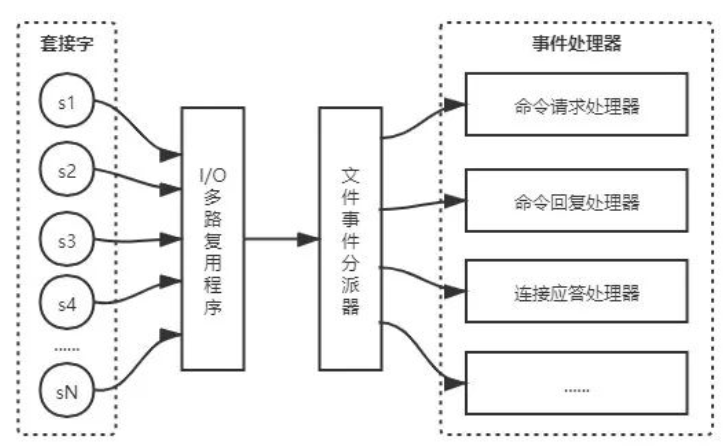
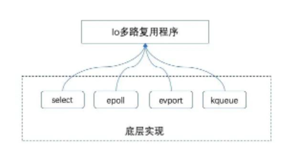
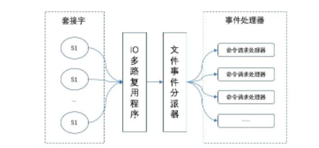

## 1. 开头

### 1.1.  网络模型回顾

前面我们已经知道，计算机网络模型一共有4种，这里我们简单的回顾下

* 阻塞IO模型

  在Linux中，默认情况下所有socket都是阻塞的。

  当应用进程调用了recvfrom这个系统调用后，系统内核就开始了IO的第一个阶段：准备数据。

  对于网络IO来说，很多时候数据在一开始还没到达时(比如还没有收到一个完整的TCP包)，系统内核就要等待足够的数据到来。而在用户进程这边，整个进程会被阻塞。

  当系统内核一直等到数据准备好了，它就会将数据从系统内核中拷贝到用户内存中，然后系统内核返回结果，用户进程才解除阻塞的状态，重新运行起来。所以，阻塞IO模型的特点就是在IO执行的两个阶段(等待数据和拷贝数据)都被阻塞了。

* 非阻塞IO模型

  **在非阻塞式IO中，用户进程其实需要不断地主动询问kernel数据是否准备好**

  **非阻塞的接口相比阻塞型接口的显著差异在于被调用之后立即返回**

* 多路复用IO模型

  基本原理就是有个函数会不断地轮询所负责的所有socket，当某个socket有数据到达了，就通知用户进程，多路IO复用模型。

  当用户进程调用了select，那么整个进程会被阻塞，而同时，内核会"监视"所有select负责的socket，当任何一个socket中的数据准备好了，select就会返回。这个时候用户进程再调用read操作，将数据从内核拷贝到用户进程

  这里需要使用两个系统调用(select和recvfrom)。阻塞IO只调用了一个系统调用(recvfrom)。

  用select的优势在于它可以同时处理多个连接。所以，如果系统的连接数不是很高的话，使用select/epoll的web server不一定比使用多线程的阻塞IO的web server性能更好，可能延迟还更大；**select/epoll的优势并不是对单个连接能处理得更快，而是在于能处理更多的连接**

  如果select()发现某句柄捕捉到了"可读事件"，服务器程序应及时做recv()操作，并根据接收到的数据准备好待发送数据，并将对应的句柄值加入writefds，准备下一次的"可写事件"的select()检测。同样，如果select()发现某句柄捕捉到"可写事件"，则程序应及时做send()操作，并准备好下一次的"可读事件"检测准备

  **IO多路复用是最常使用的IO模型，但是其异步程度还不够“彻底”，因为它使用了会阻塞线程的select系统调用。因此IO多路复用只能称为异步阻塞IO，而非真正的异步IO**

* 异步io模型

  用户进程发起read操作之后，立刻就可以开始去做其他的事；而另一方面，从内核的角度，当它收到一个异步的read请求操作之后，首先会立刻返回，所以不会对用户进程产生任何阻塞

  内核会等待数据准备完成，然后将数据拷贝到用户内存中，当这一切都完成之后，内核会给用户进程发送一个信号，返回read操作已完成的信息

### 1.2.  上下文切换


### 1.3.  小结

调用阻塞IO会一直阻塞住对应的进程直到操作完成，而非阻塞IO在内核还在准备数据的情况下会立刻返回。

两者的区别就在于同步IO进行IO操作时会阻塞进程。按照这个定义，之前所述的阻塞IO、非阻塞IO及多路IO复用都属于同步IO。实际上，真实的IO操作，就是例子中的recvfrom这个系统调用。

非阻塞IO在执行recvfrom这个系统调用的时候，如果内核的数据没有准备好，这时候不会阻塞进程。但是当内核中数据准备好时，recvfrom会将数据从内核拷贝到用户内存中，这个时候进程则被阻塞。

而异步IO则不一样，当进程发起IO操作之后，就直接返回，直到内核发送一个信号，告诉进程IO已完成，则在这整个过程中，进程完全没有被阻塞

## 2. redis网络模型

### 2.1.  redis网络事件

Redis服务器是一个事件驱动程序，服务器需要处理以下两类事件：

- **文件事件**：Redis服务端通过套接字与客户端(或其他Redis服务器)进行连接，而文件事件就是服务器对套接字操作的抽象。服务器与客户端(或者其他服务器)的通信会产生相应的文件事件，而服务器则通过监听并处理这些事件来完成一系列网络通信操作。
- **时间事件**：Redis服务器中的一些操作(如`serverCron`)函数需要在给定的时间点执行，而时间事件就是服务器对这类定时操作的抽象。

### 2.2. redis的多路复用

​	Redis的 I/O 多路复用程序的所有功能都是通过包装常见的`select`、`epoll`、`evport`、`kqueue`这些多路复用函数库来实现的。因为Redis 为每个 I/O 多路复用函数库都实现了相同的API，所以I/O多路复用程序的底层实现是可以互换的。

​	Redis 在 I/O 多路复用程序的实现源码中用 `#include` 宏定义了相应的规则，程序会在编译时自动选择系统中性能最高的 I/O 多路复用函数库来作为 Redis 的 I/O 多路复用程序的底层实现(`ae.c`文件)：

```
#ifdef HAVE_EVPORT
#include "ae_evport.c"
#else
    #ifdef HAVE_EPOLL
    #include "ae_epoll.c"
    #else
        #ifdef HAVE_KQUEUE
        #include "ae_kqueue.c"
        #else
        #include "ae_select.c"
        #endif
    #endif
#endif
```

#### 2.2.1.  文件事件处理器

**Redis基于 Reactor 模式开发了自己的网络事件处理器：这个处理器被称为文件事件处理器：**

- **文件事件处理器使用 I/O 多路复用程序来同时监听多个套接字**，并根据套接字目前执行的任务来为套接字关联不同的事件处理器。
- 当被监听的套接字准备好执行连接应答(`accept`)、读取(`read`)、写入(`write`)、关闭(`close`)等操作时，与操作相对应的文件事件就会产生，这时文件事件处理器就会调用套接字之前关联好的事件处理器来处理这些事件。

下图展示了文件事件处理器的四个组成部分：`套接字`、`I/O多路复用程序`、`文件事件分派器(dispatcher)`、`事件处理器`

 

* 文件事件是对套接字操作的抽象
* 每当一个套接字准备好执行连接应答、写入、读取、关闭等操作时，就会产生一个文件事件。
* 一个服务器通常会连接多个套接字，所以多个文件事件有可能会并发地出现。

​	**I/O 多路复用程序负责监听多个套接字，并向文件事件分派器传送那些产生了事件的套接字**

​	Redis 的 I/O多路复用程序总是会将所有产生事件的套接字都放到一个队列里面，然后通过这个队列，以有序、同步、每次一个套接字的方式向文件事件分派器传送套接字。当上一个套接字产生的事件被处理完毕之后，I/O 多路复用程序才会继续向文件事件分派器传送下一个套接字

Redis为文件事件处理器编写了多个处理器，这些事件处理器分别用于实现不同的网络通信需求：

- 为了对连接服务器的各个客户端进行应答，服务器要为监听套接字关联`连接应答处理器`；
- 为了接受客户端传来的命令请求，服务器要为客户端套接字关联`命令请求处理器` ；
- 为了向客户端返回命令的执行结果，服务器要为客户端套接字关联`命令回复处理器` ；
- 当主服务器和从服务器进行复制操作时，主从服务器都需要关联特别为复制功能编写的`复制处理器`。

#### 2.2.2.  连接应答处理器

​	`networking.c/acceptTcpHandler`函数是Redis的连接应答处理器，这个处理器用于对连接服务器监听套接字的客户端进行应答，具体实现为`sys/socket.h/acccept`函数的包装。

​	当Redis服务器进行初始化的时候，程序会将这个连接应答处理器和服务器监听套接字的`AE_READABLE`事件关联起来，当有客户端用`sys/socket.h/connect`函数连接服务器监听套接字的时候，套接字就会产生`AE_READABLE`事件，引发连接应答处理器执行，并执行相应的套接字应答操作

 

#### 2.2.3.  命令请求处理器

​	`networking.c/readQueryFromClient`函数是Redis的命令请求处理器，这个处理器负责从套接字中读入客户端发送的命令请求内容，具体实现为`unistd.h/read`函数的包装。

​	当一个客户端通过连接应答处理器成功连接到服务器之后，服务器会将客户端套接字的`AE_READABLE`事件和命令请求处理器关联起来，当客户端向服务器发送命令请求的时候，套接字就会产生`AE_READABLE`事件，引发命令请求处理器执行，并执行相应的套接字读入操作。

​	在客户端连接服务器的整个过程中，服务器都会一直为客户端套接字`AE_READABLE`事件关联命令请求处理器。

 

#### 2.2.4.  命令回复处理器

​	`networking.c/sendReplyToClient`函数是Redis的命令回复处理器，这个处理器负责从服务器执行命令后得到的命令回复通过套接字返回给客户端，具体实现为`unistd.h/write`函数的包装。

​	当服务器有命令回复需要传送给客户端的时候，服务器会将客户端套接字的`AE_WRITABLE`事件和命令回复处理器关联起来，当客户端准备好接收服务器传回的命令回复时，就会产生`AE_WRITABLE`事件，引发命令回复处理器执行，并执行相应的套接字写入操作。

​	当命令回复发送完毕之后，服务器就会解除命令回复处理器与客户端套接字的`AE_WRITABLE`事件之间的关联

 

#### 2.2.5. 小结 

​	Redis 将所有产生事件的套接字都放到一个队列里面，以有序、同步、每次一个套接字的方式向文件事件分派器传送套接字，文件事件分派器根据套接字对应的事件选择响应的处理器进行处理，从而实现了高效的网络请求

### 2.3. Redis的自定义协议

Redis客户端使用RESP（Redis的序列化协议）协议与Redis的服务器端进行通信。它实现简单，解析快速并且人类可读。

#### 2.3.1. 协议数据类型

RESP 支持以下数据类型：

* 简单字符串
* 错误
* 整数
* 批量字符串和数组

#### 2.3.2. 发送方式

redis发送这些数据类型的方式为：

- 客户端将命令作为批量字符串的 RESP 数组发送到 Redis 服务器。
- 服务器根据命令实现以其中一种 RESP 类型进行回复

在 RESP 中，某些数据的类型取决于第一个字节：

- 对于**简单字符串**，回复的第一个字节是“+”
- 对于**错误**，回复的第一个字节是“-”
- 对于**整数**，回复的第一个字节是“:”
- 对于**批量字符串**，回复的第一个字节是“$”
- 对于**数组**，回复的第一个字节是“*”

RESP 能够使用稍后指定的批量字符串或数组的特殊变体来表示 Null 值。在 RESP 中，协议的不同部分总是以“\r\n”（CRLF）终止：

对于简单字符串示例如下：

用如下方法编码：一个“+”号后面跟字符串，最后是“\r\n”，字符串里不能包含"\r\n"。简单字符串用来传输比较短的二进制安全的字符串。例如很多redis命令执行成功会返回“OK”，用RESP编码就是5个字节：

```
"+OK\r\n"
```

想要发送二进制安全的字符串，需要用RESP的块字符串。当redis返回了一个简单字符串的时候，客户端库需要给调用者返回“+”号（不含）之后CRLF之前（不含）的字符串。

#### 2.3.3. RESP错误

RESP 有一种专门为错误设计的类型。实际上错误类型很像RESP简单字符串类型，但是第一个字符是“-”。简单字符串类型和错误类型的区别是客户端把错误类型当成一个异常，错误类型包含的字符串是异常信息。格式是：

```
"-Error message\r\n"
```

有错误发生的时候才会返回错误类型，例如你执行了一个对于某类型错误的操作，或者命令不存在等。当返回一个错误类型的时候客户端库应该发起一个异常。下面是一个错误类型的例子

```
-ERR unknown command 'foobar' -WRONGTYPE Operation against a key holding the wrong kind of value
```

“-”号之后空格或者换行符之前的字符串代表返回的错误类型，这只是惯例，并不是RESP要求的格式。例如ERR是一般错误，WRONGTYPE是更具体的错误表示客户端的试图在错误的类型上执行某个操作。这个称为错误前缀，能让客户端更方便的识别错误类型。

客户端可能为不同的错误返回不同的异常，也可能只提供一个一般的方法来捕捉错误并提供错误名。但是不能依赖客户端提供的这些特性，因为有的客户端仅仅返回一般错误，比如false

#### 2.3.4.  协议分析器

​	尽管 Redis 的协议非常利于人类阅读， 定义也很简单， 但这个协议的实现性能仍然可以和二进制协议一样快。因为 Redis 协议将数据的长度放在数据正文之前， 所以程序无须像 JSON 那样， 为了寻找某个特殊字符而扫描整个 payload ， 也无须对发送至服务器的 payload 进行转义（quote）。

程序可以在对协议文本中的各个字符进行处理的同时， 查找 CR 字符， 并计算出批量回复或多条批量回复的长度， 就像这样：

```
#include <stdio.h>

int main(void) {
    unsigned char *p = "$123\r\n";
    int len = 0;

    p++;
    while(*p != '\r') {
        len = (len*10)+(*p - '0');
        p++;
    }

    /* Now p points at '\r', and the len is in bulk_len. */
    printf("%d\n", len);
    return 0;
}
```

得到了批量回复或多条批量回复的长度之后， 程序只需调用一次 `read` 函数， 就可以将回复的正文数据全部读入到内存中， 而无须对这些数据做任何的处理。在回复最末尾的 CR 和 LF 不作处理，丢弃它们。

Redis 协议的实现性能可以和二进制协议的实现性能相媲美， 并且由于 Redis 协议的简单性， 大部分高级语言都可以轻易地实现这个协议， 这使得客户端软件的 bug 数量大大减少。

## 3. redis高性能

根据官方的文档，Redis经过在6W多个连接中进行了基准测试，并且仍然能够在这些条件下维持5W q/s的效率。

其原因我们可以总结下来：

### 3.1. 高效的数据结构

### 3.2. 线程模型

#### 3.2.1.多线程

- 并发(concurrency)：指在同一时刻只能有一条指令执行，但多个进程指令被快速的轮换执行，使得在宏观上具有多个进程同时执行的效果，但在微观上并不是同时执行的，只是把时间分成若干段，使多个进程快速交替的执行。
- 并行(parallel)：指在同一时刻，有多条指令在多个处理器上同时执行。所以无论从微观还是从宏观来看，二者都是一起执行的。

​	并发在同一时刻只有一条指令执行，只不过进程(线程)在CPU中快速切换，速度极快，给人看起来就是“同时运行”的印象，实际上同一时刻只有一条指令进行。但实际上如果我们在一个应用程序中使用了多线程，**线程之间的轮换以及上下文切换是需要花费很多时间的**。

​	可以通过例子证明，当并发执行累加操作不超过百万次时，速度会比串行执行累加操作要慢。由于线程有创建和上下文切换的开销，导致并发执行的速度会比串行慢的情况出现

#### 3.2.2. 上下文切换

​	多个线程可以执行在单核或多核CPU上，单核CPU也支持多线程执行代码，CPU通过给每个线程分配CPU时间片(机会)来实现这个机制。CPU为了执行多个线程，就需要不停的切换执行的线程，这样才能保证所有的线程在一段时间内都有被执行的机会

​	此时，CPU分配给每个线程的执行时间段，称作它的时间片。CPU时间片一般为几十毫秒。CPU通过时间片分配算法来循环执行任务，当前任务执行一个时间片后切换到下一个任务。

​	但是，在切换前会保存上一个任务的状态，以便下次切换回这个任务时，可以再加载这个任务的状态。所以**任务从保存到再加载的过程就是一次上下文切换**。

​	**根据多线程的运行状态来说明**：多线程环境中，当一个线程的状态由Runnable转换为非Runnable(Blocked、Waiting、Timed_Waiting)时，相应线程的上下文信息(包括CPU的寄存器和程序计数器在某一时间点的内容等)需要被保存，以便相应线程稍后再次进入Runnable状态时能够在之前的执行进度的基础上继续前进。而一个线程从非Runnable状态进入Runnable状态可能涉及恢复之前保存的上下文信息。这个对线程的上下文进行保存和恢复的过程就被称为上下文切换

### 3.3. 内存模型

#### 3.3.1.  磁盘瓶颈

​	以MySQL为例，MySQL的数据和索引都是持久化保存在磁盘上的，因此当我们使用SQL语句执行一条查询命令时，如果目标数据库的索引还没被加载到内存中，那么首先要先把索引加载到内存，再通过若干寻址定位和磁盘I/O，把数据对应的磁盘块加载到内存中，最后再读取数据

​	读取硬盘上的数据：

* 第一步就是找到所需的磁道，磁道就是以中间轴为圆心的圆环，首先我们需要找到所需要对准的磁道，并将磁头移动到对应的磁道上，这个过程叫做寻道
* 第二步等到磁盘转动，让磁头指向我们需要读取的数据开始的位置，这里耗费的时间称为旋转延迟，平时我们说的硬盘转速快慢，主要影响的就是耗费在这里的时间

无论是磁头的移动还是磁盘的转动，本质上其实都是机械运动，这也是为什么这种硬盘被称为机械硬盘，而机械运动的效率就是磁盘读写的瓶颈

#### 3.3.2.  redis数据

​	为了效率，redis将数据存储到内存之中，读写都直接对数据库进行操作，天然地就比硬盘数据库少了到磁盘读取数据的这一步，而这一步恰恰是计算机处理I/O的瓶颈所在。

​	因此，可以负责任地说，Redis这么快当然跟它基于内存运行有着很大的关系。但是，这还远远不是全部的原因

### 3.4. 网络模型

单线程的 Redis，对于多核CPU发挥不了作用，redis有专门的结束：

> CPU成为Redis性能瓶颈的情况并不常见，因为Redis通常会受到内存或网络的限制。例如，在 Linux 系统上使用流水线 Redis 每秒甚至可以提供 100 万个请求，所以如果你的应用程序主要使用O(N)或O(log(N))命令，它几乎不会占用太多的CPU。
>
> 然而，为了最大化CPU利用率，你可以在同一个节点中启动多个Redis实例，并将它们视为不同的Redis服务。在某些情况下，一个单独的节点可能是不够的，所以如果你想使用多个cpu，你可以开始考虑一些更早的分片方法。
>
> 你可以在Partitioning页面中找到更多关于使用多个Redis实例的信息。
>
> 然而，在Redis 4.0中，我们开始让Redis更加线程化。目前这仅限于在后台删除对象，以及阻塞通过Redis模块实现的命令。对于未来的版本，我们的计划是让Redis变得越来越多线程。

**注意：我们一直说的 Redis 单线程，只是在处理我们的网络请求的时候只有一个线程来处理**，一个正式的Redis Server运行的时候肯定是不止一个线程的！

例如Redis进行持久化的时候会 fork了一个子进程 执行持久化操作

## 5. 总结

首先要明确Redis单线程，指的是"其网络IO和键值对读写是由一个线程完成的"，也就是说，**Redis中只有网络请求模块和数据操作模块是单线程的。而其他的如持久化存储模块、集群支撑模块等是多线程的**

Redis并没有在网络请求模块和数据操作模块中使用多线程模型，主要是基于以下四个原因：

- Redis 操作基于内存，绝大多数操作的性能瓶颈不在 CPU
- 使用单线程模型，可维护性更高，开发，调试和维护的成本更低
- 单线程模型，避免了线程间切换带来的性能开销
- 在单线程中使用多路复用 I/O技术也能提升Redis的I/O利用率

### 5.1. **Redis的多路复用**

**Linux多路复用技术，就是多个进程的IO可以注册到同一个管道上，这个管道会统一和内核进行交互。当管道中的某一个请求需要的数据准备好之后，进程再把对应的数据拷贝到用户空间中**

 

Redis的IO多路复用程序的所有功能都是通过包装操作系统的IO多路复用函数库来实现的。每个IO多路复用函数库在Redis源码中都有对应的一个单独的文件。

 

每当一个套接字准备好执行连接应答、写入、读取、关闭等操作时，就会产生一个文件事件。因为一个服务器通常会连接多个套接字，所以多个文件事件有可能会并发地出现。

一旦有请求到达，就会交给 Redis 线程处理，这就实现了一个 Redis 线程处理多个 IO 流的效果

Redis选择使用多路复用IO技术来提升I/O利用率。

Redis能够有这么高的性能，不仅仅和采用多路复用技术和单线程有关，此外还有以下几个原因：

- 完全基于内存，绝大部分请求是纯粹的内存操作，非常快速。
- 数据结构简单，对数据操作也简单，如哈希表、跳表都有很高的性能。
- 采用单线程，避免了不必要的上下文切换和竞争条件，也不存在多进程或者多线程导致的切换而消耗 CPU
- 使用多路I/O复用模型

### 5.2. **Redis 6.0**

**Redis 6.0中的多线程，也只是针对处理网络请求过程采用了多线程，而数据的读写命令，仍然是单线程处理的**

主要是因为我们对Redis有着更高的要求

根据测算，Redis 将所有数据放在内存中，内存的响应时长大约为 100 纳秒，对于小数据包，Redis 服务器可以处理 80,000 到 100,000 QPS，这么高的对于 80% 的公司来说，单线程的 Redis 已经足够使用了

随着越来越复杂的业务场景，有些公司动不动就上亿的交易量，因此需要更大的 QPS。

为了提升QPS，很多公司的做法是部署Redis集群，并且尽可能提升Redis机器数。但是这种做法的资源消耗是巨大的。经过分析，限制Redis的性能的主要瓶颈出现在网络IO的处理上，虽然之前采用了多路复用技术。但是我们前面也提到过，**多路复用的IO模型本质上仍然是同步阻塞型IO模型**

下面是多路复用IO中select函数的处理过程：

 

虽然现在很多服务器都是多个CPU核的，但是对于Redis来说，因为使用了单线程，在一次数据操作的过程中，有大量的CPU时间片是耗费在了网络IO的同步处理上的，并没有充分的发挥出多核的优势。

**如果能采用多线程，使得网络处理的请求并发进行，就可以大大的提升性能。多线程除了可以减少由于网络 I/O 等待造成的影响，还可以充分利用 CPU 的多核优势**

Redis 6.0采用多个IO线程来处理网络请求，网络请求的解析可以由其他线程完成，然后把解析后的请求交由主线程进行实际的内存读写。提升网络请求处理的并行度，进而提升整体性能。

但是，Redis 的多 IO 线程只是用来处理网络请求的，对于读写命令，Redis 仍然使用单线程来处理