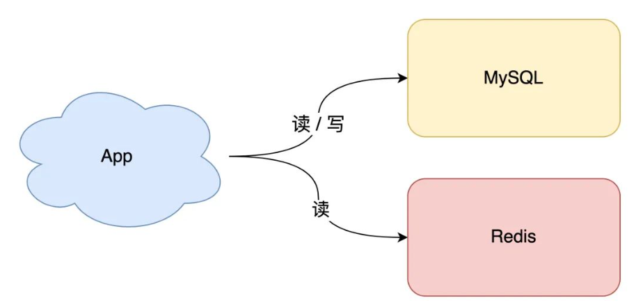
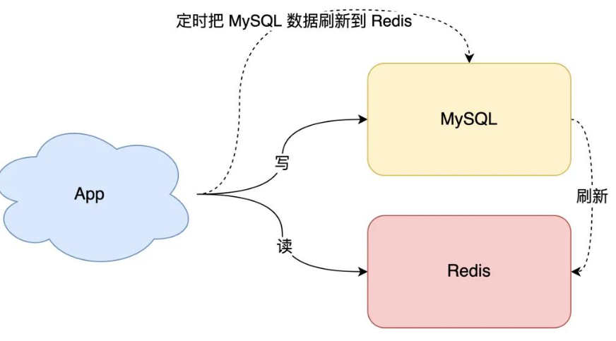
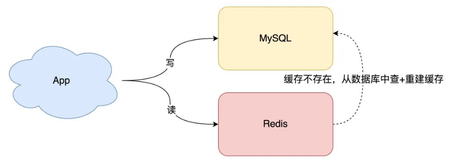
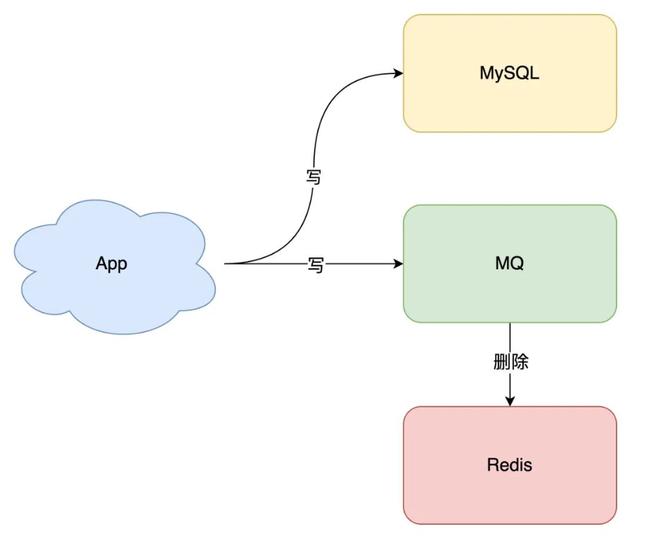
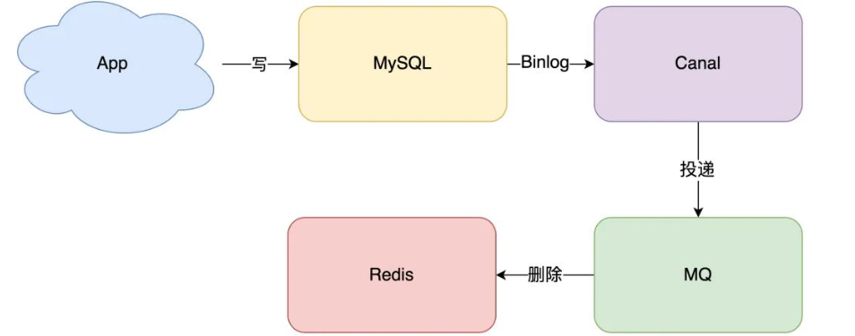

## 1.  开头

使用redis做缓存有如下问题：

- 到底是更新缓存还是删缓存？
- 到底选择先更新数据库，再删除缓存，还是先删除缓存，再更新数据库？
- 为什么要引入消息队列保证一致性？
- 延迟双删会有什么问题？到底要不要用？

## 2. 缓存使用模型

 

## 3. 缓存设计

### 3.1.  定时任务

 

- 数据库的数据，全量刷入缓存（不设置失效时间）
- 写请求只更新数据库，不更新缓存
- 启动一个定时任务，定时把数据库的数据，更新到缓存中

**优点：**

所有读请求都可以直接「命中」缓存，不需要再查数据库，性能非常高。

**缺点：**

* **缓存利用率低**

  不经常访问的数据，还一直留在缓存中

* **数据不一致**

  因为是「定时」刷新缓存，缓存和数据库存在不一致（取决于定时任务的执行频率）

这种方案一般更适合业务「体量小」，且对数据一致性要求不高的业务场景

### 3.2.  懒加载

 

- 写请求依旧只写数据库
- 读请求先读缓存，如果缓存不存在，则从数据库读取，并重建缓存
- 同时，写入缓存中的数据，都设置失效时间

**优点：**

缓存中不经常访问的数据，随着时间的推移，都会逐渐「过期」淘汰掉，最终缓存中保留的，都是经常被访问的「热数据」，缓存利用率得以最大化

#### 3.2.1.  缓存更新

要想保证缓存和数据库「实时」一致，那就不能再用定时任务刷新缓存了。

当数据发生更新时，我们不仅要操作数据库，还要一并操作缓存。具体操作就是，修改一条数据时，不仅要更新数据库，也要连带缓存一起更新。

但数据库和缓存都更新，又存在先后问题，那对应的方案就有 2 个：

这两种方案都会产生不一致的问题：

* 先更新缓存，后更新数据库

  * 数据库更新失败

    如果缓存更新成功了，但数据库更新失败，那么此时缓存中是最新值，但数据库中是「旧值」。

    虽然此时读请求可以命中缓存，拿到正确的值，但是，一旦缓存「失效」，就会从数据库中读取到「旧值」，重建缓存也是这个旧值。这时用户会发现自己之前修改的数据又「变回去」了，对业务造成影响

  * 并发更新

    两个线程同时更新缓存和数据库，会有并发问题

* 先更新数据库，后更新缓存

  * 缓存更新失败

    如果数据库更新成功了，但缓存更新失败，那么此时数据库中是最新值，缓存中是「旧值」。

    之后的读请求读到的都是旧数据，只有当缓存「失效」后，才能从数据库中得到正确的值。

    这时用户会发现，自己刚刚修改了数据，但却看不到变更，一段时间过后，数据才变更过来，对业务也会有影响。

  * 并发更新

    两个线程同时更新缓存和数据库，会有并发问题，

    A 虽然先于 B 发生，但 B 操作数据库和缓存的时间，却要比 A 的时间短，执行时序发生「错乱」，最终这条数据结果是不符合预期的

很多情况下，写到缓存中的值，并不是与数据库中的值一一对应的，很有可能是先查询数据库，再经过一系列「计算」得出一个值，才把这个值才写到缓存中。

由此可见，这种「更新数据库 + 更新缓存」的方案，不仅缓存利用率不高，还会造成机器性能的浪费。

#### 3.2.2.  缓存删除

这两种方案都会产生不一致的问题：

* 先删除缓存，后更新数据库

  * 数据库删除失败，和前面类似，和前面类似(网络原因)

  * 并发问题

    * 线程 A 要更新 X = 2（原值 X = 1）

    * 线程 A 先删除缓存

    * 线程 B 读缓存，发现不存在，从数据库中读取到旧值（X = 1）

    * 线程 A 将新值写入数据库（X = 2）

    * 线程 B 将旧值写入缓存（X = 1）

    最终 X 的值在缓存中是 1（旧值），在数据库中是 2（新值），发生不一致。

    可见，先删除缓存，后更新数据库，当发生「读+写」并发时，还是存在数据不一致的情况

* 先更新数据库，后删除缓存

  * 缓存删除失败，和前面类似(网络原因)

  * 并发问题

    * 缓存中 X 不存在（数据库 X = 1）

    * 线程 A 读取数据库，得到旧值（X = 1）

    * 线程 B 更新数据库（X = 2)

    * 线程 B 删除缓存

    * 线程 A 将旧值写入缓存（X = 1）

    最终 X 的值在缓存中是 1（旧值），在数据库中是 2（新值），也发生不一致

    这种情况「理论」来说是可能发生的，但实际真的有可能发生吗？

    其实概率「很低」，这是因为它必须满足 3 个条件：

    * 缓存刚好已失效

    * 读请求 + 写请求并发

    * 更新数据库 + 删除缓存的时间（步骤 3-4），要比读数据库 + 写缓存时间短（步骤 2 和 5）

    仔细想一下，条件 3 发生的概率其实是非常低的。

    写数据库一般会先「加锁」，所以写数据库，通常是要比读数据库的时间更长的。

    这么来看，「先更新数据库 + 再删除缓存」的方案，基本可以保证数据一致性的

#### 3.2.3. 重试

执行失败问题的问题我们的核心解决方案就是重试

无论是先操作缓存，还是先操作数据库，但凡后者执行失败了，我们就可以发起重试，尽可能地去做「补偿」。不过重试也有**几大问题：**

- 立即重试很大概率「还会失败」？
- 「重试次数」设置多少才合理？
- 重试会一直「占用」这个线程资源，无法服务其它客户端请求

因此我们需要**异步重试**:

其实就是把重试请求写到「消息队列」中，然后由专门的消费者来重试，直到成功。

或者更直接的做法，为了避免第二步执行失败，我们可以把操作缓存这一步，直接放到消息队列中，由消费者来操作缓存。

到这里你可能会问，写消息队列也有可能会失败啊？而且，引入消息队列，这又增加了更多的维护成本，这样做值得吗？

这个问题很好，但我们思考这样一个问题：如果在执行失败的线程中一直重试，还没等执行成功，此时如果项目「重启」了，那这次重试请求也就「丢失」了，那这条数据就一直不一致了。

所以，这里我们必须把重试或第二步操作放到另一个「服务」中，这个服务用「消息队列」最为合适。这是因为消息队列的特性，正好符合我们的需求

- **消息队列保证可靠性**：写到队列中的消息，成功消费之前不会丢失（重启项目也不担心）
- **消息队列保证消息成功投递**：下游从队列拉取消息，成功消费后才会删除消息，否则还会继续投递消息给消费者（符合我们重试的场景）

至于写队列失败和消息队列的维护成本问题：

- **写队列失败**：操作缓存和写消息队列，「同时失败」的概率其实是很小的
- **维护成本**：我们项目中一般都会用到消息队列，维护成本并没有新增很多

所以，引入消息队列来解决这个问题，是比较合适的。这时架构模型就变成了这样：

 

#### 3.2.3. 数据库日志

不想在应用中去写消息队列，是否有更简单的方案，同时又可以保证一致性呢？  

我们可以**订阅数据库变更日志，再操作缓存**

拿 MySQL 举例，当一条数据发生修改时，MySQL 就会产生一条变更日志（Binlog），我们可以订阅这个日志，拿到具体操作的数据，然后再根据这条数据，去删除对应的缓存：

 

目前也有了比较成熟的开源中间件，例如阿里的 canal，使用这种方案的优点在于：

- **无需考虑写消息队列失败情况**：只要写 MySQL 成功，Binlog 肯定会有
- **自动投递到下游队列**：canal 自动把数据库变更日志「投递」给下游的消息队列

当然，与此同时，我们需要投入精力去维护 canal 的高可用和稳定性。

#### 3.2.4. 小结

**针对于懒加载，我们推荐采用「先更新数据库，再删除缓存」方案，并配合「消息队列」或「订阅变更日志」的方式来做**

### 3.3. 主从同步延迟

#### 3.3.1. 问题场景

* 先删除缓存，再更新数据库

  并发更新：

  * 线程 A 要更新 X = 2（原值 X = 1）

  * 线程 A 先删除缓存

  * 线程 B 读缓存，发现不存在，从数据库中读取到旧值（X = 1）

  * 线程 A 将新值写入数据库（X = 2）

  * 线程 B 将旧值写入缓存（X = 1）

  最终 X 的值在缓存中是 1（旧值），在数据库中是 2（新值），发生不一致

* 先更新数据库，再删除缓存

  * 线程 A 更新主库 X = 2（原值 X = 1）

  * 线程 A 删除缓存

  * 线程 B 查询缓存，没有命中，查询「从库」得到旧值（从库 X = 1）

  * 从库「同步」完成（主从库 X = 2）

  * 线程 B 将「旧值」写入缓存（X = 1）

  最终 X 的值在缓存中是 1（旧值），在主从库中是 2（新值），也发生不一致

#### 3.3.2. 解决方案

最有效的办法就是，**把缓存删掉**。但是，不能立即删，而是需要「延迟删」，这就是业界给出的方案：**缓存延迟双删策略**。按照延时双删策略，这 2 个问题的解决方案是这样的：

**解决第一个问题**：

在线程 A 删除缓存、更新完数据库之后，先「休眠一会」，再「删除」一次缓存。

**解决第二个问题**：

线程 A 可以生成一条「延时消息」，写到消息队列中，消费者延时「删除」缓存。

这两个方案的目的，都是为了把缓存清掉，这样一来，下次就可以从数据库读取到最新值，写入缓存。

「延迟删除」缓存，延迟时间到底设置要多久呢？

- 问题1：延迟时间要大于「主从复制」的延迟时间
- 问题2：延迟时间要大于线程 B 读取数据库 + 写入缓存的时间

我们都是凭借经验大致估算这个延迟时间，例如延迟 1-5s，只能尽可能地降低不一致的概率。

采用这种方案，也只是尽可能保证一致性而已，极端情况下，还是有可能发生不一致。

所以实际使用中，我还是建议你采用「先更新数据库，再删除缓存」的方案，同时，要尽可能地保证「主从复制」不要有太大延迟，降低出问题的概率

### 3.4. 强一致

要想做到强一致，最常见的方案是 2PC、3PC、Paxos、Raft 这类一致性协议，但它们的性能往往比较差，而且这些方案也比较复杂，还要考虑各种容错问题

我们引入缓存的目的是什么？

**性能**。

一旦我们决定使用缓存，那必然要面临一致性问题。性能和一致性就像天平的两端，无法做到都满足要求。

而且，就拿我们前面讲到的方案来说，当操作数据库和缓存完成之前，只要有其它请求可以进来，都有可能查到「中间状态」的数据。

所以如果非要追求强一致，那必须要求所有更新操作完成之前期间，不能有「任何请求」进来。

虽然我们可以通过加「分布锁」的方式来实现，但我们要付出的代价，很可能会超过引入缓存带来的性能提升。

所以，既然决定使用缓存，就必须容忍「一致性」问题，我们只能尽可能地去降低问题出现的概率。

同时我们也要知道，缓存都是有「失效时间」的，就算在这期间存在短期不一致，我们依旧有失效时间来兜底，这样也能达到最终一致

## 4. 总结

* 想要提高应用的性能，可以引入「缓存」来解决
* 引入缓存后，需要考虑缓存和数据库一致性问题，可选的方案有：「更新数据库 + 更新缓存」、「更新数据库 + 删除缓存」
  * 更新数据库 + 更新缓存方案，在「并发」场景下无法保证缓存和数据一致性，且存在「缓存资源浪费」和「机器性能浪费」的情况发生
  * 在更新数据库 + 删除缓存的方案中，「先删除缓存，再更新数据库」在「并发」场景下依旧有数据不一致问题，解决方案是「延迟双删」，但这个延迟时间很难评估，所以推荐用「先更新数据库，再删除缓存」的方案

* 在「先更新数据库，再删除缓存」方案下，为了保证两步都成功执行，需配合「消息队列」或「订阅变更日志」的方案来做，本质是通过「重试」的方式保证数据一致性
* 在「先更新数据库，再删除缓存」方案下，「读写分离 + 主从库延迟」也会导致缓存和数据库不一致，缓解此问题的方案是「延迟双删」，凭借经验发送「延迟消息」到队列中，延迟删除缓存，同时也要控制主从库延迟，尽可能降低不一致发生的概率
* 性能和一致性不能同时满足，为了性能考虑，通常会采用「最终一致性」的方案
* 掌握缓存和数据库一致性问题，核心问题有 3 点：缓存利用率、并发、缓存 + 数据库一起成功问题
* 失败场景下要保证一致性，常见手段就是「重试」，同步重试会影响吞吐量，所以通常会采用异步重试的方案
* 订阅变更日志的思想，本质是把权威数据源（例如 MySQL）当做 leader 副本，让其它异质系统（例如 Redis / Elasticsearch）成为它的 follower 副本，通过同步变更日志的方式，保证 leader 和 follower 之间保持一致

