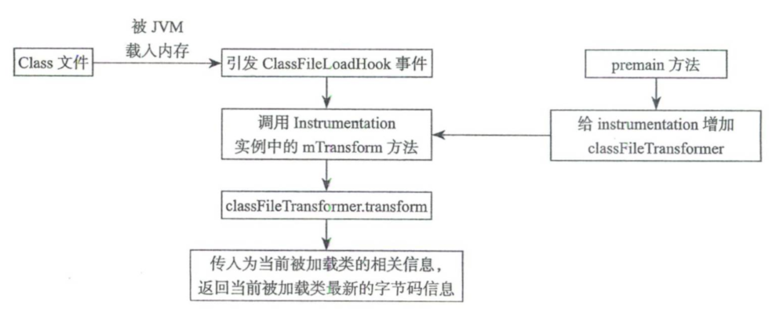

#  概念与设计

了解概念与设计能够帮助你理解 SkyWalking 以及相关领域。

- 什么是 SkyWalking?
  - [总览与核心概念](https://skyapm.github.io/document-cn-translation-of-skywalking/zh/8.0.0/concepts-and-designs/overview.html). 提供高层次的描述和介绍，包括项目解决的问题。
  - [项目目标](https://skyapm.github.io/document-cn-translation-of-skywalking/zh/8.0.0/concepts-and-designs/project-goals.html). 阐述了 SkyWalking 所重点关注的目标和为此提供的特性.

阅读完以上文档后, 你应该对 SkyWalking 的基本目标有所了解. 接下来你可以选择以下文章中你感兴趣的, 深入阅读.

- 探针
  - [介绍](https://skyapm.github.io/document-cn-translation-of-skywalking/zh/8.0.0/concepts-and-designs/probe-introduction.html). 引导读者理解探针是什么, 存在多少种不同的探测以及为什么需要它们。
  - [服务自动打点代理工具](https://skyapm.github.io/document-cn-translation-of-skywalking/zh/8.0.0/concepts-and-designs/service-agent.html). 介绍自动 instrument 代理程序的功能以及 SkyWalking 已经支持哪些语言。
  - [手动打点 SDK](https://skyapm.github.io/document-cn-translation-of-skywalking/zh/8.0.0/concepts-and-designs/manual-sdk.html). 介绍了手动打点 SDK 在 SkyWalking 生态系统中的作用。
  - [服务网格探针](https://skyapm.github.io/document-cn-translation-of-skywalking/zh/8.0.0/concepts-and-designs/service-mesh-probe.html). 介绍了如何从服务网格和代理探针接收遥测数据。
- 后台
  - [总览](https://skyapm.github.io/document-cn-translation-of-skywalking/zh/8.0.0/concepts-and-designs/backend-overview.html). 提供了有关 OAP 后台的高层次的介绍。
  - [可观测性分析语言](https://skyapm.github.io/document-cn-translation-of-skywalking/zh/8.0.0/concepts-and-designs/oal.html). 介绍了为聚合行为定义而设计的核心语言。
  - [OAP 中使用查询](https://skyapm.github.io/document-cn-translation-of-skywalking/zh/8.0.0/protocols/#query-protocol). 提供了一套基于可观察性分析语言指标定义的查询协议。
- UI
  - [总览](https://skyapm.github.io/document-cn-translation-of-skywalking/zh/8.0.0/concepts-and-designs/ui-overview.html). 对 SkyWalking 的用户界面进行简短介绍。
- CLI
  - [SkyWalking CLI](https://github.com/apache/skywalking-cli). Skywalking 命令行交互工具

# 基本原理

## java agent

 

