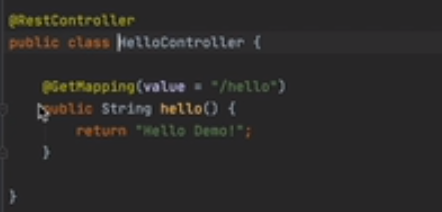
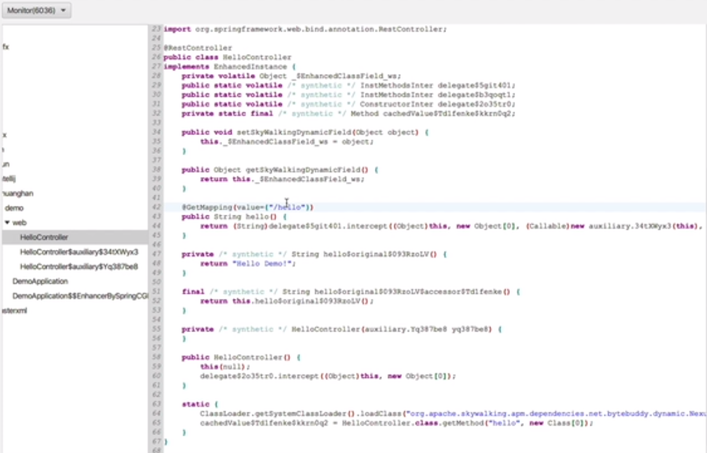

## 1. 开头

在之前的premain函数中agentbuilder 会进行transform，这个就是字节码增强的地方

```
 agentBuilder
            //要通过插件增强的一些类，这个类可以通过pluginFinder buildMath方法查看
            .type(pluginFinder.buildMatch()) 
            //在class加载的时候会执行，相当于一个监听，传入pluginFinder进行增强
            .transform(new Transformer(pluginFinder))
```

## 2. 插件的定义

之前已经讲过在每个插件目录下有一个skywalking-plugin.def文件，它表示切入点的定义

```
activemq-5.x=org.apache.skywalking.apm.plugin.activemq.define.ActiveMQProducerInstrumentation
activemq-5.x=org.apache.skywalking.apm.plugin.activemq.define.ActiveMQConsumerInstrumentation
```

比如这个定义了两个地方将会切入分别用ActiveMQProducerInstrumentation和ActiveMQConsumerInstrumentation这两个类表示

### 2.1.  实例方法

ActiveMQProducerInstrumentation的源码如下：

```
public class ActiveMQConsumerInstrumentation extends ClassInstanceMethodsEnhancePluginDefine {
    public static final String INTERCEPTOR_CLASS = "org.apache.skywalking.apm.plugin.activemq.ActiveMQConsumerInterceptor";
    public static final String ENHANCE_CLASS_CONSUMER = "org.apache.activemq.ActiveMQMessageConsumer";
    public static final String CONSTRUCTOR_INTERCEPTOR_CLASS = "org.apache.skywalking.apm.plugin.activemq.ActiveMQConsumerConstructorInterceptor";
    public static final String ENHANCE_METHOD_DISPATCH = "dispatch";
    public static final String CONSTRUCTOR_INTERCEPT_TYPE = "org.apache.activemq.ActiveMQSession";
    @Override
    public ConstructorInterceptPoint[] getConstructorsInterceptPoints() {
        return new ConstructorInterceptPoint[] {
            new ConstructorInterceptPoint() {
                    @Override public ElementMatcher<MethodDescription> getConstructorMatcher() {
                        return takesArgumentWithType(0,CONSTRUCTOR_INTERCEPT_TYPE);
                    }

                    @Override public String getConstructorInterceptor() {
                        return CONSTRUCTOR_INTERCEPTOR_CLASS;
                    }
                }
        };
    }

    @Override
    public InstanceMethodsInterceptPoint[] getInstanceMethodsInterceptPoints() {
        return new InstanceMethodsInterceptPoint[] {
            new InstanceMethodsInterceptPoint() {
                    @Override public ElementMatcher<MethodDescription> getMethodsMatcher() {
                        return named(ENHANCE_METHOD_DISPATCH);
                    }


                    @Override public String getMethodsInterceptor() {
                        return INTERCEPTOR_CLASS;
                    }

                    @Override public boolean isOverrideArgs() {
                        return false;
                    }
                }
        };
    }

    @Override
    protected ClassMatch enhanceClass() {
        return MultiClassNameMatch.byMultiClassMatch(ENHANCE_CLASS_CONSUMER);
    }
```

* enhanceClass

  表示的是拦截的类，表示拦截类的名称

* getConstructorsInterceptPoints

  表示要拦截的构造方法，不拦截的话返回null就行

* getInstanceMethodsInterceptPoints

  表示要拦截的**实例**方法

  * getMethodsMatcher

    表示要拦截的方法名称，这里匹配的话可以使用named也可以使用自定义的matcher

  * getMethodsInterceptor

    拦截到指定方法名后的拦截器做具体操作的代码

  * isOverrideArgs 

    是否允许在拦截后对方法的参数进行修改

### 2.2.  拦截器

所以我们知道xxxxConsumerInstrumentation表示的是某个类的切入点定义，注意一个这样的类只能切入一个要拦截的类，但是可以定一个这个类的多个方法。

我们在上面切入class的时候getMethodsMatcher会定义一个ENHANCE_METHOD_DISPATCH，这个就是实际的拦截器定义

```
public class ActiveMQConsumerInterceptor implements InstanceMethodsAroundInterceptor {

    public static final String OPERATE_NAME_PREFIX = "ActiveMQ/";
    public static final String CONSUMER_OPERATE_NAME_SUFFIX = "/Consumer";
    public static final byte QUEUE_TYPE = 1;
    public static final byte TOPIC_TYPE = 2;
    public static final byte TEMP_TOPIC_TYPE = 6;
    public static final byte TEMP_QUEUE_TYPE = 5;

    @Override
    public void beforeMethod(EnhancedInstance objInst, Method method, Object[] allArguments, Class<?>[] argumentsTypes,
    	//增强代码
     	..................
    }

    @Override
    public Object afterMethod(EnhancedInstance objInst, Method method, Object[] allArguments, Class<?>[] argumentsTypes, Object ret) throws Throwable {
        //增强代码
    	................
    }

    @Override
    public void handleMethodException(EnhancedInstance objInst, Method method, Object[] allArguments,
        Class<?>[] argumentsTypes, Throwable t) {
        ContextManager.activeSpan().errorOccurred().log(t);
    }
```

这个拦截器需要实现InstanceMethodsAroundInterceptor接口，类似java的aop


### 2.3.  静态方法

上面的例子拦截的时候实例方法，如果拦截的是静态方法，可以实现ClassInstanceMethodsEnhancePluginDefine 

如下例子

```
public class HttpServerExchangeInstrumentation extends ClassInstanceMethodsEnhancePluginDefine {

    private static final String ENHANCE_METHOD = "dispatch";

    private static final String ENHANCE_CLASS = "io.undertow.server.HttpServerExchange";

    private static final String INTERCEPTOR_CLASS = "org.apache.skywalking.apm.plugin.undertow.v2x.HttpServerExchangeInterceptor";

    @Override
    protected ClassMatch enhanceClass() {
        return byName(ENHANCE_CLASS);
    }

    @Override
    public ConstructorInterceptPoint[] getConstructorsInterceptPoints() {
        return new ConstructorInterceptPoint[0];
    }

    @Override
    public InstanceMethodsInterceptPoint[] getInstanceMethodsInterceptPoints() {
        return new InstanceMethodsInterceptPoint[] {
            new InstanceMethodsInterceptPoint() {
                @Override
                public ElementMatcher<MethodDescription> getMethodsMatcher() {
                    return named(ENHANCE_METHOD)
                        .and(takesArgumentWithType(0, "java.util.concurrent.Executor"))
                        .and(takesArgumentWithType(1, "java.lang.Runnable"));
                }

                @Override
                public String getMethodsInterceptor() {
                    return INTERCEPTOR_CLASS;
                }

                @Override
                public boolean isOverrideArgs() {
                    return true;
                }
            }
        };
    }
}

```

### 2.4.  构造器

拦截构造器我们可以这么做：

```
    @Override
    public ConstructorInterceptPoint[] getConstructorsInterceptPoints() {
        return new ConstructorInterceptPoint[] {
            new ConstructorInterceptPoint() {
                    @Override public ElementMatcher<MethodDescription> getConstructorMatcher() {
                        return takesArgumentWithType(0,CONSTRUCTOR_INTERCEPT_TYPE);
                    }

                    @Override public String getConstructorInterceptor() {
                        return CONSTRUCTOR_INTERCEPTOR_CLASS;
                    }
                }
        };
    }

```

构造器的拦截器需要实现这个InstanceConstructorInterceptor接口

```
public class ActiveMQProducerConstructorInterceptor implements InstanceConstructorInterceptor {
    @Override
    public void onConstruct(EnhancedInstance objInst, Object[] allArguments) {
        ActiveMQSession session = (ActiveMQSession)allArguments[0];
    }
}
```

这个方法会被Called after the origin constructor invocation.

## 3. witnessclass机制

如果同一种插件有多个版本的话，比如老版本拦截的方法叫做send，新版叫做doSend的话，这个怎么解决呢。skywalking解决的方式是witnessclass机制。

我们拿不到业务系统发行的版本号。如果两个版本的类名一样，方法名不一样，v1版本的类增强的时候找方法1，没找到可能报错或者产生未知错误。skywaking采用witnessclass机制解决这个问题。

我们的插件class的继承一个抽象类，它有一个witnessClasses方法 

```
AbstractClassEnhancePluginDefine {
	。。。。
	
    protected String[] witnessClasses() {
        return new String[] {};
    }
}
```

这个返回一个数组，它可以让我们指定一下父类名，可以帮助插件判断是否可以将该类应用于业务系统的类之中：

agent在加载的时候会看有没有这个witnessClasses返回数组，有的话，利用应用的类加载器去找有没有这个witnessClasses返回的类，有的话说明插件可以运用于这个类。

例如spring的版本有多个

spring4-x：

```
public abstract class AbstractSpring4Instrumentation extends ClassInstanceMethodsEnhancePluginDefine {
    public static final String WITHNESS_CLASSES = "org.springframework.cache.interceptor.SimpleKey";

    @Override
    protected String[] witnessClasses() {
        return new String[] {WITHNESS_CLASSES, "org.springframework.cache.interceptor.DefaultKeyGenerator"};
    }
}
```

spring3-x：

```
public abstract class AbstractSpring3Instrumentation extends ClassInstanceMethodsEnhancePluginDefine {

    public static final String WITHNESS_CLASSES = "org.springframework.web.servlet.view.xslt.AbstractXsltView";

    @Override protected final String[] witnessClasses() {
        return new String[] {WITHNESS_CLASSES};
    }
}
```

只有包含的有witnessclasses的class才会加载这个插件。

## 4. Transformer

之前已经知道AgentBuilder传入一个Transformer对象。

### 4.1. 触发tranformer操作

```
/**
 * Allows for a transformation of a {@link net.bytebuddy.dynamic.DynamicType.Builder}.
 *
 * @param builder         The dynamic builder to transform.
 * @param typeDescription The description of the type currently being instrumented.
 * @param classLoader     The class loader of the instrumented class. Might be {@code null} to represent the bootstrap class loader.
 * @param module          The class's module or {@code null} if the current VM does not support modules.
 * @return A transformed version of the supplied {@code builder}.
 */
DynamicType.Builder<?> transform(DynamicType.Builder<?> builder,
                                 TypeDescription typeDescription,
                                 ClassLoader classLoader,
                                 JavaModule module);
```

```
    private static class Transformer implements AgentBuilder.Transformer {
        private PluginFinder pluginFinder;

        Transformer(PluginFinder pluginFinder) {
            this.pluginFinder = pluginFinder;
        }

        @Override
        public DynamicType.Builder<?> transform(DynamicType.Builder<?> builder, TypeDescription typeDescription, ClassLoader classLoader, JavaModule module) {
         List<AbstractClassEnhancePluginDefine> pluginDefines = pluginFinder.find(typeDescription);
            if (pluginDefines.size() > 0) {
                DynamicType.Builder<?> newBuilder = builder;
                EnhanceContext context = new EnhanceContext();
                for (AbstractClassEnhancePluginDefine define : pluginDefines) {
                    DynamicType.Builder<?> possibleNewBuilder = define.define(typeDescription, newBuilder, classLoader, context);
                    if (possibleNewBuilder != null) {
                        newBuilder = possibleNewBuilder;
                    }
                }
                return newBuilder;
            }
            return builder;
            
        }
    }

```

* classLoader

  是负责加载当前的这个类的类加载器

* typeDescription

  是类的定义，可是使用pluginFinder周到插件列表

* EnhanceContext context = new EnhanceContext();

  * isEnhanced记录了当前这个类有没有增强过

  * objectExtended这个类有没有被扩展过

* newBuilder

  如果define.define返回不为空。说明当前这个类可以被增强，那么newBuilder替换成这个返回值possibleNewBuilder.

  注意这行代码：

  ```
  if (possibleNewBuilder != null) {
      newBuilder = possibleNewBuilder;
  }
  ```

  表示基于前一个修改后的再次进行修改。因为可能有多个plugin所以这里有个覆盖的操作

总的来说，这个方法就是当类加载的时候触发，先根据这个class找到对应的插件列表，然后执行define返回新的构造builder

### 4.2.  define方法

上面已经知道每个plugin都会进行define方法从而返回这个DynamicType.Builder

```
DynamicType.Builder<?> possibleNewBuilder = define.define(typeDescription, newBuilder, classLoader, context);
```

```
public DynamicType.Builder<?> define(TypeDescription typeDescription,
                                     DynamicType.Builder<?> builder, ClassLoader classLoader, EnhanceContext context) throws PluginException {
    String interceptorDefineClassName = this.getClass().getName();
    //通过typeDescription获取到className，这个有可能为空因为可能通过一个写api构造出了空类typeDescription
    String transformClassName = typeDescription.getTypeName();
    if (StringUtil.isEmpty(transformClassName)) {
        logger.warn("classname of being intercepted is not defined by {}.", interceptorDefineClassName);
        return null;
    }
    //使用witnessclasses机制
    String[] witnessClasses = witnessClasses();
    if (witnessClasses != null) {
        for (String witnessClass : witnessClasses) {
            if (!WitnessClassFinder.INSTANCE.exist(witnessClass, classLoader)) {
                logger.warn("enhance class {} by plugin {} is not working. Because witness class {} is not existed.", transformClassName, interceptorDefineClassName,
                    witnessClass);
                return null;
            }
        }
    }

    /**
     * find origin class source code for interceptor
     */
    DynamicType.Builder<?> newClassBuilder = this.enhance(typeDescription, builder, classLoader, context);

    context.initializationStageCompleted();
    logger.debug("enhance class {} by {} completely.", transformClassName, interceptorDefineClassName);

    return newClassBuilder;
}
```

* 通过typeDescription获取到className

* 使用witnessclasses机制来判断是否需要增强

  ```
      public boolean exist(String witnessClass, ClassLoader classLoader) {
          ClassLoader mappingKey = classLoader == null ? NullClassLoader.INSTANCE : classLoader;
          if (!poolMap.containsKey(mappingKey)) {
              synchronized (poolMap) {
                  if (!poolMap.containsKey(mappingKey)) {
                      TypePool classTypePool = classLoader == null ? TypePool.Default.ofBootLoader() : TypePool.Default.of(classLoader);
                      poolMap.put(mappingKey, classTypePool);
                  }
              }
          }
          TypePool typePool = poolMap.get(mappingKey);
          TypePool.Resolution witnessClassResolution = typePool.describe(witnessClass);
          return witnessClassResolution.isResolved();
      }
  ```

  TypePool存放了所有这个类加载器加载的类。key为classloader的key

* this.enhance

  插件的通用字节码增强的方法，下一节会进行介绍

* context.initializationStageCompleted();

  标记上下文表示插件增强生效了

### 4.3. enhance方法

这个人方法为核心方法，在ClassEnhancePluginDefine之中实现的，这个方法执行完了，skywaking就知道如何使用Bytebody对class进行增强了，实际增强其实是在运行时进行的：

```
@Override
protected DynamicType.Builder<?> enhance(TypeDescription typeDescription,
    DynamicType.Builder<?> newClassBuilder, ClassLoader classLoader,
    EnhanceContext context) throws PluginException {
    newClassBuilder = this.enhanceClass(typeDescription, newClassBuilder, classLoader);

    newClassBuilder = this.enhanceInstance(typeDescription, newClassBuilder, classLoader, context);

    return newClassBuilder;
}
```

#### 4.3.1. enhanceClass

增强静态方法类

```
private DynamicType.Builder<?> enhanceClass(TypeDescription typeDescription,
    DynamicType.Builder<?> newClassBuilder, ClassLoader classLoader) throws PluginException {
    StaticMethodsInterceptPoint[] staticMethodsInterceptPoints = getStaticMethodsInterceptPoints();
    String enhanceOriginClassName = typeDescription.getTypeName();
    if (staticMethodsInterceptPoints == null || staticMethodsInterceptPoints.length == 0) {
        return newClassBuilder;
    }

    for (StaticMethodsInterceptPoint staticMethodsInterceptPoint : staticMethodsInterceptPoints) {
        String interceptor = staticMethodsInterceptPoint.getMethodsInterceptor();
		
		。。。。。。

        if (staticMethodsInterceptPoint.isOverrideArgs()) {
            if (isBootstrapInstrumentation()) {
                newClassBuilder = newClassBuilder.method(isStatic().and(staticMethodsInterceptPoint.getMethodsMatcher()))
                    .intercept(
                        MethodDelegation.withDefaultConfiguration()
                            .withBinders(
                                Morph.Binder.install(OverrideCallable.class)
                            )
                            .to(BootstrapInstrumentBoost.forInternalDelegateClass(interceptor))
                    );
            } else {
                newClassBuilder = newClassBuilder.method(isStatic().and(staticMethodsInterceptPoint.getMethodsMatcher()))
                    .intercept(
                        MethodDelegation.withDefaultConfiguration()
                            .withBinders(
                                Morph.Binder.install(OverrideCallable.class)
                            )
                            .to(new StaticMethodsInterWithOverrideArgs(interceptor))
                    );
            }
        } else {
            if (isBootstrapInstrumentation()) {
                newClassBuilder = newClassBuilder.method(isStatic().and(staticMethodsInterceptPoint.getMethodsMatcher()))
                    .intercept(
                        MethodDelegation.withDefaultConfiguration()
                            .to(BootstrapInstrumentBoost.forInternalDelegateClass(interceptor))
                    );
            } else {
                newClassBuilder = newClassBuilder.method(isStatic().and(staticMethodsInterceptPoint.getMethodsMatcher()))
                    .intercept(
                        MethodDelegation.withDefaultConfiguration()
                            .to(new StaticMethodsInter(interceptor))
                    );
            }
        }

    }

    return newClassBuilder;
}
```

* getStaticMethodsInterceptPoints

  拿到增强的拦截点，就是我们在插件中实现的方法

* 拿到拦截点中的每一个拦截器遍历

* 判断拦截器是否会isOverrideArgs

  * 不修改入参

    ```
    newClassBuilder = newClassBuilder.method(isStatic().and(staticMethodsInterceptPoint.getMethodsMatcher()))
                            .intercept(
                                MethodDelegation.withDefaultConfiguration()
                                    .to(new StaticMethodsInter(interceptor))
                            );
    ```

    * 指定这个静态方法

    * 通过静态方法匹配器拿到方法拦截器

    * 然后交给拦截器进行处理

    * 因为拦截器是一个字符串，交给StaticMethodsInter进行包装一下

      ```
      public class StaticMethodsInter {
          private String staticMethodsAroundInterceptorClassName;
          public StaticMethodsInter(String staticMethodsAroundInterceptorClassName) {
              this.staticMethodsAroundInterceptorClassName = staticMethodsAroundInterceptorClassName;
          }
              @RuntimeType
          public Object intercept(@Origin Class<?> clazz, @AllArguments Object[] allArguments, @Origin Method method, @SuperCall Callable<?> zuper) throws Throwable {
              StaticMethodsAroundInterceptor interceptor = InterceptorInstanceLoader
                  .load(staticMethodsAroundInterceptorClassName, clazz.getClassLoader());
              MethodInterceptResult result = new MethodInterceptResult();
              try {
                  interceptor.beforeMethod(clazz, method, allArguments, method.getParameterTypes(), result);
              } catch (Throwable t) {
                  logger.error(t, "class[{}] before static method[{}] intercept failure", clazz, method.getName());
              }
      
              Object ret = null;
              try {
                  if (!result.isContinue()) {
                      ret = result._ret();
                  } else {
                      ret = zuper.call();
                  }
              } catch (Throwable t) {
                  try {
                      interceptor.handleMethodException(clazz, method, allArguments, method.getParameterTypes(), t);
                  } catch (Throwable t2) {
                      logger.error(t2, "class[{}] handle static method[{}] exception failure", clazz, method.getName(), t2.getMessage());
                  }
                  throw t;
              } finally {
                  try {
                      ret = interceptor.afterMethod(clazz, method, allArguments, method.getParameterTypes(), ret);
                  } catch (Throwable t) {
                      logger.error(t, "class[{}] after static method[{}] intercept failure:{}", clazz, method.getName(), t.getMessage());
                  }
              }
              return ret;
          }
      ```

      这个方法就和aop的拦截器非常像了，其中@RuntimeType为bytebody注解，表示不强制检查类型，ret有可能是字符串，不一定是object，Origin注解代表原生的class，SuperCall代表原方法的调用，AllArguments代表入参，Origin代表原方法

      * 首先获取到那个拦截器
      * 这里有个MethodInterceptResult的属性isContinue
      * 执行beforeMethod，可能色湖之isContinue为ture
      * 如果isContinue为true则执行原方法，否则将这个的结果作为返回值返回result._ret();

  * 可以修改入参

    ```
    newClassBuilder = newClassBuilder.method(isStatic().and(staticMethodsInterceptPoint.getMethodsMatcher()))
        .intercept(
            MethodDelegation.withDefaultConfiguration()
                .withBinders(
                    Morph.Binder.install(OverrideCallable.class)
                )
                .to(new StaticMethodsInterWithOverrideArgs(interceptor))
        );
    ```

    * 这里注册了一个OverrideCallable，代表原方法的调用

    * 交给StaticMethodsInterWithOverrideArgs进行包装一下

      ```
         @RuntimeType
          public Object intercept(@Origin Class<?> clazz, @AllArguments Object[] allArguments, @Origin Method method,
              @Morph OverrideCallable zuper) throws Throwable {
              StaticMethodsAroundInterceptor interceptor = InterceptorInstanceLoader
                  .load(staticMethodsAroundInterceptorClassName, clazz.getClassLoader());
      
              MethodInterceptResult result = new MethodInterceptResult();
              try {
                  interceptor.beforeMethod(clazz, method, allArguments, method.getParameterTypes(), result);
              } catch (Throwable t) {
                  logger.error(t, "class[{}] before static method[{}] intercept failure", clazz, method.getName());
              }
      
              Object ret = null;
              try {
                  if (!result.isContinue()) {
                      ret = result._ret();
                  } else {
                      ret = zuper.call(allArguments);
                  }
              } catch (Throwable t) {
                  try {
                      interceptor.handleMethodException(clazz, method, allArguments, method.getParameterTypes(), t);
                  } catch (Throwable t2) {
                      logger.error(t2, "class[{}] handle static method[{}] exception failure", clazz, method.getName(), t2.getMessage());
                  }
                  throw t;
              } finally {
                  try {
                      ret = interceptor.afterMethod(clazz, method, allArguments, method.getParameterTypes(), ret);
                  } catch (Throwable t) {
                      logger.error(t, "class[{}] after static method[{}] intercept failure:{}", clazz, method.getName(), t.getMessage());
                  }
              }
              return ret;
          }
      ```

      * 这个和上面分析的类似，不过入参的的原生方法的调用入参改为了Morph注解

      * 这个OverrideCallable是有入参的，这个和之前的Callable的接口不一样多了一个入参

        ```
        public interface OverrideCallable {
            Object call(Object[] args);
        }
        ```

      * 这里ret = zuper.call(allArguments);表示就可以修改方法的入参了，这样就实现了在方法增强的时候修改原方法的入参了，其它的类似。

#### 4.3.2. enhanceInstance

拦截构造方法和实例方法的处理。

```
private DynamicType.Builder<?> enhanceInstance(TypeDescription typeDescription, DynamicType.Builder<?> newClassBuilder, ClassLoader classLoader, EnhanceContext context) throws PluginException {
    
    //获取构造拦截点
     ConstructorInterceptPoint[] constructorInterceptPoints = getConstructorsInterceptPoints();
     //获取方法拦截点
        InstanceMethodsInterceptPoint[] instanceMethodsInterceptPoints = getInstanceMethodsInterceptPoints();
     //一些校验
     ....
     //判断上下文是否扩展过，
     if (!context.isObjectExtended()) {
        //如果没有扩展过，就扩展下，起个名字_$EnhancedClassField_ws，设置一下实现类，然后进行设置属性名称之类的
         newClassBuilder = newClassBuilder.defineField(CONTEXT_ATTR_NAME, Object.class, ACC_PRIVATE | ACC_VOLATILE)
                .implement(EnhancedInstance.class)
                .intercept(FieldAccessor.ofField(CONTEXT_ATTR_NAME));
         //最后将其标记为已经扩展，因为这个插件可能是多个，所以需要做一个标记
            context.extendObjectCompleted();
            
		//进行构造拦截点，然后进行处理，这里会将拦截器包装成ConstructorInter进行处理
      if (existedConstructorInterceptPoint) {
            for (ConstructorInterceptPoint constructorInterceptPoint : constructorInterceptPoints) {

                    newClassBuilder = newClassBuilder.constructor(constructorInterceptPoint.getConstructorMatcher()).intercept(SuperMethodCall.INSTANCE.andThen(MethodDelegation.withDefaultConfiguration().to(new ConstructorInter(constructorInterceptPoint.getConstructorInterceptor(), classLoader))
                        )
                }
            }
        }
     //迭代实例方法的增强
     if (existedMethodsInterceptPoints) {
            for (InstanceMethodsInterceptPoint instanceMethodsInterceptPoint : instanceMethodsInterceptPoints) {
            
            }
     }
    
}
```

* 获取构造拦截点

* 获取方法拦截点

* 一些校验

* 判断上下文是否扩展过

  如果没有扩展过，就扩展下，起个名字_$EnhancedClassField_ws，设置一下实现类，然后进行设置属性名称之类的

  最后将其标记为已经扩展，因为这个插件可能是多个，所以需要做一个标记

* 进行构造拦截点，然后进行处理，这里会将拦截器包装成ConstructorInter进行处理

  ```
  public ConstructorInter(String constructorInterceptorClassName, ClassLoader classLoader) throws PluginException {
      try {
          interceptor = InterceptorInstanceLoader.load(constructorInterceptorClassName, classLoader);
      } catch (Throwable t) {
          throw new PluginException("Can't create InstanceConstructorInterceptor.", t);
      }
  }
  
  @RuntimeType
  public void intercept(@This Object obj,
      @AllArguments Object[] allArguments) {
      try {
          EnhancedInstance targetObject = (EnhancedInstance)obj;
  
          interceptor.onConstruct(targetObject, allArguments);
      } catch (Throwable t) {
          logger.error("ConstructorInter failure.", t);
      }
  
  }
  ```

  这个比较简单，和前面静态方法的拦截类似，这里interceptor.onConstruct(targetObject, allArguments);会原来class的构造方法执行完后再执行增强的代码

  ```
   /**
       * Called after the origin constructor invocation.
       */
      void onConstruct(EnhancedInstance objInst, Object[] allArguments);
  ```

  这里需要注意ConstructorInter包装的时候传入了ClassLoader，而之前的静态方法没有传入classloader，因为静态方法只要拿到class就可以直接获取到classloader了。这里传入了classloader就是为了将 interceptor = InterceptorInstanceLoader.load(constructorInterceptorClassName, classLoader)传入的classloader进行绑定。

* 迭代实例方法的增强

  ```
  if (existedMethodsInterceptPoints) {
      for (InstanceMethodsInterceptPoint instanceMethodsInterceptPoint : instanceMethodsInterceptPoints) {
          String interceptor = instanceMethodsInterceptPoint.getMethodsInterceptor();
          if (StringUtil.isEmpty(interceptor)) {
              throw new EnhanceException("no InstanceMethodsAroundInterceptor define to enhance class " + enhanceOriginClassName);
          }
          ElementMatcher.Junction<MethodDescription> junction = not(isStatic()).and(instanceMethodsInterceptPoint.getMethodsMatcher());
          if (instanceMethodsInterceptPoint instanceof DeclaredInstanceMethodsInterceptPoint) {
              junction = junction.and(ElementMatchers.<MethodDescription>isDeclaredBy(typeDescription));
          }
          if (instanceMethodsInterceptPoint.isOverrideArgs()) {
                  newClassBuilder =
                      newClassBuilder.method(junction)
                          .intercept(
                              MethodDelegation.withDefaultConfiguration()
                                  .withBinders(
                                      Morph.Binder.install(OverrideCallable.class)
                                  )
                                  .to(new InstMethodsInterWithOverrideArgs(interceptor, classLoader))
                          );
              }
          } else {
                  newClassBuilder =
                      newClassBuilder.method(junction)
                          .intercept(
                              MethodDelegation.withDefaultConfiguration()
                                  .to(new InstMethodsInter(interceptor, classLoader))
                          );
              }
          }
      }
  }
  ```

  * 拿到每一个接入点

  * 获取elementmatcher的junction，即一个匹配到的方法

    ```
    ElementMatcher.Junction<MethodDescription> junction = not(isStatic()).and(instanceMethodsInterceptPoint.getMethodsMatcher());
    ```

  * 判断迭代的接入点是否为DeclaredInstanceMethodsInterceptPoint

    会找到匹配的方法

    ```
    if (instanceMethodsInterceptPoint instanceof DeclaredInstanceMethodsInterceptPoint) {
       junction = junction.and(ElementMatchers.<MethodDescription>isDeclaredBy(typeDescription));
    }
    ```

    这种接入点的接口会返回一个getMethodsMatcher()方法，比如springmvc的插件

    ```
    @Override
    public ElementMatcher<MethodDescription> getMethodsMatcher() {
        return isAnnotatedWith(named("org.springframework.web.bind.annotation.RequestMapping"));
    }
    ```

    它会匹配这个类中的方法是否含有org.springframework.web.bind.annotation.RequestMapping这个注解

  * 判断是否为覆盖参数从而采用InstMethodsInterWithOverrideArgs或者InstMethodsInter

    * InstMethodsInter

      ```
      @RuntimeType
      public Object intercept(@This Object obj,
          @AllArguments Object[] allArguments,
          @SuperCall Callable<?> zuper,
          @Origin Method method
      ) throws Throwable {
      	//before
      	//invoke
      	//after
      	
      }
      ```

      @This传入表示传入了实例了

      后面的代码和静态方法一致

    * InstMethodsInterWithOverrideArgs

      ```
       public Object intercept(@This Object obj,
              @AllArguments Object[] allArguments,
              @Origin Method method,
              @Morph OverrideCallable zuper
          ) throws Throwable {
          	//
          }
      ```

      @This传入表示传入了实例了

      后面的代码和静态方法一致，OverrideCallable可以下修改参数

### 4.4. InterceptorInstanceLoader

在之前分析的时候，切入点的时候会被包装成类似InstMethodsInterWithOverrideArgs或者InstMethodsInter之类的对象，这些对象的构造方法中都会有

```
public InstMethodsInterWithOverrideArgs(String instanceMethodsAroundInterceptorClassName, ClassLoader classLoader) {
    try {
        interceptor = InterceptorInstanceLoader.load(instanceMethodsAroundInterceptorClassName, classLoader);
    } catch (Throwable t) {
        throw new PluginException("Can't create InstanceMethodsAroundInterceptor.", t);
    }
}
```

这个InterceptorInstanceLoader的load方法非常重要，用来查找拦截器，并且和双亲委派机制相关

```
public static <T> T load(String className, ClassLoader targetClassLoader)
        throws IllegalAccessException, InstantiationException, ClassNotFoundException, AgentPackageNotFoundException {
    //如果传入的classloader为空，则用该静态类的classloader
    if (targetClassLoader == null) {
        targetClassLoader = InterceptorInstanceLoader.class.getClassLoader();
    }
    //拼接实例名称key
    String instanceKey = className + "_OF_" + targetClassLoader.getClass().getName() + "@" + Integer.toHexString(targetClassLoader.hashCode());
    //如果实例key存在，则直接返回
    Object inst = INSTANCE_CACHE.get(instanceKey);
    if (inst == null) {
        INSTANCE_LOAD_LOCK.lock();
        ClassLoader pluginLoader;
        try {
        	//从map中查找classloader是否存在
            pluginLoader = EXTEND_PLUGIN_CLASSLOADERS.get(targetClassLoader);
            if (pluginLoader == null) {
            //如果目标classloader不存在则包装一个AgentClassLoader,让它作为他的父类类加载器
                pluginLoader = new AgentClassLoader(targetClassLoader);
                EXTEND_PLUGIN_CLASSLOADERS.put(targetClassLoader, pluginLoader);
            }
        } finally {
            INSTANCE_LOAD_LOCK.unlock();
        }
        //有了classloader后就可以利用这个来创建实例了
        inst = Class.forName(className, true, pluginLoader).newInstance();
        if (inst != null) {
            INSTANCE_CACHE.put(instanceKey, inst);
        }
    }

    return (T) inst;
}
```

* 参数中对于静态方法而言，classloader的值传入的就是静态class的类加载器

* AgentClassLoader在插件加载的时候已经知道，它是自定义的类加载器，可以加载插件的jar包列表（plugins目录），设置了目标类为父类加载器

* 这些classname表示的是拦截器，这些classname, 在各个插件里面

* targetClassLoader代表的是各个业务系统的类加载器

* 这里为什么会创建一个AgentClassLoader并和targetclassloader做一个绑定呢？使用了双亲委派机制,其模型为：

  boostrapclassloader

  execlassloader

  appclassloader

  custermerloader

  AgentClassLoader

  在这里去查找的时候，会根据双亲委派机制，每次寻找会先去父类加载器先加载，父类没有才会先加载子类的

  对于不同classloader创建同一个class的实例时，它们是不同的，需要对它们都增强。比如有两个不同的自定义classloader，它们都需要增强，那么需要创建这两个不同的增强实例。

* 单例是指在同一个classloader下，所以要针对不同classloader都创建一个实例

所以总的来说，就是为了实现不同的类加载加载的实例，能够与plugin的classloader进行一个绑定

## 5. 总结

* 业务应用的main方法执行，其中有个helloControll的类
* premain方法执行
* 我们可以通过工具查看被增强的class，会发现通过Bytebody工具会将原来的class修改，生成了代理对象

 

 

 

