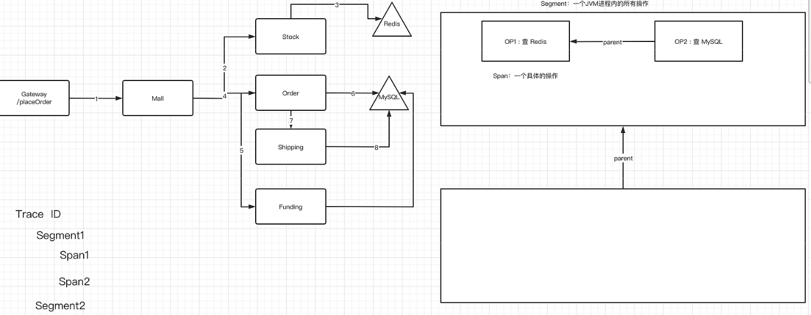
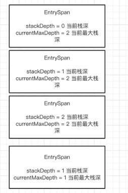
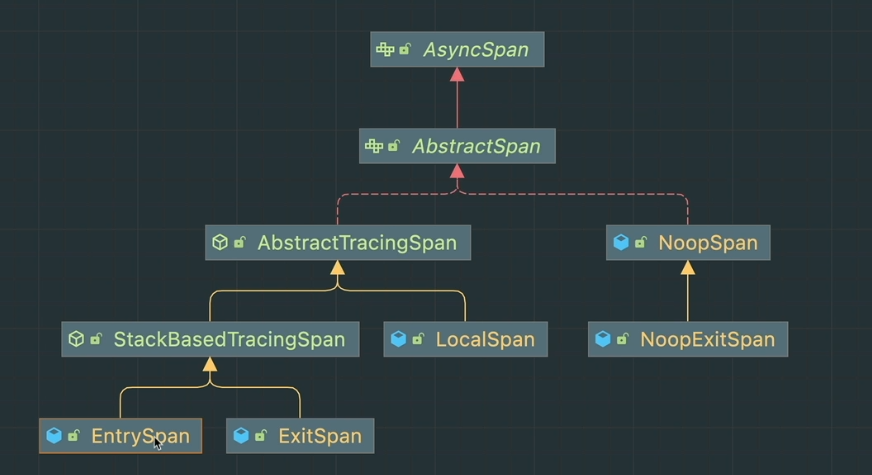
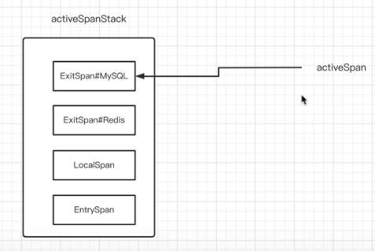
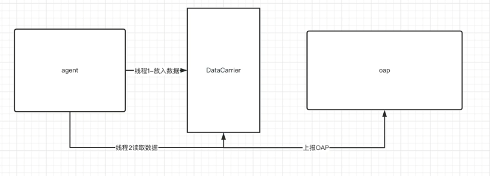
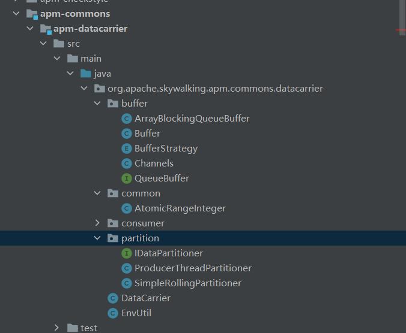
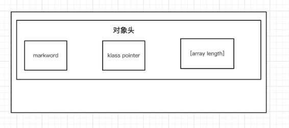
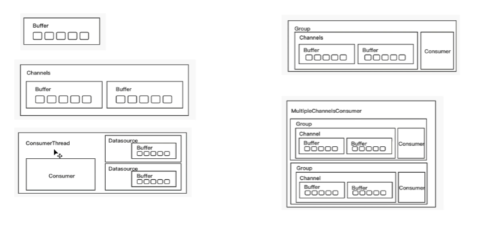
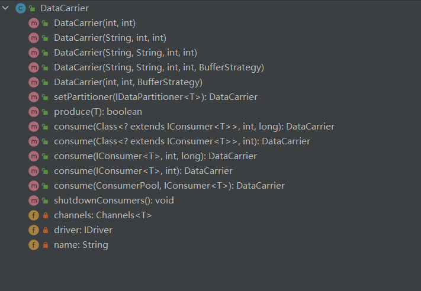

## 1. 前置知识

### 1.1. 通用规范

* 链路追踪  

  opentracing链路追踪协议https://github.com/opentracing-contrib/opentracing-specification-zh.git

  [opentracing-specification-zh/specification.md at master · opentracing-contrib/opentracing-specification-zh (github.com)](https://github.com/opentracing-contrib/opentracing-specification-zh/blob/master/specification.md)

  这个介绍了链路追踪的通用数据模型和通用的api，遵循这些语义规范。

* dapper

### 1.2. 基础概念

这里有一个请求从gateway触发，经历了多个服务，形成了一个链路 

* segement

  一个jvm进程的所有操作叫做segment

  如果所示有6个segment,后一个服务的segment会指向前一个segment

  我们通过parent将多个segement连接起来

* span

  一个segment内部的具体的操作操作叫做span

  比如，访问redis、访问mysql

  span之间也是会有parent的关系的

  但是这些span都是属于一个segement的，即segment是一个容器，装了很多span的

* trace

  trace就是一次请求，将这么多的span、segement串联起来，

  trace有一个id，是全局唯一的。

 

 

如图所示

* 1代表的是链路
* 2代表的是segement
* 3代表的是span

## 2. traceId

org.apache.skywalking.apm.agent.core.context.ids.DistributedTraceId

上面将的链路的id主要是这个类生成的

```
/**
 * The <code>DistributedTraceId</code> presents a distributed call chain.
 * <p>
 * This call chain has a unique (service) entrance,
 * <p>
 * such as: Service : http://www.skywalking.com/cust/query, all the remote, called behind this service, rest remote, db
 * executions, are using the same <code>DistributedTraceId</code> even in different JVM.
 * <p>
 * The <code>DistributedTraceId</code> contains only one string, and can NOT be reset, creating a new instance is the
 * only option.
 */
@RequiredArgsConstructor
@ToString
@EqualsAndHashCode
public abstract class DistributedTraceId {
    @Getter
    private final String id;
}
```

根据注释，表示一个分布式调用链，即使跨了不同的jvm进程，链路id都一样

一旦这个traceid生成了，就不能重置，不能修改，只能重新生成

 它有两个实现：

* NewDistributedTraceId

  ```
  public class NewDistributedTraceId extends DistributedTraceId {
      public NewDistributedTraceId() {
          super(GlobalIdGenerator.generate());
      }
  }
  ```

  GlobalIdGenerator是生成traceid的工具类

  ```
  public static String generate() {
      return StringUtil.join(
          '.',
          PROCESS_ID,
          String.valueOf(Thread.currentThread().getId()),
          String.valueOf(THREAD_ID_SEQUENCE.get().nextSeq())
      );
  }
  ```

  THREAD_ID_SEQUENCE是一个threadlocal工具

  ```
  private static final ThreadLocal<IDContext> THREAD_ID_SEQUENCE = ThreadLocal.withInitial(
      () -> new IDContext(System.currentTimeMillis(), (short) 0));
  ```

  通过threadlocal获取到idcontext

  其中IDContext

  ```
  private static class IDContext {
      private long lastTimestamp;
      private short threadSeq;
  
      // Just for considering time-shift-back only.
      private long lastShiftTimestamp;
      private int lastShiftValue;
  
      private IDContext(long lastTimestamp, short threadSeq{
          this.lastTimestamp = lastTimestamp;
          this.threadSeq = threadSeq;
      }
             private long nextSeq() {
              return timestamp() * 10000 + nextThreadSeq();
          }
  
          private long timestamp() {
              long currentTimeMillis = System.currentTimeMillis();
  
              if (currentTimeMillis < lastTimestamp) {
                  // Just for considering time-shift-back by Ops or OS. @hanahmily 's suggestion.
                  if (lastShiftTimestamp != currentTimeMillis) {
                      lastShiftValue++;
                      lastShiftTimestamp = currentTimeMillis;
                  }
                  return lastShiftValue;
              } else {
                  lastTimestamp = currentTimeMillis;
                  return lastTimestamp;
              }
          }
  
          private short nextThreadSeq() {
              if (threadSeq == 10000) {
                  threadSeq = 0;
              }
              return threadSeq++;
          }
      }
  ```

  * lastTimestamp

    上一次生成seqenece的时间戳

  * threadSeq线程的序列号

  * lastShiftTimestamp、lastShiftValue

    处理时钟回拨的，因为操作系统可能会引起时间设置倒退

  * nextSeq

    这个就是generate其中调用的方法,其中会结合timestamp() * 10000 + nextThreadSeq()生成序列号

  * timestamp

    获取当前的时间戳，如果发生了时间回拨处理一下,返回应该的当前的时间戳

  * nextThreadSeq

    会在0-10000之间循环遍历

  所以总的来说

  GlobalIdGenerator.generate()会根据当前线程生成的序列号，加上线程id，进程id生成的，然后就可以生成全局id了

  这个GlobalIdGenerator既可以生成traceid又可以生成segementid

* PropagatedTraceId

  ```
  public class PropagatedTraceId extends DistributedTraceId {
      public PropagatedTraceId(String id) {
          super(id);
      }
  }
  ```

## 3. segement

一次请求打到一个jvm进程里后，通常是由一个线程来完成，但是也有可能在里面开了一个线程池。所以准确来讲，一个segment表示一个jvm的一个segment的所有操作。

```
public class TraceSegment {

     private String traceSegmentId;
     private TraceSegmentRef ref;
     private List<AbstractTracingSpan> spans；
     private DistributedTraceId relatedGlobalTraceId;
     private boolean ignore = false;
     private boolean isSizeLimited = false;
     private final long createTime;

}
```

* spans

  表示当前当前这个segment的所有的操作

* relatedGlobalTraceId

  当前所在的globaltraceid

* traceSegmentId

  tracesegmentid的唯一id

* TraceSegmentRef

  这个是当前segment的上一个segment的指针，这个字段不会被序列化，只是为了快速访问

  ```
  public class TraceSegmentRef {
      private SegmentRefType type;
      private String traceId;
      private String traceSegmentId;
      private int spanId;
      private String parentService;
      private String parentServiceInstance;
      private String parentEndpoint;
      private String addressUsedAtClient;
  }
  public enum SegmentRefType {
  	CROSS_PROCESS, CROSS_THREAD
  }
  ```

  * SegmentRefType

    * CROSS_PROCESS

      代表跨进程

    * CROSS_THREAD

      代表跨线程

  * traceSegmentId

    代表的是就是parent的segmentid

  * spanId

    代表的是spanid，后面会进行分析

  * parentService

    调用者的服务

  * parentServiceInstance

    调用者的服务实例

  * parentEndpoint

    调用父类的一个请求

  * transform

    将TraceSegmentRef对象转化为Probuffer

    

### 3.1. relatedGlobalTrace

当前的segment关联一个全局traceid

```
public void relatedGlobalTrace(DistributedTraceId distributedTraceId) {
    if (relatedGlobalTraceId instanceof NewDistributedTraceId) {
        this.relatedGlobalTraceId = distributedTraceId;
    }
}
```

### 3.2. ref

引用某一条segment

```
public void ref(TraceSegmentRef refSegment) {
    if (null == ref) {
        this.ref = refSegment;
    }
}
```

### 3.3. archive

将一个span加进来

```
public void archive(AbstractTracingSpan finishedSpan) {
    spans.add(finishedSpan);
}
```

### 3.4. finish

这里传入一个布尔值，表示操作做完了

```
public TraceSegment finish(boolean isSizeLimited) {
    this.isSizeLimited = isSizeLimited;
    return this;
}
```

其中isSizeLimited和一个配置文件相关，SPAN_LIMIT_PER_SEGMENT默认300

这个标识一个segment默认可以存储的span数，举例如：

```
private boolean isLimitMechanismWorking() {
    if (spanIdGenerator >= spanLimitWatcher.getSpanLimit()) {
        long currentTimeMillis = System.currentTimeMillis();
        if (currentTimeMillis - lastWarningTimestamp > 30 * 1000) {
            LOGGER.warn(
                new RuntimeException("Shadow tracing context. Thread dump"),
                "More than {} spans required to create", spanLimitWatcher.getSpanLimit()
            );
            lastWarningTimestamp = currentTimeMillis;
        }
        return true;
    } else {
        return false;
    }
}
```

就是表示当我们要关闭segment的时候，表示我当前的segment是否已经收集满了segement了，true表示已经满了，会丢弃一部分span操作

## 4. span

### 4.1. componentsDefine

```
public class ComponentsDefine {

    public static final OfficialComponent TOMCAT = new OfficialComponent(1, "Tomcat");

    public static final OfficialComponent HTTPCLIENT = new OfficialComponent(2, "HttpClient");

    public static final OfficialComponent DUBBO = new OfficialComponent(3, "Dubbo");

    public static final OfficialComponent MOTAN = new OfficialComponent(8, "Motan");

    public static final OfficialComponent RESIN = new OfficialComponent(10, "Resin");
    .................
    
```

这个就是定义的plugin的名称。这个组件全部用Component的实现类来表示，即OfficialComponent，代表的是官方的插件，但是如果想自己写的话，需要新实现一个

### 4.2. spanlayer

```
public enum SpanLayer {
    DB(1),//比如访问mysql、还是oracle等等数据库的操作 
    RPC_FRAMEWORK(2),//远程调用 
    HTTP(3),
    MQ(4),
    CACHE(5);
```

在skywalking中，将所有的插件分成了5类

### 4.3. tags

这个类定义了一些官方的tags对象

```
public static final StringTag URL = new StringTag(1, "url");

/**
 * STATUS_CODE records the http status code of the response.
 */
public static final StringTag STATUS_CODE = new StringTag(2, "status_code", true);

/**
 * DB_TYPE records database type, such as sql, redis, cassandra and so on.
 */
public static final StringTag DB_TYPE = new StringTag(3, "db.type");
```

### 4.4.  AsyncSpan

用于异步的插件，特别是rpc插件。

#### 4.4.1. AbstractSpan 

* AbstractSpan setComponent(Component component);

  表示当前的这个操作发生在哪个一个插件身上。

* AbstractSpan setLayer(SpanLayer layer);

  设置当前的这个操作的分类（5大类）

* AbstractSpan tag(AbstractTag<?> tag, String value)

  在这儿span上面打标签，有String和AbstractTag的类型，AbstractTag有覆盖的功能

* AbstractSpan log(Throwable t)

  记录一个异常为本地时间，见注释

  ```
  Record an exception event of the current walltime timestamp.
  ```

* AbstractSpan errorOccurred()

  标记一下这个span为异常的

* isEntry

  进入span

* isExit

  退出span

* AbstractSpan log(long timestamp, Map<String, ?> event)

  记录一个事件

* AbstractSpan setOperationName(String operationName)

  记录当前操作的名称，如果当前组件是http是http则是url，如果是db则是sql语句,如果是redis，则就是redis命令

* AbstractSpan start()

  表示span这个操作动作开始

* void ref(TraceSegmentRef ref)

  这个span的父segment操作，segment和segment之间是靠这个TraceSegmentRef 进行连接的

* AbstractSpan setPeer(String remotePeer)

  设置对端地址

  一个请求可能跨多个进程，操作多个中间件，每次进行rpc对面的地址就是remotepeer

* boolean isProfiling();

  这个后面在进行分析

* void skipAnalysis();

  发送给后端是否要进行分析

#### 4.4.2. AbstractTracingSpan

这个类继承了abstractspan抽象类，实现了部分方法

##### 4.4.2.1. **核心属性：**

* spanId

  一个segmemetn有很多span，这些span都会给他们分配一个spanid

* parentspan

  一个span是上一个还没有结束的span触发的，这个就是他的父类的id

* isInAsyncMode

  当前的异步操作是否已经开启了

* isAsyncStopped

  当前的异步操作是否已经结束了

* TracingContext

  这个很重要，用来管理一条链路的segment

* protected List<TraceSegmentRef> refs;

  用于当前span指定自己所在的segment的前一个segment，除非这个是所有的链路的第一个segment。

  通常情况下是一个segments，但是如果是批处理就有可能有多个parent了。

  例如一次rpc去请求配拆分成多给子任务，这些线程是并行的，最终会进行join方法，最终又汇集成一个线程处理，那么这个线程的parentsegemtn就可能有多个，ref多个了

  常见于 MQ / Batch 调用。例如，MQ 批量消费消息时，消息来自【多个服务】。每次批量消费时，【消费者】新建一个 TraceSegment 对象：

  将自己的 `refs` 指向【多个服务】的多个 TraceSegment 。

  将自己的 `relatedGlobalTraces` 设置为【多个服务】的多个 DistributedTraceId

* 其它的的字段和abstactspan类似

  skipAnalysis为true，当前这个segment的所有的span都不会分析

* tags

  在Tags类中会官方定义一些tag,可以通过一些方法传入

  Tags里面定义了很多tags

##### 4.4.2.2. **核心方法：**

* finish方法

  ```
  public boolean finish(TraceSegment owner) {
      this.endTime = System.currentTimeMillis();
      owner.archive(this);
      return true;
  }
  ```

  就是把当前的span添加到当前的segment之中

* log

  ```
  public AbstractTracingSpan log(Throwable t) {
      if (logs == null) {
          logs = new LinkedList<>();
      }
      if (!errorOccurred && ServiceManager.INSTANCE.findService(StatusCheckService.class).isError(t)) {
          errorOccurred();
      }
      logs.add(new LogDataEntity.Builder().add(new KeyValuePair("event", "error"))
                                          .add(new KeyValuePair("error.kind", t.getClass().getName()))
                                          .add(new KeyValuePair("message", t.getMessage()))
                                          .add(new KeyValuePair(
                                              "stack",
                                              ThrowableTransformer.INSTANCE.convert2String(t, 4000)
                                          ))
                                          .build(System.currentTimeMillis()));
      return this;
  }
  ```

  * 判断当前还没有发生发生了异常，并且判断哪些异常不断异常

    ServiceManager.INSTANCE.findService(StatusCheckService.class).isError(t)，就记录异常栈

  * 然后从异常中提炼出相关信息

* public void ref(TraceSegmentRef ref)

  将ref放到列表中

* prepareForAsync

  ```
  public AbstractSpan prepareForAsync() {
      if (isInAsyncMode) {
          throw new RuntimeException("Prepare for async repeatedly. Span is already in async mode.");
      }
      ContextManager.awaitFinishAsync(this);
      isInAsyncMode = true;
      return this;
  }
  ```

  表示我们要做异步了

  ```
  ContextManager.awaitFinishAsync(this);
  ```

  表示等待异步来完成 

* asyncFinish

  异步任务结束

  ```
  public AbstractSpan asyncFinish() {
      if (!isInAsyncMode) {
          throw new RuntimeException("Span is not in async mode, please use '#prepareForAsync' to active.");
      }
      if (isAsyncStopped) {
          throw new RuntimeException("Can not do async finish for the span repeatedly.");
      }
      this.endTime = System.currentTimeMillis();
      owner.asyncStop(this);
      isAsyncStopped = true;
      return this;
  }
  ```

  asyncStop提交这个span

#### 4.4.3. StackBasedTracingSpan

这个span继承于AbstractTracingSpan。从这个类的注释我们可以看出

```
This kind of span can start and finish multi times in a stack-like invoke line.
```

这个栈可以在一个栈的调用中被启动和finish多次。

##### 4.4.3.1. 示例

到底该怎么理解呢？举例如下：

* 一个tomcat部署了一个sprinmvc的应用

* 一个请求进来，先进入到tomcat的plugin，会创建一个EntrySpan

  一个segment只能有一个entryspan。

  ```
  AbstractSpan span = ContextManager.createEntrySpan(request.getRequestURI(), contextCarrier);
  Tags.URL.set(span, request.getRequestURL().toString());
  Tags.HTTP.METHOD.set(span, request.getMethod());
  span.setComponent(ComponentsDefine.TOMCAT);
  SpanLayer.asHttp(span);
  ```

* tomcat的请求到达springmvc插件，也会执行这个创建方法

  ```
  AbstractSpan span = ContextManager.createEntrySpan(operationName, contextCarrier);
  Tags.URL.set(span, httpServletRequest.getRequestURL().toString());
  Tags.HTTP.METHOD.set(span, httpServletRequest.getMethod());
  span.setComponent(ComponentsDefine.SPRING_MVC_ANNOTATION);
  SpanLayer.asHttp(span);
  ```

  * 一个segment只能有一个entryspan。因此会复用tomcat层的entryspan。
  * 因此后面的插件会覆盖前面创建的entryspan的span信息，不如componet等等之类的。这种覆盖关系的实现就需要使用stackbasedtracingspan技术了

* 调用getUser方法，这个创建的是一个localspan了。

##### 4.4.3.2. 栈结构

entryspan时使用当前栈深度和当前最大栈深来保存

 

**注意在这个栈中是一个span，从下到上是从tomcat请求到结束的变化图**。从这个请求过程和参数我们可以得出结论：

* 当最大值和当前值相等时，为正向请求
* 当当前值小于最大值时，说明请求返回
* entryspan记录的信息永远是最靠近服务的提供侧的信息。即getUser

##### 4.4.3.4. 核心属性

```
public abstract class StackBasedTracingSpan extends AbstractTracingSpan {
    protected int stackDepth;
    protected String peer;
```

* stackdepth

  表示栈的深度

* peer

  调用目标地址

```
@Override
public boolean finish(TraceSegment owner) {
    if (--stackDepth == 0) {
        return super.finish(owner);
    } else {
        return false;
    }
}
```

当栈的深度为0的时候，说明栈空了，需要结束了，结束TraceSegment

#### 4.4.4. EntrySpan

* public EntrySpan start()

  这个entryspan继承于stackbasedTracingspan.根据注释我们可以知道，这个entryspan只能由一定进入的插件创建。而entryspan的信息永远是最靠近服务测的信息。

  ```
  @Override
  public EntrySpan start() {
      if ((currentMaxDepth = ++stackDepth) == 1) {
          super.start();
      }
      clearWhenRestart();
      return this;
  }
  ```

  这里如果stackdeth为1，说明时请求进入方向。

  * 后面的插件会复用entryspan时，都会调用下这个方法。

  * 因为每一个插件认为自己时第一个entryspan。

  * 如果不等于1则会clearwhenrestart()，即清空一些基础信息。

* 其它方法

  * public EntrySpan tag(String key, String value)

  * public AbstractTracingSpan setLayer(SpanLayer layer)

  * public AbstractTracingSpan setComponent(Component component) 

  这些方法为设置调用信息，但是都会都会判断stackDepth == currentMaxDepth，因为这个是请求进入的方向，否则被反向覆盖

#### 4.4.5. ExitSpan

这个和entryspan类似，exitspan记录的时更靠近服务测的信息，比如dubbo调用，再调用httpclient调用，那么最终记录的是更靠近消费侧的信息，即dubbo的信息

* 启动方法

  ```
  public ExitSpan start() {
      if (++stackDepth == 1) {
          super.start();
      }
      return this;
  }
  ```

  只有栈的深度等于1时，才会启动，即刚刚创建。

* 我们一般在进行跨进程调用的时候会创建exitspan，并进行设置peer地址。比如访问redis或者访问mysql。都是一个exitspan。

* eixtspan和entryspan都是采用复用的机制，但前提时在嵌套调用之中。
* 多个exitspan不存在嵌套关系，是平行存在的，是兄弟关系
* tracesement里面不一定要有exitspan

因此exitspan可以简单理解为离开当前线程。

 


#### 4.4.6. LocalSpan

根据注释我们也可以知道

```
represents a normal tracing point, such as a local method
```

就是一个普通的点，通常记录一个本地方法的调用。

比如我们使用skywaking的工具包上面有注解，可以标注某些方法为localspan.它记录一些简单的信息

```
public LocalSpan(int spanId, int parentSpanId, String operationName, TracingContext owner) {
    super(spanId, parentSpanId, operationName, owner);
}
```

例如pinpoint的链路追踪可以精确到调用链中的每一个方法。它就是使用了多个localspan,它的追踪粒度非常大。而skaywalking采用了新的思路，性能剖析工具，填写的性能剖析的追踪请求后，就可以达到pinpoint的同样的思路了。

#### 4.4.7. 小结

 

注意，这里的noopexitspan，noopspan代表一个不会被记录的操作。为了确保span的整个工作流程的统一。

### 4.5. span引用关系

 

## 5. TracerContext

### 5.1. AbstractTracerContext

这个整个链路追踪的上下文管理器

* inject

  将跨进程的ContextCarrier注入进来，这个ContextCarrier就是一个segment中的所有信息。

  根据注释我们也可以知道它是跨进程调用会进行inject，需要传递一个ContextCarrier作为载具	

* extract

  与上面相反，它是提取信息，即跨进程的segment信息中提取

* capture

  用于跨线程传播数据调用使用，上面的是跨进程传输数据。不需要载具，直接生成快照即可。

* continue

  与capture相反，用于跨线程提取数据

* getReadablePrimaryTraceId

  获取只读的traceid

* getSegmentId

  获取当前segment的id

* int getSpanId();

  获取当前活跃的spanid

* createEntrySpan

  创建entryspan

* createLocalSpan

  创建localspan

* createExitSpan

  创建localspan

* activeSpan

  拿到当前活跃的span对象

* stopSpan

  Finish the given span

* CorrelationContext getCorrelationContext()

  获取用户自定义的一些数据

### 5.2. IgnoredTracerContext

这个是AbstractTracerContext的其中一个实现，这个就是不需要追踪的trace或span被这个上下文进行管理。这个是为了确保流程的一致性

```
/**
 * The <code>IgnoredTracerContext</code> represent a context should be ignored. So it just maintains the stack with an
 * integer depth field.
 * <p>
 * All operations through this will be ignored, and keep the memory and gc cost as low as possible.
 */
public class IgnoredTracerContext implements AbstractTracerContext {
    private static final NoopSpan NOOP_SPAN = new NoopSpan();
    private static final String IGNORE_TRACE = "Ignored_Trace";

    private final CorrelationContext correlationContext;
    private final ExtensionContext extensionContext;

    private int stackDepth;
```

### 5.3. TracingContext

这个是AbstractTracerContext的核心实现，是核心的追踪逻辑控制器。它基于栈工作机制构建tracingcontext。在跨线程或进程之间，我们使用TraceSegmentRef表示这种关系。而这种联系是通过ContextCarrier或者ContextSnapshot载具进行实现的。可以参考AbstractTracerContext的前几个核心的方法。所以总结下来这个类的核心功能就是：

* 当前的segment和自己前后的segment的引用TraceSegmentRef
* 当前的segment内的所有的span

#### 5.3.1.  核心属性

* 一个tracecontext持有一个Segment对象

* 活跃的span都存在一个栈里面 

  ```
  private LinkedList<AbstractSpan> activeSpanStack = new LinkedList<>();
  ```

  这些方法提供一些栈的操作

* AbstractSpan firstSpan

  从7.0.0开始支持延迟注入数据，比如inject跨进程时，支持空的注入

* spanIdGenerator

  生成下一个spanid

* span个数更新器，采用原子方法更新

  ```
  private volatile int asyncSpanCounter;
  private static final AtomicIntegerFieldUpdater<TracingContext> ASYNC_SPAN_COUNTER_UPDATER =
      AtomicIntegerFieldUpdater.newUpdater(TracingContext.class, "asyncSpanCounter");
  ```

* private volatile boolean running;

  当前tractcontext是否在运行

* SpanLimitWatcher

  配置更新监听器

*  TracingContext(String firstOPName, SpanLimitWatcher spanLimitWatcher) {

  构造器传入名字和监听器

#### 5.3.2.  活跃span

我们在一次请求的segment按顺序创建的segment都会一些span，这些span都放入到上面说的栈之中，而位于栈顶的span就是活跃的span

 

#### 5.3.3.  核心方法

* 获取当前spanid

  ```
  public int getSpanId() {
      return activeSpan().getSpanId();
  }
  ```

  获取当前活跃span的id

* createEntrySpan

  ```
  public AbstractSpan createEntrySpan(final String operationName) {
      if (isLimitMechanismWorking()) {
          NoopSpan span = new NoopSpan();
          return push(span);
      }
      AbstractSpan entrySpan;
      TracingContext owner = this;
      final AbstractSpan parentSpan = peek();
      final int parentSpanId = parentSpan == null ? -1 : parentSpan.getSpanId();
      if (parentSpan != null && parentSpan.isEntry()) {
          /*
           * Only add the profiling recheck on creating entry span,
           * as the operation name could be overrided.
           */
          profilingRecheck(parentSpan, operationName);
          parentSpan.setOperationName(operationName);
          entrySpan = parentSpan;
          return entrySpan.start();
      } else {
          entrySpan = new EntrySpan(
              spanIdGenerator++, parentSpanId,
              operationName, owner
          );
          entrySpan.start();
          return push(entrySpan);
      }
  }
  ```

  * isLimitMechanismWorking

    判断span的个数是否太多，如果为true，则不允许创建更多的span，则创建一个loopspan,入栈后直接返回

  * 先从栈中弹出一个parentspan，如果为空则是第一个栈，设置spanid为-1，否则将弹出的parentspan的id作为一个parentid

  * parentspandd的operationname被当前操作覆盖。赋值给entryspan，调用entryspan.start()的方法

    注意这里从栈中拿出元素没有删除，所以不用重新放回去

* createLocalSpan

  ```
  public AbstractSpan createLocalSpan(final String operationName) {
      if (isLimitMechanismWorking()) {
          NoopSpan span = new NoopSpan();
          return push(span);
      }
      AbstractSpan parentSpan = peek();
      final int parentSpanId = parentSpan == null ? -1 : parentSpan.getSpanId();
      AbstractTracingSpan span = new LocalSpan(spanIdGenerator++, parentSpanId, operationName, this);
      span.start();
      return push(span);
  }
  ```

  因为localspan没有复用逻辑，所以直接创建一个新的对象绑定一下父子关系就可以start然后放入到栈之中

* createExitSpan

  ```
  public AbstractSpan createExitSpan(final String operationName, final String remotePeer) {
      if (isLimitMechanismWorking()) {
          NoopExitSpan span = new NoopExitSpan(remotePeer);
          return push(span);
      }
  
      AbstractSpan exitSpan;
      AbstractSpan parentSpan = peek();
      TracingContext owner = this;
      if (parentSpan != null && parentSpan.isExit()) {
          exitSpan = parentSpan;
      } else {
          final int parentSpanId = parentSpan == null ? -1 : parentSpan.getSpanId();
          exitSpan = new ExitSpan(spanIdGenerator++, parentSpanId, operationName, remotePeer, owner);
          push(exitSpan);
      }
      exitSpan.start();
      return exitSpan;
  }
  ```

  和entryspan类似

* stopSpan

  ```
  /**
   * Stop the given span, if and only if this one is the top element of {@link #activeSpanStack}. Because the tracing
   * core must make sure the span must match in a stack module, like any program did.
   *
   * @param span to finish
   */
  @Override
  public boolean stopSpan(AbstractSpan span) {
      AbstractSpan lastSpan = peek();
      if (lastSpan == span) {
          if (lastSpan instanceof AbstractTracingSpan) {
              AbstractTracingSpan toFinishSpan = (AbstractTracingSpan) lastSpan;
              if (toFinishSpan.finish(segment)) {
                  pop();
              }
          } else {
              pop();
          }
      } else {
          throw new IllegalStateException("Stopping the unexpected span = " + span);
      }
  
      finish();
  
      return activeSpanStack.isEmpty();
  }
  ```

  根据注释我们可以知道关闭span，必须要符合栈的逻辑，必须先关闭栈顶的元素。

  * toFinishSpan.finish(segment)会将span中的计数发生变更
  * 调用finish的方法，逻辑如下

* finish();

  这个是用来结束context的，这个方法需要判断栈是否空了，才会真正的结束，才会清理一些参数，并且做一些监听器的通知。所以栈没空调用没有关系。

  ```
  private void finish() {
      if (isRunningInAsyncMode) {
          asyncFinishLock.lock();
      }
      try {
          boolean isFinishedInMainThread = activeSpanStack.isEmpty() && running;
          if (isFinishedInMainThread) {
              /*
               * Notify after tracing finished in the main thread.
               */
              TracingThreadListenerManager.notifyFinish(this);
          }
  
          if (isFinishedInMainThread && (!isRunningInAsyncMode || asyncSpanCounter == 0)) {
              TraceSegment finishedSegment = segment.finish(isLimitMechanismWorking());
              TracingContext.ListenerManager.notifyFinish(finishedSegment);
              running = false;
          }
      } finally {
          if (isRunningInAsyncMode) {
              asyncFinishLock.unlock();
          }
      }
  }
  ```

   segment.finish(isLimitMechanismWorking())。这个当满足所有的span都结束了，那么就可以通知结束segment了。

  总结下来就做了两件事：

  * 通知下性能监控
  * 通知下segemtn结束

* inject方法

  ```
  public void inject(AbstractSpan exitSpan, ContextCarrier carrier) {
      if (!exitSpan.isExit()) {
          throw new IllegalStateException("Inject can be done only in Exit Span");
      }
  
      ExitTypeSpan spanWithPeer = (ExitTypeSpan) exitSpan;
      String peer = spanWithPeer.getPeer();
      if (StringUtil.isEmpty(peer)) {
          throw new IllegalStateException("Exit span doesn't include meaningful peer information.");
      }
  
      carrier.setTraceId(getReadablePrimaryTraceId());
      carrier.setTraceSegmentId(this.segment.getTraceSegmentId());
      carrier.setSpanId(exitSpan.getSpanId());
      carrier.setParentService(Config.Agent.SERVICE_NAME);
      carrier.setParentServiceInstance(Config.Agent.INSTANCE_NAME);
      carrier.setParentEndpoint(first().getOperationName());
      carrier.setAddressUsedAtClient(peer);
  
      this.correlationContext.inject(carrier);
      this.extensionContext.inject(carrier);
  }
  ```

  * 当前传入的span是exietspan，然后把当前上下文传到ContextCarrier之中，并传输给其它进程

  * 这个方法只会在exitspan之中调用

  * entryspan不可能做跨线程跨进程的访问，这里一定是exietspan

  * 这个inject方法会封装carrier这个对象，设置一些基础信息

    比如，parentspanid，parentservicename,ip等等

  * firstspan永远指向栈底的span

    carier对象的parentEndPoint字段会封装firstspan的操作名称

* extract

  用于提取跨进程调用的上下文信息

  ```
  public void extract(ContextCarrier carrier) {
      TraceSegmentRef ref = new TraceSegmentRef(carrier);
      this.segment.ref(ref);
      this.segment.relatedGlobalTrace(new PropagatedTraceId(carrier.getTraceId()));
      AbstractSpan span = this.activeSpan();
      if (span instanceof EntrySpan) {
          span.ref(ref);
      }
  
      carrier.extractExtensionTo(this);
      carrier.extractCorrelationTo(this);
  }
  ```

  * 该方法时下一个segment调用的
  * TraceSegmentRef ref = new TraceSegmentRef(carrier)封装当前segmett的traceSegment。
  * 获取当前栈顶的entryspan设置ref的segment。

  即绑定当前segment和上一个segment之间的关系。

* capture

  ```
  public ContextSnapshot capture() {
      ContextSnapshot snapshot = new ContextSnapshot(
          segment.getTraceSegmentId(),
          activeSpan().getSpanId(),
          getPrimaryTraceId(),
          first().getOperationName(),
          this.correlationContext,
          this.extensionContext
      );
  
      return snapshot;
  }
  ```

  跨线程调用，直接new 一个快照对象即可。

* continued

  也是从对象直接提取即可，不过也需要设置下引用关系

  ```
  public void continued(ContextSnapshot snapshot) {
      if (snapshot.isValid()) {
          TraceSegmentRef segmentRef = new TraceSegmentRef(snapshot);
          this.segment.ref(segmentRef);
          this.activeSpan().ref(segmentRef);
          this.segment.relatedGlobalTrace(snapshot.getTraceId());
          this.correlationContext.continued(snapshot);
          this.extensionContext.continued(snapshot);
          this.extensionContext.handle(this.activeSpan());
      }
  }
  ```

### 5.4. ContextCarrier

这个时跨进程传输的时候封装的对象，主要维护了一些CarrierItem列表，这个是一个单项链表

主要有：

* CarrierItemHead

  链表头

* SW8CarrierItem

  skywaking版本的item

* SW8CorrelationCarrierItem

* SW8ExtensionCarrierItem

这些主要就是header不一样

### 5.5. ContextManager

​	对应AbstractTracercontext有多个实现，IgnoredTracerContext、TracingContext。到底在实际的如何选用，这个通常使用一个ContexManager来进行管理。而这个context也是bootservice的实现。

这个类代理tracecontext的方法，它有两个主要的threadlocal

#### 5.5.1. 核心属性

* ThreadLocal<AbstractTracerContext> CONTEXT = new ThreadLocal<AbstractTracerContext>()

  借助threadlocal保存不同线程触发的tracerContext

* ThreadLocal<RuntimeContext> RUNTIME_CONTEXT = new ThreadLocal<RuntimeContext>();

  tracecontext有时候需要记录一些额外的信息。这些额外的信息记录在runtimecontext之中。

#### 5.5.2. 核心方法

##### 5.5.2.1. getOrCreate

```
private static AbstractTracerContext getOrCreate(String operationName, boolean forceSampling) {
    AbstractTracerContext context = CONTEXT.get();
    if (context == null) {
        if (StringUtil.isEmpty(operationName)) {
            if (LOGGER.isDebugEnable()) {
                LOGGER.debug("No operation name, ignore this trace.");
            }
            context = new IgnoredTracerContext();
        } else {
            if (EXTEND_SERVICE == null) {
                EXTEND_SERVICE = ServiceManager.INSTANCE.findService(ContextManagerExtendService.class);
            }
            context = EXTEND_SERVICE.createTraceContext(operationName, forceSampling);

        }
        CONTEXT.set(context);
    }
    return context;
}
```

* 静态方法，根据operationName获取一个tracecontext

* 如果operationName为空，则创建一个igroredtracercontext

* EXTEND_SERVICE.createTraceContext(operationName, forceSampling);

  **调用创建一个tracetarcecontext对象,调用者对象是ContextManagerExtendService，它是真正创建tracecontext对象的类**

  **ContextManagerExtendService这个方法是一个BootService实现类，它的创建方法为：**

  ```
  public AbstractTracerContext createTraceContext(String operationName, boolean forceSampling) {
      AbstractTracerContext context;
      /*
       * Don't trace anything if the backend is not available.
       */
      if (!Config.Agent.KEEP_TRACING && GRPCChannelStatus.DISCONNECT.equals(status)) {
          return new IgnoredTracerContext();
      }
  
      int suffixIdx = operationName.lastIndexOf(".");
      if (suffixIdx > -1 && Arrays.stream(ignoreSuffixArray)
                                  .anyMatch(a -> a.equals(operationName.substring(suffixIdx)))) {
          context = new IgnoredTracerContext();
      } else {
          SamplingService samplingService = ServiceManager.INSTANCE.findService(SamplingService.class);
          if (forceSampling || samplingService.trySampling(operationName)) {
              context = new TracingContext(operationName, spanLimitWatcher);
          } else {
              context = new IgnoredTracerContext();
          }
      }
  
      return context;
  }
  ```

  这个类初始化的时候一个数组ignoreSuffixArray会从配置文件中读取，表示哪些请求时不用追踪的。上面这个方法还会判断是否需要采样等数据，来决定是否返回真正的context，否则返回这个igroecontext

  这个class初始化会执行，从配置文件读取忽略前缀等配置，同时注册监听器

  ```
  public void boot() {
      ignoreSuffixArray = Config.Agent.IGNORE_SUFFIX.split(",");
      ignoreSuffixPatternsWatcher = new IgnoreSuffixPatternsWatcher("agent.ignore_suffix", this);
      spanLimitWatcher = new SpanLimitWatcher("agent.span_limit_per_segment");
  ```

* 最终这个返回conetx会将对象放入threadlocal之中

##### 5.5.2.2. get等方法

get()、getGlobalTraceId()、getSegmentId()、getSpanId()  

都是拿到了threadlocal中的值，然后再获取。

因为manager代理了tracecontext的大部分方法。

##### 5.5.2.3. createEntrySpan

```
public static AbstractSpan createEntrySpan(String operationName, ContextCarrier carrier) {
    AbstractSpan span;
    AbstractTracerContext context;
    operationName = StringUtil.cut(operationName, OPERATION_NAME_THRESHOLD);
    if (carrier != null && carrier.isValid()) {
        SamplingService samplingService = ServiceManager.INSTANCE.findService(SamplingService.class);
        samplingService.forceSampled();
        context = getOrCreate(operationName, true);
        span = context.createEntrySpan(operationName);
        context.extract(carrier);
    } else {
        context = getOrCreate(operationName, false);
        span = context.createEntrySpan(operationName);
    }
    return span;
}
```

* operationName = StringUtil.cut(operationName, OPERATION_NAME_THRESHOLD)

  切割操作名称

* 判断是否携带carrier，如果携带了，说明会有上一个segment，会进行一次强制做一次采样，并进行context的extract

* 如果没有携带carrier，context = getOrCreate(operationName, false);，这里传递的是false，不会进行强制采样。

这里强制采样的原因是，因为如果是前面有segmet即携带的有carrier，说明一定被采样了，那么我们创建的span的时候就需要一定创建成功，否则链路就断掉了，所以必须要采样即为true，如果是第一次进来则可以不采样

##### 5.5.2.4. createLocalSpan

```
operationName = StringUtil.cut(operationName, OPERATION_NAME_THRESHOLD);
AbstractTracerContext context = getOrCreate(operationName, false);
return context.createLocalSpan(operationName);
```

很简单，就是调用tracecontext来创建一个localspan

##### 5.5.2.5. createExitSpan

```
public static AbstractSpan createExitSpan(String operationName, ContextCarrier carrier, String remotePeer) {
    if (carrier == null) {
        throw new IllegalArgumentException("ContextCarrier can't be null.");
    }
    operationName = StringUtil.cut(operationName, OPERATION_NAME_THRESHOLD);
    AbstractTracerContext context = getOrCreate(operationName, false);
    AbstractSpan span = context.createExitSpan(operationName, remotePeer);
    context.inject(carrier);
    return span;
}
```

这里因为是远程调用，所以一定会有carrier，所以会校验。需要将当前segmet的信息放入到span之中，即  context.inject(carrier);

还有一个public static AbstractSpan createExitSpan(String operationName, String remotePeer) 

方法这个不需要调用下一个exit的方法，所以不需要传入carrier对象。比如说mysql之类的插件，没必要传入本segemt信息，不需要传入相关链路。

##### 5.5.2.6. 其它方法

都是封装了tracecontext的相关的方法。

## 6. datacarrier

  

如上面的架构图就是datacarrier的作用。在skywaking的datacarrier模块实现了容器队列的功能用于临时存储链路数据，我们甚至可以直接把这个模块单独引用到自己的业务系统中，如果场景类似。如下为datacarrier的代码结构：

 

### 6.1.  QueueBuffer

skywalking定义了很多关于buffer的接口。接口名叫做QueueBuffer

#### 6.1.1.  接口定义

```
public interface QueueBuffer<T> {
    /**
     * Save data into the queue;
     *
     * @param data to add.
     * @return true if saved
     */
    boolean save(T data);

    /**
     * Set different strategy when queue is full.
     */
    void setStrategy(BufferStrategy strategy);

    /**
     * Obtain the existing data from the queue
     */
    void obtain(List<T> consumeList);

    int getBufferSize();
}
```

* save

  将数据放到队列之中去。

* setStrategy

  设置队列的策略，当队列满了后，怎么办？

* obtain

  将队列的数据放到这个传入的容器之中。

#### 6.1.2.  buffer类

buffer类实现了qunuebuffer接口，是一个环状的队列

```
public class Buffer<T> implements QueueBuffer<T> {
    private final Object[] buffer;
    private BufferStrategy strategy;
    private AtomicRangeInteger index;
```

* Object[] buffer

  存放数据的数组

* strategy策略

  ```
  public enum BufferStrategy {
      BLOCKING, IF_POSSIBLE
  }
  ```

  * blocking

    阻塞队列

  * if_possible

    不能放入就丢弃

* AtomicRangeInteger

  存放的buffer[]的下标

  ```
  public class AtomicRangeInteger extends Number implements Serializable {
      private static final long serialVersionUID = -4099792402691141643L;
      private AtomicIntegerArray values;
      private static final int VALUE_OFFSET = 15;
      private int startValue;
      private int endValue;
  ```

  其构造函数为：

  ```
  public AtomicRangeInteger(int startValue, int maxValue) {
          this.values = new AtomicIntegerArray(31);
          this.values.set(VALUE_OFFSET, startValue);
          this.startValue = startValue;
          this.endValue = maxValue - 1;
   }
  ```

  * 这里创建了一个AtomicIntegerArray长度为31。

    AtomicIntegerArray可以原子化操作数组的某一位的封装

  *  this.values.set(VALUE_OFFSET, startValue);

    给数组的下标第15位，即16个元素设置为传入startValue

  * 设置startValue

  * 设置endValue

* buffer构造函数

  ```
  Buffer(int bufferSize, BufferStrategy strategy) {
      buffer = new Object[bufferSize];
      this.strategy = strategy;
      index = new AtomicRangeInteger(0, bufferSize);
  }
  ```

  创建buffer对象是，AtomicRangeInteger创建传入0到bufferSize的范围参数

* save方法

  ```
  public boolean save(T data) {
      int i = index.getAndIncrement();
      if (buffer[i] != null) {
          switch (strategy) {
              case IF_POSSIBLE:
                  return false;
              default:
          }
      }
      buffer[i] = data;
      return true;
  }
  ```

  * index获取下标

    调用的是AtomicRangeInteger的getAndIncrement方法

    ```
    public final int getAndIncrement() {
        int next;
        do {
            next = this.values.incrementAndGet(VALUE_OFFSET);
            if (next > endValue && this.values.compareAndSet(VALUE_OFFSET, next, startValue)) {//如果超过了则就设置为0，正常不会走到这里来
                return endValue;
            }
        }
        while (next > endValue);
    
        return   - 1;
    }
    ```

    * his.values.incrementAndGet(VALUE_OFFSET)

      使用jdk的原子类，对数组的下标进行原子性的++操作。比如下标15最开始为0，调一下就加一个

    * next > endValue && this.values.compareAndSet(VALUE_OFFSET, next, startValue

      * 如果渠道的next值大于了endvalue，说明下标越界了
      * 需要通过cas将15下标重置为startvalue，如果cas操作没有成功，则继续循环操作

  * 如果下标不为空，说明已经被放元素了

    根据策略返回了

  * 为空，说明可以放元素了。

  * 为什么说这个数组是环装的，就是因为使用cas重置startValue的值

**PS：AtomicIntegerArray扩展**

这个类是jdk提供的。

jdk8的实现比较特别，这里拓展一下

```
public class AtomicIntegerArray implements java.io.Serializable {
    private static final long serialVersionUID = 2862133569453604235L;

    private static final Unsafe unsafe = Unsafe.getUnsafe();
    private static final int base = unsafe.arrayBaseOffset(int[].class);
    private static final int shift;
    private final int[] array;

    static {
        int scale = unsafe.arrayIndexScale(int[].class);
        if ((scale & (scale - 1)) != 0)
            throw new Error("data type scale not a power of two");
        shift = 31 - Integer.numberOfLeadingZeros(scale);
    }
```

* private static final int base = unsafe.arrayBaseOffset(int[].class);

  这里通过unsafe拿到的是对象的大小为，对象头的大小是16字节

   

  压缩指针pointer占4个字节

  实际数据是8的倍数，如果不是则需要进行填充。

* int scale = unsafe.arrayIndexScale(int[].class)

  计算指定数据类型的数组中每个元素所占的内存空间

*  shift = 31 - Integer.numberOfLeadingZeros(scale)

  计算传入的数字在二进制下，从左开始有多少个连续的0，得出的shift代表的是偏移的意思

* 因此，传入任何一个数组的小标，只需要左移shit并加上对象头（base的偏移量），就可以得到当前下标所对应的元素的起始长度。 

  比如我们int[] arr = new int[4].

  arr[0] = 1,第一个元素的内存起始地址为0+16

  其它的依次类推

  ```
  private static long byteOffset(int i) {
      return ((long) i << shift) + base;
  }
  ```

**PS：VarHander扩展**

这个类是java9实现。AtomicIntegerArray的java9版本就是依托于varhandle进行实现的，他代表的意思就是任何字段拿到了varhand对象，都可以进行原子操作。

它的底层还是基于unsafe类进行操作内存地址的

varhandle是替代以外直接使用unsafe类进行操作的类。目的是更加安全的操作内存。所以基于java9的skywalking的AtomicRangeInteger操作时屏蔽了操作unsafe类的危险性。因为基于varhandler类，更加安全。

#### 6.1.3.  ArrayBlockingQueueBuffer

基于阻塞队列的buffer，主要用于oap端

### 6.2. channels

管理多个buffer.

#### 6.2.1. 核心属性

* bufferChannels

  存储的buffer数据

* dataPartitioner

  buffer选择器

* strategy

  buffer的溢出策略

#### 6.2.2. 构造方法

```
public Channels(int channelSize, int bufferSize, IDataPartitioner<T> partitioner, BufferStrategy strategy) {
    this.dataPartitioner = partitioner;
    this.strategy = strategy;
    bufferChannels = new QueueBuffer[channelSize];
    for (int i = 0; i < channelSize; i++) {
        if (BufferStrategy.BLOCKING.equals(strategy)) {
            bufferChannels[i] = new ArrayBlockingQueueBuffer<>(bufferSize, strategy);
        } else {
            bufferChannels[i] = new Buffer<>(bufferSize, strategy);
        }
    }
    size = 1L * channelSize * bufferSize; // it's not pointless, it prevents numeric overflow before assigning an integer to a long
}
```

* 初始化根据buffer的策略创建对应的buffer实例，是blocking还是buffer
* 根据传入的channelsize来确定这个数组的长度
* size统计最多的一共有多少个元素。

#### 6.2.3. save方法

```
public boolean save(T data) {
    int index = dataPartitioner.partition(bufferChannels.length, data);
    int retryCountDown = 1;
    if (BufferStrategy.IF_POSSIBLE.equals(strategy)) {
        int maxRetryCount = dataPartitioner.maxRetryCount();
        if (maxRetryCount > 1) {
            retryCountDown = maxRetryCount;
        }
    }
    for (; retryCountDown > 0; retryCountDown--) {
        if (bufferChannels[index].save(data)) {
            return true;
        }
    }
    return false;
}
```

* 先根据dataparitioner来选择存储到哪一个索引之中
* 选择一个真正要用的buffer，调用buffer的save方法存储数据

#### 6.2.4. dataPartitioner类

```
public interface IDataPartitioner<T> {
    int partition(int total, T data);

    /**
     * @return an integer represents how many times should retry when {@link BufferStrategy#IF_POSSIBLE}.
     * <p>
     * Less or equal 1, means not support retry.
     */
    int maxRetryCount();
}
```

* partition方法

  参数total一般传递buffer数组的长度

  

##### 6.2.4.1. SimpleRollingPartitioner实现类

```
public int partition(int total, T data) {
    return Math.abs(i++ % total);
}
```

自增来取模，是滚动的

##### 6.2.4.2. ProducerThreadPartitioner

    @Override
    public int partition(int total, T data) {
        return (int) Thread.currentThread().getId() % total;
    }

根据生产者线程的id取模，来决定使用哪一个buffer. 

### 6.3.  消费

```
public interface IConsumer<T> {
    void init();
    void consume(List<T> data);
    void onError(List<T> data, Throwable t);
    void onExit();
}
```

#### 6.3.1. ConsumerThread

 

```
class DataSource {
    private QueueBuffer<T> sourceBuffer;

    DataSource(QueueBuffer<T> sourceBuffer) {
        this.sourceBuffer = sourceBuffer;
    }

    void obtain(List<T> consumeList) {
        sourceBuffer.obtain(consumeList);
    }
}
```

定义了一个datasoruce类来包装真正的queuebuffer,因为不知到到底使用了哪一个buffer实例

##### 6.3.1.1. 核心属性

```
private volatile boolean running;
private IConsumer<T> consumer;
private List<DataSource> dataSources;
private long consumeCycle;
```

* List<DataSource> dataSources;

  一个consumerthread对应多个buffer实例

* consumeCycle

  当本次消费没有拿到数据时，线程sleep的时间。

##### 6.3.1.2. 核心方法

```

* public void run() {
    running = true;

    final List<T> consumeList = new ArrayList<T>(1500);
    while (running) {
        if (!consume(consumeList)) {
            try {
                Thread.sleep(consumeCycle);
            } catch (InterruptedException e) {
            }
        }
    }

    // consumer thread is going to stop
    // consume the last time
    consume(consumeList);

    consumer.onExit();
}
```

* 线程启动

* 调用consume方法消费数据到创建的consumeList数组之中

  consume方法就是迭代调用datasource数组，

  然后datasourc调用obtain方法进行消费

  ```
  private boolean consume(List<T> consumeList) {
      for (DataSource dataSource : dataSources) {
          dataSource.obtain(consumeList);
      }
  
      if (!consumeList.isEmpty()) {
          try {
              consumer.consume(consumeList);
          } catch (Throwable t) {
              consumer.onError(consumeList, t);
          } finally {
              consumeList.clear();
          }
          return true;
      }
      return false;
  }
  ```

  * 这里先从datasource获取到数据到consumerlist
  * 调用consumer的consume方法进行消费
  * 具体怎么消费是各个消费者实例自己实现的。

* 没有消费成功,则睡眠

#### 6.3.2. MultipleChannelsConsumer

之前是一个consumer消费多个datasource。而这个MultipleChannelsConsumer将消费者和channel进行分了个组

```
private static class Group {
    private  Channels channels;
    private IConsumer consumer;

    public Group(Channels channels, IConsumer consumer) {
        this.channels = channels;
        this.consumer = consumer;
    }
}
```

* channels

  就是多个buffer

* consumer

  一个消费者

##### 6.3.2.1. 核心属性

```
private volatile boolean running;
private volatile ArrayList<Group> consumeTargets;
@SuppressWarnings("NonAtomicVolatileUpdate")
private volatile long size;
private final long consumeCycle;
```

* consumeTargets

  消费的分组对象

* size为buffer总数

##### 6.3.2.2. 核心方法

```
@Override
public void run() {
    running = true;

    final List consumeList = new ArrayList(2000);
    while (running) {
        boolean hasData = false;
        for (Group target : consumeTargets) {
            boolean consume = consume(target, consumeList);
            hasData = hasData || consume;
        }

        if (!hasData) {
            try {
                Thread.sleep(consumeCycle);
            } catch (InterruptedException e) {
            }
        }
    }

    // consumer thread is going to stop
    // consume the last time
    for (Group target : consumeTargets) {
        consume(target, consumeList);

        target.consumer.onExit();
    }
}
```

* 创建List consumeList = new ArrayList(2000)

* 遍历consumeTargets对象

* 调用consumel来执行group的消费

  ```
  private boolean consume(Group target, List consumeList) {
      for (int i = 0; i < target.channels.getChannelSize(); i++) {
          QueueBuffer buffer = target.channels.getBuffer(i);
          buffer.obtain(consumeList);
      }
  
      if (!consumeList.isEmpty()) {
          try {
              target.consumer.consume(consumeList);
          } catch (Throwable t) {
              target.consumer.onError(consumeList, t);
          } finally {
              consumeList.clear();
          }
          return true;
      }
      return false;
  }
  ```

  这个和之前的类似迭代channels的数组，迭代buffer数据

#### 6.3.4. 消费驱动

```
public interface IDriver {
    boolean isRunning(Channels channels);

    void close(Channels channels);

    void begin(Channels channels);
}
```

##### 6.3.4.1. ConsumeDriver

```
public class ConsumeDriver<T> implements IDriver {
    private boolean running;
    private ConsumerThread[] consumerThreads;
    private Channels<T> channels;
    private ReentrantLock lock;
```

```
public ConsumeDriver(String name, Channels<T> channels, Class<? extends IConsumer<T>> consumerClass, int num,
    long consumeCycle) {
    this(channels, num);
    for (int i = 0; i < num; i++) {
        consumerThreads[i] = new ConsumerThread("DataCarrier." + name + ".Consumer." + i + ".Thread", getNewConsumerInstance(consumerClass), consumeCycle);
        consumerThreads[i].setDaemon(true);
    }
}
```

根据构造其我们知道只需要传入channels，消费者的class对象

* begin

  ```
  public void begin(Channels channels) {
          if (running) {
              return;
          }
          lock.lock();
          try {
              this.allocateBuffer2Thread();
              for (ConsumerThread consumerThread : consumerThreads) {
                  consumerThread.start();
              }
              running = true;
          } finally {
              lock.unlock();
          }
      }
  ```

  * 这个方法只会调用一次

  * allocateBuffer2Thread

    ```
    for (int channelIndex = 0; channelIndex < channelSize; channelIndex++) {
        int consumerIndex = channelIndex % consumerThreads.length;
        consumerThreads[consumerIndex].addDataSource(channels.getBuffer(channelIndex));
    }
    ```

    根据当前的线程取模从channels取到buufe添加到datasource之中。

    因为channels中有很多buffer。同时有很多个消费线程。

    这个操作即使将这些buffer，分配个不同的线程去消费

  * 遍历consumerThreads启动各个消费线程


因此总的来说，这个消费者驱动就是一堆消费者线程拿着一堆buffer，进行分配这些buffer 

##### 6.3.4.2. ConsumerPool

```
public BulkConsumePool(String name, int size, long consumeCycle) {
    size = EnvUtil.getInt(name + "_THREAD", size);
    allConsumers = new ArrayList<MultipleChannelsConsumer>(size);
    for (int i = 0; i < size; i++) {
        MultipleChannelsConsumer multipleChannelsConsumer = new MultipleChannelsConsumer("DataCarrier." + name + ".BulkConsumePool." + i + ".Thread", consumeCycle);
        multipleChannelsConsumer.setDaemon(true);
        allConsumers.add(multipleChannelsConsumer);
    }
}
```

管理分组消费线程的pool

核心方法：

* 拿到负载最低的消费者线程

```
private MultipleChannelsConsumer getLowestPayload() {
    MultipleChannelsConsumer winner = allConsumers.get(0);
    for (int i = 1; i < allConsumers.size(); i++) {
        MultipleChannelsConsumer option = allConsumers.get(i);
        if (option.size() < winner.size()) {
            winner = option;
        }
    }
    return winner;
}
```

就是从一堆消费者线程中找出buffer的size最小的返回

### 6.4. 小结

datacarrier类

```
public class DataCarrier<T> {
    private Channels<T> channels;
    private IDriver driver;
    private String name;
```

根据前面定义的这些类，进行操作buffer即可

 


* ConsumerThread

  线程run会从它的一个成员变量datasource将数据取到一个新创建的数组之中，然后调用成员变量的consumer的，consumer.consume(consumeList)方法，而这个datasource、consumer是ConsumeDriver创建的

* consumerDriver构造函数中会创建多个ConsumerThread，begin的时候start，而consumerDriver是由DataCarrier创建的

  beign的时候还会allocateBuffer2Thread。将传入的channel 分片分到各个线程中，调用addDatasource方法包装了下数据源

* DataCarrier

  DataCarrier consume方法会创建consumerDriver并初始化

* TraceSegmentServiceClient

  会创建DataCarrier实例初始化buffer和channel，最终会创建consumerDriver启动线程

  ```
  carrier.consume(this, 1);
  ```

  this就是consumer，1是线程数

  

* TraceSegmentServiceClient可调用carrier.produce(traceSegment)往容器中放入数据，首先会根据当前线程从channels中选一个buffer，然后在buffer中添加数据

* TraceSegmentServiceClient的consumer方法就是ConsumerThread中的consumer实例调用的

## 7. 链路数据发送

链路数据主要是通过TraceSegmentServiceClient发送的。它是bootservice，iconsumer，traceContextlistener,grpcchannellister的实现类

### 7.1. 核心属性

```
private long lastLogTime;
private long segmentUplinkedCounter;
private long segmentAbandonedCounter;
private volatile DataCarrier<TraceSegment> carrier;
private volatile TraceSegmentReportServiceGrpc.TraceSegmentReportServiceStub serviceStub;
private volatile GRPCChannelStatus status = GRPCChannelStatus.DISCONNECT;
```

* lastLogTime

  上一次大于传输segment请情况的日志时间

* segmentUplinkedCounter

  成功发送segment的数量

* segmentAbandonedCounter

  丢弃的segment的数量

* carrier、serviceStub、status这个之前都了解过

### 7.2. 核心方法

* 一些booservice通用初始化方法prepare、boot

  ```
  carrier = new DataCarrier<>(CHANNEL_SIZE, BUFFER_SIZE, BufferStrategy.IF_POSSIBLE);
  carrier.consume(this, 1);
  ```

  指定了datacarrier容器

  carrier.consume(this, 1);制定了消费者线程，并传入this作为消费者实例

* traceContextlistener的实现方法

  ```
  public interface TracingContextListener {
      void afterFinished(TraceSegment traceSegment);
  }
  ```

  TracingContext在finish的时候，会执行一个

  ```
  if (isFinishedInMainThread && (!isRunningInAsyncMode || asyncSpanCounter == 0)) {
      TraceSegment finishedSegment = segment.finish(isLimitMechanismWorking());
      TracingContext.ListenerManager.notifyFinish(finishedSegment);
      running = false;
  }
  ```

  而这个ListenerManager会进行

  ```
  static void notifyFinish(TraceSegment finishedSegment) {
      for (TracingContextListener listener : LISTENERS) {
          listener.afterFinished(finishedSegment);
      }
  }
  ```

  迭代一下TracingContextListener实例执行下 listener.afterFinished(finishedSegment)

  总的来说就是，当tracefinish会执行这个afterFinished的方法

  而这个traceContextlistener的实现方法

  ```
  public void afterFinished(TraceSegment traceSegment) {
      if (traceSegment.isIgnore()) {
          return;
      }
      if (!carrier.produce(traceSegment)) {
          if (LOGGER.isDebugEnable()) {
              LOGGER.debug("One trace segment has been abandoned, cause by buffer is full.");
          }
      }
  }
  ```

  就是调用carrier进行proucer，放入到buffer之中

* ​    public void consume(List<TraceSegment> data) {

  这个就是实现cariier的消费者的方法

  ```
  if (CONNECTED.equals(status)) {
      final GRPCStreamServiceStatus status = new GRPCStreamServiceStatus(false);
      StreamObserver<SegmentObject> upstreamSegmentStreamObserver = serviceStub.withDeadlineAfter(
          Config.Collector.GRPC_UPSTREAM_TIMEOUT, TimeUnit.SECONDS
      ).collect(new StreamObserver<Commands>() {
          @Override
          public void onNext(Commands commands) {
              ServiceManager.INSTANCE.findService(CommandService.class)
                                     .receiveCommand(commands);
          }
  
          @Override
          public void onError(
              Throwable throwable) {
              status.finished();
              if (LOGGER.isErrorEnable()) {
                  LOGGER.error(
                      throwable,
                      "Send UpstreamSegment to collector fail with a grpc internal exception."
                  );
              }
              ServiceManager.INSTANCE
                  .findService(GRPCChannelManager.class)
                  .reportError(throwable);
          }
  
          @Override
          public void onCompleted() {
              status.finished();
          }
      });
  
      try {
          for (TraceSegment segment : data) {
              SegmentObject upstreamSegment = segment.transform();
              upstreamSegmentStreamObserver.onNext(upstreamSegment);
          }
      } catch (Throwable t) {
          LOGGER.error(t, "Transform and send UpstreamSegment to collector fail.");
      }
  
      upstreamSegmentStreamObserver.onCompleted();
  
      status.wait4Finish();
      segmentUplinkedCounter += data.size();
  } else {
      segmentAbandonedCounter += data.size();
  }
  
  printUplinkStatus();
  ```

  * 判断网络情况

  * final GRPCStreamServiceStatus status = new GRPCStreamServiceStatus(false);

  * 创建observer，进行发送segmetn数据

  * status.wait4Finish();

    这个是为强制等待所有的segmetn全部发送完毕后

    ```
    public void wait4Finish() {
        long recheckCycle = 5;
        long hasWaited = 0L;
        long maxCycle = 30 * 1000L; // 30 seconds max.
        while (!status) {
            try2Sleep(recheckCycle);
            hasWaited += recheckCycle;
    
            if (recheckCycle >= maxCycle) {
                LOGGER.warn("Collector traceSegment service doesn't response in {} seconds.", hasWaited / 1000);
            } else {
                recheckCycle = Math.min(recheckCycle * 2, maxCycle);
            }
        }
    }
    ```

    * recheckCycle

      要等待的毫秒数

    * hasWaited

      已等待的毫秒数

    * maxCycle

      最大可等待的毫秒数

  * 记录发送数量

  * 打印日志

  

  

  

  除了这个client还有kafkaclient，非常类似

  

