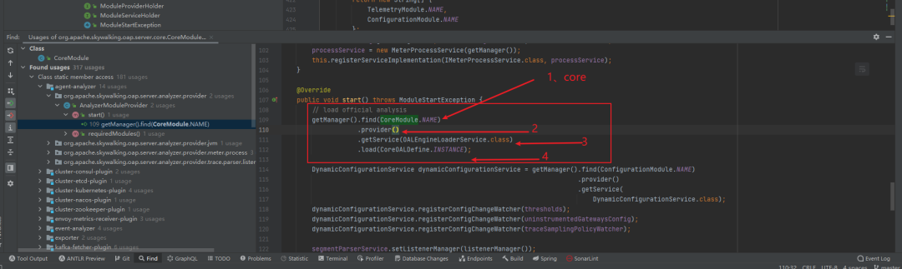

## 1. 启动整体步骤

`Skywalking-oap`的核心启动类OAPServerBootstrap.位置：

org/apache/skywalking/oap/server/starter/OAPServerBootstrap.java

```
    public static void start() {
        // 启动时是否初始化数据库
        String mode = System.getProperty("mode");
        RunningMode.setMode(mode);

        ApplicationConfigLoader configLoader = new ApplicationConfigLoader();
        ModuleManager manager = new ModuleManager();
        try {
            // 加载配置文件中的配置
            ApplicationConfiguration applicationConfiguration = configLoader.load();
            // 初始化，核心链
            manager.init(applicationConfiguration);
            //遥测模块，具体逻辑后续介绍
            manager.find(TelemetryModule.NAME)
                   .provider()
                   .getService(MetricsCreator.class)
                   .createGauge("uptime", "oap server start up time", MetricsTag.EMPTY_KEY, MetricsTag.EMPTY_VALUE)
                   // Set uptime to second
                   .setValue(System.currentTimeMillis() / 1000d);

            log.info("Version of OAP: {}", Version.CURRENT);

            if (RunningMode.isInitMode()) {
                log.info("OAP starts up in init mode successfully, exit now...");
                System.exit(0);
            }
        } catch (Throwable t) {
            log.error(t.getMessage(), t);
            System.exit(1);
        }
    }
```

* 启动时是否初始化数据库

* 加载配置文件中的配置

* 初始化，核心链

   manager.init(applicationConfiguration);

* 遥测模块，具体逻辑后续介绍


## 2.  加载配置文件中的配置

在org.apache.skywalking.oap.server.library.module.ModuleManager类之中：

```
  public void init(ApplicationConfiguration applicationConfiguration) throws ModuleNotFoundException, ProviderNotFoundException, ServiceNotProvidedException, CycleDependencyException, ModuleConfigException, ModuleStartException {
  
        String[] moduleNames = applicationConfiguration.moduleList();
        // 利用SPI加载所有模块定义
        ServiceLoader<ModuleDefine> moduleServiceLoader = ServiceLoader.load(ModuleDefine.class);
        // 利用SPI加载所有模块提供者
        ServiceLoader<ModuleProvider> moduleProviderLoader = ServiceLoader.load(ModuleProvider.class);

        HashSet<String> moduleSet = new HashSet<>(Arrays.asList(moduleNames));
        for (ModuleDefine module : moduleServiceLoader) {
            if (moduleSet.contains(module.name())) {
                //一个模块定义对应多个实现
                module.prepare(this, applicationConfiguration.getModuleConfiguration(module.name()), moduleProviderLoader);
                loadedModules.put(module.name(), module);
                // 加载完成之后将模块名称直接移除
                moduleSet.remove(module.name());
            }
        }
        // Finish prepare stage，表示准备阶段已经结束
        isInPrepareStage = false;
        //如果还有剩余模块没有初始化，抛出异常
        if (moduleSet.size() > 0) {
            throw new ModuleNotFoundException(moduleSet.toString() + " missing.");
        }
        // 对所有模块进行排序，被依赖模块先加载，同时方防止出现循环依赖
        BootstrapFlow bootstrapFlow = new BootstrapFlow(loadedModules);
        // 启动所有模块（调用所有模块的对应的provider(实现)的start方法）
        bootstrapFlow.start(this);
        // 调用所有provider的notifyAfterCompleted()方法
        bootstrapFlow.notifyAfterCompleted();
    }
```

* 利用SPI加载所有模块定义
* 利用SPI加载所有模块提供者
* 一个模块定义对应多个实现
* 加载完成之后将模块名称直接移除
* Finish prepare stage，表示准备阶段已经结束
* 如果还有剩余模块没有初始化，抛出异常
* 对所有模块进行排序，被依赖模块先加载，同时方防止出现循环依赖
* 启动所有模块（调用所有模块的对应的provider(实现)的start方法）
* 调用所有provider的notifyAfterCompleted()方法


## 3.  核心模块的核心逻辑

主要包含CoreModule的内容、CoreModuleProvider的准备、启动、结束三个阶段所做的操作

### 3.1. CoreModule 

org.apache.skywalking.oap.server.core.CoreModule

这里面的Service集合由CoreModuleProvider提供实现，Service集合通过CoreModuleProvider的生命周期方法完成组件关系处理并对外提供服务

```
public class CoreModule extends ModuleDefine {
    public static final String NAME = "core";

    public CoreModule() {
        super(NAME);
    }

    @Override
    public Class[] services() {
        List<Class> classes = new ArrayList<>();
        // 配置grpc的服务ip信息，数据清理ttl时间
        classes.add(ConfigService.class);
        // 降采样，通过减少数据采集，降低存储压力
        classes.add(DownSamplingConfigService.class);
        // 服务、实例、端点、分组命名服务
        classes.add(NamingControl.class);
        // 加载component-libraries.yml文件
        classes.add(IComponentLibraryCatalogService.class);
        // 远程工作实例获取类
        classes.add(IWorkerInstanceGetter.class);
        // 远程工作实例设置类
        classes.add(IWorkerInstanceSetter.class);
        //  MeterSystem提供了API的方式来创建{@link MetricsStreamProcessor}而不是手工分析度量或OAL脚本。
        classes.add(MeterSystem.class);

        // 负责内置Grpc和jetty服务器，并允许向服务器注册handler,接收不同业务消息
        addServerInterface(classes);
        // 添加数据上报的处理服务
        addReceiverInterface(classes);
        // 模型管理以及集群内部通信
        addInsideService(classes);
        //负责读取数据时的存储层缓存，降低存储压力
        addCacheService(classes);
        // 添加UI查询相关的Service
        addQueryService(classes);
        // 添加性能剖析相关的
        addProfileService(classes);
        // 添加OAL服务
        addOALService(classes);
        // 添加管理服务
        addManagementService(classes);
        // CommandService表示命令创建工厂。下游代理的所有命令都应该在这里创建
        classes.add(CommandService.class);

        return classes.toArray(new Class[]{});
    }
    ...省略n行代码...
}
```

### 3.2. CoreModuleProvider

#### 3.2.1. prepare准备阶段

注册了CoreModule中定义的所有Service

正如CoreModule中介绍的一样，集合中定义的所有Service都由CoreModuleProvider实现 

CoreModuleProvider在准备阶段实现CoreModule中定义的所有Service。

```
    @Override
    public void prepare() throws ServiceNotProvidedException, ModuleStartException {
        if (moduleConfig.isActiveExtraModelColumns()) {
            DefaultScopeDefine.activeExtraModelColumns();
        }
        EndpointNameGrouping endpointNameGrouping = new EndpointNameGrouping();
        final NamingControl namingControl = new NamingControl(
            moduleConfig.getServiceNameMaxLength(),
            moduleConfig.getInstanceNameMaxLength(),
            moduleConfig.getEndpointNameMaxLength(),
            endpointNameGrouping
        );
        this.registerServiceImplementation(NamingControl.class, namingControl);
        MeterEntity.setNamingControl(namingControl);
        try {
            endpointNameGroupingRuleWatcher = new EndpointNameGroupingRuleWatcher(
                this, endpointNameGrouping);

            if (moduleConfig.isEnableEndpointNameGroupingByOpenapi()) {
                endpointNameGroupingRule4OpenapiWatcher = new EndpointNameGroupingRule4OpenapiWatcher(
                    this, endpointNameGrouping);
            }
        } catch (FileNotFoundException e) {
            throw new ModuleStartException(e.getMessage(), e);
        }
        // 注解监听注册，并进行扫描
        AnnotationScan scopeScan = new AnnotationScan(); // Scan the annotation, and notify the listener(s)
        scopeScan.registerListener(new DefaultScopeDefine.Listener());
        try {
            // 扫描所有ScopeDeclaration注解标注的类，并调用notify方法，通知listener哪些class配置了该注解
            scopeScan.scan();
        } catch (Exception e) {
            throw new ModuleStartException(e.getMessage(), e);
        }
        // 为这个moduleDefine提供商的服务注册一个实现。ModuleManager负责收集器中的所有moduledefine
        this.registerServiceImplementation(MeterSystem.class, new MeterSystem(getManager()));

        // 注册OAL监听器
        AnnotationScan oalDisable = new AnnotationScan();
        // 设置stream注解监听器扫描MultipleDisable注解
        oalDisable.registerListener(DisableRegister.INSTANCE);
        oalDisable.registerListener(new DisableRegister.SingleDisableScanListener());
        try {
            oalDisable.scan();
        } catch (IOException | StorageException e) {
            throw new ModuleStartException(e.getMessage(), e);
        }
        // Grpc初始化服务，判断是否开启了SSL形式的数据传输，默认不开启
        if (moduleConfig.isGRPCSslEnabled()) {
            grpcServer = new GRPCServer(moduleConfig.getGRPCHost(), moduleConfig.getGRPCPort(),
                                        moduleConfig.getGRPCSslCertChainPath(),
                                        moduleConfig.getGRPCSslKeyPath(),
                                        null
            );
        } else {
            grpcServer = new GRPCServer(moduleConfig.getGRPCHost(), moduleConfig.getGRPCPort());
        }
        if (moduleConfig.getMaxConcurrentCallsPerConnection() > 0) {
            grpcServer.setMaxConcurrentCallsPerConnection(moduleConfig.getMaxConcurrentCallsPerConnection());
        }
        if (moduleConfig.getMaxMessageSize() > 0) {
            grpcServer.setMaxMessageSize(moduleConfig.getMaxMessageSize());
        }
        if (moduleConfig.getGRPCThreadPoolQueueSize() > 0) {
            grpcServer.setThreadPoolQueueSize(moduleConfig.getGRPCThreadPoolQueueSize());
        }
        if (moduleConfig.getGRPCThreadPoolSize() > 0) {
            grpcServer.setThreadPoolSize(moduleConfig.getGRPCThreadPoolSize());
        }
        // Grpc服务初始化
        grpcServer.initialize();

        // 创建JettyServer 支持http协议，响应ui请求
        JettyServerConfig jettyServerConfig = JettyServerConfig.builder()
                                                               .host(moduleConfig.getRestHost())
                                                               .port(moduleConfig.getRestPort())
                                                               .contextPath(moduleConfig.getRestContextPath())
                                                               .jettyIdleTimeOut(moduleConfig.getRestIdleTimeOut())
                                                               .jettyAcceptorPriorityDelta(
                                                                   moduleConfig.getRestAcceptorPriorityDelta())
                                                               .jettyMinThreads(moduleConfig.getRestMinThreads())
                                                               .jettyMaxThreads(moduleConfig.getRestMaxThreads())
                                                               .jettyAcceptQueueSize(
                                                                   moduleConfig.getRestAcceptQueueSize())
                                                               .jettyHttpMaxRequestHeaderSize(
                                                                   moduleConfig.getHttpMaxRequestHeaderSize())
                                                               .build();
        jettyServer = new JettyServer(jettyServerConfig);
        jettyServer.initialize();

        // 注册服务实现
        this.registerServiceImplementation(ConfigService.class, new ConfigService(moduleConfig));
        this.registerServiceImplementation(
            DownSamplingConfigService.class, new DownSamplingConfigService(moduleConfig.getDownsampling()));
        // 注册GRPCHandlerRegister和JettyHandlerRegister，通过addHandler增加对不同请求的处理
        this.registerServiceImplementation(GRPCHandlerRegister.class, new GRPCHandlerRegisterImpl(grpcServer));
        this.registerServiceImplementation(JettyHandlerRegister.class, new JettyHandlerRegisterImpl(jettyServer));

        this.registerServiceImplementation(IComponentLibraryCatalogService.class, new ComponentLibraryCatalogService());

        this.registerServiceImplementation(SourceReceiver.class, receiver);

        WorkerInstancesService instancesService = new WorkerInstancesService();
        this.registerServiceImplementation(IWorkerInstanceGetter.class, instancesService);
        this.registerServiceImplementation(IWorkerInstanceSetter.class, instancesService);

        this.registerServiceImplementation(RemoteSenderService.class, new RemoteSenderService(getManager()));
        this.registerServiceImplementation(ModelCreator.class, storageModels);
        this.registerServiceImplementation(IModelManager.class, storageModels);
        this.registerServiceImplementation(ModelManipulator.class, storageModels);

        this.registerServiceImplementation(
            NetworkAddressAliasCache.class, new NetworkAddressAliasCache(moduleConfig));

        this.registerServiceImplementation(TopologyQueryService.class, new TopologyQueryService(getManager()));
        this.registerServiceImplementation(MetricsMetadataQueryService.class, new MetricsMetadataQueryService());
        this.registerServiceImplementation(MetricsQueryService.class, new MetricsQueryService(getManager()));
        this.registerServiceImplementation(TraceQueryService.class, new TraceQueryService(getManager()));
        this.registerServiceImplementation(BrowserLogQueryService.class, new BrowserLogQueryService(getManager()));
        this.registerServiceImplementation(LogQueryService.class, new LogQueryService(getManager()));
        this.registerServiceImplementation(MetadataQueryService.class, new MetadataQueryService(getManager()));
        this.registerServiceImplementation(AggregationQueryService.class, new AggregationQueryService(getManager()));
        this.registerServiceImplementation(AlarmQueryService.class, new AlarmQueryService(getManager()));
        this.registerServiceImplementation(TopNRecordsQueryService.class, new TopNRecordsQueryService(getManager()));
        this.registerServiceImplementation(EventQueryService.class, new EventQueryService(getManager()));

        // add profile service implementations
        this.registerServiceImplementation(
            ProfileTaskMutationService.class, new ProfileTaskMutationService(getManager()));
        this.registerServiceImplementation(
            ProfileTaskQueryService.class, new ProfileTaskQueryService(getManager(), moduleConfig));
        this.registerServiceImplementation(ProfileTaskCache.class, new ProfileTaskCache(getManager(), moduleConfig));

        this.registerServiceImplementation(CommandService.class, new CommandService(getManager()));

        // add oal engine loader service implementations， OAL观测性分析语言引擎
        oalEngineLoaderService = new OALEngineLoaderService(getManager());
        this.registerServiceImplementation(OALEngineLoaderService.class, oalEngineLoaderService);
        // 注入stream注解监听器
        annotationScan.registerListener(new StreamAnnotationListener(getManager()));

        // 注册Grpc远程客户端管理
        if (moduleConfig.isGRPCSslEnabled()) {
            this.remoteClientManager = new RemoteClientManager(getManager(), moduleConfig.getRemoteTimeout(),
                                                               moduleConfig.getGRPCSslTrustedCAPath()
            );
        } else {
            this.remoteClientManager = new RemoteClientManager(getManager(), moduleConfig.getRemoteTimeout());
        }
        this.registerServiceImplementation(RemoteClientManager.class, remoteClientManager);

        // Management
        this.registerServiceImplementation(
            UITemplateManagementService.class, new UITemplateManagementService(getManager()));

        if (moduleConfig.getMetricsDataTTL() < 2) {
            throw new ModuleStartException(
                "Metric TTL should be at least 2 days, current value is " + moduleConfig.getMetricsDataTTL());
        }
        if (moduleConfig.getRecordDataTTL() < 2) {
            throw new ModuleStartException(
                "Record TTL should be at least 2 days, current value is " + moduleConfig.getRecordDataTTL());
        }

        // 流式处理的一些配置
        final MetricsStreamProcessor metricsStreamProcessor = MetricsStreamProcessor.getInstance();
        metricsStreamProcessor.setEnableDatabaseSession(moduleConfig.isEnableDatabaseSession());
        metricsStreamProcessor.setL1FlushPeriod(moduleConfig.getL1FlushPeriod());
        metricsStreamProcessor.setStorageSessionTimeout(moduleConfig.getStorageSessionTimeout());
        metricsStreamProcessor.setMetricsDataTTL(moduleConfig.getMetricsDataTTL());
        TopNStreamProcessor.getInstance().setTopNWorkerReportCycle(moduleConfig.getTopNReportPeriod());
        apdexThresholdConfig = new ApdexThresholdConfig(this);
        ApdexMetrics.setDICT(apdexThresholdConfig);
        loggingConfigWatcher = new LoggingConfigWatcher(this);
    }

```

#### 3.2.2. start启动阶段

ModuleManager接着会调用bootstrapFlow.start(this);

调用这个之前会使用校验provider是否都提供了这些服务，即module需要什么杨的service，provider就需要提供什么，否则启动不起来

```
  provider.requiredCheck(provider.getModule().services());
```

这个会将provider启动，这将会启动CoreModuleProvider的start方法如下：

```
    @Override
    public void start() throws ModuleStartException {
        // 负责OAP集群节点间通信
        grpcServer.addHandler(new RemoteServiceHandler(getManager()));
        // 负责外部，比如consul等，对节点自身服务健康检查
        grpcServer.addHandler(new HealthCheckServiceHandler());
        // 提供集群的读写能力，内部借助定时任务自动刷新集群信息
        remoteClientManager.start();

        // Disable OAL script has higher priority
        oalEngineLoaderService.load(DisableOALDefine.INSTANCE);

        try {
            // 除去oal引擎动态编译，这里自动扫描源码中的SourceDispatcher实现，并获取器处理Source泛型对象的scopeId,构建scopeId到SourceDispatcher的映射
            receiver.scan();
            // 处理@Stream注解：构建不同维度的元组数据的Processor stream流式worker的初始化，以及model索引实体对象的构建
            annotationScan.scan();
        } catch (IOException | IllegalAccessException | InstantiationException | StorageException e) {
            throw new ModuleStartException(e.getMessage(), e);
        }

        // 集群角色为Mixed和Aggregator则参与集群注册，Receiver不参与集群注册
        Address gRPCServerInstanceAddress = new Address(moduleConfig.getGRPCHost(), moduleConfig.getGRPCPort(), true);
        TelemetryRelatedContext.INSTANCE.setId(gRPCServerInstanceAddress.toString());
        if (CoreModuleConfig.Role.Mixed.name()
                                       .equalsIgnoreCase(
                                           moduleConfig.getRole())
            || CoreModuleConfig.Role.Aggregator.name()
                                               .equalsIgnoreCase(
                                                   moduleConfig.getRole())) {
            RemoteInstance gRPCServerInstance = new RemoteInstance(gRPCServerInstanceAddress);
            this.getManager()
                .find(ClusterModule.NAME)
                .provider()
                .getService(ClusterRegister.class)
                .registerRemote(gRPCServerInstance);
        }

        OAPNodeChecker.setROLE(CoreModuleConfig.Role.fromName(moduleConfig.getRole()));

        DynamicConfigurationService dynamicConfigurationService = getManager().find(ConfigurationModule.NAME)
                                                                              .provider()
                                                                              .getService(
                                                                                  DynamicConfigurationService.class);
        dynamicConfigurationService.registerConfigChangeWatcher(apdexThresholdConfig);
        dynamicConfigurationService.registerConfigChangeWatcher(endpointNameGroupingRuleWatcher);
        dynamicConfigurationService.registerConfigChangeWatcher(loggingConfigWatcher);
        if (moduleConfig.isEnableEndpointNameGroupingByOpenapi()) {
            dynamicConfigurationService.registerConfigChangeWatcher(endpointNameGroupingRule4OpenapiWatcher);
        }
    }
```

#### 3.2.3. notifyAfterCompleted

启动结束后通知

启动Grpc，Jetty服务，开始对外提供服务，启动后台线程，进行数据持久化工作 注意！

后续探索Skywalking存储原理的时候回再次回到这个代码 PersistenceTimer.INSTANCE.start(getManager(), moduleConfig);

```
   @Override
    public void notifyAfterCompleted() throws ModuleStartException {
        // 初始化完成之后，这里进行grpc与Jetty的启动，开始对外提供服务
        try {
            grpcServer.start();
            jettyServer.start();
        } catch (ServerException e) {
            throw new ModuleStartException(e.getMessage(), e);
        }
        // 每5s持久化数据
        PersistenceTimer.INSTANCE.start(getManager(), moduleConfig);

        // 由于Skywalking采集的数据量很大，这里会按规则对数据进行清理
        if (moduleConfig.isEnableDataKeeperExecutor()) {
            DataTTLKeeperTimer.INSTANCE.start(getManager(), moduleConfig);
        }

        // 缓存更新
        CacheUpdateTimer.INSTANCE.start(getManager(), moduleConfig.getMetricsDataTTL());

        try {
            final File[] templateFiles = ResourceUtils.getPathFiles("ui-initialized-templates");
            for (final File templateFile : templateFiles) {
                if (!templateFile.getName().endsWith(".yml") && !templateFile.getName().endsWith(".yaml")) {
                    continue;
                }
                new UITemplateInitializer(new FileInputStream(templateFile))
                    .read()
                    .forEach(uiTemplate -> {
                        ManagementStreamProcessor.getInstance().in(uiTemplate);
                    });
            }

        } catch (FileNotFoundException e) {
            throw new ModuleStartException(e.getMessage(), e);
        }
    }
```

### 3.3.  ModuleManager

org.apache.skywalking.oap.server.library.module.ModuleManager

模块管理器，ModuleManager负责收集器中的所有moduledefine，可以参考Skywalking模块加载机制

 

## 4. 总结

* find(CoreModule.Name):首先利用ModuleManager找到核心模块CoreModule 
* provider():然后找到CoreModule的实现（并非代码意义实现，逻辑上的实现）CoreModuleProvider
* getService:上面介绍过，CoreModuleProvider实现了CoreModule中定义的所有的Service,而CoreModule中的Server集合有包含了项目中所有的Service的子类，所以，通过CoreModule能找到所有想要的服务; 
* load(),调用加载到的服务的load()方法