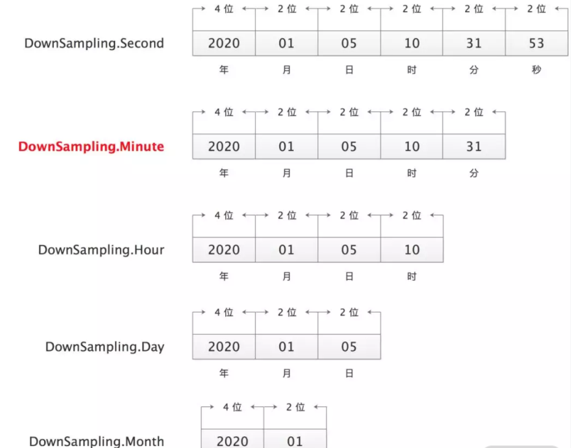
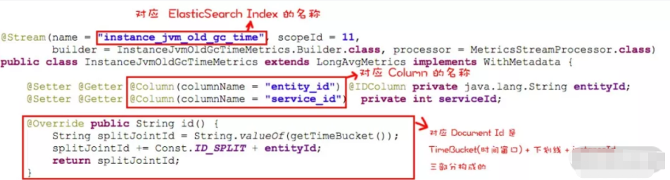
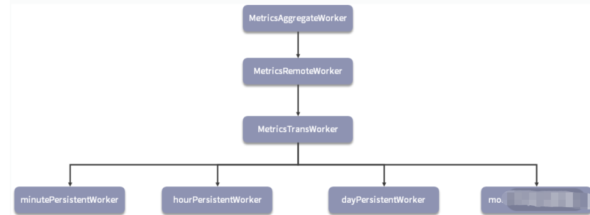
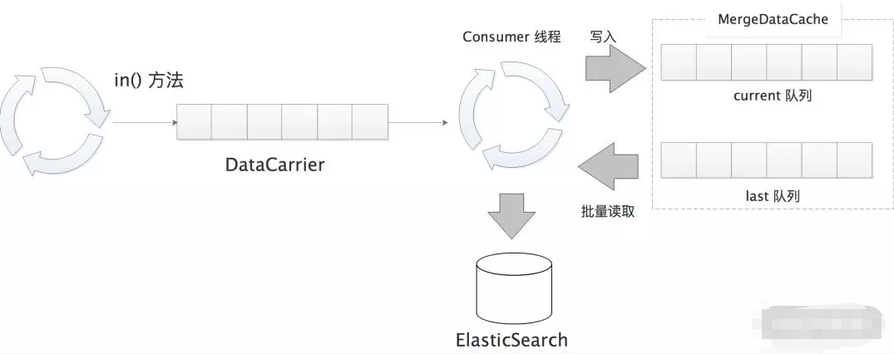
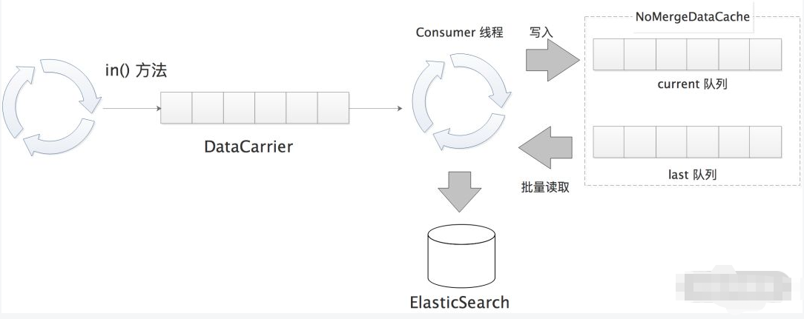

## 1. 开头

根据agent发送的数据类型，server负责接收数据的组件分为三种类型

* 注册接收组件
* jvm接收组件
* 链路接收组件

## 2. 注册组件

register-receiver-plugin 模块，它负责接收 SkyWalking Agent 发送的各类注册请求以及同步请求，处理的数据都是 RegisterSource 抽象类的子类。其中

* **ServiceInventory 抽象了服务注册的数据。**
* **ServiceInstanceInventory 抽象了服务实例注册的数据。**
* **EndpointInventory 抽象了 EndpointName 同步的数据。**
* **NetworkAddressInventory 抽象了 NetworkAddress 同步的数据。**

### 2.1. Service注册

#### 2.1.1. registerServiceHandler

在 RegisterServerModule 启动时会注册多个 GRPCHandler 和 JettyHandler，这里我们重点关注其中两个,其它handler用于其它版本的数据格式。

```
    @Override
    public void start() {
        GRPCHandlerRegister grpcHandlerRegister = getManager().find(SharingServerModule.NAME)
                                                              .provider()
                                                              .getService(GRPCHandlerRegister.class);
        ManagementServiceGRPCHandler managementServiceHTTPHandler = new ManagementServiceGRPCHandler(getManager());
        grpcHandlerRegister.addHandler(managementServiceHTTPHandler);
        grpcHandlerRegister.addHandler(new ManagementServiceGrpcHandlerCompat(managementServiceHTTPHandler));

        HTTPHandlerRegister httpHandlerRegister = getManager().find(SharingServerModule.NAME)
                                                              .provider()
                                                              .getService(HTTPHandlerRegister.class);
        httpHandlerRegister.addHandler(new ManagementServiceHTTPHandler(getManager()),
                                       Collections.singletonList(HttpMethod.POST)
        );
    }
```

* RegisterServiceHandler

  用于接收服务注册请求、服务实例注册请求以及同步请求。继承了 gRPC 为 Register 接口提供 Server 端辅助类 RegisterGrpc.RegisterImplBase

  ```
  public class ManagementServiceGRPCHandler extends ManagementServiceGrpc.ManagementServiceImplBase implements GRPCHandler {
      private final ManagementServiceHandler handler;
  
      public ManagementServiceGRPCHandler(ModuleManager moduleManager) {
          handler = new ManagementServiceHandler(moduleManager);
      }
  
      @Override
      public void reportInstanceProperties(final InstanceProperties request,
                                           final StreamObserver<Commands> responseObserver) {
          responseObserver.onNext(handler.reportInstanceProperties(request));
          responseObserver.onCompleted();
      }
  
      @Override
      public void keepAlive(final InstancePingPkg request, final StreamObserver<Commands> responseObserver) {
          responseObserver.onNext(handler.keepAlive(request));
          responseObserver.onCompleted();
      }
  }
  ```

  * org.apache.skywalking.oap.server.receiver.register.provider.handler.v8.ManagementServiceHandler

    ```
     public Commands reportInstanceProperties(final InstanceProperties request) {
            ServiceInstanceUpdate serviceInstanceUpdate = new ServiceInstanceUpdate();
            final String serviceName = namingControl.formatServiceName(request.getService());
            final String instanceName = namingControl.formatInstanceName(request.getServiceInstance());
            serviceInstanceUpdate.setServiceId(IDManager.ServiceID.buildId(serviceName, true));
            serviceInstanceUpdate.setName(instanceName);
    
            JsonObject properties = new JsonObject();
            List<String> ipv4List = new ArrayList<>();
            request.getPropertiesList().forEach(prop -> {
                if (InstanceTraffic.PropertyUtil.IPV4.equals(prop.getKey())) {
                    ipv4List.add(prop.getValue());
                } else {
                    properties.addProperty(prop.getKey(), prop.getValue());
                }
            });
            properties.addProperty(InstanceTraffic.PropertyUtil.IPV4S, String.join(",", ipv4List));
            serviceInstanceUpdate.setProperties(properties);
            serviceInstanceUpdate.setTimeBucket(
                TimeBucket.getTimeBucket(System.currentTimeMillis(), DownSampling.Minute));
            sourceReceiver.receive(serviceInstanceUpdate);
    
            return Commands.newBuilder().build();
        }
    ```

  * sourceReceiverImpl

    ```
    public class SourceReceiverImpl implements SourceReceiver {
        @Getter
        private final DispatcherManager dispatcherManager;
    
        public SourceReceiverImpl() {
            this.dispatcherManager = new DispatcherManager();
        }
    
        @Override
        public void receive(ISource source) {
            dispatcherManager.forward(source);
        }
    
    ```

  * dispatcherMangaer

    ```
    public class DispatcherManager implements DispatcherDetectorListener {
    
        private static final Logger LOGGER = LoggerFactory.getLogger(DispatcherManager.class);
    
        private Map<Integer, List<SourceDispatcher>> dispatcherMap;
    
        public DispatcherManager() {
            this.dispatcherMap = new HashMap<>();
        }
    
        public void forward(ISource source) {
            if (source == null) {
                return;
            }
    
            List<SourceDispatcher> dispatchers = dispatcherMap.get(source.scope());
    
            /**
             * Dispatcher is only generated by oal script analysis result.
             * So these will/could be possible, the given source doesn't have the dispatcher,
             * when the receiver is open, and oal script doesn't ask for analysis.
             */
            if (dispatchers != null) {
                source.prepare();
                for (SourceDispatcher dispatcher : dispatchers) {
                    dispatcher.dispatch(source);
                }
            }
        }
    ```

  * 这个dispatcher和class的关系是通过scan时初始化进去的

    通过扫描父类泛型种的对象的注解定义。

    ```
        public void scan() throws IOException, IllegalAccessException, InstantiationException {
            ClassPath classpath = ClassPath.from(this.getClass().getClassLoader());
            ImmutableSet<ClassPath.ClassInfo> classes = classpath.getTopLevelClassesRecursive("org.apache.skywalking");
            for (ClassPath.ClassInfo classInfo : classes) {
                Class<?> aClass = classInfo.load();
    
                addIfAsSourceDispatcher(aClass);
            }
        }
    ```

    

* ServiceInstancePingServiceHandler

  用于接收心跳请求。

#### 2.1.2. StreamAnnotationListener

#### 2.1.3. ManagementStreamProcessor

#### 2.1.4. ManagementPersistentWorker

#### 2.1.5. RegisterRemoteWorker

#### 2.1.6. 小结

处理服务注册请求的 RegisterServiceHandler， ServiceInventory 对服务注册数据的抽象、@Stream 注解的工作原理。最后介绍了 InventoryStreamProcessor 处理服务注册请求的核心流程， RegisterDistinctWorker 实现的 “L1 级别聚合”、RegisterRemoteWorker实现跨节点交互以及底层的选择策略和双队列实现、RegisterPersistentWorker 实现的 “L2 级别聚合”以及底层持久化的相关操作


**PS:service元信息存储位置sw_service_traffic-***

### 2.2. Instance注册

更新元数据

```
@ScopeDeclaration(id = SERVICE_INSTANCE_UPDATE, name = "ServiceInstanceUpdate")
@ScopeDefaultColumn.VirtualColumnDefinition(fieldName = "entityId", columnName = "entity_id", isID = true, type = String.class)
public class ServiceInstanceUpdate extends Source {
    @Override
    public int scope() {
        return SERVICE_INSTANCE_UPDATE;
    }

    @Override
    public String getEntityId() {
        return IDManager.ServiceInstanceID.buildId(serviceId, name);
    }

    @Getter
    @Setter
    @ScopeDefaultColumn.DefinedByField(columnName = "service_id")
    private String serviceId;
    @Getter
    @Setter
    @ScopeDefaultColumn.DefinedByField(columnName = "name", requireDynamicActive = true)
    private String name;
    @Getter
    @Setter
    private JsonObject properties;
}
```

### 2.3. NetWorkAddress和EndpointName

​	Agent 将 Trace 数据中用到的 NetworkAddress、EndpointName 等字符串信息定时同步到后端 OAP，然后由后端 OAP 集群为其统一分配全局唯一的 ID。之后，在 Agent 上报数据时，会使用这些全局唯一 ID 替换相应的字符串，从而提高上报消息的有效负载，提高传输效率

​	当 Agent 在使用 NetworkAddress 时，例如，创建 Exitpan 的时候会记录 remotePeer 信息，remotePeer 一般是 Host + Port 或 URL等字符串数据，该信息会暂存在 NetworkAddressDictionary 中，并定期发送 NetworkAddress 同步请求与 OAP 同步。
NetworkAddress 同步请求的处理流程如下：

* 查找指定 NetworkAddress 字符串在 network_address_inventory 索引中的对应 ID（addressId）。查询时先查询 NetworkAddressInventoryCache 缓存，再查询底层的 ElasticSearch 索引。若查找失败，会通过 InventoryStreamProcessor在 network_address_inventory 索引中为该 NetworkAddress 字符串生成相应 ID，此时getOrCreate() 方法返回 0；若查找 addressId 成功，继续执行步骤 2。
* 根据步骤 1 得到的 addressId 以及 NetworkAddress 字符串，在 service_inventory 索引中查找 NetworkAddress 与服务之间的绑定关系。若查找失败，则通过 InventoryStreamProcessor 创建这个绑定关系；若查询成功，则继续执行步骤 3。
* 根据步骤 2 查询到的 ServiceId 以及 addressId，在 service_instance_inventory 索引中查找该 NetworkAddress 与服务实例的绑定关系。若查询失败，则由 InventoryStreamProcessor 创建该绑定关系；若查询成功，则返回步骤 1 中得到的addressId。

从上述流程来看，一个 NetworkAddress 字符串除了在 network_address_inventory 索引中分配唯一对应的 addressId 外，还会在 service_inventory 和 service_instance_inventory 两个索引中创建与服务、服务实例的绑定。
处理 EndpointName同步请求的流程与处理服务注册请求的逻辑类似

### 2.4. 心跳请求

完成服务注册以及服务实例的注册之后，Agent 会定时调用 ServiceInstancePing.doPing() 这个 gRPC 接口发送心跳请求，以通知后端 OAP 集群当前 Agent 的在线状态。

 RegisterModuleProvider.start() 方法，它不仅将前面分析的 RegisterServiceHandler 注册到 GRPCServer 上，同时还会将处理心跳请求的 ServiceInstancePingServiceHandler 注册上去。
ServiceInstancePingServiceHandler.doPing() 方法会从心跳请求中解析出客户端对应的 ServiceId 以及 ServiceInstanceId，然后更新服务和服务实例的 heartbeat_time 字段，大致实现如下：

这个时老版本的方式

```
public void doPing(ServiceInstancePingPkg request, 
         StreamObserver<Commands> responseObserver) {
    // 从心跳请求中获取 serviceInstanceId
    int serviceInstanceId = request.getServiceInstanceId(); 
    // 心跳请求的发送时间
    long heartBeatTime = request.getTime();
    // 更新服务实例的心跳时间(service_instance_inventory索引中相应Document
    // 的heartbeat_time字段） 
    serviceInstanceInventoryRegister.heartbeat(serviceInstanceId, 
        heartBeatTime);
    ServiceInstanceInventory serviceInstanceInventory = 
        serviceInstanceInventoryCache.get(serviceInstanceId);
    if (Objects.nonNull(serviceInstanceInventory)) {
        // 更新相应服务的心跳时间(service_inventory索引中相应Document的
        // heartbeat_time字段）
        serviceInventoryRegister.heartbeat(
          serviceInstanceInventory.getServiceId(), heartBeatTime);
    } else {
        logger.warn("...", serviceInstanceId);
    }
    responseObserver.onNext(Commands.getDefaultInstance());
    responseObserver.onCompleted();
}
```


新版的方式

```
  public Commands keepAlive(final InstancePingPkg request) {
        final long timeBucket = TimeBucket.getTimeBucket(System.currentTimeMillis(), DownSampling.Minute);
        final String serviceName = namingControl.formatServiceName(request.getService());
        final String instanceName = namingControl.formatInstanceName(request.getServiceInstance());
        final Layer layer = identifyInstanceLayer(request.getLayer());

        ServiceInstanceUpdate serviceInstanceUpdate = new ServiceInstanceUpdate();
        serviceInstanceUpdate.setServiceId(IDManager.ServiceID.buildId(serviceName, true));
        serviceInstanceUpdate.setName(instanceName);
        serviceInstanceUpdate.setTimeBucket(timeBucket);
        sourceReceiver.receive(serviceInstanceUpdate);

        ServiceMeta serviceMeta = new ServiceMeta();
        serviceMeta.setName(serviceName);
        serviceMeta.setTimeBucket(timeBucket);
        serviceMeta.setLayer(layer);
        sourceReceiver.receive(serviceMeta);

        return Commands.newBuilder().build();
    }
```

可以看出，心跳的发送不会发送properties额外的信息，指挥简单发送下时间等信息。

最后通过dipatcher放入到InstanceTraffic对应的MetricsStreamProcessor之中

这个InstanceTraffic和MetricsStreamProcessor对应关系就是之前Stream注解声明，在启动时就会被扫描放入进去。

而MetricsStreamProcessor的in方法就是讲数据放入到datacarirer队列之中

### 2.5. 总结

## 2. JVMMetric

它会定期通过 JMX 获取 JVM 监控信息，然后通过 JVMMetricReportService 这个 gRPC 接口上报到后端 OAP 集群。

### 2.1. JVMMetricReportServiceHandler

在 SkyWalking OAP 提供了 jvm-receiver-plugin 插件用于接收 Agent 发送的 JVMMetric 。

jvm-receiver-plugin 插件的 SPI 配置文件中指定的 ModuleDefine 实现是 JVMModule（名称为 receiver-jvm），ModuleProvider 实现是 JVMModuleProvider（名称为 default）。

在 JVMModuleProvider 的 start() 方法中会将 JVMMetricReportServiceHandler 注册到 GRPCServer JVMMetricReportServiceHandler 实现了 JVMMetric.proto 文件中定义的 JVMMetricReportService gRPC 接口，其 collect() 方法负责处理 JVMMetric 对象。
会通过 TimeBucket 工具类整理对齐每个 JVMMetric 所在的时间窗口，TimeBucket 会根据指定的 DownSampling 精度生成不同格式的时间窗口。

 

JVMMetricReportServiceHandler 中默认使用的 DownSampling 值为 Minute
接下来，JVMMetricReportServiceHandler 会将 JVMMetrics 交给 JVMSourceDispatcher 处理，JVMSourceDispatcher 会按照 CPU、Memory、MemoryPool、GC 四个大类对监控数据进行拆分并转发。

### 2.2. JVMSourceDispatcher 

```
public class JVMSourceDispatcher {
    private final SourceReceiver sourceReceiver;

    public JVMSourceDispatcher(ModuleManager moduleManager) {
        this.sourceReceiver = moduleManager.find(CoreModule.NAME).provider().getService(SourceReceiver.class);
    }

    public void sendMetric(String service, String serviceInstance, JVMMetric metrics) {
        long minuteTimeBucket = TimeBucket.getMinuteTimeBucket(metrics.getTime());

        final String serviceId = IDManager.ServiceID.buildId(service, true);
        final String serviceInstanceId = IDManager.ServiceInstanceID.buildId(serviceId, serviceInstance);

        this.sendToCpuMetricProcess(
            service, serviceId, serviceInstance, serviceInstanceId, minuteTimeBucket, metrics.getCpu());
        this.sendToMemoryMetricProcess(
            service, serviceId, serviceInstance, serviceInstanceId, minuteTimeBucket, metrics.getMemoryList());
        this.sendToMemoryPoolMetricProcess(
            service, serviceId, serviceInstance, serviceInstanceId, minuteTimeBucket, metrics.getMemoryPoolList());
        this.sendToGCMetricProcess(
            service, serviceId, serviceInstance, serviceInstanceId, minuteTimeBucket, metrics.getGcList());
        this.sendToThreadMetricProcess(
            service, serviceId, serviceInstance, serviceInstanceId, minuteTimeBucket, metrics.getThread());
        this.sendToClassMetricProcess(
                service, serviceId, serviceInstance, serviceInstanceId, minuteTimeBucket, metrics.getClazz());
    }
```

JVM GC 的监控数据为例进行分析。在 sendToGCMetricProcess() 方法中会将 GC 对象转换为 ServiceInstanceJVMGC 对象（ServiceInstanceJVMGC 中除了包含 GC 对象中的监控数据，还记录了 serviceId 以及 serviceInstanceId，也就明确了这些监控数据的归属）。然后， DispatcherManager 会将 ServiceInstanceJVMGC 转发到相应的 SourceDispatcher。
同理，JVMMetric 中关于 CPU、Memory、MemoryPool 的三类监控数据分别填充到了 ServiceInstanceJVMCPU、ServiceInstanceJVMMemory、ServiceInstanceJVMMemoryPool 对象中

### 2.3. dispatcherManager

在 DispatchManager 中维护了一个 Map<Integer, List> 集合，该集合记录了各个 Source 类型对应的 Dispatcher 实现，其中 Key 是 Source 类型对应的 scope 值，Source 的不同子类对应不同的 scope 值，例如：ServiceInstanceJVMGC 对应的 scope 值为 11，ServiceInstanceJVMCPU 对应的 scope 值为 8。其中的 Value 是处理该 Source 子类的 Dispatcher 集合，例如：ServiceInstanceJVMGCDispatcher 就是负责分发 ServiceInstanceJVMGC 的 SourceDispatcher 实现，ServiceInstanceJVMGCDispatcher 的定义如下：

```
public class ServiceInstanceJVMGCDispatcher 
     implements SourceDispatcher<ServiceInstanceJVMGC> {...}
```

在 CoreModuleProvider 启动的时候（即 start() 方法），会扫描 classpath 下全部 SourceDispatcher 实现类，并识别其处理的 Source 子类类型进行分类并填充 Map<Integer, List> 集合。具体的扫描逻辑在 DispatcherManager.scan() 方法中，如果你感兴趣可以翻一下代码。

还有需要注意的是，这些 **SourceDispatcher 的部分实现是通过 OAL 脚本生成的**，这里先专注于监控指标的处理流程上。

回到 ServiceInstanceJVMGC 的处理流程上，默认与它对应的 SourceDispatcher 实现只有 ServiceInstanceJVMGCDispatcher，其 dispatch() 方法会将 ServiceInstanceJVMGC 对象转换成相应的 Metrics 对象，实现如下：

```
    private void doInstanceClrCpu(ServiceInstanceCLRCPU var1) {
        InstanceClrCpuMetrics var2 = new InstanceClrCpuMetrics();
        var2.setTimeBucket(var1.getTimeBucket());
        var2.setEntityId(var1.getEntityId());
        var2.setServiceId(var1.getServiceId());
        var2.combine(var1.getUsePercent(), (long)1);
        MetricsStreamProcessor.getInstance().in(var2);
    }

    public void dispatch(ISource var1) {
        ServiceInstanceCLRCPU var2 = (ServiceInstanceCLRCPU)var1;
        this.doInstanceClrCpu(var2);
    }

    public ServiceInstanceCLRCPUDispatcher() {
    }
```

这里的 doInstanceJvm*() 方法是将 ServiceInstanceJVMGC 转换成相应的 Metrics ，我们可以看到，在 ServiceInstanceJVMGC 中包含了 GCPhrase、GC 时间、 GC 次数三个维度的数据，而转换后的一个 Metrics 子类型只表示一个维度的监控数据

### 2.4. Metric

Metrics 抽象类是所有监控指标的顶级抽象，其中定义了一个 TimeBucket 字段（long 类型），用于记录该监控数据所在的分钟级窗口

 Metrics 子类，在 LongAvgMetrics 抽象类中增加了下面三个字段：

```
@Column private long summation; // 总和
@Column private int count; // 次数
@Column private long value; // 平均值
```

在 combine() 方法实现中，会将传入的 LongAvgMetrics 对象的 summation 和 count 字段累加到当前 LongAvgMetrics 对象中。在 calculate() 方法中会计算 value 字段的值：
this.value = this.summation / this.count;

下面会以 Old GC Time 监控数据继续分析，这里的 doInstanceJvmOldGcTime() 方法会将 ServiceInstanceJVMGC 转换成 InstanceJvmOldGcTimeMetrics，其中又添加了 serviceId 和 entityid（用于构造 Document Id，InstanceJvmOldGcTimeMetrics 中就是 serviceInstanceId）两个字段，用于记录该 GC 监控数据所属的服务实例：
@Column(columnName = "entity_id") @IDColumn private String entityId;
@Column(columnName = "service_id")  private int serviceId;

SkyWalking OAP 中很多其他类型的监控数据，例如：

* SumMetrics 计算的是时间窗口内的总和。
* MaxDoubleMetrics、MaxLongMetrics 计算的是时间窗口内的最大值。
* PercentMetrics 计算的是时间窗口内符合条件数据所占的百分比（即 match / total）。
* PxxMetrics 计算的是时间窗口内的分位数，例如： P99Metrics、P95Metrics、P70Metrics等。
* CPMMetrics 计算的是应用的吞吐量，默认是通过分钟级别的调用次数计算的

 

回到 GC 监控数据的处理流程中，在 doInstanceJvmOldGcTime() 方法完成监控数据粒度的细分之后，会将细分后的 InstanceJvmOldGcTimeMetrics 对象交给 MetricsStreamProcessor 处理

```
private void doInstanceJvmOldGcTime(ServiceInstanceJVMGC source) {
    // 创建 InstanceJvmOldGcTimeMetrics 对象
    InstanceJvmOldGcTimeMetrics metrics = 
          new InstanceJvmOldGcTimeMetrics();
    if (!new EqualMatch().setLeft(source.getPhrase())
            .setRight(GCPhrase.OLD).match()) {
        return;     // 只处理 Old GC
    }
    metrics.setTimeBucket(source.getTimeBucket()); // 分钟级别的时间窗口
    metrics.setEntityId(source.getEntityId()); // serviceInstanceId
    metrics.setServiceId(source.getServiceId()); // serviceId
    metrics.combine(source.getTime(), 1); // 记录 GC 时间，count 为1
    // 交给 MetricsStreamProcessor 继续后续处理
    MetricsStreamProcessor.getInstance().in(metrics);
}
```

### 2.5. MetricsStreamProcessor

MetricsStreamProcessor 处理 Metrics 数据的流程也有异曲同工之处。
MetricsStreamProcessor 中为每个 Metrics 类型维护了一个 Worker 链，如下所示：
private Map<Class<? extends Metrics>, MetricsAggregateWorker> entryWorkers = new HashMap<>();

MetricsStreamProcessor 初始化 entryWorkers 集合的核心逻辑也是在 create() 方法中，下图展示了 InstanceJvmOldGcTimeMetrics 对应的 Worker 链结构：

 

```
transWorker = new MetricsTransWorker(
    moduleDefineHolder, hourPersistentWorker, dayPersistentWorker);
```

在MetricsStreamProcessor 初始化的时候，会根据配置看是否是支持按天按小时进行统计，按分钟是默认的聚合统计方式创建出对应的MetricsPersistentWorker

```
// 创建 minutePersistentWorker
MetricsPersistentWorker minutePersistentWorker =   
  minutePersistentWorker(moduleDefineHolder, metricsDAO, model);
// 创建 MetricsTransWorker，后续 worker 指向 minutePersistenceWorker 对象(以及
// hour、day、monthPersistentWorker)
MetricsTransWorker transWorker = 
    new MetricsTransWorker(moduleDefineHolder, stream.name(), 
        minutePersistentWorker, hourPersistentWorker, 
            dayPersistentWorker, monthPersistentWorker);
// 创建 MetricsRemoteWorker，并将 nextWorker 指向上面的 MetricsTransWorker对象
MetricsRemoteWorker remoteWorker = new 
  MetricsRemoteWorker(moduleDefineHolder, transWorker, stream.name());
// 创建 MetricsAggregateWorker，并将 nextWorker 指向上面的
// MetricsRemoteWorker 对象
MetricsAggregateWorker aggregateWorker =
     new MetricsAggregateWorker(moduleDefineHolder, remoteWorker, 
         stream.name());
// 将上述 worker 链与指定 Metrics 类型绑定
entryWorkers.put(metricsClass, aggregateWorker);
```

其中 minutePersistentWorker 是一定会存在的，其他 DownSampling（Hour、Day、Month） 对应的 PersistentWorker 则会根据配置的创建并添加，在 CoreModuleProvider.prepare() 方法中有下面这行代码，会获取 Downsampling 配置并保存于 DownsamplingConfigService 对象中配置。后续创建上述 Worker 时，会从中获取配置的 DownSampling。

```
this.registerServiceImplementation(DownsamplingConfigService.class, new DownsamplingConfigService(moduleConfig.getDownsampling()));
```

配置中默认会创建hour和day

```
    downsampling:
      - Hour
      - Day
```

### 2.6. ReadWriteSafeCache

```
public class ReadWriteSafeCache<T> {
    /**
     * Pointer of read buffer.
     */
    private volatile BufferedData<T> readBufferPointer;
    /**
     * Pointer of write buffer.
     */
    private volatile BufferedData<T> writeBufferPointer;
    /**
     * Read/Write lock.
     */
    private final ReentrantLock lock;
```

#### 2.6.1. LimitedSizeBufferedData

#### 2.6.2. MergableBufferedData

### 2.7. MetricsAggregateWorker

Worker 链中的第一个是 MetricsAggregateWorker，其功能就是进行简单的聚合。

MetricsAggregateWorker 在收到 Metrics 数据的时候，会先写到内部的 DataCarrier 中缓存，然后由 Consumer 线程（都属于名为 “METRICS_L1_AGGREGATION” 的 BulkConsumePool）消费并进行聚合，并将聚合结果写入到 MergeDataCache 中的 current 队列暂存。
同时，Consumer 会定期（默认1秒，通过 METRICS_L1_AGGREGATION_SEND_CYCLE 配置修改）触发 current 队列和 last 队列的切换，然后读取 last 队列中暂存的数据，并发送到下一个 Worker 中处理。
上图中写入 DataCarrier 的逻辑在前面已经分析过了，这里不再赘述。下面深入分析两个点：

Consumer 线程消费 DataCarrier 并聚合监控数据的相关实现。
Consumer 线程定期清理 MergeDataCache 缓冲区并发送监控数据的相关实现。

Consumer 线程在消费 DataCarrier 数据的时候，首先会进行 Metrics 聚合（即相同 Metrics 合并成一个），然后写入 MergeDataCache 中，实现如下：

```
    private void onWork(List<Metrics> metricsList) {
        metricsList.forEach(metrics -> {
            aggregationCounter.inc();
            mergeDataCache.accept(metrics);
        });

        flush();
    }
//将聚合后的 Metrics 写入 MergeDataCache 之后，Consumer 线程会每隔一秒将 MergeDataCache 中的数据发送到下一个 Worker 处理，相关实现如下
    private void flush() {
        long currentTime = System.currentTimeMillis();
        if (currentTime - lastSendTime > l1FlushPeriod) {
            mergeDataCache.read().forEach(
                data -> {
                    if (log.isDebugEnabled()) {
                        log.debug(data.toString());
                    }
                    nextWorker.in(data);
                }
            );
            lastSendTime = currentTime;
        }
    }
```

MetricsAggregateWorker 指向的下一个 Worker 是 MetricsRemoteWorker ，其实现与 RegisterRemoteWorker 类似，底层也是通过 RemoteSenderService 将监控数据发送到远端节点

### 2.8. MetricsTransWorker

MetricsRemoteWorker 之后的下一个 worker 是 MetricsTransWorker，其中有四个字段分别指向四个不同 Downsampling 粒度的 PersistenceWorker 对象，如下

```
private final MetricsPersistentWorker minutePersistenceWorker;
private final MetricsPersistentWorker hourPersistenceWorker;
private final MetricsPersistentWorker dayPersistenceWorker;
private final MetricsPersistentWorker monthPersistenceWorker;

MetricsTransWorker.in() 方法会根据上述字段是否为空，将 Metrics 数据分别转发到不同的 PersistenceWorker 中进行处理：
public void in(Metrics metrics) {
    // 检测 Hour、Day、Month 对应的 PersistenceWorker 是否为空，若不为空，
    // 则将 Metrics 数据拷贝一份并调整时间窗口粒度，交到相应的 
    // PersistenceWorker 处理，这里省略了具体逻辑
    // 最后，直接转发给 minutePersistenceWorker 进行处理
    if (Objects.nonNull(minutePersistenceWorker)) { 
        aggregationMinCounter.inc();
        minutePersistenceWorker.in(metrics);
    }
}
```

### 2.9. MetricsPersistentWorker

MetricsPersistentWorker 主要负责 Metrics 数据的持久化，其核心结构如下图所示

 

与的 MetricsAggregateWorker 处理流程类似，MetricsPersistentWorker 在接收到 Metrics 数据的时候先将其暂存到 DataCarrier 中，然后由后续 Consumer 线程消费。

```
    @Override
    public void in(Metrics metrics) {
        aggregationCounter.inc();
        dataCarrier.produce(metrics);
    }

```

Consumer 线程实际上调用的是 PersistenceWorker.onWork() 方法，PersistenceWorker是 MetricsPersistentWorker 的父类，继承关系如下图所示：

RecordPersistenceWorker 等子类在后面会详细分析。

#### 2.9.1. PersistenceWorker.onWork()  

PersistenceWorker.onWork() 方法的逻辑是将 Metrics 数据写入 MergeDataCache 中暂存，待其中积累的数据量到达阈值（固定值 1000）之后，会进行一次批量写入 ElasticSearch 的操作，如下所示

```
    private class PersistentConsumer implements IConsumer<Metrics> {
        @Override
        public void init(final Properties properties) {
			
        }

        @Override
        public void consume(List<Metrics> data) {
            MetricsPersistentWorker.this.onWork(data);
        }
```

```
public abstract class PersistenceWorker<INPUT extends StorageData> extends AbstractWorker<INPUT> {
    @Getter(AccessLevel.PROTECTED)
    private final ReadWriteSafeCache<INPUT> cache;

    PersistenceWorker(ModuleDefineHolder moduleDefineHolder, ReadWriteSafeCache<INPUT> cache) {
        super(moduleDefineHolder);
        this.cache = cache;
    }

    /**
     * Accept the input, and push the data into the cache.
     */
    void onWork(List<INPUT> input) {
        cache.write(input);
    }
```


#### 2.9.2. PersistenceTimer

coremodule初始化时start

```
 public void start(ModuleManager moduleManager, CoreModuleConfig moduleConfig) {
 		。。。。。。
        prepareExecutorService = Executors.newFixedThreadPool(moduleConfig.getPrepareThreads());
        if (!isStarted) {
            Executors.newSingleThreadScheduledExecutor()
                     .scheduleWithFixedDelay(
                         new RunnableWithExceptionProtection(
                             () -> extractDataAndSave(batchDAO).join(),//定时读取内存队列，存储
                             t -> log.error("Extract data and save failure.", t)
                         ), 5, moduleConfig.getPersistentPeriod(), TimeUnit.SECONDS
                     );

            this.isStarted = true;
        }
        。。。。。
    }
```

刷新至数据库或者es

```
private CompletableFuture<Void> extractDataAndSave(IBatchDAO batchDAO) {
      .............
      innerPrepareRequests = worker.buildBatchRequests();

     worker.endOfRound();

    // Execution stage
    HistogramMetrics.Timer executeLatencyTimer = executeLatency.createTimer();
    batchDAO.flush(innerPrepareRequests)
    .whenComplete(($1, $2) -> executeLatencyTimer.close());
    
	..............
}
```

### 2.10. 小结

JVMMetricReportServiceHandler 在收到 JVM Metrics 请求时，由 DispatcherManager 对 JVMMetric 进行分类（ CPU、Memory、MemoryPool、GC 四类）并转换成相应的 Source 对象，接下来根据 Source 类型查找相应的 SourceDispatcher 集合进行处理。
在 SourceDispatcher 中会将监控数据再次拆分，转换单一维度的 Metrics 对象，例如，在 ServiceInstanceJVMGCDispatcher 中会将 GC 监控拆分成 Old GC Time、Old GC Count、New GC Time、New GC Count 四类。之后，SourceDispatcher 会将 Metrics 对象传递给 MetricsStreamProcessor 中的 worker 进行处理。
MetricsAggregateWorker 通过 MergeDataCache 对 Metrics 数据进行暂存以及简单聚合。
MetricsRemoteWorker 通过底层的 RemoteSenderService 将 Metrics 数据送到 OAP 集群中的其他远端节点。
MetricsTransWorker 会将 Metrics 数据复制多份，转发到各个 DownSampling 对应的 MetricsPersistentWorker 中实现持久化。
MetricsPersistentWorker 会先将数据缓存在 MergeDataCache 中，当缓存数据量到达一定阈值，执行批量写入（或更新） ElasticSearch 操作，批量操作是通过 High Level Client 中的 BulkProcessor 实现的。

## 3. trace-metric

trace-receiver-plugin 插件同时支持处理 V1 和 V2 两个版本的 TraceSegment。本次分析指的是V2 版本 TraceSegment。

在 trace-receiver-plugin 插件的 SPI 文件中指定的 ModuleProvider 实现是 TraceModuleProvider，在 prepare() 方法中主要初始化 SegmentParseV2 解析器，SegmentParseV2 主要负责解析 TraceSegment 数据，具体实现后面会详细分析。
TraceModuleProvider 的 start() 方法核心是将 TraceSegmentReportServiceHandler 注册到 GRPCHandlerRegister 中。TraceSegmentReportServiceHandler 负责接收 Agent 发送来的 TraceSegment 数据，并调用 SegmentParseV2.parse() 方法进行解析

### 3.1. TraceModuleProvider

在 prepare() 方法中主要初始化 SegmentParseV2 解析器，SegmentParseV2 主要负责解析 TraceSegment 数据

TraceModuleProvider 的 start() 方法核心是将 TraceSegmentReportServiceHandler 注册到 GRPCHandlerRegister 中。TraceSegmentReportServiceHandler 负责接收 Agent 发送来的 TraceSegment 数据，并调用 SegmentParseV2.parse() 方法进行解析

```
    public void start() {
        GRPCHandlerRegister grpcHandlerRegister = getManager().find(SharingServerModule.NAME)
                                                              .provider()
                                                              .getService(GRPCHandlerRegister.class);
        HTTPHandlerRegister httpHandlerRegister = getManager().find(SharingServerModule.NAME)
                                                              .provider()
                                                              .getService(HTTPHandlerRegister.class);

        TraceSegmentReportServiceHandler traceSegmentReportServiceHandler = new TraceSegmentReportServiceHandler(getManager());
        grpcHandlerRegister.addHandler(traceSegmentReportServiceHandler);
        grpcHandlerRegister.addHandler(new TraceSegmentReportServiceHandlerCompat(traceSegmentReportServiceHandler));

        httpHandlerRegister.addHandler(new TraceSegmentReportHandler(getManager()),
                                       Collections.singletonList(HttpMethod.POST)
        );
    }
```

### 3.2. segmentParserService

创建segmentParserService解析器

```
public class TraceSegmentReportServiceHandler extends TraceSegmentReportServiceGrpc.TraceSegmentReportServiceImplBase implements GRPCHandler {
    private HistogramMetrics histogram;
    private CounterMetrics errorCounter;

    private ISegmentParserService segmentParserService;

    public TraceSegmentReportServiceHandler(ModuleManager moduleManager) {
        this.segmentParserService = moduleManager.find(AnalyzerModule.NAME)
                                                 .provider()
                                                 .getService(ISegmentParserService.class);
```

调用ParseService进行发送：

```
public class SegmentParserServiceImpl implements ISegmentParserService {
    private final ModuleManager moduleManager;
    private final AnalyzerModuleConfig config;
    @Setter
    private SegmentParserListenerManager listenerManager;

    @Override
    public void send(SegmentObject segment) {
        final TraceAnalyzer traceAnalyzer = new TraceAnalyzer(moduleManager, listenerManager, config);
        traceAnalyzer.doAnalysis(segment);
    }
}
```

创建traceAnalyzer的doAnalysis方法进行解析

```
public class TraceAnalyzer {
    private final ModuleManager moduleManager;
    private final SegmentParserListenerManager listenerManager;
    private final AnalyzerModuleConfig config;
    private List<AnalysisListener> analysisListeners = new ArrayList<>();

    public void doAnalysis(SegmentObject segmentObject) {
        if (segmentObject.getSpansList().size() == 0) {
            return;
        }

        createSpanListeners();//创建监听器

        notifySegmentListener(segmentObject);

        segmentObject.getSpansList().forEach(spanObject -> {
            if (spanObject.getSpanId() == 0) {
                notifyFirstListener(spanObject, segmentObject);
            }

            if (SpanType.Exit.equals(spanObject.getSpanType())) {
                notifyExitListener(spanObject, segmentObject);
            } else if (SpanType.Entry.equals(spanObject.getSpanType())) {
                notifyEntryListener(spanObject, segmentObject);
            } else if (SpanType.Local.equals(spanObject.getSpanType())) {
                notifyLocalListener(spanObject, segmentObject);
            } else {
                log.error("span type value was unexpected, span type name: {}", spanObject.getSpanType()
                                                                                          .name());
            }
        });

        notifyListenerToBuild();
    }
```

### 3.3. SegmentAnalyse

#### 3.3.1. segmentAnalysisListener

这个notifyListener的监听器有多个

他们是有对应的工厂创建的，这个些工厂是在AnalyzerModuleProvider初始化的时候创建进去的

```

    private SegmentParserListenerManager listenerManager() {
        SegmentParserListenerManager listenerManager = new SegmentParserListenerManager();
        if (moduleConfig.isTraceAnalysis()) {
            listenerManager.add(new RPCAnalysisListener.Factory(getManager()));
            listenerManager.add(new EndpointDepFromCrossThreadAnalysisListener.Factory(getManager()));
            listenerManager.add(new NetworkAddressAliasMappingListener.Factory(getManager()));
        }
        listenerManager.add(new SegmentAnalysisListener.Factory(getManager(), moduleConfig));

        return listenerManager;
    }
```

TraceAnalyzer会利用这些工厂创建对应的listener。createSpanListeners

```
    private void createSpanListeners() {
        listenerManager.getSpanListenerFactories()
                       .forEach(
                           spanListenerFactory -> analysisListeners.add(
                               spanListenerFactory.create(moduleManager, config)));
    }
```

这个是去其中SegmentAnalysisListener分析监听器创建方法

```
@Override
public AnalysisListener create(ModuleManager moduleManager, AnalyzerModuleConfig config) {
    return new SegmentAnalysisListener(
        sourceReceiver,
        sampler,
        forceSampleErrorSegment,
        namingControl,
        searchTagKeys,
        segmentStatusAnalyzer
    );
}
```

SegmentAnalysisListener分析有多个重要的字段，它被TraceAnalyzer的notice方法调用，进行填充

```
    private final SourceReceiver sourceReceiver;
    private final TraceSegmentSampler sampler;
    private final boolean forceSampleErrorSegment;
    private final NamingControl namingControl;
    private final List<String> searchableTagKeys;
    private final SegmentStatusAnalyzer segmentStatusAnalyzer;

    private final Segment segment = new Segment();
    private SAMPLE_STATUS sampleStatus = SAMPLE_STATUS.UNKNOWN;
    private String serviceName = Const.EMPTY_STRING;
    private String serviceId = Const.EMPTY_STRING;
    private String endpointId = Const.EMPTY_STRING;
    private String endpointName = Const.EMPTY_STRING;
    private long startTimestamp;
    private long endTimestamp;
    private int duration;
    private boolean isError;

```

其它的分析器也是，也会被调用，进行填充

比如

```
public class EndpointDepFromCrossThreadAnalysisListener extends CommonAnalysisListener implements ExitAnalysisListener, LocalAnalysisListener {
    private final SourceReceiver sourceReceiver;
    private final AnalyzerModuleConfig config;
    private final NamingControl namingControl;

    private final List<EndpointDependencyBuilder> depBuilders = new ArrayList<>(10);

    @Override
    public boolean containsPoint(final Point point) {
        return Point.Exit.equals(point) || Point.Local.equals(point);
    }

    @Override
    public void parseExit(final SpanObject span, final SegmentObject segmentObject) {
        parseRefForEndpointDependency(span, segmentObject);
    }
```

#### 3.3.2. notifyListenerToBuild

填充好了之后会分别调用notifyListenerToBuild发送出去

```

    public void doAnalysis(SegmentObject segmentObject) {
        if (segmentObject.getSpansList().size() == 0) {
            return;
        }

        createSpanListeners();

        notifySegmentListener(segmentObject);

        segmentObject.getSpansList().forEach(spanObject -> {
            if (spanObject.getSpanId() == 0) {
                notifyFirstListener(spanObject, segmentObject);
            }

            if (SpanType.Exit.equals(spanObject.getSpanType())) {
                notifyExitListener(spanObject, segmentObject);
            } else if (SpanType.Entry.equals(spanObject.getSpanType())) {
                notifyEntryListener(spanObject, segmentObject);
            } else if (SpanType.Local.equals(spanObject.getSpanType())) {
                notifyLocalListener(spanObject, segmentObject);
            } else {
                log.error("span type value was unexpected, span type name: {}", spanObject.getSpanType()
                                                                                          .name());
            }
        });

        notifyListenerToBuild();
    }

    private void notifyListenerToBuild() {
        analysisListeners.forEach(AnalysisListener::build);
    }
```

比如segement会进行 sourceReceiver.receive(segment);

**这个segement就是发送的对象**

```
    public void build() {
        if (sampleStatus.equals(SAMPLE_STATUS.IGNORE)) {
            if (log.isDebugEnabled()) {
                log.debug("segment ignored, trace id: {}", segment.getTraceId());
            }
            return;
        }

        if (log.isDebugEnabled()) {
            log.debug("segment listener build, segment id: {}", segment.getSegmentId());
        }

        segment.setEndpointId(endpointId);

        sourceReceiver.receive(segment);
        addAutocompleteTags();
    }
```

#### 3.3.3. RecordStreamProcessor

和前面的逻辑类似，sourceReceiver会建立建立segemt和dispathcer的关系，处理segement的dispatcher就是

```
public class SegmentDispatcher implements SourceDispatcher<Segment> {

    @Override
    public void dispatch(Segment source) {
        SegmentRecord segment = new SegmentRecord();
        segment.setSegmentId(source.getSegmentId());
        segment.setTraceId(source.getTraceId());
        segment.setServiceId(source.getServiceId());
        segment.setServiceInstanceId(source.getServiceInstanceId());
        segment.setEndpointId(source.getEndpointId());
        segment.setStartTime(source.getStartTime());
        segment.setLatency(source.getLatency());
        segment.setIsError(source.getIsError());
        segment.setDataBinary(source.getDataBinary());
        segment.setTimeBucket(source.getTimeBucket());
        segment.setTags(Tag.Util.toStringList(source.getTags()));

        RecordStreamProcessor.getInstance().in(segment);
    }
}
```

SourceReceiver 底层封装的 DispatcherManager  会根据 Segment 选择相应的 SourceDispatcher 实现 —— SegmentDispatcher 进行分发。
SegmentDispatcher.dispatch() 方法中会将 Segment 中的数据拷贝到 SegmentRecord 对象中。
SegmentRecord 继承了 StorageData 接口，与前面介绍的 RegisterSource 以及 Metrics 的实现类似，通过注解指明了 Trace 数据存储的 index 名称的前缀（最终写入的 index 是由该前缀以及 TimeBucket 后缀两部分共同构成）以及各个字段对应的 field 名称，如下所示：

```
@SuperDataset
@Stream(name = SegmentRecord.INDEX_NAME, scopeId = DefaultScopeDefine.SEGMENT, builder = SegmentRecord.Builder.class, processor = RecordStreamProcessor.class)
public class SegmentRecord extends Record {

    public static final String INDEX_NAME = "segment";
    public static final String ADDITIONAL_TAG_TABLE = "segment_tag";
    public static final String SEGMENT_ID = "segment_id";
    public static final String TRACE_ID = "trace_id";
    public static final String SERVICE_ID = "service_id";
    public static final String SERVICE_INSTANCE_ID = "service_instance_id";
    public static final String ENDPOINT_ID = "endpoint_id";
    public static final String START_TIME = "start_time";
    public static final String LATENCY = "latency";
    public static final String IS_ERROR = "is_error";
    public static final String DATA_BINARY = "data_binary";
    public static final String TAGS = "tags";

    @Setter
    @Getter
    @Column(columnName = SEGMENT_ID, length = 150)
    private String segmentId;
    @Setter
    @Getter
    @Column(columnName = TRACE_ID, length = 150)
    @BanyanDB.GlobalIndex
    private String traceId;
    @Setter
    @Getter
    @Column(columnName = SERVICE_ID)
    @BanyanDB.ShardingKey(index = 0)
    private String serviceId;
    @Setter
    @Getter
    @Column(columnName = SERVICE_INSTANCE_ID)
    @BanyanDB.ShardingKey(index = 1)
    private String serviceInstanceId;
    @Setter
    @Getter
    @Column(columnName = ENDPOINT_ID)
    private String endpointId;
    @Setter
    @Getter
    @Column(columnName = START_TIME)
    private long startTime;
    @Setter
    @Getter
    @Column(columnName = LATENCY)
    private int latency;
    @Setter
    @Getter
    @Column(columnName = IS_ERROR)
    @BanyanDB.ShardingKey(index = 2)
    private int isError;
    @Setter
    @Getter
    @Column(columnName = DATA_BINARY, storageOnly = true)
    private byte[] dataBinary;
    @Setter
    @Getter
    @Column(columnName = TAGS, indexOnly = true)
    @SQLDatabase.AdditionalEntity(additionalTables = {ADDITIONAL_TAG_TABLE})
    private List<String> tags;
```

RecordStreamProcessor 的核心功能是为每个 Record 类型创建相应的 worker 链，这与前面介绍的 InventoryStreamProcessor 以及 MetricsStreamProcessor 类似。在 RecordStreamProcessor 中，每个 Record 类型对应的 worker 链中只有一个worker 实例 —— RecordPersistentWorker。

#### 3.3.4. RecordPersistentWorker

创建RecordPersistentWorker

```
   public void create(ModuleDefineHolder moduleDefineHolder, Stream stream, Class<? extends Record> recordClass) throws StorageException {
        final StorageBuilderFactory storageBuilderFactory = moduleDefineHolder.find(StorageModule.NAME)
                                                                              .provider()
                                                                              .getService(StorageBuilderFactory.class);
        final Class<? extends StorageBuilder> builder = storageBuilderFactory.builderOf(recordClass, stream.builder());

        StorageDAO storageDAO = moduleDefineHolder.find(StorageModule.NAME).provider().getService(StorageDAO.class);
        IRecordDAO recordDAO;
        try {
            recordDAO = storageDAO.newRecordDao(builder.getDeclaredConstructor().newInstance());
        } catch (InstantiationException | IllegalAccessException | NoSuchMethodException | InvocationTargetException e) {
            throw new UnexpectedException("Create " + stream.builder().getSimpleName() + " record DAO failure.", e);
        }

        ModelCreator modelSetter = moduleDefineHolder.find(CoreModule.NAME).provider().getService(ModelCreator.class);
        // Record stream doesn't read data from database during the persistent process. Keep the timeRelativeID == false always.
        Model model = modelSetter.add(
            recordClass, stream.scopeId(), new Storage(stream.name(), false, DownSampling.Second), true);
        RecordPersistentWorker persistentWorker = new RecordPersistentWorker(moduleDefineHolder, model, recordDAO);

        workers.put(recordClass, persistentWorker);
    }
```

与前面介绍的 MetricsPersistentWorker 类型，RecordPersistentWorker 负责 SegmentRecord 数据的持久化：

RecordPersistentWorker 有两个地方与 MetricsPersistentWorker 有些区别：

 

RecordPersistentWorker 中使用的 DataCache（以及 Window）实现是 NoMergeDataCache，它与 MergeDataCache 的唯一区别就是没有提供判断数据是否存在的 containKey() 方法，这样就只提供了缓存数据的功能，调用方无法合并重复数据。
当 NoMergeDataCache 中缓存的数据到达阈值之后，RecordPersistentWorker 会通过 RecordDAO 生成批量的 IndexRequest 请求，Trace 数据没有合并的情况，所以 RecordDAO 以及 IRecordDAO 接口没有定义 prepareBatchUpdate() 方法。

```
RecordDAO.perpareBatchInsert() 方法的具体实现如下：
public IndexRequest prepareBatchInsert(Model model, Record record) throws IOException {
    XContentBuilder builder = map2builder(storageBuilder.data2Map(record));
    // 生成的是最终 Index 名称，这里的 Index 由前缀字符串(即"segment")+TimeBucket 两部分构成
    String modelName = TimeSeriesUtils.timeSeries(model, record.getTimeBucket());
    // 创建 IndexRequest 请求
    return getClient().prepareInsert(modelName, record.id(), builder);
}
```

与 MetricsPersistentWorker 一样，RecordPersistentWorker 生成的全部 IndexRequest 请求会交给全局唯一的 BatchProcessEsDAO 实例批量发送到 ES ，完成写入。

### 3.4. 指标源数据解析

前面只是介绍了链路的处理，TraceAnalyzer在doAnalysis时处理其它指标信息

```
public void doAnalysis(SegmentObject segmentObject) {
    if (segmentObject.getSpansList().size() == 0) {
        return;
    }

    createSpanListeners();

    notifySegmentListener(segmentObject);

    segmentObject.getSpansList().forEach(spanObject -> {
        if (spanObject.getSpanId() == 0) {
            notifyFirstListener(spanObject, segmentObject);
        }

        if (SpanType.Exit.equals(spanObject.getSpanType())) {
            notifyExitListener(spanObject, segmentObject);
        } else if (SpanType.Entry.equals(spanObject.getSpanType())) {
            notifyEntryListener(spanObject, segmentObject);
        } else if (SpanType.Local.equals(spanObject.getSpanType())) {
            notifyLocalListener(spanObject, segmentObject);
        } else {
            log.error("span type value was unexpected, span type name: {}", spanObject.getSpanType()
                                                                                      .name());
        }
    });

    notifyListenerToBuild();
}
```

能够处理 TraceSegment 中的 TraceId、Entry 类型 Span 以及 Exit 类型 Span。按照前面 SegmentParseV2 解析 TraceSegment 的流程，下面将会按照 parseGlobalTraceId() 方法、parseEntry() 方法、parseExit() 方法、build() 方法的顺序依次介绍 MultiScopesSpanListener 逻辑


#### 3.4.1. 指标源数据解析

这里主要是trace中不同类型的数据，会按照如下的步骤进行封装数据和拆分

* notifyFirstListener

  span为0的span数据单独处理

* notifyExitListener

  span的类型为出口的数据

  会对应EndpointDepFromCrossThreadAnalysisListener和RPCAnalysisListener进行处理。

* notifyLocalListener

  本地方法的span数据

* notifyEntryListener

  入口span数据

* notifySegmentListener

  解析segment的数据


这些监听器会触发以下的几种类型的数据进行dispatch

* 跨线程数据

  EndpointMeta、Endpoint、EndpointRelation

  这三种数据由EndpointDepFromCrossThreadAnalysisListener构建

  主要是调用了parseRefForEndpointDependency进行构建

  RPCTrafficSourceBuilder

  主要是解析span.getRefs(i);每一个源头设置了源头服务元信息，被调用方的地址等信息

  最后创建EndpointDependencyBuilder对象

  注意这个是在exit类型的span中创建的

* 跨进程数据

  RPCTrafficSourceBuilder也是构建EndpointMeta、Endpoint、EndpointRelation这三种数据

  需要判断是ref是否有值

  ```
  sourceBuilder.setDestEndpointName(span.getOperationName());
  sourceBuilder.setDestServiceInstanceName(segmentObject.getServiceInstance());
  sourceBuilder.setDestServiceName(segmentObject.getService());
  sourceBuilder.setDestLayer(identifyServiceLayer(span.getSpanLayer()));
  sourceBuilder.setDetectPoint(DetectPoint.SERVER);
  sourceBuilder.setComponentId(span.getComponentId());
  ```

  ref没有值会填充固定值

  ```
  sourceBuilder.setSourceServiceName(Const.USER_SERVICE_NAME);
  sourceBuilder.setSourceServiceInstanceName(Const.USER_INSTANCE_NAME);
  sourceBuilder.setSourceEndpointName(Const.USER_ENDPOINT_NAME);
  ```

  最终build的时候会

  ```
  public void build() {
          callingInTraffic.forEach(callingIn -> {
              callingIn.prepare();
              sourceReceiver.receive(callingIn.toService());
              sourceReceiver.receive(callingIn.toServiceInstance());
              sourceReceiver.receive(callingIn.toServiceRelation());
              sourceReceiver.receive(callingIn.toServiceInstanceRelation());
              // Service is equivalent to endpoint in FaaS (function as a service)
              // Don't generate endpoint and endpoint dependency to avoid unnecessary costs.
              if (Layer.FAAS != callingIn.getDestLayer()) {        
                  sourceReceiver.receive(callingIn.toEndpoint());
                  EndpointRelation endpointRelation = callingIn.toEndpointRelation();
                  /*
                   * Parent endpoint could be none, because in SkyWalking Cross Process Propagation Headers Protocol v2,
                   * endpoint in ref could be empty, based on that, endpoint relation maybe can't be established.
                   * So, I am making this source as optional.
                   *
                   * Also, since 6.6.0, source endpoint could be none, if this trace begins by an internal task(local span or exit span), such as Timer,
                   * rather than, normally begin as an entry span, like a RPC server side.
                   */
                  if (endpointRelation != null) {
                      sourceReceiver.receive(endpointRelation);
                  }
              }
          });
  ```

  

* NetworkAddressAliasSetup

  保存了

  ```
  sourceReceiver.receive(networkAddressAliasSetup);
  ```

#### 3.4.2. 指标源数据解析

#### 3.4.3. 小结

TraceAnalyzer对SegmentObject数据进行分析

负责分析的为AnalysisListener的子类

一共由4大类：

* EndpointDepFromCrossThreadAnalysisListener

  负责解析 Point.Exit.equals(point) || Point.Local.equals(point)数据

* NetworkAddressAliasMappingListener

  负责解析 Point.Entry.equals(point)

* RPCAnalysisListener

  负责Point.Entry.equals(point) || Point.Exit.equals(point) || Point.Local.equals(point);

* SegmentAnalysisListener

  负责Point.First.equals(point) || Point.Entry.equals(point) || Point.Segment.equals(point)

不同的监听器有不同的功能，解析的数据也不一样

* TraceAnalyzer首先进行notifySegmentListener

  触发SegmentAnalysisListener进行parseSegment

* 遍历span解析

  * 如果是首个span

    触发SegmentAnalysisListener进行parseFirst解析

  * exit的span

    触发EndpointDepFromCrossThreadAnalysisListener、RPCAnalysisListener进行parseExit解析

  * entry的span

    触发SegmentAnalysisListener、RPCAnalysisListener、NetworkAddressAliasMappingListener进行parseEntry解析

  * Local的span

    触发RPCAnalysisListener的

以下是各种监听器的功能

* NetworkAddressAliasMappingListener

  生成跨进程调用时的别名元数据NetworkAddressAliasSetup，从entry的span中获取。

  对应es索引network_address_alias

* RPCAnalysisListener

  解析entry、exit、local

  生成Service、Endpoint、ServiceRelation、ServiceInstance、ServiceInstanceRelation、EndpointRelation等指标计算需要的元数据

  可以根据ref是否有值来填充对象

  注意出口和入口都解析，出口会根据ref来判断

  对应的索引比较多对应instance_traffic、service_traffic、serviceInstanceRelation_traffic这些都是元数据

  **注意oal也会生成这些对象对应的其它dispatcher，用于指标的生成。**

* EndpointDepFromCrossThreadAnalysisListener

  跨线程解析是exit的span。目前只在exit的数据中获取

  根据ref来判断是否生成（这里存在疑问，应该是在entry判断把）

  生成EndpointMeta、Endpoint、EndpointRelation

  对应EndpointTraffic的数据

* SegmentAnalysisListener

  解析第一个span。填充segment基本信息

  解析parseSegment，解析traceId、状态、时间等基础字段

  解析parseEntry的span，endpointName，serviceId等字段

