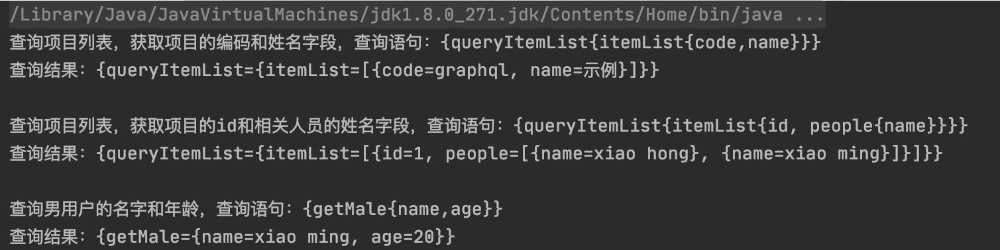
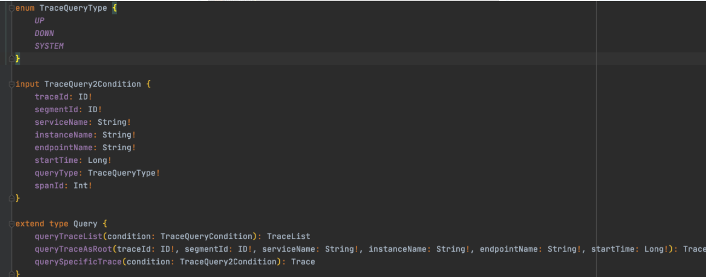
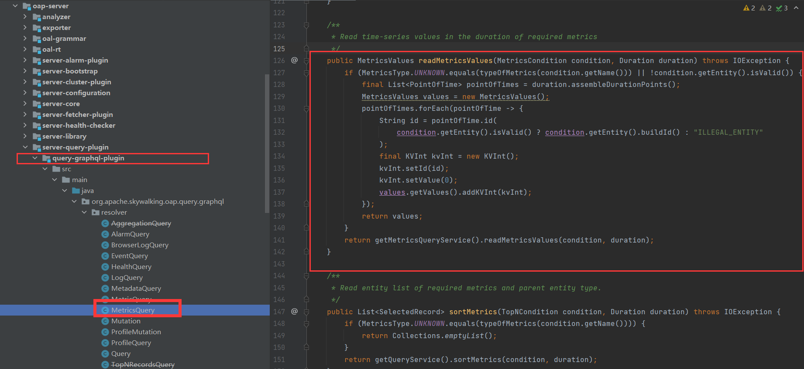
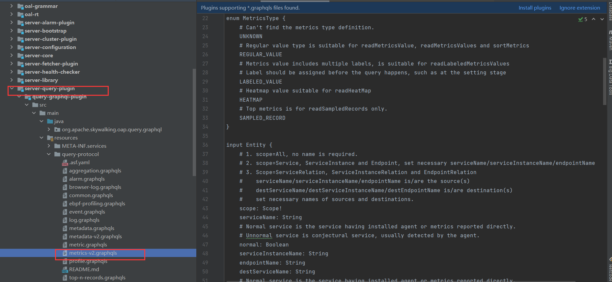
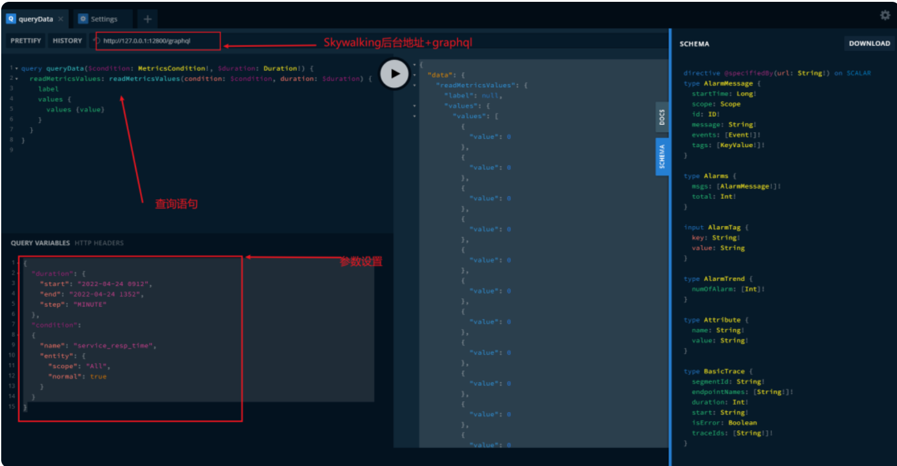

## 1. 开头

​	GraphQL是Facebook创立的一门开源的API查询语言，用于服务器端执行按已定义类型系统的查询，无关特定的数据库或存储引擎，由自己的代码支持。可以作为restful架构的替代方案。

### 1.1. Restful规范

restful规范约定了我们平常暴露资源的API的一种格式

**特点：**

- url描述唯一的资源
- url各部分应该是描述资源的名词，原则上尽量不使用动词
- url表示的资源变更的结果而不应该是个过程
- Http Method表示不同的动作
- 协议和数据格式一般采用的是http+json

**问题：**

* 过度获取

  开发了一个查询项目信息的接口(item/all)，可以检索所有的项目信息，前端会用一个table来展示。

  如果在另一个页面，有个下拉框展示项目列表，而我作为后端开发，为了省事，我可能会复用item/all这个接口给前端，不会再提供一个新的API。但是这个接口的每条数据都包含了项目的所有字段（比如，id，项目编码，项目名称，创建时间，描述等等）。但对于前端的这个下拉框来说，只需要id和项目名称可能就足够了，这也就是过度获取了。

* 调用多个接口

  如果前端获取项目信息时还需要获取该项目相关的人员信息，可能还能需要向后端再发一个请求来获取人员信息，就会出现这种频繁多次请求（当然，实际情况我们开发的时候，有可能会提供这样一个接口，返回一个复合数据结构包括项目和相关的人员信息等）。

* url过多

  restful中一个url标识一个资源，新增项目是一个url，查询是一个url，修改也是一个url，新增用户信息又是一个url，等等。

### 1.2. GraphQL应用场景

​	GraphQL就可以解决上面描述的这些问题。GraphQL并不限定必须在WEB中使用，但如果在web中使用，一般暴露一个API就够了，前端可以按需获取哪些字段的数据。可以这样认为，使用GraphQL的后端就像是一个数据源，而前端只需要指定哪些字段（像我们写sql去查询数据库一样），就可以获取哪些数据，由前端来驱动数据

### 1.3. 使用GraphQL示例

GraphQL提供多种语言的服务器端库。这里以java来说明，所以我会以一下最基本的示例来描述一下GraphQL的使用

#### 1.3.1. 引入包

```
   		<dependency>
            <groupId>com.graphql-java-kickstart</groupId>
            <artifactId>graphql-java-tools</artifactId>
            <version>11.0.1</version>
        </dependency>
```

#### 1.3.2. 定义schema

在类路径下创建一个item.graphqls

```
schema {
    # 查询
    query: Query
    # 更新
#    mutation: Mutation
}
 
# 定义一个查询类型
type Query {
    queryItemList: ItemList  # 定义查询项目列表，为了示例，这里就不传入参数了
    getMale: Personnel
    item: Item
}
 
# 定义人员信息类型
type Personnel {
    id: ID!   #人员id，指定是一个ID类型，且不为空 ID表示一个唯一字段，可以是string或integer
    name: String! #人员姓名
    age: Int # 人员年龄，可以为空
    isMale: Boolean! #是否为男姓
}
 
# 定义项目字段
type Item {
    id: ID!
    code: String!
    name: String!
    people: [Personnel!]! #人员信息，是一个数组/列表
}
 
type ItemList {
    itemList: [Item!]!  #获取项目列表
    total: Int!      # 获取项目总数
}
```

#### 1.3.3. 创建bean

```
@Data
public class Personnel {
    private long id;
    private String name;
    private int age;
    private boolean isMale;
}
 
 
@Data
public class Item {
    private long id;
    private String name;
    private String code;
    private List<Personnel> people;
}
 
 
@Data
public class ItemList {
    private List<Item> itemList;
    private int total;
}
```

#### 1.3.4. 定义Resolver

```
public class QueryResolver implements GraphQLQueryResolver {
    // 对应item.graphqls里的queryItemList
    public ItemList queryItemList() {
        ItemList itemList = new ItemList();
        itemList.setItemList(new ArrayList<Item>(){{
            add(item());
        }});
        itemList.setTotal(1);
        return itemList;
    }
 
    public Item item() {
        Item item = new Item();
        item.setId(1);
        item.setCode("graphql");
        item.setName("示例");
        item.setPeople(people());
        return item;
    }
 
    public List<Personnel> people() {
        return new ArrayList<Personnel>(){{
            add(getFemale());
            add(getMale());
        }};
    }
 
    // 返回一个female Personnel
    public Personnel getFemale() {
        Personnel personnel = new Personnel();
        personnel.setId(1);
        personnel.setName("xiao hong");
        personnel.setAge(18);
        personnel.setMale(false);
        return personnel;
    }
 
    // 返回一个male Personnel
    public Personnel getMale() {
        Personnel personnel = new Personnel();
        personnel.setId(2);
        personnel.setName("xiao ming");
        personnel.setAge(20);
        personnel.setMale(true);
        return personnel;
    }
}
```

#### 1.3.5. 运行

```
public class GraphQLExample {
 
    public static void main(String[] args) {
        GraphQLSchema graphQLSchema = SchemaParser.newParser()
            .file("item.graphqls")
            .resolvers(new QueryResolver())
//            .file("book.graphqls")
//            .resolvers(new BookResolver())  //其它定义继续增加
            .build().makeExecutableSchema();
 
        GraphQL graphQL = GraphQL.newGraphQL(graphQLSchema).build();
 
        // 查询项目列表，获取项目的编码和姓名字段，各字段不一定非要逗号分隔，空格，换行都行
        String query = "{queryItemList{itemList{code,name}}}";
        System.out.println("查询项目列表，获取项目的编码和姓名字段，查询语句：" + query);
        ExecutionResult executionResult = graphQL.execute(query);
        System.out.println("查询结果：" + executionResult.getData().toString());
        System.out.println();
 
        query = "{queryItemList{itemList{id, people{name}}}}";
        System.out.println("查询项目列表，获取项目的id和相关人员的姓名字段，查询语句：" + query);
        executionResult = graphQL.execute(query);
        System.out.println("查询结果：" + executionResult.getData().toString());
        System.out.println();
 
        query = "{getMale{name,age}}";
        System.out.println("查询男用户的名字和年龄，查询语句：" + query);
        executionResult = graphQL.execute(query);
        System.out.println("查询结果：" + executionResult.getData().toString());
        System.out.println();
    }
}
```

**运行结果：**

 

 

skywalking上开发一些功能的时候，它的后端是采用GraphQL

## 2. skywaking使用graphQL

Skywalking-OAP中GraphQL代码逻辑主要包-query-graphql-plugin下，以Mertrics信息的查询为例进行GraphQL

### 2.1. MetricsValues

oap-server/server-core/src/main/java/org/apache/skywalking/oap/srver/core/query/type/MetricsValues.java

这个为查询数据结构

```
public class MetricsValues {
    private String label;
    private IntValues values = new IntValues();
}
```

### 2.2. 定义查询服务

当前的查询Service和Dao结合进行数据库相关信息查询，和GraphQL无任何关系

oap-server/server-core/src/main/java/org/apache/skywalking/oap/server/core/query/MetricsQueryService.java

```
@Slf4j
public class MetricsQueryService implements Service {
  ......

    /**
     * Read time-series values in the duration of required metrics
     */
    public MetricsValues readMetricsValues(MetricsCondition condition, Duration duration) throws IOException {
        return getMetricQueryDAO().readMetricsValues(
            condition, ValueColumnMetadata.INSTANCE.getValueCName(condition.getName()), duration);
    }

    /**
     * Read value in the given time duration, usually as a linear.
     *
     * @param labels the labels you need to query.
     */
    public List<MetricsValues> readLabeledMetricsValues(MetricsCondition condition,
                                                        List<String> labels,
                                                        Duration duration) throws IOException {
        return getMetricQueryDAO().readLabeledMetricsValues(
            condition, ValueColumnMetadata.INSTANCE.getValueCName(condition.getName()), labels, duration);
    }

  ......
}
```

### 2.3. GraphQL查询接口

GraphQL是通过实现GraphQLQueryResolver来实现类似MVC中Controller层的代码逻辑 位置：

oap-server/server-query-plugin/query-graphql-plugin/src/main/java/org/apache/skywalking/oap/query/graphql/resolver/MetricsQuery.java

 

### 2.4. 初始化GraphQL 

oap-server/server-query-plugin/query-graphql-plugin/src/main/java/org/apache/skywalking/oap/query/graphql/GraphQLQueryProvider.java

```
    GraphQLSchema schema = SchemaParser.newParser()
                                           .file("query-protocol/common.graphqls")
                                           .resolvers(new Query(), new Mutation(), new HealthQuery(getManager()))
                                           .file("query-protocol/metadata.graphqls")
                                           .resolvers(new MetadataQuery(getManager()))
                                            // ...省略中间这一大堆重复代码
                                           .file("query-protocol/event.graphqls")
                                           .resolvers(new EventQuery(getManager()))
                                           .build()
                                           .makeExecutableSchema();
        this.graphQL = GraphQL.newGraphQL(schema).build();

```

加载所有module时，QueryMoulde初始化了GraphQL实例

### 2.5. 嵌入到http server

初始好了GraphQL实例，需要嵌套到一个Http Server里面。代码如下，还是在GraphQLProvider类里面

```
    public void start() throws ServiceNotProvidedException, ModuleStartException {
        JettyHandlerRegister service = getManager().find(CoreModule.NAME)
                                                   .provider()
                                                   .getService(JettyHandlerRegister.class);
        service.addHandler(new GraphQLQueryHandler(config.getPath(), graphQL));
    }
```

找到http的服务，然后添加为一个handler

而GraphQLQueryHandler为

```

@RequiredArgsConstructor
public class GraphQLQueryHandler extends JettyJsonHandler {
 
    @Override
    protected JsonElement doGet(HttpServletRequest req) {
        // 不支持GET请求
        throw new UnsupportedOperationException("GraphQL only supports POST method");
    }
 
    @Override
    protected JsonElement doPost(HttpServletRequest req) throws IOException {
        BufferedReader reader = new BufferedReader(new InputStreamReader(req.getInputStream()));
        String line;
        StringBuilder request = new StringBuilder();
        while ((line = reader.readLine()) != null) {
            request.append(line);
        }
 
        JsonObject requestJson = gson.fromJson(request.toString(), JsonObject.class);
        // 参数解析完毕，进行实际调用
        return execute(requestJson.get(QUERY)
                                  .getAsString(), gson.fromJson(requestJson.get(VARIABLES), mapOfStringObjectType));
    }
 
    private JsonObject execute(String request, Map<String, Object> variables) {
        try {
            ExecutionInput executionInput = ExecutionInput.newExecutionInput()
                                                          .query(request)
                                                          .variables(variables)
                                                          .build();
            ExecutionResult executionResult = graphQL.execute(executionInput);
            LOGGER.debug("Execution result is {}", executionResult);
            Object data = executionResult.getData();
            List<GraphQLError> errors = executionResult.getErrors();
            JsonObject jsonObject = new JsonObject();
            if (data != null) {
                // 调用结果
                jsonObject.add(DATA, gson.fromJson(gson.toJson(data), JsonObject.class));
            }
 
            // 异常处理
            if (CollectionUtils.isNotEmpty(errors)) {
                JsonArray errorArray = new JsonArray();
                errors.forEach(error -> {
                    JsonObject errorJson = new JsonObject();
                    errorJson.addProperty(MESSAGE, error.getMessage());
                    errorArray.add(errorJson);
                });
                jsonObject.add(ERRORS, errorArray);
            }
            return jsonObject;
        } catch (final Throwable e) {
            // 异常处理的代码，删除了
            return jsonObject;
        }
    }
}
```


### 2.6. 定义scheme

位于oap-server/server-query-plugin/query-graphql-plugin/src/main/resources/query-protocol/metrics-v2.graphql

```
type MetricsValues {
    # Could be null if no label assigned in the query condition
    label: String
    # Values of this label value.
    values: IntValues
}
```

 

和MetricsQuery中readMetricsValues定义完全一致

```
extend type Query {
    ...
    ...

    # Read value in the given time duration, usually as a linear.
    # labels: the labels you need to query.
    readMetricsValues(condition: MetricsCondition!, duration: Duration!): MetricsValues!
    ...
    ...
}
```

### 2.7. 查询测试

测试,工具-GraphQL Playground 查询语句

**查询语句：**

```
query queryData($condition: MetricsCondition!, $duration: Duration!) {
 	readMetricsValues: readMetricsValues(condition: $condition, duration: $duration) {
    label
    values {
      values {value}
    }
  }
}
```

**查询条件：**

```
{
  "duration": {
    "start": "2022-04-24 0912", 
    "end": "2022-04-24 1352", 
    "step": "MINUTE"
  },
  "condition": 
  {
    "name": "service_resp_time", 
    "entity": {
      "scope": "All", 
      "normal": true
    }
  }
}
```

**查询结果：**

```
{
  "data": {
    "readMetricsValues": {
      "label": null,
      "values": {
        "values": [
          {
            "value": 0
          },
        ...
        ]
      }
    }
  }
}
```

 


### 2.8. 查询测试


QueryModule