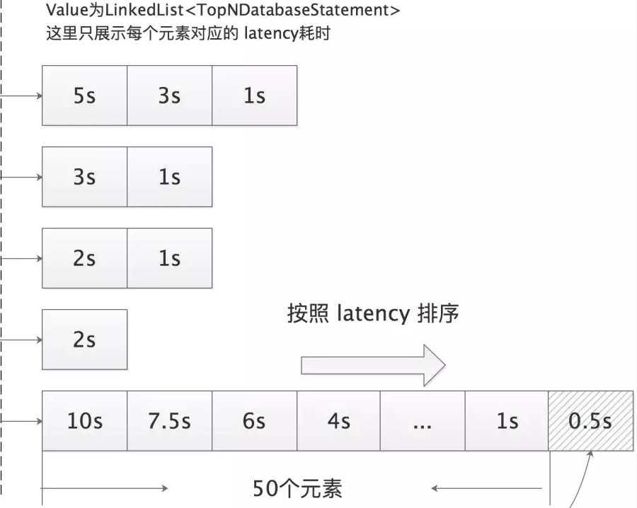

## 1. 开头

系统运行时，有些关键组件的数据如果出现性能很差，需要将其显示处理啊，这种数据就是topN数据

## 2. 数据模型

topN数据存储的抽象数据结构为

```
public abstract class TopN extends Record implements ComparableStorageData {
    public static final String STATEMENT = "statement";
    public static final String LATENCY = "latency";
    public static final String TRACE_ID = "trace_id";
    public static final String SERVICE_ID = "service_id";
    
    @Getter
    @Setter
    @Column(columnName = LATENCY, dataType = Column.ValueDataType.SAMPLED_RECORD)
    private long latency;
    @Getter
    @Setter
    @Column(columnName = TRACE_ID)
    private String traceId;
    @Getter
    @Setter
    @Column(columnName = SERVICE_ID)
    private String serviceId;

    @Override
    public int compareTo(Object o) {
        TopN target = (TopN) o;
        return (int) (latency - target.latency);
    }
```

它目前在skywalking中的只有db的topN，其实现类为：

```
@Stream(name = TopNDatabaseStatement.INDEX_NAME, scopeId = DefaultScopeDefine.DATABASE_SLOW_STATEMENT, builder = TopNDatabaseStatement.Builder.class, processor = TopNStreamProcessor.class)
public class TopNDatabaseStatement extends TopN {
    public static final String INDEX_NAME = "top_n_database_statement";

    @Setter
    private String id;
    @Getter
    @Setter
    @Column(columnName = STATEMENT, length = 2000, lengthEnvVariable = "SW_SLOW_DB_THRESHOLD", storageOnly = true)
    private String statement;

    @Override
    public String id() {
        return id;
    }

    @Override
    public boolean equals(Object o) {
        if (this == o)
            return true;
        if (o == null || getClass() != o.getClass())
            return false;
        TopNDatabaseStatement statement = (TopNDatabaseStatement) o;
        return getServiceId() == statement.getServiceId();
    }

    @Override
    public int hashCode() {
        return Objects.hash(getServiceId());
    }

    public static class Builder implements StorageHashMapBuilder<TopNDatabaseStatement> {

        @Override
        public TopNDatabaseStatement storage2Entity(Map<String, Object> dbMap) {
            TopNDatabaseStatement statement = new TopNDatabaseStatement();
            statement.setStatement((String) dbMap.get(STATEMENT));
            statement.setTraceId((String) dbMap.get(TRACE_ID));
            statement.setLatency(((Number) dbMap.get(LATENCY)).longValue());
            statement.setServiceId((String) dbMap.get(SERVICE_ID));
            statement.setTimeBucket(((Number) dbMap.get(TIME_BUCKET)).longValue());
            return statement;
        }

        @Override
        public Map<String, Object> entity2Storage(TopNDatabaseStatement storageData) {
            Map<String, Object> map = new HashMap<>();
            map.put(STATEMENT, storageData.getStatement());
            map.put(TRACE_ID, storageData.getTraceId());
            map.put(LATENCY, storageData.getLatency());
            map.put(SERVICE_ID, storageData.getServiceId());
            map.put(TIME_BUCKET, storageData.getTimeBucket());
            return map;
        }
    }
```

## 3. 数据处理机制

以db的topN为例。

### 3.1.  解析topN

和之前解析segment的监听器一致。

MultiScopesAnalysisListener会将span的db数据存储到DatabaseSlowStatementBuilder之中。

```
    private final List<DatabaseSlowStatementBuilder> dbSlowStatementBuilders = new ArrayList<>(10);
```

在parseExit的方法中,会判断是否为数据库，然后做一些逻辑处理

source的type是之前解析出来的

```
  switch (span.getSpanLayer()) {
            case Http:
                sourceBuilder.setType(RequestType.HTTP);
                break;
            case Database:
                sourceBuilder.setType(RequestType.DATABASE);
                break;
            case MQ:
                sourceBuilder.setType(RequestType.MQ);
                break;
            default:
                sourceBuilder.setType(RequestType.RPC);
                break;
        }
```

@Override
public void parseExit(SpanObject span, SegmentObject segmentObject) {
  if (RequestType.DATABASE.equals(sourceBuilder.getType())) {
            boolean isSlowDBAccess = false;

            DatabaseSlowStatementBuilder slowStatementBuilder = new DatabaseSlowStatementBuilder(namingControl);
            slowStatementBuilder.setServiceName(networkAddress);
            slowStatementBuilder.setId(segmentObject.getTraceSegmentId() + "-" + span.getSpanId());
            slowStatementBuilder.setLatency(sourceBuilder.getLatency());
            slowStatementBuilder.setTimeBucket(TimeBucket.getRecordTimeBucket(span.getStartTime()));
            slowStatementBuilder.setTraceId(segmentObject.getTraceId());
            for (KeyStringValuePair tag : span.getTagsList()) {
                if (SpanTags.DB_STATEMENT.equals(tag.getKey())) {
                    String sqlStatement = tag.getValue();
                    if (StringUtil.isNotEmpty(sqlStatement)) {
                        if (sqlStatement.length() > config.getMaxSlowSQLLength()) {
                            slowStatementBuilder.setStatement(sqlStatement.substring(0, config.getMaxSlowSQLLength()));
                        } else {
                            slowStatementBuilder.setStatement(sqlStatement);
                        }
                    }
                } else if (SpanTags.DB_TYPE.equals(tag.getKey())) {
                    String dbType = tag.getValue();
                    DBLatencyThresholdsAndWatcher thresholds = config.getDbLatencyThresholdsAndWatcher();
                    int threshold = thresholds.getThreshold(dbType);
                    if (sourceBuilder.getLatency() > threshold) {
                        isSlowDBAccess = true;
                    }
                }
            }
    
            if (StringUtil.isEmpty(slowStatementBuilder.getStatement())) {
                String statement = StringUtil.isEmpty(
                    span.getOperationName()) ? "[No statement]" : "[No statement]/" + span.getOperationName();
                slowStatementBuilder.setStatement(statement);
            }
            if (isSlowDBAccess) {
                dbSlowStatementBuilders.add(slowStatementBuilder);
            }
        }
        }
注意这里的逻辑为

* 注意从配置文件读取慢sql的阈值

  ```
  slowDBAccessThreshold: ${SW_SLOW_DB_THRESHOLD:default:200,mongodb:100} 
  ```

* 提取tag中的db的sql语句

* 判断耗时是否符合阈值要求

* 将sql封装放入到dbSlowStatementBuilders

   dbSlowStatementBuilders.add(slowStatementBuilder);

### 3.2. 构建topN的source

在build的时候和其它的source一起发送

```
dbSlowStatementBuilders.forEach(dbSlowStatBuilder -> {
    dbSlowStatBuilder.prepare();
    sourceReceiver.receive(dbSlowStatBuilder.toDatabaseSlowStatement());
});
```

```
  DatabaseSlowStatement toDatabaseSlowStatement() {
        DatabaseSlowStatement dbSlowStat = new DatabaseSlowStatement();
        dbSlowStat.setId(id);
        dbSlowStat.setTraceId(traceId);
        dbSlowStat.setDatabaseServiceId(IDManager.ServiceID.buildId(serviceName, type));
        dbSlowStat.setStatement(statement);
        dbSlowStat.setLatency(latency);
        dbSlowStat.setTimeBucket(timeBucket);
        return dbSlowStat;
    }
```

```
public class DatabaseStatementDispatcher implements SourceDispatcher<DatabaseSlowStatement> {

    @Override
    public void dispatch(DatabaseSlowStatement source) {
        TopNDatabaseStatement statement = new TopNDatabaseStatement();
        statement.setId(source.getId());
        statement.setServiceId(source.getDatabaseServiceId());
        statement.setLatency(source.getLatency());
        statement.setStatement(source.getStatement());
        statement.setTimeBucket(source.getTimeBucket());
        statement.setTraceId(source.getTraceId());

        TopNStreamProcessor.getInstance().in(statement);
    }
}

```

### 3.3. TopNStreamProcessor

TopNStreamProcessor 为每个 TopN 类型（其实只有 TopNDatabaseStatement）提供的 Worker 链中只有一个 Worker —— TopNWorker。与前文介绍的 MetricsPersistentWorker 以及 RecordPersistentWorker 类似，TopNWorker 也继承了 PersistenceWorker 抽象类，其结构如下图所示，TopNWorker 也是先将 TopNDatabaseStatement 暂存到 DataCarrier，然后由后台 Consumer 线程定期读取并调用 onWork() 方法进行处理。

### 3.4. TopNWorker

在 TopNWorker.onWorker() 方法中会将 TopNDatabaseStatement 暂存到 LimitedSizeDataCache 中进行排序。LimitedSizeDataCache 使用双队列模式，继承了 Windows 抽象类，与前文介绍的 MergeDataCache 类似。LimitedSizeDataCache 底层的队列实现是 LimitedSizeDataCollection，其 data 字段（Map 类型）中维护了每个存储服务的慢查询（即 TopNDatabaseStatement）列表，每个列表都是定长的（由 limitedSize 字段指定，默认 50），在调用 limitedSizeDataCollection.put() 方法写入的时候会按照 latency 从大到小排列，并只保留最多 50 个元素，如下图所示：

 

在 LimitedSizeDataCache 中缓存的慢查询是按照存储服务的维度进行分类、排序以及计算 TopN 的。
回到 TopNWorker，它覆盖了 PersistenceWorker 的 onWork() 方法，如下所示：

```
void onWork(TopN data) {
    limitedSizeDataCache.writing();
    try {
        limitedSizeDataCache.add(data);
    } finally {
        limitedSizeDataCache.finishWriting();
    }
}
```

### 3.5. PersistenceTimer

在 PersistenceWorker 的三个实现类中，MetricsPersistentWorker 和 RecordPersistentWorker 启动的 Consumer 直接使用了继承自 PersistenceWorker 的 onWork() 方法 ，该实现只会在 DataCache 缓存的数据到达一定阈值时，才会触发 ElasticSearch 的写入。

如果缓存量长时间达不到阈值，就会导致监控数据和 Trace 数据写入延迟。

另外，前面的介绍 TopNWorker.onWork() 实现只有写入 LimitedSizeDataCache 的逻辑，没有读取的逻辑。

因此，在各个模块初始化完成之后，会在 coreModuleProvider.notifyAfterCompleted() 方法中启动 PersistenceTimer（前面介绍的 GRPCServer 也是在此处启动的）

PersistenceTimer 中会启动一个后台线程定期（初始延迟为 1s，后续间隔为 3s）将三个 PersistenceWorker 实现中缓存的数据持久化到 ElasticSearch 中

大致实现如下所示（省略 Debug 级别的日志输出以及部分 try/catch 代码）：

```
private void extractDataAndSave(IBatchDAO batchDAO) {
    // 三个 PersistenceWorker 实现构成的列表
    List<PersistenceWorker> persistenceWorkers = new ArrayList<>();
    persistenceWorkers.addAll(MetricsStreamProcessor.getInstance().getPersistentWorkers());
    persistenceWorkers.addAll(RecordStreamProcessor.getInstance().getPersistentWorkers());
    persistenceWorkers.addAll(TopNStreamProcessor.getInstance().getPersistentWorkers());
    persistenceWorkers.forEach(worker -> {
        // 逐个 PersistenceWorker 实现的 flushAndSwitch()方法，
        // 其中主要是对 DataCache 队列的切换
        if (worker.flushAndSwitch()) {
            // 调用 PersistenceWorker.buildBatchCollection()为 DataCache中每个元素创建相应的 IndexRequest 以及 UpdateRequest 请求
            List<?> batchCollection = worker.buildBatchCollection();
            batchAllCollection.addAll(batchCollection);
        }
    });
    // 执行三个 PersistenceWorker 生成的全部 ElasticSearch 请求
    batchDAO.batchPersistence(batchAllCollection);
}
```

MetricsPersistentWorker 和 RecordPersistentWorker 中的 flushAndSwitch() 方法都继承自 PersistenceWorker，其主要功能是切换底层 DataCache 的 current 队列，这与 persistenceWorker.onWorker() 方法中的核心逻辑类似。
而 TopNWorker 覆盖了 flushAndSwitch() 方法，其中添加了执行频率的控制，大致实现如下：

```
public boolean flushAndSwitch() {
    long now = System.currentTimeMillis();
    if (now - lastReportTimestamp <= reportCycle) {
        return false; // 默认 10min 执行一次
    }
    lastReportTimestamp = now; // 重置 lastReportTimestamp
    return super.flushAndSwitch(); // 调用 PersistenceWorker 实现
}
```

