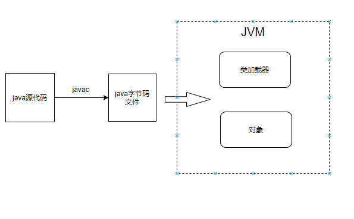
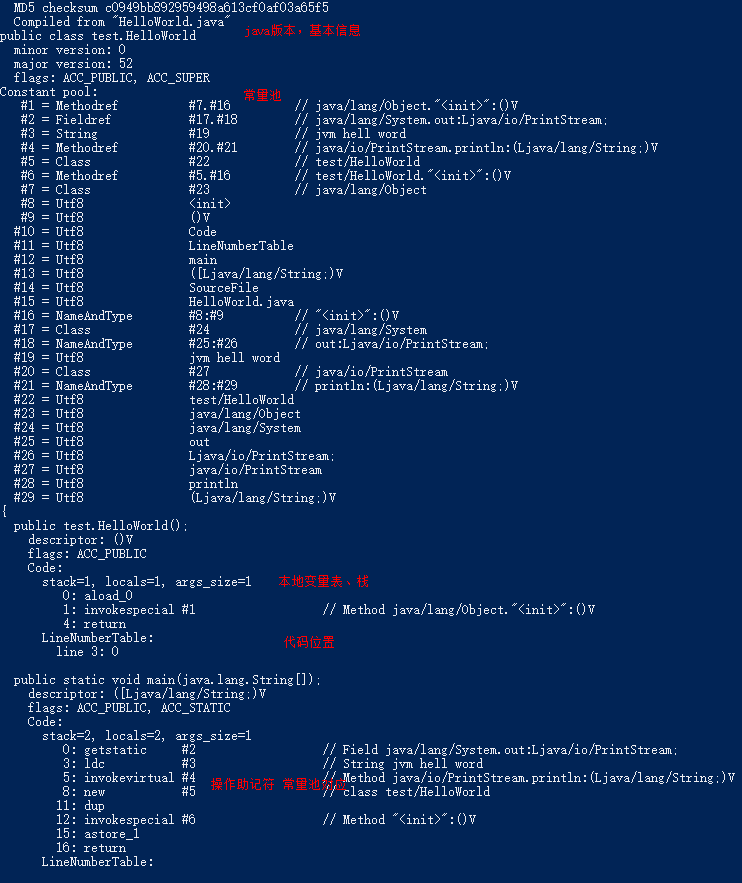
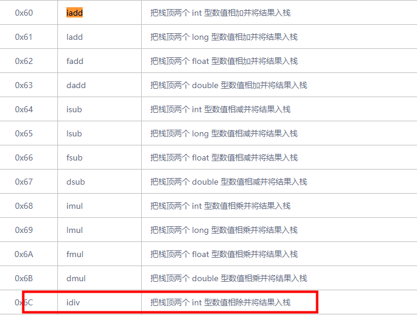
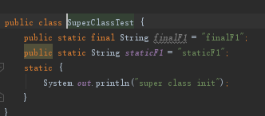
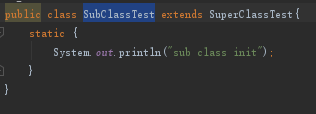
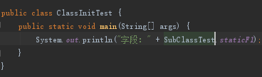
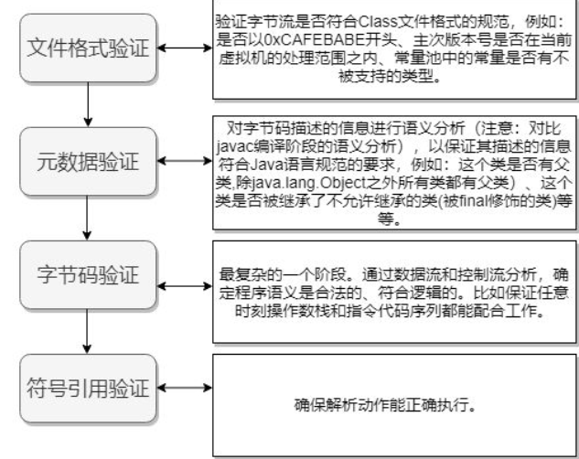

## 1. 概要  
### 1.1. 编程语言分类
&emsp;&emsp;我们知道编程语言可以根据不同的维度进行分类，比如
* 按照编程方式，面向对象、面向过程
* 是编译执行的还是解释执行的，比如html就是解释执行的，直接是源代码被解释器执行，java需要编译器编译成机器识别的语言。
* 有没有发生GC，比如java、go有GC，rust没有gc，但是编码很反人类，需要很熟徐rust设定的编程规则，rust创建的对象是再栈上的。
* 是动态语言还是静态语言，比如javascript等脚本语言就是动态语言，运行时才会检查变量的类型。

**小知识：  
&emsp;&emsp;动态语言看着代码更加简洁，使得开发者能够更加专注于逻辑。静态语言会提前编译明确了类型，能让编译器做一些优化，使得程序执行速度优化。而且避免运行时产生类型的错误。**

### 1.2.Java语言
&emsp;&emsp;Java是一种面向对象、有gc、静态的、编译执行的高级语言。  
&emsp;&emsp;java是在虚拟机运行的，做了“一次编译，到处运行”的效果，只需要这个系统安装的有虚拟机，具有很好的跨平台性。像c语言则需要针对不同平台编译，生成多种执行文件。而且java使用jvm来进行内存管理(gc)，c语言则需要自行管理内存，稍有不慎就可能内存泄露，go语言自己管理内存。  
&emsp;&emsp;如下图所示，java源码编译成java字节码文件，jvm类加载器将字节码文件加载至内存使得类的初始化。  
  
Java是编译成字节码文件，交给jvm运行的，这个字节码文件到底是什么样的呢？  


## 2. 字节码
### 2.1.什么是字节码

Java源代码经过虚拟机编译器编译后产生的文件（即扩展为.class的文件），它不面向任何特定的处理器，只面向虚拟机

#### 2.1.1. 采用字节码的好处

​	Java语言通过字节码的方式，在一定程度上解决了传统解释型语言执行效率低的问题，同时又保留了解释型语言可移植的特点。所以Java程序运行时比较高效，而且，由于字节码并不专对一种特定的机器，因此，Java程序无须重新编译便可在多种不同的计算机上运行

#### 2.1.2. 编译器和解释器

Java中引入了虚拟机的概念，即在机器和编译程序之间加入了一层抽象的虚拟机器。这台虚拟的机器在任何平台上都提供给编译程序一个的共同的接口。编译程序只需要面向虚拟机，生成虚拟机能够理解的代码，然后由解释器来将虚拟机代码转换为特定系统的机器码执行。在Java中，这种供虚拟机理解的代码叫做字节码（即扩展为.class的文件），它不面向任何特定的处理器，只面向虚拟机。每一种平台的解释器是不同的，但是实现的虚拟机是相同的。Java源程序经过编译器编译后变成字节码，字节码由虚拟机解释执行，虚拟机将每一条要执行的字节码送给解释器，解释器将其翻译成特定机器上的机器码，然后在特定的机器上运行，这就是上面提到的Java的特点的编译与解释并存的解释

```
Java源代码---->编译器---->jvm可执行的Java字节码(即虚拟指令)---->jvm---->jvm中解释器----->机器可执行的二进制机器码---->程序运行。
```

### 2.2.查看字节码
如图所示。我们写了个helloword代码，使用命令编译代码：javac HelloWorld.java，生成了编译后的文件。然后再使用命令查看字节码文件：javap -c -verbose HelloWorld.class    
    
如下图所示编译后的文件（助记符显示）   
  


我们可以直接使用classpy工具来分析class中的二进制文件和助记符之间对应关系，命令：java -jar .\classpy-0.7.jar .\HelloWorld.class    
    
如上图所示，前四个字节为魔术值，CA FE BA BE，代表是一个字节码文件；每一个方法都会创建本地变量表和栈来进行计算    

一些常见的指令如下：
* invokeinterface，接口引用调用的方法；
* invokevirtual，具体对象调用的方法；
* invokespecial，调用构造方法，比如本例中的new HelloWorld()；
* Invokestatic，调用静态方法；  


### 2.3. 栈和本地变量表  
  
我们通过工具可以看到这个操作运算转化为字节码后的运算过程如下：    
    
一些操作符如下:   
  


## 3. 类加载器  
      
&emsp;&emsp;顾名思义，类加载器就是来加载类的，我们在虚拟机唯一确认一个类是通过类加载器和这个类本身一同来确定的。比如定义的同一个class，被你自己自定义的两个不同的类加载器加载了，你使用instacneof，或者equals或者让它们或互相转换都是不相同的两个类。

### 3.1. 类加载器   
* 种类；  
  * 按照使用者的角度，一共有三种类加载器，根类加载、扩展类加载器、应用类加载器；
  * 按照jvm来看，只有根类加载器和其它类加载器，根类加载器加载java的核心代码，比如java.util等；

* 特点；  
  双亲委派机制，这里的双亲是历史原因翻译错误，应该是父辈委派，如果一个类加载器收到类加载的请求，它首先不会自己去尝试加载这个类，而是把这个请求委派给父类加载器完成。每个类加载器都是如此，只有当父加载器在自己的搜索范围内找不到指定的类时，子加载器才会尝试自己去加载。即判断父辈有没有加载，如果有加载就不加载，如果父辈没有加载，继续判断父辈的父辈，最终再从上而下，判断能不能加载，不能加载下沉至子辈。  

### 3.2. 类的生命周期 
类的加载并没有限制从哪里来，可以是从文件，网络，二进制字节流  

#### 3.2.1. 类的加载时机 
* 虚拟机启动加载main方法所在的类
* 遇到了new这样的指令时，加载new所对应的类
* 遇到了静态方法，加载静态方法所在的类
* 遇到了静态变量，加载静态变量所在类
* 如果子类有父类，则触发父类的初始化
* 反射调用，触发
  

**注意：**
* 通过子类引用父类的静态字段，不会导致子类的初始化
* 定义对象数组，不会触发该类的初始化
* 常量在编译期间会存入调用类的常量池中，本质上并没有直接引用定义常量的类，不会触发定义常量所在的类
* 通过类名获取 Class 对象，不会触发类的初始化，Hello.class 不会让 Hello 类初始化  
示例：    
    
    
      
控制台输出：  
    


#### 3.2.2. 类的加载过程  
    

上图所示，类的加载的过程

* **类加载**

  * **字节码来源**

    一般的加载来源包括从本地路径下编译生成的.class文件，从jar包中的.class文件，从远程网络，以及动态代理实时编译找到class文件加载，可以从多种地方来

  * **类加载器**

    一般包括**启动类加载器**，**扩展类加载器**，**应用类加载器**，以及用户的**自定义类加载器**

    **为什么会有自定义类加载器？**

    - 一方面是由于java代码很容易被反编译，如果需要对自己的代码加密的话，可以对编译后的代码进行加密，然后再通过实现自己的自定义类加载器进行解密，最后再加载。
    - 另一方面也有可能从非标准的来源加载代码，比如从网络来源，那就需要自己实现一个类加载器，从指定源进行加载。

* **链接**

  * **验证格式**

     

    语义规范等待，判断写法是否正确

    * **文件格式的验证**

      比如常量中是否有不被支持的常量？文件中是否有不规范的或者附加的其他信息？

    * **元数据的验证**

      比如该类是否继承了被final修饰的类？类中的字段，方法是否与父类冲突？是否出现了不合理的重载

    * **字节码的验证**

      保证程序语义的合理性，比如要保证类型转换的合理性

    * **符号引用的验证**

      比如校验符号引用中通过全限定名是否能够找到对应的类？校验符号引用中的访问性（private，public等）是否可被当前类访问

  * **准备**

    为静态变量分配内存，赋予默认值比如0,flase,null等。

    主要是为类变量（注意，不是实例变量）分配内存，并且赋予**初值**。

    特别需要注意，初值，不是代码中具体写的初始化的值，而是Java虚拟机根据不同变量类型的默认初始值。

    比如:

    8种**基本类型**的初值，默认为0；

    **引用类型**的初值则为null；

    **常量**的初值即为代码中设置的值，final static tmp = 456， 那么该阶段tmp的初值就是456

  * **解析**

    解析符号为直接引用。将常量池内的符号引用替换为直接引用的过程。

    两个重点：

    - **符号引用**。

       即一个字符串，但是这个字符串给出了一些能够唯一性识别一个方法，一个变量，一个类的相关信息。

    - **直接引用**。

      可以理解为一个内存地址，或者一个偏移量

      比如**类方法，类变量**的直接引用是指向方法区的**指针**

      而**实例方法，实例变量**的直接引用则是从实例的头指针开始算起到这个实例变量位置的**偏移量**

    **举个例子来说：**

    ​    现在调用方法hello()，这个方法的地址是1234567，那么hello就是符号引用，1234567就是直接引用。

    在解析阶段，虚拟机会把所有的类名，方法名，字段名这些符号引用替换为具体的内存地址或偏移量，也就是直接引用。

    **再比如：**

    ​      解析动作主要针对类或接口、字段、类方法、接口方法、方法类型、方法句柄和调用限定符7类符号引用进行。

    符号引用就是一组符号来描述目标，可以是任何字面量。**直接引用**就是直接指向目标的指针、相对偏移量或一个间接定位到目标的句柄。在程序实际运行时，只有符号引用是不够的，举个例子：在程序执行方法时，系统需要明确知道这个方法所在的位置。Java 虚拟机为每个类都准备了一张方法表来存放类中所有的方法。当需要调用一个类的方法的时候，只要知道这个方法在方发表中的偏移量就可以直接调用该方法了。通过解析操作符号引用就可以直接转变为目标方法在类中方法表的位置，从而使得方法可以被调用

* **初始化**

  静态变量赋值，静态代码块执行

  这个阶段主要是对**类变量**初始化，是执行类构造器的过程

  只对static修饰的变量或语句进行初始化

  如果初始化一个类的时候，其父类尚未初始化，则优先初始化其父类

  如果同时包含多个静态变量和静态代码块，则按照自上而下的顺序依次执行。

* **使用**

* **卸载**