## 1. 分析工具
## 1.1. 命令行工具
* jps/jinfo 查看java进程  
  jps -mlvV  
    
    
  查看某个java进程的jvm信息，包含版本，系统参数、jvm内存等配置信息  
  jinfo 28514  
  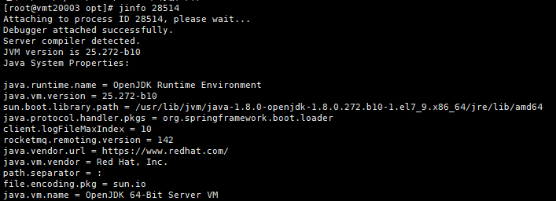  
  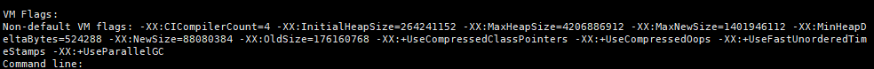    

* Jstat  
  查看进程的gc次数和大小  
  jstat -gc 28514 1000 10  
  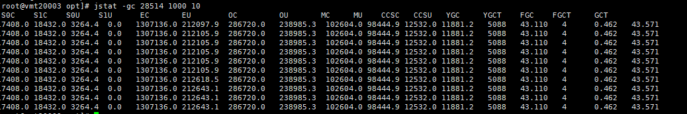    
  查看进程的内存占用大小和次数  
  jstat -gcutil 28514 1000 10  
  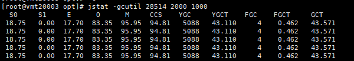
* Jmap  
  查看当前jvm中对象个数和大小  
  jmap -histo 28514  
  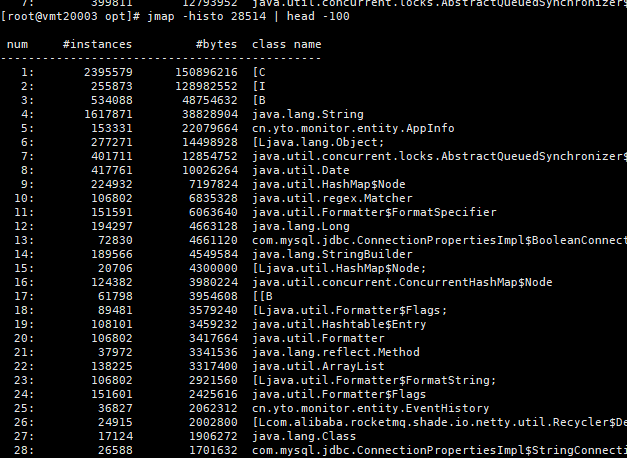  
  查看当前jvm内存占用情况  
  jmap -heap 28514  
  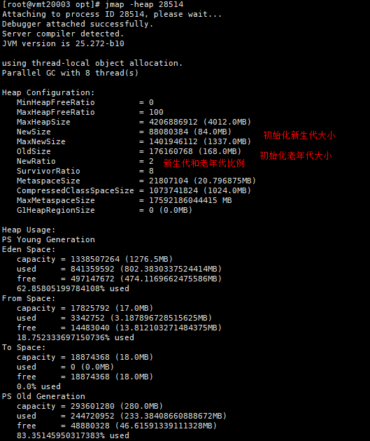  

* Jstack  
  查看当前线程的状态  
  jstack -l 28514
  

* Jcmd  
  综合命令  
  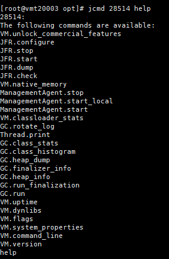
* jrunscript/jjs   
  可以用此命令执行js脚本或者执行js语句，这个命令不常用
  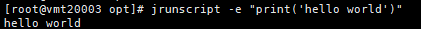  

## 1.2. 可视化工具  
需要开发jmx端口，在java启动时配置如下：    
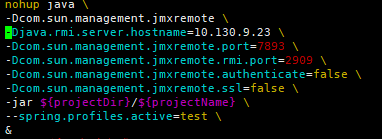
* Jconsole  
  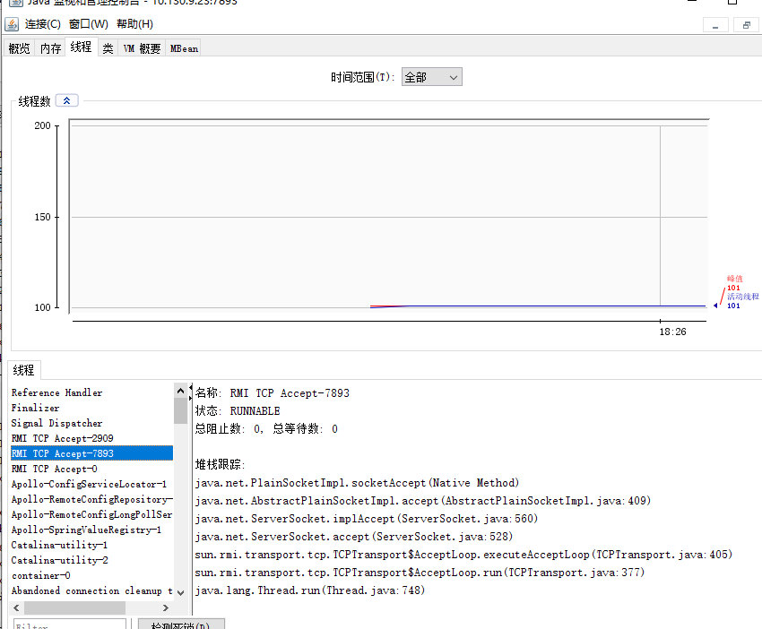
* Jvisualvm  
  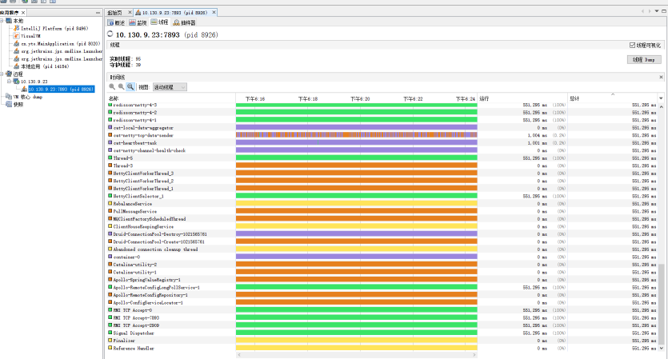

* VisualGC  
  idea可以安装的插件  
  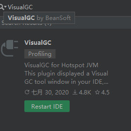
  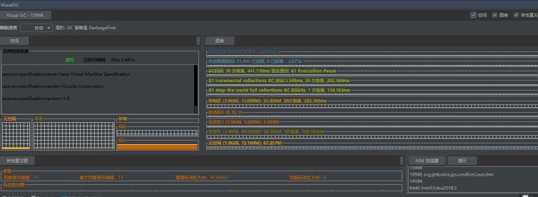

* Jmc  
  需要添加
  -XX:+UnlockCommercialFeatures \  
  -XX:+FlightRecorder \  
  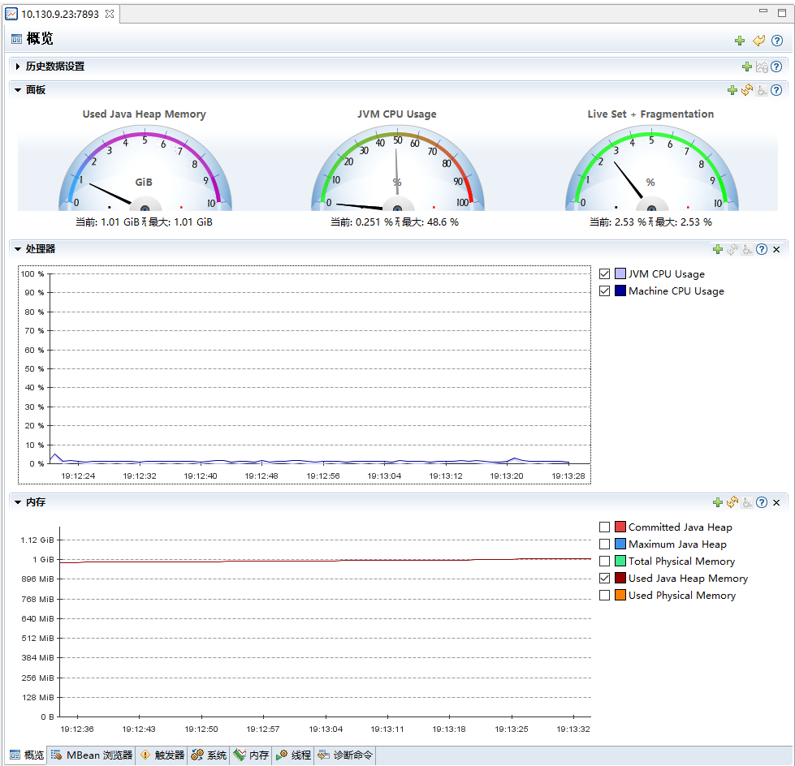
  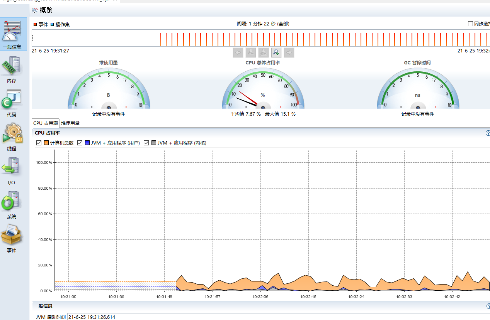  

## 2. 分析实践  

## 2.1. GC的分析
### 2.1.1. 如何打印gc日志：
使用该系统参数可以打印gc的日志  
-XX:+UseG1GC  
-Xms512m -Xmx512m  
-Xloggc:gc.demo.log  
-XX:+PrintGCDetails  
-XX:+PrintGCDateStamps  
-XX:+PrintGC
### 2.1.2. gc日志含义
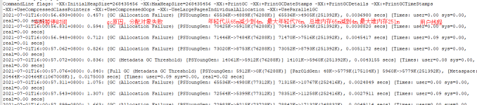
### 2.1.3. 日志工具
使用GCEasy、GCViewer工具可以分析gc日志  
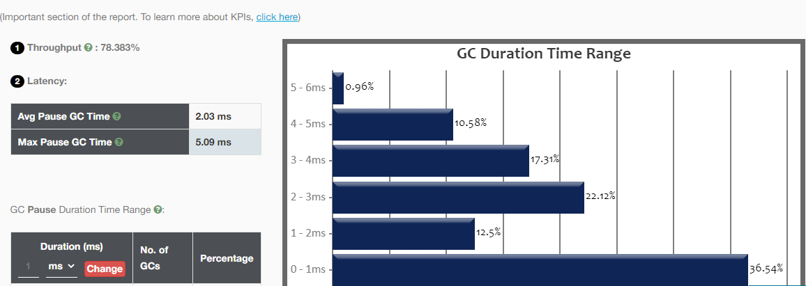  
### 2.1.4. gc常见调优策略  
* 当我们发现gc每次younggc效果不明显，gc的次数很多，每次回收的量不大，我们可以考虑适当增加年轻代的内存比率，让减少gc次数，每次回收的成功率加大
* 当我们发现gc的次数很快，fullgc的耗时很长，并且fullgc效果明显，考虑到fullgc更加影响性能，为了减少这个影响，可以增大年轻代大小，让对象尽可能不在old区被回收，因为一般情况old回收比较消耗性能。  

## 2.2. Thread的分析
### 2.2.1. jvm内部线程分类
* vm线程
* GC线程
* 编译器线程
* 信号线程，等待进程的信号，然后转化为java的信号
* 定时任务
### 2.2.2. jvm安全点
当所有的线程都处于安全点时，就叫做jvm处于安全点。  
当线程处于安全点时，线程栈不再发生变化

### 2.2.3. 日志解读
Jstack日志会在后续进行解读。

### 2.2.4. 日志工具
使用fastthread工具

## 2.3. 内存分析工具
### 2.3.1. 对象的结构
* 不同的类型在内存中的占用字节是不一样的。对象的占用内存：对象头+实例数据+补齐填充。
* 对象头由Mark Word和Class Pointer组成，Mark Word存储了对象的hashCode、GC信息、锁信息三部分，Class Pointer存储了指向类对象信息的指针。32位JVM上对象头占用的大小是8字节，64位JVM则是16字节，64位JVM默认会开启压缩ClassPointer指针占用的字节，会使得对象头的字节数降到12字节。
* 实例数据是由实际的数据+内存补齐构成，这样是为了内存的对接。使得最终的内存的占用满足8N。
* 二维数组占用很大，每一个项是按照一个object来算内存大小的。
* JVM会将字段进行主动重新排序来达到减少内存对其带来的浪费
* 如果一个对象加上头和数据19字节，那么它的实际大小为24字节，因为需要补齐
* 一个空的对象在内存中占用16字节

### 2.3.2. 常见OOM
* java.lang.OutOfMemoryError: Java heap space
新创建对象的时候，堆内存中不足以分配空间给这个对象了。一般需要将扩大堆内存的空间大小，或者减少这个内存的。

* OutOfMemoryError: PermGen space
class占用太大，可能要增加元数据区的大小。

* OutOfMemoryError: Unable to create new native thread
系统创建线程数达到了上限，可以增大系统允许最大线程数，降低创建线程的内存大小。

### 2.3.3. 分析工具
Jhat、ecplise分析工具指南

## 3. 总结