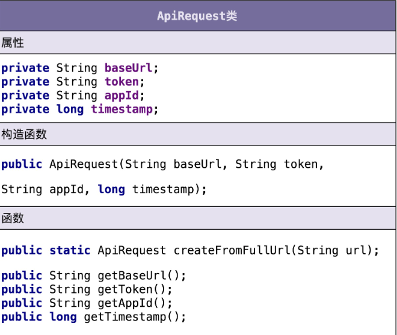
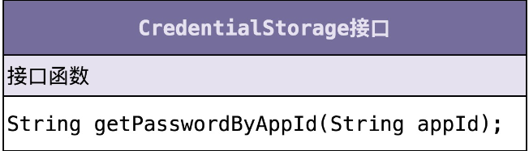
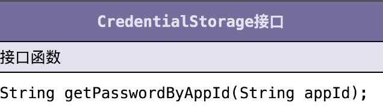
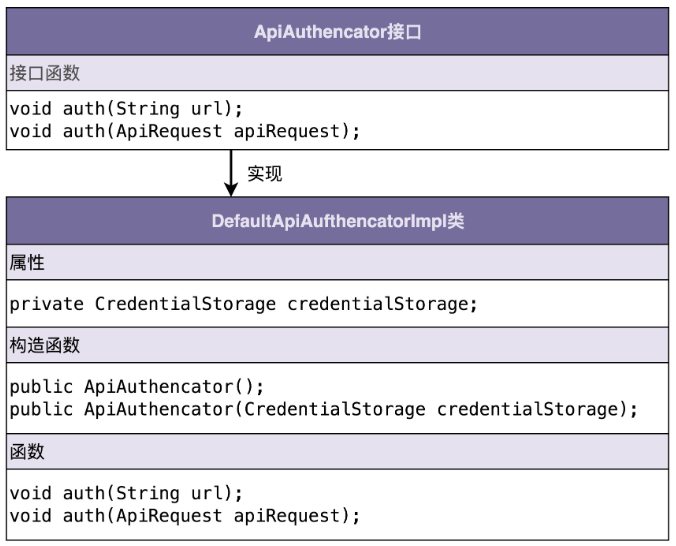
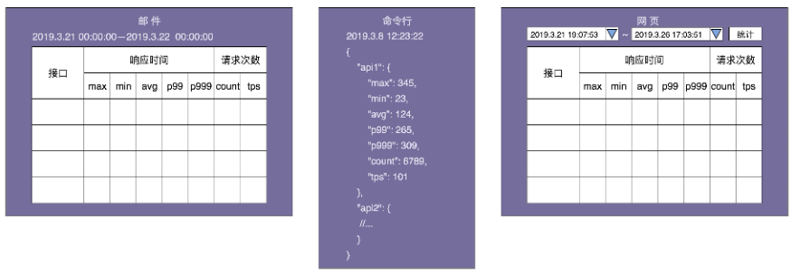
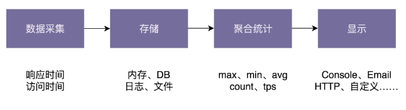

## 1. 代码质量

### 1.1. 总体的标准

代码质量的评价有很强的主观性，描述代码质量的词汇也有很多，比如可读性、可维护性、灵活、优雅、简洁。这些词汇是从不同的维度去评价代码质量的。它们之间有互相作用，并不是独立的，比如，代码的可读性好、可扩展性好就意味着代码的可维护性好。代码质量高低是一个综合各种因素得到的结论。我们并不能通过单一维度去评价一段代码的好坏。

### 1.2.  常用标准

最常用到几个评判代码质量的标准有：可维护性、可读性、可扩展性、灵活性、简洁性、可复用性、可测试性。其中，可维护性、可读性、可扩展性又是提到最多的、最重要的三个评价标准。


 

### 1.3. 如何做

要写出高质量代码，我们就需要掌握一些更加细化、更加能落地的编程方法论，这就包含面向对象设计思想、设计原则、设计模式、编码规范、重构技巧等。

## 2. 设计思想

### 3.1. 面向对象概述

现在，主流的编程范式或者编程风格有三种，它们分别是面向过程、面向对象和函数式编程。面向对象这种编程风格又是这其中最主流的。现在比较流行的编程语言大部分都是面向对象编程语言。大部分项目也都是基于面向对象编程风格开发的。面向对象编程因为其具有丰富的特性（封装、抽象、继承、多态），可以实现很多复杂的设计思路，是很多设计原则、设计模式编码实现的基础。

### 3.2. 面向对象四大特性

封装也叫作信息隐藏或者数据访问保护。类通过暴露有限的访问接口，授权外部仅能通过类提供的方法来访问内部信息或者数据。它需要编程语言提供权限访问控制语法来支持，例如 Java 中的 private、protected、public 关键字。封装特性存在的意义，一方面是保护数据不被随意修改，提高代码的可维护性；另一方面是仅暴露有限的必要接口，提高类的易用性。

如果说封装主要讲如何隐藏信息、保护数据，那抽象就是讲如何隐藏方法的具体实现，让使用者只需要关心方法提供了哪些功能，不需要知道这些功能是如何实现的。抽象可以通过接口类或者抽象类来实现。抽象存在的意义，一方面是修改实现不需要改变定义；另一方面，它也是处理复杂系统的有效手段，能有效地过滤掉不必要关注的信息。

继承用来表示类之间的 is-a 关系，分为两种模式：单继承和多继承。单继承表示一个子类只继承一个父类，多继承表示一个子类可以继承多个父类。为了实现继承这个特性，编程语言需要提供特殊的语法机制来支持。继承主要是用来解决代码复用的问题。

多态是指子类可以替换父类，在实际的代码运行过程中，调用子类的方法实现。多态这种特性也需要编程语言提供特殊的语法机制来实现，比如继承、接口类、duck-typing。多态可以提高代码的扩展性和复用性，是很多设计模式、设计原则、编程技巧的代码实现基础。

### 3.3. 面向对象 VS 面向过程

面向对象编程相比面向过程编程的优势主要有三个。

对于大规模复杂程序的开发，程序的处理流程并非单一的一条主线，而是错综复杂的网状结构。面向对象编程比起面向过程编程，更能应对这种复杂类型的程序开发。

面向对象编程相比面向过程编程，具有更加丰富的特性（封装、抽象、继承、多态）。利用这些特性编写出来的代码，更加易扩展、易复用、易维护。

从编程语言跟机器打交道方式的演进规律中，我们可以总结出：面向对象编程语言比起面向过程编程语言，更加人性化、更加高级、更加智能。

面向对象编程一般使用面向对象编程语言来进行，但是，不用面向对象编程语言，我们照样可以进行面向对象编程。反过来讲，即便我们使用面向对象编程语言，写出来的代码也不一定是面向对象编程风格的，也有可能是面向过程编程风格的。

面向对象和面向过程两种编程风格并不是非黑即白、完全对立的。在用面向对象编程语言开发的软件中，面向过程风格的代码并不少见，甚至在一些标准的开发库（比如 JDK、Apache Commons、Google Guava）中，也有很多面向过程风格的代码。

不管使用面向过程还是面向对象哪种风格来写代码，我们最终的目的还是写出易维护、易读、易复用、易扩展的高质量代码。只要我们能避免面向过程编程风格的一些弊端，控制好它的副作用，在掌控范围内为我们所用，我们就大可不用避讳在面向对象编程中写面向过程风格的代码。

### 3.4. 面向对象分析、设计与编程

面向对象分析（OOA）、面向对象设计（OOD）、面向对象编程（OOP），是面向对象开发的三个主要环节。简单点讲，面向对象分析就是要搞清楚做什么，面向对象设计就是要搞清楚怎么做，面向对象编程就是将分析和设计的的结果翻译成代码的过程。

需求分析的过程实际上是一个不断迭代优化的过程。我们不要试图一下就给出一个完美的解决方案，而是先给出一个粗糙的、基础的方案，有一个迭代的基础，然后再慢慢优化。这样一个思考过程能让我们摆脱无从下手的窘境。

面向对象设计和实现要做的事情就是把合适的代码放到合适的类中。至于到底选择哪种划分方法，判定的标准是让代码尽量地满足“松耦合、高内聚”、单一职责、对扩展开放对修改关闭等我们之前讲到的各种设计原则和思想，尽量地做到代码可复用、易读、易扩展、易维护。

面向对象分析的产出是详细的需求描述。面向对象设计的产出是类。在面向对象设计这一环节中，我们将需求描述转化为具体的类的设计。这个环节的工作可以拆分为下面四个部分。

划分职责进而识别出有哪些类

根据需求描述，我们把其中涉及的功能点，一个一个罗列出来，然后再去看哪些功能点职责相近，操作同样的属性，可否归为同一个类。

定义类及其属性和方法

我们识别出需求描述中的动词，作为候选的方法，再进一步过滤筛选出真正的方法，把功能点中涉及的名词，作为候选属性，然后同样再进行过滤筛选。

定义类与类之间的交互关系

UML 统一建模语言中定义了六种类之间的关系。它们分别是：泛化、实现、关联、聚合、组合、依赖。我们从更加贴近编程的角度，对类与类之间的关系做了调整，保留了四个关系：泛化、实现、组合、依赖。

将类组装起来并提供执行入口

我们要将所有的类组装在一起，提供一个执行入口。这个入口可能是一个 main() 函数，也可能是一组给外部用的 API 接口。通过这个入口，我们能触发整个代码跑起来。

### 3.5. 接口 VS 抽象类

抽象类不允许被实例化，只能被继承。它可以包含属性和方法。方法既可以包含代码实现，也可以不包含代码实现。不包含代码实现的方法叫作抽象方法。子类继承抽象类，必须实现抽象类中的所有抽象方法。接口不能包含属性（Java 可以定义静态常量），只能声明方法，方法不能包含代码实现（Java8 以后可以有默认实现）。类实现接口的时候，必须实现接口中声明的所有方法。

抽象类是对成员变量和方法的抽象，是一种 is-a 关系，是为了解决代码复用问题。接口仅仅是对方法的抽象，是一种 has-a 关系，表示具有某一组行为特性，是为了解决解耦问题，隔离接口和具体的实现，提高代码的扩展性。

什么时候该用抽象类？什么时候该用接口？实际上，判断的标准很简单。如果要表示一种 is-a 的关系，并且是为了解决代码复用问题，我们就用抽象类；如果要表示一种 has-a 关系，并且是为了解决抽象而非代码复用问题，那我们就用接口。

### 3.6. 基于接口而非实现编程

应用这条原则，可以将接口和实现相分离，封装不稳定的实现，暴露稳定的接口。上游系统面向接口而非实现编程，不依赖不稳定的实现细节，这样当实现发生变化的时候，上游系统的代码基本上不需要做改动，以此来降低耦合性，提高扩展性。

实际上，“基于接口而非实现编程”这条原则的另一个表述方式是，“基于抽象而非实现编程”。后者的表述方式其实更能体现这条原则的设计初衷。在软件开发中，最大的挑战之一就是需求的不断变化，这也是考验代码设计好坏的一个标准。

越抽象、越顶层、越脱离具体某一实现的设计，越能提高代码的灵活性，越能应对未来的需求变化。好的代码设计，不仅能应对当下的需求，而且在将来需求发生变化的时候，仍然能够在不破坏原有代码设计的情况下灵活应对。而抽象就是提高代码扩展性、灵活性、可维护性最有效的手段之一。

### 3.7. 多用组合少用继承

**为什么不推荐使用继承？**

继承是面向对象的四大特性之一，用来表示类之间的 is-a 关系，可以解决代码复用的问题。虽然继承有诸多作用，但继承层次过深、过复杂，也会影响到代码的可维护性。在这种情况下，我们应该尽量少用，甚至不用继承。

**组合相比继承有哪些优势？**

继承主要有三个作用：表示 is-a 关系、支持多态特性、代码复用。而这三个作用都可以通过组合、接口、委托三个技术手段来达成。除此之外，利用组合还能解决层次过深、过复杂的继承关系影响代码可维护性的问题。

**如何判断该用组合还是继承？**

尽管我们鼓励多用组合少用继承，但组合也并不是完美的，继承也并非一无是处。在实际的项目开发中，我们还是要根据具体的情况，来选择该用继承还是组合。如果类之间的继承结构稳定，层次比较浅，关系不复杂，我们就可以大胆地使用继承。反之，我们就尽量使用组合来替代继承。除此之外，还有一些设计模式、特殊的应用场景，会固定使用继承或者组合。

### 3.8. 贫血模型 VS 充血模型

我们平时做 Web 项目的业务开发，大部分都是基于贫血模型的 MVC 三层架构，在专栏中我把它称为传统的开发模式。之所以称之为“传统”，是相对于新兴的基于充血模型的 DDD 开发模式来说的。基于贫血模型的传统开发模式，是典型的面向过程的编程风格。相反，基于充血模型的 DDD 开发模式，是典型的面向对象的编程风格。

不过，DDD 也并非银弹。对于业务不复杂的系统开发来说，基于贫血模型的传统开发模式简单够用，基于充血模型的 DDD 开发模式有点大材小用，无法发挥作用。相反，对于业务复杂的系统开发来说，基于充血模型的 DDD 开发模式，因为前期需要在设计上投入更多时间和精力，来提高代码的复用性和可维护性，所以相比基于贫血模型的开发模式，更加有优势。

基于充血模型的 DDD 开发模式跟基于贫血模型的传统开发模式相比，主要区别在 Service 层。在基于充血模型的开发模式下，我们将部分原来在 Service 类中的业务逻辑移动到了一个充血的 Domain 领域模型中，让 Service 类的实现依赖这个 Domain 类。不过，Service 类并不会完全移除，而是负责一些不适合放在 Domain 类中的功能。比如，负责与 Repository 层打交道、跨领域模型的业务聚合功能、幂等事务等非功能性的工作。

基于充血模型的 DDD 开发模式跟基于贫血模型的传统开发模式相比，Controller 层和 Repository 层的代码基本上相同。这是因为，Repository 层的 Entity 生命周期有限，Controller 层的 VO 只是单纯作为一种 DTO。两部分的业务逻辑都不会太复杂。业务逻辑主要集中在 Service 层。所以，Repository 层和 Controller 层继续沿用贫血模型的设计思路是没有问题的。

## 3. 设计原则

### 3.1. SOLID 原则：SRP 单一职责原则

一个类只负责完成一个职责或者功能。单一职责原则通过避免设计大而全的类，避免将不相关的功能耦合在一起，来提高类的内聚性。同时，类职责单一，类依赖的和被依赖的其他类也会变少，减少了代码的耦合性，以此来实现代码的高内聚、松耦合。但是，如果拆分得过细，实际上会适得其反，反倒会降低内聚性，也会影响代码的可维护性。

不同的应用场景、不同阶段的需求背景、不同的业务层面，对同一个类的职责是否单一，可能会有不同的判定结果。实际上，一些侧面的判断指标更具有指导意义和可执行性，比如，出现下面这些情况就有可能说明这类的设计不满足单一职责原则：

类中的代码行数、函数或者属性过多；

类依赖的其他类过多或者依赖类的其他类过多；

私有方法过多；

比较难给类起一个合适的名字；

类中大量的方法都是集中操作类中的某几个属性。

### 3.2.SOLID 原则：OCP 开闭原则

**如何理解“对扩展开放、修改关闭”？**

添加一个新的功能，应该是通过在已有代码基础上扩展代码（新增模块、类、方法、属性等），而非修改已有代码（修改模块、类、方法、属性等）的方式来完成。关于定义，我们有两点要注意。第一点是，开闭原则并不是说完全杜绝修改，而是以最小的修改代码的代价来完成新功能的开发。第二点是，同样的代码改动，在粗代码粒度下，可能被认定为“修改”；在细代码粒度下，可能又被认定为“扩展”。

**如何做到“对扩展开放、修改关闭”？**

我们要时刻具备扩展意识、抽象意识、封装意识。在写代码的时候，我们要多花点时间思考一下，这段代码未来可能有哪些需求变更，如何设计代码结构，事先留好扩展点，以便在未来需求变更的时候，在不改动代码整体结构、做到最小代码改动的情况下，将新的代码灵活地插入到扩展点上。

很多设计原则、设计思想、设计模式，都是以提高代码的扩展性为最终目的的。特别是 23 种经典设计模式，大部分都是为了解决代码的扩展性问题而总结出来的，都是以开闭原则为指导原则的。最常用来提高代码扩展性的方法有：多态、依赖注入、基于接口而非实现编程，以及大部分的设计模式（比如，装饰、策略、模板、职责链、状态）。

### 3.3.SOLID 原则：LSP 里式替换原则

子类对象（object of subtype/derived class）能够替换程序（program）中父类对象（object of base/parent class）出现的任何地方，并且保证原来程序的逻辑行为（behavior）不变及正确性不被破坏。

里式替换原则是用来指导继承关系中子类该如何设计的一个原则。理解里式替换原则，最核心的就是理解“design by contract，按照协议来设计”这几个字。父类定义了函数的“约定”（或者叫协议），那子类可以改变函数的内部实现逻辑，但不能改变函数的原有“约定”。这里的“约定”包括：函数声明要实现的功能；对输入、输出、异常的约定；甚至包括注释中所罗列的任何特殊说明。

理解这个原则，我们还要弄明白，里式替换原则跟多态的区别。虽然从定义描述和代码实现上来看，多态和里式替换有点类似，但它们关注的角度是不一样的。多态是面向对象编程的一大特性，也是面向对象编程语言的一种语法。它是一种代码实现的思路。而里式替换是一种设计原则，用来指导继承关系中子类该如何设计，子类的设计要保证在替换父类的时候，不改变原有程序的逻辑及不破坏原有程序的正确性。

### 3.4.SOLID 原则：ISP 接口隔离原则

接口隔离原则的描述是：客户端不应该强迫依赖它不需要的接口。其中的“客户端”，可以理解为接口的调用者或者使用者。理解“接口隔离原则”的重点是理解其中的“接口”二字。这里有三种不同的理解。

如果把“接口”理解为一组接口集合，可以是某个微服务的接口，也可以是某个类库的接口等。如果部分接口只被部分调用者使用，我们就需要将这部分接口隔离出来，单独给这部分调用者使用，而不强迫其他调用者也依赖这部分不会被用到的接口。

如果把“接口”理解为单个 API 接口或函数，部分调用者只需要函数中的部分功能，那我们就需要把函数拆分成粒度更细的多个函数，让调用者只依赖它需要的那个细粒度函数。

如果把“接口”理解为 OOP 中的接口，也可以理解为面向对象编程语言中的接口语法。那接口的设计要尽量单一，不要让接口的实现类和调用者，依赖不需要的接口函数。

单一职责原则针对的是模块、类、接口的设计。接口隔离原则相对于单一职责原则，一方面更侧重于接口的设计，另一方面它的思考的角度也是不同的。接口隔离原则提供了一种判断接口的职责是否单一的标准：通过调用者如何使用接口来间接地判定。如果调用者只使用部分接口或接口的部分功能，那接口的设计就不够职责单一。

### 3.5.SOLID 原则：DIP 依赖倒置原则

**控制反转：**实际上，控制反转是一个比较笼统的设计思想，并不是一种具体的实现方法，一般用来指导框架层面的设计。这里所说的“控制”指的是对程序执行流程的控制，而“反转”指的是在没有使用框架之前，程序员自己控制整个程序的执行。在使用框架之后，整个程序的执行流程通过框架来控制。流程的控制权从程序员“反转”给了框架。

**依赖注入：**依赖注入和控制反转恰恰相反，它是一种具体的编码技巧。我们不通过 new 的方式在类内部创建依赖类的对象，而是将依赖的类对象在外部创建好之后，通过构造函数、函数参数等方式传递（或“注入”）给类来使用。

**依赖注入框架：**我们通过依赖注入框架提供的扩展点，简单配置一下所有需要的类及其类与类之间的依赖关系，就可以实现由框架来自动创建对象、管理对象的生命周期、依赖注入等原本需要程序员来做的事情。

**依赖反转原则：**依赖反转原则也叫作依赖倒置原则。这条原则跟控制反转有点类似，主要用来指导框架层面的设计。高层模块不依赖低层模块，它们共同依赖同一个抽象。抽象不需要依赖具体实现细节，具体实现细节依赖抽象。

### 3.6.KISS、YAGNI 原则

KISS 原则的中文描述是：尽量保持简单。KISS 原则是保持代码可读和可维护的重要手段。KISS 原则中的“简单“”并不是以代码行数来考量的。代码行数越少并不代表代码越简单，我们还要考虑逻辑复杂度、实现难度、代码的可读性等。而且，本身就复杂的问题，用复杂的方法解决，也并不违背 KISS 原则。除此之外，同样的代码，在某个业务场景下满足 KISS 原则，换一个应用场景可能就不满足了。

对于如何写出满足 KISS 原则的代码，我总结了下面几条指导原则：

不要使用同事可能不懂的技术来实现代码；

不要重复造轮子，善于使用已经有的工具类库；

不要过度优化。

YAGNI 原则的英文全称是：You Ain’t Gonna Need It。直译就是：你不会需要它。这条原则也算是万金油了。当用在软件开发中的时候，它的意思是：不要去设计当前用不到的功能；不要去编写当前用不到的代码。实际上，这条原则的核心思想就是：不要做过度设计。

YAGNI 原则跟 KISS 原则并非一回事儿。KISS 原则讲的是“如何做”的问题（尽量保持简单），而 YAGNI 原则说的是“要不要做”的问题（当前不需要的就不要做）。

### 3.7.DRY 原则

DRY 原则中文描述是：不要重复自己，将它应用在编程中，可以理解为：不要写重复的代码。

专栏中讲到了三种代码重复的情况：实现逻辑重复、功能语义重复、代码执行重复。实现逻辑重复，但功能语义不重复的代码，并不违反 DRY 原则。实现逻辑不重复，但功能语义重复的代码，也算是违反 DRY 原则。而代码执行重复也算是违反 DRY 原则。

除此之外，我们还讲到了提高代码复用性的一些手段，包括：减少代码耦合、满足单一职责原则、模块化、业务与非业务逻辑分离、通用代码下沉、继承、多态、抽象、封装、应用模板等设计模式。复用意识也非常重要。在设计每个模块、类、函数的时候，要像设计一个外部 API 一样去思考它的复用性。

我们在第一次写代码的时候，如果当下没有复用的需求，而未来的复用需求也不是特别明确，并且开发可复用代码的成本比较高，那我们就不需要考虑代码的复用性。在之后开发新的功能的时候，发现可以复用之前写的这段代码，那我们就重构这段代码，让其变得更加可复用。

相比于代码的可复用性，DRY 原则适用性更强些。我们可以不写可复用的代码，但一定不能写重复的代码。

### 3.8.LOD 原则

**如何理解“高内聚、松耦合”？**

“高内聚、松耦合”是一个非常重要的设计思想，能够有效提高代码的可读性和可维护性，缩小功能改动导致的代码改动范围。“高内聚”用来指导类本身的设计，“松耦合”用来指导类与类之间依赖关系的设计。所谓高内聚，就是指相近的功能应该放到同一个类中，不相近的功能不要放到同一类中。相近的功能往往会被同时修改，放到同一个类中，修改会比较集中。所谓“松耦合”指的是，在代码中，类与类之间的依赖关系简单清晰。即使两个类有依赖关系，一个类的代码改动也不会或者很少导致依赖类的代码改动。

**如何理解“迪米特法则”？**

迪米特法则的描述为：不该有直接依赖关系的类之间，不要有依赖；有依赖关系的类之间，尽量只依赖必要的接口。迪米特法则是希望减少类之间的耦合，让类越独立越好。每个类都应该少了解系统的其他部分。一旦发生变化，需要了解这一变化的类就会比较少。

## 4. 规范与重构

### 4.1. 重构概述

**重构的目的：为什么重构（why）？**

对于项目来言，重构可以保持代码质量持续处于一个可控状态，不至于腐化到无可救药的地步。对于个人而言，重构非常锻炼一个人的代码能力，并且是一件非常有成就感的事情。它是我们学习的经典设计思想、原则、模式、编程规范等理论知识的练兵场。

**重构的对象：重构什么（what）？**

按照重构的规模，我们可以将重构大致分为大规模高层次的重构和小规模低层次的重构。大规模高层次重构包括对代码分层、模块化、解耦、梳理类之间的交互关系、抽象复用组件等等。这部分工作利用的更多的是比较抽象、比较顶层的设计思想、原则、模式。小规模低层次的重构包括规范命名、注释、修正函数参数过多、消除超大类、提取重复代码等编程细节问题，主要是针对类、函数级别的重构。小规模低层次的重构更多的是利用编码规范这一理论知识。

**重构的时机：什么时候重构（when）？**

我反复强调，我们一定要建立持续重构意识，把重构作为开发必不可少的部分融入到开发中，而不是等到代码出现很大问题的时候，再大刀阔斧地重构。

**重构的方法：如何重构（how）？**

大规模高层次的重构难度比较大，需要有组织、有计划地进行，分阶段地小步快跑，时刻保持代码处于一个可运行的状态。而小规模低层次的重构，因为影响范围小，改动耗时短，所以，只要你愿意并且有时间，随时随地都可以去做。

### 4.2. 单元测试

**什么是单元测试？**

单元测试是代码层面的测试，用于测试“自己”编写的代码的逻辑正确性。单元测试顾名思义是测试一个“单元”，这个“单元”一般是类或函数，而不是模块或者系统。

**为什么要写单元测试？**

单元测试能有效地发现代码中的 Bug、代码设计上的问题。写单元测试的过程本身就是代码重构的过程。单元测试是对集成测试的有力补充，能帮助我们快速熟悉代码，是 TDD 可落地执行的折中方案。

**如何编写单元测试？**

写单元测试就是针对代码设计覆盖各种输入、异常、边界条件的测试用例，并将其翻译成代码的过程。我们可以利用一些测试框架来简化测试代码的编写。对于单元测试，我们需要建立以下正确的认知：

编写单元测试尽管繁琐，但并不是太耗时；

我们可以稍微放低单元测试的质量要求；

覆盖率作为衡量单元测试好坏的唯一标准是不合理的；

写单元测试一般不需要了解代码的实现逻辑；

单元测试框架无法测试多半是代码的可测试性不好。

**单元测试为何难落地执行？**

一方面，写单元测试本身比较繁琐，技术挑战不大，很多程序员不愿意去写。另一方面，国内研发比较偏向“快糙猛”，容易因为开发进度紧，导致单元测试的执行虎头蛇尾，最后，没有建立对单元测试的正确认识，觉得可有可无，单靠督促很难执行得很好。

### 4.3. 代码的可测试性

**什么是代码的可测试性？**

粗略地讲，所谓代码的可测试性，就是针对代码编写单元测试的难易程度。对于一段代码，如果很难为其编写单元测试，或者单元测试写起来很费劲，需要依靠单元测试框架很高级的特性，那往往就意味着代码设计得不够合理，代码的可测试性不好。

**编写可测试性代码的最有效手段**

依赖注入是编写可测试性代码的最有效手段。通过依赖注入，我们在编写单元测试代码的时候，可以通过 mock 的方法将不可控的依赖变得可控，这也是我们在编写单元测试的过程中最有技术挑战的地方。除了 mock 方式，我们还可以利用二次封装来解决某些代码行为不可控的情况。

**常见的 Anti-Patterns**

典型的、常见的测试不友好的代码有下面这 5 种：

代码中包含未决行为逻辑；

滥用可变全局变量；

滥用静态方法；

使用复杂的继承关系；

高度耦合的代码。

### 4.4. 大型重构：解耦

**“解耦”为何如此重要？**

过于复杂的代码往往在可读性、可维护性上都不友好。解耦，保证代码松耦合、高内聚，是控制代码复杂度的有效手段。如果代码高内聚、松耦合，也就是意味着，代码结构清晰、分层、模块化合理、依赖关系简单、模块或类之间的耦合小，那代码整体的质量就不会差。

**代码是否需要“解耦”？**

间接的衡量标准有很多，比如：改动一个模块或类的代码受影响的模块或类是否有很多、改动一个模块或者类的代码依赖的模块或者类是否需要改动、代码的可测试性是否好等等。直接的衡量标准是把模块与模块之间及其类与类之间的依赖关系画出来，根据依赖关系图的复杂性来判断是否需要解耦重构。

**如何给代码“解耦”？**

给代码解耦的方法有：封装与抽象、中间层、模块化，以及一些其他的设计思想与原则，比如：单一职责原则、基于接口而非实现编程、依赖注入、多用组合少用继承、迪米特法则。当然，还有一些设计模式，比如观察者模式。

### 4.5. 小型重构：编码规范

前面我们讲了很多设计原则，后面还会讲到很多设计模式，利用好它们都可以有效地改善代码的质量。但是，这些知识的合理应用非常依赖个人经验，有时候用不好会适得其反。但是编码规范正好相反，大部分都简单明了，在代码的细节方面，能立竿见影地改善质量。除此之外，我们前面也讲到，持续低层次小规模重构依赖的基本上都是这些编码规范，也是改善代码可读性的有效手段。

根据我自己的开发经验，我总结罗列了 20 条我认为最应该关注、最好用的编码规范，分为三个大的方面：命名与注释（Naming and Comments）、代码风格（Code Style）、编程技巧（Coding Tips）。

**命名与注释**

命名的关键是能准确的达意。对于不同作用域的命名，我们可以适当的选择不同的长度，作用域小的命名，比如临时变量等，可以适当的选择短一些的命名方式。除此之外，命名中个也可以使用一些耳熟能详的缩写。

我们借助类的信息来简化属性、函数的命名，利用函数的信息来简化函数参数的命名。

命名要可读、可搜索。不要使用生僻的、不好读的英文单词来命名。除此之外，命名要符合项目的统一规范，也不要用些反直觉的命名。

接口有两种命名方式。一种是在接口中带前缀"I"，另一种是在接口的实现类中带后缀“Impl”。两种命名方式都可以，关键是要在项目中统一。对于抽象类的命名，我们更倾向于带有前缀“Abstract”。

注释的目的就是让代码更容易看懂，只要符合这个要求，你就可以写。总结一下的话，注释主要包含这样三个方面的内容：做什么、为什么、怎么做。对于一些复杂的类和接口，我们可能还需要写明“如何用”。

注释本身有一定的维护成本，所以并非越多越好。类和函数一定要写注释，而且要写的尽可能全面详细些，而函数内部的注释会相对少一些，一般都是靠好的命名和提炼函数、解释性变量、总结性注释来做到代码易读。

**代码风格**

代码风格都没有对错和优劣之分，不同的编程语言风格都不太一样，只要能在团队、项目中统一即可，不过，最好能跟业内推荐的风格、开源项目的代码风格相一致。所以，这里就不展开罗列了，你可以对照着自己熟悉的编程语言的代码风格，自己复习一下。

**编程技巧**

将复杂的逻辑提炼拆分成函数和类；

通过拆分成多个函数的方式来处理参数过多的情况；

通过将参数封装为对象来处理参数过多的情况；

函数中不要使用参数来做代码执行逻辑的控制；

移除过深的嵌套层次，方法包括：去掉多余的 if 或 else 语句，使用 continue、break、return 关键字提前退出嵌套，调整执行顺序来减少嵌套，将部分嵌套逻辑抽象成函数；

用字面常量取代魔法数；

利用解释性变量来解释复杂表达式。

**统一编码规范**

除了细节的知识点之外，最后，还有一条非常重要的，那就是，项目、团队，甚至公司，一定要制定统一的编码规范，并且通过 Code Review 督促执行，这对提高代码质量有立竿见影的效果。

## 5. 案例

### 5.1. 积分系统设计

#### 5.1.1. 需求分析

​	积分系统无外乎就两个大的功能点，一个是赚取积分，另一个是消费积分。赚取积分功能包括积分赚取渠道，比如下订单、每日签到、评论等；还包括积分兑换规则，比如订单金额与积分的兑换比例，每日签到赠送多少积分等。消费积分功能包括积分消费渠道，比如抵扣订单金额、兑换优惠券、积分换购、参与活动扣积分等；还包括积分兑换规则，比如多少积分可以换算成抵扣订单的多少金额，一张优惠券需要多少积分来兑换等等

​	在实际情况中，肯定还有一些业务细节需要考虑，比如积分的有效期问题。对于这些业务细节，还是那句话，闷头拍脑袋想是想不全面的。以防遗漏，我们还是要有方法可寻。那除了刚刚讲的“借鉴”的思路之外，我还喜欢通过产品的**线框图**、**用户用例**（user case ）或者叫用户故事（user story）来细化业务流程，挖掘一些比较细节的、不容易想到的功能点。

用户用例有点儿类似我们后面要讲的单元测试用例。它侧重情景化，其实就是模拟用户如何使用我们的产品，描述用户在一个特定的应用场景里的一个完整的业务操作流程。所以，它包含更多的细节，且更加容易被人理解。比如，有关积分有效期的用户用例，我们可以进行如下的设计：

用户在获取积分的时候，会告知积分的有效期；

用户在使用积分的时候，会优先使用快过期的积分；

用户在查询积分明细的时候，会显示积分的有效期和状态（是否过期）；

用户在查询总可用积分的时候，会排除掉过期的积分

* 积分赚取和兑换规则

  积分的赚取渠道包括：下订单、每日签到、评论等。

  积分兑换规则可以是比较通用的。比如，签到送 10 积分。再比如，按照订单总金额的 10% 兑换成积分，也就是 100 块钱的订单可以积累 10 积分。除此之外，积分兑换规则也可以是比较细化的。比如，不同的店铺、不同的商品，可以设置不同的积分兑换比例。

  对于积分的有效期，我们可以根据不同渠道，设置不同的有效期。积分到期之后会作废；在消费积分的时候，优先使用快到期的积分。

* 积分消费和兑换规则

  积分的消费渠道包括：抵扣订单金额、兑换优惠券、积分换购、参与活动扣积分等。

  我们可以根据不同的消费渠道，设置不同的积分兑换规则。比如，积分换算成消费抵扣金额的比例是 10%，也就是 10 积分可以抵扣 1 块钱；100 积分可以兑换 15 块钱的优惠券等。

* 积分及其明细查询

  查询用户的总积分，以及赚取积分和消费积分的历史记录

#### 5.1.2. 系统设计

* 划分模块

  面向对象设计的本质就是把合适的代码放到合适的类中。合理地划分代码可以实现代码的高内聚、低耦合，类与类之间的交互简单清晰，代码整体结构一目了然，那代码的质量就不会差到哪里去。类比面向对象设计，系统设计实际上就是将合适的功能放到合适的模块中。合理地划分模块也可以做到模块层面的高内聚、低耦合，架构整洁清晰。

  对于前面罗列的所有功能点，我们有下面三种模块划分方法。

  第一种划分方式是：积分赚取渠道及兑换规则、消费渠道及兑换规则的管理和维护（增删改查），不划分到积分系统中，而是放到更上层的营销系统中。这样积分系统就会变得非常简单，只需要负责增加积分、减少积分、查询积分、查询积分明细等这几个工作。

  我举个例子解释一下。比如，用户通过下订单赚取积分。订单系统通过异步发送消息或者同步调用接口的方式，告知营销系统订单交易成功。营销系统根据拿到的订单信息，查询订单对应的积分兑换规则（兑换比例、有效期等），计算得到订单可兑换的积分数量，然后调用积分系统的接口给用户增加积分。

  第二种划分方式是：积分赚取渠道及兑换规则、消费渠道及兑换规则的管理和维护，分散在各个相关业务系统中，比如订单系统、评论系统、签到系统、换购商城、优惠券系统等。还是刚刚那个下订单赚取积分的例子，在这种情况下，用户下订单成功之后，订单系统根据商品对应的积分兑换比例，计算所能兑换的积分数量，然后直接调用积分系统给用户增加积分。

  第三种划分方式是：所有的功能都划分到积分系统中，包括积分赚取渠道及兑换规则、消费渠道及兑换规则的管理和维护。还是同样的例子，用户下订单成功之后，订单系统直接告知积分系统订单交易成功，积分系统根据订单信息查询积分兑换规则，给用户增加积分。

  怎么判断哪种模块划分合理呢？实际上，我们可以反过来通过看它是否符合高内聚、低耦合特性来判断。如果一个功能的修改或添加，经常要跨团队、跨项目、跨系统才能完成，那说明模块划分的不够合理，职责不够清晰，耦合过于严重。

  除此之外，为了避免业务知识的耦合，让下层系统更加通用，一般来讲，我们不希望下层系统（也就是被调用的系统）包含太多上层系统（也就是调用系统）的业务信息，但是，可以接受上层系统包含下层系统的业务信息。比如，订单系统、优惠券系统、换购商城等作为调用积分系统的上层系统，可以包含一些积分相关的业务信息。但是，反过来，积分系统中最好不要包含太多跟订单、优惠券、换购等相关的信息。

  所以，综合考虑，我们更倾向于第一种和第二种模块划分方式。但是，不管选择这两种中的哪一种，积分系统所负责的工作是一样的，只包含积分的增、减、查询，以及积分明细的记录和查询。

* 交互关系

  在面向对象设计中，类设计好之后，我们需要设计类之间的交互关系。类比到系统设计，系统职责划分好之后，接下来就是设计系统之间的交互，也就是确定有哪些系统跟积分系统之间有交互以及如何进行交互。

  比较常见的系统之间的交互方式有两种，一种是同步接口调用，另一种是利用消息中间件异步调用。第一种方式简单直接，第二种方式的解耦效果更好。

  比如，用户下订单成功之后，订单系统推送一条消息到消息中间件，营销系统订阅订单成功消息，触发执行相应的积分兑换逻辑。这样订单系统就跟营销系统完全解耦，订单系统不需要知道任何跟积分相关的逻辑，而营销系统也不需要直接跟订单系统交互。

  除此之外，上下层系统之间的调用倾向于通过同步接口，同层之间的调用倾向于异步消息调用。比如，营销系统和积分系统是上下层关系，它们之间就比较推荐使用同步接口调用

* 模块本身

  业务系统的设计与开发，无外乎有这样三方面的工作要做：接口设计、数据库设计和业务模型设计（也就是业务逻辑）

  数据库和接口的设计非常重要，一旦设计好并投入使用之后，这两部分都不能轻易改动。改动数据库表结构，需要涉及数据的迁移和适配；改动接口，需要推动接口的使用者作相应的代码修改。这两种情况，即便是微小的改动，执行起来都会非常麻烦。因此，我们在设计接口和数据库的时候，一定要多花点心思和时间，切不可过于随意。相反，业务逻辑代码侧重内部实现，不涉及被外部依赖的接口，也不包含持久化的数据，所以对改动的容忍性更大

  * 数据模式

    数据库的设计比较简单。实际上，我们只需要一张记录积分流水明细的表就可以了。表中记录积分的赚取和消费流水。用户积分的各种统计数据，比如总积分、总可用积分等，都可以通过这张表来计算得到。

  * 接口设计

    接口设计要符合单一职责原则，粒度越小通用性就越好。但是，接口粒度太小也会带来一些问题。比如，一个功能的实现要调用多个小接口，一方面如果接口调用走网络（特别是公网），多次远程接口调用会影响性能；另一方面，本该在一个接口中完成的原子操作，现在分拆成多个小接口来完成，就可能会涉及分布式事务的数据一致性问题（一个接口执行成功了，但另一个接口执行失败了）。所以，为了兼顾易用性和性能，我们可以借鉴 facade（外观）设计模式，在职责单一的细粒度接口之上，再封装一层粗粒度的接口给外部使用

     

    

  * 业务模型

    前面我们讲到，从代码实现角度来说，大部分业务系统的开发都可以分为 Controller、Service、Repository 三层。Controller 层负责接口暴露，Repository 层负责数据读写，Service 层负责核心业务逻辑，也就是这里说的业务模型。

    除此之外，前面我们还提到两种开发模式，基于贫血模型的传统开发模式和基于充血模型的 DDD 开发模式。前者是一种面向过程的编程风格，后者是一种面向对象的编程风格。不管是 DDD 还是 OOP，高级开发模式的存在一般都是为了应对复杂系统，应对系统的复杂性。对于我们要开发的积分系统来说，因为业务相对比较简单，所以，选择简单的基于贫血模型的传统开发模式就足够了。

    从开发的角度来说，我们可以把积分系统作为一个独立的项目，来独立开发，也可以跟其他业务代码（比如营销系统）放到同一个项目中进行开发。从运维的角度来说，我们可以将它跟其他业务一块部署，也可以作为一个微服务独立部署。具体选择哪种开发和部署方式，我们可以参考公司当前的技术架构来决定。

    实际上，积分系统业务比较简单，代码量也不多，我更倾向于将它跟营销系统放到一个项目中开发部署。只要我们做好代码的模块化和解耦，让积分相关的业务代码跟其他业务代码之间边界清晰，没有太多耦合，后期如果需要将它拆分成独立的项目来开发部署，那也并不困难

    从设计的角度来说，VO、BO、Entity 的设计思路并不违反 DRY 原则，为了分层清晰、减少耦合，多维护几个类的成本也并不是不能接受的。但是，如果你真的有代码洁癖，对于代码重复的问题，我们可以通过继承或者组合来解决。

    如何进行数据对象之间的转化？最简单的方式就是手动复制。当然，你也可以使用 Java 中提供了数据对象转化工具，比如 BeanUtils、Dozer 等，可以大大简化繁琐的对象转化工作。

    尽管 VO、BO、Entity 的设计违背 OOP 的封装特性，有被随意修改的风险。但 Entity 和 VO 的生命周期是有限的，都仅限在本层范围内，相对来说是安全的。Service 层包含比较多的业务逻辑代码，所以 BO 就存在被任意修改的风险了。为了使用方便，我们只能做一些妥协，放弃 BO 的封装特性，由程序员自己来负责这些数据对象的不被错误使用

  * 系统分层

    为什么要分 MVC 三层开发

    分层能起到代码复用的作用

    分层能起到隔离变化的作用

    分层能起到隔离关注点的作用

    分层能提高代码的可测试性

    分层能应对系统的复杂性

#### 5.1.3. 小结

 

### 5.2. 接口鉴权设计

#### 5.2.1. 需求分析

* 调用方进行接口请求的时候，将 URL、AppID、密码、时间戳拼接在一起，通过加密算法生成 token，并且将 token、AppID、时间戳拼接在 URL 中，一并发送到微服务端。
* 微服务端在接收到调用方的接口请求之后，从请求中拆解出 token、AppID、时间戳。
* 微服务端首先检查传递过来的时间戳跟当前时间，是否在 token 失效时间窗口内。如果已经超过失效时间，那就算接口调用鉴权失败，拒绝接口调用请求。
* 如果 token 验证没有过期失效，微服务端再从自己的存储中，取出 AppID 对应的密码，通过同样的 token 生成算法，生成另外一个 token，与调用方传递过来的 token 进行匹配；如果一致，则鉴权成功，允许接口调用，否则就拒绝接口调用。

#### 5.2.2. 系统设计

面向对象分析的产出是详细的需求描述，那面向对象设计的产出就是类。在面向对象设计环节，我们将需求描述转化为具体的类的设计。我们把这一设计环节拆解细化一下，主要包含以下几个部分：

* 划分职责进而识别出有哪些类；

  读上面的需求描述，拆解成小的功能点，一条一条罗列下来：

  * 把 URL、AppID、密码、时间戳拼接为一个字符串；
  * 对字符串通过加密算法加密生成 token；
  * 将 token、AppID、时间戳拼接到 URL 中，形成新的 URL；
  * 解析 URL，得到 token、AppID、时间戳等信息；
  * 从存储中取出 AppID 和对应的密码；
  * 根据时间戳判断 token 是否过期失效；
  * 验证两个 token 是否匹配；

  我们发现，1、2、6、7 都是跟 token 有关，负责 token 的生成、验证；3、4 都是在处理 URL，负责 URL 的拼接、解析；5 是操作 AppID 和密码，负责从存储中读取 AppID 和密码。所以，我们可以粗略地得到三个核心的类：AuthToken、Url、CredentialStorage。AuthToken 负责实现 1、2、6、7 这四个操作；Url 负责 3、4 两个操作；CredentialStorage 负责 5 这个操作

  接口调用鉴权这个开发需求比较简单，所以，需求对应的面向对象设计并不复杂，识别出来的类也并不多。但如果我们面对的是更加大型的软件开发、更加复杂的需求开发，涉及的功能点可能会很多，对应的类也会比较多，像刚刚那样根据需求逐句罗列功能点的方法，最后会得到一个长长的列表，就会有点凌乱、没有规律。针对这种复杂的需求开发，我们首先要做的是进行模块划分，将需求先简单划分成几个小的、独立的功能模块，然后再在模块内部，应用我们刚刚讲的方法，进行面向对象设计。而模块的划分和识别，跟类的划分和识别，是类似的套路

* 定义类及其属性和方法；

  * AuthToken 类相关的功能点有四个

    把 URL、AppID、密码、时间戳拼接为一个字符串；

    对字符串通过加密算法加密生成 token；

    根据时间戳判断 token 是否过期失效；

    验证两个 token 是否匹配

     

    

  * Url 类相关的功能点有两个：

    将 token、AppID、时间戳拼接到 URL 中，形成新的 URL；

    解析 URL，得到 token、AppID、时间戳等信息

    虽然需求描述中，我们都是以 URL 来代指接口请求，但是，接口请求并不一定是以 URL 的形式来表达，还有可能是 dubbo RPC 等其他形式。为了让这个类更加通用，命名更加贴切，我们接下来把它命名为 ApiRequest。下面是我根据功能点描述设计的 ApiRequest 类

     

    

  * CredentialStorage 类相关的功能点有一个：

    从存储中取出 AppID 和对应的密码。

    CredentialStorage 类非常简单，类图如下所示。为了做到抽象封装具体的存储方式，我们将 CredentialStorage 设计成了接口，基于接口而非具体的实现编程

     

* 定义类与类之间的交互关系；

  类与类之间都哪些交互关系呢？UML 统一建模语言中定义了六种类之间的关系。它们分别是：泛化、实现、关联、聚合、组合、依赖。关系比较多，而且有些还比较相近，比如聚合和组合

  从更加贴近编程的角度，对类与类之间的关系做了调整，只保留了四个关系：泛化、实现、组合、依赖，这样你掌握起来会更加容易

  其中，泛化、实现、依赖的定义不变，组合关系替代 UML 中组合、聚合、关联三个概念，也就相当于重新命名关联关系为组合关系，并且不再区分 UML 中的组合和聚合两个概念。之所以这样重新命名，是为了跟我们前面讲的“多用组合少用继承”设计原则中的“组合”统一含义。只要 B 类对象是 A 类对象的成员变量，那我们就称，A 类跟 B 类是组合关系

* 将类组装起来并提供执行入口

  接口鉴权并不是一个独立运行的系统，而是一个集成在系统上运行的组件，所以，我们封装所有的实现细节，设计了一个最顶层的 ApiAuthencator 接口类，暴露一组给外部调用者使用的 API 接口，作为触发执行鉴权逻辑的入口

   

#### 5.2.3. 代码示例

已经定义清晰了类、属性、方法、类之间的交互，并且将所有的类组装起来，提供了统一的执行入口

```
public interface ApiAuthencator {
  void auth(String url);
  void auth(ApiRequest apiRequest);
}
public class DefaultApiAuthencatorImpl implements ApiAuthencator {
  private CredentialStorage credentialStorage;
  
  public ApiAuthencator() {
    this.credentialStorage = new MysqlCredentialStorage();
  }
  
  public ApiAuthencator(CredentialStorage credentialStorage) {
    this.credentialStorage = credentialStorage;
  }
  @Override
  public void auth(String url) {
    ApiRequest apiRequest = ApiRequest.buildFromUrl(url);
    auth(apiRequest);
  }
  @Override
  public void auth(ApiRequest apiRequest) {
    String appId = apiRequest.getAppId();
    String token = apiRequest.getToken();
    long timestamp = apiRequest.getTimestamp();
    String originalUrl = apiRequest.getOriginalUrl();
    AuthToken clientAuthToken = new AuthToken(token, timestamp);
    if (clientAuthToken.isExpired()) {
      throw new RuntimeException("Token is expired.");
    }
    String password = credentialStorage.getPasswordByAppId(appId);
    AuthToken serverAuthToken = AuthToken.generate(originalUrl, appId, password, timestamp);
    if (!serverAuthToken.match(clientAuthToken)) {
      throw new RuntimeException("Token verfication failed.");
    }
  }
}
```

#### 5.2.4. 小结

面向对象分析的产出是详细的需求描述。面向对象设计的产出是类。在面向对象设计这一环节中，我们将需求描述转化为具体的类的设计。这个环节的工作可以拆分为下面四个部分。

* **划分职责进而识别出有哪些类**

  根据需求描述，我们把其中涉及的功能点，一个一个罗列出来，然后再去看哪些功能点职责相近，操作同样的属性，可否归为同一个类。

* **定义类及其属性和方法**

  我们识别出需求描述中的动词，作为候选的方法，再进一步过滤筛选出真正的方法，把功能点中涉及的名词，作为候选属性，然后同样再进行过滤筛选。

* **定义类与类之间的交互关系**

  UML 统一建模语言中定义了六种类之间的关系。它们分别是：泛化、实现、关联、聚合、组合、依赖。我们从更加贴近编程的角度，对类与类之间的关系做了调整，保留四个关系：泛化、实现、组合、依赖。

* **将类组装起来并提供执行入口**

  我们要将所有的类组装在一起，提供一个执行入口。这个入口可能是一个 main() 函数，也可能是一组给外部用的 API 接口。通过这个入口，我们能触发整个代码跑起来

### 5.3. 钱包系统(DDD)设计

### 5.4. 计数器框架设计

#### 5.4.1. 需求背景

​	我们希望设计开发一个小的框架，能够获取接口调用的各种统计信息，比如，响应时间的最大值（max）、最小值（min）、平均值（avg）、百分位值（percentile）、接口调用次数（count）、频率（tps） 等，并且支持将统计结果以各种显示格式（比如：JSON 格式、网页格式、自定义显示格式等）输出到各种终端（Console 命令行、HTTP 网页、Email、日志文件、自定义输出终端等），以方便查看

​	性能计数器作为一个跟业务无关的功能，我们完全可以把它开发成一个独立的框架或者类库，集成到很多业务系统中。而作为可被复用的框架，除了功能性需求之外，非功能性需求也非常重要。所以，接下来，我们从这两个方面来做需求分析

#### 5.4.2. 功能需求

* 接口统计信息：包括接口响应时间的统计信息，以及接口调用次数的统计信息等。
* 统计信息的类型：max、min、avg、percentile、count、tps 等。
* 统计信息显示格式：Json、Html、自定义显示格式。
* 统计信息显示终端：Console、Email、HTTP 网页、日志、自定义显示终端。
* 借助设计产品的时候，经常用到的线框图，把最终数据的显示样式画出来，会更加一目了然

 

隐藏的需求：

* 统计触发方式

  包括主动和被动两种。主动表示以一定的频率定时统计数据，并主动推送到显示终端，比如邮件推送。被动表示用户触发统计，比如用户在网页中选择要统计的时间区间，触发统计，并将结果显示给用户。

* 统计时间区间

  框架需要支持自定义统计时间区间，比如统计最近 10 分钟的某接口的 tps、访问次数，或者统计 12 月 11 日 00 点到 12 月 12 日 00 点之间某接口响应时间的最大值、最小值、平均值等。

* 统计时间间隔

  对于主动触发统计，我们还要支持指定统计时间间隔，也就是多久触发一次统计显示。比如，每间隔 10s 统计一次接口信息并显示到命令行中，每间隔 24 小时发送一封统计信息邮件。

#### 5.4.3. 非功能需求

* 易用性

  易用性听起来更像是一个评判产品的标准。没错，我们在开发这样一个技术框架的时候，也要有产品意识。框架是否易集成、易插拔、跟业务代码是否松耦合、提供的接口是否够灵活等等，都是我们应该花心思去思考和设计的。有的时候，文档写得好坏甚至都有可能决定一个框架是否受欢迎。

* 性能

  对于需要集成到业务系统的框架来说，我们不希望框架本身的代码执行效率，对业务系统有太多性能上的影响。对于性能计数器这个框架来说，一方面，我们希望它是低延迟的，也就是说，统计代码不影响或很少影响接口本身的响应时间；另一方面，我们希望框架本身对内存的消耗不能太大。

* 扩展性

  这里说的扩展性跟之前讲到的代码的扩展性有点类似，都是指在不修改或尽量少修改代码的情况下添加新的功能。但是这两者也有区别。之前讲到的扩展是从框架代码开发者的角度来说的。这里所说的扩展是从框架使用者的角度来说的，特指使用者可以在不修改框架源码，甚至不拿到框架源码的情况下，为框架扩展新的功能。这就有点类似给框架开发插件。关于这一点，我举一个例子来解释一下。

  feign 是一个 HTTP 客户端框架，我们可以在不修改框架源码的情况下，用如下方式来扩展我们自己的编解码方式、日志、拦截器等。

  ```
  Feign feign = Feign.builder()
          .logger(new CustomizedLogger())
          .encoder(new FormEncoder(new JacksonEncoder()))
          .decoder(new JacksonDecoder())
          .errorDecoder(new ResponseErrorDecoder())
          .requestInterceptor(new RequestHeadersInterceptor()).build();
  public class RequestHeadersInterceptor implements RequestInterceptor {  
    @Override
    public void apply(RequestTemplate template) {
      template.header("appId", "...");
      template.header("version", "...");
      template.header("timestamp", "...");
      template.header("token", "...");
      template.header("idempotent-token", "...");
      template.header("sequence-id", "...");
  }
  public class CustomizedLogger extends feign.Logger {
    //...
  }
  public class ResponseErrorDecoder implements ErrorDecoder {
    @Override
    public Exception decode(String methodKey, Response response) {
      //...
    }
  }
  ```

* 容错性

  容错性这一点也非常重要。对于性能计数器框架来说，不能因为框架本身的异常导致接口请求出错。所以，我们要对框架可能存在的各种异常情况都考虑全面，对外暴露的接口抛出的所有运行时、非运行时异常都进行捕获处理

* 通用性

  为了提高框架的复用性，能够灵活应用到各种场景中。框架在设计的时候，要尽可能通用。我们要多去思考一下，除了接口统计这样一个需求，还可以适用到其他哪些场景中，比如是否还可以处理其他事件的统计信息，比如 SQL 请求时间的统计信息、业务统计信息（比如支付成功率）等

#### 5.4.4. 框架设计

对于性能计数器这个框架的开发来说，我们可以先聚焦于一个非常具体、简单的应用场景，比如统计用户注册、登录这两个接口的响应时间的最大值和平均值、接口调用次数，并且将统计结果以 JSON 的格式输出到命令行中。现在这个需求简单、具体、明确，设计实现起来难度降低了很多。

应用场景的代码：

```
// 应用场景：统计下面两个接口 (注册和登录）的响应时间和访问次数
public class UserController {
  public void register(UserVo user) {
    //...
  }
  
  public UserVo login(String telephone, String password) {
    //...
  }
}
```

要输出接口的响应时间的最大值、平均值和接口调用次数，我们首先要采集每次接口请求的响应时间，并且存储起来，然后按照某个时间间隔做聚合统计，最后才是将结果输出。在原型系统的代码实现中，我们可以把所有代码都塞到一个类中，暂时不用考虑任何代码质量、线程安全、性能、扩展性等等问题，怎么简单怎么来就行。

最小原型的代码实现如下所示。其中，recordResponseTime() 和 recordTimestamp() 两个函数分别用来记录接口请求的响应时间和访问时间。startRepeatedReport() 函数以指定的频率统计数据并输出结果。

```
public class Metrics {
  // Map 的 key 是接口名称，value 对应接口请求的响应时间或时间戳；
  private Map<String, List<Double>> responseTimes = new HashMap<>();
  private Map<String, List<Double>> timestamps = new HashMap<>();
  private ScheduledExecutorService executor = Executors.newSingleThreadScheduledExecutor();
  public void recordResponseTime(String apiName, double responseTime) {
    responseTimes.putIfAbsent(apiName, new ArrayList<>());
    responseTimes.get(apiName).add(responseTime);
  }
  public void recordTimestamp(String apiName, double timestamp) {
    timestamps.putIfAbsent(apiName, new ArrayList<>());
    timestamps.get(apiName).add(timestamp);
  }
  public void startRepeatedReport(long period, TimeUnit unit){
    executor.scheduleAtFixedRate(new Runnable() {
      @Override
      public void run() {
        Gson gson = new Gson();
        Map<String, Map<String, Double>> stats = new HashMap<>();
        for (Map.Entry<String, List<Double>> entry : responseTimes.entrySet()) {
          String apiName = entry.getKey();
          List<Double> apiRespTimes = entry.getValue();
          stats.putIfAbsent(apiName, new HashMap<>());
          stats.get(apiName).put("max", max(apiRespTimes));
          stats.get(apiName).put("avg", avg(apiRespTimes));
        }
  
        for (Map.Entry<String, List<Double>> entry : timestamps.entrySet()) {
          String apiName = entry.getKey();
          List<Double> apiTimestamps = entry.getValue();
          stats.putIfAbsent(apiName, new HashMap<>());
          stats.get(apiName).put("count", (double)apiTimestamps.size());
        }
        System.out.println(gson.toJson(stats));
      }
    }, 0, period, unit);
  }
  private double max(List<Double> dataset) {// 省略代码实现}
  private double avg(List<Double> dataset) {// 省略代码实现}
}
```

不到 50 行代码就实现了最小原型

如何用它来统计注册、登录接口的响应时间和访问次数。具体的代码如下所示：

```
// 应用场景：统计下面两个接口 (注册和登录）的响应时间和访问次数
public class UserController {
  private Metrics metrics = new Metrics();
  
  public UserController() {
    metrics.startRepeatedReport(60, TimeUnit.SECONDS);
  }
  public void register(UserVo user) {
    long startTimestamp = System.currentTimeMillis();
    metrics.recordTimestamp("regsiter", startTimestamp);
    //...
    long respTime = System.currentTimeMillis() - startTimestamp;
    metrics.recordResponseTime("register", respTime);
  }
  public UserVo login(String telephone, String password) {
    long startTimestamp = System.currentTimeMillis();
    metrics.recordTimestamp("login", startTimestamp);
    //...
    long respTime = System.currentTimeMillis() - startTimestamp;
    metrics.recordResponseTime("login", respTime);
  }
}
```

最小原型的代码实现虽然简陋，但它却帮我们将思路理顺了很多，我们现在就基于它做最终的框架设计。下面是我针对性能计数器框架画的一个粗略的系统设计图

 

整个框架分为四个模块：数据采集、存储、聚合统计、显示。每个模块负责的工作简单罗列如下。

* 数据采集

  负责打点采集原始数据，包括记录每次接口请求的响应时间和请求时间。数据采集过程要高度容错，不能影响到接口本身的可用性。除此之外，因为这部分功能是暴露给框架的使用者的，所以在设计数据采集 API 的时候，我们也要尽量考虑其易用性。

* 存储

  负责将采集的原始数据保存下来，以便后面做聚合统计。数据的存储方式有多种，比如：Redis、MySQL、HBase、日志、文件、内存等。数据存储比较耗时，为了尽量地减少对接口性能（比如响应时间）的影响，采集和存储的过程异步完成。

* 聚合统计

  负责将原始数据聚合为统计数据，比如：max、min、avg、pencentile、count、tps 等。为了支持更多的聚合统计规则，代码希望尽可能灵活、可扩展。

* 显示

  负责将统计数据以某种格式显示到终端，比如：输出到命令行、邮件、网页、自定义显示终端等。

### 5.5. ID生成器设计

### 5.6. 程序异常设计

### 5.7.计数器系统重构

### 5.8. ID生成器重构