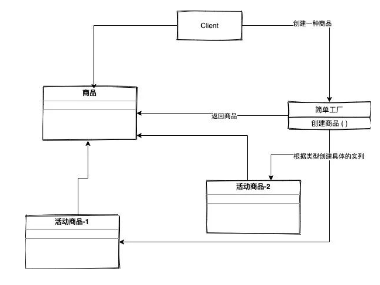
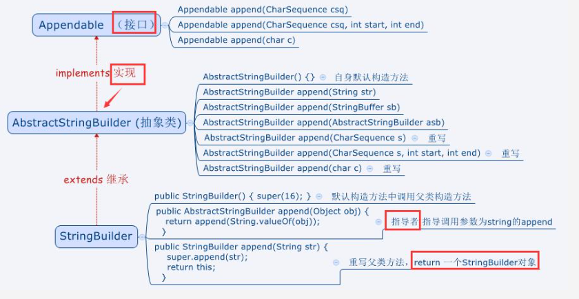

单例（Singleton），创造型方法，每次调用返回全局唯一对象  
参考https://zhuanlan.zhihu.com/p/48230750

* java.lang.Runtime#getRuntime()
* java.lang.System#getSecurityManager()


## 2. 单例模式  


## 3. 工厂模式

工厂模式主要可以分为三大类：

- 简单工厂模式
- 工厂方法模式
- 抽象工程模式

### 3.1. 简单工厂模式

jdk的工厂模式为：

* https://docs.oracle.com/javase/8/docs/api/java/nio/charset/Charset.html#forName-java.lang.String-
* https://docs.oracle.com/javase/8/docs/api/java/util/Calendar.html#getInstance--

工厂模式主要是用于对实现逻辑的封装，并且通过对公共的接口提供对象的实列画的服务，在我添加新的类时不需大动干戈，只要修改一点点就好。

 

在这个简单工厂里面，如果要创建活动商品1 以及活动商品2，我们要创建商品的时候只要调用简单工厂里面的创建商品方法，根据类型创建出不同的商品然后实列化返回就可以了

#### 3.1.1. 静态工厂模式

### 3.2. 工厂方法


### 3.3. 抽象工厂

https://docs.oracle.com/javase/8/docs/api/javax/xml/parsers/DocumentBuilderFactory.html#newInstance--

## 4. 建造者模式

  http://www.cnblogs.com/java-my-life/archive/2012/04/07/2433939.html

```
public static void main(String[]args){
        Builder builder = new ConcreteBuilder();
        Director director = new Director(builder);
        director.construct();
        Product product = builder.retrieveResult();
        System.out.println(product.getPart1());
        System.out.println(product.getPart2());
    }
```

 


## 5. 原型模式

http://www.cnblogs.com/java-my-life/archive/2012/04/11/2439387.html

```
   基本模式：
   ① 定义一个原型接口，如叫做抽象原型角色
    public interface Prototype{
        public Prototype clone();
        public String getName();
        public void setName(String name);
    }
②  实现抽象角色类， 定义具体原型类
    public class ConcretePrototype1 implements Prototype {
        public Prototype clone(){
            //最简单的克隆，新建一个自身对象，由于没有属性就不再复制值了
            Prototype prototype = new ConcretePrototype1();
            return prototype;
        }
    }
③ 客户端类
    public class Client {
        /**
         * 持有需要使用的原型接口对象
         */
        private Prototype prototype;
        /**
         * 构造方法，传入需要使用的原型接口对象
         */
        public Client(Prototype prototype){
            this.prototype = prototype;
        }
        public void operation(Prototype example){
            //需要创建原型接口的对象
            Prototype copyPrototype = prototype.clone();

        }
    }
    原型模式属于对象的创建模式。通过给出一个原型对象来指明所有创建的对象的类型，然后用复制这个原型对象的办法创建出更多同类型的对象。这就是选型模式的用意。


    原型模式的变种，登记原型模式
    public static void main(String[]args){
        try{
            Prototype p1 = new ConcretePrototype1();
            PrototypeManager.setPrototype("p1", p1);
            //获取原型来创建对象
            Prototype p3 = PrototypeManager.getPrototype("p1").clone();
            p3.setName("张三");
            System.out.println("第一个实例：" + p3);
            //有人动态的切换了实现
            Prototype p2 = new ConcretePrototype2();
            PrototypeManager.setPrototype("p1", p2);
            //重新获取原型来创建对象
            Prototype p4 = PrototypeManager.getPrototype("p1").clone();
            p4.setName("李四");
            System.out.println("第二个实例：" + p4);
            //有人注销了这个原型
            PrototypeManager.removePrototype("p1");
            //再次获取原型来创建对象
            Prototype p5 = PrototypeManager.getPrototype("p1").clone();
            p5.setName("王五");
            System.out.println("第三个实例：" + p5);
        }catch(Exception e){
            e.printStackTrace();
        }
    }

    登记模式相当于加了个原型管理器

            注意浅克隆和深克隆的区别
    浅克隆，只负责传递基本数据类型和string的值，对象的引用还是指向原来的对象。
    深克隆，加强版，对象引用指向新复制的对象。
    这个存在一个漏洞，如果出现了循环引用，深度克隆可能出现问题，会出现无限克隆
```

